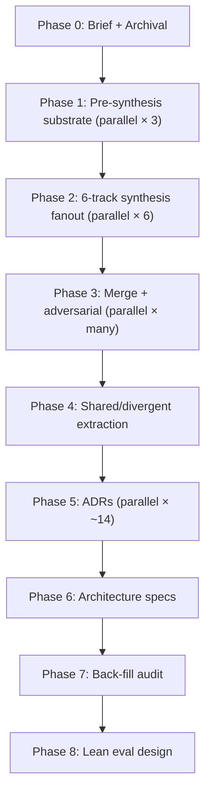
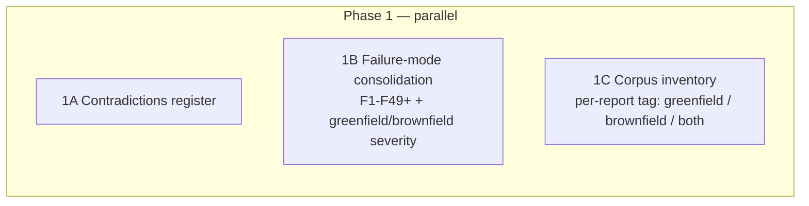
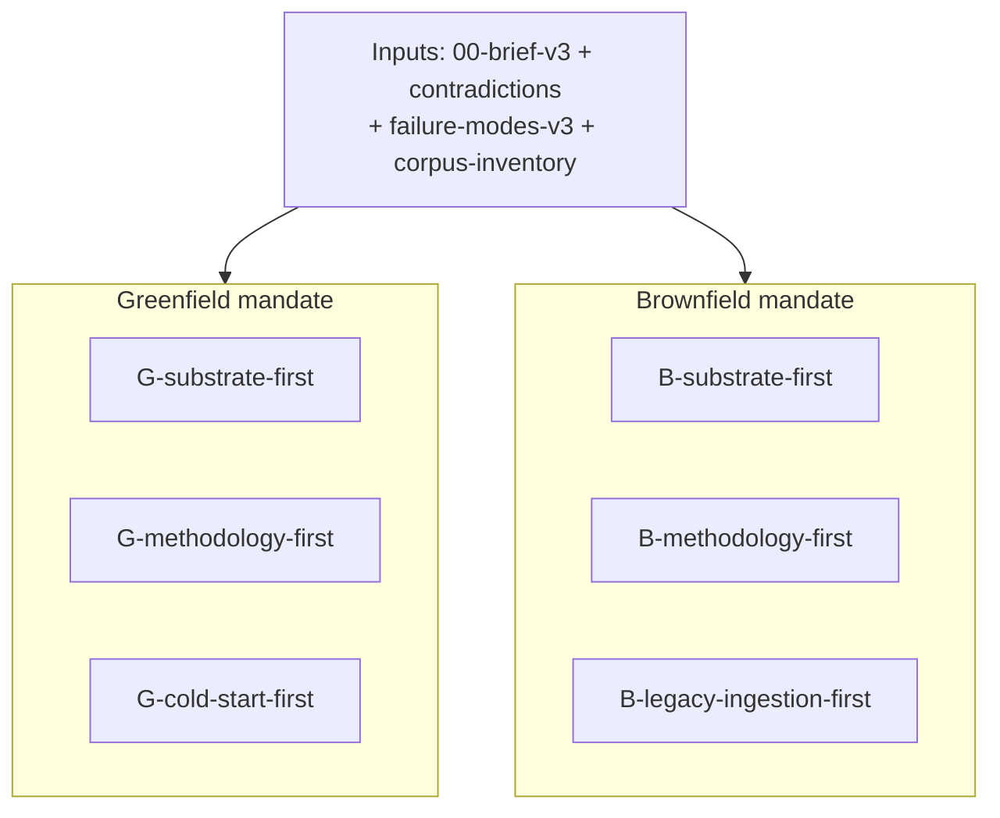
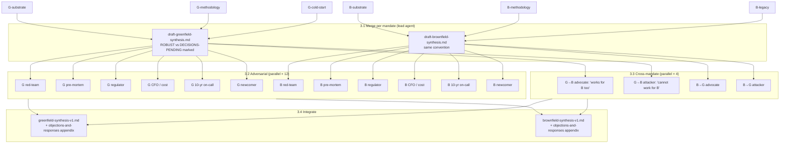
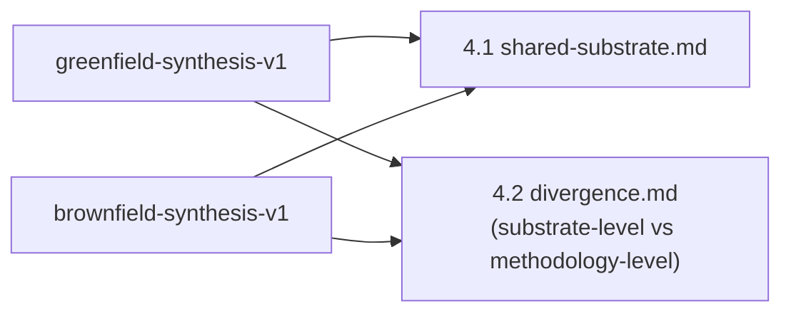
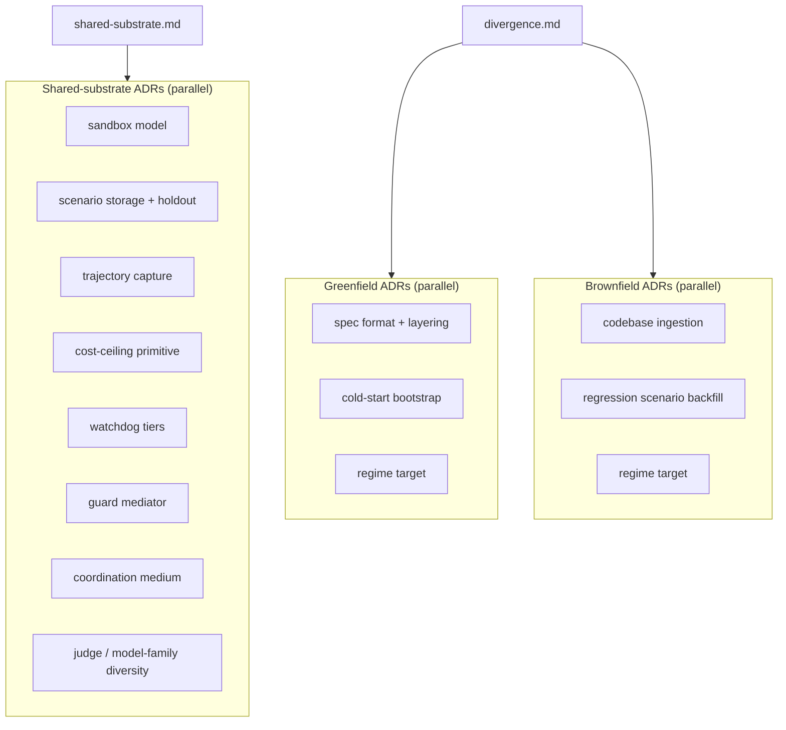
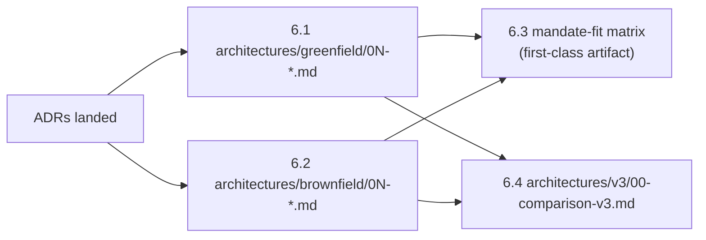
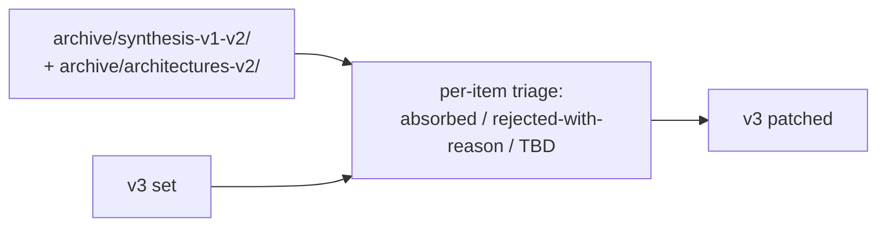

# Architecture v3 Synthesis Plan

**Status:** Active execution plan. Will be converted to a reusable skill after v3 completes.
**Owner:** lead agent (this file is the canonical execution doc; PLAN.md tracks the research-corpus drain; this plan tracks the synthesis-and-architecture-redesign work that follows).
**Companion docs:** [`research-plan.md`](research-plan.md) (proposal), [`AGENTS.md`](AGENTS.md) (conventions), [`PLAN`](research/PLAN.md) (corpus state).

---

## 0. North-star principle

**Accuracy ≫ speed ≫ tokens.** This step sets the direction for hundreds or thousands of hours of downstream work. Every bias guard, every adversarial pass, every checkpoint is justified by the asymmetric cost: a wrong synthesis is enormously expensive; an over-careful synthesis is only token-expensive.

Corollary: **default to more checks, not fewer**, when there's a choice. Default to **persona-diverse subagent review** rather than single-perspective review. Default to **archive-and-rebuild** rather than edit-in-place when there's a risk of silent anchoring.

---

## 1. Mandate

Produce a v3 architecture set that:

1. Cleanly separates **greenfield** and **brownfield** mandates (treated as potentially different solutions).
2. Tags every architecture with explicit **mandate-fit** (`greenfield` / `brownfield` / `both`), with `both` claims requiring affirmative justification.
3. Is built from the full post-Round-12 corpus (reports 01–38 + followups 01–14), not just the Round-1/Round-2 subset the existing syntheses were built on.
4. Surfaces contradictions, regime tensions (especially L5-as-target vs. lights-out mandate), and cold-start / brownfield-ingestion problems as first-class concerns.
5. Lands as ADRs + architecture spec files + a comparison doc + lean-evaluation briefs.

---

## 2. Working hypothesis (to test, not assume)

The user's hypothesis: *no single architecture will be strong at both mandates; greenfield is spec-malleable, brownfield is code-archaeological*.

**Discipline:** the plan treats this as a falsifiable hypothesis. The corpus may surprise us — Round-2's "substrate shared, methodology differs" framing leaves room for a substrate-heavy + thin-methodology architecture that works for both with different overlays. The plan must be able to *find* such an architecture if it exists, not rule it out structurally.

---

## 3. Bias-guard catalog

Persona-diverse subagent reviews are deployed at every phase, not just adversarial passes. Personas drawn from this catalog:

| Persona | What they argue / detect |
|---|---|
| **Skeptic / contrarian methodologist** | "What assumptions am I making?" Challenges premises. |
| **Naive newcomer** | Identifies jargon, hidden anchors, places where the doc smuggles in unstated context. |
| **Red-teamer** | Attacks the strongest claims using corpus evidence. |
| **Pre-mortemer** | "6 months later, this failed. Why?" |
| **Regulator** | Compliance / audit / liability lens. |
| **CFO / cost-conscious** | Token spend, infra cost, sustainability of ceilings. |
| **10-year on-call engineer** | Maintainability, debuggability under pressure. |
| **Domain practitioner** | Does this actually ship software, or just produce artifacts? |
| **Historian / prior-art auditor** | What earlier work did we miss? Where is the corpus thin? |
| **Splitter** | "Everything is different; over-sharing is the bug." |
| **Lumper** | "Everything is the same; over-splitting is the bug." |
| **Cross-mandate advocate** | "This architecture works for the OTHER mandate too — find the case." |
| **Cross-mandate attacker** | "This architecture CANNOT work for the other mandate." |
| **Anchor-detector** | Reads multiple independent drafts; flags places where they suspiciously agree (suggests they all inherited the same prior). |
| **Silent-absorption auditor** | Compares v3 output to archived v1/v2; flags content that leaked in unintentionally. |

Each phase below names the personas it deploys. **Add personas freely** if a phase surfaces a gap.

---

## 4. Phase plan



Each phase below: **goal**, **steps**, **bias guards**, **checkpoint** (where to pause for user review), **artifacts**.

---

### Phase 0 — Brief + Archival

**Goal.** Lock down the v3 brief; remove anchoring documents from the active tree.

**Steps:**
- 0.1 Extract user-given constraints from [`research-plan.md`](research-plan.md), [`AGENTS.md`](AGENTS.md), [`initial-sources.md`](initial-sources.md), and PR discussion history. Constraints only — *not* recommendations. → `architectures/v3/constraints-extracted.md`.
- 0.2 Draft the reframed brief. → `architectures/v3/00-brief-v3.md`. Carries: lights-out + greenfield + brownfield mandates, L5-vs-lights-out tension named openly, the user's working hypothesis (§2 above), explicit out-of-scope statements.
- 0.3 **[CHECKPOINT — user review of brief before archival]**
- 0.4 Archive existing 4 architectures → `archive/architectures-v2/` + `archive/architectures-v2/ARCHIVE.md` (one-paragraph why-archived per file).
- 0.5 Archive existing syntheses → `archive/synthesis-v1-v2/` + sibling `ARCHIVE.md`.
- 0.6 Archive [`research-plan.md`](research-plan.md) — its conclusions, not its constraints (those were extracted in 0.1).

**Bias guards:**
- After 0.2: dispatch **Skeptic** + **Naive newcomer** subagents to read the brief. Skeptic looks for buried assumptions; newcomer looks for jargon and hidden anchors. Both produce written critiques; brief revised before checkpoint.
- After 0.2: dispatch **Historian** subagent to identify constraints possibly stated in PR discussions or commit messages that we missed in 0.1.

**Artifacts:** `architectures/v3/constraints-extracted.md`, `architectures/v3/00-brief-v3.md`, `archive/architectures-v2/`, `archive/synthesis-v1-v2/`.

---

### Phase 1 — Pre-synthesis substrate (parallel)

**Goal.** Build inputs every Phase-2 track will consume identically.



**Steps:**
- 1A Contradictions register. Pairwise contradictions in the corpus, both sources cited, **no resolution attempted**. → `architectures/v3/contradictions.md`.
- 1B Failure-mode consolidation. Canonical F1–F49+ catalog; F36/F37 collision resolved per [`PLAN`](research/PLAN.md) §3.6 (lead-agent judgment, not subagent); severity ranking columns added for greenfield and brownfield separately. → `architectures/v3/failure-modes-v3.md` + supersede [`failure-modes`](architectures/failure-modes.md).
- 1C Corpus inventory. One-paragraph anchor per report (01–38) + per followup (01–14); each tagged `greenfield` / `brownfield` / `both`. → `architectures/v3/corpus-inventory.md`.

**Bias guards:**
- 1A.bias: **Uncomfortable-contradictions auditor** — subagent specifically hunts for contradictions we might have skipped because they undermine a corpus-popular position (e.g., L5-as-target vs. lights-out, OpenHands+Overstory vs. Gas Town as substrate).
- 1B.bias: **Missing-failure-modes auditor** — subagent argues for F-modes not in the catalog, citing corpus evidence. Findings either promoted or explicitly rejected with reason.
- 1C.bias: **Miscategorization auditor** — challenges the greenfield/brownfield tag on every report. Disputed tags get a `disputed:` annotation and surface to lead agent.

**Artifacts:** `contradictions.md`, `failure-modes-v3.md`, `corpus-inventory.md`.

---

### Phase 2 — Six-track parallel synthesis

**Goal.** Deliberate divergence. Six subagents, same inputs (brief + contradictions + failure modes + corpus inventory), six framings.



**Steps:**
- 2.1 Dispatch all 6 subagents in a single parallel-fanout message ([`parallel-subagent-fanout`](.claude/skills/parallel-subagent-fanout/SKILL.md) skill).
- 2.2 Each produces `architectures/v3/tracks/<mandate>-<framing>.md`.

**Subagent brief discipline:** identical inputs; each agent told the other 5 exist and is explicitly instructed *not* to be comprehensive — to be *strong on its axis*. Every claim cites the corpus inventory.

**Bias guards:**
- After all 6 land: **Anchor-detector** subagent reads all 6 in one shot. Flags places where independent tracks suspiciously agree on something not in the brief — that suggests Round-2-synthesis contamination, not honest convergence.
- After all 6 land: **Splitter** + **Lumper** debate pair argue over what the 6 actually showed. Their disagreements feed Phase-3 merge.

**Checkpoint:** lead-agent skim of all 6 before Phase 3 — confirm no track went off-mandate.

**Artifacts:** 6 track files + anchor-detector report + splitter/lumper debate.

---

### Phase 3 — Merge + adversarial (parallel × many)

**Goal.** Turn 6 divergent drafts into 2 mandate-specific synthesis drafts, each having survived a multi-persona adversarial pass.



**Steps:**
- 3.1 Merge per mandate. **Lead agent**, not subagent. Output marks each claim as ROBUST (all 3 tracks support it) or DECISIONS-PENDING (tracks diverge).
- 3.2 Dispatch 12 persona-adversarial subagents in two parallel batches of 6 (one per mandate). Each writes a critique against the draft.
- 3.3 Dispatch 4 cross-mandate subagents in parallel — the falsification test for the user's working hypothesis (§2).
- 3.4 Lead-agent integration: append objections-and-responses appendix to each synthesis. DECISIONS-PENDING items surfaced to user via `AskUserQuestion` before being marked resolved.

**Checkpoint:** before 3.4 publishes, lead agent surfaces every DECISIONS-PENDING item to user.

**Artifacts:** 2 merged synthesis drafts + 16 critique files + 2 final mandate-specific syntheses.

---

### Phase 4 — Shared-substrate extraction

**Goal.** Determine where greenfield and brownfield genuinely share substrate vs. where they diverge — and crucially, whether divergence reaches into the substrate (which strongly supports the user's hypothesis) or stays at the methodology layer (which leaves room for "both" architectures).



**Steps:**
- 4.1 Lead-agent diff. Produces `architectures/v3/shared-substrate.md`.
- 4.2 Lead-agent diff. Produces `architectures/v3/divergence.md` — explicitly tagged per item: `substrate-level divergence` or `methodology-level divergence`.

**Bias guards:**
- **Splitter** + **Lumper** debate pair (different instances from Phase 2). Splitter argues for *more* divergence than the lead agent found; Lumper argues for *more* sharing. Their findings feed a revision pass.
- **Substrate-vs-methodology classifier** subagent — independently classifies each divergence item; disagreements with lead agent surface for review.

**Artifacts:** `shared-substrate.md`, `divergence.md`, debate notes.

---

### Phase 5 — ADRs (parallel × ~14)

**Goal.** Every binding decision gets a draft ADR *before* the architecture prose names it as resolved.



**Steps:**
- 5.1 Wave 1: shared-substrate ADRs (8 in parallel via [`adr`](.claude/skills/adr/SKILL.md) skill).
- 5.2 Wave 2: mandate-specific ADRs (6 in parallel after wave 1 lands, so shared-substrate context is stable).

**Bias guards (per ADR):**
- **Alternatives advocate** subagent argues for the strongest alternative to each ADR's decision. If the ADR can't defend, it goes back for revision before being marked Accepted.
- **Archive-comparison** check: the "Alternatives considered" section of each ADR must explicitly engage with the relevant archived v1/v2 content (this is where the first wave of back-fill starts naturally).

**Artifacts:** `docs/adr/NNNN-*.md` × ~14.

---

### Phase 6 — Architecture spec authorship (C, from first principles)

**Goal.** Architecture specs derived from ADRs. Count is emergent. Greenfield and brownfield each produce 1, 2, or N architectures — not predetermined.



**Steps:**
- 6.1 Greenfield specs. Each carries YAML header: `mandate-fit: greenfield | both`. If `both`, third matrix column ("how does this resolve spec-malleable vs immutable-existing-architecture?") must be filled.
- 6.2 Brownfield specs. Same convention.
- 6.3 Mandate-fit matrix in the comparison doc — first-class section, not footnote.
- 6.4 Full comparison doc.

**Bias guards (per spec):**
- **Consolidator** subagent: "this should be merged with sibling X."
- **Splitter** subagent: "this should be split into 2."
- **"Both"-claim defender** + **"Both"-claim attacker** for every spec tagged `both` — earned, not assumed.
- **Cross-mandate adversarial pair** (from Phase 3, re-run against the v3 specs not the syntheses) to verify the mandate-fit tags survive contact with the actual specs.

**Artifacts:** architecture spec files + mandate-fit matrix + `00-comparison-v3.md`.

---

### Phase 7 — Back-fill audit

**Goal.** Now that v3 is internally consistent, deliberately re-read archived v1/v2 to check for things we lost.



**Steps:**
- 7.1 Lead-agent pass: enumerate every claim, framing, primitive, or recommendation in the archived material; classify as `absorbed`, `rejected (reason)`, or `TBD`.
- 7.2 TBD items surfaced to user.
- 7.3 Absorbed items folded into v3.

**Bias guards:**
- **Silent-absorption auditor** subagent compares final v3 to archive *independently* of the lead agent's classification. Disagreements surface — particularly cases where the lead agent classified something `rejected` that the auditor thinks slipped in anyway.
- **Historian** subagent: "what's in the archive that doesn't appear in v3 in any form?" Independent gap detection.

**Artifacts:** `architectures/v3/backfill-notes.md`, v3 set patched.

---

### Phase 8 — Lean eval design

**Goal.** Per [`research-plan`](research-plan.md) §6 (and v3's equivalent), design the 1-day manual evaluation for each chosen architecture *before* infrastructure work begins.

**Steps:**
- 8.1 One lean-eval brief per architecture in the v3 set. → `architectures/v3/lean-evals/<arch>.md`.

**Bias guards:**
- **Domain practitioner** subagent reviews each brief — "would this actually validate the discipline?"

---

## 5. File / directory conventions

```
architectures/v3/                  ← all v3 work-in-progress lives here
    constraints-extracted.md
    00-brief-v3.md
    contradictions.md
    failure-modes-v3.md
    corpus-inventory.md
    tracks/                        ← 6 Phase-2 track outputs
    shared-substrate.md
    divergence.md
    greenfield-synthesis-v1.md
    brownfield-synthesis-v1.md
    backfill-notes.md
    lean-evals/

architectures/greenfield/0N-*.md   ← Phase-6 greenfield specs
architectures/brownfield/0N-*.md   ← Phase-6 brownfield specs
architectures/00-comparison-v3.md  ← Phase-6 comparison doc

archive/architectures-v2/          ← Phase-0 archival
archive/synthesis-v1-v2/

docs/adr/NNNN-*.md                 ← Phase-5 ADRs (existing convention)
```

After v3 lands, the v2 `architectures/0N-*.md` and `architectures/failure-modes.md` are deleted from the live tree (preserved in `archive/`). The v3 specs become the canonical set.

---

## 6. Checkpoints (where to pause for user input)

| Phase | Checkpoint | What user reviews |
|---|---|---|
| 0.3 | After brief drafted, before archival | The brief itself |
| 1 end | After all 3 substrate artifacts | Contradictions register + failure-mode catalog + corpus inventory |
| 2 end | After 6 tracks land | Track-level sanity check |
| 3.4 | DECISIONS-PENDING items before integration | Every divergence between tracks |
| 4 end | After shared/divergent extraction | The boundary itself — load-bearing fact |
| 5 wave-1 end | After shared-substrate ADRs | Each ADR's Alternatives-considered |
| 5 wave-2 end | After mandate-specific ADRs | Same |
| 6 end | Before deletion of v2 architectures | Full v3 set + mandate-fit matrix |
| 7 end | After back-fill audit | TBD items |
| 8 end | Lean-eval briefs | Each brief before manual run |

---

## 7. Resumption protocol (cross-session)

This plan spans many sessions. To resume:

1. Read this file.
2. Read [`PLAN`](research/PLAN.md) for corpus-level state.
3. `git log --oneline -20` on the synthesis branch to see what's landed.
4. Check `architectures/v3/` for in-progress artifacts.
5. Identify the current phase from the checkpoint table above.
6. Continue.

Every phase ends with a commit + push. Each major artifact = a commit. Branch: `claude/nice-mccarthy-FIcXW` (or successor; the assigned dev branch).

---

## 8. Skill-extraction note

After v3 completes, this plan converts to a skill (working name: `architecture-vN-synthesis`). The skill's job: given (a) a research corpus, (b) a brief, (c) a previous architecture set, run the same 8-phase pipeline to produce v(N+1).

Pattern-extractable elements:
- The 8-phase shape (phases 0–8).
- The bias-guard catalog (§3).
- The mandate-tagging discipline (greenfield/brownfield/both, with `both` requiring affirmative justification).
- The archive-and-rebuild discipline.
- The persona-diverse subagent pattern at every phase, not just adversarial.
- The checkpoint pattern (§6).

Concrete v3 instantiation (specific reports, specific personas) becomes example material in the skill; the structure is the durable artifact.

---

*End of plan.*
