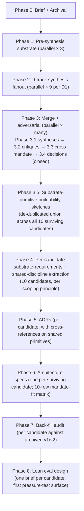
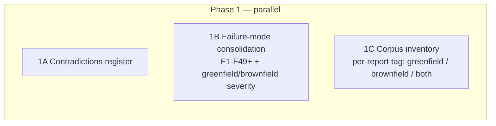
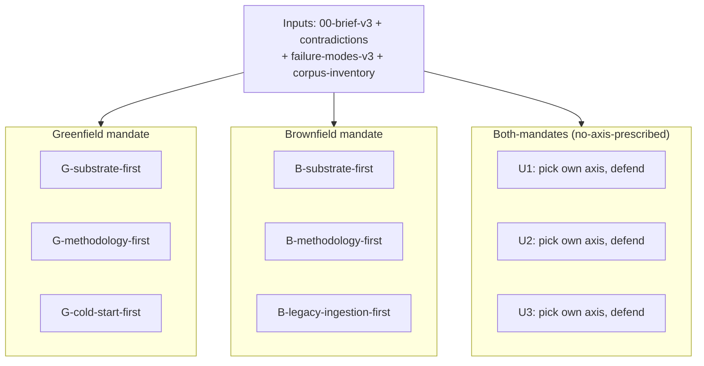
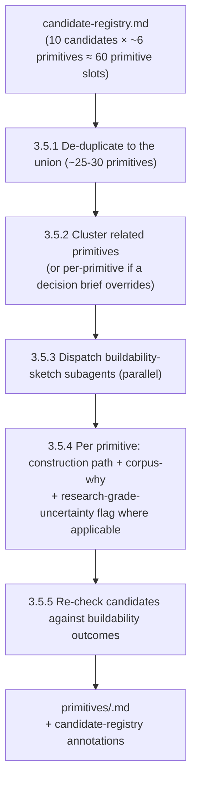
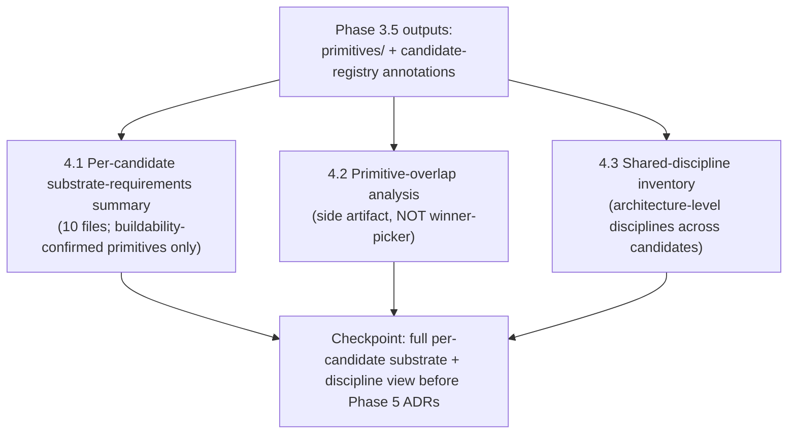
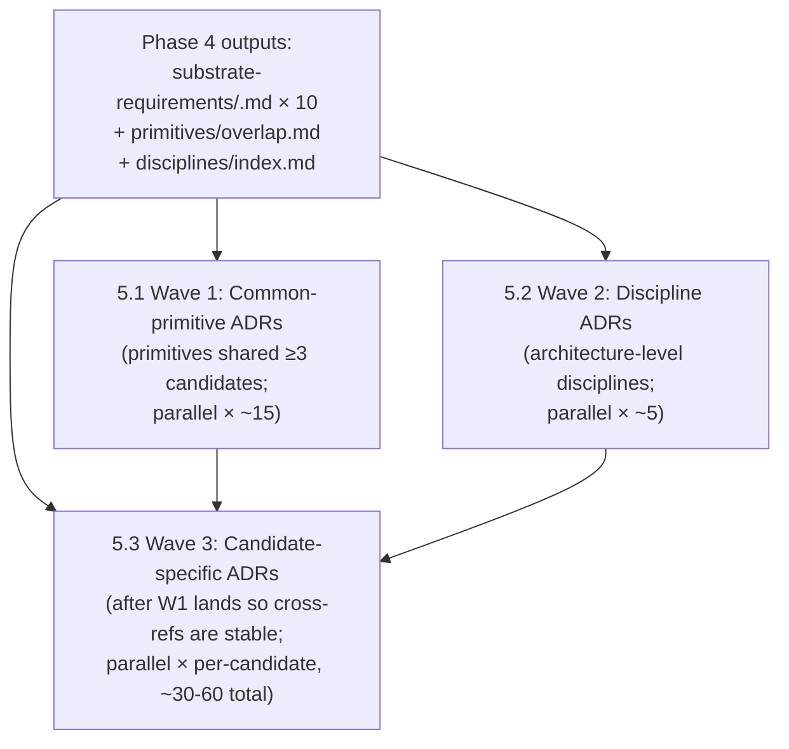
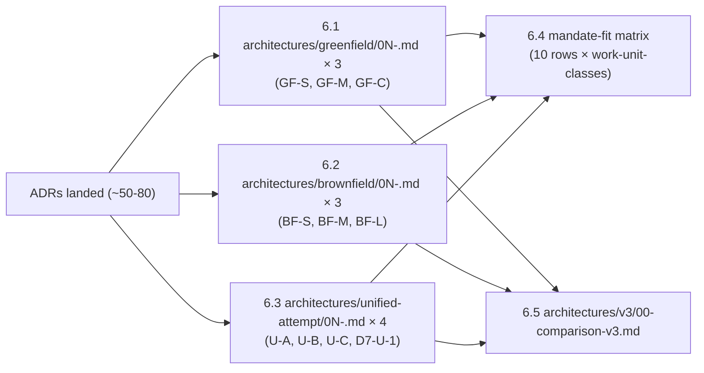
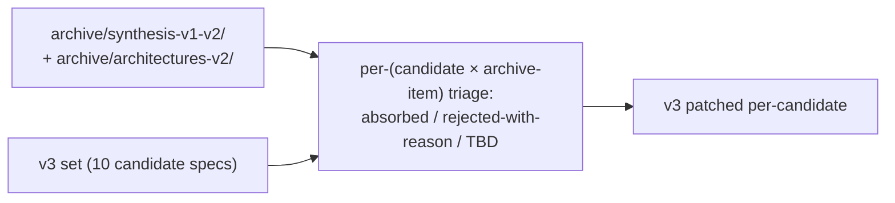

# Architecture v3 Synthesis Plan

**Current state:** Phase 3.4 closed (PR #134 merged 2026-05-25). Next work is Phase 3.5 (substrate-primitive buildability sketches).

**Status:** Active execution plan. Will be converted to a reusable skill after v3 completes.
**Revision history.** v1.0 — initial 8-phase plan with 6 Phase-2 tracks (committed in PR #124, merged 2026-05-23). v1.1 — Phase-0 bias-guard pass produced [`decisions-captured`](architectures/v3/decisions-captured.md) with D1 (Phase 2 expands to 9 tracks: 3+3+3), D2 (mandate-fit matrix is per-(architecture × work-unit-class)), D3 (§4 brief invariants relaxed to "defaults with explicit accept/challenge"), and D4 (lead-agent-authorized vocabulary / citation / definition fixes). v1.2 — Phase-3.4-close revision: (a) insert new Phase 3.5 (substrate-primitive buildability sketches per the two-part construction-path + corpus-why rule from [`phase-3.4-decisions-resolved.md`](architectures/v3/phase-3.4-decisions-resolved.md)); (b) rescope Phase 4 from "shared/divergent extraction over 3 syntheses" to "per-candidate substrate-requirements + shared-discipline extraction over 10 candidates" (per the scoping principle); (c) Phase 5–8 cascade — ADRs / architecture specs / back-fill / lean-evals are now scoped per surviving candidate; (d) withdraw the implicit GF → BF continuity matrix (per DEC-1.b entry-mode framing); (e) add working definitions of architecture / substrate / methodology / discipline (binding for downstream work). This file reflects v1.2.
**Owner:** lead agent (this file is the canonical execution doc; PLAN.md tracks the research-corpus drain; this plan tracks the synthesis-and-architecture-redesign work that follows).
**Companion docs:** [`research-plan.md`](archive/research-plan.md) (archived proposal), [`AGENTS.md`](AGENTS.md) (conventions), [`PLAN`](research/PLAN.md) (corpus state).

---

## 0. North-star principle

**Accuracy ≫ speed ≫ tokens.** This step sets the direction for hundreds or thousands of hours of downstream work. Every bias guard, every adversarial pass, every checkpoint is justified by the asymmetric cost: a wrong synthesis is enormously expensive; an over-careful synthesis is only token-expensive.

Corollary: **default to more checks, not fewer**, when there's a choice. Default to **persona-diverse subagent review** rather than single-perspective review. Default to **archive-and-rebuild** rather than edit-in-place when there's a risk of silent anchoring.

---

## 1. Mandate

Produce a v3 architecture set that:

1. Cleanly separates **greenfield** and **brownfield** mandates (treated as potentially different solutions).
2. Tags every architecture with explicit **mandate-fit** (`greenfield` / `brownfield` / `both`), with `both` claims requiring affirmative justification.
3. Is built from the full post-Round-12 corpus (reports 01–38 + followups 01–14), not just the Round-1/Round-2 subset the existing syntheses were built on.
4. Surfaces contradictions, regime tensions (especially L5-as-target vs. lights-out mandate), and cold-start / brownfield-ingestion problems as first-class concerns.
5. Lands as ADRs + architecture spec files + a comparison doc + lean-evaluation briefs.

---

## 2. Working hypothesis (to test, not assume)

**Refined at Phase 3.4 close (v1.2)** per [DEC-1.a](architectures/v3/phase-3.4-decisions-resolved.md#dec-1a--working-hypothesis-confirmed-as-hypothesis-not-axiom):

> *No methodology serves both mandates; substrates and disciplines do.*

This is held as a **falsifiable working hypothesis**, not an axiom. The four unified-attempt candidates (U-A, U-B, U-C, D7-U-1) carry forward as candidate methodologies *and* as active falsifiers. Phase-8 lean-evals (and downstream simulation) can overturn it: if a unified-attempt candidate demonstrates empirically that a single methodology fits both mandates, the hypothesis is falsified.

**Discipline:** the plan must be able to *find* such an architecture if it exists, not rule it out structurally. The scoping principle (carry every defensible candidate forward; do not eliminate at end-of-Phase-3) is the structural protection.

---

## 3. Bias-guard catalog

Persona-diverse subagent reviews are deployed at every phase, not just adversarial passes. Personas drawn from this catalog:

| Persona | What they argue / detect |
|---|---|
| **Skeptic / contrarian methodologist** | "What assumptions am I making?" Challenges premises. |
| **Naive newcomer** | Identifies jargon, hidden anchors, places where the doc smuggles in unstated context. |
| **Red-teamer** | Attacks the strongest claims using corpus evidence. |
| **Pre-mortemer** | "6 months later, this failed. Why?" |
| **Regulator** | Compliance / audit / liability lens. |
| **CFO / cost-conscious** | Token spend, infra cost, sustainability of ceilings. |
| **10-year on-call engineer** | Maintainability, debuggability under pressure. |
| **Domain practitioner** | Does this actually ship software, or just produce artifacts? |
| **Historian / prior-art auditor** | What earlier work did we miss? Where is the corpus thin? |
| **Splitter** | "Everything is different; over-sharing is the bug." |
| **Lumper** | "Everything is the same; over-splitting is the bug." |
| **Cross-mandate advocate** | "This architecture works for the OTHER mandate too — find the case." |
| **Cross-mandate attacker** | "This architecture CANNOT work for the other mandate." |
| **Anchor-detector** | Reads multiple independent drafts; flags places where they suspiciously agree (suggests they all inherited the same prior). |
| **Silent-absorption auditor** | Compares v3 output to archived v1/v2; flags content that leaked in unintentionally. |

Each phase below names the personas it deploys. **Add personas freely** if a phase surfaces a gap.

---

## 4. Phase plan



### Working definitions (binding for Phase 3.5 onward)

The terms **architecture**, **substrate**, **methodology**, and **discipline** are used throughout downstream phases. Their binding definitions live in [`phase-3.4-decisions-resolved.md` § Working definitions](architectures/v3/phase-3.4-decisions-resolved.md#working-definitions-architecture-substrate-methodology). Summary:

- **Substrate** — platform primitives the factory consumes. Each carries a contract, a construction path, a corpus-why, and at least one methodology that eventually uses it (the last is checked at the methodology-to-substrate matching stage, not at Phase 3.5).
- **Methodology** — the per-cycle process the factory runs against the substrate. Specifies unit-of-work, cycle shape, knowledge-accumulation pattern, error-handling protocol, and substrate-primitive contract references.
- **Architecture** — a named composition of (methodology(s) + substrate primitives + discipline binding them). A proposal at this stage; a deployment is a *realization* of an architecture.
- **Discipline** — how methodology calls into substrate; what invariants are maintained at boundaries; what happens at transitions. Architecture-level disciplines (three-layer citation, concrete-task, bias-guard, etc.) are separate from substrate primitives and from methodology choices.

**Greenfield vs. brownfield is entry-mode, not temporal** (per [DEC-1.b](architectures/v3/phase-3.4-decisions-resolved.md#dec-1b--greenfield--brownfield-artifact-continuity-na-lead-agent-misread-users-framing)). A greenfield system stays greenfield as long as the same methodology governs it; brownfield is the entry mode where the system arrives as legacy artifacts. **There is no GF → BF continuity matrix.** Long-run drift concerns against greenfield candidates are addressed within each candidate's own methodology.

Each phase below: **goal**, **steps**, **bias guards**, **checkpoint** (where to pause for user review), **artifacts**.

---

### Phase 0 — Brief + Archival

**Goal.** Lock down the v3 brief; remove anchoring documents from the active tree.

**Steps:**
- 0.1 ✅ Extract user-given constraints from [`research-plan.md`](archive/research-plan.md), [`AGENTS.md`](AGENTS.md), [`initial-sources.md`](initial-sources.md), and PR discussion history. Constraints only — *not* recommendations. → [`constraints-extracted`](architectures/v3/constraints-extracted.md).
- 0.2 Draft the reframed brief. → [`00-brief-v3`](architectures/v3/00-brief-v3.md). Carries: lights-out + greenfield + brownfield mandates, L5-vs-lights-out tension named openly, the user's working hypothesis (§2 above), explicit out-of-scope statements.
- 0.3 **[CHECKPOINT — user review of brief before archival]**
- 0.4 ✅ Archive existing 4 architectures → [`archive/architectures-v2/`](archive/architectures-v2/) + [`ARCHIVE`](archive/architectures-v2/ARCHIVE.md) (one-paragraph why-archived per file).
- 0.5 ✅ Archive existing syntheses → [`archive/synthesis-v1-v2/`](archive/synthesis-v1-v2/) + sibling [`ARCHIVE.md`](archive/synthesis-v1-v2/ARCHIVE.md).
- 0.6 ✅ Archive [`research-plan.md`](archive/research-plan.md) — its conclusions, not its constraints (those were extracted in 0.1).

**Bias guards:**
- After 0.2: dispatch **Skeptic** + **Naive newcomer** subagents to read the brief. Skeptic looks for buried assumptions; newcomer looks for jargon and hidden anchors. Both produce written critiques; brief revised before checkpoint.
- After 0.2: dispatch **Historian** subagent to identify constraints possibly stated in PR discussions or commit messages that we missed in 0.1.

**Artifacts:** [`constraints-extracted`](architectures/v3/constraints-extracted.md), [`00-brief-v3`](architectures/v3/00-brief-v3.md), `archive/architectures-v2/`, `archive/synthesis-v1-v2/`.

---

### Phase 1 — Pre-synthesis substrate (parallel)

**Goal.** Build inputs every Phase-2 track will consume identically.



**Steps:**
- 1A Contradictions register. Pairwise contradictions in the corpus, both sources cited, **no resolution attempted**. → [`contradictions`](architectures/v3/contradictions.md).
- 1B Failure-mode consolidation. Canonical F1–F49+ catalog; F36/F37 collision resolved per [`PLAN`](research/PLAN.md) §3.6 (lead-agent judgment, not subagent); severity ranking columns added for greenfield and brownfield separately. → [`failure-modes-v3`](architectures/v3/failure-modes-v3.md) + supersede the archived [`failure-modes`](archive/architectures-v2/failure-modes.md).
- 1C Corpus inventory. One-paragraph anchor per report (01–38) + per followup (01–14); each tagged `greenfield` / `brownfield` / `both`. → [`corpus-inventory`](architectures/v3/corpus-inventory.md).

**Bias guards:**
- 1A.bias: **Uncomfortable-contradictions auditor** — subagent specifically hunts for contradictions we might have skipped because they undermine a corpus-popular position (e.g., L5-as-target vs. lights-out, OpenHands+Overstory vs. Gas Town as substrate).
- 1B.bias: **Missing-failure-modes auditor** — subagent argues for F-modes not in the catalog, citing corpus evidence. Findings either promoted or explicitly rejected with reason.
- 1C.bias: **Miscategorization auditor** — challenges the greenfield/brownfield tag on every report. Disputed tags get a `disputed:` annotation and surface to lead agent.

**Artifacts:** `contradictions.md`, `failure-modes-v3.md`, `corpus-inventory.md`.

---

### Phase 2 — Nine-track parallel synthesis (per D1)

**Goal.** Deliberate divergence. **9 subagents** (3 greenfield + 3 brownfield + 3 both-mandates), same inputs (brief + contradictions + failure modes + corpus inventory), 9 framings. The 3 both-mandates tracks make the user's working hypothesis (UC4) genuinely falsifiable — without them, the structure would systematically fail to find a both-mandates architecture even if the corpus supports one (Skeptic finding #3).



**Steps:**
- 2.1 Dispatch all 9 subagents in a single parallel-fanout message ([`parallel-subagent-fanout`](.claude/skills/parallel-subagent-fanout/SKILL.md) skill).
- 2.2 Each produces `architectures/v3/tracks/<mandate>-<framing>.md`. Both-mandates tracks: `architectures/v3/tracks/unified-<axis-name>.md`.

**Subagent brief discipline:**

*For the 6 mandate-specific tracks:* identical inputs; each agent told the other 8 exist and is explicitly instructed *not* to be comprehensive — to be *strong on its axis*. Every claim cites the corpus inventory. Greenfield tracks must include a mandatory `## Cold-start` section per §5 of [`00-brief-v3`](architectures/v3/00-brief-v3.md).

*For the 3 both-mandates tracks:* identical inputs; each given the explicit instruction *"Find ONE architecture that addresses both mandates. Pick your own organizing axis — mandate is NOT required to be primary. Defend the axis choice. The other 8 tracks exist for a reason; you do not need to be comprehensive — you need to be strong on the unified case."* The three are expected to pick different axes; that divergence is the signal.

*Universal discipline for all 9:* each track output must include a `## §4 defaults: accepted vs challenged` section per D3, marking each of D-1 through D-7 as `accepted with justification` or `challenged` with corpus evidence.

**Bias guards:**
- After all 9 land: **Anchor-detector** subagent reads all 9 in one shot. Flags places where independent tracks suspiciously agree on something not in the brief — that suggests Round-2-synthesis contamination, not honest convergence.
- After all 9 land: **Splitter** + **Lumper** debate pair argue over what the 9 actually showed. Their disagreements feed Phase-3 merge.
- **Axis-divergence auditor** (new): reads the 3 both-mandates tracks and reports whether the 3 picked genuinely different axes or converged. Convergence on one axis = the corpus is pointing at it; divergence = the load-bearing axis is itself contested.

**Checkpoint:** lead-agent skim of all 9 before Phase 3 — confirm no track went off-mandate or off-brief.

**Artifacts:** 9 track files + anchor-detector report + splitter/lumper debate + axis-divergence audit.

---

### Phase 3 — Merge + adversarial (parallel × many; 3 syntheses)

**Goal.** Turn 9 divergent drafts into **3 synthesis drafts** (greenfield + brownfield + unified per D1), each having survived a multi-persona adversarial pass.

```mermaid
flowchart TB
    subgraph M["3.1 Merge (lead agent; 3 syntheses)"]
        MG["draft-greenfield-synthesis.md<br/>ROBUST vs DECISIONS-PENDING"]
        MB["draft-brownfield-synthesis.md<br/>same convention"]
        MU["draft-unified-synthesis.md<br/>same convention; carries chosen axis from each U track"]
    end
    G1["G-substrate"] --> MG
    G2["G-methodology"] --> MG
    G3["G-cold-start"] --> MG
    B1["B-substrate"] --> MB
    B2["B-methodology"] --> MB
    B3["B-legacy"] --> MB
    U1["U1"] --> MU
    U2["U2"] --> MU
    U3["U3"] --> MU
    subgraph A["3.2 Adversarial (parallel × 18)"]
        AG_RT["G red-team"]
        AG_PM["G pre-mortem"]
        AG_REG["G regulator"]
        AG_CFO["G CFO / cost"]
        AG_OPS["G 10-yr on-call"]
        AG_NEW["G newcomer"]
        AB_RT["B red-team"]
        AB_PM["B pre-mortem"]
        AB_REG["B regulator"]
        AB_CFO["B CFO / cost"]
        AB_OPS["B 10-yr on-call"]
        AB_NEW["B newcomer"]
        AU_RT["U red-team"]
        AU_PM["U pre-mortem"]
        AU_REG["U regulator"]
        AU_CFO["U CFO / cost"]
        AU_OPS["U 10-yr on-call"]
        AU_NEW["U newcomer"]
    end
    MG --> AG_RT & AG_PM & AG_REG & AG_CFO & AG_OPS & AG_NEW
    MB --> AB_RT & AB_PM & AB_REG & AB_CFO & AB_OPS & AB_NEW
    MU --> AU_RT & AU_PM & AU_REG & AU_CFO & AU_OPS & AU_NEW
    subgraph X["3.3 Cross-mandate (parallel × 4)"]
        X_UNM_G["U→fails-G attacker: 'unified cannot work for greenfield'"]
        X_UNM_B["U→fails-B attacker: 'unified cannot work for brownfield'"]
        X_GFB_A["G+B → unify advocate: 'these two could collapse'"]
        X_GFB_X["G+B → cannot-unify attacker: 'these two MUST stay separate'"]
    end
    MU --> X_UNM_G & X_UNM_B
    MG --> X_GFB_A & X_GFB_X
    MB --> X_GFB_A & X_GFB_X
    subgraph I["3.4 Integrate"]
        IG["greenfield-synthesis-v1.md<br/>+ objections-and-responses"]
        IB["brownfield-synthesis-v1.md<br/>+ objections-and-responses"]
        IU["unified-synthesis-v1.md<br/>+ objections-and-responses"]
    end
    A --> IG
    A --> IB
    A --> IU
    X --> IG
    X --> IB
    X --> IU
```



**Steps:**
- 3.1 Merge per draft target. **Lead agent**, not subagent. Output marks each claim as ROBUST (all 3 contributing tracks support it) or DECISIONS-PENDING (tracks diverge).
- 3.2 Dispatch **18 persona-adversarial subagents** in three parallel batches of 6 (one batch per merged draft). Each writes a critique against the draft.
- 3.3 Dispatch **4 cross-mandate subagents** in parallel — the falsification test for the user's working hypothesis. The pair `X_UNM_G` + `X_UNM_B` attacks the unified draft from each mandate side; the pair `X_GFB_A` + `X_GFB_X` argues whether the separate greenfield + brownfield drafts could (or must not) collapse into one architecture.
- 3.4 Lead-agent integration. **Closed 2026-05-25** with [`phase-3.4-decisions-resolved`](architectures/v3/phase-3.4-decisions-resolved.md) — DEC-1.a (unification verdict: working hypothesis, not axiom), DEC-1.b (GF/BF entry-mode framing, no continuity matrix), DEC-1.c (all 10 candidates carry forward), DEC-2 (cognitive escrow → methodology layer), DEC-3 (carry GF-C/GF-M/GF-S), DEC-4 (carry BF-L/BF-M/BF-S), plus the scoping principle and the two-part substrate-buildability rule. **Result:** 10 candidate methodologies catalogued in [`candidate-registry`](architectures/v3/candidate-registry.md).

**Checkpoint:** 3.4 closed. DECISIONS-PENDING items resolved per the resolved-decisions file above.

**Artifacts:** 3 merged synthesis drafts ([`draft-greenfield-synthesis`](architectures/v3/draft-greenfield-synthesis.md), [`draft-brownfield-synthesis`](architectures/v3/draft-brownfield-synthesis.md), [`draft-unified-synthesis`](architectures/v3/draft-unified-synthesis.md)) + 18 adversarial + 4 cross-mandate critique files + 4 D7 blind-axis critiques + [`phase-3.4-integration-brief`](architectures/v3/phase-3.4-integration-brief.md) + [`phase-3.4-decisions-resolved`](architectures/v3/phase-3.4-decisions-resolved.md) + [`candidate-registry`](architectures/v3/candidate-registry.md) (10 candidates).

---

### Phase 3.5 — Substrate-primitive buildability sketches (NEW in v1.2)

**Goal.** For every substrate primitive named by a surviving candidate, produce a construction-path sketch and corpus-why citation per the [refined two-part rule](architectures/v3/phase-3.4-decisions-resolved.md#refined-two-part-rule-for-accepting-a-substrate-primitive). A primitive without buildability is removed from the candidate that names it; a candidate whose load-bearing primitive turns out to be research-grade may shrink (lose the primitive) or — if the primitive is structurally required — self-eliminate.

**Rationale.** The Phase-2 substrate-track agents named primitives at the **contract level** (role, API, partition discipline); they did *not* produce construction paths. The user's filter ("it is handwaving to just assume something like `CodebaseModel` just exists") wants construction-path discipline *upstream* of Phase 4 dispatch. Phase 3.5 corrects this gap.



**Steps:**
- 3.5.1 Enumerate the de-duplicated union of substrate primitives across all 10 candidates in [`candidate-registry`](architectures/v3/candidate-registry.md). Starting point: each candidate's "Buildability owed for Phase 3.5" entry. Lead-agent estimate: ~25–30 primitives after deduplication. Output: [`primitives/index.md`](architectures/v3/primitives/index.md) — primitive ID, name, contract summary, claiming candidates, cluster assignment.
- 3.5.2 Cluster related primitives where dispatching a single subagent per cluster is more cost-efficient than per-primitive. Clustering decision recorded as a decision brief in [`decisions/`](architectures/v3/decisions/) per the unattended-run protocol (the brief enumerates per-cluster vs per-primitive tradeoffs).
- 3.5.3 Dispatch buildability-sketch subagents (parallel fanout per the [`parallel-subagent-fanout`](.claude/skills/parallel-subagent-fanout/SKILL.md) skill). One per primitive (or per cluster). Each subagent reads the primitive's contract, the claiming candidates' relevant track sections, and the corpus inventory; produces a buildability sketch.
- 3.5.4 Per primitive, the sketch lands at [`architectures/v3/primitives/<id>.md`](architectures/v3/primitives/) carrying: (a) contract restatement, (b) construction path (existing tools / libraries / techniques; concrete corpus references; named prior art), (c) corpus citation for the *why* (what problem in the corpus this primitive solves, with citations), (d) research-grade-uncertainty flag if no plausible construction path exists, (e) the buildability verdict (`commodity` / `designed-system` / `research-grade-uncertainty`).
- 3.5.5 Re-check the candidates. For each candidate in [`candidate-registry`](architectures/v3/candidate-registry.md), annotate which primitives passed buildability, which shrank to research-grade flags, and whether the candidate self-eliminates because a structurally-required primitive turned out unbuildable. (The user explicitly noted BF-L's Codebase Model is the largest defense burden; Phase 3.5 is the right surface to adjudicate it.)

**Bias guards:**
- **Buildability skeptic** subagent per primitive sketch — argues the construction path handwaves the hard part (e.g., "tree-sitter + Glean" is named but the polyglot fidelity gap isn't engaged). If the skeptic's objection survives, the primitive gets a research-grade flag.
- **Orphan-primitive defender** subagent — *deliberately preserves* orphan primitives (those no current methodology claims) through the buildability stage as cross-pollination fuel. Methodology-to-substrate matching is deferred to a later stage; orphan primitives at *that* stage are simply not used by chosen combinations but remain in the catalog.
- **Corpus-citation auditor** — confirms each primitive's corpus-why citation actually says what the sketch claims it says. Catches citation-by-name vs citation-by-fit drift.
- **Per-candidate impact auditor** — after 3.5.5 annotations, re-reads each candidate's defense and reports whether the buildability outcomes change the candidate's defense status (e.g., does BF-L still defend on Codebase Model's buildability sketch?).

**Checkpoint:** After 3.5.5, lead agent surfaces (a) any candidate that self-eliminated due to unbuildable load-bearing primitive, (b) any candidate that shrank materially (lost ≥1 primitive), (c) the set of research-grade-uncertainty primitives that survived. User reviews before Phase 4 dispatches.

**Artifacts:** [`primitives/index.md`](architectures/v3/primitives/index.md), [`primitives/<id>.md`](architectures/v3/primitives/) × ~25–30, updated annotations in [`candidate-registry`](architectures/v3/candidate-registry.md), buildability-skeptic and corpus-citation-audit reports under [`bias-guards/phase-3.5/`](architectures/v3/bias-guards/).

---

### Phase 4 — Per-candidate substrate-requirements + shared-discipline extraction (revised in v1.2)

**Goal.** For each candidate that survived Phase 3.5 (with buildability-confirmed primitives), produce a substrate-requirements summary. Extract architecture-level disciplines that are shared across candidates (not substrate, not methodology — separate per [the operating rules](architectures/v3/phase-3.4-decisions-resolved.md#operating-rules-informed-by-user-direction)). **No GF → BF continuity matrix** (withdrawn per DEC-1.b).

**Phase 4 is no longer a winner-picking step.** The scoping principle keeps all 10 candidates alive through Phase 8. Primitive-overlap is computed as a *side artifact* (useful for downstream tooling decisions, not for elimination).



**Steps:**
- 4.1 Per-candidate substrate-requirements summary. For each of the 10 candidates, produce `architectures/v3/substrate-requirements/<candidate-id>.md` consuming buildability-confirmed primitives from Phase 3.5. Each summary cross-references the primitive sketches rather than re-stating them; lists open primitives (research-grade-uncertainty) that the candidate accepts.
- 4.2 Primitive-overlap analysis. Lead-agent diff over the 10 summaries. Output [`primitives/overlap.md`](architectures/v3/primitives/overlap.md) — which primitives appear in ≥N candidates, where N is interesting at 10, 5, 3, 2. This is *informational*: an overlapped primitive is a higher-priority ADR target in Phase 5 because more candidates depend on it; an orphan primitive (claimed by one candidate or none) still ships an ADR if its candidate carries it.
- 4.3 Shared-discipline inventory. Extract architecture-level disciplines named across candidates and corpus sources (three-layer citation discipline, concrete-task discipline, bias-guard discipline, watchdog escalation discipline, cost-ceiling enforcement discipline, etc.). Output [`disciplines/index.md`](architectures/v3/disciplines/index.md) — discipline name, governing principle, candidates that name it, candidates that reject it, candidates that are silent. Disciplines are not substrate primitives and not methodology choices; each gets its own treatment in Phase 5 / Phase 6.

**Bias guards:**
- **Splitter** + **Lumper** debate pair on 4.2 — Splitter argues for finer-grained primitive distinctions (two candidates' "judge router" are actually different); Lumper argues for coarser distinctions (the four typed-object stores collapse).
- **Discipline-vs-substrate classifier** on 4.3 — independently classifies each named architectural pattern as discipline (architecture-level) vs methodology pattern vs substrate primitive. Disagreements with lead agent surface.
- **Per-candidate cross-mandate auditor** — for unified-attempt candidates (U-A, U-B, U-C, D7-U-1), confirms each has articulated how it acquires the CodebaseModel-equivalent from legacy artifacts (per the X_UNM_B finding); if it cannot, that candidate is effectively a greenfield-only candidate (per entry-mode framing) and is re-tagged.

**Artifacts:** `substrate-requirements/<candidate-id>.md` × 10 (or fewer if Phase 3.5 eliminated any), `primitives/overlap.md`, `disciplines/index.md`, splitter/lumper notes, classifier disagreement log.

---

### Phase 5 — ADRs (per-candidate, with cross-references on shared primitives) (revised in v1.2)

**Goal.** Every binding decision gets a draft ADR before architecture prose names it as resolved. Under the scoping principle, ADRs scope per-candidate; where candidates agree on a primitive (high primitive-overlap in 4.2) a *common ADR* drafts once and is cross-referenced by each candidate.

**ADR count grows substantially from the v1.1 estimate of ~14.** Expected (rough):
- ~12–18 *common ADRs* for primitives shared by ≥3 candidates (one ADR per shared primitive).
- ~3–6 ADRs per candidate for primitives unique to it × 10 candidates → ~30–60 candidate-specific ADRs.
- ~4–6 *discipline ADRs* (one per architecture-level discipline that survives Phase 4.3).
- Total: roughly 50–80 ADRs.

ADR fan-out is dispatched in waves to keep review tractable.



**Steps:**
- 5.1 Wave 1: common-primitive ADRs. One ADR per primitive that appears in ≥3 candidates (from `primitives/overlap.md`). Parallel fanout via [`adr`](.claude/skills/adr/SKILL.md) skill. The work-unit-class taxonomy ADR (per D2) is load-bearing for the Phase-6 mandate-fit matrix; it must land in this wave.
- 5.2 Wave 2: discipline ADRs. One per architecture-level discipline from `disciplines/index.md`. Parallel with Wave 1.
- 5.3 Wave 3: candidate-specific ADRs. After Waves 1+2 land (so common context is stable), one parallel fanout per candidate covering its candidate-unique primitives and methodology binding choices. Each candidate-specific ADR cross-references the common ADRs it depends on rather than re-stating their decisions.

**Bias guards (per ADR):**
- **Alternatives advocate** subagent argues the strongest alternative to each ADR's decision. If the ADR can't defend, it goes back for revision before being marked Accepted.
- **Archive-comparison** check: the "Alternatives considered" section must explicitly engage with the relevant archived v1/v2 content. This is where the first wave of back-fill starts naturally.
- **Candidate-coherence auditor** (new for v1.2) — for each candidate, reads its full set of cross-referenced + candidate-specific ADRs and reports whether they compose into a coherent architecture or have internal contradictions. Surfaces incoherences to lead agent before Phase 6.

**Artifacts:** `docs/adr/NNNN-*.md` × ~50–80 (across the three waves).

---

### Phase 6 — Architecture spec authorship (one per surviving candidate) (revised in v1.2)

**Goal.** One architecture spec per candidate that survived Phase 3.5 + Phase 4. Count = number of candidates that made it through (currently 10; may shrink if Phase 3.5 self-eliminates any). The mandate-fit matrix has one row per candidate.



**Steps:**
- 6.1 Greenfield specs (3: GF-S, GF-M, GF-C). Each carries YAML header per ADR-0004 + per-(work-unit-class) `mandate-fit` block per D2. See [`00-brief-v3`](architectures/v3/00-brief-v3.md) §6 item 7 for the YAML schema.
- 6.2 Brownfield specs (3: BF-S, BF-M, BF-L). Same convention.
- 6.3 Unified-attempt specs (4: U-A, U-B, U-C, D7-U-1). Same convention. Each must articulate (per the X_UNM_B finding) how it acquires the CodebaseModel-equivalent from legacy artifacts if it claims brownfield-fit; otherwise its brownfield-fit cells are `n/a` (effectively a greenfield-only candidate under entry-mode framing).
- 6.4 **Mandate-fit matrix in the comparison doc** — first-class section, **per-(candidate × work-unit-class) per D2**. Rows = 10 candidates; columns = work-unit-classes; cells = `greenfield-fit | brownfield-fit | both | n/a`. The DEC-1.a working hypothesis ("no methodology serves both mandates; substrates and disciplines do") is *tested* here: a candidate that claims `both` on most cells without `n/a`-ing the cross-mandate ones is evidence against the hypothesis.
- 6.5 Full comparison doc with the matrix + rationale per cell + per-candidate strengths/weaknesses summary.

**Bias guards (per spec):**
- **Consolidator** subagent: "this should be merged with sibling X." (Under scoping principle: a merge proposal must demonstrate the merged candidate strictly subsumes both; if not, both survive.)
- **Splitter** subagent: "this should be split into 2." (Same scoping treatment.)
- **Cell-defender** + **Cell-attacker** for every `both` cell — every `both` is earned per cell, not assumed.
- **Cross-mandate adversarial pair** (from Phase 3, re-run against the v3 specs) to verify mandate-fit cells survive contact with the actual specs.
- **Work-unit-class taxonomy auditor**: reads all 10 specs and asks whether the 5-class default (initial-spec / refactor / mvp / post-mvp-evolution / regression-fix) is the right taxonomy, or whether the synthesis revealed a different cut. If the latter, the YAML schema updates and the matrix re-derives.
- **DEC-1.a-falsifier auditor** (new for v1.2) — explicitly looks for evidence in the unified-attempt specs that any of U-A/U-B/U-C/D7-U-1 falsifies the working hypothesis. If one does, surfaces this as a load-bearing finding before Phase 8.

**Artifacts:** architecture spec files × 10 + mandate-fit matrix (10 rows) + `00-comparison-v3.md`.

---

### Phase 7 — Back-fill audit (per candidate against archived v1/v2) (revised in v1.2)

**Goal.** Now that the v3 set is internally consistent, deliberately re-read archived v1/v2 to check for things lost. Under the scoping principle, the audit runs *per candidate* — each candidate's spec must independently engage with archived material.



**Steps:**
- 7.1 Lead-agent pass: enumerate every claim, framing, primitive, or recommendation in the archived material. For each archive item, classify per candidate as `absorbed`, `rejected (reason)`, or `TBD`. Output: [`backfill-notes`](architectures/v3/backfill-notes.md) with one section per archive item × 10 candidate columns.
- 7.2 TBD items surfaced to user, per candidate.
- 7.3 Absorbed items folded into each candidate's spec where applicable.

**Bias guards:**
- **Silent-absorption auditor** subagent compares each final candidate spec to archive *independently* of the lead-agent classification. Disagreements surface — particularly cases where the lead agent classified something `rejected` for a candidate that the auditor thinks slipped in anyway.
- **Historian** subagent: "what's in the archive that doesn't appear in *any* candidate spec in any form?" Independent gap detection.

**Artifacts:** [`backfill-notes`](architectures/v3/backfill-notes.md), v3 specs patched per-candidate.

---

### Phase 8 — Lean eval design (one brief per candidate; first pressure-test surface) (revised in v1.2)

**Goal.** Design a 1-day manual evaluation for each surviving candidate before infrastructure work begins. Under the scoping principle, this is the **first pressure-testing surface where candidates begin to differentiate empirically**. Phase-8 lean-eval briefs become inputs to whatever simulation harness the project builds (downstream, post-v3).

The lean-eval is *also* the falsification surface for the DEC-1.a working hypothesis: a unified-attempt candidate that passes its lean-eval cleanly *on both mandates* falsifies "no methodology serves both mandates."

**Steps:**
- 8.1 One lean-eval brief per candidate → `architectures/v3/lean-evals/<candidate-id>.md`. Each carries: target candidate, test scenario set (drawn from corpus or from the candidate's own scenario-derivation primitives), success criteria, failure modes the lean-eval is designed to surface, expected evaluator time, and explicit references to the candidate's open critique findings from `candidate-registry.md` (so the lean-eval pressure-tests those specifically).
- 8.2 Cross-candidate evaluator-brief: a meta-document `architectures/v3/lean-evals/00-cross-candidate.md` that names the comparison axes across all 10 lean-evals (so a downstream simulator can pressure-test candidates *against each other*, not just each one in isolation).

**Bias guards:**
- **Domain practitioner** subagent reviews each brief — "would this actually validate the discipline?"
- **Falsification-designer** auditor — for each brief, names the result that would *falsify* the candidate's defensibility. If the brief cannot articulate a falsifying outcome, the brief is too soft.
- **Hypothesis-falsifier auditor** (across all 10) — names, in advance, the cross-candidate result pattern that would falsify the DEC-1.a working hypothesis. Recorded explicitly so downstream evaluators cannot post-hoc reinterpret a falsifying result as confirming.

**Artifacts:** `architectures/v3/lean-evals/<candidate-id>.md` × 10 + `00-cross-candidate.md`.

---

## 5. File / directory conventions

```
architectures/v3/                            ← all v3 work-in-progress lives here
    constraints-extracted.md
    00-brief-v3.md
    contradictions.md
    failure-modes-v3.md
    corpus-inventory.md
    tracks/                                  ← 9 Phase-2 track outputs (3 G + 3 B + 3 U per D1)
    draft-greenfield-synthesis.md            ← Phase-3.1 merged drafts (carried forward per scoping)
    draft-brownfield-synthesis.md
    draft-unified-synthesis.md
    phase-3.4-integration-brief.md           ← Phase-3.4 integration brief
    phase-3.4-decisions-resolved.md          ← Phase-3.4 resolved decisions (binding)
    candidate-registry.md                    ← Phase-3.4 close: 10 candidate methodologies
    primitives/                              ← Phase-3.5 substrate-primitive buildability sketches (NEW v1.2)
        index.md                             ← de-duplicated union; per-primitive metadata
        <primitive-id>.md                    ← per-primitive sketch (construction path + corpus-why)
        overlap.md                           ← Phase-4.2 primitive-overlap analysis (side artifact)
    substrate-requirements/                  ← Phase-4.1 per-candidate substrate-requirements summaries (NEW v1.2)
        <candidate-id>.md
    disciplines/                             ← Phase-4.3 architecture-level disciplines (NEW v1.2)
        index.md
        <discipline-id>.md
    decisions/                               ← Lead-agent / user decision briefs
    decisions-captured.md                    ← user decisions across phases
    bias-guards/<phase-NN>/                  ← persona-diverse critique outputs per phase
    backfill-notes.md
    lean-evals/
        00-cross-candidate.md
        <candidate-id>.md

architectures/greenfield/0N-<candidate>.md   ← Phase-6 greenfield specs (3 candidates)
architectures/brownfield/0N-<candidate>.md   ← Phase-6 brownfield specs (3 candidates)
architectures/unified-attempt/0N-<candidate>.md ← Phase-6 unified-attempt specs (4 candidates)
architectures/00-comparison-v3.md            ← Phase-6 comparison doc (10-row mandate-fit matrix)

archive/architectures-v2/                    ← Phase-0 archival
archive/synthesis-v1-v2/

docs/adr/NNNN-*.md                           ← Phase-5 ADRs (existing convention; ~50-80 total in v1.2)
```

v2 architectures and failure-modes coverage matrix have been moved to [`archive/architectures-v2/`](archive/architectures-v2/) in Phase 0.4. The v3 specs (Phase 6 output) become the canonical set.

**Withdrawn in v1.2.** The `shared-substrate.md` + `divergence.md` pair from the v1.1 Phase 4 is superseded by `substrate-requirements/<candidate-id>.md` × 10 + `primitives/overlap.md`. The single-`*-synthesis-v1.md` per mandate (greenfield / brownfield / unified) is superseded by per-candidate architecture specs in Phase 6. The implicit GF → BF continuity is withdrawn per DEC-1.b (entry-mode framing).

---

## 6. Checkpoints (where to pause for user input)

| Phase | Checkpoint | What user reviews |
|---|---|---|
| 0.3 | After brief drafted + bias guards + revision, before archival | The revised brief + decisions captured |
| 1 end | After all 3 substrate artifacts | Contradictions register + failure-mode catalog + corpus inventory |
| 2 end | After 9 tracks land | Track-level sanity check; axis-divergence audit (per D1) |
| 3.4 | Closed 2026-05-25 (PR #134) | See [`phase-3.4-decisions-resolved`](architectures/v3/phase-3.4-decisions-resolved.md) |
| 3.5 end | After per-primitive buildability + candidate re-check (NEW v1.2) | Self-eliminations + material shrinkage + research-grade-uncertainty primitive set |
| 4 end | After per-candidate substrate-requirements + discipline extraction (revised v1.2) | Overlap analysis + discipline inventory + per-candidate substrate views |
| 5 wave-1 end | After common-primitive ADRs (revised v1.2) | Each common ADR's Alternatives-considered |
| 5 wave-2 end | After discipline ADRs (NEW v1.2) | Discipline ADRs' Alternatives-considered |
| 5 wave-3 end | After candidate-specific ADRs (revised v1.2) | Per-candidate ADR coherence; candidate-coherence auditor findings |
| 6 end | Before deletion of v2 architectures | Full v3 set (10 specs) + mandate-fit matrix (10 rows) + DEC-1.a-falsifier findings |
| 7 end | After back-fill audit (per-candidate) | Per-candidate TBD items |
| 8 end | Lean-eval briefs | Each brief before manual run; hypothesis-falsifier auditor finding |

---

## 7. Resumption protocol (cross-session)

This plan spans many sessions. To resume:

1. Read this file.
2. Read [`PLAN`](research/PLAN.md) for corpus-level state.
3. `git log --oneline -20` on the synthesis branch to see what's landed.
4. Check `architectures/v3/` for in-progress artifacts.
5. Identify the current phase from the checkpoint table above.
6. Continue.

Every phase ends with a commit + push. Each major artifact = a commit. Branch: `claude/nice-mccarthy-FIcXW` (or successor; the assigned dev branch).

---

## 8. Skill-extraction note

After v3 completes, this plan converts to a skill (working name: `architecture-vN-synthesis`). The skill's job: given (a) a research corpus, (b) a brief, (c) a previous architecture set, run the same pipeline to produce v(N+1).

Pattern-extractable elements:
- The 9-phase shape (phases 0, 1, 2, 3 (with 3.1–3.4 sub-phases), 3.5, 4, 5, 6, 7, 8) — v1.2 inserts Phase 3.5 as a structural element.
- The two-part substrate-buildability rule (construction path + corpus-why) — v1.2.
- The scoping principle (carry every defensible candidate forward; do not eliminate at end-of-Phase-3) — v1.2.
- The bias-guard catalog (§3).
- The mandate-tagging discipline (greenfield/brownfield/both, with `both` requiring affirmative justification; entry-mode framing per DEC-1.b — v1.2).
- The working definitions (architecture / substrate / methodology / discipline) — v1.2.
- The archive-and-rebuild discipline.
- The persona-diverse subagent pattern at every phase, not just adversarial.
- The checkpoint pattern (§6).

Concrete v3 instantiation (specific reports, specific personas) becomes example material in the skill; the structure is the durable artifact.

---

*End of plan.*
