# Software Factory — a snapshot

A primer on what this repository is exploring: how to get serious leverage from a skilled engineer's attention by coupling AI inference with the right tools and discipline. This document is for someone curious about the work but new to it. It's a point-in-time snapshot as of May 2026 — the conclusions will change as the experiments run, and parts of this will read as dated in a few months.

---

## What this document covers

- **Part 1**: what we're trying to accomplish and why it matters now.
- **Part 2**: how we got here — the source material and the synthesis process.
- **Part 3**: the vocabulary you need to read the rest.
- **Part 4**: the convergent shape — the architecture every working system in this space lands on.
- **Part 5**: brief-by-brief introductions to ten candidate methodologies, each ~two pages, focused on what makes each one distinctive.
- **Part 6**: what happens next.

If you're short on time, read Parts 1, 3, and the brief of any candidate that catches your eye. The full set of ten gets long.

---

## Part 1 — What we're trying to accomplish

### The leverage problem

A skilled software engineer's attention is the scarce resource. Not their typing speed, not the lines of code they produce — their attention. Where they look, what they think about, what they verify before signing off. Capable engineers are rare and getting rarer relative to the demand for the work they can do.

The arrival of frontier-quality language models has produced a strange situation. The models can now do most of the typing. They can read code, write code, suggest changes, refactor, even drive a multi-step debugging session. Yet most engineering teams using these tools are getting some productivity boost — not the transformative leverage that the underlying capability seems to imply.

The diagnosis that's emerged across many teams: the bottleneck moved. It used to be "can the engineer write the code." Now it's "can the engineer keep up with the volume of work the AI produces, review it well, catch the cases where the AI is wrong, and steer the system toward what was actually wanted." Many teams describe topping out as "the bureaucrat who reviews diffs all day" — a state that's strictly worse than just writing the code yourself.

The goal of the work in this repository is to figure out what comes after that ceiling. Specifically: how do you build a system where the engineer's attention is reserved for the things only they can do (judging intent, choosing what to build, deciding what's right) while the system itself handles most of the closed-loop work — write, run, check, fix, ship — without the engineer in the middle of every cycle?

### The dark factory vision

The phrase comes from manufacturing: a *dark factory* is one that runs without lights because no humans are on the floor. Robots build the products; humans set up the system, monitor it, and decide what to make next, but they don't physically touch the production line.

The software-engineering version of this vision — that a system could take specifications and ship working software with humans neither writing nor reading the code in between — has been articulated in several different ways across the industry over the last 18 months. The shared structure is roughly: humans state intent in a structured form, the system implements it, an independent process evaluates whether the implementation satisfies the intent, the system iterates until satisfaction, the human signs off on the result. The human's attention is reserved for the intent-and-acceptance boundary.

Nobody is fully there. One or two teams report being close, on specific kinds of work, with significant investment in infrastructure. The interesting question is what specific shape of methodology and infrastructure gets you closest, and what tradeoffs come with each shape.

### Why ten candidates

We did not start with one answer. The exploration in this repository takes seriously that there are several plausible shapes for what a "software factory" looks like — they're not the same, they involve different tradeoffs, and they probably suit different kinds of work. So the work converged on ten candidate methodologies, each with a specific bet about what the load-bearing piece is. The candidates aren't all compatible. Some are direct competitors; some address different mandates (more on that below). The point of having ten is to be able to compare them apples-to-apples and to design experiments that actually distinguish them, rather than picking one based on which sounds nice.

---

## Part 2 — How we got here

### Source material

This work synthesizes a body of writing and a set of working open-source projects that appeared between roughly mid-2024 and mid-2026. The core sources are:

- Daniel Shapiro's writing on the "Five Levels" of AI-assisted development and on the Kilroy pipeline runner.
- Pierre El Kaim's synthesis essay on what teams who've actually built dark factories converged on (twelve principles, naming convention for substrate components).
- Simon Willison's outside-observer writing on the StrongDM team's reported practice — they're the team most often pointed to as having reached the high end of the autonomy ladder.
- The StrongDM "Factory" and "Attractor" documents — internal accounts of their system architecture.
- A constellation of open-source projects building parts of the stack: Kilroy and Mammoth and Smasher and others (pipeline engines), OpenHands and Overstory (agent runtimes), CXDB (observability), Beads (work-ledger memory), LiteLLM (model-provider abstraction).
- Several writers in the *every.to* Compound Engineering community on per-cycle review patterns.
- Steve Yegge's "Gas Town" essay on attribution and the design philosophy behind Gas City.
- Jesse Vincent's writing on "Dorodango" — the discipline of iterative polishing.

If those names mean nothing to you yet, that's fine. The relevant ideas from each source are introduced inline below. This list is just to give credibility hooks if you want to go check the originals.

### The synthesis pipeline

The work in this repository runs through a multi-stage synthesis process. The short version is: read sources, extract patterns, identify gaps and contradictions, propose candidates, harden them with adversarial review, design experiments that would actually distinguish them, write down findings honestly. The process explicitly tracks what's known, what's speculative, and what's still untested.

The output of that process — at the point this document was written — is ten candidate methodologies, each with a designed experiment, each with its own load-bearing assumption that the experiment would falsify or confirm. The experiments haven't been run yet. That's the next step.

What you'll see in Part 5 below is the human-readable summary of those ten candidates. The full normalized output is also in this repository, but it's structured for an AI agent to navigate, not for a person to read. The build guide at `architectures/v3/build-guide/` is the intermediate layer between the two — denser than this primer, less dense than the raw output.

---

## Part 3 — Vocabulary

A few terms come up repeatedly. Defining them once here so the rest of the document reads cleanly.

**Greenfield** — building software from scratch. No prior code, no existing tests, no history to respect. You define what to build, you build it.

**Brownfield** — working with an existing codebase. The code already has history, design decisions baked in, tests (some good, some bad), dependencies, conventions, and tribal knowledge about why specific things look the way they do. Brownfield work has to respect what's already there or pay a high cost to change it.

**Legacy** — a brownfield codebase that's large enough or old enough or unfamiliar enough that *understanding* what's there is the dominant cost. Million-line codebases, multi-language stacks, codebases with eighteen-plus months of history that nobody currently on the team wrote.

**Unified** — methodologies that try to handle both greenfield and brownfield with a single design. The pragmatic alternative is to have separate methodologies for each mandate. There's a live debate about whether unification is achievable without making everything weaker.

**Substrate** — the durable infrastructure of the system. The pipeline runner, the agent's reasoning loop, the storage that records what happened, the work queue that tracks what needs to happen, the model-provider abstraction that talks to LLM APIs. Substrate doesn't change cycle-to-cycle. You build it once and reuse it.

**Methodology** — what happens each cycle of work. The specific stages, the gates, the order of operations, who reviews what. Methodology *can* change cycle-to-cycle without rebuilding the substrate. A well-designed system lets you swap methodologies on top of shared substrate; this is the discipline that makes pressure-testing affordable.

**Failure mode** — not "a bug." A *way the design can fail as a system.* Borrowed from systems engineering. Example: a metric that becomes a target stops being a good metric (Goodhart's law). Or: humans become exhausted diff-reviewers when every change requires their approval (the "L3 trap" — see the Five Levels below). Failure modes are the design pressure that distinguishes a methodology that works from one that just sounds nice.

**Falsifier** — the experiment that, if it produced a particular result, would disprove the central bet of a methodology. Borrowed from Karl Popper's philosophy of science. Every candidate in Part 5 has its own load-bearing falsifier — the thing we'd run to find out whether the bet is right.

**Scenario** — an end-to-end behavioral test stored *outside the codebase*, written in natural language, evaluated by an independent judge (often itself an LLM, sometimes a human, sometimes a deterministic checker). Scenarios are the discipline that makes development-without-review defensible. The agent can't see them while working; the judge evaluates after. Direct analogy to how machine learning models are evaluated against a held-out test set — same dynamics, same external-evaluation solution.

**Attractor** — a concept borrowed from dynamical systems: a stable configuration that a system tends toward when run. The convergent pipeline pattern that several teams have independently landed on is called an Attractor because, regardless of where the team started, they all converged on the same shape. (See Part 4.)

---

## Part 4 — The convergent shape

Before introducing the ten candidates, it's worth describing what they all share. The shared shape is itself one of the more interesting findings of this work.

### The three-layer architecture

Every working implementation of an AI software factory — every one we've found in public — converges on three layers stacked on each other.

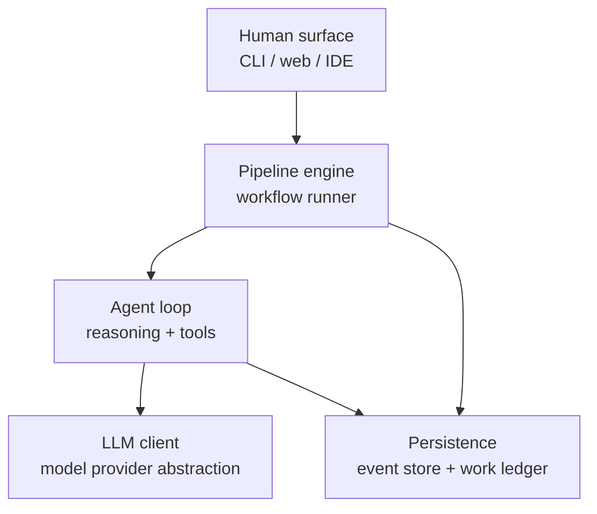

From the top: there's a human surface (a CLI, a web UI, or an IDE plugin) where intent comes in and decisions get made. Below that, a pipeline engine that runs workflows as directed graphs — each node is either a deterministic tool call or a call to a language model. Below that, the agent loop — the multi-turn reasoning cycle that drives a single complex task to completion, with tool access. Below that, the model-provider abstraction (talks to Anthropic, OpenAI, Google, etc., normalizing the differences). Off to the side, the persistence layer that records every event for replay, audit, and learning.

This shape didn't come from a standards committee. Multiple independent teams built independent versions and they all landed here. That convergence is meaningful.

Why does it matter? Because if the architecture is convergent, then *the methodology is the variable*. The substrate is mostly a solved problem — you can take an open-source pipeline engine (Kilroy, Mammoth, Fabro, Smasher), an open-source agent runtime (OpenHands, Overstory), an event store (CXDB), a work ledger (Beads), and a model client (LiteLLM), and you've got 80%+ of what you need. The remaining 20% is the candidate-specific piece — whatever new component embodies that candidate's distinctive bet.

This is good news for buildability: you're not starting from scratch.

### The Five Levels

A maturity ladder for AI-assisted software development that several writers have converged on. It maps roughly to vehicle-autonomy levels.

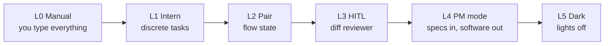

Most engineers using AI tools today operate at L1 or L2 — discrete-task assistance or pair-programming. L3 is the trap: every change requires the human to read and approve a diff, and the volume of changes the AI can produce overwhelms the human reviewer's capacity. Many teams reach L3 and bounce back to L2 because L3 feels worse.

L4 is "PM mode" — the human writes specs, the system implements them, the human signs off on whether the result satisfies the spec rather than on each line of code. L5 is "dark" — the system runs autonomously and the human is involved only when something exceptional happens or when a new initiative starts.

All ten candidates in Part 5 aim at L4 or L5. None aim lower. The differences between them are mostly differences in how they propose to get there.

### Scenarios as the load-bearing discipline

One concept needs to be understood before the candidate briefs make sense. Every candidate relies on scenarios as the way work is evaluated — and *scenarios are external to the codebase*. The agent that does the work cannot read the scenarios while doing the work. A separate evaluation step checks whether the work, when run, satisfies the scenarios.

This is the same discipline that lets you validate a machine learning model against held-out data. If the agent could see the scenarios during work, it could fit to them — like a student who's seen the test in advance. The external storage and independent judge are what make the agent's output trustable without line-by-line human review.

Every candidate binds this principle. The candidates differ in *how* they author scenarios, *how* they prevent scenario leak, *what* the judge is, and *what* counts as satisfaction. But all ten depend on this discipline being real.

---

## Part 5 — The ten candidates

Each candidate has a short label (GF-S, GF-M, etc.) and a longer name. The labels are convenient handles; they encode the mandate: **GF-** for greenfield, **BF-** for brownfield, **U-** for unified. Within a mandate, the trailing letter indicates the central emphasis: **-S** for substrate-first, **-M** for methodology-first, **-C** for cold-start-first, **-L** for legacy-ingestion-first.

The briefs below each have: a one-line bet, an overview of the candidate, the one or two distinctive things that make it interesting, a small diagram of the per-cycle methodology, and an honest note on what could go wrong.

---

### GF-S — Greenfield, substrate-first

**The bet.** Safety belongs in the substrate, not the methodology. A small set of always-on guards between the agent and any consequential action makes the methodology thin and reliable.

**Overview.** For greenfield work, GF-S argues that you shouldn't try to make the methodology safe through clever process design. Instead, build a deterministic safety layer underneath that refuses unsafe outputs, and let the methodology stay simple. The agent works as it normally would, but everything it produces flows through a four-guard ensemble before it goes anywhere consequential. Three of the four guards are pure deterministic checks (cheap to run, fully predictable); the fourth is a multi-model contradiction detector. If any guard rejects the output, the cycle goes back to the agent with the specific failure.

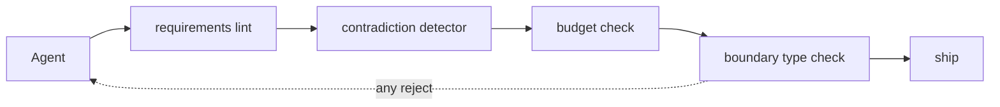

**What makes it distinctive.** The interesting move is treating *safety as a property of the substrate, not of the methodology you happen to be running today*. Most current AI coding setups rely on the human reviewer as the safety filter, or on an LLM-as-judge that asks "does this look ok?" GF-S says: before anything consequential happens, run four cheap checks. Three of them are deterministic — a requirements lint (does the spec actually look like a well-formed requirement?), a budget check (have we exceeded the requirements count we agreed on?), a boundary type check (is the input/output crossing trust boundaries in a way the design allows?). These cost almost nothing per cycle and they catch the largest category of dumb mistakes before they reach any reviewer.

The fourth guard is a multi-model contradiction detector. This is where the substrate gets clever: instead of asking one LLM "is this consistent?", you ask three different model families and look for disagreement. A single model can miss its own blindspots; three different families produce a stronger signal. The contradiction detector is the only LLM-shaped cost in the loop.

The design payoff: when you eventually want to swap methodologies (because methodology is the variable, remember), the safety layer doesn't degrade. You can experiment freely with the methodology because the substrate still refuses unsafe outputs. This decoupling is what makes a real factory possible.

The closest existing pattern is the boundary discipline in some research-grade agent harnesses (specifically, work coming out of Anthropic on "CaMeL"-class boundaries that distinguish trusted from untrusted control flow). GF-S applies that pattern to the per-cycle output of an everyday coding agent.

**What could go wrong.** The pre-mortem is mostly about cost. Every guard fires on every cycle. If the contradiction detector becomes too expensive at scale, GF-S becomes economically infeasible for high-volume settings. The other concern is "last-mile drift" — even with a substrate that refuses unsafe outputs, the specs that get accepted may drift from production reality over time, and the substrate has no story for that.

---

### GF-M — Greenfield, methodology-first

**The bet.** Cross-family model disagreement is a stronger signal of spec contradiction than any single judge.

**Overview.** GF-M is the cheapest of the ten to first pressure-test, and it makes the most concentrated single bet: that disagreement between different language model families, on the same spec, is the highest-quality contradiction signal available. The methodology has two regimes. In Regime A (spec discovery), a draft spec is run past three or more model families in parallel. Each family produces its interpretation of the post-conditions. A divergence metric measures how much they disagree. Disagreement above a threshold is treated as a contradiction *in the spec*, not in the models. The cycle either reverses (re-draft) or, when divergence falls below threshold, the spec is promoted to Regime B (steady-state execution), which is the standard plan-build-review compound loop.

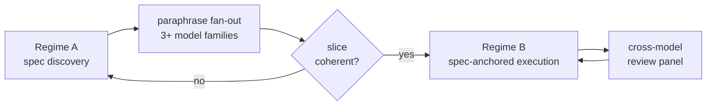

**What makes it distinctive.** The technical bet rests on a finding from the LLM-as-judge research community: when you ask a single language model to evaluate whether two things are consistent, the model's accuracy on the contradiction-detection task has a ceiling — empirically, somewhere around 55% Matthews correlation coefficient. That's not bad, but it's not enough to underwrite a no-review development process. Below 100% accuracy, contradictions slip through, and they compound.

GF-M's move: don't ask a single judge. Run the spec past three or more *different families* of models — different training data, different post-training, different inductive biases. If they all produce materially the same understanding of what the spec means, that's strong evidence the spec is unambiguous. If they materially disagree, the disagreement *is* the contradiction. Critically, the disagreement is information that no single model could have produced, no matter how good.

This is conceptually similar to how distributed-systems consensus works. You don't trust a single node; you require quorum from independent nodes, and you take the disagreement itself as a signal worth acting on.

The infrastructure cost is low. The model-provider abstraction layer (LiteLLM is the canonical open-source piece) already handles cross-family routing. The new piece is a small divergence-measurement component: take three or more responses, embed their post-conditions in a semantic space, measure pairwise distance, threshold. Days of engineering, not weeks.

The reason to reach for GF-M first: if multi-model contradiction detection works, it's a primitive that lots of other candidates can use too. If it doesn't, you've spent very little to find out, and you can rule out a whole class of designs that depend on it.

**What could go wrong.** The bet has its own potential ceiling — multi-model disagreement may have its own accuracy ceiling on contradiction detection, just like single judges do, and we don't know what that ceiling is yet. That's GF-M's own load-bearing falsifier. The other concern is cost: running every spec past three frontier models has a price, and at scale that price could dominate.

---

### GF-C — Greenfield, cold-start-first

**The bet.** Greenfield projects fail at day zero, when intent is thin, not at implementation. Make day zero the load-bearing surface.

**Overview.** GF-C looks at where greenfield projects actually fail and identifies the cold-start phase as the dominant risk. The first week, when intent isn't clear, scenarios haven't been written, and the team is mostly guessing. The candidate's design makes this phase load-bearing through three mechanisms: a structured nine-field intent intake (the Intent Crucible) that refuses to start work until specific things are articulated; a council of cross-family models that interrogates the intent for ambiguity; and a set of acceptance scenarios that are cryptographically signed at the moment of creation, before any code exists, so they can't be altered after seeing failures.

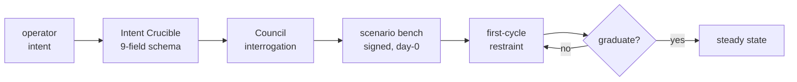

**What makes it distinctive.** Two innovations work together.

The first is the *structured intent intake*. Most current AI coding tools accept intent as free-form text — a prompt, a description, sometimes a paragraph. GF-C insists that intent be authored in a nine-field structured form covering specific dimensions: what the system is, who uses it, what the success conditions are, what the failure modes are, what the constraints are. The fields aren't novel individually; what's novel is the refusal to start work until they're all filled in with substance. A council of different model families then interrogates the intent — points out ambiguities, contradictions, things that look thin. The operator iterates. Only when the intake passes interrogation does any code-writing happen.

This sounds bureaucratic. The reason it matters: most greenfield projects that fail in implementation actually failed at intent and just didn't notice until later. A thin intent leads to a thin spec leads to plausible-looking code that doesn't actually do what was wanted. The discovery happens months later, expensively. GF-C front-loads that discovery into the first day, when it's cheap.

The second innovation is the *cryptographically-signed scenario bench*. Acceptance scenarios are authored before any code exists, and at the moment of creation they're signed (with a cryptographic HMAC, conceptually like signing a contract). The signing makes the scenarios immutable. Even the operator can't alter them after seeing the system fail — they can only add new ones, and the new ones have to be signed separately. This is the strongest possible form of the "scenarios as held-out test set" discipline: the scenarios are frozen at day zero, before anyone has any reason to want to soften them.

The closest existing pattern is the practice of writing acceptance criteria before code in some agile traditions. GF-C makes the practice load-bearing by making it cryptographically enforced.

**What could go wrong.** The pre-mortem is about operator behavior. Structured intake works only if the operator engages with it substantively. If operators learn to click through the fields with minimum-viable text — what some writers call "Hughes-trappings" after a famous case where the regulatory paperwork was filed but the work behind it wasn't done — the scaffolding becomes theater and the system fails the same way an unscaffolded one would.

---

### BF-S — Brownfield, substrate-first

**The bet.** For small-to-medium existing codebases, build the substrate once and the methodology becomes thin substrate-query composition.

**Overview.** BF-S is the brownfield equivalent of GF-S in spirit: invest heavily in substrate up front so the methodology stays simple. The substrate is heavier than greenfield because it includes a *codebase index* (a queryable model of the structure of the existing code), a *dependency-and-impact graph* (which changes propagate where), *role-partitioned telemetry* (what's happening at runtime, segmented by who's allowed to see what), *per-symbol attribution* (who wrote what, when, and why — pulled from git history), and a *boundary type check* (what crosses trust boundaries). The methodology then becomes a thin overlay: pick a work unit, compose queries against the substrate to materialize the context the agent needs, run verification, promote the resulting knowledge back into the substrate.

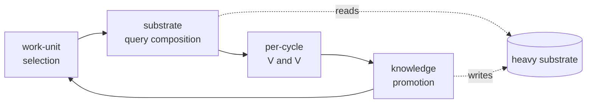

**What makes it distinctive.** The interesting design move is treating the codebase index as *first-class infrastructure* rather than something the agent rebuilds in its own head each cycle. Most current AI-on-brownfield setups have the agent read source files into its context window every time it needs to understand something, paying the comprehension cost over and over. BF-S says: do that work once, store the results in a structured queryable form, and let the methodology compose queries against the store.

The substrate borrows pieces from the existing ecosystem: a syntactic-level index from Tree-sitter and Stack-graphs (well-established open-source tooling for parsing and cross-referencing code), a semantic-level index from CodeQL or similar, an attribution layer from git plumbing, runtime telemetry from OpenTelemetry. The integration that makes all of these queryable as a single coherent substrate is the new piece.

The second distinctive move is *per-symbol attribution combined with boundary typing*. Per-symbol attribution means every identifier in the codebase carries a record of who created it and when. Boundary typing means every place where data crosses a trust boundary — agent reads file, agent calls external service, agent writes to production — is typed and checked. Together, these create a provenanced agent-codebase interaction: every time the agent touches the codebase, the substrate knows where the data came from, where it's going, and whether the crossing is allowed by the design. This is borrowed from the security-research pattern in the "CaMeL" line of agent-defense papers.

For small-to-medium codebases, this substrate is buildable as a finite engineering investment, after which the per-cycle cost is low.

**What could go wrong.** Two pre-mortems. First, at scale (thousands of PRs per week, like a major SaaS company), the substrate refreshes from its own output and accumulates a "hall-of-mirrors" effect — the index reflects what the factory has produced, not the underlying reality. This is called self-reference accretion and there's no obvious solution. Second, the role-partitioning of in-codebase reads (preventing one agent from seeing data it shouldn't) can leak through dependency-graph edges; the claim that this is fully prevented has been downgraded to "rate-limited side-channel mitigation."

---

### BF-M — Brownfield, methodology-first

**The bet.** For brownfield work, an LLM-driven structured summary of the codebase's history gives the agent the context a senior engineer would have, without building heavy substrate.

**Overview.** BF-M takes the opposite tack from BF-S: keep the substrate light, but invest in a methodology that carries codebase context into each cycle through a fresh-generated archaeological brief. The methodology is an eight-stage cycle — trigger, comprehension, intent capture, plan, build, review, acceptance, ship — that compresses or expands depending on the work-unit class. The archaeological brief is the load-bearing piece: an LLM reads relevant parts of the codebase, the git history, the commit messages, the recent telemetry, and produces a structured summary of what the code is doing, why it looks like that, and what's known to be fragile. The brief is fed into the agent for each cycle.

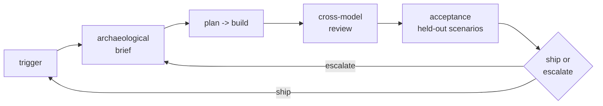

**What makes it distinctive.** The archaeological brief is the interesting idea. Most brownfield tools today either show the agent the raw code (and let the agent figure out the history) or show the agent a brief summary written by humans (which goes stale fast). BF-M generates the brief fresh, every cycle, with a language model that reads multiple signals: the structure of the code, the pattern of recent changes (what's been touched frequently vs. what's stable), the commit messages (what people said they were trying to do), the comments (what they thought was non-obvious), and the runtime telemetry (what actually happens in production). The brief synthesizes these into a few-page structured document that gives the agent the context that a senior engineer who'd been on the team for a year would have.

The second interesting piece: the brief itself is treated as a *satisfaction-style artifact*. There are labeled invariants about the codebase — things known to be true (this module owns persistence, this function must not block, this interface is the only allowed entry point). The brief's quality is measured by how well it recovers those invariants. If the brief doesn't recover them, the brief generator gets retrained or the prompt gets tuned. This makes the brief itself a measurable thing, not just a vibes-based input.

Per-cycle review is done by a panel of different model families rather than a single judge — borrowing the multi-model disagreement signal from GF-M, but using it for code review rather than spec contradiction. The eight-stage cycle is the disciplined version of what good engineering teams already do informally; the brief is what makes the discipline tractable for an agent that doesn't carry a year of team memory.

**What could go wrong.** Several open questions. The compression rules for the eight stages (when does a refactor expand stage 3, when does a regression-fix collapse stages 2-4?) are sketched, not specified. Whether cross-model review is even necessary is contested — Anthropic's published research suggests same-model review can be fine in some settings. The boundary-typing utility tax (how much overhead is too much?) isn't set. And the governance question of where the acceptance scenarios live, when they're drawn from the codebase itself, is open.

---

### BF-L — Brownfield, legacy-ingestion-first

**The bet.** For large legacy codebases, ingestion *is* the work. Build a six-view Codebase Model once and query it forever.

**Overview.** BF-L is the most ambitious candidate by far. It's specifically designed for codebases of a million lines or more, with eighteen or more months of history, in multiple languages. For codebases at that scale, BF-L argues, the upfront cost of *understanding what's there* dominates the per-cycle cost of any individual change. So the candidate invests heavily in a Codebase Model — a unified queryable layer over six different views of the codebase — and then makes the per-cycle methodology thin queries against the model rather than direct interaction with the codebase.

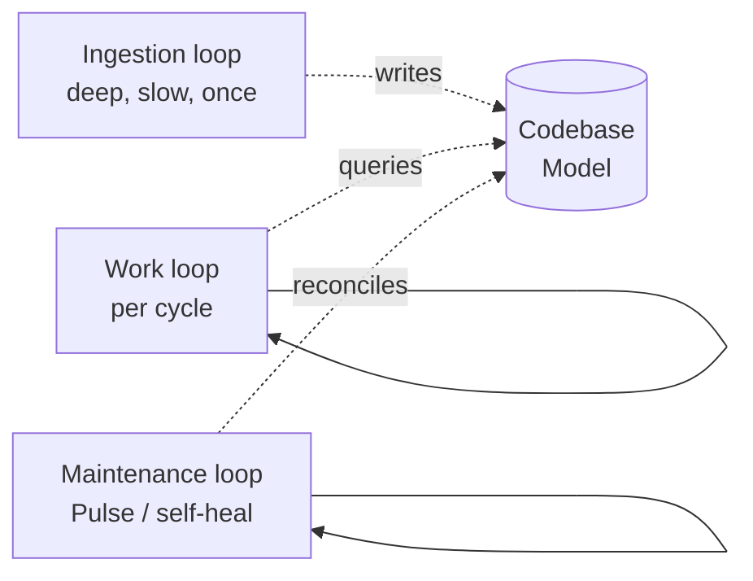

**What makes it distinctive.** Two things.

The first is the *six-view Codebase Model*. The candidate decomposes the problem of "understand this legacy codebase" into six independent views: Structural (what the code looks like syntactically), Conventional (what idioms and patterns are in use here, even if they're not standard), Historical (what the change patterns look like — what's churning, what's stable, who changed what when and why), Runtime (what actually executes in production, with telemetry), Invariant (what's known to be true semantically, often via deep code analysis), and Debt (what's accumulated cost — known fragility, deferred work, things people are afraid to touch).

Each view is backed by an existing open-source tool or class of tools — syntax parsing, semantic analysis, runtime tracing, version-control archaeology. The new engineering investment is the integration layer that makes all six queryable as a single coherent model. This integration is what makes the methodology thin: the agent doesn't need to read source files to answer "what changes if I touch this function?"; it queries the model.

The second distinctive piece is the *Maintenance loop*, which is the architectural realization of a pattern called the Pulse loop. The Maintenance loop runs continuously at low cadence and reconciles the Codebase Model with reality: production telemetry shows something is happening that the model doesn't predict; the loop diagnoses the discrepancy, decides whether the model is wrong or production is wrong, and either updates the model or triggers a fix task. This is what makes the system *continuous* rather than batch — drift between the model and reality is automatically caught and addressed, not allowed to accumulate.

BF-L is most directly inspired by the reported practice of one specific team that's furthest along the autonomy ladder. The Pulse pattern is their reported answer to the question "how do you keep a dark factory aligned with production over months?"

**What could go wrong.** The pre-mortem is mostly about scale and cost. The Codebase Model has to refresh at some cadence; if refresh cost is high and cycle latency demands fast refresh, the system thrashes. The model itself is a high-value attack surface — if it's compromised or corrupted, every methodology decision based on it is poisoned. And the question of whether ingestion should live in the substrate or in the pipeline (run once vs. run as a defined workflow) is unresolved at design time.

This is also the candidate you should *not* start with for first pressure-testing. The upfront engineering investment is the largest in the catalog — the most ambitious substrate primitive across all ten — and the bet should be validated against smaller candidates first.

---

### U-A — Escrow-Graph Factory (Unified)

**The bet.** Every work cycle is a directed graph of typed nodes; policies enforced at node boundaries are the methodology.

**Overview.** U-A is the first of four candidates that try to unify greenfield and brownfield work under a single methodology. The core idea: every work cycle is a small directed graph. Each node in the graph represents a stage (intent, plan, build, review, ship, others). Each node carries metadata — what kind of stage it is, what pace-layer it operates at (more on this in U-B), what prior knowledge it relies on, what classifier decision routed work to it, what artifacts it produces. A policy mediator (built on Open Policy Agent or AWS Cedar — both well-established policy engines) gates each transition between nodes. The mandate (greenfield vs brownfield) becomes a node attribute, not a separate methodology.

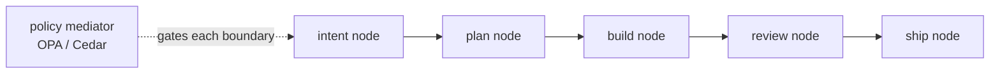

**What makes it distinctive.** The interesting design move is *declarative policy as the methodology*. Most engineering processes today encode their methodology in prose — runbooks, wikis, PR templates, tribal knowledge. Implementing them consistently across teams and projects requires constant human attention. U-A says: write the policies in a declarative policy language designed for this exact purpose. The policies say "to leave the plan node, the artifact must include the following fields"; "to enter the review node, the reviewer must be a different model family than the planner"; "to ship, the held-out scenarios must pass at threshold X."

The advantage of this approach: policies are inspectable, testable, and modifiable independently of the agent's behavior. You can ask "what would happen if the policy were stricter on review?" and answer it without changing any agent code. You can audit "did this work unit follow the policy?" by checking the recorded events against the policy. The policy *is* the methodology, in a form you can hold separately from the rest of the system.

The second distinctive piece is the *typed-object store*. Every artifact produced — every spec, every plan, every code change, every review — is stored as a typed object in a content-addressed append-only log. Content-addressed means you reference an artifact by its hash, so any change produces a new artifact rather than modifying an old one. Append-only means history is preserved. This gives you a substrate where you can replay any past decision, audit any chain of reasoning, and never lose the original. The typed-object store is conceptually similar to git, but for the work of the factory, not for source code.

U-A unifies the mandates because mandate is just another type attribute on a node. The same policy mediator handles both — the policies for a greenfield intent node are different from those for a brownfield intent node, but they're expressed in the same language and enforced by the same engine.

**What could go wrong.** Three concerns. The granularity problem: process-state expands to thousands of nodes per day at year-2 scale, and substrate cost grows with it. The brownfield gap: U-A doesn't address the codebase-comprehension problem the way BF-L's Codebase Model does, so it would need one bolted on for serious legacy work. And the graduation problem: "a work unit is done" doesn't measurably mean the same thing across greenfield and brownfield, even with policies — the underlying judgment varies and U-A doesn't fully reconcile that.

There's also a more conceptual concern: U-A's load-bearing experiment measures things the substrate emits (counts of methodology-deltas, distributions of policy decisions) rather than things a practitioner experiences (did the software ship correctly, did the engineer catch real bugs). The candidate is mechanically rigorous but the case that it produces practitioner-felt success is weaker.

---

### U-B — Pace-Layered Escrow Factory (Unified)

**The bet.** Five pace-layers — standards, architecture, spec, plan, code. Greenfield descends; brownfield ascends. Same architecture, opposite traversal direction.

**Overview.** U-B borrows a concept from Stewart Brand — originally a theory of how civilizations work (fast layers like fashion change quickly, slow layers like culture change slowly), then adapted to software architecture by Stewart Brand-influenced thinkers. The adapted version names five layers: L0 standards (slowest — industry norms, regulatory requirements), L1 architecture (slow — the system's overall shape), L2 spec (medium — what the current work should produce), L3 plan (fast — how to produce it), L4 code (fastest — the actual implementation). Greenfield work descends through the layers from L0 to L4. Brownfield work ascends from L4 (the code that already exists) to L1 (what the architecture must therefore be) and back down again. A cross-layer drift detector watches for inconsistencies between layers.

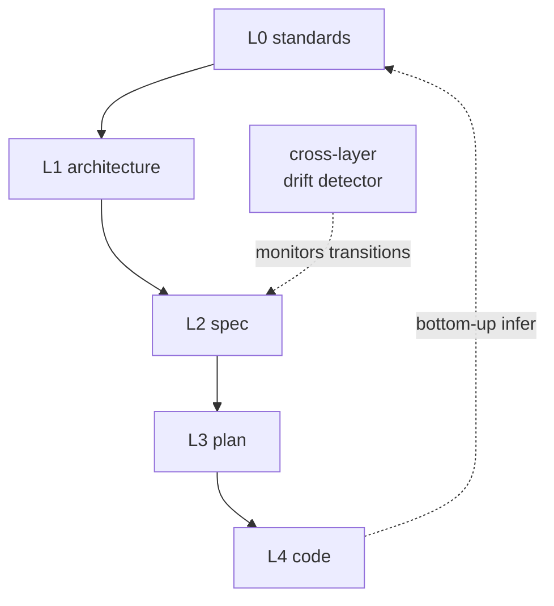

**What makes it distinctive.** The unification claim is unusually clean: greenfield and brownfield aren't different methodologies, they're the same architecture traversed in different directions. The architecture is symmetric, so the methodology can be too. Mandate becomes a parameter of which way you walk.

The second interesting piece is the *drift detector*. Cross-layer invariants — things that must be true across layers — are explicit. The spec must be consistent with the architecture; the plan must be consistent with the spec; the code must be consistent with the plan. The drift detector continuously checks these invariants and surfaces anywhere a layer has gotten out of sync with the layers above and below it. This is conceptually similar to how a multi-level cache enforces consistency between cache levels, but applied to a software project's representation across abstraction levels.

The pace-layer concept is descriptive in its original form — it's a way of *thinking* about systems. U-B's contribution is turning it into a tool with measurable invariants and an enforcement mechanism.

**What could go wrong.** The biggest concern is empirical: the assertion that there are exactly five layers, and that they're standards / architecture / spec / plan / code, is an empirical claim, not a derived one. If the right number is six, or seven, or the layers should be named differently, U-B's architecture is wrong by construction. Different writers in the pace-layer tradition propose different layer counts; U-B picks five.

The second concern: the bottom-up inference (reading code and inferring back upward to architecture) sounds clean but isn't fully specified as a procedure. "Read the code, infer the plan, infer the spec, infer the architecture" is a goal, not an algorithm. The mechanics are sketched.

And like U-A, U-B's load-bearing experiment measures substrate-emitted quantities (distributions of layer-inference confidence) rather than practitioner-felt outcomes. The case for mechanical rigor is strong; the case for practitioner-meaningful success is weaker.

---

### U-C — Anchor-Distance Factory (Unified)

**The bet.** Every work unit declares an anchor and measures distance to it. Distance determines how autonomous the work can be.

**Overview.** U-C unifies the mandates through a different mechanism. Every work unit declares an *anchor* — a frozen reference point that the work is parameterized against. The anchor might be a spec section, a deployed system, a regulatory document, an architecture decision record, a specific test. A *distance estimator* measures how far the current work unit is from its anchor along multiple dimensions (how many dependency-graph hops away, how many spec sections need to change, how many intent fields are touched). A *dispatcher* routes the work to one of three regimes based on distance.

Near-anchor work is high-confidence and gets handled lights-out — the system does it without human involvement. Mid-distance work goes through cross-family augmentation, where multiple model families collaborate on the work and the operator sees the result before it ships. Far-distance work, or work that proposes changing the anchor itself, requires a named human to approve. Anchor changes go to a separate queue with explicit approval gates.

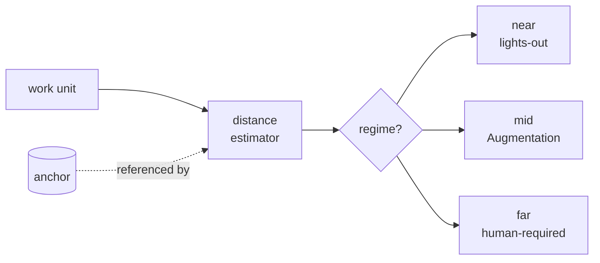

**What makes it distinctive.** The innovation is treating *autonomy as a continuous gradient*, not a hard mode switch. Most current AI tools have a binary distinction — either the human reviews everything or the system runs without review. U-C says: how much autonomy to grant is itself a parameter that should vary per work unit, and it should vary as a function of how close the work is to something the team has already committed to.

Anchors are interesting as a concept because they're explicit about what's frozen. In most systems, the implicit "trusted reference" is whatever happens to be in production — but production drifts and the trust degrades silently. U-C makes the trusted reference explicit, frozen, and traceable. When you ask "why was this work unit handled lights-out?" the answer is "because it was within distance X of anchor Y, which was last verified on date Z."

The dispatcher logic is the load-bearing engineering. It combines multiple distance dimensions into a single regime choice. Among the four unified candidates, U-C has the strongest case for being practitioner-meaningful, because the regime distribution is directly observable — operators can see which work is going to which regime and whether the distribution looks right.

The closest existing pattern is the way some financial-services systems use risk scoring to route transactions: high-confidence transactions go automatic, medium ones go to monitoring, high-risk ones go to humans. U-C applies that pattern to software-engineering work units.

**What could go wrong.** Several pre-mortems. The first is Goodhart's law: if the distance estimator becomes the criterion for autonomy, agents will game it — finding ways to make work look close to an anchor when it isn't, because being close gets the work shipped without review. The second is the requisite-variety problem: the distance signal may not have enough variety to actually distinguish the regimes well, especially in edge cases. The third is stale-anchors: if the team doesn't actively maintain anchors, they become out of date and the whole signal degrades. And the fourth is operator-legibility: can the operator actually understand *why* a specific work unit was routed to lights-out vs. mid? If not, the operator can't intervene meaningfully.

There's also a cross-candidate dependency: for brownfield coverage, U-C's distance estimator needs a dependency graph at the codebase level, which means either building one specifically or depending on BF-L's Codebase Model.

---

### D7-U-1 — Falsification-Topology Factory (Unified)

**The bet.** Every load-bearing artifact carries a typed Falsification Commitment naming who must try to break it before it can compound forward.

**Overview.** D7-U-1 is the most epistemologically explicit of the candidates. Every artifact the factory produces that's load-bearing for future work — a spec, a plan, a code change, an evaluation result, an architecture decision, a learned pattern — is required to carry a *Falsification Commitment* (FC). The FC names a specific opposing side that will try to refute the artifact before it's allowed to compound forward into other work. The opposing side might be a different model family from the one that produced the artifact, a deterministic checker (like a type checker or linter), a named human, or a population vote from many independent reviewers.

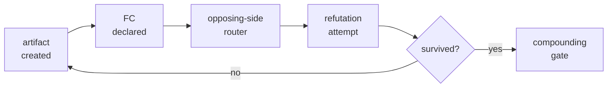

Until the opposing side has had its chance to break the artifact and failed, the artifact doesn't compound — downstream work can't take it as a given. If the refutation succeeds, the artifact goes back. If it survives, it compounds forward and other artifacts can rely on it.

**What makes it distinctive.** The architectural insight: *the system is the topology of build/break pairs*. Most engineering processes treat adversarial pressure as a side-check — "after we build this, let's get someone else to review it." D7-U-1 treats adversarial pressure as the first-class structural element of the architecture. The shape of the system is defined by which artifacts pair with which opposing sides, and that pairing topology is itself something you can inspect, edit, and reason about.

This borrows directly from Karl Popper's philosophy of science. Popper argued that a claim is only meaningful if it specifies how it could be wrong — what observation or experiment, if it occurred, would refute it. D7-U-1 applies this discipline to every load-bearing artifact in the factory. An artifact without an FC isn't allowed to be load-bearing; if it doesn't specify how it could be wrong, it isn't trusted.

The *opposing-side router* is the new piece of substrate. It maintains a registry of opposing sides — what model families, what checkers, what humans — and a capability model of what each is good at refuting. When an artifact declares its FC, the router pairs it with an appropriate opposing side. An *independence auditor* runs continuously, checking that opposing sides aren't accidentally correlated (e.g., two model families that turn out to share training data and therefore agree more than they should), and that there's enough variety in the opposing-side population that the falsification process is actually adversarial.

D7-U-1 unifies the mandates because the FC structure is uniform across them. Greenfield work has a sparser initial FC catalog (the operator is often the only available opposing side at day zero); brownfield work has a richer initial catalog (existing tests, telemetry, type checks already serve as opposing sides). But the structural pattern is the same.

**What could go wrong.** Several open questions, including some D7-U-1 acknowledges as its own load-bearing concerns. Who audits the independence auditor? — there's no answer that doesn't introduce another auditor and start a recursion. At high parallelism, the FC graph could get expensive — every artifact needs an opposing-side call, and at scale the cost could dominate. The calibration of "survival windows" (how long does an FC stay fresh before re-falsification is required?) isn't grounded in evidence yet. And opposing-side gaming is a real risk: if the opposing side learns it gets rewarded for falsifying things, it falsifies more; if it gets rewarded for letting things through, it falsifies less.

The deepest concern: like U-A and U-B, D7-U-1's load-bearing experiment measures substrate-emitted quantities (statistical divergence of opposing-side kind distributions) rather than practitioner-felt outcomes. The mathematics is rigorous and the philosophy is appealing, but the link to "did the software actually ship correctly" is indirect.

---

## Part 6 — Where this goes next

The ten candidates aren't a final list. Three things happen next, in order.

First, the cheaper candidates get experiments run against them. The bet of multi-model contradiction detection (the core of GF-M) is cheap to test and tells us something useful about a primitive that multiple candidates would rely on. The bet of structured intent intake (the core of GF-C) is similar. These experiments produce evidence that survives across candidates — whatever we learn about how well multi-model disagreement actually detects contradictions is useful regardless of which methodology we eventually pursue.

Second, the more expensive candidates get evaluated based on what the cheap experiments revealed. If multi-model disagreement turns out to have its own accuracy ceiling, candidates that rely heavily on it lose appeal. If structured intent intake fails because operators don't engage with it, candidates that build on cold-start discipline lose appeal. And so on.

Third — and this is the part that's most uncertain — once the experiments produce evidence, we choose what to actually ship. Probably not a single candidate. More likely, a small set of candidates that address different mandates (greenfield vs brownfield vs legacy) and that can be assembled from a shared substrate. The point of the substrate-shared design is that swapping methodologies stays affordable as the evidence evolves.

The recommendation memo — "given the evidence, what should we actually build first?" — is deliberately deferred until the experiments run. Pre-experiment recommendations would be speculation; post-experiment recommendations have grounding. Honest separation matters.

---

## A note on epistemic status

This document is a point-in-time snapshot. The ten candidates were selected through several rounds of synthesis, adversarial review, and refinement, but they haven't been pressure-tested against reality yet. Some of the language above ("the bet is that...", "the innovation is...") describes what the candidate *claims* about itself; the experiments will decide whether the claims hold.

A few specific places where the snapshot will likely evolve:

- The four unified candidates (U-A, U-B, U-C, D7-U-1) are mechanically rigorous but their load-bearing experiments measure things the substrate emits rather than things a practitioner would feel. This is a real concern flagged in our internal review. U-C is the unified candidate with the strongest case for practitioner relevance; the other three are weaker on that axis. The experiments may confirm this concern, in which case the four-candidate unified family contracts to one or two.

- The mandate-aligned candidates (GF-C, BF-S, BF-M in particular) have stronger cases for practitioner-felt success but they don't unify. If you need to handle both greenfield and brownfield, you'd run two different methodologies — which is fine, but it complicates the "single system" picture.

- The substrate cost varies by roughly forty times across the candidates. GF-M is the cheapest to pressure-test; BF-L is the most expensive substrate investment in the catalog. The order in which we test candidates is dominated by that cost gradient — cheap first, escalate only if smaller candidates fail in ways that specifically suggest the more expensive substrate is needed.

- Several candidates have explicit unresolved questions that the candidate's authors flagged themselves. These aren't bugs — they're the load-bearing falsifiers. The experiments will resolve them one way or the other.

The work in this repository explicitly tracks what's known, what's speculative, and what's still untested. When the experiments produce evidence, this document gets updated. The current version is the best honest snapshot of where the thinking is in late May 2026 — neither overclaiming nor underclaiming.

---

*Last updated: 2026-05-29. This document is a snapshot of a moving target.*
