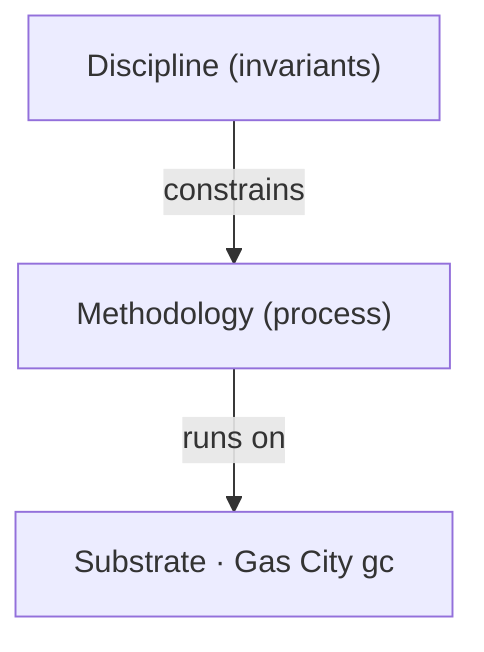
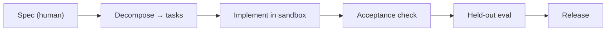
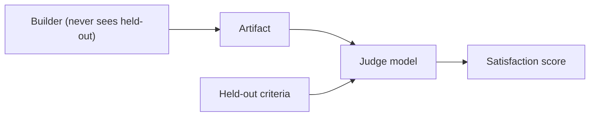
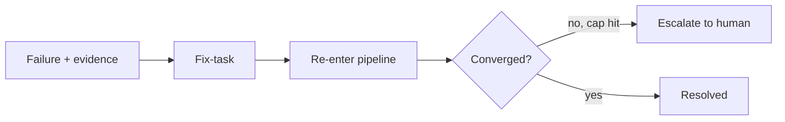
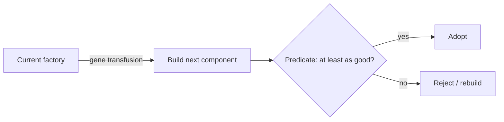
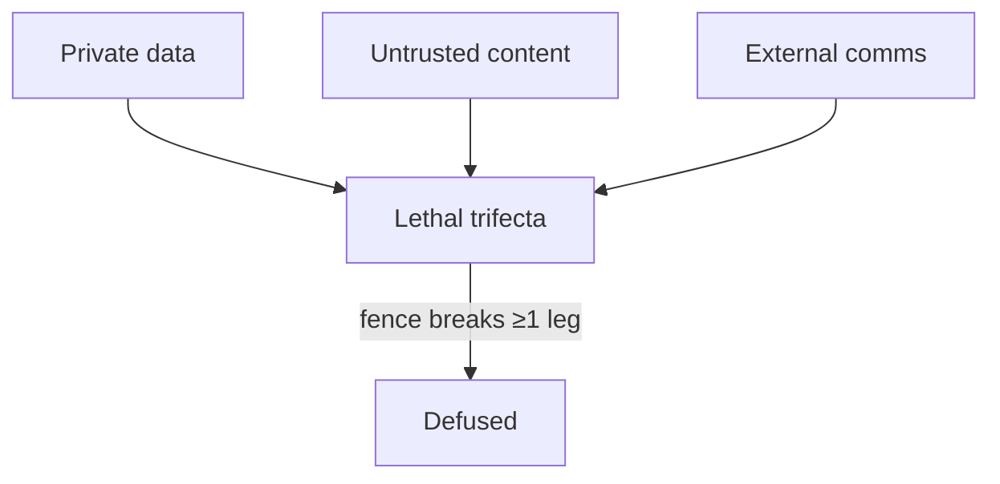

# Software Factory v4 — An Engineer's Guide

**What this is, in one paragraph.** Software Factory v4 is a *design corpus* (not running code yet) for a mostly-autonomous pipeline that takes a single human-written **spec** and produces working, tested software — and then turns that pipeline on *itself*, building and improving its own components. The whole thing is organized as three independently-reasoned layers (**discipline**, **methodology**, **substrate**), driven by a **spec-in → software-out** spine, kept honest by a **held-out** evaluation stream that scores **satisfaction**, made resilient by a **self-heal** loop, and made recursive by a **bootstrap** loop (the riskiest bet). Most of the substrate is off-the-shelf OSS; three pieces are genuinely new. Nothing runs unattended until a safety **fence** (the lethal-trifecta control) is in place — that gate was pulled forward to a precondition by an adopted operator decision.

> This guide is the engineer-level companion to the outsider build-order primer (`build-order-plain-english.md`, the intended sibling at the repo root). It leans on the architecture itself: [`architectures/v4/README.md`](architectures/v4/README.md) and the expert-panel risk read [`architectures/v4/_meta/panel/VERDICT.md`](architectures/v4/_meta/panel/VERDICT.md).

---

## 1. The three-layer split

The architecture's first move is to separate three things normally tangled together. The bet: each layer can be developed and reasoned about *independently*, with deliberately **narrow contracts** between them.

| Layer | Corpus name | What it is | What it owns |
|-------|-------------|------------|--------------|
| **Discipline** | the constitution | Invariants that must *never* be violated | Holdout integrity, safety fences, objective stability |
| **Methodology** | the process | The repeatable build process | The spec→software pipeline, the loops, the two eval streams |
| **Substrate** | Gas City (`gc`) | The execution environment | Sandboxes, orchestration, model invocation, storage |

The dependency direction is one-way: discipline *constrains* methodology; methodology *runs on* substrate.

*Caption: One-way dependency — invariants constrain the process, the process runs on the substrate.*

**Why the split matters.** It lets you change *how* you build (methodology) or *where* it runs (substrate) without touching the non-negotiables (discipline). It also makes the safety story auditable: every invariant lives in one layer.

---

## 2. The spec-in → software-out spine

This is the core pipeline. A human writes exactly one thing — the spec, carrying its acceptance criteria — and the factory does the rest until output either ships or escalates.

*Caption: The happy path — spec to release; failures branch off into self-heal (Section 5).*

Two checks gate release, and they are different on purpose: **acceptance** is open criteria the builder can target; **held-out eval** is closed criteria the builder never saw. Output ships only when it clears *both*.

---

## 3. The held-out eval stream

A separate stream of tests/criteria the builder agents **never see** during construction. A **judge** model runs them to produce a **satisfaction** score.

*Caption: The builder is blind to held-out criteria; the judge sees both and scores satisfaction.*

**Why held out.** If the builder could see these criteria, it would overfit to the test and the score would mean nothing. Keeping the criteria out of the builder's context is **holdout integrity** — a Discipline-layer invariant (any leak silently destroys the signal).

**The bet, and its risk.** The judge is from the *same model family* as the builder. The wager is that a same-family judge can grade fairly. The risk — flagged by the panel as the **highest-likelihood failure** — is *collusion / shared blind spots*: builder and judge may be wrong in the same direction, so satisfaction is systematically biased rather than independent.

---

## 4. The self-heal loop

Failures are not dead ends; they become work. A failed acceptance check or held-out eval is converted into a **fix-task** carrying the failing evidence, which re-enters the pipeline like any other task. A **convergence guard** caps how many heal cycles a task may take; if it can't converge, it **escalates** to a human.

*Caption: Failures loop back as evidence-bearing fix-tasks; the guard forces escalation rather than infinite retry.*

The intent: the loop absorbs ordinary defects; only genuinely novel problems reach a person.

---

## 5. The bootstrap loop (factory builds factory)

The most ambitious idea — and the corpus's **single riskiest bet**. Once the factory can build software from a spec, you write a spec *for a piece of the factory* and let the factory build it. The seeding mechanism is **gene transfusion**: the current factory's working components and patterns become the seed material for the next generation. Adoption is gated by the **gene-transfusion predicate** — a formal "at least as good as the component it replaces" check that must pass *before* the new component is allowed in.

*Caption: Self-build is gated — a new component is adopted only if the gene-transfusion predicate passes.*

**Why riskiest.** The panel rates **defect amplification** here as the *highest-severity* failure: the loop can propagate and magnify subtle defects across generations faster than they're caught. The predicate is the crux — if it's even slightly wrong about "as good," errors compound.

---

## 6. What's genuinely new vs assembled from OSS

The corpus is deliberately honest here: most of the substrate is glue over existing tools; only three pieces are invention.

| Capability | Status | Notes |
|------------|--------|-------|
| Sandboxing, container orchestration, queueing | **Off-the-shelf (OSS)** | Configuration and glue, not invention |
| Model-call plumbing, test runners | **Off-the-shelf (OSS)** | Standard substrate concerns |
| Storage / vector | **Off-the-shelf (OSS)** | Standard substrate concerns |
| **Counterfactual replay** | **Genuinely new** | Re-run a past decision point with one input changed to attribute outcomes (debugging the factory's own decisions) |
| **Gene-transfusion predicate** | **Genuinely new** | The formal "at least as good" gate for self-built components; the crux of the bootstrap claim |
| **Objective-drift handling** | **Genuinely new** | Detect/correct slow divergence of effective from stated objective over self-build cycles |

Bottom line: the *substrate* is largely solved-by-others; the *methodology's* self-improvement and self-attribution machinery is where the original work lives.

---

## 7. The safety story

Four concerns, each with a control and each anchored in the Discipline layer.

*Caption: The lethal trifecta is dangerous only with all three legs; the fence breaks at least one.*

- **Lethal trifecta + the fence.** Danger arises when a system simultaneously has private-data access, untrusted-content exposure, and the ability to communicate externally. The **fence** breaks at least one leg. Per the adopted operator decision, the fence is **pulled forward** to a *precondition before any unattended running* — not a later add-on. This is the first gate on the **autonomy ladder** (autonomy is earned rung by rung; lower rungs need human approval per task, higher rungs permit unattended operation).
- **Holdout integrity.** No path may leak held-out criteria into a builder; a leak silently voids the satisfaction signal.
- **Objective drift.** The effective objective can slowly diverge from the stated one across self-build cycles; a monitor watches for it — but the detection mechanism is itself unproven.
- **Unverified substrate caveat.** Many capabilities are claimed "Gas City does X natively." Treat every such claim as *a claim to test, not a fact* — a wrong assumption here invalidates everything built on top of it.

---

## 8. The biggest open risks

Straight from the [panel verdict](architectures/v4/_meta/panel/VERDICT.md):

| Risk | Why it bites | Panel framing |
|------|--------------|---------------|
| **Same-family judge collusion** | Builder and judge share a model family → shared blind spots → biased satisfaction | Highest *likelihood* |
| **Gene-transfusion defect amplification** | Bootstrap loop magnifies subtle defects across generations | Highest *severity* |
| **Objective drift undetected** | Drift may be invisible until large; detector unproven | Slow-burn, hard to catch |
| **Unverified substrate** | "Gas City does X natively" untested; wrong assumption cascades | Invalidates dependents |
| **Holdout leakage** | Any leak destroys the meaning of the satisfaction signal | Silent failure |

**Panel recommendation:** build the **fence first**, validate substrate claims early, and climb the autonomy ladder only behind passing safety gates.

---

### Where to go next

- The architecture itself: [`architectures/v4/README.md`](architectures/v4/README.md)
- The component map (57 components across the three layers): [`architectures/v4/_meta/component-inventory.md`](architectures/v4/_meta/component-inventory.md)
- The risk read: [`architectures/v4/_meta/panel/VERDICT.md`](architectures/v4/_meta/panel/VERDICT.md)
- The plain-English outsider primer: `build-order-plain-english.md` (intended repo-root sibling to this guide)
