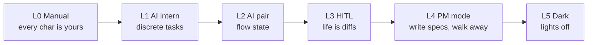

# 02 — Paradigm: Five Levels + 12 principles

This file establishes two things from the corpus:

1. **The Five Levels axis** (Shapiro) — how much of the work is the human doing.
2. **The 12 principles** (El Kaim's synthesis) — the discipline checklist that distinguishes a team that uses AI from a team that has built a software factory.

The v3 candidates are then placed against both axes.

## The Five Levels

NHTSA-style maturity model. The transition is from execution to oversight to strategy, with human attention shifting and eventually becoming optional.

Key observations from the corpus:

- **Almost everyone tops out at L3.** It's where AI-native developers cross from "this is great" to "I am a bureaucrat who reviews diffs all day." Many teams reject L3 and retreat to L2.
- **L4 is feasible at $200/month** (Willison's personal Claude Max exploration of these patterns). L5 at meaningful scale costs ~$1k/engineer/day at StrongDM's level of investment.
- **L4→L5 is a discipline shift, not a technology shift.** The 12 principles below are mostly about what the team commits to giving up.

### Where the v3 candidates sit

All 10 v3 candidates aim at **L4 or L5**. None of them aim lower. The mandate-aligned candidates (greenfield-only or brownfield-only) tend to be L4-feasible-now / L5-stretch. The unified-attempt candidates all reach for L5 by construction (their unified-mandate claim implies the methodology can run unsupervised across both work modes).

| Candidate | Realistic level today | Aim |
|---|---|---|
| GF-S | L4 | L5 |
| GF-M | L4 | L5 |
| GF-C | L4 (cold-start phase is heavily human; L5 once promoted) | L4-during-cold-start / L5-steady-state |
| BF-S | L4 (small brownfield only) | L5 |
| BF-M | L4 | L5 |
| BF-L | L4 (long ingestion phase) | L4-during-ingest / L5-during-work |
| U-A | L5 stretch | L5 |
| U-B | L5 stretch | L5 |
| U-C | L5 stretch | L5 |
| D7-U-1 | L5 stretch | L5 |

The "L5 stretch" annotation on the unified-attempts reflects two things: (a) each has an open structural concern unresolved at the corpus level (auditor recursion in D7-U-1, layer-count empiricism in U-B, Goodhart on distance estimator in U-C, granularity cost in U-A); (b) no team has publicly demonstrated L5 across both mandates simultaneously (StrongDM is reported at L5 on what amounts to a greenfield-with-rich-priors enterprise security product).

## The 12 principles

El Kaim's synthesis of what teams that have actually built dark factories converged on. Treat as the discipline checklist.

For each principle: the principle, what it means in practice, and a rough sense of "how hard is this to actually commit to."

| # | Principle | What it means | Discipline cost |
|---|---|---|---|
| 1 | **Specs are the source of truth.** | Code is disposable. When something breaks, fix the spec and rebuild. Don't debug the output. | High. Most teams cannot resist looking at the output. |
| 2 | **Use the three-layer architecture.** | LLM client + agent loop + pipeline engine. Don't reinvent; extend. | Low. The architecture is now well-mapped. |
| 3 | **Pipeline file = process definition.** | Workflow as DOT graph, version-controlled, runner-agnostic. Think BPMN, not shell script. | Medium. Requires giving up "the methodology lives in agent prompts." |
| 4 | **Deterministic nodes first; LLM nodes only where reasoning is required.** | Tool nodes are cheap and reproducible. Most steps don't need a model. | Medium. The temptation to LLM everything is strong. |
| 5 | **Scenarios as holdout sets.** | External to the codebase; agent cannot see them during work; evaluated by independent judge. | High. This is the load-bearing idea. Requires real separation. |
| 6 | **Measure satisfaction, not test passage.** | Probabilistic metric over scenario trajectories; LLM-as-judge. Boolean assertions don't survive. | Medium-High. Requires building the judge harness. |
| 7 | **Build digital twins for critical dependencies.** | Use the public SDK as the compatibility target. Twin satisfies every call the SDK makes. | Medium. Per-dependency 1-2 engineer-weeks if you start from the SDK. |
| 8 | **Ask "why am I doing this?" every time you do something manually.** | If you can articulate why something looks wrong, you have described a validation rule. Automate it. Stop looking. | Highest. This is the discipline that separates L3 from L5. |
| 9 | **Every action must be attributed.** | Every commit, task, event carries an actor identity. Foundation for debug + compliance + trust. | Low-Medium. Tooling exists (Gas Town pattern). |
| 10 | **Build the memory layer.** | Dependency-aware work ledger. Long-horizon agent work without structured memory regresses. | Low. Beads is OSS and works. |
| 11 | **Close the self-healing loop.** | Observability → anomaly → diagnosis → fix → ship, without human intervention. | High. Hardest engineering item. CXDB + Healer is the proven pattern. |
| 12 | **Pipeline files are worth sharing.** | The community that forms around shared pipelines is the open-source project of this moment. | Low. Just publish your DOT files. |

### Which principles each candidate binds

This is the candidate's discipline commitment. A "✓" means the candidate's design explicitly relies on this principle. A "○" means the candidate is silent on it (could go either way at implementation time). A "✗" means the candidate's design is incompatible.

| Principle | GF-S | GF-M | GF-C | BF-S | BF-M | BF-L | U-A | U-B | U-C | D7-U-1 |
|---|---|---|---|---|---|---|---|---|---|---|
| 1. Specs are source of truth | ✓ | ✓ | ✓ | ✓ | ✓ | ✓ | ✓ | ✓ | ✓ | ✓ |
| 2. Three-layer architecture | ✓ | ✓ | ✓ | ✓ | ✓ | ✓ | ✓ | ✓ | ✓ | ✓ |
| 3. Pipeline-file as process | ✓ | ○ | ✓ | ✓ | ✓ | ✓ | ✓ | ✓ | ✓ | ✓ |
| 4. Deterministic-first | ✓ | ○ | ✓ | ✓ | ○ | ○ | ○ | ○ | ○ | ✓ |
| 5. Scenarios as holdout | ✓ | ✓ | ✓ | ✓ | ✓ | ✓ | ✓ | ✓ | ✓ | ✓ |
| 6. Satisfaction not test-pass | ○ | ✓ | ○ | ○ | ✓ | ✓ | ✓ | ✓ | ✓ | ✓ |
| 7. Digital twins | ○ | ○ | ○ | ✓ | ○ | ✓ | ○ | ○ | ○ | ○ |
| 8. "Why am I doing this?" | ✓ | ✓ | ○ | ✓ | ✓ | ✓ | ✓ | ✓ | ✓ | ✓ |
| 9. Attribution | ○ | ○ | ○ | ✓ | ○ | ✓ | ✓ | ✓ | ✓ | ✓ |
| 10. Memory layer | ○ | ✓ | ○ | ○ | ○ | ✓ | ✓ | ✓ | ○ | ○ |
| 11. Self-healing loop | ○ | ✓ | ○ | ○ | ○ | ✓ | ○ | ○ | ○ | ✓ |
| 12. Pipeline files worth sharing | ○ | ○ | ○ | ○ | ○ | ○ | ○ | ○ | ○ | ○ |

Interpretation:
- **Principles 1, 2, 5 are universal.** Every candidate is built on specs + three-layer + scenarios-as-holdout. These are table stakes.
- **Principle 8 ("why am I doing this?")** is the discipline that distinguishes mature candidates from immature ones. Most candidates commit to it; GF-C does not because its cold-start phase has irreducible operator interaction.
- **Principle 11 (self-healing loop) is rare.** Only GF-M, BF-L, and D7-U-1 explicitly bind it. The others are silent — you'd have to bolt it on at implementation.
- **Principle 12 (publish your pipelines) is absent from all.** Every team is hiding their pipeline files. The v3 candidates inherit that posture from the corpus by default.

## Where on the human-involvement axis

The "Attractor as control system" framing you cited (set it running and it converges) lives at the intersection of **L5** + **principle 11 (self-healing loop)** + **principle 5 (scenarios as holdout)**. Three candidates are explicitly there: **GF-M**, **BF-L**, **D7-U-1**. The rest aim there but are silent on principle 11 — they'd need a Healer-equivalent bolted on at implementation time to reach the converge-without-supervision posture.

Touchpoint frequency (how often does the human have to engage?) breaks down roughly:

| Touchpoint posture | Candidates | When the human is needed |
|---|---|---|
| **Kickoff + check-back** | GF-M, BF-L, D7-U-1 | Initial spec/scenario authoring + final review of batched outputs |
| **Per-cycle** | GF-S, BF-S, U-A, U-C | Approval at each Regime/work-unit boundary |
| **Per-slice / per-promotion** | GF-M (Regime A), GF-C (cold-start phase) | At the boundary between exploratory and steady-state work |
| **Continuous (during cold-start phase only)** | GF-C, BF-L (during ingestion) | Bootstrapping (irreducible) |

Batching (does each step gate the next, or does work proceed and the human reviews batches?):

- **Strongly batched** (closest to set-it-and-walk-away): GF-M (Regime B), BF-L (work loop), D7-U-1 (post-FC-survival)
- **Per-cycle gated**: GF-S, BF-S, BF-M, U-A, U-B, U-C, GF-C (steady-state)
- **Per-decision interactive** (the L3 trap): none of the candidates aim here, but several could land here if implementation skips principle 8

The most "attractor-like" candidates by this measure are **BF-L**, **GF-M**, and **D7-U-1** — they explicitly architect for batched, low-supervision operation post-bootstrap.
