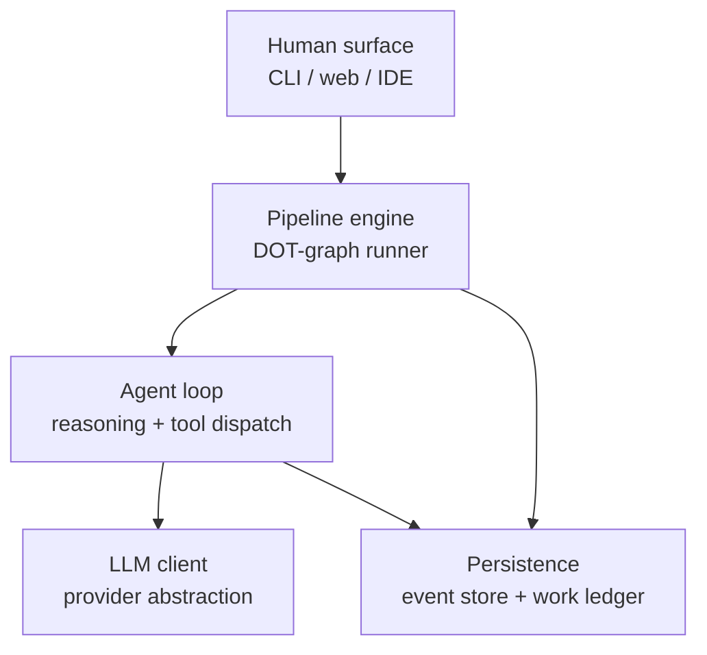

# 03 — Substrate: the OSS landscape and what's left to build

The substrate is mostly already solved. The dark-factory paradigm has produced a mature stack of named open-source projects, each occupying a specific slot in the three-layer architecture. This file maps the slots, lists the projects, and identifies where each v3 candidate would actually need custom code.

## The three-layer architecture (corpus-standard)

Every working Attractor implementation lands on this shape independently. Five slots, plus an outer human surface. The slots are commodified to different degrees.

## Slot-by-slot OSS map

### Slot 1: pipeline engine (Attractor runner)

Runs the workflow as a directed graph. Sequences nodes, manages state, handles fan-in/out, enforces retry budgets, pauses at HITL gates.

| Project | Language | Notable | When to pick it |
|---|---|---|---|
| **Kilroy** (Shapiro) | Go | Local-first CLI. Two parallel histories (git for code, CXDB for runs). Resume from logs / CXDB / branches. | You want the smallest, most opinionated reference implementation. Default pick for first prototype. |
| **Fabro** (anonymous) | Rust | Single binary, no deps. Approval gates as hexagons. Model "stylesheet" (CSS-like routing rules). Daytona sandboxes built-in. React web UI + REST + SSE. | You want a polished operator surface and cost-aware multi-model routing out of the box. |
| **Mammoth** (2389) | Go | Full spec engine with 21-rule DOT linter. Configurable fan-in policies. | You want the most spec-compliant runner with rigorous workflow validation. |
| **Smasher** (2389) | Rust | Lean 5-crate system. HTMX frontend with live graph visualization. | You want minimal surface area + a working visual interface. |
| **Tracker** (2389) | Go | Weekend-scale implementation with automatic checkpointing. | You want to read the smallest possible reference to understand the pattern. |
| **dotpowers** (2389) | (multi) | Superpowers-style preset library for Attractor. | You want a starting pipeline file, not just a runner. |

**Build vs. configure:** all of these are configure. Define your pipeline in DOT, register your model providers, set retry/cost budgets. Zero custom Rust/Go for the runner itself. Custom code goes into your tool nodes (deterministic helpers you call) and your prompts (the LLM nodes).

**Picking guide:**
- Default to **Kilroy** for first prototype (Go, smallest, opinionated, has the founding team's blessing).
- Switch to **Fabro** if you need polished UI, cost-aware routing, or Daytona sandbox integration.
- Switch to **Mammoth** if you're building something complex enough to want rigorous DOT lint.

### Slot 2: agent loop + sandbox

Runs the agent inside an isolated environment with tool access. Multi-turn reasoning loop. The thing that actually reads code, runs commands, writes code, checks outputs.

| Project | Language | Notable | When to pick it |
|---|---|---|---|
| **OpenHands** (All-Hands AI, formerly OpenDevin) | Python + React | 75k+ stars. SWEBench 77.6%. Local CLI, GUI, cloud, enterprise k8s. Major adoption (TikTok, Netflix, Google, etc.) | Default pick. Mature, well-tested, broadly adopted. |
| **Overstory** (Jaymin West) | TypeScript / Bun | Hierarchical fleet (Orchestrator → Coordinator → Workers). 11 pluggable runtime adapters (Claude Code, Pi, Copilot, Aider, etc.). FIFO merge queue with tiered conflict resolution. Tiered watchdog (mechanical / AI-triage / monitor). | You need multiple agents working the same task with structured merge. |
| **Claude Code** | TypeScript | The reference implementation of the Anthropic agent pattern. Used by many teams as the agent runtime under custom orchestration. | You want the most stable single-agent loop with skills support. |
| **Codex** (OpenAI) | TypeScript | Equivalent to Claude Code from the OpenAI side. | You're standardizing on OpenAI infrastructure. |
| **Freshell** (Shapiro) | (unknown) | Multi-agent workspace organizer. Structured tabs per agent. | You want a unified operator view across multiple concurrent agents. |

**Build vs. configure:** configure. The agent loop is provided. Custom code is your tools (provided as MCP servers, skills, or runtime extensions) and your system prompts. The sandbox model varies: OpenHands uses Docker-based sandboxes; Fabro uses Daytona cloud VMs; Overstory uses git worktrees.

**Picking guide:**
- Default to **OpenHands** for general-purpose work.
- Switch to **Overstory** if your methodology requires multiple agents with structured merge (e.g., U-A's typed-node-graph, U-C's per-anchor dispatcher).
- Use **Claude Code** or **Codex** as the leaf-level runtime when the orchestration is custom on top.

### Slot 3: observability / event store

Records every agent interaction (prompts, tool outputs, model responses) in an immutable graph. Lets you trace, replay, query.

| Project | Language | Notable | When to pick it |
|---|---|---|---|
| **CXDB** (StrongDM) | Rust (16k) + Go (9.5k) + TypeScript (6.7k) | Special-purpose for AI agent observability. Content-addressed DAG. The reference implementation, used by the Healer pattern. | Default pick. Battle-tested in the only public L5 team. |
| **Dolt** | Go | Version-controlled SQL database (used by Gas Town/Gas City for work ledger backing). General-purpose, not agent-specific. | You want SQL semantics + git-style versioning for non-CXDB needs. |
| **OpenTelemetry** | (many) | Industry-standard tracing/metrics. Not agent-specific. | You want to integrate agent traces with your existing observability stack. |

**Build vs. configure:** mostly configure. CXDB has fixed schemas for agent interactions; you write to it and query it.

**Picking guide:** **CXDB** is the answer unless you have a specific reason not to. It's the substrate the Healer pattern (principle 11, self-healing loop) depends on.

### Slot 4: work ledger / memory

Persistent dependency-aware task graph. Survives across agent sessions. Replaces flat markdown scratchpads.

| Project | Language | Notable | When to pick it |
|---|---|---|---|
| **Beads** (Gas Town Hall) | Go | Beads-shaped tasks with explicit dependencies. Dolt-backed by default, file fallback available. | Default pick. The reference for long-horizon agent memory. |
| **Gas City** (Gas Town Hall) | Go | SDK that builds on Beads. Multiple runtime providers (tmux, subprocess, exec, ACP, Kubernetes). Kubernetes-style controller/supervisor loop reconciling desired and actual state. Internal vocab (cities, rigs, formulas, molecules, waits, polecats) — opinionated. | You want orchestration on top of the work-ledger, not just the ledger. |
| **Gas Town** (Yegge) | Go | Predecessor of Gas City. Centers attribution as first-class. | Read for the design philosophy; Gas City supersedes for new builds. |

**Build vs. configure:** configure. Define your task shape, register your dependencies, point your agents at it.

**Picking guide:**
- Use **Beads** alone if you want the work ledger and you'll roll your own orchestration.
- Use **Gas City** if you also want a Kubernetes-style reconciler shape (good fit if you're already a k8s shop).

### Slot 5: LLM client (provider abstraction)

Unified adapter over Anthropic / OpenAI / Gemini / etc. Handles streaming, retries, provider-specific quirks.

| Project | Language | Notable |
|---|---|---|
| **LiteLLM** | Python | The dominant Python abstraction. ~all-provider coverage. Built-in router for cross-family routing (cheap on simple tasks, frontier on hard ones). |
| **OpenRouter** (hosted) | n/a | API gateway over all providers. Single endpoint, billing aggregation. |
| Built into Kilroy / Fabro / Mammoth | Go / Rust | Each Attractor runner has its own LLM client. Reasonable defaults; less feature-rich than LiteLLM. |

**Picking guide:** **LiteLLM** if you want the broadest provider coverage with routing logic. The Attractor runner's built-in is fine for simpler needs.

### Slot 6: scenario store + judge harness

Where the scenarios live (outside the codebase) and how they get evaluated.

This slot is **less standardized** than the others. StrongDM built it custom internally. The OSS pieces:

| Piece | Project / approach |
|---|---|
| Scenario storage | A separate git repo + an OPA policy preventing the agent from accessing it. Or: a content-addressed store in CXDB. Or: a Postgres table with row-level security. All custom-assembled. |
| LLM-as-judge | Hamel Husain's "Critique Shadowing" pattern is the reference for designing the judge prompts. No off-the-shelf judge harness exists. Build your own with LiteLLM + a small Python wrapper. |
| Satisfaction metric computation | Custom. ~100 LOC of Python + the judge calls. |
| Scenario authoring tooling | None standard. Markdown files + structured frontmatter is the common pattern. |

**Build estimate:** 1-2 engineer-weeks to assemble for a first cut. The hard part is writing the scenarios, not building the harness.

### Slot 7: Digital Twin Universe (per-dependency)

Behavioral clones of external services so scenarios can run thousands per hour without rate limits.

| Piece | Approach |
|---|---|
| Twin runtime | Custom. The StrongDM twins are self-contained Go binaries. Each twin clones one service. |
| Compatibility target | The public SDK client library for the service. Take the SDK, make every call it can make return a correct response. |
| Storage | In-memory plus a SQLite checkpoint per twin. |

**Build estimate:** 1-2 engineer-weeks per dependency, after you've built the first one (which takes longer because you're figuring out the pattern). StrongDM's first new-hire built the whole DTU in two weeks.

### Slot 8: self-healing loop (Healer)

The closed loop: observability → anomaly detection → diagnosis → agent-driven fix. Builds directly on top of CXDB.

| Piece | Approach |
|---|---|
| Anomaly detection over CXDB | Custom. Cluster similar bad behaviors. Open-source clustering libraries do most of the work. |
| Diagnosis agent | A specialized agent that wakes up on an anomaly, reads the cluster, identifies root cause, writes a fix prescription. ~Standard agent loop with a specific system prompt + CXDB query tools. |
| Fix-and-deploy loop | Pipeline-engine node that takes the prescription, applies it, ships. Just another DOT graph. |

**Build estimate:** 4-6 engineer-weeks for a useful first version. This is the highest-engineering item on the list and the hardest to get right.

## Pattern library / skills

The standardization of agent capabilities as reusable skills. Less foundational than the slots above but important for productivity.

| Project | What it provides |
|---|---|
| **Superpowers** (Jesse Vincent) | Curated skill collection for Claude Code. The reference for skill-shaped workflow extensions. |
| **agentskills.io** | Community skill registry. |
| **Anthropic Agent Skills** | First-party skill format and registry. |
| **MCP** (Model Context Protocol) | The provider-neutral tool protocol. Skills can be MCP servers. |

**Picking guide:** start with Superpowers if you're on Claude Code; add Anthropic Skills as they ship; expose custom domain logic as MCP servers.

## What's already covered for each v3 candidate

The honest news: **for most candidates, 80%+ of the substrate is "configure existing OSS."**

The remaining 20% is candidate-specific:

| Candidate | What's actually new (must be built) |
|---|---|
| GF-S | The 4-guard mediator (lint + contradiction + budgeter + perimeter typing). The contradiction-detector requires a multi-model ensemble — build with LiteLLM + a small judge wrapper. ~1-2 engineer-weeks. |
| GF-M | The paraphrase divergence harness (N paraphrasers + sentence-transformer divergence metric + threshold). ~1 engineer-week with LiteLLM + sentence-transformers. |
| GF-C | The Intent Crucible (9-field typed schema validator + EARS lint). EARS lint is INCOSE R7-R35 — publicly specified, ~2-3 engineer-weeks to implement. Cold-Start Bench is a signed scenario store — basic crypto, ~1 engineer-week. |
| BF-S | Codebase index + dependency graph. **This is non-trivial** — use Tree-sitter + Glean/Stack-graphs/Sourcegraph as foundation. ~4-8 engineer-weeks to get to a useful first version. |
| BF-M | Archaeological-brief generator (LLM-driven structured codebase summarization). ~1-2 engineer-weeks. CaMeL-class boundary is from the CaMeL paper + AgentDojo benchmarks; ~2 engineer-weeks to implement. |
| BF-L | **The Codebase Model** (6 views: structural / conventional / historical / runtime / invariant / debt). El Kaim and the registry both flag this as the most ambitious primitive in the entire catalog. ~6-12 engineer-months. Foundation: Glean, Sourcegraph, semantic, Stack-graphs, Tree-sitter, CodeQL, Codescene, OpenTelemetry. |
| U-A | Typed-object store (content-addressed, append-only) + policy mediator (OPA or Cedar) + re-entry registrar. ~2-3 engineer-weeks. |
| U-B | Layer-typed object store (one per pace-layer) + cross-layer drift detector with per-layer invariants. ~2-4 engineer-weeks. |
| U-C | Distance estimator (multi-component: graph distance + pace-layer crossings + intent-field-touch count) + anchor object store + dispatcher. ~3-4 engineer-weeks. **Plus** depends on BF-L's Codebase Model for the dependency-graph component if you want brownfield coverage. |
| D7-U-1 | Falsification Commitment store + opposing-side router (provider-property-driven) + independence auditor (anomaly detection on FC log distributions) + survival-window registrar. ~3-5 engineer-weeks. |

The substrate cost gradient is roughly: **GF-M < U-A < U-B < D7-U-1 ≈ U-C < BF-M < GF-S ≈ GF-C < BF-S ≪ BF-L.**

GF-M is the cheapest to build. BF-L is by far the most expensive.

## What this means for "I want to pressure-test soon"

You said: zero chance any of these works first time; you need to try multiple. The substrate-shared posture means:

1. **Build the common substrate once.** Pipeline engine (Kilroy or Fabro), agent runtime (OpenHands), event store (CXDB), work ledger (Beads), LLM client (LiteLLM), scenario harness (custom but small). That's ~2-4 engineer-weeks if you don't have it already.

2. **Then swap methodologies on top.** Each candidate's methodology lives in:
   - Its pipeline file (DOT graph) — the workflow.
   - Its system prompts (LLM-node text) — the agent behavior at each stage.
   - Its tool nodes (deterministic helpers) — the project-specific glue.
   - Plus the candidate-specific substrate delta from the table above.

3. **The candidates fall into a clear buildability ordering for pressure-testing:**
   - **Cheap first cuts:** GF-M, U-A, U-B (1-4 engineer-weeks of candidate-specific work on top of the shared substrate).
   - **Medium:** D7-U-1, U-C, BF-M, GF-S, GF-C (2-8 engineer-weeks).
   - **Expensive:** BF-S (4-8 engineer-weeks for the indexing infrastructure alone).
   - **Don't start with this:** BF-L (6-12 engineer-months for the Codebase Model — only pursue if the lean-eval evidence specifically demands it).

This is the actionable map. The next file (`04-candidates.md`) puts the candidates side-by-side with this substrate sourcing baked in.
