# 05 — Per-candidate diagrams

One section per candidate. Three artifacts each: a methodology diagram (the shape of the work cycle), a discipline binding table (which of the 12 principles the candidate explicitly relies on, and why), and a substrate composition diagram (what's already covered by OSS plus the one new piece). A short prose paragraph closes each section with what the candidate is like to use.

If you want to recheck the candidates' distinctive bets, what could kill them, and the practitioner verdicts, those stay in [`04-candidates.md`](04-candidates.md). The 12-principle matrix at the cross-candidate level is in [`02-paradigm.md`](02-paradigm.md). The slot-by-slot OSS substrate map is in [`03-substrate.md`](03-substrate.md). This file is the visual layer on top of all three.

**Format conventions.** Methodology and substrate diagrams are Mermaid, ≤7 elements each (with one exception — BF-L's Codebase Model interior is shown as a second diagram). Discipline tables list only the principles each candidate binds, with a "why this candidate relies on it" column; silent principles are noted in one closing sentence. Substrate diagrams use solid arrows for standard data flow, dotted arrows with labels for candidate-specific interactions, and a "NEW" annotation on the one custom piece. Prose paragraphs frame the candidate in the resources that matter (engineering effort, attention, frontier-model spend), not in engineer-weeks or dollars.

---

## GF-M — Greenfield, methodology-first

**Distinctive bet.** Spec disagreement across three or more model families is a stronger contradiction signal than any single LLM judge.

### Methodology shape

Two regimes. Regime A is exploratory spec-discovery; Regime B is the steady-state compound-engineering loop. The transition is gated on slice coherence — an end-to-end scenario passing through the slice with no intent gap. Promote-or-reverse: a draft that fails coherence reverses cleanly back to Regime A rather than corrupting Regime B.

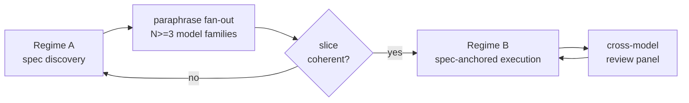

The load-bearing element is the paraphrase fan-out node. It takes the draft spec, hands it to N≥3 model families in parallel, and measures behavioural disagreement at the post-condition level. Disagreement above a threshold is treated as a contradiction in the spec, not in the models. Regime B uses the same cross-family routing for its review panel.

### Discipline binding

| # | Principle | What GF-M relies on it for |
|---|---|---|
| 1 | Specs are the source of truth | The whole point of Regime A is hardening the spec before code. If the spec isn't load-bearing, paraphrase divergence detects nothing meaningful. |
| 2 | Three-layer architecture | Cross-family routing needs the LLM-client slot to be a real abstraction (LiteLLM), not a single-provider client. |
| 5 | Scenarios as holdout | The promote-or-reverse gate at Regime A's exit reads scenarios the exploration never touched. Without that separation, slice-coherence is self-graded. |
| 6 | Satisfaction not test-pass | Paraphrase divergence is itself a satisfaction-style probabilistic metric — distance over a population of post-conditions, not a boolean. |
| 8 | "Why am I doing this?" | The reverse branch out of the coherence gate is this principle operationalised — when something looks off, articulate why, and the articulation is the new validation rule for the next draft. |
| 10 | Memory layer | Beads carries Regime A drafts and their reverse history into Regime B; without it, reverses lose context and explorations get re-run. |
| 11 | Self-healing loop | GF-M is one of three candidates (with BF-L and D7-U-1) that explicitly architects for converge-without-supervision — Regime B is meant to run batched, not per-step. |

Silent on principles 3 (pipeline-file-as-process), 4 (deterministic-first), 7 (digital twins), 9 (attribution), and 12 (publish your pipelines). Pipeline-file and attribution would need to be bolted on at implementation; deterministic-first is incompatible-by-design with paraphrase fan-out; digital twins don't apply to greenfield with no external dependencies yet; pipeline-publishing is silent across all ten candidates.

### Substrate composition

Five standard slots, plus one new piece. The paraphrase divergence harness is small custom code on top of LiteLLM — N cross-family calls + a sentence-transformer divergence metric + a threshold. The harness reads cross-family routing tags from the LLM client and writes a divergence verdict back into the pipeline engine, where the coherence gate consumes it.

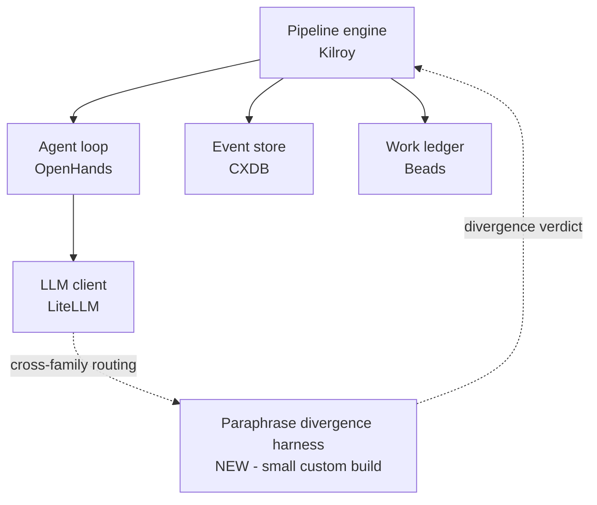

GF-M deliberately requires LiteLLM rather than Kilroy's built-in LLM client. Cross-family routing is the distinguishing capability, and LiteLLM is the OSS piece that does it well.

### What it's like to use

Reach for GF-M when you're starting greenfield, you want the cheapest possible first pressure-test, and the question you're actually trying to answer is whether multi-model contradiction-detection works at all. The substrate is almost entirely off-the-shelf — pipeline engine, agent loop, event store, work ledger, LLM client — and the one new piece is small. The bet is that cross-family disagreement catches contradictions a single model misses; the bet might fail, and if it does, paraphrase divergence has its own ceiling on contradiction-detection accuracy (this is GF-M's own load-bearing falsifier). The pressure-test cost is low in the resources that matter — engineering effort to assemble the substrate, frontier-model spend per paraphrase call, attention to set up scenarios — and if the bet holds, you've validated the cheapest piece of the unified-attempt machinery in passing. If it fails, you've spent the least to learn it doesn't work.

---

## GF-S — Greenfield, substrate-first

**Distinctive bet.** A four-guard ensemble between the agent and any consequential action makes the methodology safe to run thin.

### Methodology shape

The agent runs a deliberately thin 8-step cycle. Every consequential output flows through four deterministic gates before ship: a GtWR (INCOSE R7-R35) requirements lint, a multi-model contradiction detector, a req-count budgeter, and a perimeter type check. Any guard rejecting sends the cycle back to the agent with the specific failure.

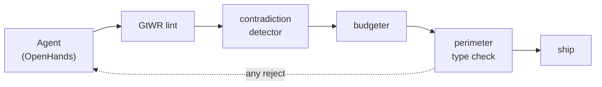

The methodology is intentionally thin because the substrate refuses unsafe outputs. The design surface is in the guards, not in the cycle's choreography.

### Discipline binding

| # | Principle | What GF-S relies on it for |
|---|---|---|
| 1 | Specs are the source of truth | The GtWR lint checks specs first. If specs aren't load-bearing, the lint has nothing to catch. |
| 2 | Three-layer architecture | Each guard is a node in the pipeline engine; the agent loop produces the artifact; the LLM client feeds the contradiction detector. |
| 3 | Pipeline-file as process | The four guards are configured as deterministic gates in the pipeline-file, not in agent prompts. |
| 4 | Deterministic-first | Three of the four guards are deterministic (lint, budgeter, perimeter type check); contradiction is multi-model but the routing is deterministic. The whole bet is on deterministic-first. |
| 5 | Scenarios as holdout | Promotion past the guards is checked against held-out scenarios. |
| 8 | "Why am I doing this?" | Every guard rule comes from an observed failure. New rules don't get written without a "why" — they get written when the team can articulate one. |

Silent on principles 6 (satisfaction-style metrics), 7 (digital twins), 9 (attribution), 10 (memory), 11 (self-healing loop), and 12. The substrate refuses unsafe outputs but doesn't measure satisfaction; attribution and memory would be bolt-ons; the self-healing loop isn't designed in.

### Substrate composition

Five standard slots plus a 4-guard mediator that sits between the agent loop and any consequential action. The mediator uses LiteLLM for the contradiction-detector's multi-model calls; the other three guards are pure deterministic checks.

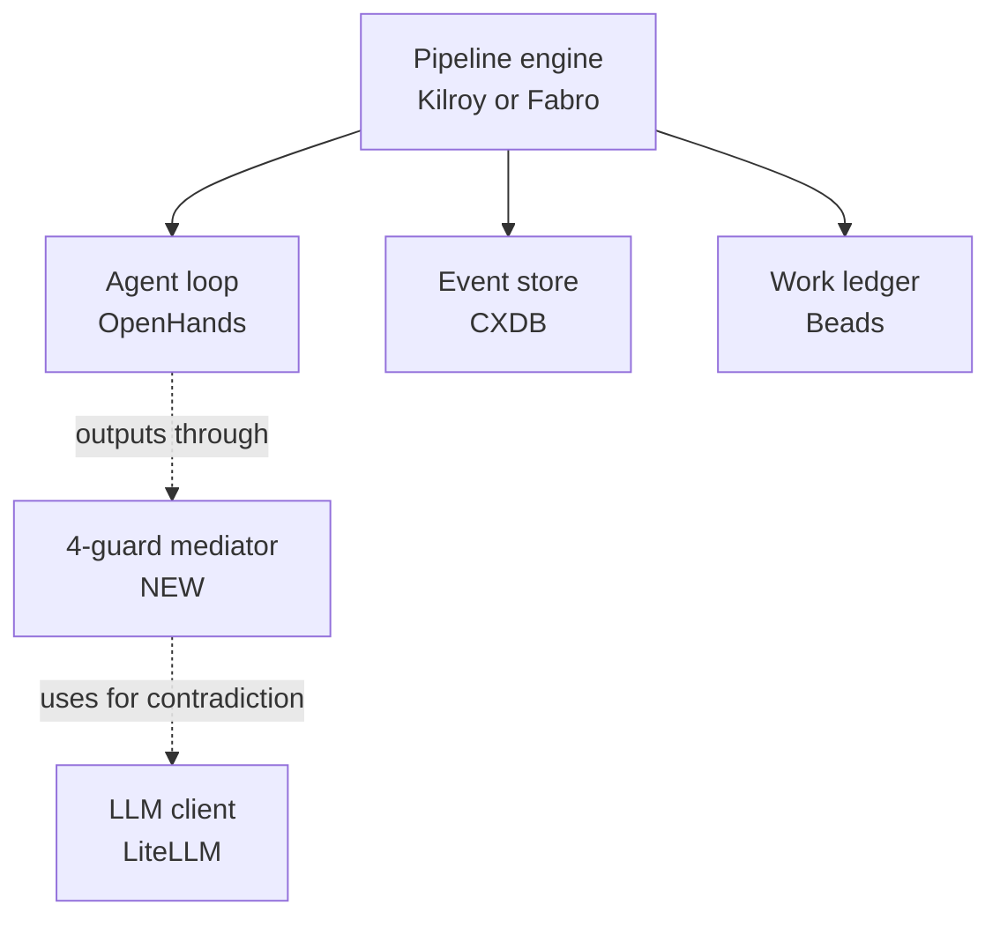

The mediator is medium-effort custom code: GtWR lint and perimeter type check are rule engines; budgeter is a counter with thresholds; the contradiction detector is the only piece with LLM-shaped cost.

### What it's like to use

Reach for GF-S when greenfield is your mandate, you're willing to invest in deterministic guard infrastructure up front, and you'd rather pay the cost in substrate engineering than in per-cycle review attention. The bet is that a small set of always-on guards catches the failure modes a human reviewer would have caught, at much lower marginal cost per cycle. The bet might fail in two specific ways: aggregate guard-firing cost dominates as cycles scale (the CFO concern), and the substrate has no answer for spec-drift from production reality once code ships. Resource framing: high upfront engineering attention for guard rules, low per-cycle frontier-model spend (most guards are deterministic), low ongoing reviewer attention. If you already have INCOSE-shaped requirements discipline and want to keep that posture in an AI factory, GF-S is the candidate that inherits it cleanly.

---

## GF-C — Greenfield, cold-start-first

**Distinctive bet.** Day-0 is where greenfield projects fail, and the failure is operator-intent-illiteracy — so make day-0 the load-bearing surface.

### Methodology shape

Three sub-phases that gate one another. The operator's intent flows through a 9-field structured Intent Crucible, then a Council of cross-family models interrogates it for ambiguity. Scenarios are authored and HMAC-signed *before* code exists (cold-start bench). The first work cycle proceeds with explicit restraint — don't accept the first plausible-looking output — and graduates to steady state only when four explicit criteria are met.

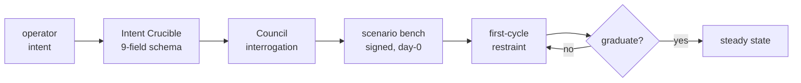

### Discipline binding

| # | Principle | What GF-C relies on it for |
|---|---|---|
| 1 | Specs are the source of truth | The Intent Crucible *is* the spec authoring surface. The whole methodology refuses to start until specs exist in structured form. |
| 2 | Three-layer architecture | Standard substrate baseline. |
| 3 | Pipeline-file as process | The intake flow + Council interrogation + bench construction is wired as a pipeline-file, not in prompts. |
| 4 | Deterministic-first | EARS lint (INCOSE R7-R35), the 9-field schema validator, and HMAC-signed bench are all deterministic. The Council is the one LLM-shaped piece. |
| 5 | Scenarios as holdout | The signed scenario bench is the *strongest* possible holdout discipline — scenarios are cryptographically frozen at day-0, before any code exists. |

Silent on principles 6, 7, 8, 9, 10, 11, 12. Notably, GF-C is silent on principle 8 ("why am I doing this?") because cold-start has irreducible operator interaction by design — the operator is *being asked* the why questions, not asking themselves. That's the methodology's identity, not a gap.

### Substrate composition

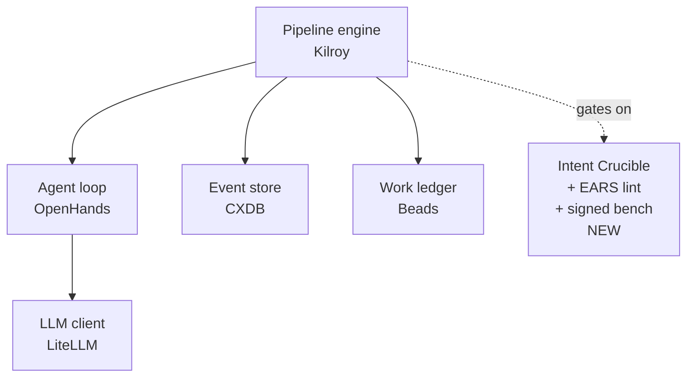

The Intent Crucible bundle is three small-to-medium custom pieces: the 9-field typed-object schema (small), the EARS lint implementing INCOSE R7-R35 (medium — the rule set is publicly specified but non-trivial to implement well), the HMAC-signed scenario store (small).

### What it's like to use

Reach for GF-C when you're greenfield, you've seen projects die from thin intent at day-0, and you trust structure-up-front more than recovery-in-flight. The bet is that operator-intent illiteracy is the dominant failure mode and that scaffolding the intent surface catches it before code is wasted. The bet fails specifically if the operator routinely click-throughs the structured intake — the substrate scaffolding becomes theatre. This is the Hughes-trappings pre-mortem and it's GF-C's own load-bearing concern: an 18-month thin-intent → click-through → spec-drift cascade. Resource framing: medium engineering attention for the Intent Crucible + EARS lint, irreducible operator attention at day-0 (this is the point, not a bug), low ongoing frontier-model spend once steady-state. If your team has the operator discipline to actually engage with structured intake, GF-C's practitioner-relevance score (the highest of the ten) reflects that the substance-check is real.

---

## BF-S — Brownfield, substrate-first

**Distinctive bet.** For small-to-medium brownfield, build a heavy substrate once and the methodology becomes thin substrate-query composition.

### Methodology shape

The work loop is short. Pick a work-unit, compose substrate queries that materialise the context the agent needs, run per-cycle verification and validation, promote findings back into the substrate as durable knowledge. The substrate does the codebase reading — the methodology composes queries against it.

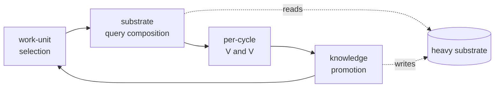

### Discipline binding

| # | Principle | What BF-S relies on it for |
|---|---|---|
| 1 | Specs are the source of truth | Specs live in the substrate alongside code, attributed and queryable. |
| 2 | Three-layer architecture | The heavy substrate sits in the persistence slot — it's the architecture. |
| 3 | Pipeline-file as process | The query-composition workflow is a DOT graph, not agent prompts. |
| 4 | Deterministic-first | Substrate queries (index lookups, dependency-graph walks, telemetry reads) are all deterministic. |
| 5 | Scenarios as holdout | Held-out scenarios exercise the perimeter and the queries. |
| 7 | Digital twins | The perimeter-typed boundary calls out external services, which want twins to keep scenarios fast. |
| 8 | "Why am I doing this?" | Substrate rules and indexes grow from observed problems — every new index is the principle in action. |
| 9 | Attribution | Per-symbol attribution is part of the substrate, not a bolt-on. |

Silent on principles 6, 10, 11, and 12. The substrate is rich enough that satisfaction-metrics, memory, and self-healing are natural extensions, but the design doesn't force them — they'd be added per-deployment.

### Substrate composition

The heavy substrate is one block in the diagram for layout reasons; it contains five sub-components (codebase index on Tree-sitter+Stack-graphs, dependency-and-impact graph, role-partitioned telemetry on OpenTelemetry, per-symbol attribution from git plumbing, CaMeL-class perimeter). It's the second-most expensive substrate primitive in the catalog, after BF-L's Codebase Model.

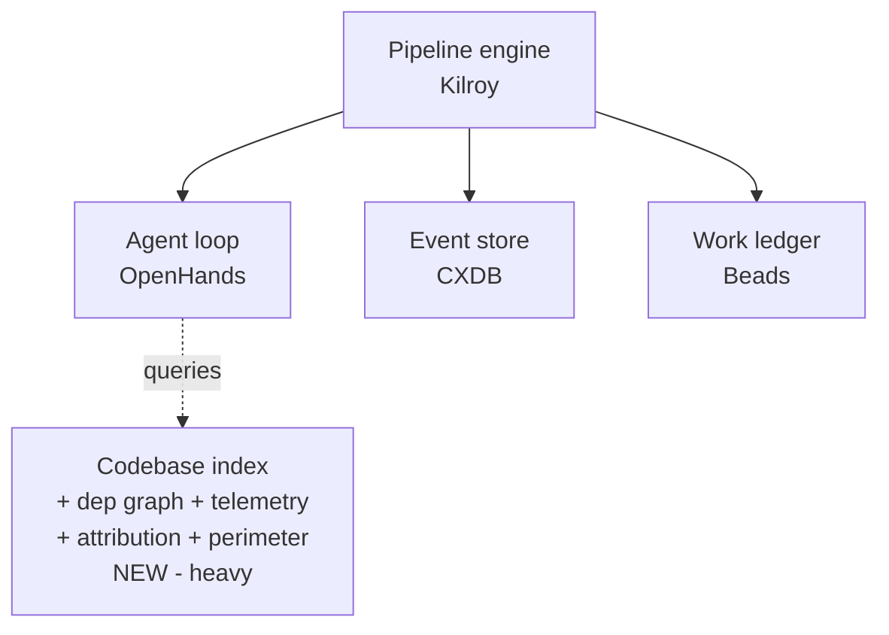

### What it's like to use

Reach for BF-S when you have a small-to-medium brownfield codebase, you can stomach the upfront substrate build, and you want a per-cycle posture that's mostly substrate queries and very little methodology-shaped friction. The bet is that doing the codebase-reading work once, in substrate, beats doing it every cycle in prompts. The bet fails specifically at Stripe-scale: with thousands of PRs per week, the substrate refreshes from its own factory output and accumulates a hall-of-mirrors effect — self-reference accretion. Role-partitioned reads also leak through dependency-graph edges (the ROBUST claim was downgraded to rate-limited side-channel mitigation). Resource framing: high upfront engineering attention for the indexing infrastructure, low ongoing per-cycle attention, low frontier-model spend (most context comes from substrate, not from re-reading code with the LLM). If your codebase is small enough that the index stays coherent and large enough that re-reading it per cycle is wasteful, BF-S sits in the sweet spot.

---

## BF-M — Brownfield, methodology-first

**Distinctive bet.** The 8-stage cycle *is* the architecture; an archaeological-brief generator carries codebase context into each cycle so substrate stays thin.

### Methodology shape

Eight stages — Trigger, Comprehension, Intent, Plan, Build, Review, Acceptance, Ship — compress to six visual nodes when paired stages collapse. The archaeological brief is generated per cycle and supplies the comprehension layer the agent needs. Cross-model review is the F46 single-model-blindspot defense. Acceptance reads held-out scenarios pulled from the codebase itself. Ship-or-escalate routes back to archaeology when something doesn't fit.

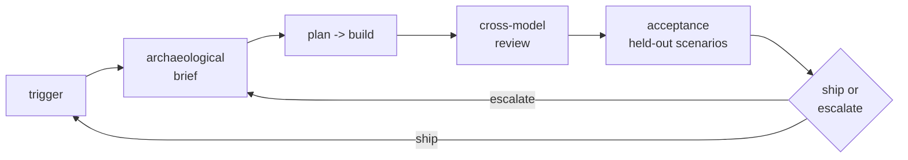

### Discipline binding

| # | Principle | What BF-M relies on it for |
|---|---|---|
| 1 | Specs are the source of truth | The intent stage produces a spec that drives plan and build; the archaeological brief constrains what specs are coherent for this codebase. |
| 2 | Three-layer architecture | Standard. The cycle is the architecture in a sense, but it sits on the standard stack. |
| 3 | Pipeline-file as process | The 8 stages are pipeline-file nodes, with compression rules per work-unit-class. |
| 5 | Scenarios as holdout | Acceptance pulls held-out scenarios from the codebase itself (scenarios-from-codebase). |
| 6 | Satisfaction not test-pass | Cross-model review is satisfaction-style: a panel of judges, not a boolean. |
| 8 | "Why am I doing this?" | The archaeological brief operationalises this — it's the explicit articulation of what the codebase already says about why the current code looks like it does. |

Silent on principles 4 (deterministic-first), 7, 9, 10, 11, and 12. Notably BF-M is silent on deterministic-first because the methodology leans hard on LLM stages (brief generation, plan, review) — it's a *methodology-first* candidate by name.

### Substrate composition

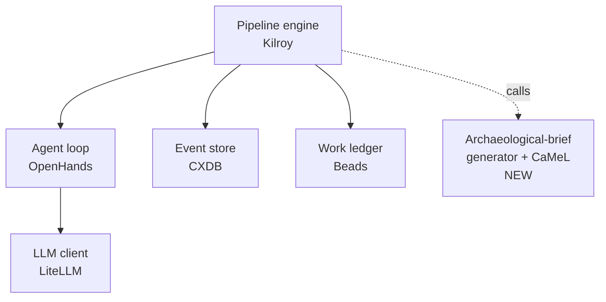

The new piece is small-to-medium: an LLM-driven structured codebase summariser (small) plus a CaMeL-class typed-interpreter for the boundary (medium, derived from the CaMeL paper + AgentDojo benchmarks).

### What it's like to use

Reach for BF-M when you have a brownfield codebase, you want methodology shape rather than heavy substrate, and you trust per-cycle archaeological summarisation to carry context. The bet is that a good brief, generated fresh per cycle, beats a heavy persistent index for codebases below Stripe scale. It fails specifically in four unresolved areas: stage-compression rules per work-unit class are sketched not specified; whether cross-model review is even necessary remains contested (Anthropic's finding that same-model review can be fine); the CaMeL utility-tax threshold isn't set; and scenarios-from-codebase governance is unspecified. Resource framing: low upfront engineering attention (the brief generator is small), medium per-cycle frontier-model spend (brief + cross-model review per cycle), low ongoing infrastructure cost. The practitioner-relevance score is high because brief-recall against labelled codebase invariants is a directly measurable engineering signal — you can tell whether the brief is doing its job.

---

## BF-L — Brownfield, legacy-ingestion-first

**Distinctive bet.** For large legacy codebases, ingestion *is* the work; build a six-view Codebase Model once and query it forever.

### Methodology shape

Three loops over a central Codebase Model. Ingestion is deep, slow, and runs once per codebase (plus refresh on triggers). The work loop is the per-cycle methodology, but it queries the model rather than the codebase directly. The maintenance loop is continuous and low-cadence — it reconciles the model with reality, which is the Pulse-report / self-healing pattern made concrete.

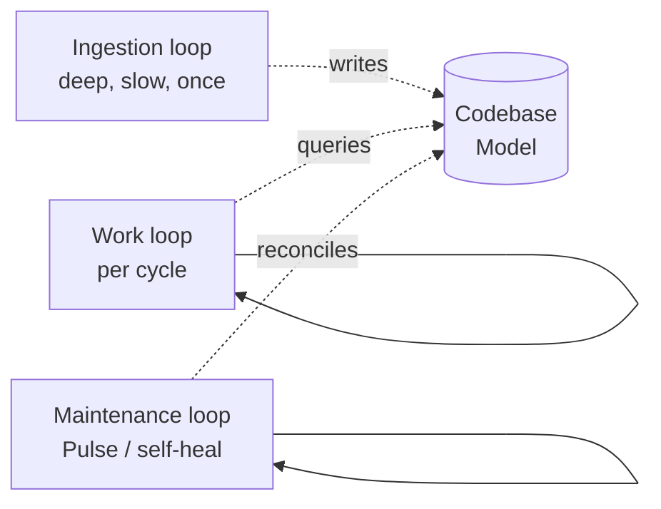

### Discipline binding

| # | Principle | What BF-L relies on it for |
|---|---|---|
| 1 | Specs are the source of truth | Specs are one view of the model; the model is the unified source. |
| 2 | Three-layer architecture | The Codebase Model is the load-bearing addition to the standard stack. |
| 3 | Pipeline-file as process | The three loops are three pipeline-files over a shared substrate. |
| 5 | Scenarios as holdout | Held-out scenarios include both authored and codebase-derived. |
| 6 | Satisfaction not test-pass | Pulse-loop closure is satisfaction-shaped: did the model reconcile, did the work resolve? |
| 7 | Digital twins | Large legacy codebases routinely call external services; twins keep scenarios scalable. |
| 8 | "Why am I doing this?" | The maintenance loop *is* this principle as an architecture — every drift event is an articulated "why is this not what we thought?" |
| 9 | Attribution | The historical view is built on per-symbol attribution from git + GitHub APIs. |
| 10 | Memory layer | The Codebase Model itself is the memory layer; Beads becomes a thin work-queue overlay. |
| 11 | Self-healing loop | The maintenance loop IS the Pulse pattern — observability → anomaly → diagnosis → fix → reconciliation. |

Silent only on principle 12. BF-L is the most discipline-binding candidate of the ten — appropriate for the most ambitious substrate primitive in the catalog.

### Substrate composition

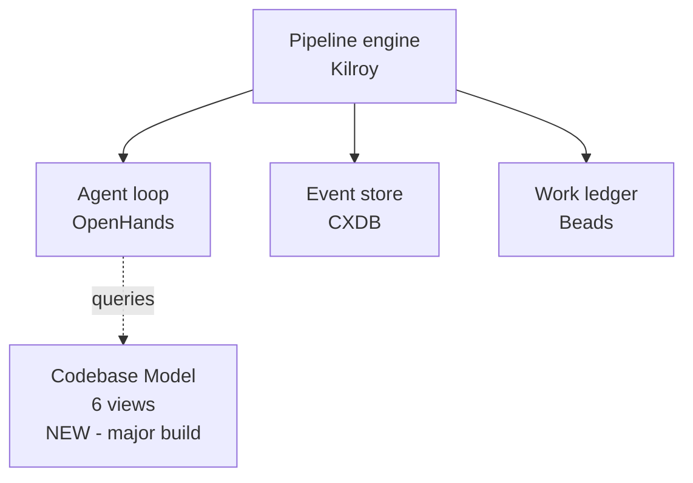

The Codebase Model is one block at this zoom level. Inside, it's six views over a unified queryable layer:

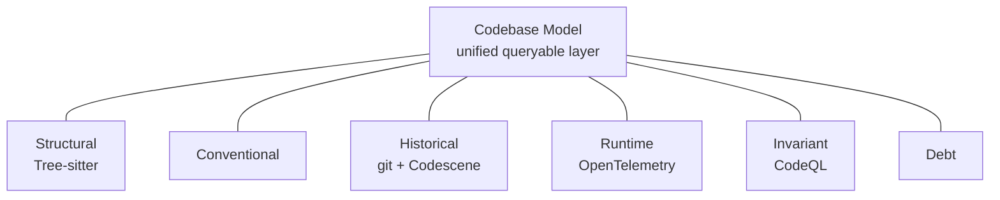

Each view has at least one existing OSS foundation; the integration layer that makes them queryable as one is the major engineering investment. This is the catalog's most ambitious substrate primitive.

### What it's like to use

Reach for BF-L when you have a 1M+ LOC, 18+ month, multi-language legacy codebase, you've already validated the methodology shape against smaller candidates, and the lean-eval evidence specifically demands the Pulse-loop pattern for your domain. Don't start here. The bet is that ingestion dominates total cost on legacy codebases and that investing heavily once beats paying it every cycle. It fails specifically at Codebase-Model staleness vs. cycle latency (refresh cost), at governance (F43 board-visibility across per-region regime fragments), and as an attack surface (a poisoned model poisons every downstream decision). Ingestion-as-substrate vs. ingestion-as-methodology is unresolved at design time. Resource framing: this is the major engineering investment in the catalog — the most ambitious substrate primitive, with the highest upfront engineering attention, the highest sustained operational attention, and the strongest payoff *if* the Pulse-loop pattern is the right answer for your codebase. The practitioner-relevance score is medium because Pulse-loop closure is directly visible but the upfront cost dominates the decision.

---

## U-A — Escrow-Graph Factory (Unified)

**Distinctive bet.** Every work cycle is a directed graph of typed nodes; policies enforced at node boundaries are the methodology.

### Methodology shape

Each cycle materialises as a small DAG: intent → plan → build → review → ship, with each node carrying its kind, pace-layer, priors, classifier-decision, and artifacts. The policy mediator (OPA or Cedar) gates each boundary — pre-conditions, post-conditions, transitions. Mandate becomes a node attribute, not a separate methodology, which is the unification claim.

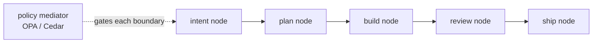

### Discipline binding

| # | Principle | What U-A relies on it for |
|---|---|---|
| 1 | Specs are the source of truth | Intent nodes carry specs as typed objects, content-addressed. |
| 2 | Three-layer architecture | Standard, with the typed-object store as a content-addressed addition. |
| 3 | Pipeline-file as process | The node DAG is the pipeline-file; policies are declarative. |
| 5 | Scenarios as holdout | Review nodes consume held-out scenarios at boundaries. |
| 6 | Satisfaction not test-pass | Classifier decisions are probabilistic over node attributes. |
| 8 | "Why am I doing this?" | Every policy is the principle written down — articulate the rule, gate the boundary on it. |
| 9 | Attribution | Every node carries actor identity; this is core, not a bolt-on. |
| 10 | Memory layer | The typed-object store is the memory layer, content-addressed and append-only. |

Silent on principles 4, 7, 11, and 12. Deterministic-first depends on how the classifier is implemented; self-healing isn't designed in.

### Substrate composition

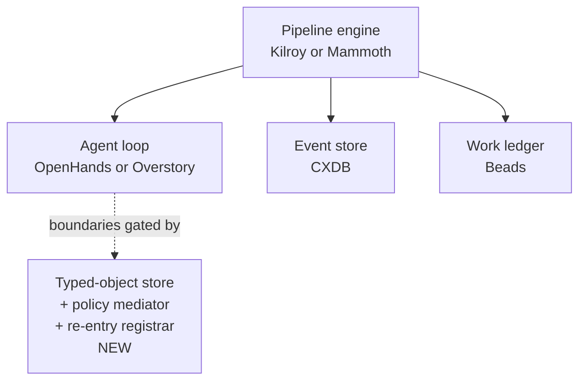

Mammoth's DOT linter is a natural fit for typed-node graphs; Overstory's fleet posture maps to U-A's per-node-as-agent model. The new piece is three small-to-medium components: typed-object store (content-addressed append-only, foundation IPFS or git's object store), policy mediator (OPA or Cedar config + integration), re-entry registrar (substrate-typed event protocol).

### What it's like to use

Reach for U-A when you want a unified-mandate methodology, you trust declarative policy more than per-cycle review, and you're comfortable with substrate-emitted evidence as the dominant feedback signal. The bet is that typed-node DAGs + boundary policies generalise across mandates without invoking escape-hatches. The bet fails in three places: DPU-1 granularity cost at year-2 scale (process-state expands to thousands of nodes per day); brownfield needs a Codebase Model bolted on; graduation criteria don't measurably mean the same thing across greenfield and brownfield. Resource framing: medium engineering attention for the typed-object store + policy mediator, low per-cycle frontier-model spend, high substrate-storage growth over time. Practitioner-thin: U-A's falsifier measures `methodology-delta` count in a `solutions/` directory — mathematically tractable but not what an engineer feels when something goes wrong. If you trust substrate-emitted distributions as the truth signal, U-A is clean; if you want practitioner-felt acceptance criteria, U-A is the wrong shape.

---

## U-B — Pace-Layered Escrow Factory (Unified)

**Distinctive bet.** Five Brier pace-layers; greenfield traverses top-down, brownfield infers bottom-up; same architecture, opposite direction.

### Methodology shape

Five layers from L0 standards (slowest) to L4 code (fastest). Greenfield seeds L0/L1 from priors and descends to L4. Brownfield reads L4 code and infers upward to L1 architecture. A cross-layer drift detector monitors layer-to-layer invariants and surfaces inconsistencies.

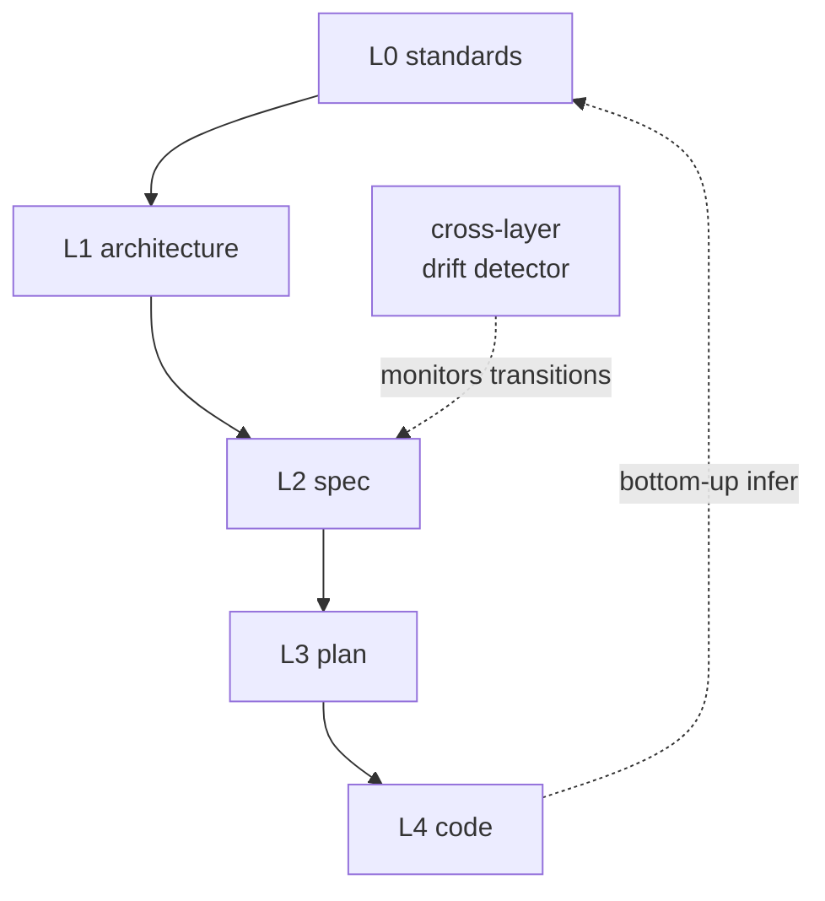

### Discipline binding

| # | Principle | What U-B relies on it for |
|---|---|---|
| 1 | Specs are the source of truth | L2 (spec) is one of the five load-bearing layers. |
| 2 | Three-layer architecture | Standard substrate, with layer-typed object stores layered on top. |
| 3 | Pipeline-file as process | Layer transitions are pipeline-file nodes. |
| 5 | Scenarios as holdout | Held-out scenarios test invariants across layers. |
| 6 | Satisfaction not test-pass | LayerInferenceConfidence is satisfaction-style — a distribution, not a boolean. |
| 8 | "Why am I doing this?" | Drift events are articulated cross-layer "whys" — why does L4 not match L1? |
| 9 | Attribution | Each layer-typed object carries attribution by layer. |
| 10 | Memory layer | Per-layer typed-object stores collectively form the memory. |

Silent on principles 4, 7, 11, and 12.

### Substrate composition

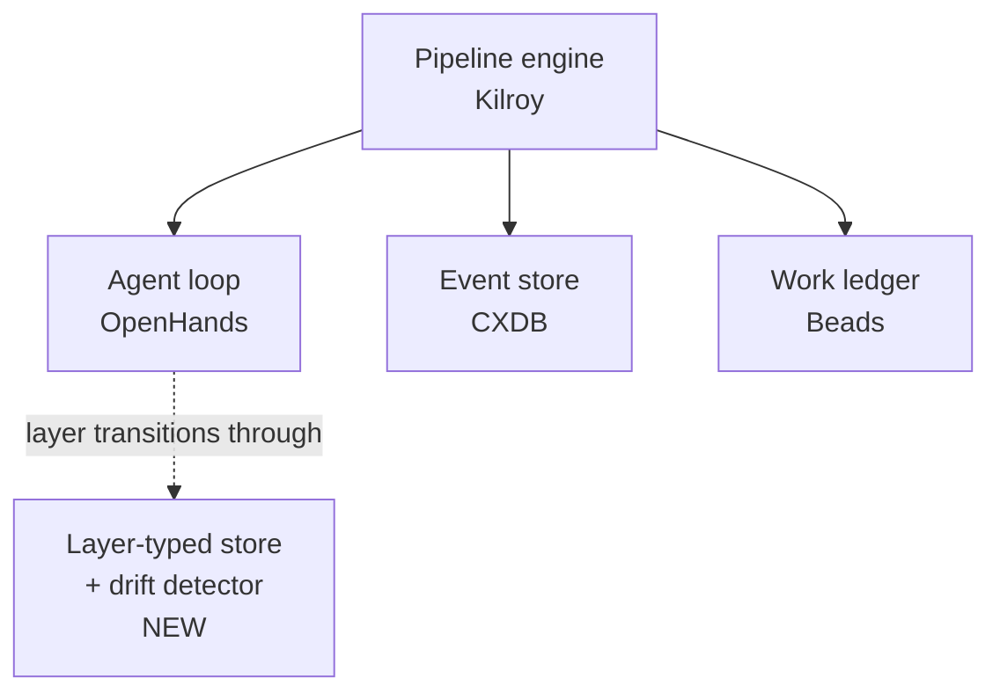

The new piece is small-to-medium: layer-typed object stores (one per pace-layer, small) plus the cross-layer drift detector with per-layer invariants. The drift detector is the load-bearing engineering — Brier's pace-layer framework is a description, not a tool.

### What it's like to use

Reach for U-B when you want a unified methodology with a clean conceptual frame, you can defend the choice of layer count, and you're willing to implement bottom-up inference as new procedure (not just descend-from-the-top). The bet is that Brier's pace-layer model carves at the right joints across mandates. The bet fails specifically if the layer count is wrong — Brier asserts 5, El Kaim implies more, and if the right answer is 6 or 7 the architecture is wrong by construction. Bottom-up inference's mechanics are also not specified — "read L4 code, infer L3 plan" sounds clean but isn't a defined procedure. Resource framing: medium engineering attention for the layer-typed stores + drift detector, low per-cycle frontier-model spend, medium substrate-storage growth. Practitioner-thin: U-B's falsifier measures LayerInferenceConfidence distribution — substrate-emitted, not practitioner-felt. F52 risk also applies — imposing deterministic structure on stochastic agents may yield brittleness.

---

## U-C — Anchor-Distance Factory (Unified)

**Distinctive bet.** Every work unit declares an anchor and measures distance to it; a dispatcher routes by distance regime.

### Methodology shape

Each work unit references a frozen anchor — a spec section, a deployed system, a regulatory document, etc. A distance estimator computes the unit's distance to its anchor along multiple dimensions (graph distance, pace-layer crossings, intent-field touches). A dispatcher routes by regime: near-anchor work goes lights-out, mid-distance work goes through cross-family Augmentation, far-distance or anchor-edit work is human-required by name.

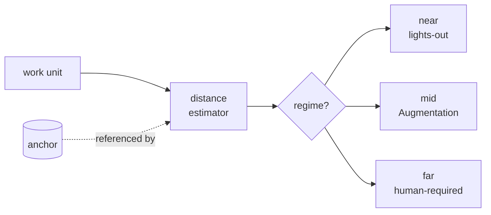

### Discipline binding

| # | Principle | What U-C relies on it for |
|---|---|---|
| 1 | Specs are the source of truth | Anchors are typically spec sections (one anchor kind among several); specs are load-bearing. |
| 2 | Three-layer architecture | Standard, with the anchor store + distance estimator + dispatcher as additions. |
| 3 | Pipeline-file as process | The dispatcher's regime routing is pipeline-file logic. |
| 5 | Scenarios as holdout | Held-out scenarios test the dispatcher's regime classifications. |
| 6 | Satisfaction not test-pass | The distance signal is itself satisfaction-style — a continuous score, not a boolean. |
| 8 | "Why am I doing this?" | Anchor mutation requires named-human approval — the principle made into a queue. |
| 9 | Attribution | Anchors carry stable IDs (H-1 was volunteered by U-C); every distance computation traces back to a named anchor. |

Silent on principles 4, 7, 10, 11, and 12.

### Substrate composition

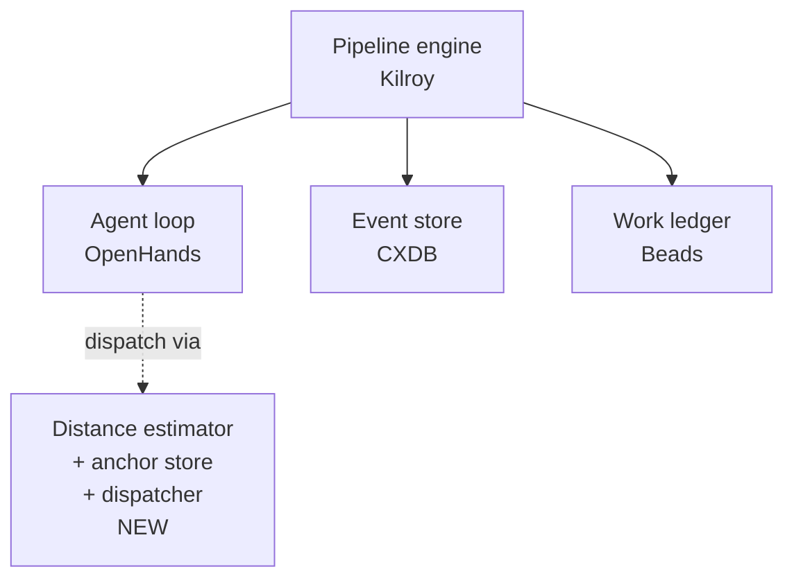

For brownfield coverage, U-C's graph-distance component depends on BF-L's Codebase Model — otherwise you'd build a simpler dependency-graph substrate just for U-C. That cross-candidate dependency is the load-bearing cost decision.

### What it's like to use

Reach for U-C when you want a unified methodology that produces directly observable regime-distribution signals, you're comfortable with a multi-component distance estimator as the dispatcher's truth source, and you can pay the Codebase Model dependency if you need brownfield coverage. The bet is that distance-to-anchor is the right axis for routing autonomy. It fails specifically in four ways: Goodhart on the distance estimator (agents game scores to land in lights-out); Ashby-deficiency on probabilistic detection (the distance signal may not have enough variety to discriminate regimes); F8 stale-knowledge over multi-month cold-starts; and operator-legibility — can the operator understand *why* this unit was routed to lights-out vs. mid? Resource framing: medium-to-high engineering attention for the distance estimator (multi-component, calibration-sensitive), low per-cycle frontier-model spend, high if you also need BF-L's Codebase Model for brownfield coverage. Of the four unified-attempts, U-C has the strongest practitioner-relevance — the dispatcher's regime distribution is directly observable and H-1 stable-ID adoption makes anchor traceability legible.

---

## D7-U-1 — Falsification-Topology Factory (Unified)

**Distinctive bet.** Every load-bearing artifact carries a typed Falsification Commitment naming who must try to break it before it compounds forward.

### Methodology shape

Per artifact: creation → FC declaration → opposing-side refutation attempt → survival verdict → compounding gate. The opposing side is a typed role (different model family, deterministic checker, named human, population vote). If the artifact survives its FC, it compounds forward through the gate. If it doesn't, it goes back. Greenfield starts with a sparse FC catalog (operator-as-opposing-side at day-0); brownfield starts rich (existing tests, telemetry, type checks already serve as opposing sides).

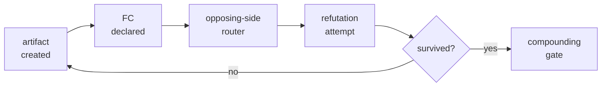

### Discipline binding

| # | Principle | What D7-U-1 relies on it for |
|---|---|---|
| 1 | Specs are the source of truth | Specs are FC-carrying artifacts; the FC is the spec's adversarial contract. |
| 2 | Three-layer architecture | Standard, plus the FC store as an append-only addition. |
| 3 | Pipeline-file as process | The FC declaration → router → refutation → gate flow is pipeline-file shape. |
| 4 | Deterministic-first | Deterministic checkers are one of four opposing-side kinds; the architecture privileges them where they fit. |
| 5 | Scenarios as holdout | Held-out scenarios are one form of opposing side. |
| 6 | Satisfaction not test-pass | Survival is probabilistic over refutation attempts. |
| 8 | "Why am I doing this?" | Every FC is the principle written as a contract — "this artifact claims X; here's who could falsify it." |
| 9 | Attribution | Opposing sides are typed, named, and logged; the auditor reads provenance. |
| 11 | Self-healing loop | Survival-window registrar is a re-falsification cadence — artifacts get re-checked over time. |

Silent on principles 7, 10, and 12.

### Substrate composition

```mermaid
flowchart TB
    PE[Pipeline engine<br/>Kilroy or Mammoth]
    AL[Agent loop<br/>OpenHands]
    ES[Event store<br/>CXDB]
    WL[Work ledger<br/>Beads]
    FS[FC store + opposing-side router<br/>+ independence auditor<br/>+ survival registrar<br/>NEW]
    PE --> AL
    AL -.gates via.-> FS
    PE --> ES
    PE --> WL
```

The new piece bundles four small-to-medium components: FC store (content-addressed append-only), opposing-side router (provider-property-driven, model-family taxonomy + capability registry), independence auditor (anomaly detection on FC-log distributions to catch collusion), survival-window registrar (typed event-state-machine).

### What it's like to use

Reach for D7-U-1 when you want a unified methodology framed around adversarial pressure as the first-class signal, you're comfortable with substrate-emitted evidence (KL divergence on opposing-side distributions) as the dominant feedback, and you can defend the independence-auditor recursion. The bet is that artifacts that survive opposing-side refutation are durably safe to compound — the architecture is the topology of build/break pairs. It fails specifically in five places: who audits the independence auditor (D7-U-1's own load-bearing open question with no dominating answer); FC-graph cost at high parallelism (untested); survival-window calibration (corpus-thin — how long does an FC stay fresh?); opposing-side gaming under Goodhart (the opposing side learns to falsify weakly); and operator-as-opposing-side scalability at greenfield day-0 (does the operator actually exercise enough adversarial pressure?). Resource framing: medium engineering attention for the four substrate components, medium-to-high per-cycle frontier-model spend (opposing-side calls add cost), high substrate-log growth. Practitioner-thin: the falsifier is mathematically rigorous but not tied to software-quality outcomes a practitioner experiences.
