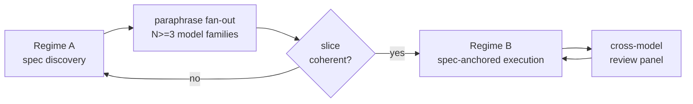
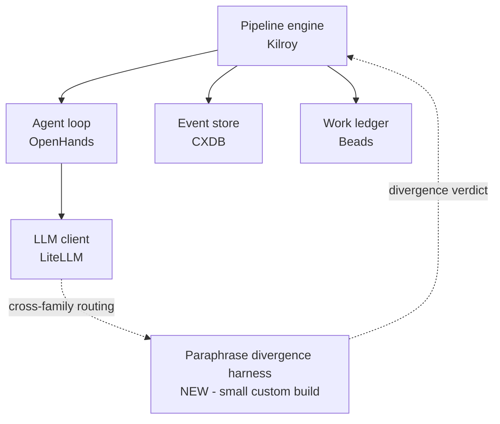

# 05 — Per-candidate diagrams

One section per candidate. Three artifacts each: a methodology diagram (the shape of the work cycle), a discipline binding table (which of the 12 principles the candidate explicitly relies on, and why), and a substrate composition diagram (what's already covered by OSS plus the one new piece). A short prose paragraph closes each section with what the candidate is like to use.

**Sample-first status.** Only **GF-M** is filled in below — it's the representative chosen to validate the format. The other nine sections are stubs until the GF-M format is signed off. If the format reads wrong, fixing it once is cheap; fixing it ten times is not.

If you want to recheck the candidates' distinctive bets, what could kill them, and the practitioner verdicts, those stay in [`04-candidates.md`](04-candidates.md). This file is the visual layer on top of that table.

---

## GF-M — Greenfield, methodology-first

**Distinctive bet.** Spec disagreement across three or more model families is a stronger contradiction signal than any single LLM judge.

### Methodology shape

Two regimes. Regime A is exploratory spec-discovery; Regime B is the steady-state compound-engineering loop. The transition is gated on slice coherence — an end-to-end scenario passing through the slice with no intent gap. Promote-or-reverse: a draft that fails coherence reverses cleanly back to Regime A rather than corrupting Regime B.

The load-bearing element is the paraphrase fan-out node. It takes the draft spec, hands it to N≥3 model families in parallel, and measures behavioural disagreement at the post-condition level. Disagreement above a threshold is treated as a contradiction in the spec, not in the models. Regime B uses the same cross-family routing for its review panel.

### Discipline binding

The full 12-principle matrix lives in [`02-paradigm.md`](02-paradigm.md). Here's why GF-M relies on each of the ones it binds.

| # | Principle | What GF-M relies on it for |
|---|---|---|
| 1 | Specs are the source of truth | The whole point of Regime A is hardening the spec before code. If the spec isn't load-bearing, paraphrase divergence detects nothing meaningful. |
| 2 | Three-layer architecture | Cross-family routing needs the LLM-client slot to be a real abstraction (LiteLLM), not a single-provider client. |
| 5 | Scenarios as holdout | The promote-or-reverse gate at Regime A's exit reads scenarios the exploration never touched. Without that separation, slice-coherence is self-graded. |
| 6 | Satisfaction not test-pass | Paraphrase divergence is itself a satisfaction-style probabilistic metric — distance over a population of post-conditions, not a boolean. |
| 8 | "Why am I doing this?" | The reverse branch out of the coherence gate is this principle operationalised — when something looks off, articulate why, and the articulation is the new validation rule for the next draft. |
| 10 | Memory layer | Beads carries Regime A drafts and their reverse history into Regime B; without it, reverses lose context and explorations get re-run. |
| 11 | Self-healing loop | GF-M is one of three candidates (with BF-L and D7-U-1) that explicitly architects for converge-without-supervision — Regime B is meant to run batched, not per-step. |

Silent on principles 3 (pipeline-file-as-process), 4 (deterministic-first), 7 (digital twins), 9 (attribution), and 12 (publish your pipelines). Pipeline-file and attribution would need to be bolted on at implementation; deterministic-first is incompatible-by-design with paraphrase fan-out; digital twins don't apply to greenfield with no external dependencies yet; pipeline-publishing is silent across all ten candidates.

### Substrate composition

Five standard slots, plus one new piece. The paraphrase divergence harness is small custom code on top of LiteLLM — N cross-family calls + a sentence-transformer divergence metric + a threshold. The harness reads cross-family routing tags from the LLM client and writes a divergence verdict back into the pipeline engine, where the coherence gate consumes it.

GF-M deliberately requires LiteLLM rather than Kilroy's built-in LLM client. Cross-family routing is the distinguishing capability, and LiteLLM is the OSS piece that does it well.

### What it's like to use

Reach for GF-M when you're starting greenfield, you want the cheapest possible first pressure-test, and the question you're actually trying to answer is whether multi-model contradiction-detection works at all. The substrate is almost entirely off-the-shelf — pipeline engine, agent loop, event store, work ledger, LLM client — and the one new piece is small. The bet is that cross-family disagreement catches contradictions a single model misses; the bet might fail, and if it does, paraphrase divergence has its own ceiling on contradiction-detection accuracy (this is GF-M's own load-bearing falsifier). The pressure-test cost is low in the resources that matter — engineering effort to assemble the substrate, frontier-model spend per paraphrase call, attention to set up scenarios — and if the bet holds, you've validated the cheapest piece of the unified-attempt machinery in passing. If it fails, you've spent the least to learn it doesn't work.

---

## GF-S — Greenfield, substrate-first

*Pending sign-off on GF-M format.*

## GF-C — Greenfield, cold-start-first

*Pending sign-off on GF-M format.*

## BF-S — Brownfield, substrate-first

*Pending sign-off on GF-M format.*

## BF-M — Brownfield, methodology-first

*Pending sign-off on GF-M format.*

## BF-L — Brownfield, legacy-ingestion-first

*Pending sign-off on GF-M format.*

## U-A — Escrow-Graph Factory (Unified)

*Pending sign-off on GF-M format.*

## U-B — Pace-Layered Escrow Factory (Unified)

*Pending sign-off on GF-M format.*

## U-C — Anchor-Distance Factory (Unified)

*Pending sign-off on GF-M format.*

## D7-U-1 — Falsification-Topology Factory (Unified)

*Pending sign-off on GF-M format.*

---

## Open questions on the format itself

These are the things I want sign-off on before producing the other nine. Look at GF-M with these specifically in mind.

- **Methodology diagram element count.** GF-M's is 5 nodes. Some candidates (BF-L's six-view Codebase Model, U-A's typed-node DAG) may not fit in ≤7 elements for the methodology — the substrate diagram alone could be 6+ for BF-L. If GF-M's level of abstraction looks too coarse or too fine, say so; I'll calibrate before the others.
- **Discipline-table format.** GF-M shows only the ✓ principles with a "why GF-M relies on it" column, plus a one-paragraph silent-on note. Alternative: full 12-row table with ✓/○/✗ + annotations for each. The full table is more complete but largely re-renders the cross-candidate matrix from `02-paradigm.md`.
- **Substrate diagram conventions.** Solid arrows for the standard data flow; dotted arrows with labels for the candidate-specific interactions. "NEW" annotation on the custom piece. Five standard slots shown explicitly. If you'd rather just show the new piece in context (cut the standard slots to "..."), say so.
- **Prose paragraph length and shape.** ~150 words, lead with "reach for this when," name what could kill the bet, frame in resources (engineering effort, attention, frontier-model spend) not in dollars or weeks. Adjust if too long, too short, or framed wrong.

Once GF-M's format is acceptable, producing the other nine is mostly mechanical.
