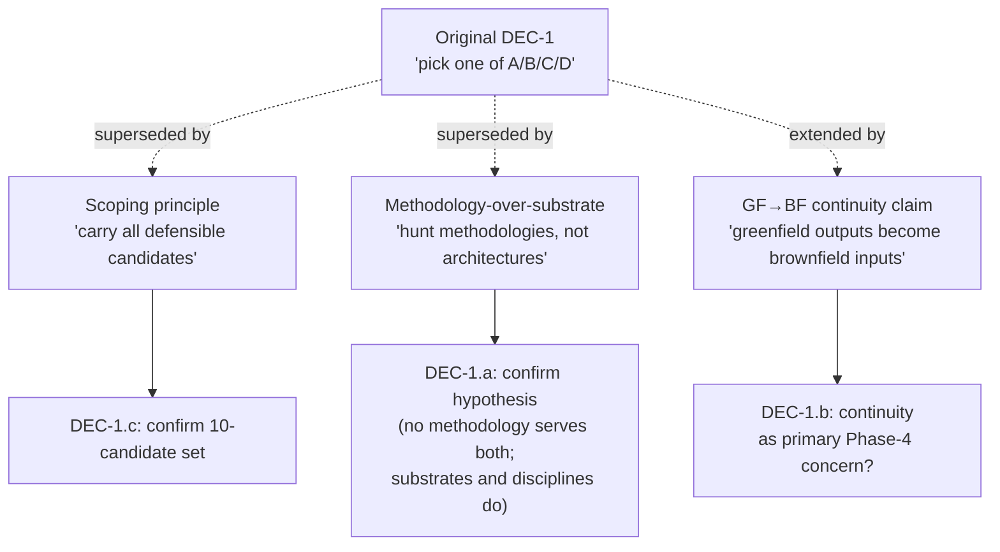
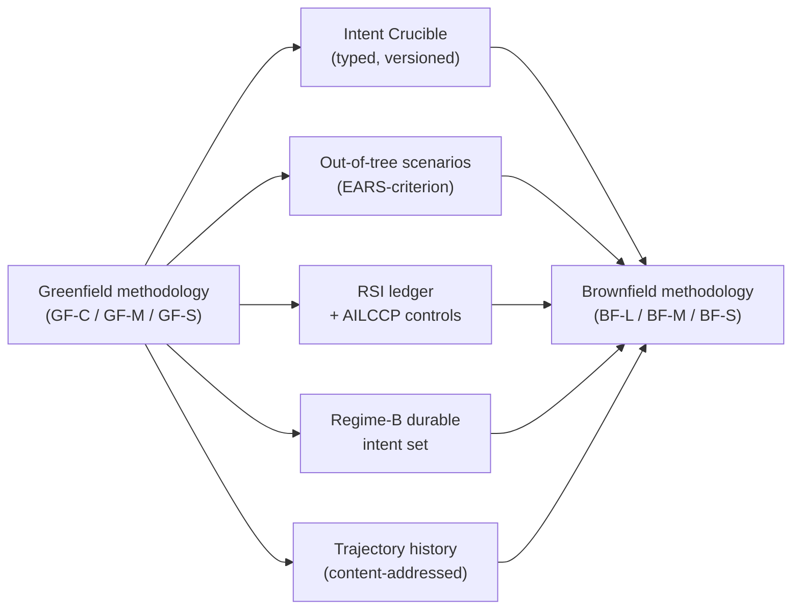
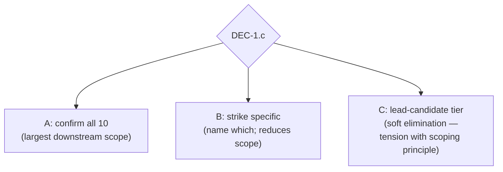

# DEC-1 (reframed) — Unification verdict, three confirmations

> **Status.** The original DEC-1 brief at [`dec-1-unification-verdict.md`](dec-1-unification-verdict.md) is superseded. That brief asked "pick one of A/B/C/D" (unified / split / two unified candidates / defer). Under the scoping principle declared at session-end 2026-05-25 ("carry forward every candidate that defended itself"), most of that framing dissolves into Phase-4 normal work. What remains for the user to decide at DEC-1 is three small confirmations: **DEC-1.a** (working hypothesis), **DEC-1.b** (greenfield → brownfield continuity), **DEC-1.c** (the candidate set). This file is the brief for all three.

**The question(s).** Three confirmations that orient Phase 4 onward:

- **DEC-1.a** — Do we adopt the user's working hypothesis (*no methodology serves both mandates; substrates and disciplines do*) as the orienting commitment for Phase 4?
- **DEC-1.b** — Do we treat *greenfield → brownfield artifact continuity* as a primary Phase-4 design concern (a new scope item, not in the original Phase-4 plan)?
- **DEC-1.c** — Do we confirm the [10-candidate registry](../candidate-registry.md) as the carry-forward set, or strike specific candidates?

## Origin of the tension

Phase 3.3 dispatched four cross-mandate subagents (an [adversarial-collaboration](https://en.wikipedia.org/wiki/Adversarial_collaboration)-shaped grid) to test Phase 0's working hypothesis that no single architecture works for both mandates. **The four verdicts split four ways.** Upstream Phase-3.2 persona critiques and Phase-2 splitter/lumper bias guards added more independent signal pointing at different answers. The original DEC-1 brief asked the user to pick a single architecture-level resolution.

The user's session-end reframe rejected that framing on two grounds:

1. **Scoping principle.** No public corpus source describes a working factory; eliminating defensible candidates at end-of-Phase-3 forecloses the cross-pollination that downstream simulation is supposed to surface. Pressure-test in Phase 8 / simulation, not at the Phase-3.4 checkpoint.
2. **Methodology-over-substrate orientation.** The hunt is for *methodologies*; substrate requirements fall out per methodology. Combined with the buildability rule (construction path + corpus-why), this dissolves the "one architecture vs. two" question into "which methodologies, with what substrate primitives, with what continuity between mandates."

---

## DEC-1.a — Working hypothesis

**Concretely.** Phase 4 proceeds under the user's stated hypothesis: methodology is mandate-specific; substrate primitives and architecture-level disciplines (citation, concrete-task, bias-guard) are cross-mandate. The hypothesis is *not* a conclusion — Phase 8 lean-evals can falsify it — but it is the operating frame.

### Option A — Confirm the hypothesis

**Shape.** Phase 4 dispatches per-mandate methodology extraction (3 GF + 3 BF + 4 unified-attempt methodologies — the unified-attempt four remain to *test* the hypothesis from the inside) and cross-mandate substrate + discipline extraction. The unified-attempt candidates (U-A / U-B / U-C / D7-U-1) carry forward as candidate methodologies — if any of them survives Phase-8 pressure-testing as a single methodology that fits both mandates, the hypothesis is falsified empirically.

**Argued by:**
- User's session-end message, plus the scoping principle's logic (we don't know what works, so let the empirical evaluation tell us).
- **`X_GFB_X`** ([`bias-guards/phase-3/cross-mandate/x-gfb-x.md`](../bias-guards/phase-3/cross-mandate/x-gfb-x.md)): greenfield day-0 primitives have no brownfield analog; brownfield CodebaseModel has no greenfield analog.
- **`X_UNM_B`** ([`x-unm-b.md`](../bias-guards/phase-3/cross-mandate/x-unm-b.md)): unified candidates without an equivalent to brownfield's CodebaseModel leave F21/F28/F34 unmitigated for the brownfield mandate.
- **Splitter Cluster-4** (Phase-2, [`bias-guards/phase-2/splitter.md`](../bias-guards/phase-2/splitter.md)): cold-start vs legacy-ingestion is a corpus-supported split.

### Option B — Reject the hypothesis

**Shape.** Phase 4 hunts for *one* methodology that serves both mandates. The 3 GF + 3 BF mandate-specific candidates are demoted to "fallback alternatives if no unifier survives." The four unified-attempt candidates are promoted to primary; mandate-specific candidates exist only as foil.

**Argued by:**
- **`X_GFB_A`** ([`x-gfb-a.md`](../bias-guards/phase-3/cross-mandate/x-gfb-a.md)): 8 of 8 tactical-substrate primitives are shared across mandates — that overlap is evidence of architectural unity, not coincidence.
- **U-B's pace-layer bidirectional-traversal claim**: same five-layer artifact stack serves both mandates, just traversed in opposite directions (top-down for GF, bottom-up for BF). If true, the hypothesis is false at architecture level.

### Option C — Defer

**Shape.** Don't commit to the hypothesis either way. Phase 4 dispatches both per-mandate *and* unified hunts with equal weight; the question reopens at Phase 8 with empirical evidence.

**Argued by:** the maximalist reading of the scoping principle — if we're refusing to eliminate at Phase 3, why commit to an orientation at Phase 3.4?

**Cost.** Roughly doubles Phase-4 dispatch scope. Phase-5 ADR set has to handle both orientations.

---

## DEC-1.b — Greenfield → brownfield continuity

The user's hypothesis includes a substantive sub-claim: a greenfield factory that produces *the right artifacts* (typed intent blocks, versioned scenario sets, signed RSI ledgers, paraphrase-divergence baselines, trajectory history, scenario partitions, classifier feature priors) makes the *subsequent* brownfield methodology easier when the greenfield codebase matures into brownfield territory. The brownfield factory inherits a richer starting state than codebase-archaeology can reconstruct. See the continuity table in [`candidate-registry.md`](../candidate-registry.md#greenfield--brownfield-continuity-per-users-dec-1-reframe).

### Option A — Confirm continuity as a primary Phase-4 concern

**Shape.** Phase 4 produces an explicit *continuity analysis*: for each (greenfield candidate × brownfield candidate) pair, which greenfield outputs become brownfield inputs in what format. Greenfield candidates that don't ship continuity-compatible artifact contracts get flagged as weaker on this criterion (Phase-8 evaluation input, not Phase-3 elimination).

**Cost.** Adds a deliverable to Phase 4 (continuity matrix). Adds an evaluation criterion to Phase 8.

**Argued by:** the user's session-end claim that greenfield-built codebases are "guaranteed to have certain artifacts that make working with them easier." If true, brownfield methodologies that *cannot* consume those artifacts pay a real cost the synthesis must surface.

### Option B — Treat continuity as nice-to-have

**Shape.** Phase 4 acknowledges the continuity claim in passing but does not produce a continuity matrix. Greenfield and brownfield candidates are evaluated independently; continuity is one of many downstream considerations.

**Argued by:** Phase-4 scope is already large under the scoping principle; continuity analysis is an N×M combinatorial that may not pay off until candidates narrow.

### Option C — Out of scope for v3

**Shape.** v3 produces greenfield and brownfield catalogs independently. Continuity is a v4 concern.

**Argued by:** v3 already has 10 candidates and a new Phase 3.5 to insert; deferral may be the only way to ship.

---

## DEC-1.c — Confirm the 10-candidate set

The [registry](../candidate-registry.md) lists 10: GF-S / GF-M / GF-C (greenfield) + BF-S / BF-M / BF-L (brownfield) + U-A / U-B / U-C / D7-U-1 (unified-attempt). Each carries forward as either *defended* or *placeholder pending defense* (open critique findings noted per candidate).

### Option A — Confirm all 10

**Shape.** Registry stands. Phase 3.5 produces buildability sketches for the de-duplicated union of substrate primitives across all 10 (~25–30 primitives after de-dup). Phase 4 dispatches per the registry.

**Cost.** Largest downstream scope. Phase 5/6/7/8 grow proportionally (per-candidate ADRs / spec / back-fill / lean-eval).

### Option B — Strike specific candidates

**Shape.** User names one or more candidates to remove despite the scoping principle. Most likely strike targets based on defense status:

| Candidate | Defense burden | Reason to consider striking |
|---|---|---|
| **BF-L** | Highest | Codebase Model is 6-12 engineer-months of substrate work; if buildability sketch fails Phase 3.5, the candidate collapses anyway |
| **U-C** | Medium-High | Distance estimator buildability depends on BF-L's Codebase Model — coupled risk |
| **D7-U-1** | Medium-High | Independence-auditor recursion is unresolved at concept level, not just construction |

**Cost.** Strike-as-you-go is cheap now; expensive to reverse after Phase 4/5 invest in the remaining set.

### Option C — Promote a lead-candidate tier

**Shape.** All 10 carry forward, but 2–3 are designated "lead candidates" that get Phase 5/6 spec work first; the rest get spec work only if leads fail Phase 8.

**Argued against by:** this re-introduces the elimination dynamic the scoping principle was meant to prevent — "lead vs. exploratory" is a soft elimination. The scoping principle's logic says don't do this.

---

## Phase-by-phase impact

| Phase | If DEC-1.a = A + DEC-1.b = A + DEC-1.c = A | If DEC-1.a = A + DEC-1.b = B + DEC-1.c = A | If DEC-1.a = B (reject hypothesis) |
|---|---|---|---|
| **Phase 3.5** (new) | Buildability sketches for ~25–30 de-duped primitives across all 10 | Same | Buildability scoped to unified-candidate primitives + cross-mandate substrate only |
| **Phase 4** | Per-mandate methodology extraction (10 candidates) + shared substrate + shared discipline + continuity matrix | Same minus continuity matrix | Hunt for a single methodology fitting both mandates; mandate-specific candidates demoted |
| **Phase 5** | Per-candidate ADRs (some shared across candidates that agree on a primitive); ADRs for cross-mandate substrate + disciplines | Same minus continuity-ADRs | ADRs primarily on unified-architecture choices |
| **Phase 6** | One architecture spec per candidate (~10 specs) + continuity-compatibility annotations | Same minus continuity annotations | Far fewer specs; primarily unified-architecture specs |
| **Phase 7** | Back-fill audit per candidate against v1/v2 archive | Same | Back-fill scoped to unified set |
| **Phase 8** | Per-candidate lean-eval brief + continuity-pair evals + unifier-falsification evals | Per-candidate + unifier-falsification | Lean-evals primarily test the chosen unifier |

(The grid is illustrative — 27 = 3³ combinations are possible. The two extreme columns and one middle column are shown.)

---

## Eliminations vs. preferences

- **DEC-1.a is the load-bearing decision.** A and B are mutually exclusive *as orientations*. C (defer) is technically permitted but ~doubles Phase-4 scope.
- **DEC-1.b is additive.** A adds Phase-4 scope; B/C don't. Doesn't constrain DEC-1.a or DEC-1.c.
- **DEC-1.c interacts with the buildability rule.** Striking a candidate now saves Phase-3.5/4/5/6/7/8 work on that candidate; Phase-3.5 may strike candidates anyway if primitives lack construction paths. Striking now is an *acceleration*, not a different outcome — unless the user disagrees with the scoping principle for specific candidates.
- **All three decisions are reversible** in principle, but reversal cost grows after Phase-3.5 sketches and Phase-4 dispatches commit work.

## Lead-agent note

The honest read of the registry: the scoping principle's promise ("don't eliminate at Phase 3") is paid for by a roughly 3× increase in Phase 5/6/7/8 work compared to the original "narrow to 1–3 syntheses" plan. The original synthesis plan ([`ARCHITECTURE-V3-SYNTHESIS-PLAN.md`](../../../ARCHITECTURE-V3-SYNTHESIS-PLAN.md)) sized those phases for a few syntheses, not ten candidates. That plan needs revision regardless of how DEC-1.a/b/c resolve.

The lead-agent's tentative recommendation, surfaced for the user to accept or override:

- **DEC-1.a → A (confirm hypothesis).** The corpus signal genuinely splits across both mandates structurally (day-0 vs. legacy-ingestion); confirming the hypothesis as an *orientation* (not a conclusion) is consistent with the scoping principle that keeps unified-attempt candidates alive as falsifiers.
- **DEC-1.b → A (continuity as primary concern).** The continuity claim is substantive and load-bearing for the user's broader thesis. If it's nice-to-have, it should be deferred to v4 entirely (Option C), not half-treated (Option B). A or C, not B.
- **DEC-1.c → A (confirm all 10), with one nudge.** BF-L's Codebase Model is the single largest defense burden in the catalog. Rather than strike BF-L now, let Phase 3.5 buildability adjudicate it — if the construction path sketch can credibly draw on Glean / Sourcegraph / tree-sitter / CodeQL prior art, BF-L stands; if not, it self-eliminates by failing the rule. Phase 3.5 is the right surface for that, not DEC-1.

If the user takes the recommendations as-is, [`phase-3.4-decisions-resolved.md`](../phase-3.4-decisions-resolved.md) updates with DEC-1 resolved, Phase 3.4 closes, and Phase 3.5 (buildability) becomes the next dispatch. If the user overrides any of the three, the override determines next steps directly.
