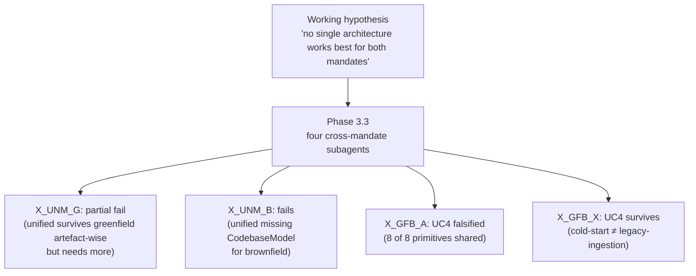

# DEC-1 — Unification verdict

> **⚠ THIS BRIEF IS SUPERSEDED.** The user reframed DEC-1 at session-end 2026-05-25. The option-pick framing below (A/B/C/D) is no longer the question. See [`../phase-3.4-decisions-resolved.md`](../phase-3.4-decisions-resolved.md), [`../SESSION-HANDOFF-2026-05-25.md`](../SESSION-HANDOFF-2026-05-25.md), and [`../candidate-registry.md`](../candidate-registry.md). The new DEC-1 (to be authored next session) asks three small confirmations: (a) confirm the working hypothesis (no methodology serves both mandates; substrates and disciplines do); (b) confirm greenfield→brownfield continuity as primary Phase-4 design concern; (c) confirm the 10-candidate set. The content below is preserved as historical context only.
>
> ---

**The question.** Does the v3 architecture set treat greenfield and brownfield as one unified architecture, two separate architectures, or some hybrid?

## Origin of the tension

Phase 0's brief carries the user-stated working hypothesis: that no single architecture works best for both mandates. The methodology treats this as a [falsifiable hypothesis](https://en.wikipedia.org/wiki/Falsifiability) — designed to test, not assume.

Phase 3.3 dispatched four cross-mandate subagents (an [adversarial-collaboration](https://en.wikipedia.org/wiki/Adversarial_collaboration)-shaped grid) to test it. Two attacked the unified architecture from each mandate side; the other two argued for and against the proposition that the two mandate-specific drafts could collapse into one architecture. **The four verdicts split four ways.** Upstream critiques (Phase-3.2 persona-diverse pass, Phase-2 splitter/lumper bias guards) added independent signal pointing at different answers.

## The options

### Option A — Two architectures + shared tactical substrate

**Shape.** Phase 4 produces three documents: a shared tactical-substrate document (the 8 splitter-cluster primitives — judge, watchdog, log, sandbox, holdout-discipline, spec-linter, perimeter, cost-ceiling), plus a greenfield-architecture document, plus a brownfield-architecture document. Each mandate gets its own substrate stratum above the shared tactical layer.

**Argued by:**
- **`X_GFB_X`** (cross-mandate "cannot-unify attacker", in [`bias-guards/phase-3/cross-mandate/x-gfb-x.md`](bias-guards/phase-3/cross-mandate/x-gfb-x.md)): greenfield day-0 primitives (operator-authored intent block, day-0 scenario seeding) have no brownfield analog; brownfield primitives (CodebaseModel with five sub-stores) have no greenfield analog. Sharing tactical primitives is not architectural unity.
- **`X_UNM_B`** (cross-mandate "unified fails brownfield", in [`x-unm-b.md`](bias-guards/phase-3/cross-mandate/x-unm-b.md)): the unified draft has no equivalent to the brownfield CodebaseModel primitive. F21 (context exhaustion, brownfield-critical), F28 (holdout leakage), F34 (cross-layer drift) are unmitigated in the unified architecture.
- **Regulator critique of unified draft** ([`bias-guards/phase-3/unified/regulator.md`](bias-guards/phase-3/unified/regulator.md)): cross-mandate substrate fungibility creates Marchand-defeating ambiguity at the Caremark prong-1 audit surface.
- **Splitter Cluster-4** (Phase-2 bias guard, in [`bias-guards/phase-2/splitter.md`](bias-guards/phase-2/splitter.md)): cold-start vs legacy-ingestion is a corpus-supported split; the brief's mandatory cold-start treatment is greenfield-only.

**Argued against by:** `X_GFB_A` (sees the same primitive overlap as evidence the architectures unify, not as evidence they're separate).

### Option B — One unified architecture + parameter atlas

**Shape.** Phase 4 produces two documents: a unified-architecture document plus a parameter-atlas document enumerating the parameters the single architecture varies along to specialize per mandate.

**Argued by:**
- **`X_GFB_A`** (cross-mandate "unify advocate", in [`x-gfb-a.md`](bias-guards/phase-3/cross-mandate/x-gfb-a.md)): 8 of 8 splitter-cluster substrate primitives are shared across the drafts; methodology divergences are work-unit-class variations on one cycle; CodebaseModel is greenfield's `priors.in-tree` slot populated by an ingestion-class work-unit.
- **Axis-divergence audit §3.3** (Phase-2 bias guard, in [`bias-guards/phase-2/axis-divergence-audit.md`](bias-guards/phase-2/axis-divergence-audit.md)): 95% convergence among the three unified-candidate tracks on "mandate is a parameter."

**Argued against by:** `X_UNM_B` finds this structurally incomplete unless a CodebaseModel primitive is added; anchor-detector `F-ANCHOR-2`/`F-ANCHOR-3` flagged the 95% convergence as partly brief-anchored (later partially confirmed by D7-U-1).

### Option C — Two unified candidates (e.g., escrow-flavoured + opposing-side-flavoured)

**Shape.** Phase 4 produces two unified-architecture candidate documents (one preserving the Phase-2 unified-A/B/C tracks' cognitive-escrow-flavoured substrate; one based on D7-U-1's "Adversarial-Falsification Topology" alternative). The Phase-6 comparison matrix picks per work-unit-class.

**Argued by:**
- **`D7-U-1`** (mandated blind-axis test, in [`bias-guards/phase-3/d7-blind-axis/d7-u-1-prohibit-interval-escrow.md`](bias-guards/phase-3/d7-blind-axis/d7-u-1-prohibit-interval-escrow.md)): produced a defensible alternative unified axis with cognitive-escrow prohibited. Its recommendation: the corpus supplies signal for both cluster (a) cross-family/opposing-side and cluster (b) interval/attention-surface. Carry both.

**Argued against by:** doubled Phase-5 ADR work; user must weigh whether the two-candidate cost is justified.

### Option D — Defer to Phase 4

**Shape.** Phase 4 runs substrate / divergence extraction on all three Phase-3 drafts in parallel; the user decides at Phase-4 end.

**Argued by:** no specific subagent. Conservative choice; prolongs uncertainty.

## Phase-by-phase impact

| Phase | A (2 arch + shared) | B (1 unified) | C (2 unified candidates) | D (defer) |
|---|---|---|---|---|
| Phase 4 outputs | 3 docs | 2 docs + add CodebaseModel | 2 candidate docs | All 3 drafts in parallel |
| Phase 5 ADR count | Split shared / mandate-specific | Single set (~14) | ~2× the work | Deferred scoping |
| Phase 6 specs | ≥ 2 architecture specs | 1 architecture spec | 2 candidate specs | TBD |
| Phase 8 lean-eval briefs | Per architecture | Single brief | Per candidate | TBD |
| Falsifiable hypothesis | Survives | Falsified for the architecture's domain | Falsified at family level | Undecided |

## Eliminations vs. preferences

- **Option A eliminates Options B and C** (the unification is rejected; both unified-candidate framings fall away).
- **Option B eliminates Options A and C** but adds a required adjustment to the unified draft (CodebaseModel primitive must be added before B is structurally complete).
- **Option C eliminates Options A and B** at the family level (carries both unified candidates) but defers the per-work-unit-class choice to Phase 6.
- **Option D eliminates nothing** but defers all of the above.

## Lead-agent note

Two facts seem hardest to dismiss: (1) `X_UNM_B`'s finding that the current unified draft has no CodebaseModel primitive is structural — under Option B it requires an explicit spec change; (2) `X_GFB_A`'s 8-of-8 substrate-primitive overlap is real, but at the *tactical*-primitive level. The load-bearing question is whether tactical-primitive sharing constitutes architectural unity. A and C answer no; B answers yes (with the CodebaseModel addition).
