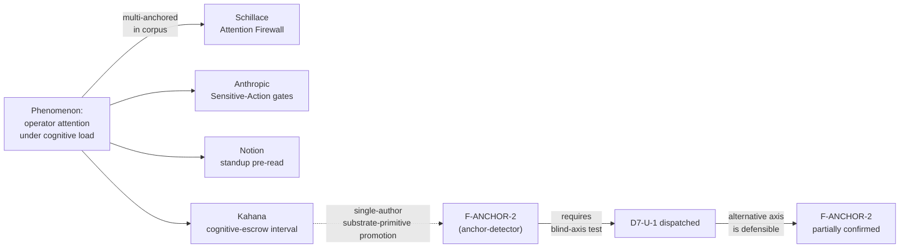

# DEC-2 — Cognitive-escrow surface: substrate primitive or methodology convention?

**The question.** The cognitive-escrow surface is a structural-attention machinery: substrate-triggered reflection prompts at structural moments, success-criterion articulation, similar-past surfacing, delegation-level confirmation, STIR-cascade reflection. The methodology promotes this to a *substrate primitive* (a typed object with policy fields, fired by the substrate at the structural moments) in the current drafts. Should it stay there, or should it be demoted to a *methodology-layer convention* that the substrate enables but does not type?

## Origin of the tension

The Phase-2 anchor-detector bias guard flagged finding **`F-ANCHOR-2` (HIGH severity, load-bearing)**: seven of nine Phase-2 tracks promoted Kahana's cognitive-escrow interval to a substrate primitive. The *phenomenon* (operator-attention fragility under cognitive load) is multi-anchored in the corpus (Schillace Attention Firewall, Anthropic Sensitive-Action gates, Notion standup pre-read). But promoting the interval to a substrate-typed object with named sub-primitives is single-author (Kahana). The brief's mandatory cold-start required-reading list put Kahana in front of every greenfield-touching track — which the anchor-detector judged was the likely contamination channel.

The methodology's response was to dispatch a mandated blind-axis test, **`D7-U-1`** ([`bias-guards/phase-3/d7-blind-axis/d7-u-1-prohibit-interval-escrow.md`](bias-guards/phase-3/d7-blind-axis/d7-u-1-prohibit-interval-escrow.md)), with cognitive-escrow / interval-as-substrate-primitive *prohibited*. The test produced a defensible alternative axis (Adversarial-Falsification Topology) — partially confirming `F-ANCHOR-2`. The convergence on escrow-as-substrate is not pure corpus signal.

## The options

### Option A — Methodology-layer convention (demote from substrate)

**Shape.** The cognitive-escrow phenomenon is acknowledged in the methodology layer of each architecture spec, as a recommended pattern. The substrate does not carry a typed `EscrowSurface` object with policy fields. Architecture specs in Phase 6 do not declare an EscrowSurface slot; F42/F53 mitigation moves to methodology pattern.

**Argued by:**
- **`D7-U-1`** (the mandated blind-axis test, [`d7-u-1-prohibit-interval-escrow.md`](bias-guards/phase-3/d7-blind-axis/d7-u-1-prohibit-interval-escrow.md)): built a coherent unified architecture without escrow as substrate; the escrow phenomenon stays at methodology layer; substrate-fired structural discipline comes from a different primitive (Falsification Commitments).
- **Red-team critique of unified draft** ([`bias-guards/phase-3/unified/red-team.md`](bias-guards/phase-3/unified/red-team.md)): single-source Kahana promotion fails the discipline bar that every substrate-primitive promotion should cite multiple independent corpus voices for the promotion *specifically* (not just for the phenomenon).
- **`F-ANCHOR-2`** anchor-detector finding: the substrate-primitive shape is single-source even where the phenomenon is multi-anchored.

### Option B — Substrate primitive (keep current draft stance)

**Shape.** Architecture specs in Phase 6 carry an `EscrowSurface` substrate slot — a typed object with five sub-primitive policies (reflection-question / success-criterion / similar-past-surfacing / delegation-confirm / STIR-cascade). The substrate fires the surface at structural moments; operator engagement with the prompt becomes typed events the watchdog can audit.

**Argued by:**
- **`D7-U-1`'s honest concession** (same file as above, §"Honest assessment"): the Falsification-Topology alternative does *not* close F42 (cognitive-escrow negligence) at the substrate layer. The operator-as-opposing-side cold-start regime relies on methodology-layer attention-surface design, where escrow-flavoured architectures are stronger.
- **Pre-mortem critique of greenfield draft** ([`bias-guards/phase-3/greenfield/pre-mortem.md`](bias-guards/phase-3/greenfield/pre-mortem.md)): in the 18-month thin-intent + click-through-STIR + F40 last-mile-drift cascade, the substrate-fired escrow is the strongest available mitigation against operator engagement decay. Demoting to methodology means F53 (voluntary-discipline fragility) reasserts itself.

### Option C — Contingent on DEC-1

The disposition follows DEC-1's resolution:
- If **DEC-1 picks Option B** (one unified architecture): keep escrow as substrate.
- If **DEC-1 picks Option C** (two unified candidates): the escrow-flavoured candidate keeps it; the opposing-side-flavoured candidate drops it.
- If **DEC-1 picks Option A** (two architectures + shared tactical substrate): decided per mandate independently — greenfield draft's ROBUST-G14 evaluated separately from brownfield's structural needs.

## Phase-by-phase impact

| Phase | A (methodology) | B (substrate) | C (contingent) |
|---|---|---|---|
| Phase 4 substrate enumeration | No EscrowSurface primitive | Includes EscrowSurface typed object | Per DEC-1 |
| Phase 5 wave-1 ADR | "Cognitive-escrow as methodology pattern" | "EscrowSurface substrate-primitive schema" | Per DEC-1 |
| Phase 6 spec slots | No EscrowSurface YAML slot | Typed EscrowSurface slot with 5 sub-policies | Per DEC-1 |
| F42 / F53 mitigation | Methodology pattern (vulnerable to voluntary-discipline reassertion) | Substrate-typed (Patrol-auditable engagement events) | Per DEC-1 |
| Phase 8 lean-eval | Eval is "do operators apply the methodology pattern?" | Eval is "does the typed EscrowSurface mechanism work?" | Per DEC-1 |

## Eliminations vs. preferences

- **Option A and Option B are mutually exclusive at the architecture-spec level** — the substrate either carries the typed object or it doesn't.
- **Option C is the natural choice if DEC-1 chooses Option C** (two unified candidates already split on this exact axis).
- The phenomenon survives either way; the question is only the engineering shape of the response.

## Key trade-off

| | Option A (methodology) | Option B (substrate) |
|---|---|---|
| Corpus warrant | Stronger — multi-anchored phenomenon, single-source primitive promotion explicitly retired | Weaker — depends on Kahana's primitive catalog being read as load-bearing |
| F53 mitigation depth | Weaker — voluntary discipline can decay | Stronger — substrate-fired prompts at structural moments |
| Audit affordance | Lower — engagement is operator behaviour, not typed event | Higher — engagement becomes typed substrate event |
| Phase-5 ADR shape | Simpler (methodology convention) | Richer (typed schema) |

## Lead-agent note

The on-call critique of the unified draft flagged that even with substrate-fired escrow, the operator's *engagement* with the prompt is voluntary — "the substrate can fire the prompt, but cannot force the read." A substrate-typed EscrowSurface makes the firing auditable; it does not make engagement compulsory. Whether substrate-typing is worth the single-source-promotion risk is the user's call.
