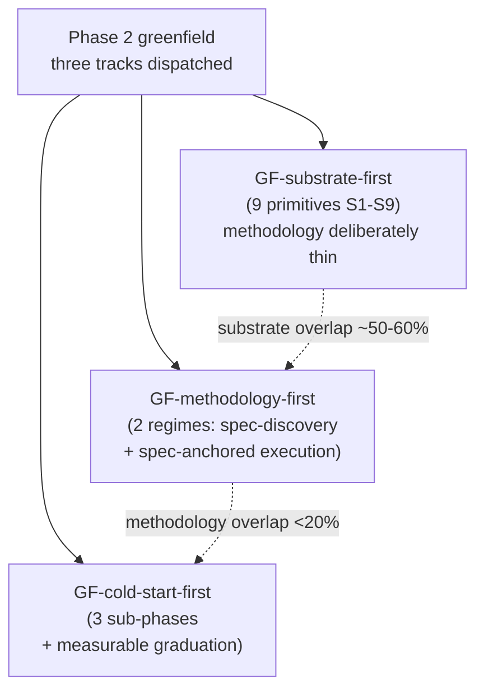
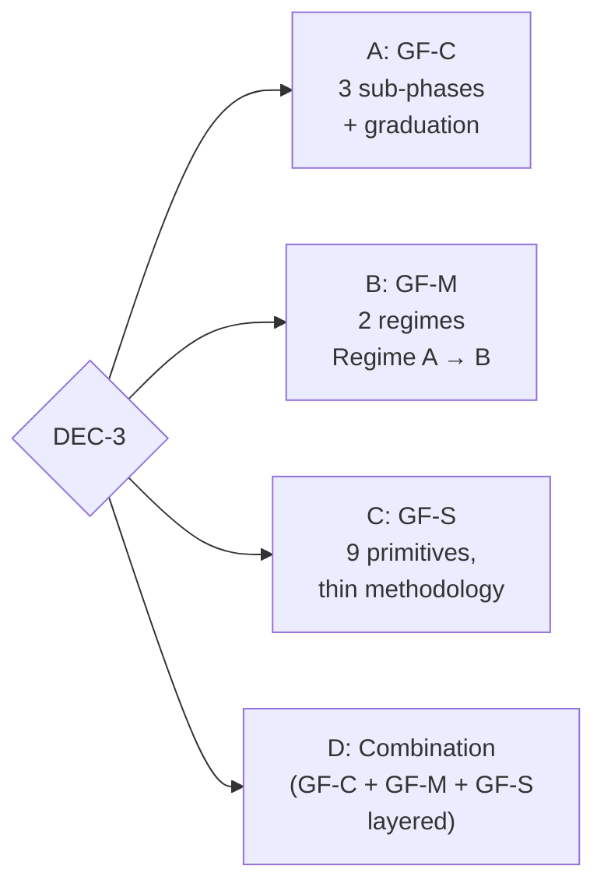

# DEC-3 — Greenfield methodology shape

**The question.** Which methodology shape does the greenfield architecture adopt? Three Phase-2 greenfield tracks proposed structurally incompatible methodology layers.

## Origin of the tension

Phase 2 dispatched three greenfield tracks with prescribed axes: **substrate-first**, **methodology-first**, **cold-start-first**. The axis-divergence audit reported: *"Effective overlap on substrate primitives is ~50–60%; effective overlap on architectural commitments at the methodology layer is **<20%**. Axis is doing real work."* The three are not aliases — their substrate sets are similar, but their methodology commitments are mutually incompatible at the unit-of-work and regime-transition layers. **DPG-2** in [`draft-greenfield-synthesis.md`](draft-greenfield-synthesis.md) surfaces this as a Tier-1 decision.

## The options

### Option A — GF-C Bootstrap-Bench (three-sub-phase + measurable graduation)

**Shape.** Day-0 runs three sub-phases: **Intent ingestion** (Council interrogates the operator-authored Intent Crucible — a 9-field typed object), **Bench construction** (human-anchored Kaner-style scenario seeding, bound to EARS criteria), **First-cycle restraint** (tiny EARS criterion against one scenario, production-scissors off, cross-model judge with mandatory escalation on disagreement). A **graduation protocol** with four explicit criteria transitions a work-unit-class from Cold-Start Regime to Steady-State Regime. The factory architecture has *two substrate primitive sets* (day-0 vs day-N) with a measured transition.

**Argued by:**
- **Pre-mortem critique of greenfield draft** ([`bias-guards/phase-3/greenfield/pre-mortem.md`](bias-guards/phase-3/greenfield/pre-mortem.md)): GF-C's measurable graduation criteria are the only mechanism that detects the "thin intent passes form-deterministic lint" failure cascade — the substantive failure mode the pre-mortem walks through.
- **Regulator critique of greenfield draft** ([`bias-guards/phase-3/greenfield/regulator.md`](bias-guards/phase-3/greenfield/regulator.md)): GF-C's RSI-declaration-day-0 plus four-criteria graduation is the strongest Caremark prong-1 posture (creates the record that defeats SolarWinds framing).
- **D7-G-1** (blind-axis test, [`d7-g-1-prohibit-c-b.md`](bias-guards/phase-3/d7-blind-axis/d7-g-1-prohibit-c-b.md)): option (d) Husain/Shankar TPR/TNR-alignment discipline co-adopts cleanly with GF-C's graduation criteria, strengthening the empirical-bar story.

### Option B — GF-M Two-regime (Spec-discovery → Spec-anchored execution)

**Shape.** Two regimes with explicit transition. **Regime A** (Spec-discovery) is L3-Augmentation; unit of work is a *reversible commitment* (paraphrase divergence across model families → tiny probe → promote-or-reverse gate). **Regime B** (Spec-anchored execution) is L4-Automation; unit of work is *a scenario from the durable set* (Compound-style plan → work → review → compound, cross-model panel). Slice-coherence-based transition: a slice promotes A → B when an end-to-end scenario passes through it without intent gap.

**Argued by:**
- **Newcomer critique of greenfield draft** ([`bias-guards/phase-3/greenfield/newcomer.md`](bias-guards/phase-3/greenfield/newcomer.md)): GF-M's reversible-commitment and tiny-probe are novel coinages and notably more legible than GF-C's Cold-Start-Regime / Steady-State-Regime framing.
- **GF-M's own §7**: F40 (last-mile drift, greenfield-critical) is addressed via Regime B's slice-promotion criterion (end-to-end scenario must pass before promotion); GF-S explicitly does not address F40.

### Option C — GF-S Substrate-thin (deliberately empty methodology)

**Shape.** Nine substrate primitives (S1 sandbox, S2 scenario storage, S3 trajectory capture, S4 cost ceilings, S5 watchdog tiers, S6 judge routing, S7 coordination medium, S8 guard mediator, S9 eligibility classifier). Methodology layer is *just enough to drive the primitives*. Unit-of-work shape, spec format, agent topology, knowledge-accumulation pattern are explicitly methodology choices on top of substrate, not architectural commitments.

**Argued by:**
- **CFO critique alignment** ([`bias-guards/phase-3/greenfield/cfo.md`](bias-guards/phase-3/greenfield/cfo.md)): thinnest methodology layer = lowest per-cycle methodology overhead; GF-S has the most flexibility on cost-budget configuration.
- Axis-divergence audit: GF-S and GF-M overlap ~80% on substrate; if you take GF-M's two-regime out, you essentially have GF-S. The difference is *where the commitment lives*, not which capabilities are present.
- GF-S explicitly punts unit-of-work to deployment-time decision.

### Option D — Combination (GF-C bootstrap + GF-M steady-state + GF-S substrate-stack)

**Shape.** Use GF-C's three-sub-phase Bootstrap-Bench at day-0; transition to GF-M's Regime A/B for steady-state; both run on GF-S's 9-primitive substrate stack underneath.

**Argued by:** no specific subagent. "Best of all worlds" synthesis. Cost: composition complexity grows, Phase-5 ADRs must adjudicate which methodology layer applies when.

## Phase-by-phase impact

| Phase | A (GF-C) | B (GF-M) | C (GF-S) | D (combination) |
|---|---|---|---|---|
| Phase 4 substrate enumeration | Two primitive sets (day-0 + day-N) | Substrate derived from regime requirements | 9-primitive S1-S9 fixed set | Combined set + layering rules |
| Phase 5 wave-1 ADR examples | Bootstrap-Bench primitives + graduation criteria | Reversibility primitive + paraphrase divergence | S1-S9 typed-object schemas | Many ADRs adjudicating composition |
| Phase 6 spec | Spec carries graduation YAML (4 criteria) | Spec carries regime declaration + slice-coherence transition | Spec carries S1-S9 + "methodology is a deployment-time choice" | Layered spec |
| Phase 8 lean-eval | Eval = graduation-protocol exercise | Eval = Regime A→B transition exercise | Eval = methodology-choice exercise | Multi-part eval |
| F40 (last-mile drift) | Implicit via cross-cycle slot transitions | Addressed via Regime B promotion criterion | Explicitly unaddressed (acknowledged open question) | Per layer |

## Eliminations vs. preferences

- **A, B, and C are mutually exclusive** at the architecture-spec level — they make different unit-of-work commitments at the methodology layer.
- **D** subsumes A and B as phase-of-life sub-architectures, but doesn't eliminate them as such — it changes which one runs when.
- The substrate sets overlap, so any pick still consumes most of the same Phase-4 substrate enumeration; the methodology layer is where they bifurcate.

## Lead-agent note

The options are not equally interchangeable downstream. **GF-C** builds the strongest Caremark/regulator posture but adds substrate complexity (two primitive sets, graduation machinery). **GF-S** has the lowest commitment cost but defers operational specifics to deployment. **GF-M** sits between and is the most legible to a newcomer. **D** is the maximalist choice with the highest Phase-5 ADR burden.

If DEC-1 chose Option B (one unified architecture), this decision must be reconciled with DEC-4's brownfield methodology choice — they cannot diverge structurally.
