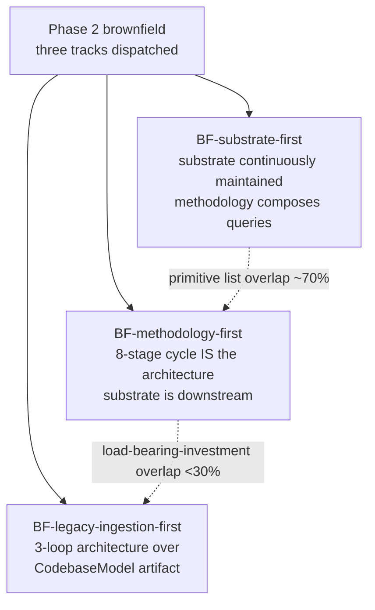
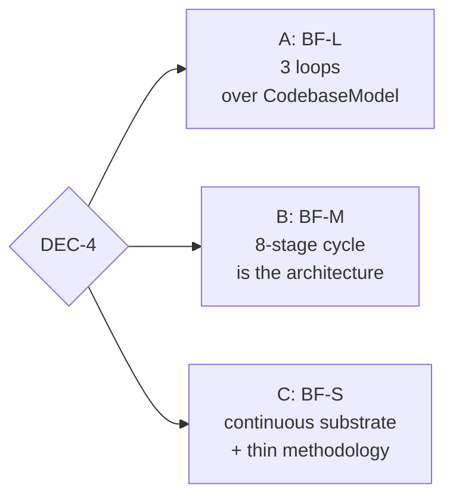

# DEC-4 — Brownfield methodology shape

**The question.** Which methodology shape does the brownfield architecture adopt?

## Origin of the tension

Phase 2 dispatched three brownfield tracks with prescribed axes: **substrate-first**, **methodology-first**, **legacy-ingestion-first**. The axis-divergence audit reported: *"Effective overlap on primitive list: ~70%. Effective overlap on where the load-bearing investment sits: <30%. Axis is doing real work but the corpus signal is strong."*

The brownfield-critical F-mode set (F12, F20, F21, F33, F34, F44, F56, F58 — all corpus-rated brownfield-critical) over-determines what primitives must exist; the three tracks agree on most of those. They disagree about *where the load-bearing investment lives* (is the substrate continuously maintained? per-cycle reconstructed? built once and refreshed?). **DPB-3** in [`draft-brownfield-synthesis.md`](draft-brownfield-synthesis.md) surfaces this as a Tier-1 decision.

## The options

### Option A — BF-L: 3-loop over CodebaseModel (Ingestion / Work / Maintenance)

**Shape.** Three loops over a single durable artifact, **the CodebaseModel**, with five sub-stores: codebase index, dependency-and-impact graph, runtime/telemetry view, change-history view, invariant/debt view. **Ingestion** runs once per codebase (refresh on declared triggers — e.g., acquired-codebase merges). **Work** runs per-cycle and queries the model. **Maintenance** runs continuously at low cadence, reconciling model with reality. Work-unit-class taxonomy is *derived from the codebase model's profile* (a codebase with heavy issue tracker + stable architecture surfaces issue-from-queue work; one with active spec-driven refactoring surfaces change-request-against-spec; one with accumulating debt surfaces codebase-evolution-proposal).

**Argued by:**
- **`X_UNM_B`** (cross-mandate "unified fails brownfield", [`bias-guards/phase-3/cross-mandate/x-unm-b.md`](bias-guards/phase-3/cross-mandate/x-unm-b.md)): the CodebaseModel with five sub-stores is *the* load-bearing brownfield primitive. F21 (context exhaustion), F28 (holdout leakage), F34 (cross-layer drift) all depend on it. BF-L makes it explicit and load-bearing in the architecture.
- **10-yr on-call critique of brownfield draft** ([`bias-guards/phase-3/brownfield/on-call.md`](bias-guards/phase-3/brownfield/on-call.md)): BF-L's explicit maintenance loop is the only structural answer to silent-rot scenarios (S-1 / S-2 / S-3 views going stale post-acquisition, after polyglot indexer swaps, after telemetry-endpoint migrations). BF-S's continuous-incremental refresh hides this; BF-L surfaces it as a tunable maintenance cadence.
- **Pre-mortem critique of brownfield draft** ([`bias-guards/phase-3/brownfield/pre-mortem.md`](bias-guards/phase-3/brownfield/pre-mortem.md)): BF-S's continuous-refresh fails first under self-reference accretion at Stripe scale — the factory becomes its own ground truth because the substrate refreshes from its own output. BF-L's refresh-cadence-as-tunable + human-anchored refresh trigger is the fix.

### Option B — BF-M: 8-stage cycle-as-architecture

**Shape.** Per-cycle process flows through eight named obligations: **Trigger → Comprehension → Intent capture → Plan → Build → Cross-model review → Acceptance → Ship-or-escalate**. Each stage names its substrate capability at the boundary. The cycle is work-unit-class-polymorphic: a regression-fix may skip stage 4's multi-plan generation; a codebase-evolution-proposal may loop stages 2-4 before committing to a plan. *Methodology is the architecture; substrate is downstream derivation.*

**Argued by:**
- **Newcomer critique of brownfield draft** ([`bias-guards/phase-3/brownfield/newcomer.md`](bias-guards/phase-3/brownfield/newcomer.md)): BF-M's 8 stages are concrete and follow a familiar PR-lifecycle shape — most legible to a developer encountering the architecture for the first time.
- BF-M's per-cycle **archaeological brief** (output of the Comprehension stage) provides a natural per-cycle audit point that BF-S/BF-L don't have at the same cadence.
- Closest to corpus-default shape (Compound Engineering, SWE-bench loop, Notion/Boxy PR-from-comment loop).

### Option C — BF-S: Substrate-continuous-with-thin-methodology

**Shape.** Substrate maintains five sub-stores (codebase index, dependency-and-impact graph, runtime/telemetry, change-history, perimeter-closure) *continuously, incrementally on every commit*. Methodology layer is thin — work-unit selection, per-cycle composition of substrate queries, per-cycle V&V, knowledge promotion. Substrate is upstream; methodology consumes a well-known set of queries.

**Argued by:**
- **CFO critique alignment** ([`bias-guards/phase-3/brownfield/cfo.md`](bias-guards/phase-3/brownfield/cfo.md)): BF-S has the lowest per-cycle methodology overhead; substrate is amortized across cycles.
- **Pre-mortem critique flagged this as failing first at Stripe scale** — but for non-Stripe-scale deployments may be appropriate; the failure shape is parallelism-dependent.
- Substrate-first axis is corpus-supported per Round-2 framing.

## Phase-by-phase impact

| Phase | A (BF-L) | B (BF-M) | C (BF-S) |
|---|---|---|---|
| Phase 4 substrate enumeration | CodebaseModel with 5 sub-stores + maintenance protocol | Thin substrate; per-cycle archaeological brief | 5 sub-stores continuously maintained |
| Phase 5 wave-1 ADRs | Refresh cadence + CodebaseModel schema + per-region regime classifier | 8-stage cycle contract + per-class stage compressions | Continuous-maintenance primitives |
| Phase 6 spec | 3-loop architecture + work-unit-class-derived-from-model | 8-stage cycle + per-work-unit-class stage compressions | Substrate-query-driven cycle |
| Phase 8 lean-eval | Eval = ingestion + work + maintenance round-trip | Eval = full 8-stage cycle | Eval = substrate-query latency |
| F20/F21/F34 mitigation | Strongest — explicit substrate primitive | Per-cycle archaeological brief is the read | Substrate continuously holds the answer |
| Self-reference / F55 at Stripe scale | Mitigated via refresh-cadence + human-anchor trigger | Mitigated via per-cycle reconstruction | **Pre-mortem flags as the fail mode** |

## Eliminations vs. preferences

- **A, B, and C are mutually exclusive** at the spec level — different commitments on whether the substrate is continuously maintained, per-cycle reconstructed, or built-and-refreshed-on-trigger.
- The Phase-3.4 integration brief surfaced **DPB-4** (codebase-model continuity) as a separate Tier-2 decision; that decision is partially absorbed by DEC-4. Picking A explicitly chooses refresh-on-trigger; B chooses per-cycle-reconstructed; C chooses continuous.

## Cross-decision interaction

- **If DEC-1 chose Option A (two architectures + shared tactical substrate)**: DEC-4 picks the brownfield architecture's methodology shape independently from DEC-3.
- **If DEC-1 chose Option B (one unified architecture)**: DEC-3 and DEC-4 must be reconciled — the unified architecture inherits one methodology shape that handles both mandates per work-unit-class. Critically, `X_UNM_B`'s CodebaseModel finding interacts: under DEC-1 B, the unified architecture must add a CodebaseModel substrate primitive, which is essentially adopting BF-L's central commitment.
- **If DEC-1 chose Option C (two unified candidates)**: DEC-4 informs the brownfield-fit cells of the comparison matrix for each candidate.

## Lead-agent note

BF-L is the only option that *explicitly* surfaces a CodebaseModel primitive at the architecture layer. BF-M and BF-S use the same underlying primitives but place the load-bearing-investment elsewhere (BF-M: in per-cycle cycle obligations; BF-S: in continuous substrate maintenance). The pre-mortem and on-call critiques converge against BF-S for Stripe-scale deployments; BF-M is the most legible at first read; BF-L is the most defensible under operational stress.
