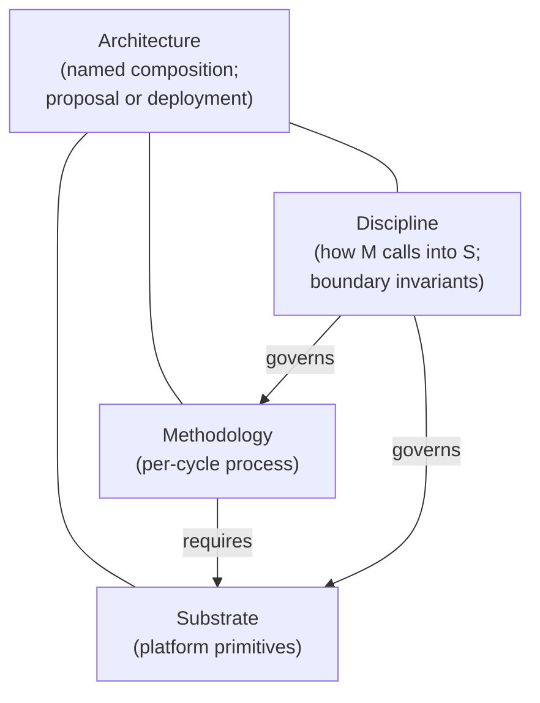

# Phase 3.4 — Decisions resolved (running)

This file records user decisions made at the Phase-3.4 checkpoint as they are made. Each entry replaces the corresponding `DEC-N` in [`phase-3.4-integration-brief.md`](phase-3.4-integration-brief.md).

---

## Working definitions: architecture, substrate, methodology

These three terms are used throughout the synthesis. They overlap in the corpus and are used differently by different sources; this section is the project's binding definition.

### Substrate

The set of **platform primitives** the factory consumes during operation. Each primitive is a named, typed thing with:

- **A contract.** The primitive's role, API surface, and partition discipline (what it does, how callers interact with it, what isolation it enforces).
- **A construction path.** How this primitive gets built — concrete existing tools, libraries, techniques, with corpus references to others who have built something in this shape. *Research-grade-uncertainty primitives must be flagged as such.*
- **A corpus justification (the *why*).** What problem in the corpus this primitive solves, with citations.
- **At least one methodology that uses it.** Substrate primitives are not built for their own sake; an orphan primitive is removed.

Examples: sandbox runtime, trajectory capture, cost-ceiling enforcement, watchdog tiers (Daemon / Triage / Patrol), holdout-partition enforcement, judge router with model-family-diversity routing. Some primitives are commodity (a deny-by-default sandbox is essentially Terraform + bwrap); others are designed systems with non-trivial buildability (a polyglot codebase index with role-based read partitioning).

### Methodology

The **per-cycle process** the factory runs *against* the substrate. Specifies:

- The **unit of work** (issue from a queue; change-request against a spec; codebase-evolution proposal; reversible commitment; etc.)
- The **cycle shape** — stages, regimes, gates, when each fires
- The **knowledge-accumulation pattern** — what gets stored, when, and how it's retrieved
- The **error-handling protocol** — escalation triggers, re-entry mechanisms
- The **substrate primitives the cycle requires** — by contract reference, not by construction

A methodology is *how the factory uses* the substrate to produce software. Same substrate can host different methodologies; same methodology can run on different substrates (provided the substrate primitives meet the contracts).

### Architecture

A **named composition** of:

- A methodology (or a graph of methodology variants per work-unit-class)
- The substrate primitives that methodology requires (with construction paths and corpus justifications)
- The **discipline that binds them** — how the methodology calls into the substrate, what invariants are maintained at boundaries, what happens at transitions.

An architecture is a *proposal*. A deployed factory is a *realization* of an architecture (with specific tools, vendors, deployment configurations).

### Relationships

### Operating rules (informed by user direction)

1. **Methodologies drive.** The synthesis is fundamentally hunting for methodologies. Substrate requirements fall out per methodology.
2. **Orphan substrate is preserved through the catalog stage.** A substrate primitive *with buildability + corpus-why* enters the catalog even if no current methodology candidate claims it. The methodology-to-substrate matching happens later; orphan primitives at the matching stage are not used by chosen combinations but remain in the catalog as cross-pollination fuel for reviewers and downstream methodology refinement.
3. **Buildability is mandatory.** A substrate primitive cannot enter an architecture without a construction path. "Just assume `CodebaseModel` exists" is handwaving and is rejected.
4. **Most-likely-commodity substrates are still substrate.** Sandbox, cost ceiling, log sink — these are substrate even though their construction is cloud-engineering trivial. The split is about *role*, not about engineering effort.
5. **Designed-system substrates get the same treatment but heavier scrutiny.** When a substrate primitive is itself a non-trivial designed system (e.g., a polyglot code index), the construction path must be more detailed (named tools, named techniques, named prior-art references). The buildability bar is higher in absolute terms but is the same in kind: produce evidence the thing can be built.
6. **Architecture-level disciplines are separate.** Things like the three-layer citation discipline, concrete-task discipline, bias-guard discipline are *not* substrate primitives or methodology choices — they are meta-disciplines that govern how the architecture's artifacts are produced. They live at the architecture level.

---

## Scoping principle (immutable, overrides any conflicting framing in the integration brief)

**Carry forward every candidate methodology / architecture that has defensible supporting arguments and that successfully addressed Phase-3.2 / Phase-3.3 criticism. Do not eliminate at end-of-Phase-3.**

Rationale (user, verbatim paraphrase): no public source has given details of a software-factory architecture/methodology that actually works. Company blogs, white papers, and books are written by authors with incentives to convince; what they describe is not the same as a working factory. Trying to eliminate promising candidates at the end of Phase 3 forecloses *crossover* opportunities where pieces of one candidate turn out to be exactly the missing piece for another. Pressure-testing against each other in simulation or mock-up of the final solution is the appropriate evaluation surface — Phase 8's lean evaluations, plus downstream simulation work, do this. The objective is "however many candidates can pass review and pressure-testing make a strong case for being evaluated," not "narrow to 1–3."

**Effect on the rest of the synthesis pipeline:** see "How this changes prior and future work" below.

---

## DEC-2 — Cognitive escrow placement: **METHODOLOGY**

The cognitive-escrow surface (substrate-triggered reflection prompts, success-criterion articulation, similar-past surfacing, STIR-cascade reflection) is a **methodology-layer pattern**, not a substrate primitive.

Rationale: substrate support for cognitive escrow is nice-to-have but composable from basic cloud-native primitives (trajectory capture, watchdog, alerting, event sinks). Substrate-typing is overkill for something that any methodology can compose from primitives the substrate already provides for other purposes.

**Effect:**
- `ROBUST-G14` in [`draft-greenfield-synthesis.md`](draft-greenfield-synthesis.md) and `ROBUST-U10` in [`draft-unified-synthesis.md`](draft-unified-synthesis.md) demote from substrate primitives to methodology-layer recommendations.
- Phase-5 wave-1 ADR scope drops the "`EscrowSurface` substrate-primitive schema" candidate. A methodology-pattern ADR may still exist, but it's per-architecture (not in shared substrate).
- Architecture specs in Phase 6 do not declare an `EscrowSurface` substrate slot. Each architecture that wants the discipline composes it from trajectory + watchdog + alerting primitives.
- F42 / F53 mitigation depth is now methodology-dependent. Each surviving candidate (per scoping principle) must articulate its own answer.

---

## DEC-3 — Greenfield methodology shape: **CARRY ALL DEFENSIBLE CANDIDATES**

Carry GF-C (Bootstrap-Bench), GF-M (two-regime spec-discovery → spec-anchored execution), and GF-S (substrate-thin) all forward into Phase 4 and beyond. Each has powerful aspects; each defended itself against Phase-3.2 / Phase-3.3 critique. Eliminating any of them at Phase 3 is exactly the move the scoping principle prohibits.

Combinations (e.g., GF-C bootstrap + GF-M steady-state on a GF-S substrate stack) are also valid as additional candidates if they have substantive distinguishing arguments.

**Effect:**
- Phase 4 substrate / divergence extraction produces a substrate-requirements summary *per surviving candidate*. The "shared substrate" extraction is reframed as "primitive overlap analysis" — useful for downstream tooling decisions, not as a winner-picking exercise.
- Phase 5 ADRs are scoped *per candidate*. Common ADRs (where the methodologies agree on a substrate primitive) get drafted once and cross-referenced.
- Phase 6 produces *one architecture spec per candidate*. The mandate-fit matrix has a row per candidate.
- Phase 8 lean-eval briefs are *per candidate*. This is where pressure-testing per the scoping principle happens.

---

## DEC-4 — Brownfield methodology shape: **CARRY ALL DEFENSIBLE CANDIDATES**

Carry BF-L (3-loop over CodebaseModel), BF-M (8-stage cycle-as-architecture), and BF-S (substrate-continuous-thin-methodology) all forward. Same rationale as DEC-3.

Combinations (e.g., BF-L's CodebaseModel as substrate, with BF-M's 8-stage cycle as the methodology that queries it) are valid additional candidates.

**Effect:** symmetric to DEC-3 on the brownfield side.

---

## DEC-1 — Unification verdict (RESOLVED, reframed into three sub-confirmations)

The original DEC-1 brief at [`dec-1-unification-verdict.md`](decisions/dec-1-unification-verdict.md) (A/B/C/D pick) is superseded. The reframed brief at [`dec-1-unification-verdict-reframed.md`](decisions/dec-1-unification-verdict-reframed.md) posed three sub-confirmations. User resolution 2026-05-25:

### DEC-1.a — Working hypothesis: **CONFIRMED AS HYPOTHESIS (not axiom)**

Phase 4 onward proceeds under the orienting commitment: *no methodology serves both mandates; substrates and disciplines do.* This is held as a **falsifiable working hypothesis**, not an axiom. Phase-8 lean-evals and downstream simulation can overturn it — for example, if one of the unified-attempt candidates (U-A, U-B, U-C, D7-U-1) demonstrates empirically that a single methodology fits both mandates, the hypothesis is falsified. The hypothesis is the *starting* frame; evidence wins over framing.

**Effect:** The unified-attempt candidates carry forward as candidate methodologies (per DEC-1.c) and also as *active falsifiers* of the hypothesis. Phase-4 dispatch is per-mandate (3 GF + 3 BF methodologies) plus unified-attempt (4 methodologies) plus cross-mandate substrate + discipline extraction.

### DEC-1.b — Greenfield → brownfield artifact continuity: **N/A (lead agent misread user's framing)**

The continuity-matrix framing in the original handoff and in the reframed-DEC-1 brief was based on the lead agent's misreading. The user's actual framing of greenfield vs. brownfield is **entry-mode**, not temporal:

- **Greenfield** = the system *originates inside the methodology*. The methodology is in force from day 0; spec, CodebaseModel (or equivalent), intent capture, structural invariants are all built incrementally *with* the code rather than reconstructed from artifacts.
- **Brownfield** = the system *enters as pre-existing code, docs, and other artifacts* — typically inconsistent, missing intent, contradictory, the accumulated debt of multiple eras of architectural decisions.

Under this framing, there is no GF → BF transition to design. A greenfield-born codebase stays greenfield as long as the same methodology is in force; its day-1800 state is the same kind of work as its day-180 state, just at greater scale. A brownfield-handled codebase is whatever it is *because* it entered with legacy structure that the methodology did not get to enforce from the start.

**Working definitions of greenfield and brownfield are now part of the binding working-definitions section below.**

The two within-greenfield hypotheses the user surfaced (recorded as hypotheses, not axioms):

1. **"Maintenance is just implementation as the spec grows" applies only to greenfield.** A 1-line spec becoming a 2-line spec is the same kind of operation as a 10,000-line spec becoming a 10,001-line spec. Brownfield methodologies may have very different answers — that is a per-candidate question, not a cross-mandate axiom. *Hypothesis, not axiom.*
2. **Initial-spec discovery *may* differ across greenfield's own early-vs-mature stages.** Some greenfield methodologies have separate cold-start vs. steady-state regimes (GF-C, GF-M's Regime A → B); others may treat early and mature the same. Both are admissible candidate shapes. The synthesis MUST NOT foreclose either. *Hypothesis, not axiom.*

**Effect on the synthesis pipeline:** the lead-agent's proposed "GF → BF continuity matrix" Phase-4 deliverable is **withdrawn**. F40/F8 long-run-drift concerns against GF-S/GF-M are addressed within each greenfield candidate's own methodology (via its steady-state regime or its unified treatment, depending on the candidate), not by a separate cross-mandate continuity deliverable. The "greenfield candidates that ship continuity-compatible artifact contracts" evaluation criterion in [`candidate-registry.md`](candidate-registry.md) is **removed**.

### DEC-1.c — Candidate set: **CONFIRMED (all 10 carry forward)**

The [`candidate-registry.md`](candidate-registry.md) stands as-is. All 10 candidates (GF-S / GF-M / GF-C + BF-S / BF-M / BF-L + U-A / U-B / U-C / D7-U-1) carry forward into Phase 3.5 (buildability) and Phase 4 (substrate-requirements extraction + discipline extraction + per-mandate methodology candidates). The user's rationale: the 10 candidates show enough variety and approach-from-different-directions that having all on the table for Phase-8 pressure-testing produces richer options than any pre-narrowed set would.

---

## Working definitions: greenfield, brownfield (entry-mode framing)

These definitions are binding for the rest of the synthesis. They replace any implicit "greenfield = early stage, brownfield = late stage" framing that may persist in earlier artifacts.

### Greenfield

The system **originates inside the methodology**. From day 0, the methodology is in force; spec, intent, structural invariants, CodebaseModel (or whatever the architecture's equivalent is) accrete incrementally as the code is written. A greenfield-born codebase carries — by construction — direct links from spec to implementation, construction-time intent, and architectural consistency that cannot be retroactively reconstructed.

A greenfield system does not "become" brownfield as it matures. As long as the same methodology continues to govern it, it remains greenfield regardless of code age or size. **Maintenance is just implementation as the spec grows** (working hypothesis: see DEC-1.b note 1).

### Brownfield

The system **enters the methodology as pre-existing artifacts** — code, docs, tests, telemetry, tickets — typically with the pathologies of legacy systems: inconsistency, missing or unrecoverable intent, contradictions, multiple eras of architectural decisions stacked on each other. The methodology's first job is to recover or fabricate the substrate (CodebaseModel, intent, structural invariants) from artifacts that were not built to be recovered from.

**Brownfield methodologies do not inherit greenfield's structural advantages.** A greenfield-born system, absent life-critical-grade rigor (essentially never present in practice), will never structurally resemble a legacy system that a brownfield methodology has to handle.

### Within-greenfield variation (open per scoping principle)

Greenfield methodologies are free to specify a single regime that handles day-1 through day-N uniformly, *or* to specify distinct regimes (cold-start vs. steady-state, regime A vs. regime B) with explicit transitions. Both are admissible. The synthesis MUST NOT foreclose either shape; this is the within-greenfield differentiator that Phase-8 lean-evals can pressure-test.

---

## Cross-cutting orientation: methodology drives; substrate requirements fall out (refined per user's follow-up)

The user's framing: methodology drives; substrate requirements should fall out per methodology; substrate requirements (when sufficiently detailed) will likely be implementable on any cloud platform.

Lead-agent's first pushback: some primitives the corpus called "substrate" are not commodity (e.g., `CodebaseModel` — a knowledge-graph / code-analysis system with five sub-stores).

**User's response, which sharpens the rule:** "It is handwaving to just assume something like `CodebaseModel` just exists. You have to say *how* it will be constructed... However, it is likely that some substrate-focused tracks will surface individual items that have incredible crossover. I just don't want the substrate tracks to get sidetracked building things that no methodology will use. The substrate has to justify *why* they are building it, with references to sources."

**Lead-agent honest assessment:** substrate-track Phase-2 agents (`greenfield-substrate-first`, `brownfield-substrate-first`, `brownfield-legacy-ingestion-first`) named substrate primitives at the **contract level** (role, API surface, partition discipline) — they did *not* produce construction paths. The HOW was deferred to Phase 5 ADRs (alternatives-considered) and Phase 6 architecture specs. The user's filter wants construction-path discipline *upstream* of Phase 4 dispatch.

### Refined two-part rule for accepting a substrate primitive

1. **Construction path.** Each substrate primitive named in a surviving candidate must ship with a buildability sketch: existing tools / libraries / techniques that construct it; concrete corpus references of others who have built something in this shape; research-grade-uncertainty flag if no plausible construction path is known.
2. **Corpus citation for the *why*.** Each primitive's justification must cite the corpus sources that motivate its existence — why this primitive solves a problem the corpus has identified.

**A methodology-uses-this-primitive attestation is *not* required at the Phase 3.5 buildability stage.** Orphan primitives — those that no current methodology candidate claims — are deliberately preserved through the buildability stage and onward. The justification + construction path can themselves stimulate reviewers to recognise that a primitive is powerful enough to enable an alternative a methodology proposer didn't think was practical (or had proposed in a more awkward way). The methodology-to-substrate matching happens *later* (when methodologies and substrate primitives are combined). Pieces that turn out to be orphans at that later stage are simply not used by the chosen combinations — but they remain in the catalog as cross-pollination fuel.

With these two conditions (and the deferred methodology-match), the substrate / methodology split *is* a valid separating principle.

### Proposed methodology change: insert a buildability check per candidate

Add a sub-phase **Phase 3.5 (substrate buildability addendum per candidate)** between Phase 3.4 (decisions) and Phase 4 (substrate-requirements extraction), or fold the same work into Phase 4 as a precondition. For each surviving candidate:

- **Enumerate** the substrate primitives the candidate requires.
- For each primitive, **produce a buildability sketch** per the two-part rule above.
- **Flag primitives** whose construction is research-grade — these are important risk markers for the candidate.

A primitive without buildability + corpus-why is removed from its candidate's substrate requirement set. The candidate may still survive; it just shrinks. **Methodology-to-substrate matching is deferred** to the later stage where methodologies and substrate primitives are combined; orphan primitives identified at that stage are not used by the chosen combinations but remain available in the catalog.

**Effect on prior work.** The Phase-2 substrate-track outputs survive but get a buildability addendum attached per primitive. The Phase-3.2 critique pass did not include a "builder / implementer" persona; this is a gap in the original methodology that the buildability sub-phase corrects.

**Effect on future work.** Phase 4 substrate-requirements extraction now consumes buildability-confirmed primitives only. Phase 5 ADRs are no longer the first place construction paths land; they refine and finalise paths already sketched.

---

## How this changes prior and future work

### Prior work (Phase 1–3.3 outputs)

- **Phase 1 outputs survive** unchanged: contradictions register, failure-mode catalog, corpus inventory are inputs to all candidates.
- **Phase 2 tracks survive** unchanged: 9 tracks remain in the corpus as candidate seeds.
- **Phase 3.1 drafts** (three pre-adversarial syntheses) survive as the merged-by-axis summaries. Their ROBUST/DECISIONS-PENDING markings remain useful for understanding cross-track convergence/divergence within each axis.
- **Phase 3.2 critiques** (18 persona-adversarial + 2 D7 blind-axis) reframe purpose: previously each critique was material for "should this draft demote?" Under the scoping principle, each critique is material for *"what must this candidate address before it carries forward?"* — critiques become improvement requirements, not elimination grounds. Any draft whose critique findings have been addressed (or whose authors have given a substantive defense) carries forward.
- **Phase 3.3 cross-mandate tests** reframe similarly: the "unify advocate" and "cannot-unify attacker" pair is no longer a winner-picker. Both verdicts can be true at once — unified candidates *and* mandate-specific candidates can coexist. The "unified-fails-mandate-X" attackers identify concerns each unified candidate must address.
- **D7 blind-axis tests** produced an alternative unified axis (Adversarial-Falsification Topology). Under the scoping principle, this becomes a fourth unified-candidate alongside U-A/U-B/U-C, not a challenger to them.

### Future work

- **Phase 4** reframes from "shared/divergent extraction over surviving syntheses" to "substrate-requirements extraction per surviving candidate, with primitive-overlap analysis as a side artifact." Still useful, but no longer a winner-picking step.
- **Phase 5** ADR count grows substantially. ADRs are per-candidate where the methodology specifies; common ADRs (for primitives the candidates agree on) get drafted once and cross-referenced.
- **Phase 6** produces an architecture spec per candidate. The mandate-fit matrix has one row per candidate (could be many rows).
- **Phase 7** back-fill audit runs per candidate against archived v1/v2 material.
- **Phase 8** lean-eval briefs are per candidate; this is the first pressure-testing surface where candidates begin to differentiate empirically.

### Downstream of the methodology

Outside the 8-phase synthesis pipeline, the user's plan includes simulation / mock-up evaluation of candidates against each other. This is *post-v3* and not in the current methodology, but the scoping principle is designed to keep candidates alive for that evaluation. The Phase-8 lean-eval briefs become inputs to whatever simulation harness the project builds.

---

## Audit trail

- Scoping principle: declared 2026-05-25 in user message to lead agent. Immutable per user direction.
- DEC-2 / DEC-3 / DEC-4: declared 2026-05-25 in same message.
- DEC-1.a / DEC-1.b / DEC-1.c: declared 2026-05-25 across two follow-up user messages. The lead agent's first reframed-DEC-1 brief proposed a GF → BF continuity matrix as a Phase-4 deliverable; the user corrected the framing (entry-mode greenfield/brownfield, not temporal), and DEC-1.b was resolved N/A. Working definitions section added in the same edit.

Phase 3.4 is now closed. The next sub-phase is Phase 3.5 (substrate-primitive buildability sketches per the [refined two-part rule](#refined-two-part-rule-for-accepting-a-substrate-primitive)).
