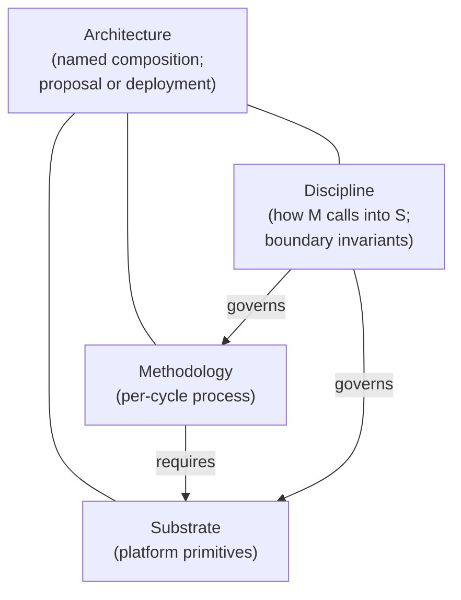

# Phase 3.4 — Decisions resolved (running)

This file records user decisions made at the Phase-3.4 checkpoint as they are made. Each entry replaces the corresponding `DEC-N` in [`phase-3.4-integration-brief.md`](phase-3.4-integration-brief.md).

---

## Working definitions: architecture, substrate, methodology

These three terms are used throughout the synthesis. They overlap in the corpus and are used differently by different sources; this section is the project's binding definition.

### Substrate

The set of **platform primitives** the factory consumes during operation. Each primitive is a named, typed thing with:

- **A contract.** The primitive's role, API surface, and partition discipline (what it does, how callers interact with it, what isolation it enforces).
- **A construction path.** How this primitive gets built — concrete existing tools, libraries, techniques, with corpus references to others who have built something in this shape. *Research-grade-uncertainty primitives must be flagged as such.*
- **A corpus justification (the *why*).** What problem in the corpus this primitive solves, with citations.
- **At least one methodology that uses it.** Substrate primitives are not built for their own sake; an orphan primitive is removed.

Examples: sandbox runtime, trajectory capture, cost-ceiling enforcement, watchdog tiers (Daemon / Triage / Patrol), holdout-partition enforcement, judge router with model-family-diversity routing. Some primitives are commodity (a deny-by-default sandbox is essentially Terraform + bwrap); others are designed systems with non-trivial buildability (a polyglot codebase index with role-based read partitioning).

### Methodology

The **per-cycle process** the factory runs *against* the substrate. Specifies:

- The **unit of work** (issue from a queue; change-request against a spec; codebase-evolution proposal; reversible commitment; etc.)
- The **cycle shape** — stages, regimes, gates, when each fires
- The **knowledge-accumulation pattern** — what gets stored, when, and how it's retrieved
- The **error-handling protocol** — escalation triggers, re-entry mechanisms
- The **substrate primitives the cycle requires** — by contract reference, not by construction

A methodology is *how the factory uses* the substrate to produce software. Same substrate can host different methodologies; same methodology can run on different substrates (provided the substrate primitives meet the contracts).

### Architecture

A **named composition** of:

- A methodology (or a graph of methodology variants per work-unit-class)
- The substrate primitives that methodology requires (with construction paths and corpus justifications)
- The **discipline that binds them** — how the methodology calls into the substrate, what invariants are maintained at boundaries, what happens at transitions.

An architecture is a *proposal*. A deployed factory is a *realization* of an architecture (with specific tools, vendors, deployment configurations).

### Relationships

### Operating rules (informed by user direction)

1. **Methodologies drive.** The synthesis is fundamentally hunting for methodologies. Substrate requirements fall out per methodology.
2. **No orphan substrate.** A substrate primitive cannot enter an architecture without being claimed by at least one methodology. Substrate tracks that surface primitives no methodology uses lose those primitives.
3. **Buildability is mandatory.** A substrate primitive cannot enter an architecture without a construction path. "Just assume `CodebaseModel` exists" is handwaving and is rejected.
4. **Most-likely-commodity substrates are still substrate.** Sandbox, cost ceiling, log sink — these are substrate even though their construction is cloud-engineering trivial. The split is about *role*, not about engineering effort.
5. **Designed-system substrates get the same treatment but heavier scrutiny.** When a substrate primitive is itself a non-trivial designed system (e.g., a polyglot code index), the construction path must be more detailed (named tools, named techniques, named prior-art references). The buildability bar is higher in absolute terms but is the same in kind: produce evidence the thing can be built.
6. **Architecture-level disciplines are separate.** Things like the three-layer citation discipline, concrete-task discipline, bias-guard discipline are *not* substrate primitives or methodology choices — they are meta-disciplines that govern how the architecture's artifacts are produced. They live at the architecture level.

---

## Scoping principle (immutable, overrides any conflicting framing in the integration brief)

**Carry forward every candidate methodology / architecture that has defensible supporting arguments and that successfully addressed Phase-3.2 / Phase-3.3 criticism. Do not eliminate at end-of-Phase-3.**

Rationale (user, verbatim paraphrase): no public source has given details of a software-factory architecture/methodology that actually works. Company blogs, white papers, and books are written by authors with incentives to convince; what they describe is not the same as a working factory. Trying to eliminate promising candidates at the end of Phase 3 forecloses *crossover* opportunities where pieces of one candidate turn out to be exactly the missing piece for another. Pressure-testing against each other in simulation or mock-up of the final solution is the appropriate evaluation surface — Phase 8's lean evaluations, plus downstream simulation work, do this. The objective is "however many candidates can pass review and pressure-testing make a strong case for being evaluated," not "narrow to 1–3."

**Effect on the rest of the synthesis pipeline:** see "How this changes prior and future work" below.

---

## DEC-2 — Cognitive escrow placement: **METHODOLOGY**

The cognitive-escrow surface (substrate-triggered reflection prompts, success-criterion articulation, similar-past surfacing, STIR-cascade reflection) is a **methodology-layer pattern**, not a substrate primitive.

Rationale: substrate support for cognitive escrow is nice-to-have but composable from basic cloud-native primitives (trajectory capture, watchdog, alerting, event sinks). Substrate-typing is overkill for something that any methodology can compose from primitives the substrate already provides for other purposes.

**Effect:**
- `ROBUST-G14` in [`draft-greenfield-synthesis.md`](draft-greenfield-synthesis.md) and `ROBUST-U10` in [`draft-unified-synthesis.md`](draft-unified-synthesis.md) demote from substrate primitives to methodology-layer recommendations.
- Phase-5 wave-1 ADR scope drops the "`EscrowSurface` substrate-primitive schema" candidate. A methodology-pattern ADR may still exist, but it's per-architecture (not in shared substrate).
- Architecture specs in Phase 6 do not declare an `EscrowSurface` substrate slot. Each architecture that wants the discipline composes it from trajectory + watchdog + alerting primitives.
- F42 / F53 mitigation depth is now methodology-dependent. Each surviving candidate (per scoping principle) must articulate its own answer.

---

## DEC-3 — Greenfield methodology shape: **CARRY ALL DEFENSIBLE CANDIDATES**

Carry GF-C (Bootstrap-Bench), GF-M (two-regime spec-discovery → spec-anchored execution), and GF-S (substrate-thin) all forward into Phase 4 and beyond. Each has powerful aspects; each defended itself against Phase-3.2 / Phase-3.3 critique. Eliminating any of them at Phase 3 is exactly the move the scoping principle prohibits.

Combinations (e.g., GF-C bootstrap + GF-M steady-state on a GF-S substrate stack) are also valid as additional candidates if they have substantive distinguishing arguments.

**Effect:**
- Phase 4 substrate / divergence extraction produces a substrate-requirements summary *per surviving candidate*. The "shared substrate" extraction is reframed as "primitive overlap analysis" — useful for downstream tooling decisions, not as a winner-picking exercise.
- Phase 5 ADRs are scoped *per candidate*. Common ADRs (where the methodologies agree on a substrate primitive) get drafted once and cross-referenced.
- Phase 6 produces *one architecture spec per candidate*. The mandate-fit matrix has a row per candidate.
- Phase 8 lean-eval briefs are *per candidate*. This is where pressure-testing per the scoping principle happens.

---

## DEC-4 — Brownfield methodology shape: **CARRY ALL DEFENSIBLE CANDIDATES**

Carry BF-L (3-loop over CodebaseModel), BF-M (8-stage cycle-as-architecture), and BF-S (substrate-continuous-thin-methodology) all forward. Same rationale as DEC-3.

Combinations (e.g., BF-L's CodebaseModel as substrate, with BF-M's 8-stage cycle as the methodology that queries it) are valid additional candidates.

**Effect:** symmetric to DEC-3 on the brownfield side.

---

## DEC-1 — UNRESOLVED (user to address next)

See [`dec-1-unification-verdict.md`](decisions/dec-1-unification-verdict.md). Note that under the scoping principle, the unification verdict question reframes: instead of "pick one of A/B/C/D," it becomes "which of the unified candidates (from the three unified-mandate Phase-2 tracks plus D7-U-1's Adversarial-Falsification Topology alternative) defended themselves successfully and should carry forward alongside the mandate-specific candidates from DEC-3 / DEC-4?"

---

## Cross-cutting orientation: methodology drives; substrate requirements fall out (refined per user's follow-up)

The user's framing: methodology drives; substrate requirements should fall out per methodology; substrate requirements (when sufficiently detailed) will likely be implementable on any cloud platform.

Lead-agent's first pushback: some primitives the corpus called "substrate" are not commodity (e.g., `CodebaseModel` — a knowledge-graph / code-analysis system with five sub-stores).

**User's response, which sharpens the rule:** "It is handwaving to just assume something like `CodebaseModel` just exists. You have to say *how* it will be constructed... However, it is likely that some substrate-focused tracks will surface individual items that have incredible crossover. I just don't want the substrate tracks to get sidetracked building things that no methodology will use. The substrate has to justify *why* they are building it, with references to sources."

**Lead-agent honest assessment:** substrate-track Phase-2 agents (`greenfield-substrate-first`, `brownfield-substrate-first`, `brownfield-legacy-ingestion-first`) named substrate primitives at the **contract level** (role, API surface, partition discipline) — they did *not* produce construction paths. The HOW was deferred to Phase 5 ADRs (alternatives-considered) and Phase 6 architecture specs. The user's filter wants construction-path discipline *upstream* of Phase 4 dispatch.

### Refined three-part rule for accepting a substrate primitive

1. **Construction path.** Each substrate primitive named in a surviving candidate must ship with a buildability sketch: existing tools / libraries / techniques that construct it; concrete corpus references of others who have built something in this shape; research-grade-uncertainty flag if no plausible construction path is known.
2. **Methodology-justifies-substrate attestation.** Each primitive must be paired with at least one surviving methodology candidate that uses it. Orphan primitives ("substrate built for its own sake") are removed.
3. **Corpus citation for the *why*.** Each primitive's justification must cite the corpus sources that motivate its existence — why this primitive solves a problem the corpus has identified.

With these three conditions, the substrate / methodology split *is* a valid separating principle.

### Proposed methodology change: insert a buildability check per candidate

Add a sub-phase **Phase 3.5 (substrate buildability addendum per candidate)** between Phase 3.4 (decisions) and Phase 4 (substrate-requirements extraction), or fold the same work into Phase 4 as a precondition. For each surviving candidate:

- **Enumerate** the substrate primitives the candidate requires.
- For each primitive, **produce a buildability sketch** per the rule above.
- For each primitive, **attest a methodology that uses it.**
- **Flag primitives** whose construction is research-grade — these are important risk markers for the candidate.

A primitive without buildability + methodology-attestation + corpus-why is removed from its candidate's substrate requirement set. The candidate may still survive; it just shrinks.

**Effect on prior work.** The Phase-2 substrate-track outputs survive but get a buildability addendum attached per primitive. The Phase-3.2 critique pass did not include a "builder / implementer" persona; this is a gap in the original methodology that the buildability sub-phase corrects.

**Effect on future work.** Phase 4 substrate-requirements extraction now consumes buildability-confirmed primitives only. Phase 5 ADRs are no longer the first place construction paths land; they refine and finalise paths already sketched.

---

## How this changes prior and future work

### Prior work (Phase 1–3.3 outputs)

- **Phase 1 outputs survive** unchanged: contradictions register, failure-mode catalog, corpus inventory are inputs to all candidates.
- **Phase 2 tracks survive** unchanged: 9 tracks remain in the corpus as candidate seeds.
- **Phase 3.1 drafts** (three pre-adversarial syntheses) survive as the merged-by-axis summaries. Their ROBUST/DECISIONS-PENDING markings remain useful for understanding cross-track convergence/divergence within each axis.
- **Phase 3.2 critiques** (18 persona-adversarial + 2 D7 blind-axis) reframe purpose: previously each critique was material for "should this draft demote?" Under the scoping principle, each critique is material for *"what must this candidate address before it carries forward?"* — critiques become improvement requirements, not elimination grounds. Any draft whose critique findings have been addressed (or whose authors have given a substantive defense) carries forward.
- **Phase 3.3 cross-mandate tests** reframe similarly: the "unify advocate" and "cannot-unify attacker" pair is no longer a winner-picker. Both verdicts can be true at once — unified candidates *and* mandate-specific candidates can coexist. The "unified-fails-mandate-X" attackers identify concerns each unified candidate must address.
- **D7 blind-axis tests** produced an alternative unified axis (Adversarial-Falsification Topology). Under the scoping principle, this becomes a fourth unified-candidate alongside U-A/U-B/U-C, not a challenger to them.

### Future work

- **Phase 4** reframes from "shared/divergent extraction over surviving syntheses" to "substrate-requirements extraction per surviving candidate, with primitive-overlap analysis as a side artifact." Still useful, but no longer a winner-picking step.
- **Phase 5** ADR count grows substantially. ADRs are per-candidate where the methodology specifies; common ADRs (for primitives the candidates agree on) get drafted once and cross-referenced.
- **Phase 6** produces an architecture spec per candidate. The mandate-fit matrix has one row per candidate (could be many rows).
- **Phase 7** back-fill audit runs per candidate against archived v1/v2 material.
- **Phase 8** lean-eval briefs are per candidate; this is the first pressure-testing surface where candidates begin to differentiate empirically.

### Downstream of the methodology

Outside the 8-phase synthesis pipeline, the user's plan includes simulation / mock-up evaluation of candidates against each other. This is *post-v3* and not in the current methodology, but the scoping principle is designed to keep candidates alive for that evaluation. The Phase-8 lean-eval briefs become inputs to whatever simulation harness the project builds.

---

## Audit trail

- Scoping principle: declared 2026-05-25 in user message to lead agent. Immutable per user direction.
- DEC-2 / DEC-3 / DEC-4: declared 2026-05-25 in same message.
- DEC-1: pending in next user message.

This file should be updated when DEC-1 resolves and at any subsequent Phase-3.4 decision the user finalises.
