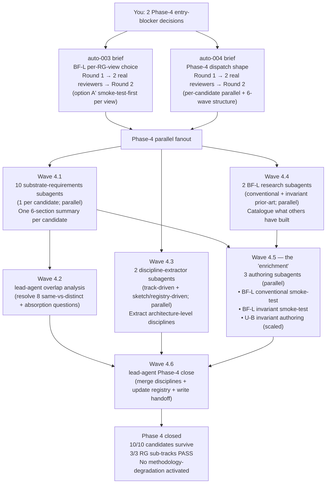
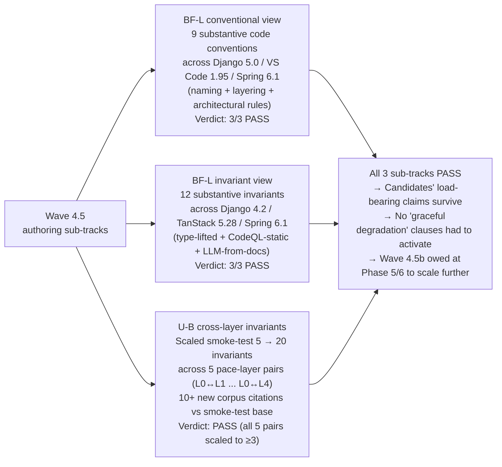

# Phase 4 in plain language

A summary of what happened during the Phase-4 unattended session 2026-05-25.

Yes — Wave 4.5 was the "enriching primitives with extra design tracks" piece. Three authoring subagents actually attempted to *build content* for the most research-grade-uncertain primitives instead of just accepting them as research-grade-uncertain. All three passed their gates.

## The setup

Phase 3.5 had told us 10 candidate architectures all survive into Phase 4, with 3 of them carrying a "research-grade-uncertainty" (RG) flag on their load-bearing primitive:

- **BF-L's Codebase Model** — 2 of 6 views are RG (conventional + invariant).
- **U-B's cross-layer drift detector** — fully RG (Brier's pace-layer framework is descriptive, not algorithmic).
- **D7-U-1's independence auditor** — structurally RG (auditor-recursion has no dominating option).

The [Phase-3.5.5 RG-primitive rule](architectures/v3/candidate-registry.md#phase-355-rule-on-load-bearing-rg-primitives-binding-user-approved-2026-05-25) said each candidate gets to choose, per RG portion: (a) attempt a bounded authoring sub-track to convert RG into designed-system, or (b) accept it as RG and design the methodology for graceful degradation. Phase 4 was where those choices got made and the work got done.

## Two entry-blocker briefs first

- [`auto-003`](architectures/v3/decisions/auto-003-bfl-rg-view-choice.md) — BF-L's per-RG-view choice. User direction: option (a) bounded sub-track for both views + dedicated research subagents on prior art (continue in parallel with rest of Phase 4).
- [`auto-004`](architectures/v3/decisions/auto-004-phase-4-dispatch-shape.md) — Phase-4 dispatch shape. User direction: per-candidate parallel fanout.

Each brief got 2 real adversarial subagent reviewers per the [AGENTS.md rule](AGENTS.md#adversarial-review-must-be-real-subagents). Both reviews landed substantive amendments — the methodology-purist actually *rejected* auto-003 Round 1 with a counter-proposal, pointing out that a count-gate ("≥20 patterns per language") was the same failure mode auto-002 Round 1 had been rejected for. Round 2 swapped to a **smoke-test-first pattern**: 3 non-trivial artifacts per language across the top-3 languages (Python / TypeScript / Java) on named real codebases (Django, VS Code, Spring).

## The 6-wave Phase-4 structure

## Wave 4.5 — the "enrichment of primitives with extra design tracks"

Instead of just *declaring* buildability, three subagents actually built scaled samples of content for the RG primitives:

D7-U-1's P-34 independence auditor wasn't a Wave-4.5 candidate because its bounded sub-track is already the A+C hybrid (deterministic-ness primary + named-human backstop at low cadence) — that's an ADR-shaped deliverable for Phase 5, not an authoring smoke-test.

## The other waves in plain English

- **Wave 4.1 (10 subagents).** For each of the 10 candidates, write a digest of "what substrate primitives does this candidate need, and what's their status?" Uses a uniform 6-section schema (§1 Primitive list / §2 RG primitives with verbatim text-pull from the registry / §3 Candidate-specific contracts with fixed sub-section headers for contested primitives / §4 X_UNM_B articulation for unified candidates only / §5 Open carries / §6 Scoping-principle compliance) and required text-pulls so the next wave can compare them cheaply.

- **Wave 4.3 (2 subagents).** Extract "architecture-level disciplines" — the *meta-rules* that govern how methodology calls into substrate. Not primitives, not methodology stages. Things like "real-subagent review", "honest RG flagging", "per-role read-filter", "snapshot consistency at version boundaries", "three-loop discipline" (BF-L's signature). 21 distinct disciplines total after the Wave-4.6 merge dedupes the two extractions' overlapping entries.

- **Wave 4.4 (2 subagents).** For each of BF-L's two RG views, catalogue what prior work exists (Daikon and its successors, structured-output LLM extractors, type-inference-lifted invariants, ArchUnit-style layering enforcers, etc.) — informs the Wave-4.5 smoke-tests and gives Phase-5 ADR authors a frame for "alternatives considered". Each note ~3000 words. Required negative-result coverage was added in Round 2 (what has been tried and abandoned).

- **Wave 4.2 (lead agent serial).** Read all 10 substrate-requirements summaries and resolve 8 questions that had been deferred from Phase 3.5:
  - P-28 envelope variants (U-A typed-node-graph vs U-B layer-typed vs U-C anchor vs D7-U-1 FC): same primitive or distinct?
  - P-29 policy mediator variants (U-A vs D7-U-1)
  - P-30 event registrar variants (U-A vs D7-U-1)
  - P-19 classifier variants (GF-S vs BF-L vs U-C)
  - P-08 ↔ P-09 collapse (held-out runner vs scenario store)
  - P-12 ↔ P-16 absorption (deterministic linter framework vs EARS+GtWR linter)
  - P-33 vs P-14 (opposing-side router vs judge router)
  - Plus the BF-S vs BF-L vs BF-M code-traversal commonality.

  Verdicts: 6 "same primitive distinct variants" + 2 absorbed + 2 distinct primitives → **30 distinct primitives total** (down from 34 enumerated).

- **Wave 4.6 (lead agent serial).** Phase-4 close. Merged the two discipline-index halves into a canonical index. Updated [`candidate-registry.md`](architectures/v3/candidate-registry.md) with the Wave-4.5 verdicts. Marked the Phase-3.5-close handoff superseded. Wrote the new Phase-4-close handoff that the next session picks up from.

## Dispatch totals

20 subagents in the Phase-4 session:

- 4 adversarial reviewers (2 on auto-003, 2 on auto-004)
- 2 BF-L research subagents (Wave 4.4)
- 2 discipline-extractor subagents (Wave 4.3)
- 9 substrate-requirements subagents (Wave 4.1 — the GF-M exemplar was authored by lead agent inline as the model for the other 9)
- 3 authoring subagents (Wave 4.5)

Plus 2 lead-agent serial waves (4.2 + 4.6).

All 20 subagents returned rubric-compliant outputs on first dispatch. No re-dispatches needed.

## What changed in the candidates

Nothing structurally — every candidate that entered Phase 4 exits Phase 4. But:

- The RG-flag candidates (BF-L, U-B) now have **evidence** that their load-bearing primitives are buildable at smoke-test scale, not just a claim.
- The unified-attempt candidates (U-A, U-B, U-C, D7-U-1) now have **honest** X_UNM_B (legacy-artifact acquisition) articulations including their completeness gaps — particularly important for any that claim brownfield-fit.
- The substrate primitive count is now **30 distinct** (down from 34 enumerated), with same-vs-distinct verdicts settled.
- 21 architecture-level disciplines are now catalogued separately from substrate primitives and methodology choices.

Phase-5 ADR estimate refined to **~54-62 ADRs** across the 10 candidates (within the v1.2 plan envelope).

## Phase-4 PRs

| PR | Wave | Output |
|---|---|---|
| [#146](https://github.com/lago-morph/software-factory/pull/146) | auto-003 R2 + Wave 4.4 | option A′ smoke-test-first + 2 research notes |
| [#147](https://github.com/lago-morph/software-factory/pull/147) | auto-004 R2 | per-candidate parallel fanout + 6-wave structure |
| [#149](https://github.com/lago-morph/software-factory/pull/149) | 4.3 | 12+12 disciplines (2 parallel extractions) |
| [#150](https://github.com/lago-morph/software-factory/pull/150) | 4.1 | 10 per-candidate substrate-requirements summaries |
| [#152](https://github.com/lago-morph/software-factory/pull/152) | 4.5 | 3 authoring sub-tracks (all PASS) |
| [#154](https://github.com/lago-morph/software-factory/pull/154) | 4.2 | 8 same-vs-distinct verdicts; 30 distinct primitives |
| [#155](https://github.com/lago-morph/software-factory/pull/155) | 4.6 | registry update + discipline merge + handoff |

Stacked chain off `main`; each PR's base auto-rebases as parents merge.
