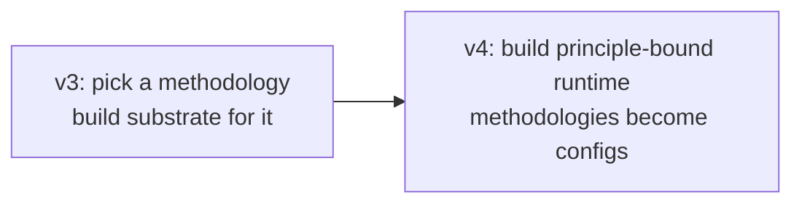
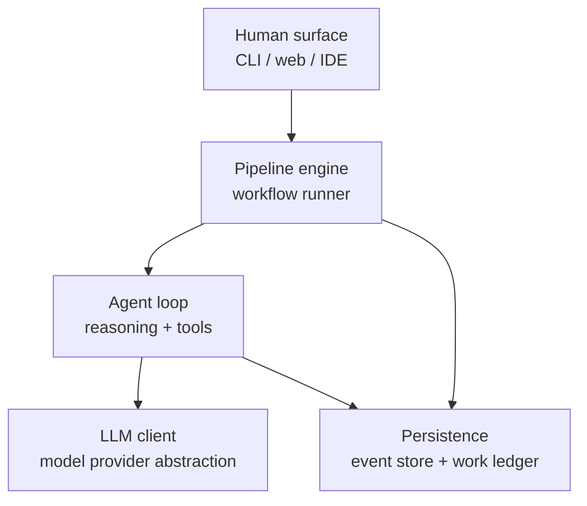
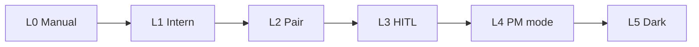
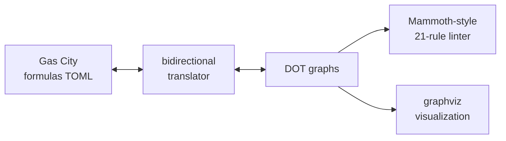
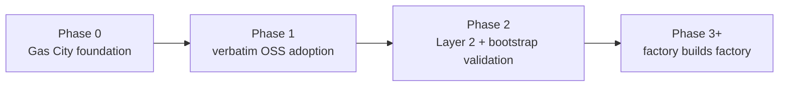
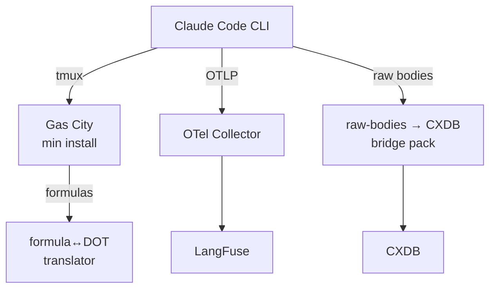
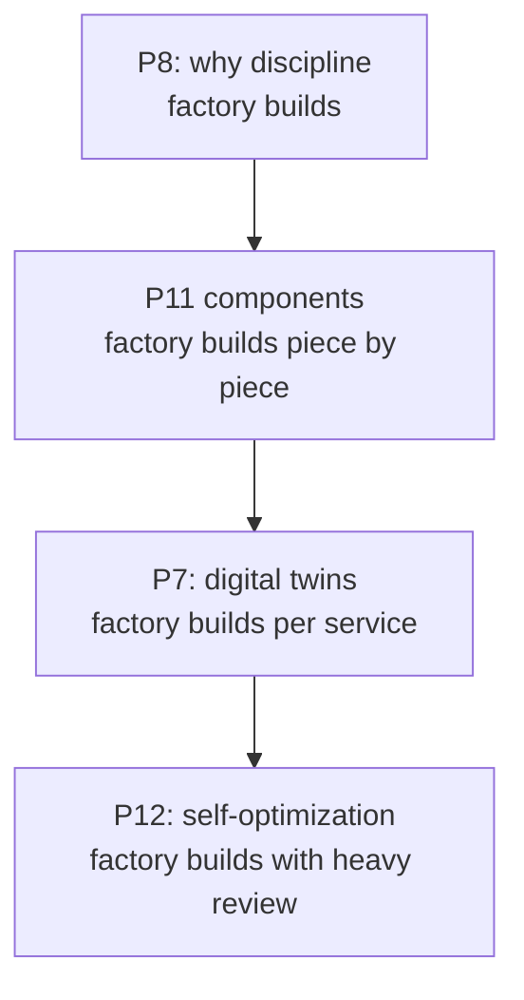
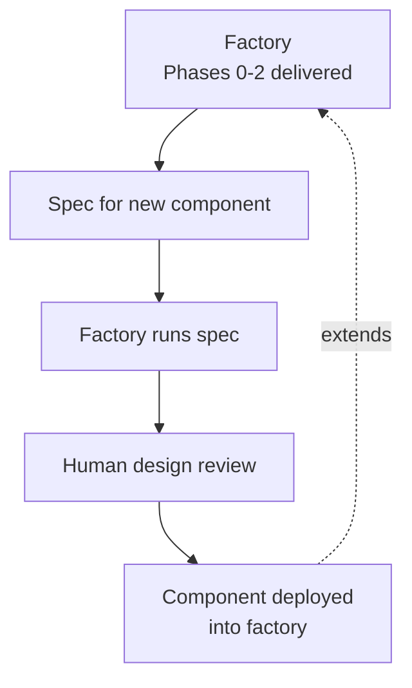

# Software Factory v4 — principles before methodology

A revised architectural approach for building an AI software factory. v4 inverts the v3 framing: instead of selecting a methodology and building substrate for it, build the substrate that supports the 12 principles, then run methodologies as configurations on top. Methodology becomes empirical and swappable; the runtime is the load-bearing engineering work.

This is a point-in-time snapshot dated 2026-05-29. The plan is evolving.

---

## What this document covers

- **Part 1**: the hypothesis and why it changes everything.
- **Part 2**: how v4 differs from v3.
- **Part 3**: the convergent shape (recap).
- **Part 4**: the 12 principles, broken down into components, with OSS sources per component and license notes.
- **Part 5**: license hygiene table.
- **Part 6**: implementation phases — Gas City first, then verbatim OSS adoption, then Layer 2 (scenarios + judge), then factory-builds-factory for the rest.
- **Part 7**: the self-bootstrap mechanic.
- **Part 8**: risks and what we're betting on.
- **Part 9**: starting tomorrow.

---

## Part 1 — The hypothesis

**Build a runtime that supports the 12 principles. The methodology question becomes empirical, second-order, swappable.**

The v3 work produced ten candidate methodologies. Each makes a specific bet about what the load-bearing piece of an AI factory is. The natural question that emerged: which one do we build? The v4 answer is: that's the wrong question to ask first.

The corpus's central finding is that *methodology is the variable; substrate is convergent*. Multiple independent teams building dark-factory implementations converge on the same three-layer architecture. The methodology that runs on top is where the variation lives — and where the experiments need to go.

If methodology is the variable, the right move is to build the substrate that runs methodology experiments cheaply. Then the ten v3 candidates collapse from "ten architectural decisions" to "ten pipeline configurations to run on the same platform with the same scenarios and the same judge." You don't choose; you experiment. You also don't lock in.

The 12 principles from the El Kaim synthesis define what makes that substrate a *factory* rather than an AI coding tool. Implement the principles, and the substrate is principled. Run methodology experiments on top, and you discover which methodology suits which kind of work — empirically, with evidence, instead of by debate.

---

## Part 2 — How v4 differs from v3

| Concern | v3 framing | v4 framing |
|---|---|---|
| Primary decision | Which of the 10 candidates to ship? | What components implement each principle? |
| Substrate | Specific to chosen methodology | Generic across methodologies |
| Methodology | Architectural commitment | Empirical experiment |
| Risk on getting it wrong | High — wrong methodology means wrong substrate | Low — wrong methodology means a new pipeline file |
| When to evaluate | After lean-eval runs (deferred) | Continuously after Layer 2 ships |
| Output | One factory | A platform that hosts factories |

The v3 candidate analysis is still useful — it tells us what each methodology requires for its specific configuration. v4 treats that as a catalog of pipeline files to be tested on the runtime, not as competing platforms.

---

## Part 3 — The convergent shape (recap)

Every working AI factory implementation in the public corpus converges on three layers, plus persistence:

And every working factory aims at one of the upper rungs of the autonomy ladder:

v4's substrate is built for L4-L5 operation — most steps run without per-step human review, scenarios drive evaluation, attribution is automatic, the self-healing loop catches and fixes what breaks.

---

## Part 4 — The 12 principles, decomposed

Each principle implies a set of components that have to exist somewhere in the substrate. The table below names the components, what each does, the best OSS sources for each (with license), and how it fits into a Gas City baseline.

The 12th principle in the original El Kaim list is "pipeline files worth sharing" — a community-norms commitment we treat as a release-time decision, not a runtime component. We substitute **self-optimization** as the 12th working principle, which is a real architectural capability and the natural extension after self-healing is working.

### Principle 1 — Specs are the source of truth

Code is disposable; specs are the load-bearing artifact. When something breaks, you fix the spec and rebuild, not the output.

| Component | What it does | OSS choice(s) | License | Gas City placement |
|---|---|---|---|---|
| Spec format | Defines the artifact that drives execution | Gas City prompt templates (Go `text/template` + Markdown) | MIT (via Gas City) | Native — `agents/<name>/prompt.template.md` |
| Spec storage | Version-controlled, attributable | Git + Gas City pack structure | MIT | Native — packs are git-versioned |
| Spec linter (optional) | EARS-style structural rules (INCOSE R7-R35) | Custom Go package (transfusion target: any EARS-rule implementation) | n/a (your work) | Gas City pack with deterministic tool node |
| Spec → execution binding | How does the system know which spec drives which work? | Gas City formulas reference templates by name; sling routes work to agents with specific templates | MIT (via Gas City) | Native |

**Gas City placement summary**: P1 is essentially handled by Gas City's prompt-template machinery. Spec linter is a small custom add when you want EARS-style discipline.

### Principle 2 — Three-layer architecture

LLM client + agent loop + pipeline engine, with persistence underneath. Don't reinvent any of the three.

| Component | What it does | OSS choice(s) | License | Gas City placement |
|---|---|---|---|---|
| LLM client | Provider abstraction; routing | Claude Code's built-in (under Max), LiteLLM (Python, when not on Max) | Claude Code: proprietary client, terms allow Max use; LiteLLM: MIT | Use Claude Code directly via Gas City tmux runtime |
| Agent loop | Multi-turn reasoning + tool dispatch | Claude Code CLI | Anthropic ToS — Max subscription allows | Gas City `claude` provider preset |
| Pipeline engine | DOT-shaped workflow runner | Gas City (Go) | MIT | The baseline |
| Persistence | Events + work ledger | Gas City beads (file or Dolt), CXDB for content-addressed trajectories | Gas City: MIT, CXDB: Apache 2.0 | Beads native; CXDB via bridge |

**Gas City placement summary**: All four layers slot into Gas City + Claude Code directly. CXDB is added in Phase 1 via a small bridge.

### Principle 3 — Pipeline-file as process

The workflow is a DAG file, version-controlled, runner-agnostic. The methodology lives in the file, not in agent prompts.

| Component | What it does | OSS choice(s) | License | Gas City placement |
|---|---|---|---|---|
| Workflow format | The DAG specification | Gas City formulas (TOML) | MIT | Native |
| Workflow visualizer | Render the DAG for review | Custom: formula → DOT exporter + graphviz | n/a (your work; small) | Gas City pack |
| Workflow linter | Structural rules | Transfusion from Mammoth's 21-rule DOT linter (Go, MIT) | MIT (Mammoth) | Gas City pack |
| Workflow translator (bidirectional) | DOT ↔ formula for interop with DOT-based tools | Custom (~few hundred LOC Go) | n/a (your work) | Gas City pack |

**Gas City placement summary**: Gas City has the runtime; the translator gives you visualization + lint compatibility with the DOT-graph ecosystem.

### Principle 4 — Deterministic-first

Tool nodes are cheap and reproducible. Most steps don't need a model. Use models only where reasoning is required.

| Component | What it does | OSS choice(s) | License | Gas City placement |
|---|---|---|---|---|
| Tool node abstraction | Unified interface for deterministic steps | Gas City native — tool beads | MIT | Native |
| Reconciler / controller loop | Desired-state convergence | Gas City Health Patrol + convergence loops | MIT | Native |
| Discipline tooling | Catches LLM-where-tool-suffices | Custom: linter pack that flags LLM nodes without justification | n/a (your work) | Gas City pack |

**Gas City placement summary**: P4 is native. The discipline-enforcement linter is a small add.

### Principle 5 — Scenarios as held-out test set

Scenarios are external to the codebase. The agent cannot see them during work. An independent process evaluates whether work satisfies them.

| Component | What it does | OSS choice(s) | License | Gas City placement |
|---|---|---|---|---|
| Scenario authoring format | Defines a scenario's structure | Inspect AI Task DSL (Python) | MIT | Gas City pack wraps Inspect AI |
| Scenario storage with read-isolation | Prevents agent from reading scenarios during work | Separate git repo + file permissions + Gas City rig partition | n/a (your work, small) | Gas City pack with policy |
| Scenario runner | Executes scenarios against the system | Inspect AI runner | MIT | Gas City pack |
| Holdout integrity audit | Detects if isolation has been violated | Custom: log audit checking agent reads vs scenario paths | n/a (your work, small) | Gas City pack |

**Alternative scenario format choices**: promptfoo (MIT, YAML-based), OpenAI Evals (MIT, JSONL), DeepEval (Apache 2.0, Pytest-style). Inspect AI has the strongest agent-trajectory model.

**Gas City placement summary**: Install Inspect AI, write a small pack that exposes it as a tool node. Holdout enforcement is filesystem permissions + agent-prompt discipline + audit logging.

### Principle 6 — Satisfaction not test-pass

Probabilistic metric over scenario trajectories. LLM-as-judge. Boolean assertions don't survive at scale.

| Component | What it does | OSS choice(s) | License | Gas City placement |
|---|---|---|---|---|
| LLM-as-judge harness | Scores trajectories against scenarios | Inspect AI scorer (best fit), Ragas (Apache 2.0), DeepEval | MIT / Apache 2.0 | Gas City pack |
| Judge rubric management | Versioned criteria | Inspect AI Python objects, promptfoo YAML | MIT | Native via Gas City pack |
| Multi-judge ensemble | Disagreement detection across judges | Inspect AI supports multiple scorers; transfusion from this pattern | MIT | Gas City formula |
| Satisfaction metric aggregation | Distribution over trajectory population | Inspect AI score reduction | MIT | Gas City pack |
| Cross-family enforcement | Judge must be a different model family than coder | Custom policy on the model stylesheet | n/a (your work, small) | Gas City model stylesheet rule |

**Gas City placement summary**: Inspect AI provides the bulk; cross-family enforcement is configuration on the Gas City model stylesheet.

### Principle 7 — Digital twins

Behavioral clones of critical external dependencies. Lets scenarios run thousands per hour without rate limits.

| Component | What it does | OSS choice(s) | License | Gas City placement |
|---|---|---|---|---|
| HTTP record/replay | Capture and replay HTTP traffic | VCR.py (Python), go-vcr (Go), polly.js (JS) | MIT | Per-language tool node |
| Stateful HTTP twin | Mock with custom logic | WireMock (Java, Apache 2.0), Mountebank (Node, MIT), LocalStack (Python, Apache 2.0) | Various permissive | Per-twin Gas City `[[service]]` block |
| Contract verification | Verify usage matches service promises | Pact (multi-language, MIT) | MIT | Gas City pack per service |
| Twin scaffolding from SDK | Generate twin from public SDK | **No OSS** — bespoke per service, transfusion from LocalStack pattern | n/a (your work) | Per-twin Go binary |

**Gas City placement summary**: P7 is the most labor-intensive principle to implement. No turnkey OSS for "twin a service from its SDK." Build per-dependency twins, gene-transfusing from LocalStack as the strong exemplar.

### Principle 8 — "Why am I doing this?"

If you can articulate why something looks wrong, you've described a validation rule. Capture overrides, surface patterns, convert to rules.

| Component | What it does | OSS choice(s) | License | Gas City placement |
|---|---|---|---|---|
| Manual override detection | Recognizes when operator bypassed the system | Claude Code `PreToolUse` / `PostToolUse` hooks | Anthropic ToS — Max-compatible | Gas City pack registers hooks |
| "Why" field prompting | Forces structured explanation | Custom prompt wrapper | n/a (your work, small) | Hook handler in Gas City pack |
| Override log storage | Durable record of overrides + why | Gas City beads with type `override` | MIT (Gas City native) | Native |
| Periodic pattern surfacing | Reviews log for recurring overrides | Custom SQL/duckdb query pack | n/a (your work, small) | Gas City pack |
| Rule conversion | Turn recurring overrides into validation rules | Manual review + new Inspect AI rubric | Manual + tool support | Operator workflow |

**Gas City placement summary**: P8 is mostly a discipline + small tooling. Claude Code hooks make detection automatic; the rest is bead types + queries.

### Principle 9 — Attribution

Every commit, task, event carries actor identity. Foundation for debug, compliance, trust.

| Component | What it does | OSS choice(s) | License | Gas City placement |
|---|---|---|---|---|
| Identity model | Who/what can act | Gas City `actor` schema (cities, rigs, agents) | MIT | Native |
| Action attribution | Every action carries identity | Gas City beads, events native `created_by` | MIT | Native (strongest principle match) |
| Audit trail | Queryable history | Gas City event bus + bead history | MIT | Native |
| Identity verification | Verify claimed actor matches actual | Custom: signature on bead provenance | n/a (optional, deferred) | Optional pack |

**Gas City placement summary**: P9 is Gas City's strongest native match in the corpus. Attribution flows automatically through beads and events without configuration.

### Principle 10 — Memory layer

Dependency-aware persistent task graph. Survives across agent sessions. Replaces flat scratchpads.

| Component | What it does | OSS choice(s) | License | Gas City placement |
|---|---|---|---|---|
| Persistent task graph | Tasks with dependencies | Gas City beads (file or Dolt) | MIT | Native |
| Cross-session continuity | Resume after agent restarts | Gas City session resume + Claude Code session-id | MIT | Native |
| Content-addressed trajectory store | Replay + branching + dedup | **CXDB** | Apache 2.0 | Bridge pack |
| Query interface | Read patterns from memory | Gas City `gc bd` commands + CXDB HTTP API | MIT / Apache 2.0 | Native |

**Gas City placement summary**: Beads handle the work-graph layer; CXDB adds content-addressed trajectory storage when self-healing needs richer trajectory analysis.

### Principle 11 — Self-healing loop

Observability → anomaly → diagnosis → fix → ship, without human intervention.

| Component | What it does | OSS choice(s) | License | Gas City placement |
|---|---|---|---|---|
| Event substrate | Records every action | Gas City event bus (always), CXDB (for trajectories) | MIT / Apache 2.0 | Native + bridge |
| Anomaly detection (numeric) | Detects unusual patterns | PyOD, Anomalib | BSD / Apache 2.0 | Python tool node in Gas City pack |
| Trajectory embedding | Embeds trajectories for clustering | sentence-transformers | Apache 2.0 | Python tool node |
| Trajectory clustering | Groups similar failures | HDBSCAN, scikit-learn | BSD | Python tool node |
| Diagnosis agent | LLM-driven root-cause analysis | Custom Claude Code agent with CXDB query tools; **transfusion source: Tracker's `Diagnose`/`Audit`/`Doctor` programmatic APIs** | License of Tracker: verify (likely MIT) | Specialized Gas City agent pack |
| Fix-task generation | Diagnosis → bead | Custom: diagnosis agent writes bead of type `fix_task` | n/a (your work) | Native bead writing |
| Durable workflow | Survives crashes / retries | Gas City Orders + Temporal (Go SDK), Inngest, Trigger.dev | MIT / Apache 2.0 | Orders native; Temporal optional |
| Loop closure tracking | Did the fix actually fix it? | Custom bead chain: anomaly → diagnosis → fix → resolution | n/a (your work, small) | Bead schema |

**Gas City placement summary**: P11 is the largest custom engineering effort. CXDB + Temporal handle substrate; PyOD + sentence-transformers + HDBSCAN handle clustering; the diagnosis agent is the focused work. **Mammoth/Tracker's diagnosis APIs are the strongest LLM-pipeline-runner transfusion target for this layer.**

### Principle 12 — Self-optimization

The system measures its own meta-performance and improves it over time. Not in the El Kaim 11; we add it as the 12th working principle because it's the natural extension after self-healing.

| Component | What it does | OSS choice(s) | License | Gas City placement |
|---|---|---|---|---|
| Meta-metric definition | What "better" means | Custom: cost-per-satisfaction, time-to-threshold, judge false-positive rate | n/a (your work) | Configuration |
| Meta-metric tracking | Records meta-metrics over time | MLflow, Aim, Weights & Biases (free tier) | Apache 2.0 / Apache 2.0 / freemium | Gas City pack |
| Variant identification (prompt) | Identifies what to experiment with | DSPy compilers | MIT | Python tool node |
| Variant identification (hyperparameter) | Optimization over configuration | Optuna, Ray Tune | MIT / Apache 2.0 | Python tool node |
| A/B test routing | Routes traffic to variants | Unleash, GrowthBook, Flagsmith | MIT / MIT / commercial-with-OSS-core | Gas City pack |
| Counterfactual replay | Re-run from trajectory midpoint | **CXDB** O(1) branching | Apache 2.0 | Bridge + driver |
| Statistical comparison | Was variant better? | scipy.stats, Evidently AI | BSD / Apache 2.0 | Python tool node |
| Promotion gate | New variant becomes default | Custom: Gas City formula with statistical gate | n/a (your work, small) | Gas City formula |

**Gas City placement summary**: P12 is the most ambitious and the most research-flavored. CXDB + DSPy + Optuna + scipy + Unleash compose into the layer; the driver is your most significant invention. Build last, after Layers 1-5 are solid.

---

## Part 5 — License hygiene

The compound dependency set has to be license-compatible with whatever you intend to do with the result (OSS release, commercial use, etc.). Permissive licenses (MIT, Apache 2.0, BSD) dominate; a few projects have restrictive licenses worth flagging.

| Project | License | Notes |
|---|---|---|
| Gas City | MIT | `internal/` paths in Go — must vendor + fork under your module path to use as library |
| Claude Code CLI | Anthropic ToS | Max subscription allows subprocess automation |
| CXDB | Apache 2.0 | Clean for OSS release; required attribution |
| Beads | MIT | Clean |
| Tracker (library Mammoth wraps) | Verify before adopting | Check repo before transfusion / adoption |
| Inspect AI | MIT | Clean |
| LangFuse | MIT (most) / **MIT** core, observability platform | Core is MIT; some integrations vary; self-host is clean |
| Phoenix (Arize) | **Elastic License** | **Restrictive on hosted services**. Avoid if planning to offer the platform as a service. LangFuse is the cleaner alternative. |
| OpenLLMetry | Apache 2.0 | Clean |
| OpenTelemetry Collector | Apache 2.0 | Clean |
| Temporal | MIT | Clean (Temporal Cloud is the commercial offering, but the OSS server is fully usable) |
| Inngest | Apache 2.0 | Clean |
| Trigger.dev | Apache 2.0 | Clean |
| Mammoth | MIT (verify; 2389 research convention) | DOT linter is the strongest transfusion target |
| Kilroy | MIT (verify; Shapiro convention) | CXDB integration is the strongest transfusion target |
| OpenHands | MIT | SWE-Bench harness is in sibling repo `OpenHands/benchmarks` |
| Fabro | MIT (verify; Bryan Helmkamp / Qlty.sh) | CSS model stylesheet is the transfusion target |
| LocalStack | Apache 2.0 | The strong exemplar for Layer 5 twin patterns |
| WireMock | Apache 2.0 | Clean |
| Mountebank | MIT | Clean |
| VCR.py | MIT | Clean |
| Pact | MIT | Clean |
| PyOD | BSD-2-Clause | Clean |
| Anomalib | Apache 2.0 | Clean |
| sentence-transformers | Apache 2.0 | Clean |
| HDBSCAN | BSD | Clean |
| scikit-learn | BSD | Clean |
| DSPy | MIT | Clean |
| Optuna | MIT | Clean |
| Ray Tune | Apache 2.0 | Clean |
| MLflow | Apache 2.0 | Clean |
| Aim | Apache 2.0 | Clean |
| scipy / statsmodels | BSD | Clean |
| Evidently AI | Apache 2.0 | Clean |
| Unleash | Apache 2.0 | Clean |
| GrowthBook | MIT | Clean |
| Flagsmith | BSD-3-Clause | Mostly clean; commercial offering separate |
| promptfoo | MIT | Clean |
| Ragas | Apache 2.0 | Clean |
| DeepEval | Apache 2.0 | Clean |
| AgentDojo | MIT | Clean |
| LiteLLM | MIT | Clean (when used) |

**Specific cautions:**

- **Phoenix (Arize)** uses the Elastic License — restrictive if you plan to operate the factory as a hosted service. Use LangFuse instead.
- **Gas City's `internal/` Go import paths** mean GitHub blocks direct module import. You must fork and vendor under your own module path. Until the team exposes `pkg/`, this is a vendoring situation, not a dependency-management one.
- **Tracker's license** needs verification before adoption or transfusion. Likely MIT but check.
- **Claude Code CLI** is proprietary client code; the Max subscription license terms govern its use. Subprocess automation is allowed.

---

## Part 6 — Implementation phases

Four-phase plan. Each phase is independently valuable — you ship something working at every checkpoint, you don't wait for Phase 6 to get value.

### Phase 0 — Gas City foundation

**Goal**: minimum viable principled runtime, running one Claude Code session, no custom code.

**What you install/configure**:

- `gc` binary (single Go binary, install from upstream Gas City)
- `pack.toml` with one import: `[imports.core]`
- `city.toml` with `[workspace]`, one `[[agent]]` pointing at Claude Code via the tmux provider, `[beads] provider = "file"`
- One prompt template at `agents/worker/prompt.template.md`

**What you do NOT install**: no daemon, no mail, no formulas defined yet, no Dolt server, no multi-rig pool, no CXDB.

**What's delivered**:
- **P1** (specs as SoT): prompt templates + pack config in version control
- **P2** (three-layer architecture): Claude Code as agent + LLM client, Gas City as pipeline engine, beads as persistence
- **P3** (pipeline-as-process): basic via implicit single-step pipeline; full when formulas turn on in Phase 1
- **P4** (deterministic-first): reconciler + tool-node primitives available
- **P9** (attribution): native; every bead and event carries `created_by`
- **P10** (memory layer): bead store handles task graph + cross-session

**Effort scope**: single-engineer day to a few days. Mostly config.

### Phase 1 — Verbatim OSS adoption

**Goal**: add the principle-supporting components that exist as ready-to-use OSS. No custom inventions, only integration.

**What you install/configure**:

- Turn on `[formulas]` in `city.toml`
- Define one initial formula (3-step minimum to validate)
- Build the formula↔DOT bidirectional translator as a small Go tool (transfusion source: any DOT writer/parser library; few hundred lines)
- Add `gc formula export <name> --format dot` for graphviz rendering
- Install OpenTelemetry Collector to receive Claude Code's native OTLP output (`OTEL_LOG_RAW_API_BODIES=file:<dir>` for the raw-body path)
- Install LangFuse self-hosted for trace browsing + session management
- Install CXDB (Apache 2.0) for content-addressed trajectory storage
- Build the raw-API-bodies → CXDB bridge as a Gas City pack (transfusion source: Kilroy's CXDB integration pattern + Gas City's `internal/sessionlog`)

**What's delivered (additions)**:
- **P3** (pipeline-as-process): full, including visualization and (optionally) Mammoth-derived 21-rule linter
- **P10** (memory layer): full, including content-addressed trajectories via CXDB

**What's delivered (foundations for later phases)**:
- Observability infrastructure ready for P8 and P11
- CXDB substrate ready for P11 anomaly clustering and P12 counterfactual replay

**Effort scope**: small-team week to two weeks. Configuration + one small translator + one small bridge.

### Phase 2 — Layer 2 (scenarios + judge) and bootstrap validation

**Goal**: deliver P5 + P6 by composing OSS, then prove the factory can build something for itself.

**What you build / configure**:

- Install Inspect AI (MIT)
- Build Gas City pack wrapping Inspect AI as a scenario provider (the `[[service]] type = "inspect_ai"` block)
- Set up scenario storage: separate git repo + filesystem permissions enforcing read-only-from-implementer; OPA policy for finer control later
- Build satisfaction aggregator: small Go tool node reading judge outputs from beads, computing distributions
- Build cross-family enforcement: rule in Gas City model stylesheet — judge node must use different model family than coder node

**Bootstrap validation** (the critical milestone):

- Author a careful spec for a small new component (candidate: a `[[provider]]` extension to Gas City that adds Linear webhook ingestion, or a small reporter pack that summarizes the day's bead activity)
- Run the factory on the spec
- Human review the output
- Deploy if it works

If the bootstrap validation succeeds, the factory has proven it can do its own development work. Phase 3 builds on this. If it fails, the factory itself needs work before Phase 3.

**What's delivered**:
- **P5** (scenarios as held-out): Inspect AI handles storage + execution; scenario-to-bead binding via pack
- **P6** (satisfaction not test-pass): Inspect AI scorer + Gas City aggregator + cross-family enforcement

**Effort scope**: small-team week to two weeks. The harder parts are the Inspect AI wrap and the scenario isolation policy.

### Phase 3+ — Factory builds factory

**Goal**: every subsequent principle's components get built by the factory itself, with gene transfusion from established OSS exemplars, with human design review at each piece.

**Phase 3a — P8 ("why" discipline)**: factory builds the override-detection Claude Code hooks + the periodic-surfacing pack. Transfusion sources: AWS CloudTrail audit log shape, git reflog conventions. Small scope.

**Phase 3b — P11 components (Healer in pieces)**:
- Anomaly detection pack (transfusion from PyOD)
- Trajectory clustering pack (transfusion from sentence-transformers + HDBSCAN)
- Diagnosis agent (transfusion from Tracker's `Diagnose`/`Audit`/`Doctor` shape + Anthropic's investigation patterns visible in Claude Code itself)
- Fix-task bead schema
- Loop closure tracking pack

Each piece is a separate factory build, separately reviewed, separately deployed. Build the simplest first (anomaly detection); save the diagnosis agent for after the substrate is proven.

**Phase 3c — P7 (digital twins, per service)**: factory builds twins per critical dependency. LocalStack is the strong gene-transfusion exemplar. Each twin is bounded engineering; the factory's job is to follow the LocalStack-shaped pattern for a specific service's SDK contract. Repeat per dependency.

**Phase 3d — P12 (self-optimization)**: factory builds the meta-metric pack, the variant identification pack (transfusion from DSPy), the A/B routing pack (transfusion from Unleash), the counterfactual replay driver. This is the highest-risk layer; heaviest human review.

**Effort scope**: gradual. Each component is bounded, each gets reviewed, each ships independently. Total wall-clock time depends on factory autonomy maturity, but each piece is small enough to validate in days.

---

## Part 7 — The self-bootstrap mechanic

The interesting recursion: the 12 principles are *recursive*. Specs as SoT applies to the factory's own development just as it applies to user software. Attribution traces back through the factory's own work. The self-healing loop heals the factory healing things.

**Discipline that keeps the bootstrap honest**:

- **Gene transfusion always.** Every component built by the factory transfuses from at least one external exemplar. No invention from scratch. Reduces risk and makes evaluation grounded ("does this behave like the exemplar?").
- **Attribution of transfusion sources.** Every factory-built component records its `transfused_from: <url>` in metadata. P9 applied to the factory's own work.
- **Design review before deployment.** Human reviews the factory's design output before any factory-built component goes into production use. Required until P12 is mature and trusted.
- **Scenarios drive evaluation.** Factory-built components have their own scenarios. The Healer agent's scenarios are adversarial — feed it failure trajectories that the team has manually clustered, ensure its clusters match. The twins' scenarios verify behavioral fidelity against the real service. Self-optimization's scenarios verify that variant selection actually picks winners.
- **External grounding for substrate.** Foundational components (CXDB, Temporal, scikit-learn) stay as upstream OSS. The factory builds the orchestration glue, not the foundations. Reduces drift.

---

## Part 8 — Risks and what we're betting on

**The bets**:

1. **The 12 principles are the right set.** If self-optimization shouldn't be in there, or if something is missing, the runtime is wrong-shaped.
2. **Gas City scales as the substrate baseline.** If Gas City's design choices (Dolt, OTP reconciler, TOML formulas) become limiting, you fork or migrate.
3. **The factory can do its own development work after Phases 0-2.** If bootstrap validation in Phase 2 fails, the whole "factory builds factory" approach has to be reconsidered.
4. **Gene transfusion is reliable for bounded components.** If the factory can't reliably port a pattern from one codebase to another, Phase 3+ becomes much harder.
5. **Methodologies will emerge empirically.** Once Layer 2 is up, running v3's GF-M (the cheapest candidate) on the runtime is a few days of pack work. The bet is that empirical results will tell us which methodologies are worth pursuing, and that the substrate cost amortizes across all of them.

**The risks**:

- **Vocabulary lock-in to Gas City.** Cities, rigs, formulas, molecules. Real cognitive load. Recoverable but irreversible without major rework.
- **Gas City migration tail.** Two CI-enforced migrations in flight (worker boundary, session-first). Expect 1-2 breaking changes per quarter through 2026.
- **`internal/` path means vendoring forever** (until upstream exposes `pkg/`). You're maintaining a fork.
- **Phase 2 may not validate the bootstrap.** First factory-built component may fail human review. Plan: iterate on the spec and run again; if still failing after a few attempts, the factory needs more substrate before Phase 3.
- **Layer 5 (twins) is genuinely sparse.** No good OSS exemplar for "twin a service from SDK." LocalStack is the closest pattern transfer; building twins is per-service engineering work whether the factory does it or you do it.
- **Layer 6 (self-optimization) is research-frontier.** Components exist; the integration is genuinely new. The factory building Layer 6 is the highest-risk move in the plan.

**What we're not betting on**:

- **No specific methodology choice.** v4 deliberately doesn't pick from v3's ten candidates. They become experiments.
- **No specific scenario suite at the start.** Phase 2 ships scenarios for the bootstrap validation but the broader scenario library grows over time.
- **No commitment to L5 autonomy on day one.** The runtime can run at L4 (PM mode, specs in, software out, batched review) for as long as needed. L5 is the natural endpoint, not a precondition.

---

## Part 9 — How to start tomorrow

Concrete first steps:

1. **Fork Gas City** under your own GitHub org, vendor `internal/` into a usable module path. Verify Tracker's license while you're at it.
2. **Install `gc` from your fork**, author the minimum `pack.toml` + `city.toml` + one prompt template per Phase 0.
3. **Verify Claude Code runs in the Gas City tmux runtime** with attribution flowing into beads. This is your first checkpoint.
4. **Start the formula↔DOT translator** as a small Go side project. Doesn't have to be perfect; the bidirectional capability is what enables Mammoth-compatible linting.
5. **Set up an OpenTelemetry Collector** receiving Claude Code's OTLP output. Verify events flow.
6. **Install LangFuse self-hosted**, point the OTel Collector at it. Verify trace browsing works.
7. **Install CXDB** alongside, build the raw-API-bodies bridge. This is the first non-trivial integration; budget a week.
8. **Author the Phase 2 spec** for a small first-factory-built component. The bootstrap validation prompt is the most consequential thing you write in the first month.

After Phase 2 ships and bootstrap is validated, the pace accelerates substantially because subsequent components get built by the factory rather than by you.

---

## Honest acknowledgements

- The v3 work (the ten candidates, the build guide, the per-candidate diagrams) remains the catalog of methodology experiments to run on the v4 runtime. v4 doesn't replace v3; it provides the platform that makes v3 evaluable.
- Several specific OSS projects need license verification before adoption (Tracker, Kilroy, Mammoth, Fabro — most likely MIT given convention but verify).
- Gas City is the load-bearing third-party dependency. If Gas City fails, the whole plan reorganizes. Worth following the project's roadmap carefully and considering whether to contribute upstream once their migrations settle.
- The plan deliberately does not pick a methodology. That's the design — methodology is the variable. The first methodology you'll run is whichever v3 candidate has the smallest custom-pack scope (GF-M), to validate that the runtime can host them at all.

*Last updated: 2026-05-29. This document is a moving target.*
