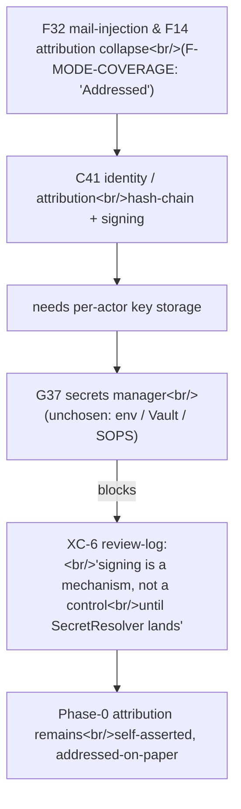

# Secrets-manager thread — where v4 needs one, what's missing, what to choose

> **What this file is.** A trace of every reference to secrets / signing / HMAC / SecretResolver / OAuth / `env = { … }` / plaintext-in-config across the v4 source docs (`README.md`, `AI-CONTEXT.md`, `F-MODE-COVERAGE.md`, `_meta/ambiguities-and-gaps.md`, `_meta/review-log.md`) and the 23 already-built sweep-1 specs in `spec-faithful/` + `spec-optimized/`. Built so the question "where is the secrets manager used, and what are the dependencies?" can be answered with cites.
>
> **What this file is NOT.** Not a design proposal, not an ADR, not a recommendation to choose any one option. Section 5's OSS list is buildability framing, not endorsement.
>
> **Audience.** The user (jonathan@manton.com) for the upcoming human-facing report, and the integrator agent who eventually settles XC-6 / G37 across the v4 corpus.

---

## 1. Where used — consumer table

Sorted high → low criticality. "Criticality" = what breaks if the consumer's secrets-manager dep is not resolved.

| # | Component | Doc track | What it needs from a secrets manager | Verbatim cite | Criticality |
|---|---|---|---|---|---|
| 1 | **C03 — Layered config / feature-flags (the `SecretResolver` seam)** | Both tracks; optimized adds DELTA-03 | A provider behind the `SecretRef` indirection — `secret://<provider>/<key>` / `${ENV:NAME}` / `file://`. Without one, "no plaintext secrets" is a *lint*, not a guarantee. | spec-optimized/C03 §3, §9 OQ1: *"Which `SecretResolver` provider is the v4 baseline under Max — env-injection only, or a Vault/SOPS-shaped backend? G37 names the problem but the corpus offers no secrets story; the choice affects C28 OAuth handling and C25 mTLS certs. Top open question."* spec-faithful/C03.review.md RC03-04: *"OQ1 concedes the provider is unchosen … env-injection still means the secret is in the process environment … the secret is still adjacent to version control."* | **HIGH — gates the seam every other consumer references.** |
| 2 | **C41 — Identity & attribution (signing-key storage)** | Both tracks; optimized track makes signing graduated-mandatory (DELTA-01/06) | Somewhere for **per-actor private keys** to live so `signed`/`attested` assurance has meaning. C41 holds the *model* of keys, not the bytes. | spec-optimized/C41 §3 Outbound: *"→ secrets store (C03/C43 territory) — fetch/store private key material; C41 holds the model, not the bytes (G37 boundary)."* §6 G36 caveat: *"`signed`/`attested` assurance is only as strong as where private keys live; at Phase 0, with no v4 secrets store, keys risk sitting in plaintext `city.toml`, which collapses the assurance ladder … Signing is **resolved as a mechanism but not security-effective until G37 is solved**."* spec-faithful/C41.review RC41A-06: *"the optional verification pack needs *somewhere* for a signing key to live, and faithful v4 gives no secrets store (G37 is an open gap)."* | **HIGH — without it, the whole F32/F14/F43 tamper-evidence ladder is self-asserted; XC-6 in `review-log.md`.** |
| 3 | **C28 — Claude Code agent loop (Max OAuth)** | Both tracks | Place to hold the Max-OAuth credential picked up by the Claude Code login, **never exfiltrated outside Claude Code/claude.ai** (Anthropic ToS hard constraint), plus a *separate* credential path for the API-key/Agent-SDK fallback adapter (G12). | spec-faithful/C28 §3 I1: *"C28 authenticates **only** via Max OAuth picked up from Claude Code login; OAuth tokens are **never** used outside Claude Code/claude.ai (AI-CONTEXT §4.1 L147 — a ToS hard constraint)."* spec-optimized/C28 §7 Security: *"OAuth tokens never leave Claude Code (AI-CONTEXT §4.1) — the fallback adapter uses a *separate* credential path, never the OAuth token."* | **HIGH — the only way the factory makes API calls. If OAuth path breaks and the fallback has no credential store, the factory is offline.** |
| 4 | **C04 — Session / provider runtime (`CredentialSource` + fallback ladder)** | Optimized track, DELTA-03 | A `CredentialSource` adapter that resolves `MaxOAuth → AgentSDKCredit → MeteredAPIKey` at session spawn; each rung is a conformance-passing adapter, and the credential bytes are injected at spawn, never embedded in agent-visible config. | spec-optimized/C04 §3 Outbound: *"`CredentialSource` (→ C43/env/secret store, DELTA-03): supplies auth at spawn via a fallback ladder: `MaxOAuth` (default, §4.1) → `AgentSDKCredit` (§4.2, ≥ 2026-06-15) → `MeteredAPIKey` (G12 fallback)."* §7 Security: *"Credentials are injected, never embedded in agent-visible config; OAuth tokens are never exposed to agent tooling … C04 keeps them in the provider, not the workspace."* spec-faithful/C04 table row: *"Injected env (OAuth-derived auth, OTEL vars) | C04 at start; values from C03 §13.2 | Set per session; secrets handling is unspecified by v4 (G37, deferred — not C04's gap)."* | **HIGH — every session spawn passes through here.** |
| 5 | **C25 — OTLP telemetry export (optional mTLS for non-localhost Collector)** | Both tracks | mTLS keys / certificates when the OTel Collector (C26) is non-localhost: `OTEL_EXPORTER_OTLP_CLIENT_KEY` / `_CERTIFICATE` (gRPC) or `CLAUDE_CODE_CLIENT_CERT` / `_KEY` (HTTP). | spec-faithful/C25 §7 Security: *"The transport supports mTLS (gRPC: `OTEL_EXPORTER_OTLP_CLIENT_KEY`/`_CERTIFICATE`; HTTP: `CLAUDE_CODE_CLIENT_CERT`/`_KEY`) and custom headers (AI-CONTEXT:169) — faithful security posture for the OTLP channel … C25 introduces no new secret beyond the optional mTLS material."* AI-CONTEXT §4.3 L169: *"Configurable: headers, mTLS (`OTEL_EXPORTER_OTLP_CLIENT_KEY` / `_CERTIFICATE` for gRPC, `CLAUDE_CODE_CLIENT_CERT` / `_KEY` for HTTP), per-signal endpoints."* | **MEDIUM — only material when the Collector is non-localhost (single-host Phase-0 install can live without).** |
| 6 | **C29 — Model floor stylesheet (judge-seat credential for L2/L3)** | Optimized, DELTA-03 | A **metered-API "judge seat"** credential — a small pay-as-you-go key, *isolated* from the Max OAuth — to unlock cross-family judging (L2/L3 independence). Referenced by handle, never the secret. | spec-optimized/C29 §3d: *"For L2/L3, C29 exposes a gate: a satisfaction-measuring formula requesting L≥2 must resolve to a registry entry whose adapter has a **valid second-family credential** (the proposed **metered-API "judge seat"** — a small pay-as-you-go API key used *only* for judge tokens, never the Max OAuth token, isolated per AI-CONTEXT §4.1's 'OAuth never leaves Claude Code')."* §7 Security: *"The judge-seat credential is the only second-provider secret; it is referenced by handle only and isolated from the Max OAuth token … C29 *requires* it via the gate but does not store it (G37 — secrets store deferred)."* `_meta/review-log.md` D-1: same-provider judge is the Phase-0 baseline; L2/L3 + judge seat is FE-1 (future enhancement). | **MEDIUM — Phase 0 (per D-1) does not need it; FE-1 (cross-family judging) is blocked on it.** |
| 7 | **C06 — Messaging (Mail HMAC signing seam)** | Inventory + spec-faithful note | An HMAC key (shared symmetric) for the optional / graduated-mandatory mail-signing layer that addresses F32 mail-injection. | F-MODE-COVERAGE L34: *"F32 Mail-injection / unsigned coordination → P9 attribution + **optional** HMAC signing layer | Addressed"* and L87 (revisit): *"HMAC signing on mail bus (gene transfusion: any signed-message protocol)"*. Component inventory C06 row: *"optional HMAC signing"* (gap G36). spec-faithful/C41 §1: *"C06 owns Mail/Nudge and the *optional HMAC signing* of mail; C41 owns the identity that signing would bind to."* | **MEDIUM — inherits C41 keys when the optimized track lands; lower in priority because mail bus itself is one component.** |
| 8 | **C02 — Pack extension ABI (pack signing trust root)** | Optimized track, DELTA-02 | A **human-held or human-gated** signing trust root so that a self-bootstrapping factory (C52) cannot sign its own emitted packs and thereby self-promote without human review. | spec-faithful/C02.review RC02-04: *"who holds the signing key, what the trust root is, and how a factory-generated pack (C52) gets signed without the factory also holding the key are unspecified … signing provides authenticated provenance, and gating RSI requires the signing trust-root to be **human-held or human-gated at the C52/C53 review point** (not factory-held) — otherwise it is audit, not prevention."* spec-optimized/C02 DELTA-02: *"pack bundle manifest = signed, versioned, dependency-declaring artifact … signing = authenticated provenance, RSI-gating needs a human-held trust root."* | **MEDIUM — only load-bearing when self-bootstrap (C52) ships in Phase 3+, but the trust-root question is upstream of any pack-signing key storage choice.** |
| 9 | **C24 — Telemetry → CXDB bridge (sensitive inbox at rest)** | Both tracks | Filesystem isolation of `/var/lib/cxdb-bridge/inbox` because raw API bodies are untruncated request/response JSON (full prompts, full responses, correlation identity). Same G37 thread. | spec-faithful/C24 §7: *"the inbox dir + transport + CXDB endpoint inherit the **G37 secret/exposure thread** (plaintext local dir, unauthenticated localhost HTTP) — flagged, deferred to the config/secrets owner."* spec-optimized/C24 §7 Security: *"raw API bodies contain *untruncated* request/response JSON (AI-CONTEXT §4.3) — the highest-sensitivity telemetry in the factory (secrets, holdout content, full prompts)."* | **MEDIUM — at-rest secret-bearing surface; C01/C43 filesystem isolation is the today-control but no encryption/manifest spec'd.** |
| 10 | **C21 — CXDB trajectory store** | Both tracks | Endpoint config (`[[service]] cxdb`) and any auth on `:9009` / `:9010`. | spec-faithful/C21 §7: *"Secret/endpoint handling for the `[[service]]` block inherits the G37 plaintext-TOML exposure (flagged, deferred to config/secrets owner — out of C21 faithful scope)."* | LOW — local-only at Phase 0; secrets risk surfaces if CXDB moves off localhost. |
| 11 | **C27 — LangFuse trace store** | Inventory row | LangFuse self-hosted credentials (whatever it requires to authenticate clients). | Component inventory L39: `C27 LangFuse trace store … depends C26; gaps G37`. | LOW — single-host Phase 0 likely localhost; broader scope on multi-host install. |

**Consumer count: 11.** **High: 4 (C03, C41, C28, C04). Medium: 5 (C25, C29, C06, C02, C24). Low: 2 (C21, C27).**

---

## 2. What's missing — providers in v4 (gap statement)

**Provider count in v4: 0.**

Evidence:

- `_meta/ambiguities-and-gaps.md` G37 (verbatim): *"**Secret/credential handling is absent.** OAuth tokens (Max), CXDB endpoints, LangFuse, OTel mTLS certs, and the (required-but-undefined) judge provider credentials all appear in `city.toml`/env (AI-CONTEXT §13.2) with no secrets-management story. `env = { ... }` in TOML implies plaintext secrets in version-controlled config."*
- `AI-CONTEXT.md` §13.2 (the Phase-1 `city.toml` skeleton) demonstrates the surface — every credential-bearing service is configured as `[[service]] endpoint = "..."` or `env = { CLAUDE_CODE_ENABLE_TELEMETRY = "1", OTEL_EXPORTER_OTLP_ENDPOINT = "...", ... }`. There is no `[[secret]]` block, no `secrets_provider = ...`, no Vault-shape, no SOPS-shape.
- `architectures/v4/README.md` Part 6 phasing names what gets installed at each phase; the phrase "secrets manager" does not appear. Part 4 P9 (attribution) row puts "Identity verification — verify claimed actor matches actual" as **"optional, deferred"** (README:229).
- `architectures/v4/_meta/review-log.md` XC-6 (verbatim): *"Phase-0 signing assurance vs unsolved secrets (G37). C41-B `signed`/`attested` assurance is over-stated while G37 (key storage) is unsolved — plaintext keys in `city.toml` collapse the ladder. Signing is a mechanism, not yet a control, until C03's SecretResolver (OQ) lands."*
- `architectures/v4/_meta/review-log.md` C03 OQ harvest: *"C03: SecretResolver provider baseline under Max (env-injection vs Vault/SOPS); layer-merge precedence."*

**Three-line gap statement (for citation in the human-facing report).**

> v4 has no secrets manager. Every credential (Max OAuth, OTel mTLS, CXDB/LangFuse endpoints, future judge-seat, future signing keys) is *named* somewhere in `city.toml` / `env = { … }` and *stored* nowhere — by design, the corpus defers to a future "C03 SecretResolver provider" that has not yet been chosen between env-injection and a Vault/SOPS-shape. The result is that v4's tamper-evidence, attribution-integrity, and supply-chain controls (F14/F32/F43, the signed/attested ladder, pack signing for self-bootstrap) all rest on a key-storage substrate that does not exist — making them "mechanisms, not controls" (review-log XC-6) until G37 lands.

---

## 3. Dependency chain — Mermaid (≤7 nodes)

(6 nodes. The chain longest-blocked = F32/F14 → C41 → key storage → G37 → XC-6 → Phase-0 attribution stays self-asserted.)

---

## 4. What's blocked until a secrets approach is chosen

Open questions and decisions from the v4 corpus that cannot resolve without picking a secrets approach:

1. **C03 OQ1 — `SecretResolver` provider baseline.** *Top open question.* "Env-injection only, or a Vault/SOPS-shaped backend? G37 names the problem but the corpus offers no secrets story; the choice affects C28 OAuth handling and C25 mTLS certs." *Owner:* C03 author + integrator (`spec-optimized/C03.md` §9).
2. **XC-6 — Phase-0 signing assurance vs unsolved secrets.** "C41-B `signed`/`attested` assurance is over-stated while G37 (key storage) is unsolved — plaintext keys in `city.toml` collapse the ladder. Signing is a mechanism, not yet a control, until C03's SecretResolver (OQ) lands." *Owner:* C41/C03 (B) (`_meta/review-log.md`).
3. **DECISION NEEDED — signing mandatory vs optional.** "Track A holds README:229 'optional/deferred'; Track B makes it graduated-mandatory. Integrator/human must settle; if mandatory, G37 + XC-5 must be pulled forward with it." *Owner:* human + integrator (`_meta/review-log.md`).
4. **C41 OQ-C41-1 — Should provenance verification be mandatory? (G36).** "It is the load-bearing security decision and is precisely a Track-B `[DELTA]` candidate (make signing mandatory at the F32/F43 surface)." (`spec-faithful/C41.md` §9.)
5. **C41 OQ2 — Key-storage / trust-root boundary with G37.** "Private-key bytes live in a secrets store that v4 does not yet define (G37). The C41↔secrets-store seam (HSM? OS keychain? sealed file?) must be pinned with C03/C43." (`spec-optimized/C41.md` §9.)
6. **C28 OQ1 (G12) — Max → API-key fallback.** "Named but undesigned and contradicts the no-API-key auth model. What is the concrete provider-swap path if Max policy shifts?" (`spec-faithful/C28.md` §9.) — every API-key fallback rung needs *somewhere* to store the key.
7. **C02 DELTA-02 RC02-04 — Pack-signing trust root.** "Who holds the signing key, what the trust root is, and how a factory-generated pack (C52) gets signed without the factory also holding the key are unspecified … gating RSI requires the signing trust-root to be human-held or human-gated at the C52/C53 review point." (`spec-faithful/C02.review.md`.)
8. **C29 OQ-2 (G20/G37, FE-1) — Judge-seat credential admissibility + storage.** "Is a metered-API judge seat compatible with the project's 'no second API key under Max' posture, and where does its credential live (secrets store is G37, unspecified)?" (`spec-optimized/C29.md` §9.)
9. **C24 OQ4 — In-flight body confidentiality / tamper-evidence.** "Raw bodies sit un-content-addressed in the inbox/quarantine before landing in C21 … Is at-rest encryption / a hash manifest of the inbox warranted given the secrets-in-bodies exposure, or is C01/C43 filesystem isolation sufficient?" (`spec-optimized/C24.md` §9.)
10. **F-MODE-COVERAGE F32 'Addressed' qualifier.** F-MODE-COVERAGE marks F32 "Addressed" via "P9 attribution + **optional** HMAC signing layer" — but `ambiguities-and-gaps.md` G36 + G37 between them make the optional guard not load-bearing. The "Addressed" label is contingent on G37.

---

## 5. Reasonable OSS options (buildability framing)

One short paragraph per option. Each is biased toward "configure-existing" rather than "build-from-scratch." Honest tradeoff disclosure is the point.

### 5.1 HashiCorp Vault (+ Vault Agent)
The default enterprise secrets manager. MPL 2.0 (still permissive; the BUSL change applied to non-OSS Vault Enterprise, not Vault Community). Solves the full surface: Max OAuth tokens (KV engine), per-actor signing keys (transit engine — keys never leave Vault, sign-and-return), mTLS certs (PKI engine, short-lived auto-rotation), judge-seat API keys (KV engine + leases). **Vault Agent** is the integration shape v4 actually wants: a sidecar that authenticates to Vault, fetches secrets, and renders them into a template — so C03's `SecretRef` resolves to "render this template at session spawn" with no plaintext ever hitting `city.toml`. **Tradeoff:** an operational system (one more daemon, one more storage backend, an unseal ceremony), heaviest of the options for cognitive load; overkill for a Phase-0 install but the only option that scales to all 11 consumers cleanly. *Buildability:* configure existing; Gas City pack provides the `vault-agent`-sidecar tool node + `[[service]] vault` block.

### 5.2 SOPS + age
Mozilla SOPS encrypts the values *inside* a YAML/TOML/JSON file using a recipient key (age is the recommended recipient algorithm — small, modern, "you have a public key and a private key" with no PKI). The encrypted file lives in git; decryption happens at load. Solves the "secrets out of *version-controlled TOML*" goal C03 DELTA-03 specifically names. **Tradeoff:** the age private key still has to live somewhere on the host (file, OS keychain, HSM); SOPS is "encrypt-at-rest in your repo" not "secrets at runtime are protected from the running process." Excellent for the Phase-0 case where the operator is one human on one host; weaker once a multi-seat fan-out or multi-host install lands. *Buildability:* configure existing; C03's `SecretRef` resolver implementation = "shell out to `sops -d`, parse the value." ~50 lines of glue.

### 5.3 Bitnami Sealed Secrets
Kubernetes-flavored: you encrypt a Secret with the cluster's public key on your laptop; only the in-cluster controller can decrypt; encrypted form is safe to commit. **Tradeoff:** it is a Kubernetes operator and only buys you anything if v4 runs in k8s. AI-CONTEXT §13 shows v4 Phase 0 as bare-host (`[provider = "claude"]`, tmux runtime); spec-optimized/C04 §3 names k8s as a *peer* provider behind `SessionProvider`. Sealed Secrets is the right answer **only** if k8s becomes a Phase-1+ deployment posture, otherwise it adds a cluster you would not otherwise need. *Buildability:* configure existing in k8s; outside k8s, "not applicable" is the honest answer.

### 5.4 External Secrets Operator (ESO)
Also k8s-flavored, but more flexible than Sealed Secrets: ESO is the **adapter** that lets a k8s Secret be backed by Vault, AWS Secrets Manager, GCP Secret Manager, etc. — so you write k8s-native config and the actual material lives wherever the org already keeps it. **Tradeoff:** even higher infrastructure overhead than Vault alone (Vault *plus* a k8s cluster *plus* ESO). The right answer if (a) v4 lands on k8s and (b) the user's org already has a backing store. *Buildability:* configure existing; meaningful only at the org-secrets-store + k8s rendezvous.

### 5.5 Environment-variable-injection-only (the no-vault path)
The "minimal faithful elaboration" C03 OQ-C03-1 floats explicitly: `env` values reference `${ENV:NAME}`; an external launcher (systemd `EnvironmentFile=`, `direnv`, a `.env.local` chmod 600) populates the process environment before Gas City starts. **Tradeoff:** the secret is still on the host filesystem, just outside the git-tracked TOML. C03.review.md RC03-04 explicitly calls this out: *"env-injection still means the secret is in the process environment, sourced from somewhere … if that somewhere is `${ENV:NAME}` resolved from a `.env` file or the `city.toml` `env = {}` block, the secret is still adjacent to version control."* Cheap, no new dependencies, defensible at Phase 0 single-host; **does not scale** to multi-actor signing keys (C41 DELTA-06) or pack signing trust roots (C02 RC02-04) without becoming the original G37 problem in a different file. *Buildability:* no install; the resolver is `os.Getenv`.

### Optional 6th — OS keychain (`pass`, `keyring`, macOS Keychain, libsecret)
Worth a mention because the user is one operator on one host. `pass` (Unix password store, GPG-encrypted directory tree) and the OS keychains are well-trodden, no daemon needed, integrate with `direnv` or shell helpers. **Tradeoff:** single-host and operator-bound; doesn't survive moving the factory to a server or to k8s. Right shape if "Phase 0 only, ever" is acceptable. *Buildability:* configure existing; the SecretResolver shells to `pass show <key>` or calls libsecret.

---

## 6. Honest acknowledgments — what's known vs. speculative; what I did not trace exhaustively

**Known (cited above):** Every consumer in §1 with a verbatim quote. The §2 gap statement is supported by G37 verbatim and three independent spec passages (C03, C41, C28). The §4 blocked-decision list is harvested from `_meta/review-log.md` and per-spec `§9 Open questions` sections — these are the questions the spec authors themselves raised, not my inferences.

**Speculative / non-load-bearing:** §5 OSS option list is my framing; the corpus does not name any of these by name except *"a Vault/SOPS-shaped backend"* in C03 OQ1 (Vault and SOPS are named; age, Sealed Secrets, ESO, and `pass` are mine). Treat §5 as menu, not recommendation.

**Not traced exhaustively:**

- I did not read every `.review.md` file — only C02, C03, C41 (the three whose primary specs are load-bearing for secrets). Other review files may surface adjacent concerns; if they do, they will surface as additions to the OQ list above, not as new consumers (the consumer set is bounded by what `city.toml`/`env` references).
- I did not trace the **C43 isolation boundary** spec — it is unbuilt (`_meta/STATUS.md` would tell you for sure); G37 is *assigned* to C03/C43 jointly in `_meta/ambiguities-and-gaps.md` and in C29 / C41 "deferred to C03/C43" mentions. When C43 spec lands, it will own a slice of this thread.
- I did not check the v3 build guide for any prior secrets work — the v3 corpus is referenced by AI-CONTEXT §15.3 but is methodology rather than substrate; it is unlikely to have a relevant choice.
- I did not verify Gas City upstream's existing secrets posture (G11 — Gas City behavior is asserted-not-run in v4). If Gas City already has a `[[secret]]` or `SecretResolver`-equivalent, that becomes the "configure existing" answer for option 5.5 above and partially short-circuits OQ1.
- I deliberately did not catalog every individual `env = { … }` value across the 23 specs — the AI-CONTEXT §13.2 Phase-1 skeleton is the canonical surface, and per-spec references all point back to it. A future audit looking for *which specific keys are credential-bearing* would need that fuller pass.

**Blast-radius framing.** The "how blocking is this?" question, for the receipt: **G37 is a Phase-1-blocker, not a Phase-0-blocker** in the strict sense that Phase 0 has no service-mesh / multi-host / cross-family-judge / pack-signing/RSI surface yet — the only Phase-0 consumer that genuinely needs a story is the Max OAuth token, and Claude Code itself owns that storage (the operator logs in once, Claude Code handles the rest). **But** every "Addressed" status in F-MODE-COVERAGE that depends on signing (F14, F32, F43, the C02 self-bootstrap supply chain) is downgraded to "Addressed-on-paper-only" by XC-6 — so the *integrity-of-the-coverage-claim* is Phase-0-degraded even though the *operational survival* is not. Phase 1 forward, once CXDB/LangFuse/Collector come up and multi-host becomes plausible, G37 becomes a real operational blocker.
