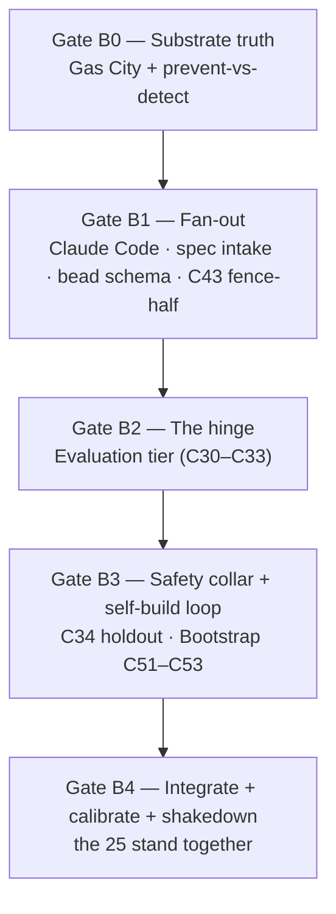

# Backbone implementation plan — building the first 25 components

**What this is.** The plan to *build* the **safe self-build backbone** — the 25 components that, once
they exist, let the factory author a spec for one of its own next pieces, build it in isolation, score
it against a trustworthy signal, and pass it through a human-reviewed go/no-go gate before it deploys
(the apex: **C53** behind the fence **C43**). It is the engineering plan that stands the factory *up*.
It honors the [build order](implementation-dependencies.md), the
[rules of the game](../../factory-discovery-charter.md#the-rules-of-the-game-hard-won-respect-these-regardless-of-which-card-you-play),
and the [8 panel amendments](_meta/next-steps/panel/VERDICT.md).

**What this is NOT.** It is *not* the plan to **exercise** the factory on real `agent-os` work — that
is the already-panel-reviewed [unified plan](_meta/next-steps/10-unified-plan.md) (its Gates 0–5), whose
horizon begins *the moment these 25 exist*. **This plan ends where that one starts.** The
[Board 1 shakedown menu](../../BOARD.md) is the play surface for the seam between them. Read the
[charter](../../factory-discovery-charter.md) for the feel and the
[methodology companion](../../methodology-and-formulas-plain-english.md) for what a *formula* is.

> **Gates, not day-counts.** Work is ordered as gates with exit criteria. Sizes are *abstract effort*
> (adopt-and-configure is low; bespoke-with-no-exemplar is high), never time estimates — and it's **one
> operator + one AI seat, serial**, so plan for getting it right, not fast.

---

## The 25 at a glance — adopt-and-configure vs build-from-scratch

The single most important planning fact: **most of the backbone is adoption, not invention.** Of the 25,
**16 are adopt-and-configure** (one Gas City install delivers eleven of them) and **9 are
build-from-scratch** custom engineering. The bar that governed the whole design: *only write custom code
where off-the-shelf genuinely can't deliver a principle-tied capability; otherwise configure what
exists* ([decisions-to-make §"the bar"](../../decisions-to-make.md)).

| Product | Components | Kind of work | Adopt / Build |
|---|---|---|---|
| **Gas City** (`gc` binary, MIT) | C01 C02 C03 C04 C05 C17 C18 C19 C23 C41 C42 | install + pin + **configure**; verify native claims | **Adopt** (×11) |
| **Claude Code** (worker) | C28 | adopt the `claude` provider preset | **Adopt** (×1) |
| **Model-floor policy** | C29 | cross-family routing policy on the stylesheet | **Build** (×1) |
| **Spec intake** | C08 C09 | spec artifact format + prompt-template binding | **Build** (×2) |
| **Bead-type schema** | C20 | the authored bead-type contract on the adopted store | **Build** (×1) |
| **Evaluation tier** (Inspect AI, MIT) | C30 C31 C32 C33 | **adopt** the harness, **author** scenarios + judge prompts | **Hybrid** (adopt-framework-then-author, ×4) |
| **The fence** | C34 C43 | holdout integrity + blast-radius boundary, over Gas City primitives | **Build** (×2) |
| **Bootstrap** | C51 C52 C53 | gene-transfusion predicate + self-build recursion + go/no-go gate | **Build** (×3) |

**The honest sub-classifications** (so "adopt" isn't oversold):
- **Sling C05** — the dispatch *mechanism* is native; a small *routing policy* is the only authored part.
- **The eval tier (C30–C33)** is a **hybrid**: the harness is adopted, but the scenarios and judge
  prompts are *authored content* and the satisfaction-distribution definition (C33) is a non-trivial
  design question, not a thin wrapper.
- **The fence's C43 boundary-typing half** needs only Gas City rig partitions (C42), so it is buildable
  the moment the substrate is up — and [D-20](#open-operator-decisions-recommended-defaults-baked-in)
  makes it mandatory *before any unattended run*. Its C34 holdout half waits on the eval tier.

---

## The build sequence (product-ordered, gates with exit criteria)

The products form their own dependency graph: **Gas City is the root**; the graph fans wide and shallow
until the **evaluation tier**, which is the hinge everything self-improving waits on. Five build gates:

*The fence's boundary-typing half (C43) is pulled into Gate B1 because it needs only Gas City (C42); its
holdout half (C34) lands in Gate B3 with the eval tier it scores against.*

### Gate B0 — Substrate truth *(the literal first move)*
- **Build.** Adopt + pin the `gc` binary; author the layered `city.toml` / `pack.toml`; turn on beads
  (`[beads] provider = "file"`), the event bus, sessions, reconciler, rigs (`[rigs]`), attribution.
  This single install + config pass stands up the **11 Gas City backbone components** (C01–C05, C17,
  C18, C19, C23, C41, C42).
- **Verify (the load-bearing action).** Run the **Gas City conformance check** (C01 AC-2): does `gc`
  *physically prevent* a forbidden cross-partition access / production-typed action, or only *detect it
  after the fact*? Confirm attribution flows into beads. This is
  [decision #4 / D-30, prevent-vs-detect](../../decisions-to-make.md#4-does-gas-city-prevent-bad-access-or-only-notice-it-after-the-fact).
- **Exit.** A one-page **"substrate-truth" note** recording prevent-or-detect per probe. *If detect-only,
  unattended operation is **blocked** until prevention exists (AM-3) — the backbone still gets built, but
  Gate B4 carries that constraint forward.* No component is stacked on an unverified substrate.

### Gate B1 — Execution, intake, and store (the wide, shallow fan-out)
Once Gas City is up, eight things depend only on it and can all start (serialized on one seat):
- **Adopt Claude Code (C28)** — the `claude` provider preset Gas City drives as a worker.
- **Build model-floor policy (C29)** — the cost/family routing on the model stylesheet. *Early default:
  `cross_family_required: false` (advisory) — so the judge in Gate B2 may be same-family for now; trust
  its verdicts with extra caution until Gate B4 calibration.*
- **Build spec intake (C08 → C09)** — the version-controlled spec artifact and its prompt-template
  binding (the core chain).
- **Build the bead-type schema (C20)** — freeze the interface first (a bead is
  `{id, type, created_by, edges, state}`; C20 supplies the legal types), then author the contract on
  Gas City's adopted bead store (C19).
- **Pull the fence forward (C43 boundary-typing half)** — deterministic blast-radius typing over rig
  partitions (C42). Per D-20 it is mandatory before any unattended run, and it needs nothing but Gas
  City, so there is no reason to defer it.
- **Exit.** Spec intake round-trips a toy spec → prompt; the bead schema validates a typed bead; the
  fence types a sample action's blast radius. (These are the natural targets of Board 1's
  [*Hello, formula*](../../BOARD.md#1-hello-formula--smoke-toy) smoke-toy.)

### Gate B2 — The evaluation tier (the hinge — slow down here)
- **Build (adopt-framework-then-author).** Adopt Inspect AI; author the scenario store/DSL (C30), wire
  the runner (C31), author the judge prompts (C32), and design the satisfaction aggregation (C33). C33's
  satisfaction-distribution definition is the most-depended-on node in the back half — *get it right, not
  fast.*
- **Design (not yet populate) the judge-calibration harness (AM-1).** Per the split: design the
  all-five-corners (`judge/spec/scenario/system/none`) labelled-sample machinery *now*; **populate it
  after the first build** when real `system`/`scenario` trajectories exist (seed the missing corners with
  synthetic/fixture trajectories). Gate on a **statistical upper bound** on the false-green rate with a
  **per-corner minimum sample size**, ≥2 human labellers + inter-rater check — not a point estimate.
- **Exit.** The eval tier runs end-to-end on a trivial known-good / known-bad (Board 1's
  [*Does the judge speak?*](../../BOARD.md#2-does-the-judge-speak--smoke-toy)). The judge is **wired but
  not yet trusted** — its verdict is advisory until Gate B4 calibration clears a stated bar.

### Gate B3 — Safety collar + the self-build loop (parallel, both gated on B2)
- **Build the fence's holdout half (C34) (AM-2).** Holdout integrity that covers the **write path** — a
  worker weakening a spec/scenario until its own output passes — not just reads
  ([C34](spec/C34-holdout-integrity.md)). Held-out scenarios authored in an **independent rig/role**, not
  solely from a component's own acceptance criteria. *If Gate B0 found detect-only, C34 detects + audits
  rather than prevents at tool-call time — a known limit until twins (C44, deferred) ship.*
- **Build the bootstrap loop (C51 → C52 → C53).** The gene-transfusion predicate (C51), the self-build
  recursion + **internal human design-review gate** (C52), and the go/no-go milestone (C53). C53's gate
  is **four conjunctive terms**: 100% holdout floor ∧ `tri_alignment = aligned` ∧ human-approve ∧
  **post-deploy factory-integrity + rollback** (Term 4). **Stand up a real Term-4 integrity-check +
  rollback harness (AM-4)** — on a self-modifying system, Term 4 is paper without it.
- **Exit.** The bootstrap loop can *attempt* a self-build behind the fence, with the C53 gate wired and
  all four terms checkable (calibration of the instrument still pending Gate B4).

### Gate B4 — Integrate, calibrate, and shake down (the three rings close)
- **Close the rings.** Confirm the **runnable** run-flow the strict dependency graph misses — sling
  (C05), prompt binding (C09), reconciler (C18) — actually dispatches an agent against a spec; then the
  **safe** collar (C34 holdout + C41 attribution + C23 audit bus) is live.
- **Run the on-ramp** (the one ordered bit, from
  [next-steps Part 1](../../next-steps-plain-english.md#part-1--the-one-ordered-bit-a-short-on-ramp-to-trust-your-instruments)):
  (1) substrate-truth recorded (B0); (2) **populate + run judge calibration** to a stated false-green
  bar; (3) **lock the test vault** (holdout read + write paths verified).
- **Shakedown.** Prove the 25 work *together* on the lowest-blast-radius real thing — a **design-only**
  target (`agent-os` B22, zero upstream deps) through `spec → build → judge → satisfaction` — before
  asking the factory to write code. This is the integration goal of [Board 1](../../BOARD.md).
- **Exit (the handoff to exercising).** The 25 stand together; the substrate-truth note, the judge
  false-green rate, and the holdout verdict are recorded; the fence is up. **The factory is now ready for
  its first real self-build through C53** — which is [unified-plan Gate 3](_meta/next-steps/10-unified-plan.md#gate-3--the-first-real-code-self-build-b12-through-c53-honestly-gated-cost-measured).

---

## The rules of the game, mapped to where the build enforces them

These are [hard-won and not up for re-litigation](../../factory-discovery-charter.md#the-rules-of-the-game-hard-won-respect-these-regardless-of-which-card-you-play):

| Rule | Enforced at |
|---|---|
| Verify the substrate before trusting it (prevent vs detect) | **Gate B0** — the conformance check is move #1 |
| Calibrate the measuring instruments before believing them | **Gate B2** (design) → **Gate B4** (populate + run); judge advisory until the bar clears |
| Lock the test vault — including the **write** path | **Gate B3** (C34, AM-2) → verified in **Gate B4** |
| The triangle finds defects; the judge *diagnoses*, not scores | **Gate B2** judge prompts; the [triangle invariant](../../docs/adr/0069-spec-scenarios-system-triangle-evaluation-invariant.md) |
| One operator, one AI seat, serial ("rigs" = config partitioning, not compute) | **All gates** — see [single-seat reality](#single-seat-serial-reality--sizing) |
| Architecture specs aren't buildable specs (human-led spec-completion pass) | the **C08/C11 intake**; binding when exercising begins (AM-5) |
| The factory is unproven by construction — say so | stated in every gate's exit note |

---

## The 8 panel amendments, mapped to where this plan honors them

| Amendment | Honored in this build plan |
|---|---|
| **AM-1** judge calibration buildable + statistically honest + independent | Gate B2 designs it (split: design-now / populate-after-first-build); Gate B4 runs it to a statistical false-green bound with per-corner min-N, ≥2 labellers, cross-family-where-possible |
| **AM-2** holdout integrity first, cover the write path | Gate B3 builds C34 over reads **and** writes; independent-role scenario authoring; verified Gate B4 |
| **AM-3** honor the binding fence rule (D-30) | Gate B0 records prevent-vs-detect; detect-only ⇒ unattended **blocked**, carried into Gate B4 |
| **AM-4** real Term-4 integrity + rollback harness | Gate B3 — an explicit exit of the C53 gate, not a paper term |
| **AM-5** the spec-completion pass is the real recursion seam | named here as a **rule of the game**; binding when exercising starts (it's an input-quality gate, not a backbone component) |
| **AM-6** named, license-cleared transfusion exemplar | a precondition of the **first self-build** (unified-plan Gate 3), surfaced here so it isn't discovered late |
| **AM-7** right-size to one operator + one Max seat | the single-seat reality section; rigs serialize; cost back-of-envelope at Gate B0 |
| **AM-8** legible + decision-forward for the operator | the [open operator decisions](#open-operator-decisions-recommended-defaults-baked-in) section, with recommended defaults |

---

## Per-product "done" definitions

What it means for each product to be **built** (sweep-1 acceptance; deeper schema/CI is sweep-2):

1. **Gas City** *(adopt+configure)* — `gc` pinned and installed; `city.toml`/`pack.toml` authored; the
   conformance check run with prevent-vs-detect recorded per probe; attribution visibly stamps beads.
   *Done = the substrate-truth note exists and the 11 native claims are facts, not claims.*
2. **Claude Code (C28) + model-floor (C29)** *(adopt + build)* — a `claude` worker rig dispatches; the
   routing policy applies cost/family rules (cross-family advisory early). *Done = a worker runs one
   agent step under the policy.*
3. **Spec intake (C08, C09)** *(build)* — a spec artifact validates against the format and binds to a
   named prompt template. *Done = a toy spec round-trips spec → prompt.*
4. **Bead-type schema (C20)** *(build)* — the interface is frozen and the legal bead types are authored;
   a typed bead validates. *Done = the schema accepts a valid bead and rejects an ill-typed one.*
5. **Evaluation tier (C30–C33)** *(adopt-framework + author)* — a scenario runs (C31) against a built
   thing (C30), the judge emits a diagnostic `root_cause` (C32), satisfaction aggregates (C33). *Done =
   a verdict on a known-good and a known-bad; the calibration harness is **designed**.*
6. **The fence (C34, C43)** *(build)* — C43 types blast radius and refuses dangerous combinations; C34
   refuses/audits both reads and writes of the holdout. *Done = a leak probe (read **and** write) is
   refused-or-audited, and a production-typed action is blocked per the D-20 default.*
7. **Bootstrap (C51, C52, C53)** *(build)* — the transfusion predicate evaluates an exemplar; the
   recursion runs behind the human design-review gate; the C53 gate checks all four conjunctive terms
   incl. Term-4 rollback. *Done = the loop can attempt a self-build and the gate emits a `go`/`no_go`.*

---

## Single-seat-serial reality + sizing

- **Rigs serialize.** "Multiple rigs" (C42) is **config partitioning, not added compute**; on one Max
  seat the work runs one-at-a-time. Do the **token cost back-of-envelope at Gate B0** (judge runs are
  multiplicative), so later fan-out width is governed by a measured number, not ambition (AM-7).
- **Effort, not time.** Adopt-and-configure products (Gas City, Claude Code, Inspect AI harness) are
  **low** effort — the work is config + verification. The genuinely-from-scratch engineering lives in a
  small set: **spec intake, the bead-type schema, the fence, and the bootstrap mechanism** — the
  bootstrap loop (C51–C53) is the highest-effort, no-clean-exemplar piece and deserves the most care.
- **The hinge is the long pole within the custom work.** The judge harness (C32) and satisfaction (C33)
  gate the entire back half — protect them.

---

## Open operator decisions (recommended defaults baked in)

Per AM-8, these are surfaced with recommended defaults from
[decisions-to-make.md](../../decisions-to-make.md). The plan assumes the recommended default; flip one
and the noted gate adjusts.

| # | Decision | Default this plan assumes | Flip it ⇒ |
|---|---|---|---|
| **D-20 / #1** | Fence before unattended, or after? | **Pull the C43 fence-half forward to Gate B1** (split fence from twins) | leave both late ⇒ accept an exposure window on a self-modifying system |
| **#4** | Does Gas City prevent, or only detect? | **Run the reality check at Gate B0**; if detect-only, unattended is blocked (AM-3) | a "prevent" result relaxes the Gate B4 audit-gate requirement |
| **Calibration bar + sample size** (`[PROPOSED]`) | a **coarse, time-boxed** false-green bar with a small fixed per-corner N, set at Gate B4 | a stricter bar buys more trust at more labelling cost |
| **#6** | Secrets storage + one library's license | **defer secrets to the first real credential; pin a clearly-open license** | bring secrets handling forward if an early component needs a credential |

*These are the operator's to set. The plan does not block on them — it carries the recommended default
and names the gate each one touches.*

---

## The seam to the next phase

This plan's terminal exit (**Gate B4**) is the same state the
[unified plan](_meta/next-steps/10-unified-plan.md) assumes as its starting line: the 25 stand together,
the instruments are calibrated to a stated bar, and the fence is up. From there, **exercising** begins —
drive one trustworthy `agent-os` nail through C53 (unified-plan Gate 3), then widen only behind the
fence (Gate 5) — and the [Board 1 cards](../../BOARD.md) are how the operator shops that work by mood.
**Building the backbone and exercising it are two plans that meet at one gate.**

---

## The operator instrument — built alongside (not one of the 25)

One artifact rides *next to* this plan rather than inside it: the **Gascity progress-tracker TUI**, the
terminal viewer the operator watches the factory with (bead flow through sessions, bead contents, commit
diffs, formulas). It is deliberately **not a 26th backbone component** — nothing in the dependency graph
depends on it, and folding it into the 25 would distort the coverage map. Instead it is an **operator
instrument**, in the spirit of the on-ramp's *"trust your instruments before you trust the result"*: it
is the **next thing built once the substrate (Gate B0) is up**, and it **grows as each backbone
component lands** (each new capability is a new thing to watch). Its build, chunk ladder, repo
discipline, and ship-in-the-city-image approach live in the
[progress-tracker TUI instrument plan](tui-operator-instrument-plan.md); it tracks
[idea-pipeline issue #21](https://github.com/lago-morph/idea-pipeline/issues/21) and is seeded by
[Board 1 Card 8](../../BOARD.md#8-bead-tui-viewer--toy--dual-use-your-request).

---

*Companions: the [build order](implementation-dependencies.md) (the dependency source of truth, the 7
products, the three rings), the [charter](../../factory-discovery-charter.md) (why & how), the
[panel verdict](_meta/next-steps/panel/VERDICT.md) (the 8 amendments), the
[unified plan](_meta/next-steps/10-unified-plan.md) (the exercising phase this hands off to), and
[Board 1](../../BOARD.md) (the play menu at the seam). A living plan — it adjusts as the conformance
check and calibration turn assumptions into facts.*
