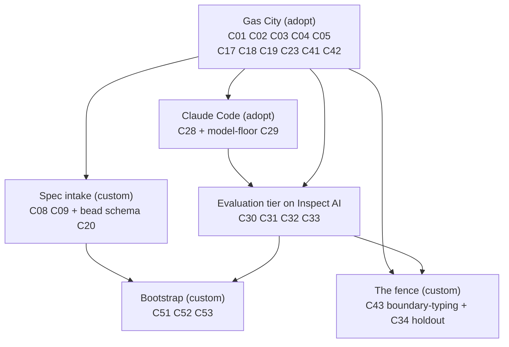
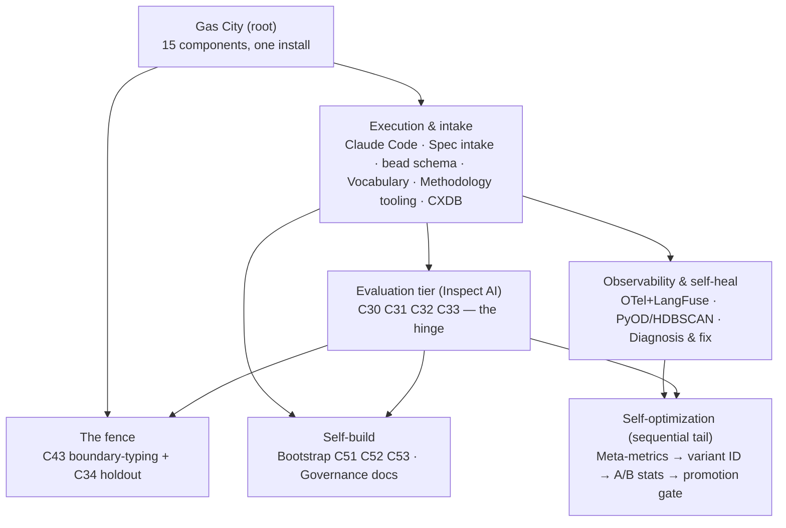
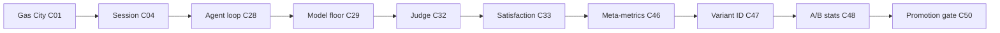

# Implementation dependencies — an implementer's build order for v4

**What this is.** A build order for the 57 v4 components, organized by the **product** each one belongs to. A *product* is the unit you build, test, and integrate as a whole: either an **external off-the-shelf product** you adopt and configure (one Gas City install brings up fifteen components at once), or an **internal custom product** — a cohesive cluster of original engineering, sometimes a single component. Every dependency stated here is taken directly from the "Depends on" column of the [component inventory](./_meta/component-inventory.md); this document adds no ordering the inventory doesn't require and invents no edge it doesn't list (the two functional run-flow edges that the strict graph misses are called out explicitly where they appear).

**Why products, not build-phases.** Most of v4's substrate is software that already exists. The work of "building C01, C18, C19, C23, C41, C42 …" is, in reality, *installing and configuring one binary*. Organizing the build by the product being adopted keeps that natural clustering visible: you see at a glance that a dozen "components" are one install, and that the real engineering cost lives in a much smaller set of custom products. Within each product the components carry their own dependency edges, and the [build order across products](#build-order-across-products) section threads those edges into a single schedule.

**Two kinds of product, two kinds of work.**

- **External products — adopt and configure.** Install, pin, and configure something someone else wrote. The "components" it delivers are facets of one binary or one library; there is no separate artifact to build. *Kinds of work:* `adopt + configure` (turn it on with config), `adopt + integrate` (write a thin bridge to it), `adopt + compose` (assemble a few libraries to a standard recipe), `adopt framework then author` (the harness is theirs, the content is yours).
- **Internal products — build from scratch.** Original engineering that doesn't come in a box. Clustered into units that make sense to build, test, and integrate together — the eval-tier authoring, the spec intake, the fence, the bootstrap mechanism. Some internal products are a single component. *Kind of work:* `build from scratch` (gene-transfused from an external exemplar wherever one exists), or `transfuse per service` for the digital twins.

**The soft rule on parallelism.** Where two components in the same product (or two products at the same depth) have no dependency edge between them, they are genuinely independent — build them in parallel. The widest the graph ever gets is thirteen mutually-independent components; the deepest chain is ten.

---

## The backbone: the most aggressive path to *safe* self-building

The single most important question for planning is: *what is the shortest path to the point where the factory can safely build itself?* The backbone answers it.

**The target.** The first moment the factory can **author a spec for one of its own next components, build it in isolation, have that build scored by a trustworthy satisfaction signal, and pass it through a human-reviewed go/no-go gate before it deploys.** In component terms the apex is the **bootstrap-validation milestone (C53)** — "first factory-built component passes review and deploys" — standing behind the **isolation fence (C43)**. Everything those two transitively need, plus the bits required to actually *run* a build and to make that run *safe*, is the backbone. Build this vertical slice as aggressively as staffing allows; defer all the breadth (extra linters, full observability, twin fidelity, self-optimization) until the slice closes.

### The backbone is six products, not twenty-five components

The backbone is **25 components**, but you do **not** build 25 things in sequence. They belong to **six products**, and the single largest — **adopting and configuring Gas City — brings up eleven of the twenty-five at once**, because they are facets of the same installed binary (see [the Gas City product](#gas-city--gc-binary-mit) below).

*Caption: the backbone in six products. Gas City is one workstream that delivers eleven backbone components together; the rest are genuinely separate engineering. The fence sits **below** the evaluation tier, not beside it: its holdout-integrity half (C34) scores against the eval harness (C30/C32), so it cannot start until that tier exists; only its boundary-typing half (C43) can be pulled forward right after Gas City. The fence and bootstrap are the two parallel preconditions for the first *safe* self-build. Depth is ~5 product-levels within the backbone, not 25 steps.*

| Product | Backbone components | What it is | Built as one unit because |
|---|---|---|---|
| **Gas City** (adopt) | C01, C02, C03, C04, C05, C17, C18, C19, C23, C41, C42 | Install + pin the `gc` binary; write `city.toml`/`pack.toml`; verify its native claims | They all ship *inside* one binary; the install + config turns them on at once. One workstream, not eleven builds. |
| **Claude Code** (adopt) + **model-floor** (custom) | C28, C29 | Claude Code as the worker (a separate dependency Gas City *drives*) + the cost/family routing policy authored on top of it | Standing up the `claude` provider preset is adoption; the routing policy (C29) is the one authored piece. |
| **Spec intake** (custom) | C08, C09, C20 | A version-controlled spec artifact (C08), its prompt-template binding (C09), and the bead-type schema (C20) the bootstrap predicate reads | The format, its execution binding, and the bead types it produces are co-designed. |
| **Evaluation tier on Inspect AI** (adopt framework, then author) | C30, C31, C32, C33 | Author scenarios in an isolated rig (C30), **run** them (C31), **judge** the trajectory (C32), **aggregate** satisfaction (C33) | This is the hinge of the whole build; the scenarios and judge prompts are authored together on one harness. |
| **The fence** (custom) | C34, C43 (boundary-typing half) | Holdout integrity (C34) + the lethal-trifecta blast-radius boundary that must be up before any unattended run | Both are safety policy composed over Gas City process boundaries, rig partitions (C42), and filesystem permissions. |
| **Bootstrap** (custom) | C51, C52, C53 | Gene-transfusion predicate (C51), the self-bootstrap recursion + human design-review gate (C52), the go/no-go milestone (C53) | The recursion and its acceptance gate are one mechanism. |

**Product order.** `Gas City` → (in parallel) `Claude Code`, `Spec intake`, and the bead schema → `Evaluation tier` → `the fence` and `Bootstrap` (parallel, both gated on the eval tier). The one piece that can be pulled all the way forward is the fence's **boundary-typing half** (C43): it needs only rig partitioning (C42), so it can be built right after Gas City; only the fence's **holdout-integrity half** (C34) waits on the eval tier. Gas City is the long pole *within* the backbone — and its own long pole is the **Gas City conformance check**: nobody has yet run `gc` end-to-end against v4's "native" claims, so the very first practical action is to verify the substrate before anything is stacked on it.

### Three rings: possible, runnable, *safe*

The 25 build up in three honest rings, so you can see exactly what each layer buys:

1. **Dependency closure of the two apexes — 19 components.** Start from the transitive closure of {C53, C43} over the inventory's "Depends on" column, then make two deliberate adjustments: **add the scenario runner C31** and **drop the twin-isolation dependency C44**. The result is C01, C02, C03, C04, C08, C17, C19, C20, C28, C29, **C30, C31, C32, C33** (the eval tier), C42, C43, C51, C52, C53. Each adjustment has a reason:
   - **C31 is added, because a build must be *run* to be scored.** The eval tier is a *store* (C30) and a *scorer* (C32) with an *executor* between them: the held-out scenario must be **run** against the freshly built component to produce the trajectory the judge scores. C53's milestone is "scenario set (C30) **run (C31)** + judged (C32) → satisfaction (C33)" (C53 §AC-9). The strict closure of C53 alone does not transit C31, so it is added on this functional ground.
   - **C44 is dropped, because the fence enters via its boundary-typing half only.** The inventory lists `C43 → C42, C44`. The **boundary-typing half** — deterministic blast-radius typing — needs only rig partitioning (C42), and [decision D-20](../../decisions-to-make.md) (the operator ruling that pulls the boundary-typing fence forward as a precondition before any unattended run) makes *that* half the precondition. The **twin-isolation half** (rehearsing against digital twins, C44) is deferred until the factory builds itself and is *not* needed for the first human-reviewed self-build. So C44 is out of the backbone and C43 enters via its C42-only half.
2. **+ Run-flow → 22 components.** The dependency column records what each component's *spec* needs, not what it takes to *run a build*. C52 says the factory "authors a spec … **runs** … human-reviews" — and running a build means dispatching an agent against a spec. That pulls in **C05 (sling/dispatch), C09 (prompt-template binding), C18 (reconciler)** — functionally required, but no inventory edge from C52/C53 names them. A real gap the strict closure misses.
3. **+ Safety collar → 25 components.** What separates *possible* from *safe*: **C34 holdout integrity** (without it the satisfaction score the C53 gate trusts can be gamed — the highest-*likelihood* failure in the corpus), **C41 identity/attribution** (every self-build action attributed before you trust the loop), and **C23 event bus** (the append-only audit source C41 writes through).

So: **runnable build = 22 components; safe self-build = 25.** Of those 25, eleven are the single Gas City adoption, two more are one Claude Code adoption plus its routing policy, and four are authored on the Inspect AI harness — the genuinely from-scratch engineering is the spec intake, the fence, and the bootstrap mechanism.

---

## The products

This is the spine of the build. Each row is one product and the components it delivers. **Bold** component IDs are in the 25-component backbone. "Depends on (products)" names which products must be adopted or built first; the per-component edges live in each product's subsection below.

### External products — adopt and configure

| Product (license) | Components delivered | Kind of work | Depends on (products) |
|---|---|---|---|
| **Gas City** — `gc` binary (MIT) | **C01** substrate, **C02** pack ABI, **C03** config, **C04** sessions, **C05** sling, C06 messaging, C12 formula engine, C13 molecule, **C17** tool-node, **C18** reconciler, **C19** bead store, **C23** event bus, C40 durable Orders, **C41** attribution, **C42** rigs | adopt + configure | — (the root) |
| **Claude Code** under Max (Anthropic ToS) | **C28** agent loop, **C25** OTLP export (native flag) | adopt + configure | Gas City (it drives Claude Code as a worker) |
| **CXDB** — `strongdm/cxdb` (Apache-2.0) | C21 trajectory store, C22 type registry (+ the O(1)-branch primitive the C49 driver uses) | adopt + integrate; the bridge to it (C24) is its own internal product | Gas City |
| **Inspect AI** (MIT) | **C30** scenario store/DSL, **C31** runner, **C32** judge scorer, **C33** score reduction | adopt framework, then author | Gas City (a pack wraps Inspect AI); Claude Code (judge model) |
| **OpenTelemetry Collector** (Apache-2.0) + **LangFuse** (MIT) | C26 collector, C27 trace store/browser | adopt + configure | Claude Code (OTLP source, C25) |
| **PyOD/Anomalib** (BSD-2/Apache-2.0) + **sentence-transformers** (Apache-2.0) + **HDBSCAN/scikit-learn** (BSD) | C36 anomaly detection, C37 trajectory clustering | adopt + compose (standard recipe) | CXDB (trajectory store + bridge) |
| **MLflow/Aim** (Apache-2.0; or **W&B**, freemium) | the tracking-store half of C46 meta-metrics (the *definitions* are custom) | adopt + compose | Inspect AI (satisfaction, C33), CXDB, Claude Code (C25) |
| **DSPy/Optuna/Ray Tune** (MIT/Apache-2.0) + **Unleash/GrowthBook** (Apache-2.0/MIT) + **scipy/Evidently** (BSD/Apache-2.0) | C47 variant identification, C48 A/B routing + statistics | adopt + compose | Meta-metric stream (C46) |

### Internal products — build from scratch

| Product | Components delivered | Kind of work | Depends on (products) |
|---|---|---|---|
| **Vocabulary & glossary** | C07 | build from scratch (registry + doc) | Gas City |
| **Spec intake** | **C08** spec format, **C09** prompt binding, C10 EARS linter, C11 intent crucible | build from scratch (on Gas City's template engine) | Gas City |
| **Bead-type schema** | **C20** bead types | build from scratch (the authored contract on the adopted bead store) | Gas City (bead store, C19) |
| **Methodology tooling** | C14 DOT translator, C15 workflow linter (transfused from Mammoth), C16 discipline linter | build from scratch | Gas City (formula engine, C12) |
| **Model-floor policy** | **C29** | build from scratch (policy on the Claude Code stylesheet) | Claude Code |
| **CXDB bridge** | C24 telemetry → CXDB bridge | build from scratch (small standalone tool-node binary) | CXDB, Claude Code |
| **Override → rule loop** | C35 | build from scratch (on Claude Code hooks + `override` beads) | Claude Code, Bead-type schema, Inspect AI (scenario store) |
| **The fence** | **C34** holdout integrity, **C43** isolation boundary | build from scratch (policy over Gas City process boundaries, rig partitions C42, and filesystem permissions) | Gas City (rigs, C42), Inspect AI (C30/C32), Digital twins (C44, twin-isolation half only) |
| **Self-heal diagnosis & fix** | C38 diagnosis agent (transfused from Tracker), C39 fix-task loop closure | build from scratch | PyOD/HDBSCAN (clustering, C37), CXDB, Spec intake, Bead-type schema |
| **Digital twins & fidelity** | C44 per-service twin (LocalStack pattern), C45 fidelity bar (on Pact, MIT) | transfuse per service | Gas City (tool-node, C17), Inspect AI (scenario store, C30) |
| **Meta-metric stream** | C46 (definitions; storage is the MLflow product) | build from scratch | Inspect AI (satisfaction, C33), CXDB, Claude Code (C25) |
| **Counterfactual replay** | C49 driver | build from scratch (drives CXDB's O(1) branching — the riskiest invention leaf) | CXDB |
| **Promotion gate** | C50 | build from scratch (Gas City formula + statistical gate) | DSPy/scipy product (C48), Gas City (formula, C12) |
| **Bootstrap** | **C51** gene-transfusion predicate, **C52** self-bootstrap recursion, **C53** validation gate | build from scratch | Spec intake (C08), Bead-type schema (C20), Evaluation tier (C33) |
| **Governance documents** | C54 phase plan, C56 autonomy ladder, C57 failure-mode register | build from scratch (authored ledgers) | Bootstrap (C52), the fence (C43) |
| **Methodology experiment** | C55 methodology-as-config | build from scratch (v3 candidates as swappable formula files) | Gas City (formula, C12), Inspect AI (C30), Evaluation tier (C33) |

A note on adoption discipline: **Mammoth (MIT)** and **Tracker** and **LocalStack** and **Pact** appear as *transfusion exemplars*, not adopted runtimes. The workflow linter (C15), the diagnosis agent (C38), the twins (C44), and the fidelity bar (C45) are built from scratch with one of those as the pattern to copy — they are internal products, not external adoptions.

### Gas City — `gc` binary (MIT)

The single biggest adoption. One install and one config pass discharge **fifteen** components; **eleven** of those fifteen are in the backbone (C01, C02, C03, C04, C05, C17, C18, C19, C23, C41, C42). That is why "install and configure Gas City" is *one* task, not fifteen tickets.

| Component | Needs | What configuring it means |
|---|---|---|
| The substrate (C01) | C03, C04 (load-time contract; see [cycles](#two-cycles-broken-by-an-interface-freeze)) | Download, pin, install the `gc` binary; run its conformance check. |
| The pack and tool-node interface (C02) | C01 | Write `pack.toml`; the subprocess tool-node protocol ships native. |
| Config and feature flags (C03) | C01 | Author the layered `city.toml` — section presence = a capability turned on. |
| The session and provider runtime (C04) | C01 | Declare `[[agent]] provider = "claude"`. |
| Sling / dispatch (C05) | C01, C18 | The dispatch *mechanism* is native; the small *routing policy* is the only authored part. |
| Messaging — Mail and Nudge (C06) | C04 | Mail durable, Nudge ephemeral — both native. |
| The formula / pipeline engine (C12) | C01, C03 | Gas City formulas (TOML) — native; the linters on top are a separate product. |
| The molecule / runtime state (C13) | C12, C18 | Instantiated bead-tree — native runtime state, no custom store. |
| The tool-node abstraction (C17) | C02 | Native tool beads. |
| The reconciler / health patrol (C18) | C01 | The convergence loop is on as soon as the runtime is. |
| The bead work-graph (C19) | C01 | Set `[beads] provider = "file"`; the store turns on with the backend line. |
| The event bus (C23) | C01 | Native append-only persistence; configuring beads lights it up. |
| Durable Orders (C40) | C23 | Native Orders (Temporal is a deferred, unbuilt fallback, not in scope). |
| Identity and attribution (C41) | C01, C19, C23 | Every bead and event is stamped `created_by` natively — the strongest principle match in the corpus. |
| Rig partitioning (C42) | C04 | A native config section (`[rigs]`). |

**Why a dozen capabilities are one install — and why they are still separate components.** The bead store is not bolted onto a beadless Gas City; it ships *inside* the single `gc` binary, and the smallest install already turns it on (`[beads] provider = "file"`). The same is true of the event bus, the layered config, provider-backed sessions, the reconciler, dispatch, native attribution, the rig partitions, and the formula/molecule engine. They are nonetheless *separate components* because **a component here is a unit of spec and verification, not a separately deployable box.** C01's job is narrow: adopt, pin, install, and *verify* the binary. It states *that* Gas City provides beads and defers the *contract* — which bead types exist, what fields they carry, how the schema is enforced — to the bead-type schema product (C19/C20). The edge "C19 depends on C01" means *the bead-schema contract can't be frozen until the substrate it lives in is pinned*, not "Gas City boots beadless and beads are added later." Splitting the runtime capability from its written contract-of-record is what lets fifteen native capabilities be one install yet each get its own verification gate.

**The whole product rests on the conformance check.** Every "Gas City native" claim above is *a claim to verify against a pinned `gc`, not yet a verified fact*. No one has run `gc` end-to-end against v4's native claims; the C01 conformance check (AC-2) is the gate that turns these claims into facts, and it is the literal first practical step of the entire build.

#### Two cycles, broken by an interface freeze

The inventory's literal edges contain exactly two dependency cycles, both touching C01: **C01 ↔ C03** and **C01 ↔ C04** (C01 lists C03/C04 as deps; each lists C01 back). These are not build-order cycles — C01↔C03 is a load-time contract call, and C04 is a configured facet of the same binary — so the build treats **C01 as the root** and the conformance check verifies the substrate first.

The bead store (C19) and its schema (C20) are often described as a third cycle, but in the literal inventory it is one-directional (C20 → C19 only): the two are *conceptually* mutually defining, and that is resolved by an **interface freeze** — the contract (a bead is `{id, type, created_by, edges, state}`; C20 supplies the legal types) is fixed *before* either is built.

### Claude Code under Max (Anthropic ToS) + model-floor policy

| Component | Needs | Notes |
|---|---|---|
| The Claude Code agent loop (C28) | C04 | Adopt the `claude` provider preset; Gas City drives it as a worker. |
| OTLP telemetry export (C25) | C28 | A native Claude Code flag plus the env vars that activate it — the seed of the whole observability chain. |
| Model floor and stylesheet routing (C29) | C28 | *Internal product.* Custom cross-family enforcement policy on the model stylesheet (Fabro CSS-stylesheet is the transfusion exemplar). |

### CXDB (`strongdm/cxdb`, Apache-2.0) + the bridge

| Component | Needs | Notes |
|---|---|---|
| The trajectory store (C21) | C01 | Adopt the mature upstream OSS store. |
| The CXDB type registry (C22) | C21 | Rides on the same adoption. |
| The telemetry-to-CXDB bridge (C24) | C21, C28 | *Internal product.* A small standalone tool-node binary you write (transfused from Kilroy + Gas City `internal/sessionlog`). |

CXDB also provides the **O(1) branching primitive** that the counterfactual-replay driver (C49) is built on — the primitive is adopted, the driver is the invention.

### Inspect AI (MIT) — the evaluation tier

The harness is adopted; the scenarios and judge prompts are authored on it. This tier is the hinge of the whole build — satisfaction (C33) gates the entire back half.

| Component | Needs | Notes |
|---|---|---|
| The scenario store / DSL (C30) | C17, C42 | Inspect AI Task DSL; the scenarios are authored. |
| The scenario runner (C31) | C30, C17 | Inspect AI runner — runs a scenario against a built component to produce a trajectory. |
| The judge harness (C32) | C30, C29 | Inspect AI scorer; the judge prompts are authored. |
| Satisfaction aggregation (C33) | C32, C19 | Inspect AI score reduction + a small custom aggregator tool-node. The most-depended-on node in the back half. |

### Observability, self-heal, and self-optimization products

These complete the breadth the backbone defers. The **self-heal** capability spans two products (adopted anomaly/clustering + custom diagnosis/fix); the **self-optimization** capability spans three (adopted variant/A-B + three custom pieces) and is the genuinely sequential tail of the whole build.

| Product | Component | Needs |
|---|---|---|
| OTel Collector + LangFuse (adopt) | The OpenTelemetry Collector (C26) | C25 |
| OTel Collector + LangFuse (adopt) | The LangFuse trace store and browser (C27) | C26 |
| PyOD/HDBSCAN (adopt) | Anomaly detection (C36) | C24, C21 |
| PyOD/HDBSCAN (adopt) | Trajectory clustering (C37) | C21 |
| Self-heal diagnosis & fix (custom) | The diagnosis agent / Healer (C38) | C37, C21 |
| Self-heal diagnosis & fix (custom) | The fix-task loop closure (C39) | C38, C20, C08 |
| Meta-metric stream (custom + MLflow) | The meta-metric stream (C46) | C33, C21, C25 |
| DSPy/Unleash/scipy (adopt) | Variant identification (C47) | C46 |
| DSPy/Unleash/scipy (adopt) | A/B routing and statistical comparison (C48) | C47, C46 |
| Counterfactual replay (custom) | Counterfactual replay driver (C49) | C21 |
| Promotion gate (custom) | The promotion gate (C50) | C48, C12 |

### The remaining custom products

| Product | Component | Needs |
|---|---|---|
| Vocabulary & glossary | The vocabulary and glossary (C07) | C01 |
| Spec intake | The spec artifact and format (C08) | C03 |
| Spec intake | Prompt template and binding (C09) | C08, C05 |
| Spec intake | The spec linter / EARS (C10) | C08 |
| Spec intake | Intent intake — the crucible (C11) | C08 |
| Bead-type schema | The bead schema registry (C20) | C19 |
| Methodology tooling | The formula-to-DOT translator (C14) | C12 |
| Methodology tooling | The workflow linter (C15) | C14 |
| Methodology tooling | The discipline linter (C16) | C12 |
| Override → rule loop | The override-to-rule loop (C35) | C28, C20, C30 |
| The fence | Holdout integrity (C34) | C30, C32 |
| The fence | The isolation / lethal-trifecta fence (C43) | C42 (boundary-typing half) — C44 for the deferred twin-isolation half |
| Digital twins & fidelity | The digital twin per service (C44) | C17 |
| Digital twins & fidelity | Twin fidelity (C45) | C44, C30 |
| Bootstrap | The gene-transfusion predicate (C51) | C08, C20 |
| Bootstrap | The self-bootstrap recursion (C52) | C51, C08 (and an internal human design-review gate) |
| Bootstrap | The bootstrap-validation gate (C53) | C52, C33 |
| Governance documents | The phase delivery plan (C54) | C52 |
| Governance documents | The autonomy ladder L0–L5 (C56) | C52 |
| Governance documents | The failure-mode coverage register (C57) | C51, C43 |
| Methodology experiment | The methodology experiment (C55) | C12, C30, C33 |

---

## Build order across products

The products form their own dependency graph. **Gas City is the root**; nothing else can be adopted or built until the substrate is pinned and conformance-checked. From there the graph fans out wide and stays shallow until the evaluation tier, which is the hinge everything self-improving waits on.

*Caption: the product-level build order. The graph is wide and shallow up to the evaluation tier; the self-optimization tail is a single sequential chain no amount of staffing can flatten. The fence draws on both Gas City (its boundary-typing half needs only rig partitions, C42) and the evaluation tier (its holdout half scores against C30/C32).*

**What runs in parallel.** Once Gas City is up, eight components depend only on it (C02, C03, C04, C07, C18, C19, C21, C23) — the execution, intake, and store products can all start at once. The breadth stays high: at its widest, thirteen mutually-independent components can be in flight together (the schema/identity/self-heal leaves and the intake/observability tooling). Throw hands at the front of the build and you reach the evaluation tier quickly.

**The critical path is ten deep.** The longest dependency chain runs:

*Caption: the dominant critical path, ten components deep. The evaluation hinge (C32 → C33) sits in the middle; the self-optimization chain hangs off it. Widening any product cannot shorten this line.*

**The fence's boundary-typing half is early and mandatory.** That half (C43) needs only Gas City's rig partitions (C42), so it is buildable as soon as the substrate is up — and decision D-20 makes it the precondition for *any* unattended operation, so there is no schedule reason to defer it. The fence's **holdout-integrity half** (C34) is not early: it scores against the evaluation tier (C30/C32) and lands with it. The **twin-isolation half** waits on the [digital-twins product](#the-remaining-custom-products) (C44) and lands once the factory is building itself.

**The tail is chain-bound, not capacity-bound.** Self-optimization (meta-metric stream → variant identification → A/B statistics → promotion gate) is genuinely sequential. Start it the moment satisfaction aggregation (C33) lands; you cannot compress it by adding people.

---

## After the backbone: the top ten to build next, by cost/benefit

The moment the backbone closes, this is the list that starts the conversation. Cost is *abstract effort*, not money; the list is sorted best-ratio first (high benefit, low effort wins). Effort is grounded in the product: an adopt-and-configure component is low; a bespoke component with no exemplar is high. All ten are drawn from the products the backbone deferred.

| # | Component (product) | Why the benefit is high | Effort | Ratio note |
|---|-----------|-------------------------|--------|------------|
| 1 | **C07 Vocabulary & glossary** (Vocabulary) | Kills undefined-term debt across all parallel work | tiny | Best ratio in the whole graph — build it *with* the backbone, not after. |
| 2 | **C25 OTLP telemetry export** (Claude Code) | First real runtime visibility; unblocks the whole observability chain | low (native flag) | The cheapest large benefit available. |
| 3 | **C10 Spec linter (EARS)** (Spec intake) | Deterministic quality gate on the load-bearing input, the spec artifact (C08) | low | Off-the-shelf INCOSE rules; cheap insurance. |
| 4 | **C11 Intent intake (9-field crucible)** (Spec intake) | Better specs at the front door, compounding over every human-iterated build | low | A transfusable shape already exists. |
| 5 | **C40 Durable Orders** (Gas City) | Crash/retry survival for long self-build runs | low (native) | Resilience for almost nothing. |
| 6 | **C56 Autonomy ladder (L0–L5)** (Governance docs) | Names the rungs toward lights-out; gives the human-in-the-loop stage a governance vocabulary | low | A scale + gates, not a build. |
| 7 | **C35 Override → pattern → rule loop** (Override loop) | Turns the human's review corrections into durable validation rules — the factory *learns* | medium | Compounding benefit; the payoff grows with use. |
| 8 | **C21 CXDB trajectory store** (CXDB) | The gateway to the entire back half — self-heal, replay, and self-optimization all read/write here | medium (integration, not invention) | Adopted upstream OSS, so the effort is integration, not research. Benefit is broad enough to still rank high. |
| 9 | **C44 Digital twin** (Digital twins) | Completes the fence's deferred half and gives a safe place to rehearse risky operations; becomes *required* to go lights-out | med-high | The most labour-intensive principle (bespoke per service, no OSS runtime) — the effort is why it's #9, not higher. |
| 10 | **C12 Formula + C13 Molecule** (Gas City) | Methodology-as-config: the build becomes a declarative, swappable workflow | medium | Turns "how we build" into something you can change without touching the substrate. |

**What this deliberately leaves for later.** The self-heal capability (CXDB bridge C24 → anomaly C36 → clustering C37 → diagnosis C38 → fix-task closure C39) is high benefit but a five-component chain across two products, so it lands once CXDB (C21/C24) exists. The self-optimization tier (meta-metrics C46 → variant ID C47 → A/B stats C48 → promotion gate C50, plus the genuinely-unsolved counterfactual-replay driver C49) is the research frontier and is correctly built last — ranking any of it in the top ten would contradict "best cost/benefit."

---

## What this means for scheduling

- **Front-load aggressively.** Adopting Gas City and standing up the execution, intake, and store products gets 35 of the 57 components in flight with high parallelism — with enough hands you reach the evaluation tier quickly.
- **Protect the hinge.** The judge harness (C32) and satisfaction aggregation (C33) — the back two-thirds of the Inspect AI product — gate the entire back half of the build. They sit on the critical path; everything self-optimizing and most of bootstrap waits on them. Slow down and get the satisfaction signal right.
- **The fence comes up before any unattended run.** Its boundary-typing half is buildable the moment Gas City's rigs (C42) exist, and decision D-20 makes it mandatory before the factory operates unattended.
- **The tail is sequential.** The self-optimization product chain (meta-metrics → variant ID → A/B stats → promotion gate) cannot be compressed by adding people; start it the instant satisfaction aggregation lands.

See also: the [component inventory](./_meta/component-inventory.md) (the dependency source of truth), the [plain-language build-order plan](../../build-order-plain-english.md) (the capability-milestone view for a non-engineer), and the [engineer's architecture guide](../../architecture-guide-for-engineers.md) (what each component is and why).
