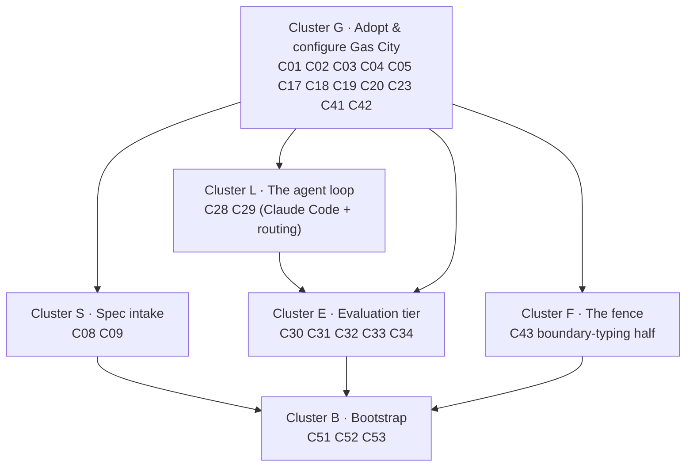
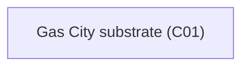
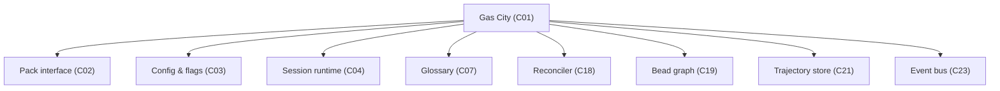
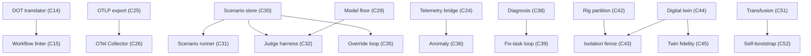
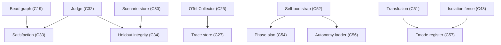
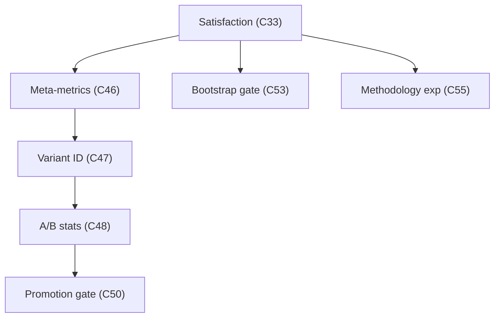

# Implementation dependencies — an implementer's build order for v4

**What this is.** A build order for the 57 v4 components, arranged so each thing is built as early as its real dependencies allow, and so the most things can be built at the same time. Every dependency here is taken directly from the "Depends on" column of the [component inventory](./_meta/component-inventory.md) — this document adds no ordering the inventory doesn't require, and invents no edge the inventory doesn't list. Where two components sit in the same phase with no arrow between them, they are genuinely independent: build them in parallel.

**How to read it.** The build is organized into **phases**. A phase is a *wave*: everything in it can start once all earlier phases are done, and — except where an arrow inside the phase says otherwise — everything in a phase is independent of everything else in it. Each component is named in plain terms with its identifier in parentheses, e.g. the Gas City substrate (C01). Each phase carries a small dependency picture and a note on how many components can be built at once.

**The soft rule.** Aim for at most ten components per phase. Two phases (3 and 4) have thirteen components that are *all* genuinely parallel; rather than invent an ordering that the dependencies don't support, each is shown as two side-by-side batches with no dependency between them — split them only if you can't staff all thirteen at once.

**Two views, and which one to read first.** This document now leads with the thing that should start every planning conversation — **the backbone: the most aggressive build order that gets the factory to the point where it can safely build itself** — followed by **the top ten components to build next, ranked by cost/benefit**. Only after that does it lay out the full breadth of all 57 components, phase by phase (the original view, unchanged below). Read the backbone first; treat the phase-by-phase section as the reference for everything the backbone defers.

---

## The backbone: the most aggressive path to *safe* self-building

This replaces the old single-line "long pole." That line was real but too thin — it ran `C01 → C02 → C17 → C30 → C32 → C33 → …` straight to the self-optimization gate and **left off components the factory genuinely cannot run without**: the session runtime (C04), dispatch (C05), the bead work-graph (C19), the agent loop (C28), and more. The backbone below is the *complete* minimum.

**The target.** The first moment the factory can **author a spec for one of its own next components, build it in isolation, have that build scored by a trustworthy satisfaction signal, and pass it through a human-reviewed go/no-go gate before it deploys.** In component terms the apex is the **bootstrap-validation milestone (C53)** — "first factory-built component passes review and deploys" — standing behind the **isolation fence (C43)**. Everything those two transitively need, plus the bits required to actually *run* a build and to make that run *safe*, is the backbone. Build this vertical slice as aggressively as staffing allows; defer all the breadth (extra linters, full observability, twin fidelity, self-optimization) until the slice closes.

### The backbone as six implementation clusters

The backbone is **25 components**, but you do **not** build 25 things one after another. They cluster into work that is naturally done *together*. The single biggest cluster is the one you flagged: **adopting and configuring Gas City lights up a dozen "components" at once**, because they are all facets of the same installed binary (see ["Why several components are really one install"](#why-several-components-are-really-one-install) below).

*Caption: the backbone in six clusters. Cluster G (the Gas City install) is one workstream that delivers ~12 native capabilities together; the rest are genuinely separate engineering. Depth is ~5 cluster-levels, not 25 steps.*

| Cluster | Components | What it is | Done together because |
|---|---|---|---|
| **G — Adopt & configure Gas City** | C01, C02, C03, C04, C05, C17, C18, C19, C20, C23, C41, C42 | Install + pin the `gc` binary, write its config, author the custom bits (bead **schema** C20, sling **routing** C05), verify its native claims | They all ship *inside* one binary; the install + `city.toml`/`pack.toml` config turns them on at once. **One workstream, not twelve builds.** |
| **L — The agent loop** | C28, C29 | Claude Code as the worker (a separate dependency Gas City *drives*) + cost/family model routing | Standing up the `claude` provider preset and its routing rules is one piece of work. |
| **S — Spec intake** | C08, C09 | Version-controlled **spec artifact (C08)** plus the **prompt-template binding (C09)** that drives execution | The format and its prompt binding are co-designed. |
| **E — Evaluation tier** | C30, C31, C32, C33, C34 | Author scenarios in an isolated rig (C30), **run** them (C31), **judge** the trajectory (C32), **aggregate** satisfaction (C33), **enforce holdout** (C34) | This is the hinge of the whole build and is co-built as one tier. |
| **F — The fence** | C43 (boundary-typing half) | The lethal-trifecta blast-radius boundary that must be up before any unattended run | Per **decision D-20**, only the boundary-typing half (needs C42) is the precondition; the twin-isolation half (C44) is deferred (see below). |
| **B — Bootstrap** | C51, C52, C53 | Gene-transfusion discipline (C51), the self-bootstrap recursion + human design review (C52), the go/no-go milestone (C53) | The recursion and its acceptance gate are one mechanism. |

**Cluster order.** `G` (with `L` in parallel) → `S` → `E` and `F` (parallel) → `B`. Cluster G is the long pole *within* the backbone — and its true long pole is the **Gas City conformance check (G11)**: nobody has yet run `gc` end-to-end against v4's "native" claims, so the very first practical action is to verify the substrate before anything is stacked on it.

### Two kinds of work: *adopt-and-configure* vs *glue logic*

The clusters split cleanly into two **kinds of implementation work**, and the kind determines whether you build the components together or one at a time:

- **Adopt-and-configure work — build it all at once.** Some "components" are satisfied entirely by *installing and configuring the substrate*. Installing Gas City, pointing the bead store at a backend (`[beads] provider = "file"`), and **defining the bead types in it** in one sitting satisfies C01, C18, C19, C20, C23, C41, C42 and more *simultaneously* — there is **no reason to build them in isolation**, because there is no separate artifact to build; the work is one install + one config pass + the G11 conformance check. This is the whole of Cluster G (plus the `claude` provider preset in Cluster L). Treat it as one task, staffed by one person/pair, not as a dozen tickets.
- **Glue-logic work — build component-by-component.** It is only when you start writing **integration code that doesn't come in the box** — the spec format and its binding (C08/C09), the Inspect-AI-wrapped eval tier (C30–C34), the boundary-typing fence (C43), the bootstrap recursion (C51–C53) — that individual components become the right unit to implement, review, and test in isolation. This is Clusters S, E, F, B (and the routing logic in L).

**Worked example — what one install-and-configure sitting actually satisfies.** "Install and configure Gas City" sounds like one task but discharges a dozen abstract components. Here is the concrete mapping, so the abstraction is grounded in the actual keystrokes:

| The concrete action you take | Components it satisfies at once | Why that action *is* the component |
|---|---|---|
| Download, pin, and install the `gc` binary; run its conformance check | **C01** | The substrate *is* the adopted binary; "building C01" means adopting + verifying it. |
| Write `pack.toml` with `[imports.core]`; the subprocess tool-node protocol is already present | **C02**, **C17** | The pack ABI and the tool-node interface ship native — you *configure* the extension surface, you don't author it. |
| Write the layered `city.toml` (`[workspace]`, `[[agent]]`, `[beads]`, …) | **C03** | The config / feature-flag model *is* that layered TOML; section-presence = a capability turned on. |
| Add `[[agent]] provider = "claude"` | **C04** | The provider-backed session runtime is the preset you just declared. |
| Set `[beads] provider = "file"` **and type in the bead types** (`override`, `fix_task`, `factory_build_in_progress`, …) | **C19**, **C20** | The bead store turns on with the backend line; the schema is the handful of types you define in it — your example exactly. |
| (nothing extra — it is automatic) every bead and event is stamped with `created_by` | **C41** | Universal attribution is native; you get it free the moment beads/events exist. |
| (nothing extra) the append-only event log begins recording | **C23** | The event bus is native persistence; configuring beads lights it up too. |
| (nothing extra) the reconciler / health-patrol tick runs | **C18** | The convergence loop is native; it is on as soon as the runtime is. |
| Add the `sling` routing rules to config | **C05** | The dispatch *mechanism* is native; the small *routing policy* is the only custom part. |
| Add the `[rigs]` section | **C42** | Rig/role partitioning is a native config section. |

Read the right-hand column: most rows are "configure" or even "nothing extra — it is automatic," and only two rows (the bead **types** in C20, the **routing rules** in C05) involve authoring anything at all. *That* is the differentiator — this dozen abstract components is one install-and-configure sitting, whereas a glue-logic component like the judge harness (C32) or the gene-transfusion predicate (C51) is a genuine build with its own code, tests, and review.

The line between the two is exactly the split the [engineer's architecture guide](../../architecture-guide-for-engineers.md) itself draws: *most of the substrate is solved-by-others and merely adopted; the original engineering is the methodology glue on top.* The backbone's effort is therefore far smaller than "25 components" suggests — roughly **one adopt-and-configure workstream plus four glue-logic clusters' worth of real building** (spec intake, the eval tier, the fence, and the bootstrap mechanism).

### Three rings: possible, runnable, *safe*

The 25 are built up in three honest rings, so you can see exactly what each layer buys:

1. **Bare dependency closure of {C53, C43-typing} — 19 components.** The exact transitive closure from the inventory's "Depends on" column: C01, C02, C03, C04, C08, C17, C19, C20, C28, C29, **C30, C31, C32, C33** (the eval tier, *including the scenario runner C31*), C42, C43, C51, C52, C53.
2. **+ Run-flow → 22 components.** The dependency column records what each component's *spec* needs, not what it takes to *run a build*. C52 says the factory "authors a spec … **runs** … human-reviews" — and running a build means dispatching an agent against a spec. That pulls in **C05 (sling/dispatch), C09 (prompt-template binding), C18 (reconciler)** — functionally required, but no inventory edge from C52/C53 names them. A real gap the strict closure misses.
3. **+ Safety collar → 25 components.** What separates *possible* from *safe*: **C34 holdout integrity** (without it the satisfaction score the C53 gate trusts can be gamed — the panel's highest-*likelihood* failure), **C41 identity/attribution** (every self-build action attributed before you trust the loop), and **C23 event bus** (the append-only audit source C41 writes through).

So: **runnable build = 22 components; safe self-build = 25.**

### Two corrections worth calling out

- **The scenario runner (C31) is required, and the old long pole omitted it.** The eval tier is a *store* (C30) and a *scorer* (C32) with an *executor* in between: the held-out scenario must be **run** against the freshly built component to produce the trajectory the judge scores. C53's own milestone is defined as "scenario set (C30) **run (C31)** + judged (C32) → satisfaction (C33)" (C53 §AC-9: "composes C30/C31/C32/C33 + C51"). Without C31 the judge has nothing to score.
- **The fence is half now, half later (decision D-20).** The isolation boundary (C43) has two halves. The **boundary-typing half** (deterministic blast-radius typing, needs only rig partitioning C42) is pulled forward by D-20 as the precondition for any unattended run — it is in the backbone. The **twin-isolation half** (practising against digital twins, C44) is deferred to the later "builds-itself" phase; it is *not* needed for the first human-reviewed self-build. The old phase-5 line that made C43 depend on C44 is corrected by this split.

---

## Dotted-line soft dependencies — not required, but high-benefit-early

A **dotted line** means "the dependency graph does not force this before the backbone, but building it early pays for itself many times over." Build these *alongside* the backbone, not after.

- **C07 vocabulary & glossary ┄▸ the whole backbone.** Trivial effort (a registry + a doc), broad benefit: every parallel team names cities, rigs, formulas, molecules, sling, wisp, Order, **beads** the same way from the first commit. Undefined-term debt is the cheapest debt to never incur. *(Your named example — and the clearest case in the whole graph.)*
- **C10 spec linter (EARS) ┄▸ C08 spec.** Cheap, deterministic guard on the load-bearing input; a bad spec poisons everything downstream of it.
- **C11 intent intake (9-field crucible) ┄▸ C08 spec.** Raises spec quality at the front door, which compounds over every build the human iterates on.
- **C25 OTLP export ┄▸ C28 agent loop.** Near-free (a Claude Code native flag); the first eye into what the agent actually did, and the seed of the whole observability chain.

*(Note: C23 event bus, C41 attribution, and C34 holdout are **not** dotted lines — they are hard safety requirements and sit inside the backbone's safety collar. Don't demote them.)*

---

## After the backbone: the top ten to build next, by cost/benefit

The moment the backbone closes, **this is the list that should start the conversation.** Cost is *abstract effort*, not money; the list is sorted best-ratio first (high benefit, low effort wins). Effort is grounded in the inventory: "Gas City native" or "off-the-shelf rules" ⇒ low; "bespoke, no exemplar" ⇒ high. All ten are drawn from the components the backbone deferred.

| # | Component | Why the benefit is high | Effort | Ratio note |
|---|-----------|-------------------------|--------|------------|
| 1 | **C07 Vocabulary & glossary** | Kills undefined-term debt across all parallel work | tiny | Best ratio in the whole graph — really build it *with* the backbone, not after. |
| 2 | **C25 OTLP telemetry export** | First real runtime visibility; unblocks the whole observability chain | low (native flag) | The cheapest large benefit available. |
| 3 | **C10 Spec linter (EARS)** | Deterministic quality gate on the load-bearing input (the **spec artifact, C08**) | low | Off-the-shelf INCOSE rules; cheap insurance. |
| 4 | **C11 Intent intake (9-field crucible)** | Better specs at the front door, compounding over every human-iterated build | low | A transfusable shape already exists. |
| 5 | **C40 Durable Orders** | Crash/retry survival for long self-build runs | low (Gas City native) | Resilience for almost nothing. |
| 6 | **C56 Autonomy ladder (L0–L5)** | Names the rungs you climb toward lights-out; gives the human-in-loop phase a governance vocabulary | low | A scale + gates, not a build. |
| 7 | **C35 Override → pattern → rule loop** | Turns the human's review corrections into durable validation rules — the factory *learns* from the human-in-loop phase | medium | Compounding benefit; the payoff grows with use. |
| 8 | **C21 CXDB trajectory store** | The gateway to the entire back half — self-heal, replay, and self-optimization all read/write here | medium (integration, **not** invention) | It is adopted upstream OSS (`strongdm/cxdb`, mature), so the effort is integration, not research. Benefit is so broad it still ranks high. |
| 9 | **C44 Digital twin** | Completes the fence's deferred half and gives a safe place to rehearse risky operations; becomes *required* to go lights-out | med-high | The most labour-intensive principle (bespoke per service, no OSS) — the effort is why it's #9, not higher. |
| 10 | **C12 Formula + C13 Molecule** | Methodology-as-config: the build becomes a declarative, swappable workflow, which unlocks methodology experiments | medium | Turns "how we build" into something you can change without touching the substrate. |

**What this deliberately leaves for later.** The self-heal chain (telemetry bridge C24 → anomaly C36 → clustering C37 → diagnosis C38 → fix-task closure C39) is high benefit but a five-component chain, so it lands once C21/C24 exist. The self-optimization tier (meta-metrics C46 → variant ID C47 → A/B stats C48 → promotion gate C50, plus the genuinely-unsolved counterfactual-replay driver C49) is the research frontier and is correctly built last — ranking any of it in the top ten would contradict "best cost/benefit."

---

## Why several "components" are really one install

You asked a sharp question: *why are things like beads listed as separate components — don't you need them for Gas City to even run?* You're right, and the answer reframes the whole backbone.

**The bead store is not bolted onto a beadless Gas City.** It is **Gas City native concept #2** — it ships *inside* the single `gc` binary, and the smallest possible install already turns it on (`[beads] provider = "file"`). The same is true of the event bus (C23), the layered config model (C03), provider-backed sessions (C04), the reconciler / health patrol (C18), the dispatch mechanism (C05), universal attribution (C41's native `created_by`), the rig partitions (C42), and the formula/molecule engine. Installing and configuring Gas City picks all of these up *at once* — which is exactly why they form one implementation cluster (Cluster G above).

**So why are they separate components at all?** Because **a "component" here is a unit of *spec and verification*, not a separately deployable box.** C01's job is deliberately narrow: adopt, pin, install, and *verify* the `gc` binary. It states *that* Gas City provides beads, and defers the *detailed contract* — which bead **types** exist (`override`, `fix_task`, `factory_build_in_progress`, …), what fields each carries, how the schema is enforced — to C19/C20. The arrow "**C19 depends on C01**" therefore means *the bead-schema contract can't be frozen until the substrate it lives in is pinned* — **not** "Gas City boots beadless and beads are added later."

One clean way to say it: **Gas City ships the bead store inside its binary, so beads are always running; C19/C20 aren't separate machinery, they're the separate *contract* for the beads Gas City already provides.** Splitting the runtime capability from its written contract-of-record is what lets a dozen native capabilities be one install yet each get its own verification gate.

**Two honest caveats this rests on:**
- **It is all the G11 assumption.** Every "Gas City native" claim here — beads included — is *a claim to verify against a pinned `gc`, not yet a verified fact.* No one has run `gc` end-to-end against v4's native claims; the C01 conformance check (AC-2) is the gate that turns these claims into facts, and it is the literal first practical step.
- **The dependency column has two real cycles, broken at a frozen contract, not by this framing.** The inventory lists C01 depending on C03/C04 (which depend on C01) and a similar C19↔C20 pair. These are resolved not by hand-waving but by an **interface freeze**: the C19↔C20 contract (a bead is `{id, type, created_by, edges, state}`; C20 supplies the legal types) is fixed *before* either is built, and C01↔C03 is a load-time contract call, not a build-order cycle. The backbone treats C01 as the root on that basis.

---

## The phases at a glance

*From here down is the **full-breadth view**: a dependency-ordered build of all 57 components, not just the 25-component backbone above. It is the reference for everything the backbone defers — the extra linters, the full observability and self-heal chains, twin fidelity, and the self-optimization tail. The backbone is a vertical slice through these same phases; this section is the complete map.*

| Phase | What it unlocks | Components | Most that can run at once |
|-------|-----------------|-----------|---------------------------|
| 1 | The one root everything sits on | 1 | 1 |
| 2 | First substrate, stores, control loops | 8 | 8 |
| 3 | Schemas, agent loop, workflow grammar, early self-heal/replay | 13 (two parallel batches) | 13 |
| 4 | Intake tooling, observability ingest, eval store, diagnosis, transfusion | 13 (two parallel batches) | 13 |
| 5 | Linters, runner, the judge, anomaly, fix-loop, the fence | 10 | 10 |
| 6 | The satisfaction hinge, holdout, traces, governance docs | 6 | 6 |
| 7 | Meta-metrics, bootstrap gate, methodology experiment | 3 | 3 |
| 8 | Variant identification | 1 | 1 |
| 9 | A/B routing and statistics | 1 | 1 |
| 10 | The promotion gate | 1 | 1 |

The build is **ten dependency levels deep** and at its widest **thirteen components wide**. The early phases are broad and highly parallel; the last three are one-deep because the self-optimization chain (meta-metrics → variant ID → A/B stats → promotion gate) is a single sequential line that no amount of extra staffing can flatten.

---

## Phase 1 — The root

One component depends on nothing, and everything else depends — directly or through a chain — on it. Build it first.

| Component | Needs |
|-----------|-------|
| The Gas City substrate (C01) — the runtime everything runs on | nothing |

*Caption: the single root. Maximum parallel: 1.*

---

## Phase 2 — First substrate, stores, and control loops

Eight components, each needing only the substrate. All eight are independent of each other — build them all at once.

| Component | Needs |
|-----------|-------|
| The pack and tool-node interface (C02) | Gas City (C01) |
| Config and feature flags (C03) | Gas City (C01) |
| The session and provider runtime (C04) | Gas City (C01) |
| The vocabulary and glossary (C07) | Gas City (C01) |
| The reconciler and health patrol (C18) | Gas City (C01) |
| The bead work-graph (C19) | Gas City (C01) |
| The trajectory store / CXDB (C21) | Gas City (C01) |
| The event bus (C23) | Gas City (C01) |

*Caption: a clean fan-out from the root. Maximum parallel: 8.*

---

## Phase 3 — Schemas, agent loop, workflow grammar, early self-heal and replay

Thirteen components, each depending only on Phases 1–2, so all mutually independent. To respect the ten-per-phase soft rule they are shown as two side-by-side batches — **there is no dependency between Batch 3A and Batch 3B**; the split is purely a capacity convenience.

**Batch 3A — substrate services and workflow grammar**

| Component | Needs |
|-----------|-------|
| Sling / dispatch (C05) | Gas City (C01), reconciler (C18) |
| Messaging — Mail and Nudge (C06) | session runtime (C04) |
| The spec artifact and format (C08) | config (C03) |
| The formula / pipeline file (C12) | Gas City (C01), config (C03) |
| The tool-node abstraction (C17) | pack interface (C02) |
| The Claude Code agent loop (C28) | session runtime (C04) |
| Rig partitioning (C42) | session runtime (C04) |

**Batch 3B — schemas, identity, and the first self-heal/replay leaves**

| Component | Needs |
|-----------|-------|
| The bead schema registry (C20) | bead work-graph (C19) |
| The CXDB type registry (C22) | trajectory store (C21) |
| Trajectory clustering (C37) | trajectory store (C21) |
| Durable Orders (C40) | event bus (C23) |
| Identity and attribution (C41) | Gas City (C01), bead graph (C19), event bus (C23) |
| Counterfactual replay (C49) | trajectory store (C21) |

```mermaid
flowchart TD
  C18["Reconciler (C18)"] --> C05["Sling/dispatch (C05)"]
  C04["Session runtime (C04)"] --> C06["Messaging (C06)"]
  C03["Config (C03)"] --> C08["Spec format (C08)"]
  C03 --> C12["Formula file (C12)"]
  C02["Pack interface (C02)"] --> C17["Tool-node (C17)"]
  C04 --> C28["Agent loop (C28)"]
  C04 --> C42["Rig partitioning (C42)"]
  C19["Bead graph (C19)"] --> C20["Bead schema (C20)"]
  C21["Trajectory store (C21)"] --> C22["Type registry (C22)"]
  C21 --> C37["Clustering (C37)"]
  C23["Event bus (C23)"] --> C40["Durable Orders (C40)"]
  C21 --> C49["Counterfactual replay (C49)"]
```

*Caption: all edges point back to Phases 1–2; no edges within Phase 3. Maximum parallel: 13.*

---

## Phase 4 — Intake tooling, observability ingest, eval store, diagnosis, transfusion

Thirteen components, all depending only on Phases 1–3, so all mutually independent. Shown as two side-by-side batches to respect the soft rule; **Batch 4A and Batch 4B have no dependency on each other.**

**Batch 4A — intake tooling and workflow tooling**

| Component | Needs |
|-----------|-------|
| Prompt template and binding (C09) | spec format (C08), sling/dispatch (C05) |
| The spec linter / EARS (C10) | spec format (C08) |
| Intent intake — the crucible (C11) | spec format (C08) |
| The molecule / runtime state (C13) | formula file (C12), reconciler (C18) |
| The formula-to-DOT translator (C14) | formula file (C12) |
| The discipline linter (C16) | formula file (C12) |
| The digital twin per service (C44) | tool-node abstraction (C17) |

**Batch 4B — observability ingest, eval store, diagnosis, transfusion**

| Component | Needs |
|-----------|-------|
| The telemetry-to-CXDB bridge (C24) | trajectory store (C21), agent loop (C28) |
| OTLP telemetry export (C25) | agent loop (C28) |
| Model floor and stylesheet routing (C29) | agent loop (C28) |
| The scenario store (C30) | tool-node abstraction (C17), rig partitioning (C42) |
| The diagnosis agent / Healer (C38) | trajectory clustering (C37), trajectory store (C21) |
| The gene-transfusion predicate (C51) | spec format (C08), bead schema (C20) |

```mermaid
flowchart TD
  C08["Spec format (C08)"] --> C09["Prompt template (C09)"]
  C05["Sling (C05)"] --> C09
  C08 --> C10["Spec linter (C10)"]
  C08 --> C11["Intent intake (C11)"]
  C12["Formula file (C12)"] --> C13["Molecule (C13)"]
  C18["Reconciler (C18)"] --> C13
  C12 --> C14["DOT translator (C14)"]
  C12 --> C16["Discipline linter (C16)"]
  C17["Tool-node (C17)"] --> C44["Digital twin (C44)"]
  C21["Trajectory store (C21)"] --> C24["Telemetry bridge (C24)"]
  C28["Agent loop (C28)"] --> C24
  C28 --> C25["OTLP export (C25)"]
  C28 --> C29["Model floor (C29)"]
  C17 --> C30["Scenario store (C30)"]
  C42["Rig partition (C42)"] --> C30
  C37["Clustering (C37)"] --> C38["Diagnosis agent (C38)"]
  C20["Bead schema (C20)"] --> C51["Transfusion predicate (C51)"]
```

*Caption: every edge reaches back to an earlier phase; none within Phase 4. Maximum parallel: 13.*

---

## Phase 5 — Linters, the runner, the judge, anomaly, the fix-loop, the fence

Ten components, all independent of each other; each waits only on earlier phases. This is where two milestones land: the judge harness (C32) — the last step before the satisfaction hinge — and the isolation boundary (C43), the lethal-trifecta fence.

| Component | Needs |
|-----------|-------|
| The workflow linter (C15) | formula-to-DOT translator (C14) |
| The OpenTelemetry Collector (C26) | OTLP export (C25) |
| The scenario runner (C31) | scenario store (C30), tool-node abstraction (C17) |
| The judge harness (C32) | scenario store (C30), model floor (C29) |
| The override-to-rule loop (C35) | agent loop (C28), bead schema (C20), scenario store (C30) |
| Anomaly detection (C36) | telemetry bridge (C24), trajectory store (C21) |
| The fix-task loop closure (C39) | diagnosis agent (C38), bead schema (C20), spec format (C08) |
| The isolation / lethal-trifecta fence (C43) | rig partitioning (C42), digital twin (C44) — but see split below |
| Twin fidelity (C45) | digital twin (C44), scenario store (C30) |
| The self-bootstrap recursion (C52) | gene-transfusion predicate (C51), spec format (C08) |

*Caption: ten independent threads converging from the earlier phases. Maximum parallel: 10.*

> **The fence (C43) is two halves — decision D-20.** The diagram above shows the *complete* C43 depending on both rig partitioning (C42) and digital twins (C44). But the security-critical half — **deterministic boundary typing** that bounds blast radius — needs only C42, and decision D-20 pulls *that* half forward as the mandatory precondition for any unattended run. The **twin-isolation half** (rehearsing against C44 twins) is the part that waits on C44. The [backbone above](#two-corrections-worth-calling-out) builds only the boundary-typing half; the full breadth view here builds both. Either way the boundary-typing half must be up before the factory runs unattended — there is no schedule excuse to defer it.

---

## Phase 6 — The satisfaction hinge, holdout, traces, governance docs

Six components. The hinge of the whole build lands here: satisfaction aggregation (C33), which the entire self-optimization and bootstrap-gate tail depends on. All six are independent of each other.

| Component | Needs |
|-----------|-------|
| Satisfaction aggregation (C33) | judge harness (C32), bead work-graph (C19) |
| Holdout integrity (C34) | scenario store (C30), judge harness (C32) |
| The LangFuse trace store and browser (C27) | OpenTelemetry Collector (C26) |
| The phase delivery plan (C54) | self-bootstrap recursion (C52) |
| The autonomy ladder (C56) | self-bootstrap recursion (C52) |
| The failure-mode coverage register (C57) | gene-transfusion predicate (C51), isolation fence (C43) |

*Caption: six independent components; satisfaction aggregation is the load-bearing one. Maximum parallel: 6.*

Satisfaction aggregation (C33) is the most-depended-on node in the back half of the build. It is the single best place to slow down and get right.

---

## Phases 7–10 — The self-optimization tail

From the satisfaction hinge, the remaining work is dominated by one genuinely sequential line — meta-metrics → variant identification → A/B statistics → the promotion gate — plus two components that join at Phase 7 and then finish. These phases are one or three components wide because the chain is sequential by nature; extra staffing cannot shorten it.

### Phase 7 — three parallel components

| Component | Needs |
|-----------|-------|
| The meta-metric stream (C46) | satisfaction (C33), trajectory store (C21), OTLP export (C25) |
| The bootstrap-validation gate (C53) | self-bootstrap recursion (C52), satisfaction (C33) |
| The methodology experiment (C55) | formula file (C12), scenario store (C30), satisfaction (C33) |

### Phase 8 — one component

| Component | Needs |
|-----------|-------|
| Variant identification (C47) | meta-metric stream (C46) |

### Phase 9 — one component

| Component | Needs |
|-----------|-------|
| A/B routing and statistical comparison (C48) | variant identification (C47), meta-metric stream (C46) |

### Phase 10 — one component

| Component | Needs |
|-----------|-------|
| The promotion gate (C50) | A/B routing and statistics (C48), formula file (C12) |

*Caption: the self-optimization tail — one sequential chain (meta-metrics → variant ID → A/B stats → promotion gate) plus two Phase-7 finishers. Widening a phase cannot shorten the chain.*

---

## What this means for scheduling

- **Front-load aggressively.** Phases 1–4 contain 35 of the 57 components and are almost entirely parallel — with enough hands you reach the evaluation tier quickly.
- **Protect the hinge.** The judge harness (C32) and satisfaction aggregation (C33) gate the entire back half of the build. They sit on the critical path; everything self-optimizing and most of what is bootstrap waits on them.
- **The tail is chain-bound, not capacity-bound.** Phases 8–10 are one component each because the self-optimization line (meta-metrics → variant identification → A/B statistics → promotion gate) is genuinely sequential. Start it the moment satisfaction aggregation (C33) lands; you cannot compress it by adding people.
- **The fence is early and mandatory.** The isolation boundary (C43) is buildable in Phase 5 and, per decision D-20, must be up before any unattended operation. There is no schedule reason to defer it.

See also: the [component inventory](./_meta/component-inventory.md) (the dependency source of truth), the [plain-language build-order plan](../../build-order-plain-english.md) (the capability-milestone view for a non-engineer), and the [engineer's architecture guide](../../architecture-guide-for-engineers.md) (what each component is and why).
