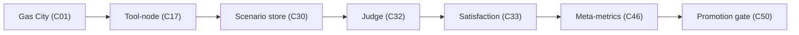
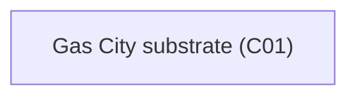
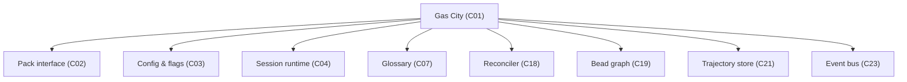
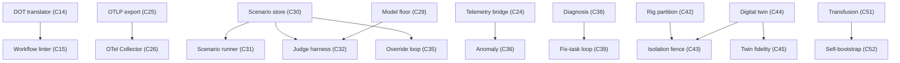
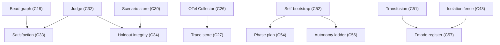
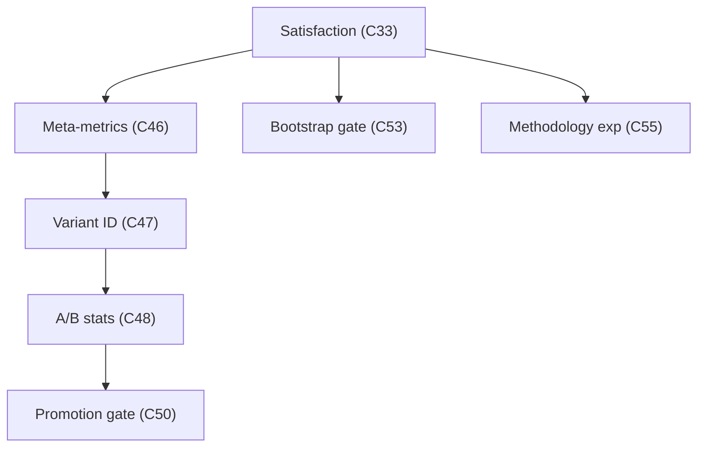

# Implementation dependencies — an implementer's build order for v4

**What this is.** A build order for the 57 v4 components, arranged so each thing is built as early as its real dependencies allow, and so the most things can be built at the same time. Every dependency here is taken directly from the "Depends on" column of the [component inventory](./_meta/component-inventory.md) — this document adds no ordering the inventory doesn't require, and invents no edge the inventory doesn't list. Where two components sit in the same phase with no arrow between them, they are genuinely independent: build them in parallel.

**How to read it.** The build is organized into **phases**. A phase is a *wave*: everything in it can start once all earlier phases are done, and — except where an arrow inside the phase says otherwise — everything in a phase is independent of everything else in it. Each component is named in plain terms with its identifier in parentheses, e.g. the Gas City substrate (C01). Each phase carries a small dependency picture and a note on how many components can be built at once.

**The soft rule.** Aim for at most ten components per phase. Two phases (3 and 4) have thirteen components that are *all* genuinely parallel; rather than invent an ordering that the dependencies don't support, each is shown as two side-by-side batches with no dependency between them — split them only if you can't staff all thirteen at once.

---

## The single most important thing: the long pole

One chain runs deeper than any other and sets the floor on the whole schedule. Nothing elsewhere shortens it. Read it top to bottom — each step needs the one before it:

the Gas City substrate (C01) → the pack and tool-node interface (C02) → the tool-node abstraction (C17) → the scenario store (C30) → the judge harness (C32) → satisfaction aggregation (C33) → the meta-metric stream (C46) → variant identification (C47) → A/B routing and statistics (C48) → the promotion gate (C50).

*Caption: the dominant critical path, collapsed. The evaluation tier (scenario → judge → satisfaction) is the hinge; the self-optimization chain hangs off it.*

The practical lesson: getting from a scenario to a trustworthy satisfaction score — the evaluation tier — is the hinge of the whole build. Self-optimization, self-healing, and bootstrap all wait on it. Pull it forward; don't let it slip.

**Two clocks.** This document orders by *dependencies* (build it as soon as you can). The [component inventory](./_meta/component-inventory.md) also carries a "Phase" / batch view that orders by *capability milestone* (foundations → human-driven → unattended → self-heal → self-optimize → bootstrap → lights-out). A few components are buildable early here but deliberately held back there for risk or capability reasons. One rule overrides both: per decision D-20, the isolation boundary / lethal-trifecta fence (C43) must be in place before the factory ever runs unattended — and it is buildable by Phase 5, so there is no schedule excuse to defer it.

---

## The phases at a glance

| Phase | What it unlocks | Components | Most that can run at once |
|-------|-----------------|-----------|---------------------------|
| 1 | The one root everything sits on | 1 | 1 |
| 2 | First substrate, stores, control loops | 8 | 8 |
| 3 | Schemas, agent loop, workflow grammar, early self-heal/replay | 13 (two parallel batches) | 13 |
| 4 | Intake tooling, observability ingest, eval store, diagnosis, transfusion | 13 (two parallel batches) | 13 |
| 5 | Linters, runner, the judge, anomaly, fix-loop, the fence | 10 | 10 |
| 6 | The satisfaction hinge, holdout, traces, governance docs | 6 | 6 |
| 7 | Meta-metrics, bootstrap gate, methodology experiment | 3 | 3 |
| 8 | Variant identification | 1 | 1 |
| 9 | A/B routing and statistics | 1 | 1 |
| 10 | The promotion gate | 1 | 1 |

The build is **ten dependency levels deep** and at its widest **thirteen components wide**. The early phases are broad and highly parallel; the last three are one-deep because the self-optimization chain (meta-metrics → variant ID → A/B stats → promotion gate) is a single sequential line that no amount of extra staffing can flatten.

---

## Phase 1 — The root

One component depends on nothing, and everything else depends — directly or through a chain — on it. Build it first.

| Component | Needs |
|-----------|-------|
| The Gas City substrate (C01) — the runtime everything runs on | nothing |

*Caption: the single root. Maximum parallel: 1.*

---

## Phase 2 — First substrate, stores, and control loops

Eight components, each needing only the substrate. All eight are independent of each other — build them all at once.

| Component | Needs |
|-----------|-------|
| The pack and tool-node interface (C02) | Gas City (C01) |
| Config and feature flags (C03) | Gas City (C01) |
| The session and provider runtime (C04) | Gas City (C01) |
| The vocabulary and glossary (C07) | Gas City (C01) |
| The reconciler and health patrol (C18) | Gas City (C01) |
| The bead work-graph (C19) | Gas City (C01) |
| The trajectory store / CXDB (C21) | Gas City (C01) |
| The event bus (C23) | Gas City (C01) |

*Caption: a clean fan-out from the root. Maximum parallel: 8.*

---

## Phase 3 — Schemas, agent loop, workflow grammar, early self-heal and replay

Thirteen components, each depending only on Phases 1–2, so all mutually independent. To respect the ten-per-phase soft rule they are shown as two side-by-side batches — **there is no dependency between Batch 3A and Batch 3B**; the split is purely a capacity convenience.

**Batch 3A — substrate services and workflow grammar**

| Component | Needs |
|-----------|-------|
| Sling / dispatch (C05) | Gas City (C01), reconciler (C18) |
| Messaging — Mail and Nudge (C06) | session runtime (C04) |
| The spec artifact and format (C08) | config (C03) |
| The formula / pipeline file (C12) | Gas City (C01), config (C03) |
| The tool-node abstraction (C17) | pack interface (C02) |
| The Claude Code agent loop (C28) | session runtime (C04) |
| Rig partitioning (C42) | session runtime (C04) |

**Batch 3B — schemas, identity, and the first self-heal/replay leaves**

| Component | Needs |
|-----------|-------|
| The bead schema registry (C20) | bead work-graph (C19) |
| The CXDB type registry (C22) | trajectory store (C21) |
| Trajectory clustering (C37) | trajectory store (C21) |
| Durable Orders (C40) | event bus (C23) |
| Identity and attribution (C41) | Gas City (C01), bead graph (C19), event bus (C23) |
| Counterfactual replay (C49) | trajectory store (C21) |

```mermaid
flowchart TD
  C18["Reconciler (C18)"] --> C05["Sling/dispatch (C05)"]
  C04["Session runtime (C04)"] --> C06["Messaging (C06)"]
  C03["Config (C03)"] --> C08["Spec format (C08)"]
  C03 --> C12["Formula file (C12)"]
  C02["Pack interface (C02)"] --> C17["Tool-node (C17)"]
  C04 --> C28["Agent loop (C28)"]
  C04 --> C42["Rig partitioning (C42)"]
  C19["Bead graph (C19)"] --> C20["Bead schema (C20)"]
  C21["Trajectory store (C21)"] --> C22["Type registry (C22)"]
  C21 --> C37["Clustering (C37)"]
  C23["Event bus (C23)"] --> C40["Durable Orders (C40)"]
  C21 --> C49["Counterfactual replay (C49)"]
```

*Caption: all edges point back to Phases 1–2; no edges within Phase 3. Maximum parallel: 13.*

---

## Phase 4 — Intake tooling, observability ingest, eval store, diagnosis, transfusion

Thirteen components, all depending only on Phases 1–3, so all mutually independent. Shown as two side-by-side batches to respect the soft rule; **Batch 4A and Batch 4B have no dependency on each other.**

**Batch 4A — intake tooling and workflow tooling**

| Component | Needs |
|-----------|-------|
| Prompt template and binding (C09) | spec format (C08), sling/dispatch (C05) |
| The spec linter / EARS (C10) | spec format (C08) |
| Intent intake — the crucible (C11) | spec format (C08) |
| The molecule / runtime state (C13) | formula file (C12), reconciler (C18) |
| The formula-to-DOT translator (C14) | formula file (C12) |
| The discipline linter (C16) | formula file (C12) |
| The digital twin per service (C44) | tool-node abstraction (C17) |

**Batch 4B — observability ingest, eval store, diagnosis, transfusion**

| Component | Needs |
|-----------|-------|
| The telemetry-to-CXDB bridge (C24) | trajectory store (C21), agent loop (C28) |
| OTLP telemetry export (C25) | agent loop (C28) |
| Model floor and stylesheet routing (C29) | agent loop (C28) |
| The scenario store (C30) | tool-node abstraction (C17), rig partitioning (C42) |
| The diagnosis agent / Healer (C38) | trajectory clustering (C37), trajectory store (C21) |
| The gene-transfusion predicate (C51) | spec format (C08), bead schema (C20) |

```mermaid
flowchart TD
  C08["Spec format (C08)"] --> C09["Prompt template (C09)"]
  C05["Sling (C05)"] --> C09
  C08 --> C10["Spec linter (C10)"]
  C08 --> C11["Intent intake (C11)"]
  C12["Formula file (C12)"] --> C13["Molecule (C13)"]
  C18["Reconciler (C18)"] --> C13
  C12 --> C14["DOT translator (C14)"]
  C12 --> C16["Discipline linter (C16)"]
  C17["Tool-node (C17)"] --> C44["Digital twin (C44)"]
  C21["Trajectory store (C21)"] --> C24["Telemetry bridge (C24)"]
  C28["Agent loop (C28)"] --> C24
  C28 --> C25["OTLP export (C25)"]
  C28 --> C29["Model floor (C29)"]
  C17 --> C30["Scenario store (C30)"]
  C42["Rig partition (C42)"] --> C30
  C37["Clustering (C37)"] --> C38["Diagnosis agent (C38)"]
  C20["Bead schema (C20)"] --> C51["Transfusion predicate (C51)"]
```

*Caption: every edge reaches back to an earlier phase; none within Phase 4. Maximum parallel: 13.*

---

## Phase 5 — Linters, the runner, the judge, anomaly, the fix-loop, the fence

Ten components, all independent of each other; each waits only on earlier phases. This is where two milestones land: the judge harness (C32) — the last step before the satisfaction hinge — and the isolation boundary (C43), the lethal-trifecta fence.

| Component | Needs |
|-----------|-------|
| The workflow linter (C15) | formula-to-DOT translator (C14) |
| The OpenTelemetry Collector (C26) | OTLP export (C25) |
| The scenario runner (C31) | scenario store (C30), tool-node abstraction (C17) |
| The judge harness (C32) | scenario store (C30), model floor (C29) |
| The override-to-rule loop (C35) | agent loop (C28), bead schema (C20), scenario store (C30) |
| Anomaly detection (C36) | telemetry bridge (C24), trajectory store (C21) |
| The fix-task loop closure (C39) | diagnosis agent (C38), bead schema (C20), spec format (C08) |
| The isolation / lethal-trifecta fence (C43) | rig partitioning (C42), digital twin (C44) |
| Twin fidelity (C45) | digital twin (C44), scenario store (C30) |
| The self-bootstrap recursion (C52) | gene-transfusion predicate (C51), spec format (C08) |

*Caption: ten independent threads converging from the earlier phases. Maximum parallel: 10.*

---

## Phase 6 — The satisfaction hinge, holdout, traces, governance docs

Six components. The hinge of the whole build lands here: satisfaction aggregation (C33), which the entire self-optimization and bootstrap-gate tail depends on. All six are independent of each other.

| Component | Needs |
|-----------|-------|
| Satisfaction aggregation (C33) | judge harness (C32), bead work-graph (C19) |
| Holdout integrity (C34) | scenario store (C30), judge harness (C32) |
| The LangFuse trace store and browser (C27) | OpenTelemetry Collector (C26) |
| The phase delivery plan (C54) | self-bootstrap recursion (C52) |
| The autonomy ladder (C56) | self-bootstrap recursion (C52) |
| The failure-mode coverage register (C57) | gene-transfusion predicate (C51), isolation fence (C43) |

*Caption: six independent components; satisfaction aggregation is the load-bearing one. Maximum parallel: 6.*

Satisfaction aggregation (C33) is the most-depended-on node in the back half of the build. It is the single best place to slow down and get right.

---

## Phases 7–10 — The self-optimization tail

From the satisfaction hinge, the remaining work is dominated by one genuinely sequential line — meta-metrics → variant identification → A/B statistics → the promotion gate — plus two components that join at Phase 7 and then finish. These phases are one or three components wide because the chain is sequential by nature; extra staffing cannot shorten it.

### Phase 7 — three parallel components

| Component | Needs |
|-----------|-------|
| The meta-metric stream (C46) | satisfaction (C33), trajectory store (C21), OTLP export (C25) |
| The bootstrap-validation gate (C53) | self-bootstrap recursion (C52), satisfaction (C33) |
| The methodology experiment (C55) | formula file (C12), scenario store (C30), satisfaction (C33) |

### Phase 8 — one component

| Component | Needs |
|-----------|-------|
| Variant identification (C47) | meta-metric stream (C46) |

### Phase 9 — one component

| Component | Needs |
|-----------|-------|
| A/B routing and statistical comparison (C48) | variant identification (C47), meta-metric stream (C46) |

### Phase 10 — one component

| Component | Needs |
|-----------|-------|
| The promotion gate (C50) | A/B routing and statistics (C48), formula file (C12) |

*Caption: the self-optimization tail — one sequential chain (meta-metrics → variant ID → A/B stats → promotion gate) plus two Phase-7 finishers. Widening a phase cannot shorten the chain.*

---

## What this means for scheduling

- **Front-load aggressively.** Phases 1–4 contain 35 of the 57 components and are almost entirely parallel — with enough hands you reach the evaluation tier quickly.
- **Protect the hinge.** The judge harness (C32) and satisfaction aggregation (C33) gate the entire back half of the build. They sit on the critical path; everything self-optimizing and most of what is bootstrap waits on them.
- **The tail is chain-bound, not capacity-bound.** Phases 8–10 are one component each because the self-optimization line (meta-metrics → variant identification → A/B statistics → promotion gate) is genuinely sequential. Start it the moment satisfaction aggregation (C33) lands; you cannot compress it by adding people.
- **The fence is early and mandatory.** The isolation boundary (C43) is buildable in Phase 5 and, per decision D-20, must be up before any unattended operation. There is no schedule reason to defer it.

See also: the [component inventory](./_meta/component-inventory.md) (the dependency source of truth), the [plain-language build-order plan](../../build-order-plain-english.md) (the capability-milestone view for a non-engineer), and the [engineer's architecture guide](../../architecture-guide-for-engineers.md) (what each component is and why).
