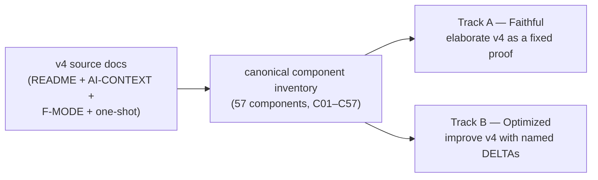
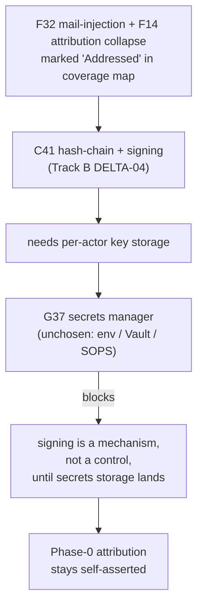
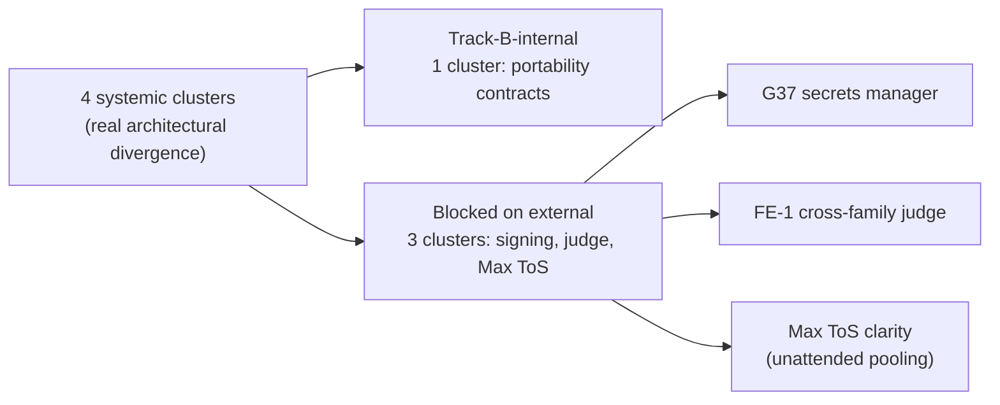

# Track B "Optimized" — what it is, what it costs, what to do with it

> **What this is.** A plain-language reading guide to the optimized track of the v4 spec/plan run, answering: what's actually different from faithful, is the difference worth a parallel track, where does the secrets-manager fit in, and what should we do next.
>
> **What this is not.** Not a spec. Not an ADR. Not a build plan. Not a recommendation to merge any specific delta — that's still your call.
>
> **How to read.** §1 frames the two tracks. §2 names what "optimized" is doing in one sentence and shows the shape. §3 is the secrets-manager focus you asked about. §4 is the skeptic's view. §5–6 is the parallel-track-vs-cherry-pick decision. §7 is honest acknowledgments.

---

## 1. The two tracks side-by-side

| Aspect | Track A — Faithful | Track B — Optimized |
|---|---|---|
| Premise | v4 docs are a fixed proof; render them precisely | v4 is the starting point; ruthless improvement allowed |
| What's marked | `[FAITHFUL-FILL]` for inferred fills, `[AMBIGUITY: Gxx]` for unresolved v4 readings | `[DELTA-NN]` for every deviation, each justified against a named force |
| Adversary attack surface | Fidelity & completeness only | Design correctness, cost, simplicity, scalability, security |
| Component IDs | Same canonical IDs (C01–C57) — both tracks diffable per-component | Same canonical IDs |
| Where to use which | Foundation of record. The "what v4 actually says" reference. | Improvement catalog. The "what we'd do differently" record. |

Both tracks share the inventory backbone, so per-component diffing works. 23 of 57 components are built on both tracks (Sweep-1 architecture altitude); 34 are unbuilt.

---

## 2. What "optimized" is actually doing

**One-sentence summary** (my synthesis from the research files, not a verbatim quote): Track B has not abandoned v4; it has *operationalized* it.

Track B converts v4 prose policies and assertions into typed, testable, fail-closed contracts at almost every seam. 148 named DELTAs across the 23 built components (148 raw; 4 were already adopted into both tracks via INTEGRATION-PASS-1's D-1..D-5 rulings, leaving 144 for the skeptic verdict and 129 for the independence analysis after the analyst's own additional exclusions). Every component has 5–7 deltas — there are no "no-delta" components in Track B.

### What forces motivate the deltas?

| Force | Share | What this category looks like |
|---|---|---|
| Operability | ~41% | Naming a seam v4 left implicit; specifying a fsync contract; spelling out idempotency keys |
| Failure | ~26% | Bounded retry counts; back-pressure semantics; degraded-mode behavior; termination invariants |
| Security | ~15% | Move read-isolation from prompt-discipline to OS-process boundary; sign packs; signed attribution |
| Simplicity / Parallelizability / Scale / Cost / Other | ~18% | The remainder after the top three force buckets — mostly clarifications and small generalizations. (Force totals overlap because deltas often cite multiple forces; the 18% is the share of deltas whose *primary* force is one of these five.) |

Operability dominates because v4 leaves lots of seams gestured-at and not nailed-down. Track B's first move is almost always "name the seam and write down its contract."

### Three representative DELTAs — anatomy of a good one

These are *the report's curated illustrative set* — one each from the operability / failure / security pattern. They are **not** a cross-validated convergence between the skeptic's promote-list and the independence analyst's top picks: the two lists overlap on the C42 family only (the skeptic and the independence analyst optimize for different things — gap-closing vs port cost — and so pick different specific deltas). See §5 for the ranked lists from each lens.

| DELTA | Component | What v4 said | What optimized changes it to | Force |
|---|---|---|---|---|
| **DELTA-02** | C42 — Rig/agent partitioning | Read-isolation = "file perms + agent-prompt discipline + audit log" | Read-isolation enforced at the OS process boundary (capability profile pinned at session spawn; the agent process literally cannot open files outside its partition) | Security — converts G21/G10 from discipline to enforcement |
| **DELTA-04** | C20 — Bead schema | "Fix-task loop" with no termination contract | Schema invariant: every `fix_task` carries `attempt_no` and `max_attempts`; bead validation rejects writes beyond the bound | Failure — closes the G18 termination blocker the v4 corpus admits |
| **DELTA-04** | C09 — Prompt template binding | Go `text/template` renders the prompt | Same, but the FuncMap is sandboxed — no `os.*`, no `exec`, no I/O. Restricts the lethal-trifecta injection surface | Security — closes a real attack hole in one file |

Each one of these meets Track B's bar: real force, proportional solution, low rewind cost, and either resolves a v4 gap (G18) or converts a paper-only assurance into a real one (G21, lethal-trifecta).

---

## 3. Secrets manager — the dependency you asked about

**Headline.** v4 has 11 consumers that need a secrets manager and zero providers. Every credential (Max OAuth, OTel mTLS certs, CXDB/LangFuse endpoints, future judge-seat keys, future per-actor signing keys) is *named* somewhere in `city.toml` / `env = { … }` and *stored* nowhere. The corpus defers to a future "C03 SecretResolver provider" that hasn't been chosen between env-injection and a Vault/SOPS-shape.

### Where it's used (consumers, sorted by criticality)

| Criticality | Component | What it needs from a secrets manager |
|---|---|---|
| HIGH | C03 — Config / feature-flags | The `SecretResolver` seam itself — every other consumer references it |
| HIGH | C41 — Identity & attribution | Per-actor private keys for the `signed` / `attested` assurance ladder |
| HIGH | C28 — Claude Code agent loop | Max OAuth (Claude Code owns this) + a separate fallback credential path |
| HIGH | C04 — Session / provider runtime | `CredentialSource` ladder injecting auth at session spawn |
| MEDIUM | C25 — OTLP telemetry export | mTLS keys/certs when the Collector is non-localhost |
| MEDIUM | C29 — Model floor stylesheet | Metered-API "judge seat" credential for L2/L3 independence |
| MEDIUM | C06 — Messaging | HMAC key for optional/mandatory mail-signing |
| MEDIUM | C02 — Pack & tool-node ABI | Human-held trust root for pack signing (prevents factory self-promotion) |
| MEDIUM | C24 — Telemetry→CXDB bridge | At-rest protection for raw API bodies (untruncated request/response JSON) |
| LOW | C21 — CXDB trajectory store | Endpoint config + any auth on the HTTP API |
| LOW | C27 — LangFuse | Self-hosted LangFuse client credentials |

### How the absence cascades

The most-blocked decision is the signing-dependent F-mode chain. Track B's tamper-evidence work resolves the *mechanism* but the *control* is contingent on a key-storage substrate that doesn't yet exist:

*(The "mechanism not control" sentence is the verbatim XC-6 ruling from the review log.)*

**Blast-radius framing.** G37 is a *Phase-1 operational blocker*, not strictly a Phase-0 one — Phase 0's only real consumer is the Max OAuth token, which Claude Code stores itself. But every "Addressed" cell in the failure-mode coverage map that depends on signing (F14, F32, F43, pack signing for self-bootstrap) is silently downgraded to "Addressed on paper only." Phase 1 forward, once CXDB / LangFuse / Collector come up multi-host, G37 becomes a real operational blocker.

### What's blocked until you pick a secrets approach

10 open questions enumerated in [the secrets-manager research file §4](_meta/research/secrets-manager-thread.md); the four most decision-blocking:

1. **C03 SecretResolver provider baseline** — env-injection or Vault/SOPS? (top open question in C03)
2. **Signing mandatory vs optional** — Track A says optional; Track B makes it graduated-mandatory; integrator must settle
3. **C41 key-storage / trust-root boundary** — where do private-key bytes actually live (HSM? OS keychain? sealed file?)
4. **C02 pack-signing trust root** — human-held vs factory-held; gates the self-bootstrap RSI guard

### Reasonable OSS options (buildability framing)

| Option | Covers | Cost | When right |
|---|---|---|---|
| **HashiCorp Vault + Vault Agent** | All 11 consumers | Heaviest — daemon + storage + unseal ceremony | The only option that scales cleanly to the full surface; overkill for Phase-0 single-host |
| **SOPS + age** | Encrypts values in version-controlled TOML | Cheapest non-trivial — ~50 lines of glue | Directly satisfies the "secrets out of version-controlled TOML" goal; weakens once multi-host |
| **Env-injection only** | The minimum path C03 already names | Zero — `os.Getenv` is the resolver | Defensible at Phase 0 single-host; does NOT scale to multi-actor signing keys |
| **OS keychain (`pass`, libsecret)** | One operator on one host | Configure-existing, no daemon | Right shape if "Phase 0 only, ever" is acceptable |
| **Sealed Secrets / External Secrets Operator** | k8s-flavored | High — needs a k8s cluster | Only if v4 deploys on k8s |

My speculative read: **SOPS + age** is the right Phase-0 default. It directly closes the corpus's stated "secrets out of version-controlled TOML" goal in ~50 lines of glue, doesn't add a daemon, and the age private key can sit in `pass` or libsecret. Vault is the right Phase-1 answer when the surface broadens to multi-host. The env-injection-only path is honest but doesn't actually solve G37 — it relocates the plaintext from `city.toml` to `.env.local`.

---

## 4. The skeptic's findings

A second pass attacked every delta on the "concrete force, not taste" bar. 144 deltas judged:

| Verdict | Count | Share |
|---|---|---|
| WELL-JUSTIFIED | 123 | 85.4% |
| WEAKLY-JUSTIFIED | 20 | 13.9% |
| TASTE | 1 | 0.7% |
| OVER-ENGINEERED | 0 | 0.0% |
| UNCLEAR | 0 | 0.0% |

Headline: discipline is **mixed-leaning-rigorous**. Two patterns to call out:

### Pattern A — the thin portability port (five deltas, same shape)

C01-DELTA-01, C04-DELTA-01, C21-DELTA-01, C23-DELTA-01, and C28-DELTA-01 all introduce an abstract interface ("X is the contract; Y is one implementation") for substrate components the factory adopts wholesale from a single upstream (Gas City + Claude Code). The skeptic's read: these are *port-shaped* abstractions over things v4 has no plan to swap. C01's own open question concedes the `RuntimeSubstrate` port may be too thick to be real portability. The rewind cost is large because all five are inter-dependent (this is the "portability-contracts" systemic cluster — see §5).

### Pattern B — quantitative forces unconnected to deltas

Despite repeatedly invoking "scale" and "cost" as the justifying force, no delta cites a **throughput target, a request/second number, a concurrent-session count, or a TB figure with a timestamp**. Some perf numbers do exist in the corpus — C21's perf contract names p50 < 1 ms append for 10 KB payloads, for instance — but the skeptic's read is that these numbers are "named but not connected" to the deltas that invoke scale/cost as justification. The forces are real (v4 itself names them) but Track B's arguments lean on the v4 framing without sharpening it with delta-specific numbers.

### Skeptic's rescind picks (3, taste / build-for-unsolved-consumer)

| Delta | Why drop |
|---|---|
| C07-DELTA-03 (term-provenance field) | Adds a field the rest of the corpus does not consume |
| C12-DELTA-06 (formula-provenance) | Duplicates what C41/C51 already cover |
| C13-DELTA-07 (re-instantiation primitive) | Designs machinery for C49 counterfactual replay, which v4 explicitly calls "largely unsolved" |

### Skeptic's promote picks (3, cherry-pick into faithful immediately)

These overlap perfectly with the independence analyst's top cherry-pick targets — convergent verdict across two different lenses:

| Delta | Why promote |
|---|---|
| C42-DELTA-02 (OS-boundary read isolation) | The only delta that converts G21/G10 from discipline to enforcement under D-1 |
| C20-DELTA-04 (bounded fix-attempt schema invariant) | Closes the G18 termination blocker at the schema layer |
| C29-DELTA-02 (graded judge independence policy L0–L3) | Confronts G08/G20 head-on with a coherent gate |

---

## 5. Can Track B be raided, or does it need to stay parallel?

### Independence classification (129 deltas; the analyst's classified base after their own exclusions — see [the independence research file](_meta/research/optimized-deltas-independence.md) for the derivation from 148 raw deltas)

| Class | Count | Share | Meaning |
|---|---|---|---|
| ISOLATED | 68 | 53% | Applies to one component; can be ported to faithful by editing one doc pair |
| CLUSTER-2 | 34 | 26% | Two-delta cluster; travel together |
| CLUSTER-3+ | 14 | 11% | Three-or-more-delta cluster; travel together |
| SYSTEMIC | 13 | 10% | Track-level architectural commitment; ripples across many components |

**~65% of Track B's value is cherry-pickable** into faithful as isolated deltas or small clusters.

### The four systemic clusters — the real Track-B-only architecture

These are the only places where Track B is a meaningfully *different architecture*, not a list of improvements:

The four clusters in detail (corrected per the independence file §5):

| # | Cluster | Components | External dependency |
|---|---|---|---|
| 1 | Portability contracts | C01/C04/C21/C28 DELTA-01 | None (Track-B-internal) — but skeptic-flagged weakest cluster |
| 2 | Mandatory signing | C41 DELTA-01/06 | Blocked on G37 (secrets manager) + cascades to C03/C06 |
| 3 | Graded judge independence | C29 DELTA-02/03 | Blocked on second-provider credential (FE-1) |
| 4 | Multi-seat pool | C28 DELTA-03 | Blocked on Max ToS question for pooled unattended automation |

Three of the four systemic clusters cannot fully ship as Track B either — they're blocked on external decisions (G37 for signing; FE-1/second-provider credential for the judge; Max-ToS clarity for the seat pool) that Track A is also waiting on. Only the portability-contracts cluster is fully Track-B-internal, and the skeptic flagged that one as the weakest-justified group of deltas in the corpus.

### Top cherry-pick candidates (the two lenses, side-by-side)

The two analysis lenses don't pick the same deltas. The skeptic optimizes for *gap-closing* (which delta converts a known-G-mode from paper to enforcement?); the independence analyst optimizes for *port cost* (which delta moves to faithful in the fewest file edits?). The overlap is the C42 family. The union is the practical "immediate cherry-pick" set — six deltas across both lenses:

| Delta | Component | What it does | Why now | Lens | Cluster-dependency |
|---|---|---|---|---|---|
| C42-DELTA-02 | Rig partitioning | OS-boundary read-isolation | Only mechanism converting G21/G10 from discipline to enforcement | Skeptic | CLUSTER-2 — needs C04-DELTA-05 (PartitionBinding) |
| C20-DELTA-04 | Bead schema | Bounded `attempt_no`/`max_attempts` schema invariant | Closes the G18 self-heal termination blocker | Skeptic | ISOLATED |
| C29-DELTA-02 | Model-floor stylesheet | Graded judge independence policy L0–L3 | Confronts the cross-family judge constraint | Skeptic | SYSTEMIC — see §5; cannot truly cherry-pick without the FE-1 seam |
| C19-DELTA-04 | Bead work-graph | fsync durability contract | Closes "scratchpad lost on restart" | Independence | ISOLATED |
| C23-DELTA-02/03 | Event bus | Back-pressure + at-least-once idempotency key | Direct answer to G33 (failure of OSS stack); two improvements to one file | Independence | ISOLATED (pair travels together within one file) |
| C09-DELTA-04 | Prompt-template binding | Render-time FuncMap sandbox | Closes a lethal-trifecta injection hole, single file | Independence | ISOLATED |

The cluster-dependency column matters: C42-DELTA-02 looks like a one-file port but actually drags C04-DELTA-05 along; C29-DELTA-02 looks like a one-file port but is structurally Track-B-only. The reader picking deltas needs both columns.

The independence analyst's broader recommendation goes further: **"raid Track B for the 35–40 highest-value isolated/cluster deltas"** — meaning the six above are the minimum-viable cherry-pick set, not the maximum-honest one. A larger cherry-pick pass would pull in the durability contracts, typed interfaces, termination invariants, vocab-lint wiring, role taxonomy, and parametric routing across roughly 35–40 deltas. That's a bigger integration pass than the six above but still bounded.

---

## 6. Decision: parallel track vs cherry-pick — the trade-off

The "rewind cost" question is actually two questions: *what specifically would you have to redo* if you picked wrong, and *what subagent budget is sunk* in the chosen direction. Splitting them:

| Option | What you get | What you give up | If wrong: what you'd redo | Sunk subagent budget |
|---|---|---|---|---|
| **A. Drop Track B; cherry-pick ~6–15 named deltas (min) or ~35–40 (broad raid) into faithful** | All the operationally-valuable improvements without the cost of maintaining two parallel specs through 34 more components | The 13 systemic deltas (the 4 architectural clusters) get archived as reference, not pursued | Rerun integration-pass against the cherry-picked deltas; revive the systemic clusters from their existing 23 Track B specs (no rewrite needed but each cluster's spec is one or two batches stale by the time you revive it; cite-chains into other specs need refresh) | None new — the 23 existing Track B specs stay on disk; no future Track B subagent dispatches |
| **B. Pause Track B; resume after faithful Sweep-1 finishes** | Foundational artifact (faithful) reaches full 57-component coverage first; Track B work resumes with the v4 picture clearer | Track B momentum lost; subagent receipts and standing briefs need re-grounding when work resumes (~3–4 subagents' worth of warm-up per wave that's been on ice) | Resume Track B Wave-2 from where it stopped; re-validate D-1..D-5 are still applicable | Modest — the warm-up cost on resume, no Track B work happens during the pause |
| **C. Continue both tracks in parallel through Wave-1 (17 components) and beyond** | Maximum exploration; both views in the inventory; per-component Track A vs Track B diff is always current | Cost: every wave is ~2× subagents, ~2× review surface, ~2× integration passes; the four blocked-systemic clusters keep getting elaborated even while their external blockers remain unresolved | Discover during Sweep 2 / 3 that 3 of the 4 systemic clusters are blocked anyway and re-archive Track B at that point — having spent 2× subagent budget on it in the meantime | Large — every Wave-N sweep doubles the receipts you have to reconcile; conservatively a 1.6×–2× multiplier through the next 34 components |

### Speculative recommendation (this is my opinion, not synthesis)

**Option A, broad-raid variant.** Drop Track B as an active authoring track; do a focused **integration pass that cherry-picks roughly 35–40 deltas** into faithful (the independence analyst's "raid Track B for the 35–40 highest-value isolated/cluster deltas" framing — not just the 6 minimum-viable ones I tabled in §5). Leave the existing 23 Track B specs in place as reference for the four systemic clusters; revive them only when G37, FE-1, and the Max-ToS question get decided.

The data this rests on:
- §4 verdict table — 85.4% of Track B's deltas are well-justified; this means the broad raid is pulling in genuinely good engineering, not the residue. Option A is "leave 85% of well-justified work on the table" *unless* the broad-raid integration pass is done — which is why I'm recommending the broad-raid variant, not the minimum-viable one.
- §5 independence table — only ~10% of deltas are SYSTEMIC; the other 90% have some path to faithful via isolated port or small cluster.
- Three of the four SYSTEMIC clusters can't ship as Track B either right now (external blockers); the fourth (portability contracts) was the weakest-justified per the skeptic.

**Footnote on optionality.** If you want one piece of Track B alive as an active authoring track, the portability-contracts cluster (C01/C04/C21/C28-DELTA-01) is the natural candidate — it's the only systemic cluster with no external blocker. I'd still defer it because the skeptic flagged it as the weakest cluster, and the cluster's "leave in Track B only" recommendation in the source means we lose nothing by keeping it in the existing 23 specs.

---

## 7. Honest acknowledgments

- **What I read directly.** The Track-A and Track-B charters, the integration-pass-1 log, the review-log, the secrets-manager research file in full, and the independence research file's per-component sections + §5 (systemic clusters) + summary verdict. The DELTA enumeration (148 rows) and the skeptic verdict tables I worked from the subagent receipts, not from reading every row.
- **What I synthesized vs cited.** The "65% cherry-pickable" number, the verdict-share percentages, and the four systemic clusters all come from the independence analyst's source file (§5 summary). The "thin portability port" pattern and the rescind/promote picks come from the skeptic. The secrets-manager numbers and OSS-options framing come from the secrets-manager research file.
- **Caught and corrected by adversarial review on this report.** The first draft (a) attributed a one-sentence summary as a verbatim quote from the enumeration research file when the phrase only appeared in the subagent receipt, not in the persisted file; (b) claimed the §2 three-delta exemplar set was the cross-validated convergence between the skeptic and the independence analyst when in fact only the C42 family overlaps; (c) named "supply-chain signing" as the 4th systemic cluster when the source actually names "multi-seat pool (C28-DELTA-03)". All three are fixed; this disclosure is the kind of synthesis error the §7 disclosure section exists to flag.
- **What I did not verify.** Every single DELTA — I trusted the enumeration agent's count. The Gas City native-count corrections (whether v4 says 5 or 6 principles native at Phase 0). Whether any of the 5 portability-port deltas the skeptic flagged actually has a strong defense I missed.
- **My recommendation is opinion, not synthesis.** Section 6's "Option A, broad-raid variant" is my read; the data tables and trade-off framing it cites are synthesis from the research files.

---

## Appendix: audit trail

Underlying research files, all on the same branch as this document:

- [DELTA enumeration (148 deltas)](_meta/research/optimized-deltas-enumeration.md)
- [Skeptic force-justification pass](_meta/research/optimized-deltas-force-skeptic.md)
- [Independence / cherry-pick analysis](_meta/research/optimized-deltas-independence.md)
- [Secrets-manager thread trace](_meta/research/secrets-manager-thread.md)

The five Track-B deltas already adopted into both tracks (D-1 through D-5) are documented in [`INTEGRATION-PASS-1.md`](../../archive/PR-218-INTEGRATION-PASS-1.md). The list of open human decisions across both tracks is in [`_meta/review-log.md`](_meta/review-log.md).
