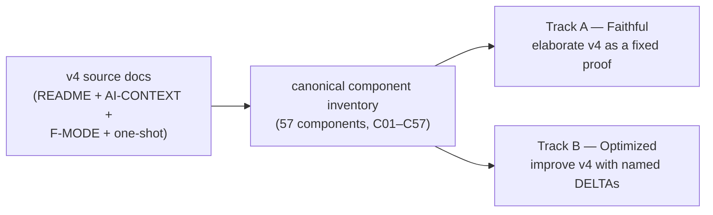
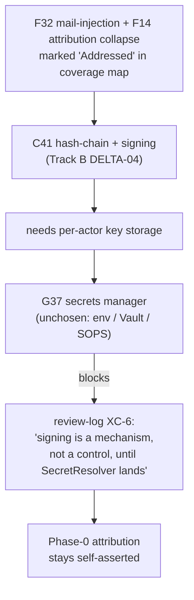
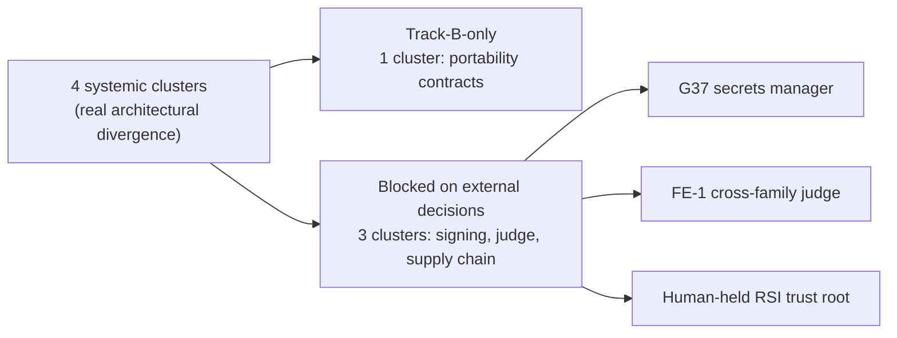

# Track B "Optimized" — what it is, what it costs, what to do with it

> **What this is.** A plain-language reading guide to the optimized track of the v4 spec/plan run, answering: what's actually different from faithful, is the difference worth a parallel track, where does the secrets-manager fit in, and what should we do next.
>
> **What this is not.** Not a spec. Not an ADR. Not a build plan. Not a recommendation to merge any specific delta — that's still your call.
>
> **How to read.** §1 frames the two tracks. §2 names what "optimized" is doing in one sentence and shows the shape. §3 is the secrets-manager focus you asked about. §4 is the skeptic's view. §5–6 is the parallel-track-vs-cherry-pick decision. §7 is honest acknowledgments.

---

## 1. The two tracks side-by-side

| Aspect | Track A — Faithful | Track B — Optimized |
|---|---|---|
| Premise | v4 docs are a fixed proof; render them precisely | v4 is the starting point; ruthless improvement allowed |
| What's marked | `[FAITHFUL-FILL]` for inferred fills, `[AMBIGUITY: Gxx]` for unresolved v4 readings | `[DELTA-NN]` for every deviation, each justified against a named force |
| Adversary attack surface | Fidelity & completeness only | Design correctness, cost, simplicity, scalability, security |
| Component IDs | Same canonical IDs (C01–C57) — both tracks diffable per-component | Same canonical IDs |
| Where to use which | Foundation of record. The "what v4 actually says" reference. | Improvement catalog. The "what we'd do differently" record. |

Both tracks share the inventory backbone, so per-component diffing works. 23 of 57 components are built on both tracks (Sweep-1 architecture altitude); 34 are unbuilt.

---

## 2. What "optimized" is actually doing

**One-sentence summary** (verbatim from the DELTA-enumeration research): *Track B has not abandoned v4; it has operationalized it.*

Track B converts v4 prose policies and assertions into typed, testable, fail-closed contracts at almost every seam. 148 named DELTAs across the 23 built components. Every component has 5–7 of them — there are no "no-delta" components in Track B.

### What forces motivate the deltas?

| Force | Share | What this category looks like |
|---|---|---|
| Operability | ~41% | Naming a seam v4 left implicit; specifying a fsync contract; spelling out idempotency keys |
| Failure | ~26% | Bounded retry counts; back-pressure semantics; degraded-mode behavior; termination invariants |
| Security | ~15% | Move read-isolation from prompt-discipline to OS-process boundary; sign packs; signed attribution |
| Simplicity / Parallelizability / Scale / Cost / Other | ~18% | The remaining 27 deltas, mostly clarifications and small generalizations |

Operability dominates because v4 leaves lots of seams gestured-at and not nailed-down. Track B's first move is almost always "name the seam and write down its contract."

### Three representative DELTAs — anatomy of a good one

These are the three deltas BOTH the independence analyst and the skeptic flagged as the highest-value cherry-pick candidates. They illustrate the operability/failure/security pattern.

| DELTA | Component | What v4 said | What optimized changes it to | Force |
|---|---|---|---|---|
| **DELTA-02** | C42 — Rig/agent partitioning | Read-isolation = "file perms + agent-prompt discipline + audit log" | Read-isolation enforced at the OS process boundary (capability profile pinned at session spawn; the agent process literally cannot open files outside its partition) | Security — converts G21/G10 from discipline to enforcement |
| **DELTA-04** | C20 — Bead schema | "Fix-task loop" with no termination contract | Schema invariant: every `fix_task` carries `attempt_no` and `max_attempts`; bead validation rejects writes beyond the bound | Failure — closes the G18 termination blocker the v4 corpus admits |
| **DELTA-04** | C09 — Prompt template binding | Go `text/template` renders the prompt | Same, but the FuncMap is sandboxed — no `os.*`, no `exec`, no I/O. Restricts the lethal-trifecta injection surface | Security — closes a real attack hole in one file |

Each one of these meets Track B's bar: real force, proportional solution, low rewind cost, and either resolves a v4 gap (G18) or converts a paper-only assurance into a real one (G21, lethal-trifecta).

---

## 3. Secrets manager — the dependency you asked about

**Headline.** v4 has 11 consumers that need a secrets manager and zero providers. Every credential (Max OAuth, OTel mTLS certs, CXDB/LangFuse endpoints, future judge-seat keys, future per-actor signing keys) is *named* somewhere in `city.toml` / `env = { … }` and *stored* nowhere. The corpus defers to a future "C03 SecretResolver provider" that hasn't been chosen between env-injection and a Vault/SOPS-shape.

### Where it's used (consumers, sorted by criticality)

| Criticality | Component | What it needs from a secrets manager |
|---|---|---|
| HIGH | C03 — Config / feature-flags | The `SecretResolver` seam itself — every other consumer references it |
| HIGH | C41 — Identity & attribution | Per-actor private keys for the `signed` / `attested` assurance ladder |
| HIGH | C28 — Claude Code agent loop | Max OAuth (Claude Code owns this) + a separate fallback credential path |
| HIGH | C04 — Session / provider runtime | `CredentialSource` ladder injecting auth at session spawn |
| MEDIUM | C25 — OTLP telemetry export | mTLS keys/certs when the Collector is non-localhost |
| MEDIUM | C29 — Model floor stylesheet | Metered-API "judge seat" credential for L2/L3 independence |
| MEDIUM | C06 — Messaging | HMAC key for optional/mandatory mail-signing |
| MEDIUM | C02 — Pack & tool-node ABI | Human-held trust root for pack signing (prevents factory self-promotion) |
| MEDIUM | C24 — Telemetry→CXDB bridge | At-rest protection for raw API bodies (untruncated request/response JSON) |
| LOW | C21 — CXDB trajectory store | Endpoint config + any auth on the HTTP API |
| LOW | C27 — LangFuse | Self-hosted LangFuse client credentials |

### How the absence cascades

The most-blocked decision is the signing-dependent F-mode chain. Track B's tamper-evidence work resolves the *mechanism* but the *control* is contingent on a key-storage substrate that doesn't yet exist:

**Blast-radius framing.** G37 is a *Phase-1 operational blocker*, not strictly a Phase-0 one — Phase 0's only real consumer is the Max OAuth token, which Claude Code stores itself. But every "Addressed" cell in the failure-mode coverage map that depends on signing (F14, F32, F43, pack signing for self-bootstrap) is silently downgraded to "Addressed on paper only." Phase 1 forward, once CXDB / LangFuse / Collector come up multi-host, G37 becomes a real operational blocker.

### What's blocked until you pick a secrets approach

10 open questions across the corpus. The headline four:

1. **C03 SecretResolver provider baseline** — env-injection or Vault/SOPS? (top open question in C03)
2. **Signing mandatory vs optional** — Track A says optional; Track B makes it graduated-mandatory; integrator must settle
3. **C41 key-storage / trust-root boundary** — where do private-key bytes actually live (HSM? OS keychain? sealed file?)
4. **C02 pack-signing trust root** — human-held vs factory-held; gates the self-bootstrap RSI guard

### Reasonable OSS options (buildability framing)

| Option | Covers | Cost | When right |
|---|---|---|---|
| **HashiCorp Vault + Vault Agent** | All 11 consumers | Heaviest — daemon + storage + unseal ceremony | The only option that scales cleanly to the full surface; overkill for Phase-0 single-host |
| **SOPS + age** | Encrypts values in version-controlled TOML | Cheapest non-trivial — ~50 lines of glue | Directly satisfies the "secrets out of version-controlled TOML" goal; weakens once multi-host |
| **Env-injection only** | The minimum path C03 already names | Zero — `os.Getenv` is the resolver | Defensible at Phase 0 single-host; does NOT scale to multi-actor signing keys |
| **OS keychain (`pass`, libsecret)** | One operator on one host | Configure-existing, no daemon | Right shape if "Phase 0 only, ever" is acceptable |
| **Sealed Secrets / External Secrets Operator** | k8s-flavored | High — needs a k8s cluster | Only if v4 deploys on k8s |

My speculative read: **SOPS + age** is the right Phase-0 default. It directly closes the corpus's stated "secrets out of version-controlled TOML" goal in ~50 lines of glue, doesn't add a daemon, and the age private key can sit in `pass` or libsecret. Vault is the right Phase-1 answer when the surface broadens to multi-host. The env-injection-only path is honest but doesn't actually solve G37 — it relocates the plaintext from `city.toml` to `.env.local`.

---

## 4. The skeptic's findings

A second pass attacked every delta on the "concrete force, not taste" bar. 144 deltas judged:

| Verdict | Count | Share |
|---|---|---|
| WELL-JUSTIFIED | 123 | 85.4% |
| WEAKLY-JUSTIFIED | 20 | 13.9% |
| TASTE | 1 | 0.7% |
| OVER-ENGINEERED | 0 | 0.0% |
| UNCLEAR | 0 | 0.0% |

Headline: discipline is **mixed-leaning-rigorous**. Two patterns to call out:

### Pattern A — the thin portability port (five deltas, same shape)

C01-DELTA-01, C04-DELTA-01, C21-DELTA-01, C23-DELTA-01, and C28-DELTA-01 all introduce an abstract interface ("X is the contract; Y is one implementation") for substrate components the factory adopts wholesale from a single upstream (Gas City + Claude Code). The skeptic's read: these are *port-shaped* abstractions over things v4 has no plan to swap. C01's own open question concedes the `RuntimeSubstrate` port may be too thick to be real portability. The rewind cost is large because all five are inter-dependent (this is the "portability-contracts" systemic cluster — see §5).

### Pattern B — zero quantitative forces

Despite repeatedly invoking "scale" and "cost" as the justifying force, **zero deltas anywhere in the corpus cite a single quantitative number** — no scenarios/hour target, no $/satisfaction budget, no concurrency cap, no rate-limit headroom. The forces are real (v4 itself names them) but Track B's arguments lean on the v4 framing without sharpening it.

### Skeptic's rescind picks (3, taste / build-for-unsolved-consumer)

| Delta | Why drop |
|---|---|
| C07-DELTA-03 (term-provenance field) | Adds a field the rest of the corpus does not consume |
| C12-DELTA-06 (formula-provenance) | Duplicates what C41/C51 already cover |
| C13-DELTA-07 (re-instantiation primitive) | Designs machinery for C49 counterfactual replay, which v4 explicitly calls "largely unsolved" |

### Skeptic's promote picks (3, cherry-pick into faithful immediately)

These overlap perfectly with the independence analyst's top cherry-pick targets — convergent verdict across two different lenses:

| Delta | Why promote |
|---|---|
| C42-DELTA-02 (OS-boundary read isolation) | The only delta that converts G21/G10 from discipline to enforcement under D-1 |
| C20-DELTA-04 (bounded fix-attempt schema invariant) | Closes the G18 termination blocker at the schema layer |
| C29-DELTA-02 (graded judge independence policy L0–L3) | Confronts G08/G20 head-on with a coherent gate |

---

## 5. Can Track B be raided, or does it need to stay parallel?

### Independence classification (129 deltas, excluding the 5 already adopted in both tracks)

| Class | Count | Share | Meaning |
|---|---|---|---|
| ISOLATED | 68 | 53% | Applies to one component; can be ported to faithful by editing one doc pair |
| CLUSTER-2 | 34 | 26% | Two-delta cluster; travel together |
| CLUSTER-3+ | 14 | 11% | Three-or-more-delta cluster; travel together |
| SYSTEMIC | 13 | 10% | Track-level architectural commitment; ripples across many components |

**~65% of Track B's value is cherry-pickable** into faithful as isolated deltas or small clusters.

### The four systemic clusters — the real Track-B-only architecture

These are the only places where Track B is a meaningfully *different architecture*, not a list of improvements:

The four clusters in detail:

| # | Cluster | Components | External dependency |
|---|---|---|---|
| 1 | Portability contracts | C01/C04/C21/C28 DELTA-01 | None (Track-B-only) — skeptic-flagged weakest cluster |
| 2 | Mandatory signing | C41 DELTA-01/06 | Blocked on G37 (secrets manager) |
| 3 | Graded judge independence | C29 DELTA-02/03 | Blocked on second-provider credential (FE-1) |
| 4 | Supply-chain signing | C02 DELTA-02 + C41/C51 provenance | Blocked on G37 + human-held RSI trust root |

Three of the four systemic clusters cannot fully ship as Track B either — they're blocked on the same external decisions (G37, judge access, RSI governance) that Track A is also waiting on. Only the portability-contracts cluster is fully Track-B-internal, and the skeptic flagged that one as the weakest-justified group of deltas in the corpus.

### Top cherry-pick candidates (independence agent + skeptic agree)

The six highest-value, lowest-port-cost deltas to port into faithful immediately:

| Delta | Component | What it does | Why now |
|---|---|---|---|
| C42-DELTA-02 | Rig partitioning | OS-boundary read-isolation | Only mechanism converting G21/G10 from discipline to enforcement |
| C20-DELTA-04 | Bead schema | Bounded `attempt_no`/`max_attempts` schema invariant | Closes the G18 self-heal termination blocker |
| C09-DELTA-04 | Prompt-template binding | Render-time FuncMap sandbox | Closes a lethal-trifecta injection hole, single file |
| C19-DELTA-04 | Bead work-graph | fsync durability contract | Closes "scratchpad lost on restart" |
| C23-DELTA-02/03 | Event bus | Back-pressure + at-least-once idempotency key | Direct answer to G33 (failure of OSS stack); two improvements to one file |
| C29-DELTA-02 | Model-floor stylesheet | Graded judge independence policy L0–L3 | Confronts the cross-family judge constraint head-on |

---

## 6. Decision: parallel track vs cherry-pick — the trade-off

| Option | What you get | What you give up | Rewind cost if wrong |
|---|---|---|---|
| **A. Drop Track B; cherry-pick ~6–15 deltas into faithful** | All the operationally-valuable improvements without the cost of maintaining two parallel specs through 34 more components | The 13 systemic deltas (the 4 architectural clusters) get archived as reference, not pursued | Low — the cherry-picks are isolated; the systemic clusters live on in the existing 23 Track B specs and can be revived |
| **B. Pause Track B; resume after faithful Sweep-1 finishes** | Foundational artifact (faithful) gets to full coverage first; Track B work resumes with the v4 picture clearer | Track B momentum lost; ~half of Track B subagent receipts will need re-grounding when work resumes | Low — paused work is not lost work |
| **C. Continue both tracks in parallel** | Maximum exploration; both views in the inventory | Cost: every wave is 2× the subagents, 2× the review surface, 2× the integration passes; the four blocked-systemic clusters are still blocked | Medium — sunk subagent cost on track-B-only work that can't ship until external decisions land |

### Speculative recommendation (this is my opinion, not synthesis)

**Option A with a footnote.** Drop Track B as an active authoring track; cherry-pick the 6–15 deltas above into faithful as targeted improvements; leave the existing 23 Track B specs in place as a reference for the four systemic clusters so we can revisit when G37, FE-1, and the RSI trust-root questions get decided. The cost of carrying Track B through 34 more unbuilt components is ~2× wave concurrency; the marginal value beyond the cherry-picks is ~120 deltas, mostly micro-improvements at the operability/failure layer. Better to invest that subagent budget in Sweep 2 depth on faithful.

**Footnote:** if you want to keep one piece of Track B alive as an authoring track, the portability-contracts cluster (C01/C04/C21/C28-DELTA-01) is the natural candidate — but I'd defer even that because the skeptic flagged it as the weakest cluster and it has no external dependency we're waiting on, so we can revive it at any time without losing optionality.

---

## 7. Honest acknowledgments

- **What I read directly.** The Track-A and Track-B charters, the integration-pass-1 log, the review-log, the secrets-manager research file in full, and a representative slice of the independence research file. The DELTA enumeration (148 rows) and skeptic verdict tables I worked from the subagent receipts, not from reading every row.
- **What I synthesized vs cited.** The "65% cherry-pickable" number, the verdict-share percentages, and the four systemic clusters all come from the independence analyst's receipt. The "thin portability port" pattern and the rescind/promote picks come from the skeptic. The secrets-manager numbers and OSS-options framing come from the secrets-manager research file.
- **What I did not verify.** Every single DELTA — I trusted the enumeration agent's count. The Gas City native-count corrections (whether v4 says 5 or 6 principles native at Phase 0). Whether any of the 5 portability-port deltas actually has a strong defense I missed.
- **My recommendation is opinion, not synthesis.** Section 6's "Option A with a footnote" is my read; the synthesis is the table above it.

---

## Appendix: audit trail

Underlying research files, all on the same branch as this document:

- [DELTA enumeration (148 deltas)](_meta/research/optimized-deltas-enumeration.md)
- [Skeptic force-justification pass](_meta/research/optimized-deltas-force-skeptic.md)
- [Independence / cherry-pick analysis](_meta/research/optimized-deltas-independence.md)
- [Secrets-manager thread trace](_meta/research/secrets-manager-thread.md)

The five Track-B deltas already adopted into both tracks (D-1 through D-5) are documented in [`_meta/INTEGRATION-PASS-1.md`](_meta/INTEGRATION-PASS-1.md). The list of open human decisions across both tracks is in [`_meta/review-log.md`](_meta/review-log.md).
