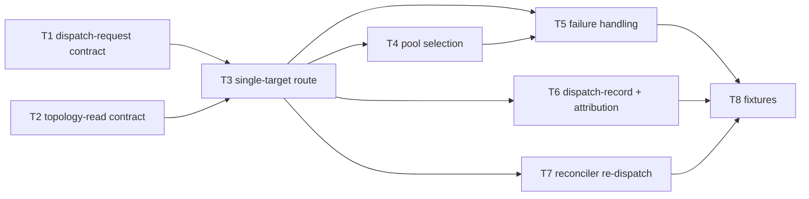

# C05 — Sling / dispatch (`sling-dispatch`)  (Build Plan, Track A)

> Source / Spec ref: [`spec/C05-sling-dispatch.md`](../spec/C05-sling-dispatch.md)
> Track A (faithful). Sweep 1. Depends on: C01 (Gas City substrate), C18 (reconciler / Health Patrol). Non-foundational routing seam in Runtime Substrate; Batch-2 per the [component inventory](../_meta/component-inventory.md) suggested batches.

## 1. Work breakdown

| Task | Description | Size | Prerequisites |
|---|---|---|---|
| **T1** Freeze dispatch-request contract | Define the inbound dispatch interface: `(work-item ref, target descriptor = template-name + agent-role) → dispatch`. Names the C18/C12 → C05 trigger and the C09 → C05 routing-key inputs (spec §3.1). | S | C18 reconciler trigger shape; C09 binding-output shape |
| **T2** Freeze topology-read contract | Define how C05 reads the routable agents/pools from `city.toml` (C03): `[[agent]]` blocks + (later-phase) pool sets (spec §3.1 FAITHFUL-FILL). Read-only; no new store. | S | C03 `city.toml` agent/pool surface (Phase-0 = one `[[agent]]`) |
| **T3** Single-target routing (Phase-0) | Implement the trivial path: resolve key → one declared `[[agent]]` → hand off to its session (C04). Wraps Gas City's native dispatch; no new engine (spec §5, AC-1). | M | T1, T2, C04 session handoff |
| **T4** Pool target pass-through | When the target resolves to a pool of N interchangeable role-agents, route to the pool and let Gas City's **native** sling pick the member (sling "routes bead/wisp to agent or pool", AI-CONTEXT:92) — **no custom selection/fairness engine** (optimized DELTA-03 dropped, SURVIVOR-PASS C05). Verify exactly one recipient results (spec §5, INV-1, AC-3). | S | T3, C03 pool-config surface |
| **T5** Failure handling | No-target, key-mismatch, pool-exhaustion, double-dispatch → loud dispatch error / leave un-dispatched for reconciler retry; never silent drop or mis-place (spec §6, AC-2/AC-4; INV-2/INV-3). | S | T3, T4 |
| **T6** Verify native dispatch attribution | Verify "W → agent/role A under template T at tick N" is observable through **native** `created_by` (C41) + the native event-bus append (C23) that fire on the dispatch — C05 writes **no record/schema of its own** (custom dispatch-record dropped, SURVIVOR-PASS C05 DELTA-06). Confirm no payload mutation (spec §3.2, INV-4, AC-5/AC-7). | S | T3, C23 native event, C41 `created_by` |
| **T7** Reconciler re-dispatch integration | Verify the reconciler (C18) re-invokes C05 when a dispatched agent is unavailable on a later tick, re-routing the work item (zombie-agent recovery, AC-6, F22). | S | T3, T5, C18 tick loop |
| **T8** Acceptance fixtures | The §8 fixtures: Phase-0 single-agent route, key-mismatch negative, pool single-member selection + all-busy negative, reconciler-driven re-dispatch across two ticks, attribution check. | M | T3–T7 |

Most C05 work is **thin connective glue over Gas City's native dispatch** (sling is a built-in derived mechanism, AI-CONTEXT:92) plus the reconciler (C18) trigger and the C09 routing key. The faithful scope deliberately introduces no new dispatch engine, queue, or topology store — routing is a pure decision over (request, `city.toml` topology) with an additive record.

## 2. Dependency graph

- **Hard upstream:** C01 (sling is hosted by Gas City — the native dispatch C05 specs over) and C18 (the per-tick reconciler that *triggers* dispatch). C05 cannot be exercised end-to-end without the C18 trigger and a C04 session to hand off to.
- **Reference upstream:** C09 (supplies the resolved template/role routing key — the §3.1 routing-key input) and C03 (`city.toml` topology). Both can be frozen against stubs (a fixed key, a one-agent `city.toml`).
- **Downstream consumers:** C04 (receives the handoff), C28 (executes after handoff), C12 (the formula step that asks for a route). These build against a C05 stub once T1/T2 contracts are frozen.
- **Critical path:** T1+T2 (freeze contracts) → T3 (single-target route) → T5 (failures) → T8 (fixtures). T4 (pool) is a parallel branch off T3; T6/T7 hang off T3/T5 and are not on the longest chain.

## 3. Parallelization

- **T1 (dispatch-request contract)** and **T2 (topology-read contract)** are independent and can be authored concurrently — they touch disjoint surfaces (the trigger/key vs. the `city.toml` topology read).
- **T4 (pool selection)** is an independent branch off T3 and can be built in parallel with **T6 (attribution)** and **T7 (reconciler re-dispatch)** — all three depend only on the T3 single-target path, not on each other.
- **Fan-out point:** freezing T1+T2 (interfaces-first) unblocks C04/C28/C12 to build against a C05 stub *and* unblocks C05's own T3 — the highest-leverage early milestone.

## 4. Interfaces-first / contract milestones

Freeze these earliest so dependents build against stubs in parallel:
1. **Dispatch-request contract (T1):** `(work-item ref, template-name + agent-role) → handoff`; single recipient (INV-1), key-faithful (INV-2). Lets C18 stub a trigger and C04 stub a handoff receiver.
2. **Topology-read contract (T2):** C05 reads routable `[[agent]]` blocks / pools from `city.toml` read-only (no new store). Publish "Phase 0 = exactly one `[[agent]]`, pools later-phase" so C03 knows the surface C05 expects (spec §3.1 FAITHFUL-FILL).
3. **Native-attribution confirmation (T6, not a C05 contract):** confirm "W → agent/role A under template T at tick N" is observable via **native** `created_by` (C41) + event-bus append (C23) — C05 owns no record schema (custom dispatch-record dropped, SURVIVOR-PASS C05 DELTA-06). Nothing for C05 to freeze here beyond verifying the native events fire on dispatch.

## 5. Risks & de-risking order

1. **Routing-key authority seam (OQ-1) — highest.** Spike *first* with the C09 author: confirm the faithful split (C09 resolves name→template/role; C05 routes the resolved key) before building T3, because folding resolution into C05 changes T1's inbound from "resolved template/role" to "raw formula template-name" and absorbs the §3.1 routing-key step. De-risk by freezing C05's inbound as "resolved key" under Track A and documenting the single insertion point (raw-name resolution) if an integrator later folds it in.
2. **Pool member-selection is Gas City's, not ours (OQ-2).** Risk: building a selection policy (round-robin/least-loaded/fairness) that Gas City's native sling already provides — exactly the optimized DELTA-03 dropped under the bar (SURVIVOR-PASS C05). Mitigate by shipping the single-target path (T3) first and making T4 a *pass-through* to native pool routing (route to the pool, verify one recipient), not a selection engine; any C05-visible policy deferred to sweep 2.
3. **Back-pressure is not C05's (OQ-3).** Risk: building an internal dispatch queue v4 doesn't name (optimized admission-control DELTA-02 dropped as Gas-City-native). Mitigate by adding **no** C05 queue — Gas City native dispatch may impose back-pressure and/or the reconciler tick (C18) re-attempts next tick (spec §6 pool-exhaustion); which layer provides it is a sweep-2 question against the pinned `gc` binary.
5. **Reconciler→dispatch trigger is inferred, not v4-stated (RC05-01).** C05's entire inbound trigger (and the F22 re-dispatch story) assumes the C18 reconciler invokes sling, which v4 implies but never states (spec §2 `[FAITHFUL-FILL]`). De-risk by carrying this as the load-bearing assumption to confirm with the C18 author when C18 is built (Batch 3): if dispatch is instead triggered by a running formula (C12) step, T1's trigger source changes. Until then, model it as reconciler-driven and flag the alternative.
4. **Fail-loud routing semantics.** Risk: a no-target or mismatched route silently dropping/mis-placing a work item (work lost out of the graph). De-risk early with the negative fixtures (T8 AC-2/AC-4) so loud-error + leave-un-dispatched is proven, not assumed — this is the property the F22 reconciler recovery depends on.

## 6. Definition of done

Per-component DoD (ties to spec §8 acceptance criteria):
- **T1/T2 done:** dispatch-request and topology-read contracts frozen and published for dependents (AC-1).
- **T3 done:** a Phase-0 single-`[[agent]]` route hands the work item to exactly that agent's session (AC-1).
- **T4 done:** a target pool routed to Gas City's native sling yields exactly one recipient; no custom selection engine added (AC-3).
- **T5 done:** no-target, key-mismatch, and pool-exhaustion all raise a loud dispatch error and leave the work item un-dispatched — never silent drop or mis-place (AC-2, AC-4).
- **T6 done:** each routing decision is observable via native `created_by` + event-bus append (no C05-owned record); the bead's typed fields are otherwise unchanged (AC-5, AC-7).
- **T7 done:** the reconciler re-invokes C05 to re-route an unavailable agent's work across ticks (AC-6, F22 recovery).
- **T8 done:** all §8 fixtures pass.
- **Component done:** AC-1…AC-7 pass; OQ-1 reconciliation explicitly resolved with the C09 author (resolved-key inbound confirmed, or the raw-name insertion point adopted); no new dispatch engine, queue, or topology store introduced beyond Gas City native + the `city.toml` read.
