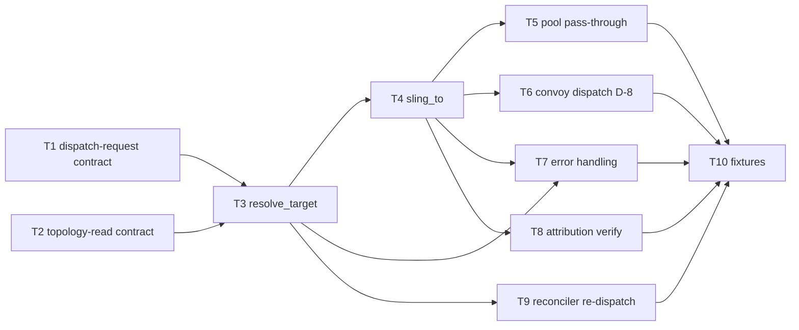

# C05 — Sling / dispatch (`sling-dispatch`)  (Build Plan, canonical track)

> Source / Spec ref: [`spec/C05-sling-dispatch.md`](../spec/C05-sling-dispatch.md)
> Canonical track. Sweep 2 (updated from Sweep 1). Depends on: C01 (Gas City substrate), C18 (reconciler / Health Patrol). Non-foundational routing seam in Runtime Substrate; Batch-2 per the [component inventory](../_meta/component-inventory.md) suggested batches.
> Binding decisions reflected: D-8 (Convoy→C05; Order→C40), D-6 (canonical track). OQs resolved: OQ-1 (authority split), OQ-2 (pool selection = substrate, needs-G11), OQ-3 (no C05 queue confirmed, back-pressure = substrate, needs-G11).

## 1. Work breakdown

| Task | Description | Size | Prerequisites |
|---|---|---|---|
| **T1** Freeze dispatch-request contract | Define the `DispatchRequest` field table (spec §3.4): `bead_id`, `target_role`, `template_name`, `routing_key`, `convoy_beads`, `created_by`, `tick_id`. Publish for C18/C09/C12 to build against. | S | C18 reconciler trigger shape; C09 binding-output shape (OQ-1 now resolved: C09 produces resolved key) |
| **T2** Freeze topology-read contract | Define how C05 reads the routable agents/pools from `city.toml` (C03): `[[agent]]` blocks + (later-phase) pool sets (spec §3.1 FAITHFUL-FILL). Read-only; no new store. Phase-0: one `[[agent]]` (dog role, min=0 per F11). | S | C03 `city.toml` agent/pool surface |
| **T3** Routing policy — `resolve_target` | Implement the authored routing policy: map `(target_role, template_name)` routing key to a `TargetRef` (agent name or pool name) from the topology. Errors: E-C05-01 (no-route), E-C05-02 (key-mismatch/pool-empty). Single-target path (Phase-0). | M | T1, T2 |
| **T4** Routing policy — `sling_to` | Wrap `gc sling <bead_id>` (the native mechanism — F5). Single-target: `gc sling <bead_id> --agent <name>`; pool: `gc sling <bead_id> --pool <pool_name>`. Error: E-C05-03 (dispatch-reject from substrate). Verify exactly one recipient results (INV-1). | S | T3, C04 session handoff, C01 `gc` binary |
| **T5** Pool pass-through | When target is a pool (later-phase path), route to the pool and let Gas City's **native** sling pick the member — no custom selection engine (OQ-2 resolved: substrate-owned, needs-G11). Verify INV-1 (single recipient). | S | T4, C03 pool-config surface |
| **T6** Convoy dispatch (D-8) | Implement `dispatch_convoy`: atomic multi-bead sling (D-8). Pass all bead_ids to `gc sling` in a single call; propagate E-C05-01/02/03 applied to the convoy as a unit. | S | T4 |
| **T7** Error handling + fail-loud | No-route (E-C05-01), pool-empty/key-mismatch (E-C05-02), dispatch-reject (E-C05-03) → loud error; bead left un-dispatched in C19 (INV-3). Never silent drop or mis-place (spec §6, INV-2/INV-3). | S | T3, T4, T5 |
| **T8** Verify native dispatch attribution | Verify "W → agent/role A under template T" is observable through **native** `created_by` (C41, D-29 `"kind:id"` wire format) + native event-bus append (C23) — C05 writes **no record/schema of its own** (custom dispatch-record dropped, SURVIVOR-PASS C05 DELTA-06). Confirm no payload mutation (INV-4, INV-5). | S | T4, C23 native event, C41 `created_by` |
| **T9** Reconciler re-dispatch integration | Verify the reconciler (C18) re-invokes C05 when a dispatched agent is unavailable on a later tick; `tick_id` field provides the dedup anchor for double-dispatch guard; work item is re-routed (F22 recovery, AC-C05-06). | S | T3, T7, C18 tick loop |
| **T10** Acceptance fixtures | The §8.1 concrete fixtures: AC-C05-01 through AC-C05-09 (single-agent route, key-mismatch negative, no-route negative, pool selection, re-dispatch, attribution check, dispatch-reject, convoy). | M | T3–T9 |

Most C05 work is **thin connective glue over Gas City's native dispatch** (sling is a built-in derived mechanism, AI-CONTEXT:92) plus the reconciler (C18) trigger and the C09 routing key. The faithful scope deliberately introduces no new dispatch engine, queue, or topology store — routing is a pure decision over (request, `city.toml` topology) with an additive record. The authored deliverable is the routing policy (T3, T4, T6, T7); the mechanism is Gas City's.

## 2. Dependency graph

- **Hard upstream:** C01 (sling is hosted by Gas City — the native dispatch C05 specs over) and C18 (the per-tick reconciler that *triggers* dispatch). C05 cannot be exercised end-to-end without the C18 trigger and a C04 session to hand off to.
- **Reference upstream:** C09 (supplies the resolved template/role routing key — OQ-1 resolved: C09 owns resolution, C05 receives already-resolved `target_role`+`template_name`) and C03 (`city.toml` topology). Both can be frozen against stubs (a fixed key, a one-agent `city.toml`).
- **Downstream consumers:** C04 (receives the handoff), C28 (executes after handoff), C12 (the formula step that asks for a route). These build against a C05 stub once T1/T2 contracts are frozen.
- **Critical path:** T1+T2 (freeze contracts) → T3 (resolve_target) → T4 (sling_to) → T7 (errors) → T10 (fixtures). T5 (pool), T6 (convoy), T8 (attribution), T9 (re-dispatch) are parallel branches off T3/T4; not on the longest chain.

## 3. Parallelization

- **T1 (dispatch-request contract)** and **T2 (topology-read contract)** are independent and can be authored concurrently — they touch disjoint surfaces (the trigger/key vs. the `city.toml` topology read).
- **T5 (pool pass-through)**, **T6 (convoy dispatch)**, **T8 (attribution)**, and **T9 (reconciler re-dispatch)** are all independent branches off T3/T4 and can run in parallel once T4 is done.
- **Fan-out point:** freezing T1+T2 (interfaces-first) unblocks C04/C28/C12 to build against a C05 stub *and* unblocks C05's own T3 — the highest-leverage early milestone.

## 4. Interfaces-first / contract milestones

Freeze these earliest so dependents build against stubs in parallel:
1. **Dispatch-request contract (T1):** `DispatchRequest{bead_id, target_role, template_name, routing_key?, convoy_beads?, created_by, tick_id?}` → handoff; single recipient (INV-1), key-faithful (INV-2). Lets C18 stub a trigger and C04 stub a handoff receiver. OQ-1 is resolved: C09 owns resolution and passes a resolved key; C05's inbound is always resolved.
2. **Topology-read contract (T2):** C05 reads routable `[[agent]]` blocks / pools from `city.toml` read-only (no new store). Publish "Phase 0 = exactly one `[[agent]]` (dog, min=0), pools later-phase" so C03 knows the surface C05 expects (spec §3.1 FAITHFUL-FILL; F11 confirms dog role).
3. **Error taxonomy (T7, early):** E-C05-01/02/03 defined early — downstream (C18, C12) must know what errors to handle. The error table (spec §6.1) is the contract.
4. **Native-attribution confirmation (T8, not a C05 contract):** confirm "W → agent/role A under template T" is observable via **native** `created_by` (C41, D-29 `"kind:id"` wire) + event-bus append (C23) — C05 owns no record schema. Nothing for C05 to freeze beyond verifying the native events fire.

## 5. Risks & de-risking order

1. **Pool member-selection is Gas City's, not ours (OQ-2, resolved).** OQ-2 is resolved: selection is substrate-owned. Risk: building a selection policy Gas City already provides (DELTA-03 dropped). Risk is now managed — T5 is a pass-through, not an engine. Residual: the concrete algorithm is needs-G11; T5 must be tested against the pinned `gc` binary to confirm behavior when multiple pool members exist.
2. **Back-pressure is not C05's (OQ-3, resolved).** OQ-3 is resolved: C05 holds no queue (INV-5). Risk is managed — E-C05-02 (pool-empty) surfaces the condition; the reconciler retry is the back-pressure mechanism. Residual: Gas City's native back-pressure behavior when all pool members are busy is needs-G11.
3. **Convoy (D-8) is a native sling primitive — confirm wire call.** D-8 confirms Convoy is a Gas City sling concept referenced by C05. T6's risk is whether a single `gc sling` call accepts multiple bead_ids atomically (needs-G11 against pinned `gc` binary). Until confirmed, T6 is specced as pass-through to the native mechanism.
4. **Reconciler→dispatch trigger is inferred, not v4-stated (RC05-01).** C05's entire inbound trigger (and the F22 re-dispatch story) assumes the C18 reconciler invokes sling, which v4 implies but never states (spec §2 `[FAITHFUL-FILL]`). De-risk by carrying this as the load-bearing assumption to confirm with the C18 author when C18 is built (Batch 3): if dispatch is instead triggered by a running formula (C12) step, T1's trigger source changes. Until then, model it as reconciler-driven and flag the alternative.
5. **Fail-loud routing semantics.** Risk: a no-target or mismatched route silently dropping/mis-placing a work item (work lost out of the graph). De-risk early with the negative fixtures (T10 AC-C05-02/AC-C05-04) so loud-error + leave-un-dispatched is proven, not assumed — this is the property the F22 reconciler recovery depends on.

## 6. G11 verification tasks

Two residuals from Sweep-2 OQ resolutions require a pinned `gc` install to close:

| G11 task | Spec location | What to verify |
|---|---|---|
| Pool member-selection algorithm | OQ-2, T5, AC-C05-03 | What selection policy does `gc sling --pool <name>` apply when N members are available? Round-robin, least-loaded, random? Observe the concrete behavior and annotate T5. |
| Native back-pressure on full pool | OQ-3, T7, E-C05-02 | What does `gc sling` return when all pool members are busy? Error code? Block? Queue internally? This determines whether E-C05-02 (pool-empty) is the only caller-observable signal or if there is additional substrate behavior. |
| Convoy wire call shape | T6, AC-C05-09 | Does `gc sling` accept multiple bead_ids in a single invocation atomically? What is the exact CLI syntax for a Convoy dispatch (D-8)? |

## 7. Definition of done

Per-component DoD (ties to spec §8 acceptance criteria):
- **T1/T2 done:** dispatch-request and topology-read contracts frozen and published for dependents; C09 seam confirmed as resolved-key-in (OQ-1).
- **T3 done:** `resolve_target` implemented; correctly routes a resolved `(target_role, template_name)` pair to a `TargetRef` from the `city.toml` topology; E-C05-01/02 raised on no-route/mismatch.
- **T4 done:** `sling_to` wraps `gc sling <bead_id>`; Phase-0 single-agent route hands the work item to exactly that agent's session (AC-C05-01); E-C05-03 raised on substrate rejection.
- **T5 done:** a target pool routed to Gas City's native sling yields exactly one recipient; no custom selection engine added (AC-C05-03); needs-G11 residual annotated.
- **T6 done:** `dispatch_convoy` issues a single atomic `gc sling` call for N beads to the same target (D-8); all-or-none error behavior (AC-C05-09); needs-G11 residual annotated.
- **T7 done:** no-route (E-C05-01), key-mismatch/pool-empty (E-C05-02), and dispatch-reject (E-C05-03) all raise loud errors and leave the work item un-dispatched — never silent drop or mis-place (AC-C05-02, AC-C05-04, AC-C05-08).
- **T8 done:** each routing decision is observable via native `created_by` (D-29 `"kind:id"` wire) + event-bus append (no C05-owned record); the bead's typed fields are otherwise unchanged (AC-C05-05, AC-C05-07).
- **T9 done:** the reconciler re-invokes C05 to re-route an unavailable agent's work across ticks (AC-C05-06, F22 recovery); `tick_id` dedup anchor in place.
- **T10 done:** all §8.1 fixtures (AC-C05-01 through AC-C05-09) pass.
- **Component done:** AC-C05-01…AC-C05-09 pass; OQ-1/OQ-2/OQ-3 resolutions confirmed; no new dispatch engine, queue, or topology store introduced beyond Gas City native + the `city.toml` read; D-8 Convoy pass-through verified; G11 residuals annotated; needs-G11 tasks scheduled for the D-23 spike run.
