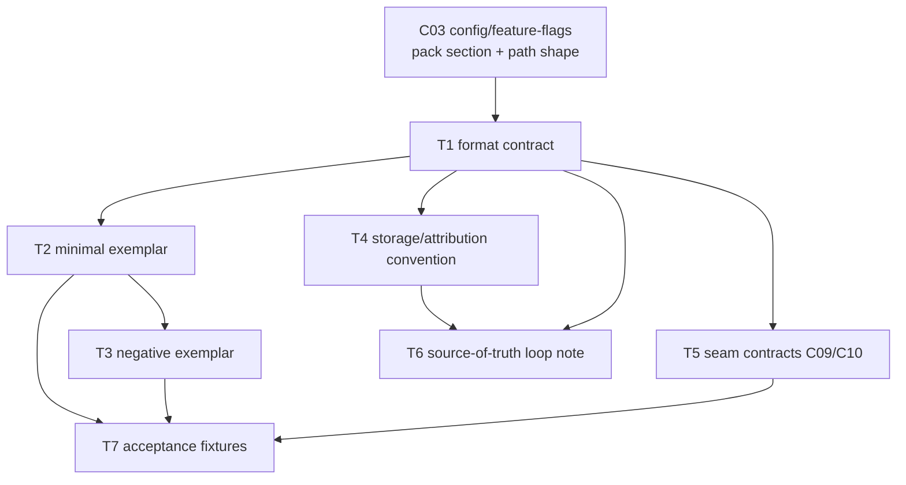

# C08 — Spec artifact & format (`spec-artifact`)  (Build Plan, Track A)

> Source / Spec ref: [`spec-faithful/C08-spec-artifact.md`](../spec-faithful/C08-spec-artifact.md)
> Inventory: C08, Spec Intake, artifact, foundational=yes. Depends on: C03. Track: A (faithful). Sweep: 1.

C08 is an **artifact + format**, not a running service: most of "building C08" is *deciding and documenting the format contract* and providing the minimal conformance scaffolding so dependents (C09, C10, C11, C39, C51/C52) can build against a frozen shape. This plan is correspondingly thin on code and heavy on contract-freezing — which is exactly what makes it high-leverage on the critical path (C08 is in Batch 1, foundational).

## 1. Work breakdown

| Task | Description | Size | Prereqs |
|---|---|---|---|
| **T1 — Format contract doc** | Write the authoritative statement of the spec format: it is a Go `text/template` over Markdown at `agents/<name>/prompt.template.md` inside a git-versioned pack (spec §3, §4; README:106-107). Capture INV-1/2/3. This *is* the artifact for a format-kind component. | S | C03 path/section shape known |
| **T2 — Minimal conformant exemplar** | Author one minimal valid `agents/<name>/prompt.template.md` (the Phase-0 "smallest viable install" spec, AI-CONTEXT §3.4) that renders and drives a trivial run. Serves as the format model dependents build against. | S | T1 |
| **T3 — Negative exemplar** | Author a deliberately non-renderable spec (broken Go-template syntax) to anchor AC-2 (renderable invariant) and give C09/C10 a failure fixture. | S | T1, T2 |
| **T4 — Storage + attribution convention** | Document the pack/git layout that makes a spec "version-controlled, attributable" (README:107): where in the pack it lives, how a revision = a commit, how actor identity (C41) rides git. No new tooling — convention + verification that Gas City + git deliver it. | S | T1 |
| **T5 — Seam contracts (C08→C09, C08→C10)** | Freeze the two outbound contracts: (a) render contract — the file parses as Go `text/template` and exposes a stable `<name>` identity for formula reference; (b) lint contract — the Markdown body is the input surface for EARS/INCOSE rules. Named in spec §3.2; this task pins them so C09/C10 can stub. | M | T1 |
| **T6 — Source-of-truth loop wiring note** | Document how the "fix the spec, not the output" loop closes at the C08 boundary: a `fix_task` (C39) targets a spec revision; rebuild re-renders the new revision. C08's deliverable is the *contract that the spec is the fixable surface*; loop bound/termination is C39's (deferred per spec §5, G18). | S | T1, T4 |
| **T7 — Acceptance fixtures** | Encode AC-1…AC-5 (spec §8) as checkable fixtures: format-defined (doc exists), renderable (T2 passes / T3 fails), versioned+attributable (commit carries actor), lintable surface (C10 can read body), loop (a fix routes to a spec edit). | M | T2, T3, T5 |

No source-level Gas City work, no Go fork (AI-CONTEXT §3.5, §11.1: v4 extends via packs only). T2/T3 are pack files; everything else is documentation + fixtures.

## 2. Dependency graph

- **Inbound critical-path gate:** C08 needs only the **C03** pack-section/path shape settled (where `agents/<name>/prompt.template.md` sits and how its presence is gated). C03 is itself Batch-1 foundational, so this is a same-wave coordination, not a blocking wait.
- **Outbound:** C08 gates **C09, C10, C11, C39, C51/C52**. Freezing T5 (seam contracts) early unblocks all of them; the rest of C08 (T2-T4, T6, T7) can finish in parallel with dependents' early stubbing.
- **Critical path inside C08:** T1 → T5 (the seam freeze) is the longest leverage path; everything dependents need flows through T1 then T5.

## 3. Parallelization

After **T1** lands (the format contract), three independent workstreams fan out:

- **WS-A (exemplars):** T2 → T3 → contributes to T7.
- **WS-B (storage/loop):** T4 → T6.
- **WS-C (seams):** T5 (this is the dependent-unblocking stream; prioritize it).

WS-A, WS-B, WS-C are disjoint files and can be authored concurrently. T7 (acceptance fixtures) is the join point — it consumes outputs of all three.

## 4. Interfaces-first / contract milestones

Freeze these **first** so dependents build against stubs:

1. **M1 — Format identity (from T1).** "A spec is `agents/<name>/prompt.template.md`, a Go `text/template` over Markdown, in a git pack." Everything else references this.
2. **M2 — Render/binding seam (from T5a).** The stable `<name>` identity and the renderability guarantee that **C09** binds against. This is the single most dependent-blocking contract; freeze it before C09 starts.
3. **M3 — Lint surface seam (from T5b).** The Markdown-body-as-lint-input contract that **C10** consumes.
4. **M4 — Attribution convention (from T4).** The "revision = commit = attributable" rule that **C41** and audit/override (C35) rely on.

Milestone order: M1 → (M2 ∥ M3 ∥ M4). M2 is the priority gate for the Batch-2 build flow.

## 5. Risks & de-risking order

Spike in this order to retire the most uncertainty earliest:

1. **R1 — The spec/prompt-template collapse (spec OQ-1, highest).** v4 equates "spec" with `prompt.template.md`, but the one-shot-specs corpus shows real dark-factory specs as *standalone target-system Markdown* the prompt template may merely reference. **De-risk first:** prototype T2 as both (a) a self-contained prompt-template spec and (b) a prompt template that *references* a larger spec doc, and confirm which the faithful README:106 reading supports before freezing M1. Getting this wrong reshapes every dependent. (→ review-log.)
2. **R2 — INV-2 renderability as a hard gate.** [FAITHFUL-FILL] in spec §3.3 — v4 doesn't state "must parse as a valid Go template" explicitly. T3 (negative exemplar) is the spike that confirms C09 can't render a malformed template, validating the inferred invariant before dependents assume it.
3. **R3 — Internal-schema temptation.** Spec §4 holds the body free-form (faithful). Risk is a dependent (C10/C11) *requiring* structure and back-pressuring a schema into C08 (an architectural addition Track A may not make). De-risk by documenting in M3 that structure is C10's optional concern, not a C08 format change.
4. **R4 — C03 coupling.** C08's storage location depends on C03's pack-section model. Low risk (both Batch-1), but confirm the path/section shape with the C03 author before T4 finalizes.

## 6. Definition of done

**Per-task DoD** ties to the spec's acceptance criteria (spec §8):

- T1 done ⇒ AC-1 (format defined): the format-contract doc states form + path + version-control + attribution.
- T2 done ⇒ AC-2 (renderable, positive): minimal exemplar parses as Go `text/template` and drives a trivial run.
- T3 done ⇒ AC-2 (renderable, negative): malformed exemplar fails render as expected.
- T4 done ⇒ AC-3 (versioned + attributable): a spec revision resolves to a commit + actor identity.
- T5 done ⇒ AC-4 (lintable surface) + the C09 render/binding seam is frozen (M2/M3).
- T6 done ⇒ AC-5 (source-of-truth loop): a documented + fixture-backed path where a failure routes to a *spec* edit and rebuild.
- T7 done ⇒ all of AC-1…AC-5 are mechanically checkable fixtures.

**Per-component DoD:**
1. All five acceptance criteria (AC-1…AC-5) pass via T7 fixtures.
2. M1-M4 contracts are frozen and published so C09/C10/C11/C39/C51-C52 can build against them.
3. The G16 disposition (spec OQ / §9) is recorded: C08's grounding principle (P1) is stable under G16; the P12-substitution question is deferred to the architecture-level owner (C57). No C08 format change follows.
4. The spec's [FAITHFUL-FILL] inferences (artifact=prompt-template collapse; INV-2 renderability; free-form body; chunk = one template per role) are surfaced to the review-log so a later sweep / Track-B comparison can revisit them.
5. No Go fork, no source-level Gas City modification (AI-CONTEXT §3.5, §11.1) — extension is pack-only.
