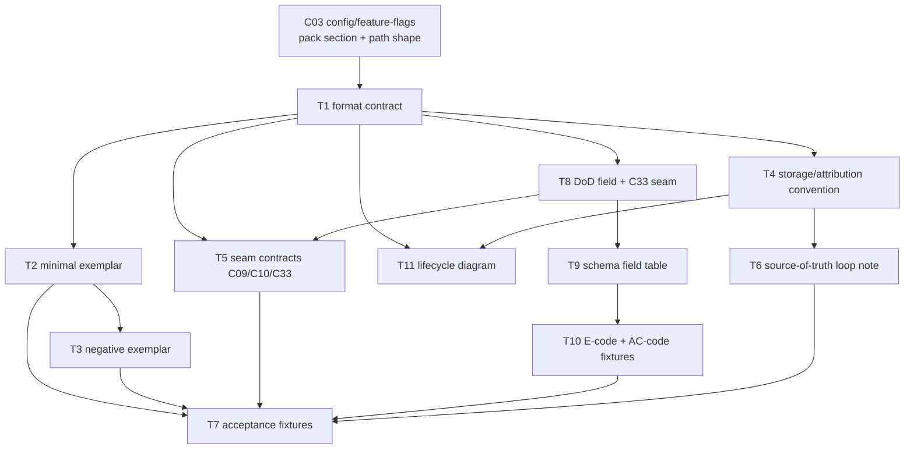

# C08 — Spec artifact & format (`spec-artifact`)  (Build Plan, canonical track)

> Source / Spec ref: [`spec/C08-spec-artifact.md`](../spec/C08-spec-artifact.md)
> Inventory: C08, Spec Intake, artifact, foundational=yes. Depends on: C03. Track: A (faithful). Sweep: 2.

C08 is an **artifact + format**, not a running service: most of "building C08" is *deciding and documenting the format contract* and providing the minimal conformance scaffolding so dependents (C09, C10, C11, C39, C51/C52) can build against a frozen shape. This plan is correspondingly thin on code and heavy on contract-freezing — which is exactly what makes it high-leverage on the critical path (C08 is in Batch 1, foundational).

Sweep-2 additions: T8 (DoD field + C33 seam), T9 (schema field table), T10 (E-code + AC-code fixtures), T11 (lifecycle diagram verification). T1–T7 are carried forward from Sweep-1; their DoDs are now subsumed by the Sweep-2 acceptance tests (§8.1 of spec).

## 1. Work breakdown

| Task | Description | Size | Prereqs |
|---|---|---|---|
| **T1 — Format contract doc** | Write the authoritative statement of the spec format: it is a Go `text/template` over Markdown at `agents/<name>/prompt.template.md` inside a git-versioned pack (spec §3, §4; README:106-107). Capture INV-1/2/3/4. | S | C03 path/section shape known |
| **T2 — Minimal conformant exemplar** | Author one minimal valid `agents/<name>/prompt.template.md` (the Phase-0 "smallest viable install" spec, AI-CONTEXT §3.4) that renders and drives a trivial run. Includes a free-form DoD section (INV-4). Serves as the format model dependents build against. | S | T1 |
| **T3 — Negative exemplar** | Author a deliberately non-renderable spec (broken Go-template syntax — unescaped `{{`) to anchor AC-2/AC-C08-02 (E-C08-01 assertion) and give C09/C10 a failure fixture. | S | T1, T2 |
| **T4 — Storage + attribution convention** | Document the pack/git layout that makes a spec "version-controlled, attributable" (README:107): where in the pack it lives, how a revision = a commit, how actor identity (C41) rides git via the D-29 `"kind:id"` wire type. No new tooling — convention + verification that Gas City + git deliver it. | S | T1 |
| **T5 — Seam contracts (C08→C09, C08→C10, C08→C33)** | Freeze the three outbound contracts: (a) render contract — the file parses as Go `text/template` and exposes a stable `<name>` identity for formula reference; (b) lint contract — the Markdown body is the input surface for EARS/INCOSE rules; (c) DoD scoring contract — the free-form DoD prose string is the C33/C32 input, free-form at Sweep-2, FE-5 deferred (D-15). Named in spec §3.2; this task pins them so C09/C10/C33 can stub. | M | T1, T8 |
| **T6 — Source-of-truth loop wiring note** | Document how the "fix the spec, not the output" loop closes at the C08 boundary: a `fix_task` (C39) carries `spec_ref` (C20 §4.5.2) pointing to the spec; rebuild re-renders the new revision. C08's deliverable is the *contract that the spec is the fixable surface*; loop bound/termination is C39's. | S | T1, T4 |
| **T7 — Acceptance fixtures** | Encode AC-1…AC-5 + AC-C08-01…AC-C08-08 (spec §8/§8.1) as checkable fixtures. Covers: format-defined (doc exists), renderable (T2 passes / T3 fails E-C08-01), DoD-present (T2 positive / DoD-absent negative E-C08-02), versioned+attributable, lintable surface, loop (a fix routes to a spec edit). | M | T2, T3, T5, T8, T9, T10 |
| **T8 — DoD field + C33 seam (Sweep-2)** | Document the free-form DoD as a logical field within `spec_body` (spec §4.1). Write the seam contract: C33 extracts the DoD text and passes it verbatim to C32's graded judge; the DoD is free-form prose at Sweep-2; FE-5 (enumerated per-criterion) is deferred (D-15 verbatim citation in spec §4.1). No enumerated checklists, no per-criterion IDs. | S | T1 |
| **T9 — Schema field table (Sweep-2)** | Author the C08 spec artifact schema (spec §4.1): Field/Type/Req/Semantics/R-W-by for all six logical fields (`spec_id`, `spec_body`, `dod`, `git_revision`, `actor`, `work_type`, `pack_ref`). This is the format contract in table form that downstream schemas (C20 `fix_task.spec_ref`, C09 `resolve()`) reference. | S | T1, T8 |
| **T10 — E-code + AC-code fixtures (Sweep-2)** | Author the error taxonomy table (E-C08-01…E-C08-06, spec §6.1) and concrete acceptance tests (AC-C08-01…AC-C08-08, spec §8.1) with E↔AC cross-references. These are the testable assertions that verify the format contract holds at a real `gc` install. | M | T2, T3, T8, T9 |
| **T11 — Lifecycle state diagram (Sweep-2)** | Author the `stateDiagram-v2` spec lifecycle diagram (spec §5.1): Draft → Committed → Rendered → InRun → Scored → Current / FixTargeted → Superseded. Validate Mermaid syntax (no `;` in labels, ASCII-simple state IDs). | S | T1, T6 |

No source-level Gas City work, no Go fork (AI-CONTEXT §3.5, §11.1: v4 extends via packs only). T2/T3 are pack files; everything else is documentation + fixtures.

## 2. Dependency graph

- **Inbound critical-path gate:** C08 needs only the **C03** pack-section/path shape settled and the D-15 DoD-field ruling confirmed (both satisfied at Sweep-2). C03 is Batch-1 foundational; D-15 is an adopted decision.
- **Outbound:** C08 gates **C09, C10, C11, C33, C39, C51/C52**. Freezing T5 (seam contracts, including the DoD/C33 seam) early unblocks all of them; the rest of C08 (T2-T4, T6-T11) can finish in parallel with dependents' early stubbing.
- **Critical path inside C08:** T1 → T8 → T5 → T7 (the seam freeze that unblocks dependents); T1 → T9 → T10 → T7 (the schema + error-code fixtures).

## 3. Parallelization

After **T1** lands (the format contract) and **T8** lands (DoD field + D-15 ruling), four independent workstreams fan out:

- **WS-A (exemplars):** T2 → T3 → contributes to T7.
- **WS-B (storage/loop/diagram):** T4 → T6 → T11.
- **WS-C (seams):** T5 (priority — dependent-unblocking stream; freeze C09/C10/C33 stubs).
- **WS-D (schema/errors/ACs):** T9 → T10 → contributes to T7.

WS-A, WS-B, WS-C, WS-D are disjoint concerns and can be authored concurrently. T7 (acceptance fixtures) is the join point — it consumes outputs of all four.

## 4. Interfaces-first / contract milestones

Freeze these **first** so dependents build against stubs:

1. **M1 — Format identity (from T1).** "A spec is `agents/<name>/prompt.template.md`, a Go `text/template` over Markdown, in a git pack, with a free-form DoD prose section." Everything else references this.
2. **M2 — Render/binding seam (from T5a).** The stable `<name>` identity and the renderability guarantee that **C09** binds against. This is the single most dependent-blocking contract; freeze it before C09 starts.
3. **M3 — Lint surface seam (from T5b).** The Markdown-body-as-lint-input contract that **C10** consumes.
4. **M4 — Attribution convention (from T4).** The "revision = commit = attributable" rule that **C41** and audit/override (C35) rely on. Actor wire type = `"kind:id"` per D-29.
5. **M5 — DoD seam (from T8).** The free-form DoD field that **C33** extracts and passes to **C32**. Free-form prose at Sweep-2; no enumerated per-criterion structure (FE-5/deferred, D-15). This seam is new at Sweep-2 and must be frozen before C33/C32 can build against C08.

Milestone order: M1 → M5 (parallel with M2/M3/M4) → all dependents can build stubs. M2 is the priority gate for the Batch-2 build flow; M5 is the priority gate for the satisfaction-scoring tier (C32/C33).

## 5. Risks & de-risking order

Spike in this order to retire the most uncertainty earliest:

1. **R1 — OQ-1 resolved (Sweep-2, spec §1).** The C08↔C09 seam is now named and frozen: the canonical track collapses spec = `prompt.template.md`; C09 reads the file body at the pack path; no `spec_id` indirection. Risk retired.
2. **R2 — INV-2 renderability + E-C08-01.** [FAITHFUL-FILL] in spec §3.3 — v4 doesn't state "must parse as a valid Go template" explicitly. T3 (negative exemplar) is the spike that confirms C09 returns `BindingError{kind: template-parse-error}` on a malformed file, validating the inferred invariant before dependents assume it.
3. **R3 — DoD-field extraction (C33 seam, OQ-2 residual).** The DoD is a logical field in free-form prose; C33 must extract it from the spec body. The risk is that C33 needs a structural convention (e.g., a "## Definition of Done" heading) that C08's free-form body doesn't guarantee. De-risk: author T2 exemplar with a visible DoD heading; document that C10 *may optionally* require it (OQ-2 — a C10 structural rule, not a C08 format change). AC-C08-03/04 verify the seam.
4. **R4 — Internal-schema temptation.** Spec §4 holds the body free-form (faithful). Risk is a dependent (C10/C11) *requiring* structure and back-pressuring a schema into C08 (an architectural addition the canonical track may not make). De-risk by documenting in M3 that structure is C10's optional concern, not a C08 format change.
5. **R5 — C03 coupling.** C08's storage location depends on C03's pack-section model. Low risk (both Batch-1), but confirm the path/section shape with the C03 author before T4 finalizes. (D-33 confirms C03 owns the CapabilityDescriptor; C08 carries no capability machinery itself.)

## 6. Definition of done

**Per-task DoD** ties to the spec's acceptance criteria (spec §8/§8.1):

- T1 done ⇒ AC-1 + AC-C08-01: the format-contract doc states form + path + version-control + attribution + DoD field.
- T2 done ⇒ AC-2 + AC-C08-01 (positive): minimal exemplar parses as Go `text/template`, includes DoD prose, and drives a trivial run.
- T3 done ⇒ AC-2 + AC-C08-02 (negative / E-C08-01): malformed exemplar with unescaped `{{` fails render as expected.
- T4 done ⇒ AC-3 + AC-C08-08: a spec revision resolves to a commit + actor identity in D-29 `"kind:id"` wire form.
- T5 done ⇒ AC-4 + AC-C08-03: the C09 render/binding seam, the C10 lint surface, and the C33/C32 DoD-scoring seam are all frozen (M2/M3/M5).
- T6 done ⇒ AC-5 + AC-C08-07: a documented + fixture-backed path where a failure routes to a *spec* edit (with `fix_task.spec_ref` pointing to the C08 artifact) and rebuild.
- T7 done ⇒ all of AC-1…AC-5 + AC-C08-01…AC-C08-08 are mechanically checkable fixtures.
- T8 done ⇒ DoD field is in the schema table, D-15 is cited verbatim, FE-5 is explicitly deferred, and the C33 seam is frozen.
- T9 done ⇒ the schema field table (§4.1) is complete with Field/Type/Req/Semantics/R-W-by for all fields.
- T10 done ⇒ E-C08-01…E-C08-06 are in the error table, AC-C08-01…AC-C08-08 are in the AC table, and E↔AC cross-references are complete.
- T11 done ⇒ the `stateDiagram-v2` lifecycle diagram is in spec §5.1 and passes Mermaid syntax validation (no `;` in labels, ASCII-simple state IDs, no `--` or `()` in labels).

**Per-component DoD (Sweep-2):**
1. All acceptance criteria (AC-1…AC-5 + AC-C08-01…AC-C08-08) pass via T7 fixtures.
2. M1-M5 contracts are frozen and published so C09/C10/C11/C33/C39/C51-C52 can build against them.
3. OQ-1 is marked **RESOLVED (Sweep-2)** in spec §9 with the C08↔C09 seam named and registered with the orchestrator.
4. D-15 is cited verbatim in spec §4.1; FE-5/enumerated per-criterion DoD is explicitly deferred.
5. The error taxonomy (E-C08-01…06) and AC-code table (AC-C08-01…08) are in the spec with E↔AC cross-references.
6. The `stateDiagram-v2` lifecycle diagram is in spec §5.1, syntax-valid.
7. The G16 disposition is recorded: C08's grounding principle (P1) is stable under G16; the P12-substitution question is deferred to C57.
8. No Go fork, no source-level Gas City modification (AI-CONTEXT §3.5, §11.1) — extension is pack-only.
9. The spec's [FAITHFUL-FILL] inferences are preserved; the [AMBIGUITY: OQ-1] block is preserved with the RESOLVED annotation added (not deleted).
