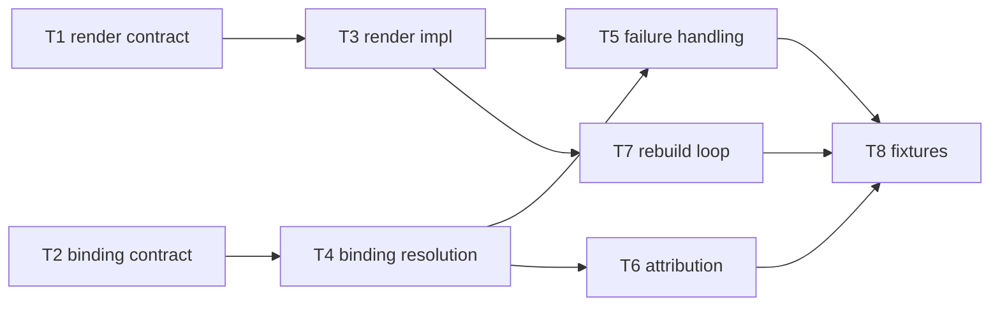

# C09 — Prompt template & spec→execution binding (`prompt-template-binding`)  (Build Plan, Track A)

> Source / Spec ref: [`spec/C09-prompt-template-binding.md`](../spec/C09-prompt-template-binding.md)
> Track A (faithful). Sweep 1. Depends on: C08 (spec artifact), C05 (sling/dispatch). Foundational interface in Spec Intake; Batch-2 per the [component inventory](../_meta/component-inventory.md) suggested batches.

## 1. Work breakdown

| Task | Description | Size | Prerequisites |
|---|---|---|---|
| **T1** Freeze render contract | Define the render interface (template body + render context → instruction string) and INV-1 determinism property. Names the inbound template-source + render-context interfaces (spec §3.1–3.2). | S | C08 INV-2 (template is valid Go `text/template`) frozen |
| **T2** Freeze binding contract | Define `formula-node → template-name → agent-role` resolution at dispatch and INV-2 binding-uniqueness. Names the binding-request interface (spec §3.1). | S | C05 dispatch interface shape; C12 formula template-reference shape |
| **T3** Render implementation (Phase-0 pass-through) | Implement Go `text/template` render: empty-context pass-through (AI-CONTEXT:542) first, then variable substitution. Wraps Gas City's native prompt-template render — no new engine. | M | T1 |
| **T4** Binding resolution | Resolve a formula-node template name to the concrete `agents/<name>/prompt.template.md` for the target agent role via Gas City's native pack convention; surface zero/multi-resolution as a dispatch error (INV-2). | M | T2 |
| **T5** Failure handling | Render-failure (parse error / undefined required var) and binding-ambiguity → loud dispatch error, never a partial/empty prompt (spec §6, AC-4/AC-5). | S | T3, T4 |
| **T6** Attribution wiring | Ensure the binding decision (which template revision drove which work item) rides the dispatch record + pack git revision + C41 identity (spec §3.2, INV-4). No new store. | S | T4, C41 identity hook |
| **T7** Rebuild-loop integration | Verify a C08 spec revision causes C09 to re-render the new revision on next dispatch (Principle-1 "rebuild" half; AC-6). | S | T3, C08 revision flow, C39 fix-task (downstream, stub OK) |
| **T8** Acceptance fixtures | The §8 fixtures: minimal pass-through render, variable render (determinism), negative un-renderable, binding-resolves-to-one + negatives, rebuild fixture, no-methodology-leak check. | M | T3–T7 |

Most C09 work is **thin connective glue over Gas City's native machinery** (render = Gas City prompt-template render; routing = sling C05; binding = pack naming convention). The faithful scope deliberately introduces no new engine, store, or registry.

## 2. Dependency graph

- **Hard upstream:** C08 (template must be a valid renderable artifact — INV-2) and C05 (sling supplies the dispatch the binding hooks into). C09 cannot fully validate without both.
- **Reference upstream:** C12 (a formula node names the template C09 resolves) — needed for T2/T4 but the *name→template* convention can be frozen against a C12 stub.
- **Downstream consumers:** C28 (agent loop consumes the rendered instruction), C13 (molecule supplies render variables), C39 (fix-task re-enters the rebuild loop). These can build against a C09 stub once T1/T2 contracts are frozen.
- **Critical path:** T1+T2 (freeze contracts) → T3+T4 (render+bind) → T5 (failures) → T8 (fixtures). T6/T7 hang off T4/T3 respectively and are not on the longest chain.

## 3. Parallelization

- **T1 (render contract)** and **T2 (binding contract)** are independent and can be authored concurrently — they are the two halves of the spec and touch disjoint surfaces (render vs. routing).
- **T3 (render impl)** and **T4 (binding resolution)** can then proceed in parallel, each gated only on its own contract.
- **T6 (attribution)** and **T7 (rebuild loop)** are independent of each other and can run concurrently once T4/T3 land.
- **Fan-out point:** freezing T1+T2 (interfaces-first) unblocks C28/C13/C39 to build against C09 stubs *and* unblocks C09's own T3/T4 — this is the highest-leverage early milestone.

## 4. Interfaces-first / contract milestones

Freeze these earliest so dependents build against stubs in parallel:
1. **Render contract (T1):** `(template_body, render_context) → instruction_string`, deterministic (INV-1); undefined-required-variable ⇒ error. Lets C28 stub an instruction consumer.
2. **Binding contract (T2):** `formula-node template-name → exactly-one (agent-role, template)` at dispatch; zero/multi ⇒ error (INV-2). Lets C05/C12 wire references against a known resolution rule.
3. **Render-context schema (deferred to sweep 2 but stub now):** at Phase 0 the context may be empty (pass-through); publish "no required variables at Phase 0" so C13 knows it owes nothing yet (spec §3.1 FAITHFUL-FILL, OQ-2).

## 5. Risks & de-risking order

1. **C08↔C09 seam (OQ-1) — highest.** Spike *first*: confirm the faithful collapse (template file = spec artifact) with the C08 author before building T3, because the optimized track's DELTA-01 (`spec_id` reference) would add an inbound resolution step to T3. De-risk by freezing the inbound contract as "template body = spec" under Track A and documenting the single insertion point (resolve `spec_id`) if the integrator later adopts the split.
2. **Template-variable namespace (OQ-2).** Risk: building variable substitution before any consumer needs variables. Mitigate by shipping Phase-0 pass-through (T3 first slice) and deferring the variable schema to sweep 2 — v4 names no variables, so this is low at sweep 1.
3. **Binding-registry vs. convention (OQ-3).** Risk: over-building a registry v4 doesn't name. Mitigate by implementing the naming convention (pack layout) and only revisiting if a many-templates-per-role need appears.
4. **Render/binding fail-loud semantics.** Risk: a malformed template silently yielding a degraded prompt (the F37-adjacent failure). De-risk early with the negative fixtures (T8 AC-4/AC-5) so fail-loud is proven, not assumed.

## 6. Definition of done

Per-component DoD (ties to spec §8 acceptance criteria):
- **T1/T2 done:** render and binding contracts frozen and published for dependents (AC-1, AC-3).
- **T3 done:** conformant template renders deterministically; empty-context pass-through works (AC-1, AC-2).
- **T4 done:** formula-node name resolves to exactly one template for the agent role (AC-3).
- **T5 done:** un-renderable template and zero/multi binding both raise a dispatch error — never a partial prompt (AC-4, AC-5).
- **T6 done:** the binding decision is attributable via dispatch record + pack git revision + C41 (INV-4).
- **T7 done:** a C08 revision re-renders on next dispatch (rebuild loop, AC-6).
- **T8 done:** all §8 fixtures pass, including no-methodology-leak (AC-7).
- **Component done:** AC-1…AC-7 pass; OQ-1 reconciliation explicitly resolved with the C08 author (collapse confirmed, or the `spec_id`-reference insertion point adopted); no new store/registry/engine introduced beyond Gas City native + the binding convention.
