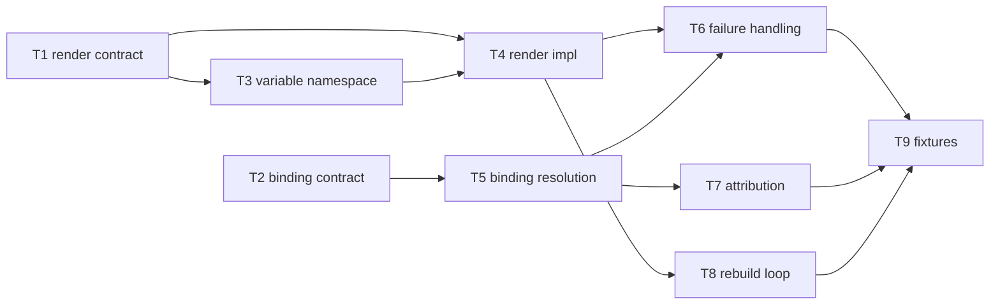

# C09 — Prompt template & spec→execution binding (`prompt-template-binding`)  (Build Plan, canonical track)

> Source / Spec ref: [`spec/C09-prompt-template-binding.md`](../spec/C09-prompt-template-binding.md)
> Canonical track. Sweep 2. Depends on: C08 (spec artifact), C05 (sling/dispatch). Foundational interface in Spec Intake; Batch-2 per the [component inventory](../_meta/component-inventory.md) suggested batches.

## 1. Work breakdown

| Task | Description | Size | Prerequisites |
|---|---|---|---|
| **T1** Freeze render contract | Define the render interface (template body + render context → instruction string) and INV-1 determinism property. Names the inbound template-source + render-context interfaces (spec §3.1–3.2). **Sweep-2 additions:** concrete `resolve`/`render`/`bind_and_render` signatures (spec §3.1b); `BoundTemplate` schema (spec §4.1). | S | C08 INV-2 (template is valid Go `text/template`) frozen |
| **T2** Freeze binding contract | Define `formula-node → template-name → agent-role` resolution at dispatch and INV-2 binding-uniqueness. Names the binding-request interface (spec §3.1). **Sweep-2 additions:** OQ-3 RESOLVED — naming-convention binding (spec §3.2b); authority chain C12→C09→C05 (spec §3.1a). | S | C05 DispatchRequest field table (§3.4) frozen; C12 formula template-reference shape |
| **T3** Template-variable namespace | **Sweep-2 new.** Define the canonical variable namespace (§3.2a table: `{{.TemplateName}}`, `{{.AgentRole}}`, `{{.PackGitRev}}`, `{{.BeadId}}`, `{{.CreatedBy}}`); implement the `pack.toml [template_vars]` escape hatch convention; wire Phase-0 pass-through (zero variables). | S | T1, C08 pack.toml convention |
| **T4** Render implementation (Phase-0 pass-through) | Implement Go `text/template` render: empty-context pass-through (AI-CONTEXT:542) first, then variable substitution from the §3.2a namespace. Wraps Gas City's native prompt-template render — no new engine. | M | T1, T3 |
| **T5** Binding resolution | Resolve a formula-node template name to the concrete `agents/<name>/prompt.template.md` for the target agent role via the OQ-3 pack-convention (city.toml `[[agent]]` lookup); surface zero/mis-resolution as E-C09-01/E-C09-03 dispatch errors (INV-2). | M | T2 |
| **T6** Failure handling | E-C09-01 (template-not-found), E-C09-02 (unbound-variable), E-C09-03 (role-mismatch), E-C09-04 (template-parse-error) → loud dispatch errors, never a partial/empty prompt (spec §6.1). Each error leaves the bead un-dispatched. | S | T4, T5 |
| **T7** Attribution wiring | Ensure the binding decision (which template revision drove which work item) rides the dispatch record + pack git revision (`BoundTemplate.pack_git_rev`) + C41 identity (spec §4.1, INV-4). No new store. | S | T5, C41 identity hook |
| **T8** Rebuild-loop integration | Verify a C08 spec revision causes C09 to re-render the new revision on next dispatch (Principle-1 "rebuild" half; AC-C09-08). | S | T4, C08 revision flow, C39 fix-task (downstream, stub OK) |
| **T9** Acceptance fixtures | The §8.1 AC-code fixtures: AC-C09-01 (pass-through), AC-C09-02 (determinism), AC-C09-03 (variable injection), AC-C09-04 (E-C09-02), AC-C09-05 (E-C09-01), AC-C09-06 (E-C09-03), AC-C09-07 (E-C09-04), AC-C09-08 (rebuild), AC-C09-09 (no-methodology-leak), AC-C09-10 (C05 handoff). | M | T4–T8 |

Most C09 work is **thin connective glue over Gas City's native machinery** (render = Go `text/template` Execute; routing = sling C05; binding = pack naming convention over city.toml). The faithful scope deliberately introduces no new engine, store, or registry.

## 2. Dependency graph

- **Hard upstream:** C08 (template must be a valid renderable artifact — INV-2; `pack.toml [template_vars]` convention lives here) and C05 (sling supplies the DispatchRequest the routing key seam wires into). C09 cannot fully validate without both.
- **Hard upstream:** C03 (city.toml `[[agent]]` declarations — the OQ-3 binding convention; C09 reads these at resolve time).
- **Reference upstream:** C12 (a formula node names the template C09 resolves) — needed for T2/T5 but the *name→template* convention can be frozen against a C12 stub.
- **Lateral:** C13 (molecule/bead supplies the RenderContext variables — T3/T4). Can build against a stub once the §3.2a namespace is frozen.
- **Downstream consumers:** C28 (agent loop consumes the rendered instruction), C39 (fix-task re-enters the rebuild loop). These can build against a C09 stub once T1+T2 contracts are frozen.
- **Critical path:** T1+T2 (freeze contracts) → T3+T4+T5 (namespace + render + bind) → T6 (failures) → T9 (fixtures). T7/T8 hang off T5/T4 respectively and are not on the longest chain.

## 3. Parallelization

- **T1 (render contract)** and **T2 (binding contract)** are independent and can be authored concurrently — they are the two halves of the spec and touch disjoint surfaces (render vs. routing).
- **T3 (variable namespace)** can proceed in parallel with T2 once T1 is frozen — it is a T1 elaboration, not a T2 dependency.
- **T4 (render impl)** and **T5 (binding resolution)** can proceed in parallel, each gated on its own contract (T1/T3 and T2 respectively).
- **T7 (attribution)** and **T8 (rebuild loop)** are independent of each other and can run concurrently once T5/T4 land.
- **Fan-out point:** freezing T1+T2 (interfaces-first) unblocks C28/C13/C39 to build against C09 stubs *and* unblocks C09's own T3–T5 — this is the highest-leverage early milestone.

## 4. Interfaces-first / contract milestones

Freeze these earliest so dependents build against stubs in parallel:
1. **Render contract (T1) + Signatures (§3.1b):** `resolve`/`render`/`bind_and_render` signatures with typed params and `BoundTemplate` schema (§4.1); determinism guarantee (INV-1). Lets C28 stub an instruction consumer.
2. **Binding contract (T2) + OQ-3 convention (§3.2b):** `formula-node template-name → exactly-one (agent-role, template)` via pack-layout naming convention (city.toml `[[agent]]`); zero/mis-resolution → E-C09-01/E-C09-03. Lets C05/C12 wire references against a known resolution rule.
3. **Variable namespace (T3 / §3.2a):** canonical six-variable namespace; `pack.toml [template_vars]` escape hatch; Phase-0 is zero-variable pass-through. Lets C13 know exactly what it owes at dispatch time.
4. **E-code table (§6.1):** E-C09-01..04 published so C05/C18 can handle the error returns from `bind_and_render` before C09's full implementation is available.

## 5. Risks & de-risking order

1. **C08↔C09 seam (OQ-1) — highest.** Spike *first*: confirm the faithful collapse (template file = spec artifact) with the C08 author before building T4, because the optimized track's DELTA-01 (`spec_id` reference) would add an inbound resolution step to T4. De-risk by freezing the inbound contract as "template body = spec" under the canonical track and documenting the single insertion point (resolve `spec_id`) if the integrator later adopts the split. OQ-1 is RESOLVED in the spec §3.1a; the risk is residual integration confirmation only.
2. **OQ-2 RESOLVED — variable namespace is concrete.** The §3.2a table is now the canonical Phase-0 namespace. Risk shifts to: C13 must inject `BeadId`/`CreatedBy` at dispatch time. Mitigate by freezing the namespace in T3 before T4 builds the render step.
3. **OQ-3 RESOLVED — naming convention is concrete.** The city.toml `[[agent]]` lookup is the binding. Risk: if a pack uses a non-standard agent naming that doesn't map cleanly, E-C09-03 surfaces. Mitigate by testing AC-C09-06 (role-mismatch) early.
4. **Render/binding fail-loud semantics.** Risk: a malformed template silently yielding a degraded prompt (the F37-adjacent failure). De-risk early with negative fixtures (T9 AC-C09-04..07 — all four E-codes) so fail-loud is proven, not assumed.

## 6. Definition of done

Per-component DoD (ties to spec §8 + §8.1 acceptance criteria):
- **T1/T2 done:** `resolve`/`render`/`bind_and_render` signatures frozen (§3.1b); `BoundTemplate` schema frozen (§4.1); authority chain C12→C09→C05 documented (§3.1a). Published for dependents.
- **T3 done:** §3.2a variable namespace frozen; `pack.toml [template_vars]` convention documented; Phase-0 = zero-variable pass-through confirmed (AC-C09-01).
- **T4 done:** conformant template renders deterministically; variable injection from §3.2a namespace works (AC-C09-01, AC-C09-02, AC-C09-03).
- **T5 done:** formula-node name resolves to exactly one template for the agent role (AC-C09-01 positive path; E-C09-01/E-C09-03 negative paths — AC-C09-05, AC-C09-06).
- **T6 done:** E-C09-01..04 all raise loud dispatch errors; no partial prompt ever returned (AC-C09-04..AC-C09-07).
- **T7 done:** the binding decision is attributable via `BoundTemplate.pack_git_rev` + C41 identity (INV-4; AC-C09-08).
- **T8 done:** a C08 revision re-renders on next dispatch (rebuild loop, AC-C09-08).
- **T9 done:** all §8.1 AC-C09-01..10 fixtures pass, including no-methodology-leak (AC-C09-09) and C05 handoff (AC-C09-10).
- **Component done:** all AC-C09-01..10 pass; OQ-1 reconciliation explicitly resolved with the C08 author (collapse confirmed); OQ-2 and OQ-3 RESOLVED (implemented per §3.2a and §3.2b); no new store/registry/engine introduced beyond Gas City native + the naming convention.
