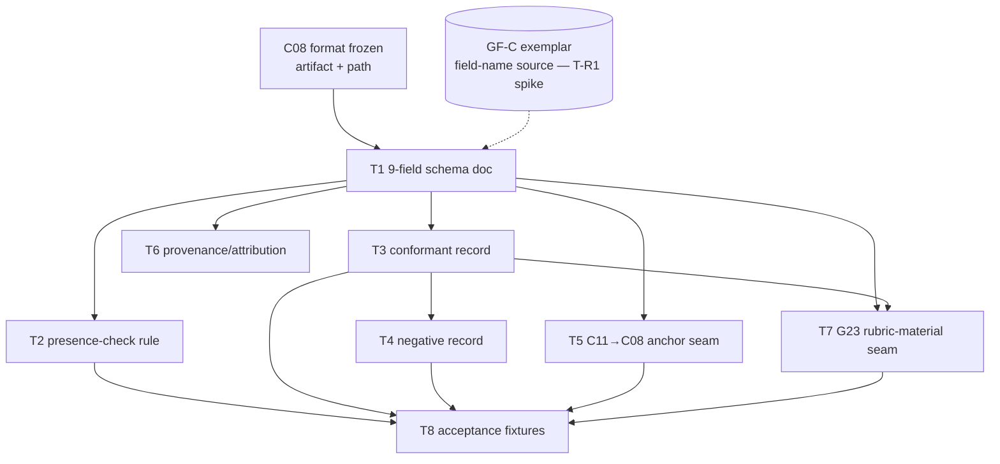

# C11 — Intent intake (9-field crucible) (`intent-intake`)  (Build Plan, canonical track)

> Source / Spec ref: [`spec/C11-intent-intake.md`](../spec/C11-intent-intake.md)
> Inventory: C11, Spec Intake, component, foundational=no. Depends on: C08. Track: canonical (D-6). Sweep: 1. Gap: G23.

C11 is a **pack + a fixed field schema**, not a running service: "building C11" is mostly *deciding and documenting the 9-field intent schema* and the **C11→C08 anchor seam**, plus a one-rule presence check. Like C08's plan it is thin on code and heavy on contract-freezing — but C11 is **not** on the critical path (Batch 3, non-foundational, consumes the already-frozen C08 format), so its leverage is *correctness of the field set*, not unblocking many dependents. The dominant risk is upstream-source-shaped (the GF-C field names are inferred), so the de-risking order leads with *finding the exemplar*, not with code.

## 1. Work breakdown

| Task | Description | Size | Prereqs |
|---|---|---|---|
| **T1 — 9-field schema doc** | Write the authoritative statement of the fixed 9-field intent schema (spec §3.3, §4): the named slots, that the set is fixed (not operator-extensible), and that the record is a versioned pack artifact (Markdown/TOML) in the C08 git-pack world. This *is* the deliverable for a schema-kind component. | S | C08 format known; GF-C field-name confirmation (T-R1) folded in if available |
| **T2 — Presence-check rule** | Implement the single automated behavior: all-9-slots-present (incl. explicit "n/a" as a valid fill), as a deterministic check (no model call). Built as the crucible pack's only logic — anchors AC-2/INV-2. Refuse any quality/semantic scoring here (spec §3.4). | S | T1 |
| **T3 — Minimal conformant exemplar record** | Author one valid 9-field intent record (all slots filled) that anchors a trivial C08 spec; the model dependents/authors build against. | S | T1 |
| **T4 — Negative exemplar record** | Author a deliberately incomplete record (a missing slot) to anchor AC-2 and give a failure fixture. | S | T1, T3 |
| **T5 — C11→C08 anchor seam** | Freeze the single load-bearing outbound contract (spec §3.2): how a completed record anchors C08 authoring — which field maps to which part of the C08 spec (goal/scope/DoD). Sweep-1 names + describes it; sweep-2 makes the mapping concrete. | M | T1 |
| **T6 — Provenance + attribution wiring** | Document that each *record* carries `created_by` (C41) and is versioned in git like C08, and that the GF-C `transfused_from` lineage rides the **crucible pack** at component grain (A93: per-component, **owned by C51**) — **not** per record (INV-4). No new tooling — convention + verification that pack/git + C51/C41 deliver it. | S | T1 |
| **T7 — G23 rubric-material seam (to C53)** | Document + fixture the AC-6 seam: field #7 (acceptance criteria / DoD) is exposed as candidate rubric input to **C53**; C11 does **not** build the validation gate. The deliverable is the *contract that intent arrives with an explicit DoD*, not the gate. | S | T1, T3 |
| **T8 — Acceptance fixtures** | Encode AC-1…AC-6 (spec §8) as checkable fixtures, **including the negative AC-5** (assert C11 ships no elicitation workflow / no semantic gate / no separate store / no field-DSL). | M | T2, T3, T4, T5, T7 |

No source-level Gas City work and no Go fork (extension is pack-only, per the canonical no-Go-fork posture C02 inherits). T2 is the crucible pack's lone deterministic rule; T3/T4 are pack record files; everything else is documentation + fixtures.

## 2. Dependency graph

- **Inbound gate:** C11 needs the **C08** format frozen (so its hand-off lands somewhere named). C08 is Batch-1 foundational and finishes long before Batch 3, so this is *already satisfied* by the time C11 builds — not a blocking wait. The *real* inbound dependency is informational: the **GF-C exemplar's actual field names** (T-R1 spike, §5) feeding T1.
- **Outbound:** C11 gates **nothing on the critical path.** It feeds C08 *authoring* (a human activity, not a build dependency) and optionally seeds **C53**'s rubric. No component stubs against C11.
- **Critical path inside C11:** T1 → T5 (schema then anchor seam) is the longest leverage path, but the whole component is small; correctness of T1's field set dominates schedule risk, not length.

## 3. Parallelization

After **T1** lands (the schema), three small independent workstreams fan out:

- **WS-A (records):** T3 → T4 → contributes to T8.
- **WS-B (logic):** T2 (the presence-check rule) → contributes to T8.
- **WS-C (seams):** T5 (C11→C08 anchor) ∥ T6 (provenance) ∥ T7 (G23 rubric-material).

WS-A/B/C touch disjoint files and run concurrently. T8 (acceptance fixtures) is the join point consuming all three. The component is small enough that parallelism is a convenience, not a schedule necessity — the gating activity is the **T-R1 GF-C spike** (§5), which precedes/overlaps T1.

## 4. Interfaces-first / contract milestones

Freeze these first (though few external consumers depend on them — C11 is a leaf-ish intake node):

1. **M1 — Field schema (from T1).** "Intent is a fixed 9-field record: goal, scope, non-goals, actors, inputs/preconditions, constraints, acceptance-criteria/DoD, known-ambiguities, exemplar-reference." Everything else references this. *Contingent on T-R1* (real GF-C names may rename/regroup slots; count stays 9).
2. **M2 — C11→C08 anchor seam (from T5).** The single load-bearing outbound contract: completed record → anchors C08 spec authoring. This is the one seam worth freezing for downstream coherence (it is what makes the C08 spec "anchored not guessed").
3. **M3 — Provenance convention (from T6).** Per-record `created_by` (C41) + git-versioned, like C08; the GF-C `transfused_from` lineage is **pack/component-level** (owned by C51, A93), not on each record.
4. **M4 — G23 rubric-material seam (from T7).** The DoD field is exposed to **C53**; C11 does not own the gate.

Milestone order: M1 → (M2 ∥ M3 ∥ M4). Because no component stubs against C11, milestone *timing* is low-pressure; milestone *correctness* (M1's field set) is the thing to get right.

## 5. Risks & de-risking order

Spike in this order to retire the most uncertainty earliest:

1. **R1 — The GF-C exemplar is unidentified and the 9 field names are inferred (spec OQ-1, highest).** F-MODE:91 asserts "9-field … from GF-C" but **names no fields and never defines GF-C**; the field set in the spec is reverse-engineered from one-shot Part 2 attributes + Part 1 DoD practice. **De-risk first (T-R1 spike):** locate the real GF-C exemplar, extract its actual field set, and confirm/replace the inferred slot names *before* freezing M1. Getting the *names/grouping* wrong is the dominant correctness risk; the *count* (9) is the faithful anchor and lower-risk. (→ review-log.)
2. **R2 — Over-build creep (THE BAR).** The strongest temptation is to grow the crucible into a multi-step elicitation **workflow** or to add a **semantic/acceptance validation gate** (both explicitly refused, spec §3.4). **De-risk** by encoding AC-5 as a *negative* acceptance fixture (T8) that fails if C11 acquires an elicitation engine, a quality gate, a separate store, or a field-DSL. This makes the bar mechanically enforced, not just asserted.
3. **R3 — C11/C08 artifact-boundary (spec OQ-2).** Whether the intent record is a separate file or folds into a standalone C08 spec doc depends on C08's own OQ-1. **De-risk** by keeping the record *physically separate but co-versioned* at sweep 1 (reversible), and confirming with the C08 author before T5/T6 finalize the on-disk shape.
4. **R4 — Provenance/license ownership (GF-C).** Because C11 is a GF-C transfusion, GF-C's license must be cleared — but that is **C51's** predicate, not C11's. **De-risk** by *referencing* C51 in T6 (record lineage, defer clearance) rather than re-implementing any license logic in the crucible (would be over-build).

## 6. Definition of done

**Per-task DoD** (ties to spec §8 acceptance criteria):

- T1 done ⇒ AC-1 (schema defined): the 9-field schema doc states the named slots + fixed-set + pack-artifact form.
- T2 done ⇒ AC-2 (presence check): all-9-present accepts; missing-slot flags; asserts nothing about content quality (INV-2).
- T3 done ⇒ AC-4 input (conformant record exists and anchors a trivial C08 spec).
- T4 done ⇒ AC-2 (negative): missing-slot record is flagged incomplete.
- T5 done ⇒ AC-4 + M2 frozen: the C11→C08 anchor seam is documented (fields → C08 prose).
- T6 done ⇒ AC-3 (versioned + attributable): a record resolves to a commit carrying `created_by` (C41); the crucible pack (not the record) carries `transfused_from` (GF-C, C51/A93) at component grain.
- T7 done ⇒ AC-6 (G23 seam): the DoD field is exposed as candidate rubric material to C53; the gate itself is **not** built here.
- T8 done ⇒ all of AC-1…AC-6 are mechanically checkable, **including the negative AC-5** (no elicitation engine / no semantic gate / no separate store / no field-DSL).

**Per-component DoD:**
1. All acceptance criteria (AC-1…AC-6) pass via T8 fixtures, including the negative AC-5 over-build guard.
2. M1–M4 contracts are documented; M2 (C11→C08 anchor) and M4 (G23 rubric-material → C53) are published so the C08-authoring practice and C53 can rely on them.
3. The **G23 disposition** is recorded (spec §9): C11 *supplies* the acceptance-criteria field as rubric material and exposes it to C53; it does **not** own the bootstrap-validation gate/threshold/scenario set (those are C53 + C32–C33). G23 is partially-addressed-at-intake, gate-deferred-to-C53, with reason (a gate here would violate THE BAR and duplicate C53).
4. The spec's FAITHFUL-FILL inferences (the **9 field names** + the **presence-not-quality** check + the **no-own-store** decision) are surfaced to the review-log so sweep 2 can replace the inferred field set with the **real GF-C** fields once T-R1 locates the exemplar (spec OQ-1).
5. No Go fork, no source-level Gas City modification — the crucible is a **pack** (F-MODE:91); extension is pack-only.
