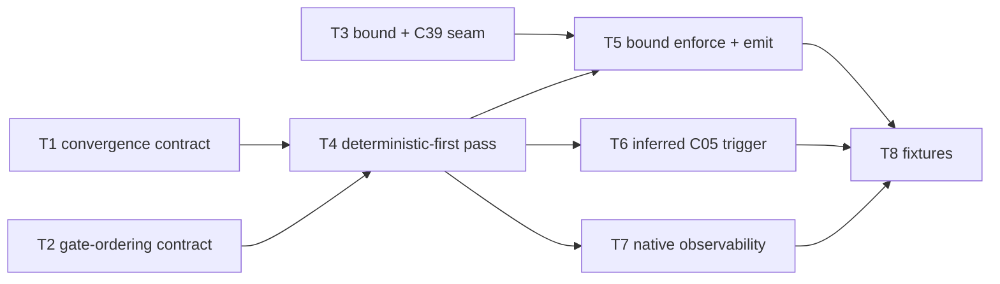

# C18 — Reconciler / Health Patrol loop (`reconciler-convergence`)  (Build Plan, canonical track)

> Source / Spec ref: [`spec/C18-reconciler-convergence.md`](../spec/C18-reconciler-convergence.md)
> Canonical track. **Sweep 2** (deepened in-place from Sweep-1). Depends on: C01 (Gas City substrate). Non-foundational control-loop in the Workflow Engine; **Batch-3** per the [component inventory](../_meta/component-inventory.md) (reconciler lands alongside workflow tooling + the P8 loop).
>
> **Sweep-2 additions:** concrete signatures (`PassInput`/`PassResult`/`BoundReachedSignal`/`Gate` types — §3.0); convergence-pass field table with R/W-by column (§3.4); `stateDiagram-v2` converge→bound-reached→escalate lifecycle (§5.1); E-code taxonomy E-C18-01..05 (§7.5); AC-code table AC-C18-01..08 with E↔AC cross-refs (§8.1); OQ-1 resolved (XC-3 verbatim), OQ-2 flagged inference, OQ-3 still open (G11).

## 1. Work breakdown

Sweep-1 tasks T1–T8 are preserved and annotated with their Sweep-2 concretisation.

| Task | Description | Size | Prerequisites | Sweep-2 status |
|---|---|---|---|---|
| **T1** Freeze the per-tick convergence contract | Define the inbound desired-vs-actual read over the molecule/bead-tree (C13/C19/C20) and the per-pass shape: `tick → read(desired, actual) → converge → (re)dispatch \| bound-reached` (spec §3.1, §5). Names what a pass consumes; introduces **no new state store** (INV-4). | S | C13/C19/C20 molecule + bead-graph read shape | **DONE (Sweep-2):** `PassInput` type (spec §3.0) concretises the read surface with `Desired`, `Actual`, `Gates`, `BoundParam` fields |
| **T2** Freeze the deterministic-first gate-ordering contract | Define how C18 orders the gate set (C16/C17) **deterministic-first**, admitting an LLM step **only where a deterministic gate cannot decide** (spec §3.1, INV-1; README:154). This is the kept **P4** property — the contract, not the gate predicates (those are C16/C17). | M | C16/C17 gate/tool-node surface; AI-CONTEXT:187 hook semantics | **DONE (Sweep-2):** `Gate{ID,Kind,Predicate}` + `GateKind{Deterministic,LLM}` in spec §3.0; E-C18-01 covers gate-order violation |
| **T3** Freeze the bound + bound-reached seam with C39 | Define the **injected-bound** parameter interface (C39 → C18, via C20 `attempt_no`/`max_attempts`) and the **bound-reached signal** (C18 → C39). C18 enforces *that a bound holds*; **C39 owns the numbers** (N → escalate, oscillation, L5 authz) — **XC-3 / G18** (spec §3.1, §3.2, §9 OQ-1). | M | C39 policy-owner shape; C20 schema slots | **DONE (Sweep-2):** `BoundPolicy`, `BoundReachedSignal` types + §3.4 R/W-by field table; OQ-1 RESOLVED (XC-3 verbatim) |
| **T4** Deterministic-first convergence pass (over native Health Patrol) | Implement the in-pass discipline: read delta → run deterministic gates first → admit LLM step only where reasoning is required → take a step toward desired (INV-1, INV-3). **Wraps Gas City's native reconciler; no new loop/scheduler** (spec §5, README:159 Native; bar §7). | M | T1, T2, native Health Patrol tick (C01); [needs G11 verification] for hook surface | Still gated on G11 (OQ-3); contract frozen |
| **T5** Bound enforcement + bound-reached emission | Enforce the injected bound per pass; on reaching it without convergence, **emit bound-reached to C39** and stop — **do not** count toward N, detect oscillation, or authorize a ship (INV-2; XC-3). | S | T3, T4 | E-C18-02 codes the failure path; AC-C18-03/05 verify the handoff |
| **T6** Inferred (re)dispatch trigger to C05 | When the delta means "work should run but is not", issue a (re)dispatch to sling (C05). **Mark the trigger edge `[FAITHFUL-FILL]` — v4 inference, not sourced fact (RC05-01)**; do not assert it (spec §3.2, §5). | S | T4, C05 dispatch-request contract | E-C18-04 covers redispatch-fail; OQ-2 remains inference-flagged |
| **T7** Verify native convergence observability | Verify "tick ran / gate passed-failed / pass converged or hit bound" is observable via the **native** event bus (C23, monotonic seq) — C18 writes **no record of its own** (spec §3.2, §4, INV-4). | S | T4, C23 native event append | AC-C18-07 verifies no C18-owned records; INV-4 holds |
| **T8** Acceptance fixtures | The §8 fixtures: deterministic-first ordering (+ no-deciding-gate counterpart), non-convergent-to-bound termination + bound-reached emission, delta-increasing convergence fault, two-tick unavailable-agent re-dispatch, native-observability/no-C18-record check. | M | T4–T7 | **Sweep-2:** AC-C18-01..08 in spec §8.1 concretise all fixtures with E-code cross-refs |
| **T9** *(Sweep-2 new)* Validate nil-bound stub path (batch-order inversion) | When C39 has not yet injected `max_attempts`, confirm C18 uses a hardcoded safe default of 3 and emits a warning; prevents unbounded pass while C39 is absent in Batch 3 | S | T5 | AC-C18-08 / E-C18-05 |

Most C18 work is **thin contract over Gas City's native Health Patrol** (the reconciler is a built-in derived mechanism, AI-CONTEXT:93; "Native", README:159) plus two genuinely-v4 properties: the **deterministic-first gate ordering** (the kept P4 concern, T2/T4) and **bounded iteration with a bound-reached handoff to C39** (T3/T5). The faithful scope deliberately introduces **no new control loop, scheduler, tick engine, queue, or convergence checkpoint**, and **invents no `gc` reconciler internals** (G11) — the loop is a per-tick decision over native state, with the numeric termination policy routed to C39 (XC-3).

## 2. Dependency graph

- **Hard upstream:** C01 (the reconciler is hosted by Gas City — the native Health Patrol C18 specs over; C18 cannot tick without it).
- **Policy boundary (bidirectional seam):** C39 owns the numeric bound C18 enforces and consumes C18's bound-reached signal (XC-3). C18 can be built against a **stub bound** (a fixed `max_attempts`) until C39 lands in Batch 4 — C18 (Batch 3) leads C39, so the seam must be frozen as a contract, not a live dependency.
- **Reference upstream:** C13/C19/C20 (the molecule/bead-graph state the loop reads — stub with a fixed desired/actual fixture) and C16/C17 (the gate set — stub with one deterministic gate + one LLM step).
- **Downstream consumers:** C05 (receives the **inferred** (re)dispatch trigger — RC05-01), and the Healer pieces C36–C39 that *ride on* this loop ("P11 (partial)", AI-CONTEXT:93). These build against a C18 stub once T1/T3 contracts are frozen.
- **Critical path:** T1 (convergence contract) + T2 (gate-ordering contract) → T4 (deterministic-first pass) → T5 (bound + bound-reached) → T8 (fixtures). T3 (C39 seam) gates T5; T6 (C05 trigger) and T7 (observability) hang off T4 and are not on the longest chain.

## 3. Parallelization

- **T1 (convergence contract)**, **T2 (gate-ordering contract)**, and **T3 (C39 bound seam)** are independent and can be authored concurrently — they touch disjoint surfaces (the desired-vs-actual read vs. the deterministic-first gate ordering vs. the C39 numeric-policy seam).
- **T6 (inferred C05 trigger)** and **T7 (native observability)** are independent branches off T4 and can be built in parallel with each other and with T5 — all hang off the T4 pass, not on each other.
- **Fan-out point:** freezing T1 + T2 + T3 (interfaces-first) unblocks C13/C39/C05/C36–C39 to build against a C18 stub *and* unblocks C18's own T4 — the highest-leverage early milestone. T3 in particular must be frozen early because **C18 (Batch 3) precedes C39 (Batch 4)**: the bound/bound-reached contract has to exist before its owner does.

## 4. Interfaces-first / contract milestones

Freeze these earliest so dependents build against stubs in parallel:
1. **Per-tick convergence contract (T1):** `tick → read(desired, actual) over C13/C19/C20 → converge → {(re)dispatch | bound-reached}`; converges toward desired (INV-3), owns no state (INV-4). Lets C13 stub a state read and C36–C39 stub a loop to ride on.
2. **Deterministic-first gate-ordering contract (T2):** the order in which C18 evaluates the C16/C17 gate set — **deterministic gates first, LLM step only where a deterministic gate cannot decide** (INV-1; README:154). The single load-bearing **P4** contract; lets C16/C17 know the ordering C18 expects.
3. **Bound + bound-reached seam with C39 (T3):** C39 injects the bound (`max_attempts`, via C20); C18 enforces it and emits **bound-reached**; **C39 owns N / oscillation / L5 authorization** (XC-3 / G18). Freeze this **before C39 exists** (batch-order inversion) so C39 builds to a fixed contract. Publish: "C18 owns the loop + bound enforcement + the signal; C39 owns the numbers."
4. **Inferred (re)dispatch trigger to C05 (T6, flagged):** the C18→C05 dispatch edge, **marked `[FAITHFUL-FILL]` (RC05-01)** — frozen as the modelled trigger, with the C12-formula-step alternative documented so it can be re-pointed if an integrator disagrees. Nothing asserted as sourced fact.

## 5. Risks & de-risking order

1. **G18 numeric-policy ownership boundary (OQ-1 / XC-3) — RESOLVED (Sweep-2).** XC-3 is confirmed: C18 owns the bounded loop + bound-reached signal; C39 owns N → escalate, F52 oscillation detection, L5 ship authorization, backed by C20's `attempt_no`/`max_attempts`/`escalated`/`closes`. The `BoundPolicy` type (spec §3.0) is injected by C39; the `BoundReachedSignal` is C18's outbound. No residual risk.

2. **Building a custom control loop / scheduler — the bar's primary DROP.** Risk: reimplementing the per-tick reconciler, tick scheduler, or convergence-gate slot that Gas City Health Patrol already provides Native (README:159; AI-CONTEXT:93). Mitigate by making T4 a **thin wrapper over native Health Patrol** (spec the *contract* — deterministic-first ordering, bounded pass, signal — not the engine) and **inventing no `gc` reconciler internals** (G11). The Sweep-2 signatures define the contract seam, not `gc` internals. Still gated on G11 (OQ-3).

3. **Reconciler→dispatch trigger is inferred, not v4-stated (RC05-01) — still open.** OQ-2 remains a flagged inference; E-C18-04 handles the redispatch-fail path. The C12-formula-step alternative is documented. Carry T6 with the `[FAITHFUL-FILL]` mark until G11/C05-author confirmation.

4. **Deterministic-first becoming discipline-without-purpose (F52).** Mitigated: E-C18-01 (gate-order violation), E-C18-03 (delta-regression), and AC-C18-01/04 concretely test the F52 guard. Every gate must carry a falsifying scenario; C18 surfaces violations, not silences them.

5. **Batch-order inversion (C18 Batch 3 precedes C39 Batch 4) — mitigated.** E-C18-05 (nil-bound stub) + AC-C18-08 + T9 handle the window before C39 is live. The stub `max_attempts=3` prevents unbounded passes; a warning on the native event bus prompts the operator.

## 6. Definition of done

Per-component DoD (ties to spec §8 acceptance criteria):
- **T1/T2/T3 done (Sweep-2 concretised):** `PassInput`, `Gate`, `BoundPolicy`, `BoundReachedSignal`, `PassResult` types frozen (spec §3.0); §3.4 field-table R/W-by column published; dependents can build against stub (AC-C18-03, AC-C18-05).
- **T4 done:** a convergence pass evaluates **deterministic gates before any LLM step** and admits an LLM step **only where a deterministic gate cannot decide**, taking a step toward desired (AC-C18-01, AC-C18-02, AC-C18-04; INV-1, INV-3). Gate-ordering hook confirmed against pinned `gc` binary (OQ-3/G11).
- **T5 done:** a non-convergent pass **terminates at the injected bound and emits `BoundReachedSignal` to C39**, without C18 counting toward N, detecting oscillation, or authorizing a ship (AC-C18-03, AC-C18-05; INV-2; XC-3; E-C18-02 path exercised).
- **T6 done:** a desired-vs-actual delta meaning "work should run but is not" issues a (re)dispatch to C05, with the trigger edge **marked `[FAITHFUL-FILL]` (RC05-01)** and E-C18-04 covering dispatch-fail (AC-C18-06, F22 recovery).
- **T7 done:** tick / gate / convergence events are observable via the **native** event bus (C23) with **no C18-owned record** (AC-C18-07; INV-4).
- **T8 done:** all §8.1 AC-C18-01..08 fixtures pass, including E-code paths E-C18-01..05.
- **T9 done:** nil-bound stub path operates safely (AC-C18-08; E-C18-05); warning on native bus.
- **Component done:** AC-C18-01..08 pass; **OQ-1 (G18 / XC-3) RESOLVED verbatim** (XC-3 quote in spec §9); **OQ-2 explicitly flagged inference** (RC05-01) — not asserted as fact; **OQ-3 confirmed G11-open** — gate-ordering hook must be verified against pinned `gc` binary before T4 implementation proceeds; **no new control loop, scheduler, tick engine, queue, or convergence checkpoint introduced**, and no invented `gc` reconciler internal (beyond native Health Patrol + the C13/C19/C20 state read + the C16/C17 gate set).
