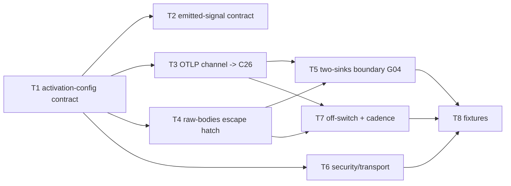

# C25 — OTLP telemetry export (`otlp-telemetry-export`)  (Build Plan, Track A)

> Source / Spec ref: [`spec/C25-otlp-telemetry-export.md`](../spec/C25-otlp-telemetry-export.md)
> Track A (faithful). Sweep 1. Depends on: C28 (Claude Code agent loop), with config carried by C03/C04. Non-foundational `interface` in the Observability subsystem; first stage of the C25 → C26 → C27 pipeline and the C25 → C24 raw-bodies feed. Batch-2 per the [component inventory](../_meta/component-inventory.md) (observability ingest C25/C26/C27/C24).

## 1. Work breakdown

| Task | Description | Size | Prerequisites |
|---|---|---|---|
| **T1** Freeze activation-config contract | Pin the required env-var set (AI-CONTEXT:575–579: `CLAUDE_CODE_ENABLE_TELEMETRY`, `OTEL_METRICS_EXPORTER`, `OTEL_LOGS_EXPORTER`, `OTEL_EXPORTER_OTLP_ENDPOINT`, `OTEL_LOG_RAW_API_BODIES`) plus optional refinements (beta, mTLS, intervals, per-signal). Document as the `[[agent]] env` block C03/C04 must carry (spec §3.1). | S | C03 `[[agent]] env` surface; C04 session env injection |
| **T2** Freeze emitted-signal contract | Publish the metric set, event set, beta-trace set, and correlation attributes (incl. load-bearing `session.id`) per AI-CONTEXT:172–178, so C26/C27/C24 know what to expect (spec §3.3). | S | T1 |
| **T3** Wire OTLP channel to C26 endpoint | Set `OTEL_EXPORTER_OTLP_ENDPOINT=:4317` (gRPC) and verify the native exporter pushes metrics/events to a receiver — "Verify events flow" (README:539; spec AC-1/AC-2/AC-3). No exporter code written (native). | M | T1, a C26 (or stub) receiver on :4317 |
| **T4** Wire raw-bodies escape hatch | Set `OTEL_LOG_RAW_API_BODIES=file:<dir>` (e.g. `/var/lib/cxdb-bridge/inbox`) and verify untruncated request/response JSON files appear carrying `session.id` (spec AC-4/AC-5). | M | T1, a writable raw-bodies dir |
| **T5** Two-sinks boundary (G04) | Assert/verify the OTLP stream terminates at C26 only and CXDB is fed only via raw-bodies → C24; prove no OTLP is sent to CXDB (spec INV-1, AC-6). Cross-reference the rule from C24/C26 specs. | S | T3, T4 |
| **T6** Security/transport options | Document/verify mTLS (gRPC `OTEL_EXPORTER_OTLP_CLIENT_KEY`/`_CERTIFICATE`; HTTP `CLAUDE_CODE_CLIENT_CERT`/`_KEY`) and the sensitivity of the raw-bodies dir at rest (spec §7). Config-only; no new secret store. | S | T1 |
| **T7** Off-switch + cadence verification | Verify unsetting `CLAUDE_CODE_ENABLE_TELEMETRY` / `OTEL_LOG_RAW_API_BODIES` silences each channel (AC-7) and that intervals (60s/5s defaults, tunable) behave (spec §3.1, §5). | S | T3, T4 |
| **T8** Acceptance fixtures | The §8 Phase-1 fixture: one `[[agent]]` with the env block, a stub OTLP receiver on :4317, a scratch raw-bodies dir; assert AC-1…AC-7. | M | T3–T7 |

C25 is **configuration + contract**, not software we author: the OTLP exporter and the raw-bodies dumper are native to Claude Code (AI-CONTEXT:158, INV-2). The faithful build is "set the env vars, assert the channels land where v4 says, and freeze the contract downstream components read." No exporter, buffer, or receiver code is written here.

## 2. Dependency graph

- **Hard upstream:** C28 (the agent process that emits) and the C03/C04 config/session substrate that injects the env vars. C25 cannot be exercised without a running Claude Code agent and its env block.
- **Downstream consumers:** C26 (receives OTLP :4317), C27 (LangFuse, two hops down), C24 (watches the raw-bodies dir). All three build against C25's frozen contracts (T1/T2) via stubs — a fixed env block + a stub :4317 receiver + a scratch dir.
- **Critical path:** T1 (activation contract) → T3/T4 (wire both channels) → T5 (two-sinks boundary) → T8 (fixtures). T2 (signal contract) is needed for downstream but is a short parallel task off T1; T6/T7 hang off the wired channels and are not on the longest chain.

## 3. Parallelization

- **T3 (OTLP channel)** and **T4 (raw-bodies hatch)** are fully independent once T1 is frozen — disjoint env vars, disjoint sinks; build/verify concurrently.
- **T2 (signal contract)** and **T6 (security/transport)** are independent doc-and-verify tasks off T1 and can run alongside T3/T4.
- **Fan-out point:** freezing T1 (the env block) + T2 (the signal contract) is the highest-leverage early milestone — it unblocks C26 to stand up a receiver, C24 to build against a known raw-bodies dir + `session.id` guarantee, and C27 to plan its LangFuse mapping, all against stubs.

## 4. Interfaces-first / contract milestones

Freeze these earliest so dependents build in parallel:
1. **Activation-config contract (T1):** the required `[[agent]] env` block (AI-CONTEXT:575–579) + optional refinements. Lets C03/C04 carry it and C26/C24 know it will be set.
2. **Emitted-signal + correlation contract (T2):** the metric/event/trace sets and correlation attributes, with **`session.id` guaranteed on raw bodies** (INV-3) — the contract C24 needs to build the CXDB parent-chain (G26) and C27 needs for session mapping.
3. **Two-sinks boundary statement (T5):** the explicit "OTLP → C26 only; CXDB only via raw-bodies → C24; never OTLP → CXDB" rule (G04), published as a shared Observability-subsystem invariant cross-referenced by C24/C26.

## 5. Risks & de-risking order

1. **G04 two-sinks misuse — highest.** Risk: an integrator wires OTLP → CXDB (the rejected path, AI-CONTEXT:210). De-risk first by publishing the two-sinks boundary (T5) as a shared, cross-referenced invariant and proving it in the fixture (AC-6) — that no CXDB post originates from the OTLP channel.
2. **`session.id` correlation guarantee (feeds G26).** Risk: raw bodies land without the identity C24 needs for CXDB lineage. De-risk by verifying `session.id` on the body files early (T4/AC-5) before C24 builds its mapping rule; this is the seam C24's hard work (G26) depends on.
3. **Emit-side durability when C26 is down (G33) — deferred but flagged.** Risk: silently assuming guaranteed OTLP delivery. Mitigate by accepting the native exporter's behaviour (no v4-named buffer) and explicitly flagging to C26/G33 whether a local OTLP buffer is wanted — do **not** build a buffer v4 doesn't name (spec §9 OQ-3).
4. **Raw-bodies file protocol (shared with C24, G26).** Risk: over-specifying a file naming/completion/retention protocol on the emit side that belongs to C24's consume side. Mitigate by having C25 assert only "files appear in `<dir>` with `session.id`" and resolving atomic-completion/retention jointly with the C24 author at sweep 2 (spec §9 OQ-2).
5. **Over-building C25 as software.** Risk: writing an exporter/receiver when the surface is native (INV-2). Mitigate by keeping every task config-and-verify only; the only artifacts are the env block, the contract docs, and the acceptance fixture.

## 6. Definition of done

Per-component DoD (ties to spec §8 acceptance criteria):
- **T1/T2 done:** the activation env block and the emitted-signal/correlation contract are frozen and published for C03/C04/C26/C27/C24 (AC-1, AC-3, AC-5).
- **T3 done:** metrics + events/logs flow over OTLP gRPC :4317 to a receiver — "events flow" verified (AC-1, AC-2, AC-3).
- **T4 done:** untruncated request/response JSON files appear in the raw-bodies dir, each carrying `session.id` (AC-4, AC-5).
- **T5 done:** the OTLP stream is observed terminating at C26 (→ C27) and raw bodies at the C24 dir; no OTLP is posted to CXDB (AC-6, G04 resolved).
- **T6 done:** mTLS transport options documented/verifiable; the raw-bodies dir's at-rest sensitivity is recorded as a file-permission control (spec §7).
- **T7 done:** unsetting the master/escape-hatch vars silences each channel with no code change (AC-7).
- **T8 done:** all §8 fixtures pass.
- **Component done:** AC-1…AC-7 pass; the two-sinks boundary (G04) is stated and proven; the `session.id` guarantee is verified for C24; OQ-1 (shared two-sinks note placement) and OQ-2/OQ-3 (raw-body protocol + emit-side durability, shared with C24/C26/G33) are recorded in the review-log; no exporter/buffer/receiver code introduced (native surface only).
