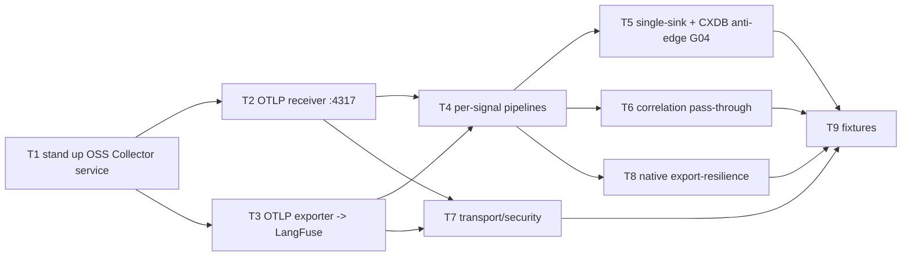

# C26 — OpenTelemetry Collector (`otel-collector`)  (Build Plan, canonical track)

> Source / Spec ref: [`spec/C26-otel-collector.md`](../spec/C26-otel-collector.md)
> Canonical track. Sweep 1. Depends on: C25 (OTLP telemetry export). Non-foundational `component` in the Observability subsystem; the **second stage** of the C25 → C26 → C27 pipeline, exporting to LangFuse (C27) as its single sink. Batch-2 per the [component inventory](../_meta/component-inventory.md) (observability ingest C25/C26/C27/C24). **C26 IS the off-the-shelf OpenTelemetry Collector (Apache 2.0) — the build is configuration + topology, not custom software.**

## 1. Work breakdown

| Task | Description | Size | Prerequisites |
|---|---|---|---|
| **T1** Stand up the OSS Collector as a Gas City service | Install the upstream OpenTelemetry Collector (Apache 2.0, README:297) and declare it `[[service]] name = "otel_collector" type = "external" endpoint = "http://localhost:4317"` in `city.toml` (AI-CONTEXT:563–566). No code authored — verbatim OSS adoption (README:474). | S | C03 `[[service]]` surface; the OSS Collector binary |
| **T2** Configure the OTLP receiver (`:4317`) | Bind the Collector's native `otlp` receiver on gRPC :4317 (the endpoint C25 is pointed at — AI-CONTEXT:578) to accept metrics/events/traces (spec §3.1). "Verify events flow" (README:539). | S | T1; C25 (or a stub emitter) pointed at :4317 |
| **T3** Configure the OTLP exporter → LangFuse (C27) | Configure one `otlphttp` exporter at LangFuse's OTLP ingestion endpoint — "point the OTel Collector at it" (README:540). Establishes the C26→C27 seam (spec §3.2). **Exactly one terminal sink.** | M | T1; C27 ingestion endpoint (or stub) — coordinate seam with C27 author |
| **T4** Wire per-signal pipelines (receiver → exporter) | Connect the :4317 receiver to the LangFuse exporter as pipelines for metrics, logs/events, and beta traces (spec §3.3), with **stock defaults only** (no custom processor). | S | T2, T3 |
| **T5** Single-sink + CXDB anti-edge (G04) | Assert/verify the pipeline has exactly one terminal exporter (LangFuse) and **no CXDB exporter/route** exists; prove no OTLP leaves C26 toward CXDB (spec INV-1, INV-2, AC-3). Cross-reference the anti-edge from C25/C24 specs. | S | T4 |
| **T6** Correlation pass-through check | Verify the correlation attributes C25 stamps (`prompt.id`, `session.id`, `user.account_uuid`, `organization.id`, `terminal.type`, AI-CONTEXT:178) arrive at LangFuse unaltered for session grouping (spec INV-4, AC-4). | S | T4 |
| **T7** Transport/security options | Configure/verify TLS on the receiver (mTLS from C25 via `OTEL_EXPORTER_OTLP_CLIENT_KEY`/`_CERTIFICATE`, AI-CONTEXT:169) and the LangFuse export auth (stock `otlphttp` `headers` ingestion key). Config-only; no new secret store (spec §7). | S | T2, T3; C27 ingestion-auth detail |
| **T8** Native export-resilience verification | Confirm that on a briefly-unreachable LangFuse the Collector's **stock** sending-queue + retry resumes delivery — with **no C26-authored buffer** (spec INV-3, AC-7, §6). | S | T4 |
| **T9** Acceptance fixtures | The §8 Phase-1 fixture: the configured Collector, a stub LangFuse OTLP endpoint, the per-signal pipelines; drive one C25 run; assert AC-1…AC-7 (esp. AC-3 the G04 anti-edge). | M | T4–T8 |

C26 is **configuration + topology**, not software we author: the receiver, exporter, batching, sending-queue, and retry are all **native** OpenTelemetry Collector capabilities (spec INV-3; README:474 "no invention"). The faithful build is "install the OSS Collector, point its receiver at :4317, point its single exporter at LangFuse, prove it never routes to CXDB." **No collector code, no custom buffer, no hand-rolled retry is written.**

## 2. Dependency graph

- **Hard upstream:** C25 (the emitter pointed at :4317) and the C03/Gas City service substrate that declares the `external` service. C26 can be exercised end-to-end only with C25 (or a stub emitter) producing OTLP and a LangFuse (or stub) ingestion endpoint to export to.
- **Downstream consumer (the sink):** C27 (LangFuse) — authored in parallel this wave. C26 exports to C27's OTLP ingestion endpoint; the seam (path/port/auth) is frozen jointly (T3 / spec OQ-1).
- **Anti-dependency:** C21 CXDB — C26 must **never** export here (spec INV-2). The CXDB sink is reached only via the separate C24 path off C25's raw-bodies channel.
- **Critical path:** T1 (stand up service) → T2/T3 (receiver + exporter) → T4 (pipelines) → T5 (single-sink + anti-edge) → T9 (fixtures). T6/T7/T8 hang off the wired pipeline (T4) and are not on the longest chain.

## 3. Parallelization

- **T2 (receiver)** and **T3 (exporter)** are independent once the service is up (T1) — disjoint config blocks (inbound vs outbound); build/verify concurrently, then join at T4 (pipelines).
- **T6 (correlation pass-through)**, **T7 (transport/security)**, and **T8 (native resilience)** are independent verify-tasks off the wired pipeline (T4) and run alongside T5.
- **Fan-out point — the C26→C27 seam (T3 / spec OQ-1):** freezing the LangFuse OTLP ingestion contract jointly with the C27 author is the highest-leverage early coordination — it lets C26's exporter config and C27's ingestion description be built against each other (stubs) without serialization. The receiver side (T2) is independently unblocked by C25's already-frozen `:4317` endpoint (C25 spec §3.1).

## 4. Interfaces-first / contract milestones

Freeze these earliest so dependents/siblings build in parallel:
1. **Receiver endpoint (T2):** OTLP/gRPC `:4317` — already fixed by C25's `OTEL_EXPORTER_OTLP_ENDPOINT` contract (AI-CONTEXT:578); C26 simply binds it. No negotiation needed; lets C25 be exercised against a listening receiver immediately.
2. **C26→C27 export seam (T3, with C27):** OTLP/HTTP to LangFuse's ingestion endpoint (path + ingestion-key header) **and the signal set LangFuse accepts** — LangFuse is trace-oriented, so co-freezing must settle whether the **metrics/events** pipelines land there or only **traces** do (and, if only traces, the non-trace disposition — never a CXDB route). The one contract that must be co-frozen with the parallel C27 author so the exporter and ingestion match (spec OQ-1; the `otlphttp` exporter type is a faithful-fill default).
3. **Single-sink + CXDB anti-edge (T5):** the explicit "exactly one terminal exporter = LangFuse; never a CXDB exporter" rule (G04), published as a shared Observability-subsystem invariant cross-referenced by C25/C24 (spec INV-1/INV-2).

## 5. Risks & de-risking order

1. **G04 anti-edge misuse — highest.** Risk: an integrator adds a CXDB exporter/route to the Collector (the rejected OTLP→CXDB path, AI-CONTEXT:210, 466, 497). De-risk first by stating the single-sink + anti-edge rule (T5) as a shared, cross-referenced invariant and proving it in the fixture (AC-3) — that the pipeline has exactly one sink (LangFuse) and no CXDB traffic originates from C26. This is *the* load-bearing risk for C26: the collector is physically where the rejected edge would be added.
2. **C26→C27 seam drift (shared with C27).** Risk: C26's exporter and C27's ingestion are specced against different OTLP paths/auth and don't connect. De-risk by co-freezing the seam (T3 / OQ-1) with the C27 author at sweep 2 and testing C26 against a stub LangFuse endpoint first.
3. **Over-building C26 as software — high (the standing trap).** Risk: writing a custom buffer, retry loop, or processor to "harden" delivery, duplicating the Collector's native sending-queue/retry/batching (spec INV-3). Mitigate by keeping every task **config-and-verify only**; the only artifacts are the Collector YAML + the `[[service]]` declaration + the fixture. THE BAR: native stack capability ⇒ no custom code (DROP).
4. **Export durability under prolonged LangFuse outage (G33) — deferred but flagged.** Risk: silently assuming guaranteed delivery, or conversely building a buffer v4 doesn't name. Mitigate by relying on the Collector's **stock** sending-queue + retry (T8) and explicitly flagging to G33 whether a Collector-native on-disk spool (still no custom code) is wanted — do **not** author a buffer (spec OQ-3).
5. **Correlation attribute loss.** Risk: a processor (or default behaviour) strips `session.id`/identity, breaking LangFuse session grouping. Mitigate by configuring **no** rewriting/redaction processor and verifying pass-through early (T6/AC-4).

## 6. Definition of done

Per-component DoD (ties to spec §8 acceptance criteria):
- **T1 done:** the OSS Collector runs as a Gas City `[[service]] type = "external"` at :4317 (AI-CONTEXT:565); no custom code (spec INV-3, AC-6).
- **T2 done:** the `otlp` receiver accepts metrics/events (and beta traces) from C25 — "events flow" verified (AC-1).
- **T3 done:** one `otlphttp` exporter delivers to LangFuse's ingestion endpoint and "trace browsing works" (README:540; AC-2).
- **T4 done:** per-signal pipelines connect receiver→exporter with stock defaults; **beta traces** traverse and are browsable in LangFuse; the **metrics/events** pipelines traverse the collector to the LangFuse exporter, with whether LangFuse ingests/exposes those non-trace signals left to the C26↔C27 seam (spec OQ-1) — not asserted browsable here (AC-5).
- **T5 done:** the pipeline has exactly one terminal exporter (LangFuse) and **no CXDB exporter**; no OTLP leaves C26 toward CXDB (AC-3, G04 resolved — single sink + anti-edge proven).
- **T6 done:** correlation attributes (incl. `session.id`) arrive at LangFuse unaltered (AC-4).
- **T7 done:** receiver TLS/mTLS and the LangFuse export auth are configured/verifiable; no new secret store introduced (spec §7).
- **T8 done:** a briefly-unreachable LangFuse triggers the Collector's stock queue-and-retry and delivery resumes — no C26-authored buffer (AC-7).
- **T9 done:** all §8 fixtures pass.
- **Component done:** AC-1…AC-7 pass; the single-sink + CXDB anti-edge (G04) is stated and proven; correlation pass-through is verified for C27; the C26→C27 seam (OQ-1), the G04 placement (OQ-2), and export durability/G33 (OQ-3) are recorded in the review-log; **no collector code, custom buffer, or hand-rolled retry introduced (verbatim OSS, config-only).**
