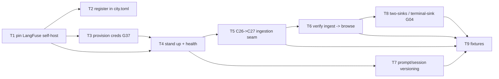

# C27 — LangFuse trace store & browser (`langfuse-traces`)  (Build Plan, Track A)

> Source / Spec ref: [`spec/C27-langfuse-traces.md`](../spec/C27-langfuse-traces.md)
> Track A (faithful). Sweep 1. Depends on: C26 (OTel Collector — authored in parallel this wave), deployed onto the C01/C03 substrate. Non-foundational `data-store` in the Observability subsystem; the **terminal browsing sink** of the C25 → C26 → C27 OTLP pipeline. Batch-2 per the [component inventory](../_meta/component-inventory.md) (observability ingest C25/C26/C27/C24).

## 1. Work breakdown

| Task | Description | Size | Prerequisites |
|---|---|---|---|
| **T1** Pin the LangFuse self-host deployment | Choose the LangFuse self-hosted release + its standard docker-compose stack (server + Postgres + ClickHouse/object-store as the release requires). Confirm the license of that release is the clean permissive self-host path (vs Phoenix Elastic, README:294–295/333; spec OQ-3). **Deploy, not author.** | S | A container host; LangFuse release selected (AI-CONTEXT:637) |
| **T2** Register LangFuse in `city.toml` | Add the `[[service]] name="langfuse" type="external" endpoint="http://localhost:3000"` registry entry (AI-CONTEXT:552–555) so the city can address it (spec §3.3). | S | C03 `[[service]]` surface; T1 |
| **T3** Provision LangFuse credentials (G37, minimal) | Supply LangFuse's required secrets — DB password, project/public+secret API keys, initial admin — via `city.toml`/env per the existing plaintext convention (AI-CONTEXT §13.2). **Note the G37 gap; build no secrets store** — the unbuilt secrets store is the open gap **G37** (canonical resolution owned by **C03**), *not* a Future-Enhancements item (FE-3 is the signing/key model, itself blocked on G37); record the deferral (spec §7, OQ-4). | S | T1 |
| **T4** Stand up the stack & confirm health | Bring the compose stack up; confirm LangFuse is healthy and the UI is reachable at `:3000` (spec AC-1). | S | T1, T3 |
| **T5** Wire the C26 → C27 ingestion seam | Settle (with the C26 author) LangFuse's OTLP-trace **ingestion endpoint** + the OTLP exporter block + API-key auth; point C26's exporter at it (README:540; spec §3.1, OQ-1). The single integration step. | M | T4; C26 (or a stub collector); C26 author coordination |
| **T6** Verify ingest → browse end-to-end | Drive one short agent run (or replay a captured OTLP-trace batch through C26); confirm forwarded spans are **ingested and browsable** in the UI (spec AC-2/AC-3) and that spans sharing `session.id` group into one **session** (spec AC-4). | M | T5; upstream `session.id` guarantee (C25 §3.3) |
| **T7** Confirm prompt/session versioning surface | Confirm LangFuse's prompt/session-versioning capability is present and usable (AI-CONTEXT:374; spec AC-5). **Confirm available, do not build.** | S | T4 |
| **T8** Two-sinks boundary (G04) — terminal-sink check | Assert/verify C27 emits **no** data to CXDB / beads / event bus and the OTLP/LangFuse path does not touch CXDB (spec INV-1/INV-2, AC-6). Cross-reference the two-sinks rule from C24/C25/C26. | S | T6 |
| **T9** Acceptance fixtures | The §8 Phase-1 fixture: scratch `city.toml` + LangFuse stack + stub/real C26 pointed at ingestion; assert AC-1…AC-7. | M | T5–T8 |

C27 is **deployment + configuration**, not software we author: LangFuse's server, store, schema, and UI are off the shelf (spec INV-3). The faithful build is "stand up self-hosted LangFuse, register it, point C26 at it, prove trace browsing works, and confirm it is a terminal sink." No custom store, UI, receiver, retention, HA, or secrets code is written here.

## 2. Dependency graph

- **Hard upstream:** **C26** (the collector that exports OTLP into LangFuse — authored in parallel this wave) and the **C01/C03** substrate that registers the service. C27 cannot be exercised end-to-end without C26 forwarding traces (a stub collector substitutes until C26 lands).
- **Transitive upstream contract:** the **C25** emitted-signal + correlation contract — especially **`session.id`** (C25 §3.3) — which C27 relies on for session grouping (INV-4) but does not itself produce.
- **Downstream:** a **human operator only**. C27 is a terminal sink (spec §3.4) — no other component depends on it; nothing reads trajectories *from* LangFuse (CXDB is the L4 substrate, not C27 — spec OQ-2).
- **Critical path:** T1 (pin deployment) → T4 (stand up) → **T5 (C26→C27 ingestion seam)** → T6 (verify ingest→browse) → T8 (terminal-sink check) → T9 (fixtures). **T5 is the load-bearing seam** and is gated on coordination with the C26 author; everything else is local deployment/config.

## 3. Parallelization

- **T2 (registry entry)**, **T3 (credentials)**, and **T7 (versioning check)** are independent of the ingestion seam and can run alongside T4/T5 once T1 fixes the release.
- **T5 (the C26→C27 seam)** is the single cross-component coordination point — it is the highest-leverage early conversation with the **C26 author** (which OTLP ingestion endpoint, exporter block, auth). Settling it early lets C26 build its exporter against C27's stub ingestion target and lets C27 verify against a stub collector — the two specs converge on one seam.
- **Fan-out point:** the LangFuse self-host can be stood up (T1/T4) and its UI exercised **before C26 exists**, using a captured OTLP-trace batch replayed at LangFuse's ingestion endpoint. This de-risks the deployment independently of the parallel C26 build.

## 4. Interfaces-first / contract milestones

Freeze these earliest so the parallel C26 build and the operator can proceed:
1. **C26→C27 ingestion contract (T5):** LangFuse's OTLP-trace ingestion endpoint + exporter block + API-key auth (spec §3.1) — the one seam C26 exports into. Publish it so C26's export description and C27's ingestion contract are a single, aligned seam (resolve jointly — spec OQ-1).
2. **Service-registry + endpoint binding (T2):** the `[[service]] type="external"` entry at `:3000` (AI-CONTEXT:552–555) — lets the city address LangFuse and lets C26/operator target it.
3. **Terminal-sink statement (T8):** the explicit "C27 ingests OTLP and serves browsing **only**; no C27→CXDB/beads/bus; OTLP path never touches CXDB" rule (spec INV-1/INV-2) — the C27 half of the shared two-sinks (G04) invariant, cross-referenced by C24/C25/C26.

## 5. Risks & de-risking order

1. **C26→C27 ingestion mismatch (T5) — highest.** Risk: C26 exports OTLP in a shape/endpoint LangFuse's receiver doesn't accept, or non-trace OTLP signals (metrics/events) are forwarded but not browsable in trace-oriented LangFuse (spec OQ-1). De-risk first by settling the ingestion contract with the C26 author and proving one trace round-trips end-to-end (T6) before either side hardens.
2. **Terminal-sink / two-sinks misuse (G04).** Risk: someone wires LangFuse as an L4 source (AI-CONTEXT:326/374 "weak L4 fallback") or onto the CXDB path (the rejected wiring, AI-CONTEXT:210). De-risk by publishing the terminal-sink rule (T8) as a shared, cross-referenced invariant and proving no C27→CXDB flow in the fixture (AC-6) — CXDB is the L4 substrate, LangFuse is browsing-only (spec OQ-2).
3. **G37 plaintext credentials — noted, not solved.** Risk: scope-creep into building a secrets store, or shipping creds insecurely. Mitigate by **referencing creds from `city.toml`/env per convention and explicitly deferring** to the open gap **G37** (canonical resolution owned by **C03**; *not* FE-3 — that is the signing/key model, itself blocked on G37) (spec §7, OQ-4) — do **not** build a secrets layer v4 doesn't have (it fails the capability-for-principle bar). Record the deferral for the reviewer.
4. **LangFuse license/SPDX drift (OQ-3).** Risk: an enterprise edition or a license change quietly imposes a hosted-service restriction (the thing Phoenix was rejected for). Mitigate by pinning the release's license at T1 and confirming the self-host path stays clean (low risk; deployment-time check).
5. **Over-building C27 as software.** Risk: writing a custom store/UI/receiver/retention/HA layer over LangFuse (spec INV-3). Mitigate by keeping every task deploy-and-configure-and-verify only; the only artifacts are the compose deployment, the `city.toml` entries, the C26 exporter target, and the acceptance fixture. Availability/retention/HA are **deferred to LangFuse-native + ops/G33** (spec OQ-5/OQ-6), not built.

## 6. Definition of done

Per-component DoD (ties to spec §8 acceptance criteria):
- **T1/T2 done:** the LangFuse self-host release is pinned (license confirmed clean) and registered as `[[service]] type="external"` at `:3000` (AC-1; spec OQ-3).
- **T3 done:** LangFuse's credentials are supplied via `city.toml`/env per convention and the **G37 gap is recorded and deferred** (no secrets store built) (AC-7; spec §7).
- **T4 done:** the LangFuse stack is healthy and the UI is reachable at `:3000` (AC-1).
- **T5 done:** the C26→C27 OTLP-trace ingestion seam is settled with the C26 author and C26's exporter points at LangFuse's ingestion endpoint (spec §3.1; OQ-1 recorded).
- **T6 done:** forwarded spans are ingested and **browsable** in the UI, and spans sharing `session.id` group into one session — "Verify trace browsing works" (AC-2/AC-3/AC-4; README:540).
- **T7 done:** LangFuse's prompt/session-versioning surface is confirmed present and usable (AC-5).
- **T8 done:** C27 emits no data to CXDB/beads/bus and the OTLP path does not touch CXDB; the terminal-sink/two-sinks rule (G04) is stated and proven (AC-6).
- **T9 done:** all §8 fixtures pass.
- **Component done:** AC-1…AC-7 pass; C27 is a deployed, registered, off-the-shelf LangFuse self-host serving browsable traces; the C26→C27 ingestion seam is aligned with C26; the terminal-sink/two-sinks boundary (G04) is stated and proven; the G37 deferral and OQ-1 (ingestion endpoint), OQ-2 (no LangFuse-as-L4 source), OQ-3 (license pin), OQ-5/OQ-6 (retention + LangFuse-down durability, shared with C26/G33) are recorded in the review-log; **no custom store/UI/receiver/retention/HA/secrets code introduced** (off-the-shelf self-host only).
