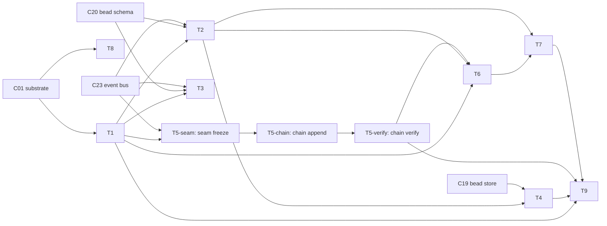

# C41 — Identity / actor model & attribution  (Build Plan, canonical track)

> Source / Spec ref: [spec/C41-identity-attribution.md](../spec/C41-identity-attribution.md)

## 1. Work breakdown

| Task | Description | Size | Prerequisites |
|---|---|---|---|
| **T1 Actor model** | Define the closed actor-kind set `{city, rig, agent}` and the **actor-reference** shape `"kind:id"` that `created_by` resolves to. Implement `resolve_actor`. | S | C01 actor schema known; spec §4.1 |
| **T2 Attribution contract** | Specify the universal-attribution invariant: every bead (C20 envelope) + every event (C23 record) carries a `created_by` that is a valid actor reference. Implement E-C41-01/02/03/04 error paths. | S | T1; C20 envelope; C23 record shape |
| **T3 Actor-reference encoding** | Pin a **single shared encoding** (`"kind:id"` colon-delimited) for the actor reference so beads and events use the same shape (OQ-C41-4). Coordinate with C20 + C23. | S | T1; C20; C23 |
| **T4 Audit-trail definition** | Define `audit_trail(actor)` and `audit_trail_by_id(id)` as the actor-keyed view over C19 + C23. No new store; implement the query contract (C41-I2). | S | T2; C19 history + C23 bus query surfaces |
| **T5-seam C23 event_id stream seam freeze** | Joint freeze with C23 of the `event_id_stream` contract (gap-free ordered, EventRecord shape, ack protocol, seq numbering). **Must precede T5-chain.** Freeze = signed-off seam doc or PR comment on C23's spec. | S | C23 Sweep-2; OQ-C41-5 |
| **T5-chain Provenance hash-chain (D-5)** | Implement `chain_append` and the ChainEntry store (§4.2/§4.4). Consume C23's gap-free ordered event_id stream. Compute `payload_digest` and `entry_hash`. Chain store = append-only JSONL or Dolt table. | M | T5-seam; C23 event_id_stream available |
| **T5-verify Chain verification** | Implement `chain_verify(from_seq, to_seq)`: re-derive entry hashes, check linkage, return VerifyResult. E-C41-05/06/07/08. | S | T5-chain |
| **T6 Verification seam (optional, deferred)** | Define *where* a provenance signature attaches (§3.5 / C41-I4) and *what* it covers (actor ref + action content) + the verify op. Named and stable seam only; algorithm/keys are the optional pack (deferred to FE-3 per D-14, blocked on G37). | M | T1–T2; spec §4.5/§6 |
| **T7 Self-asserted caveat surface** | Make "is verification installed?" discoverable to downstream readers (C35/C42/C46/F43) so they do not over-trust attribution. Implement a query: `is_verification_installed() → bool`. | S | T2, T6 |
| **T8 Substrate-enforcement probe** | Determine whether Gas City *rejects* an unattributed write or merely defaults the field (OQ-C41-3 / G11-class). Feeds the F14 invariant's enforceability. Run as part of the D-23 substrate spike (plan §5 risk 1). | S | C01 runnable (Gas City spike) |
| **T9 Acceptance harness** | Encode spec §8.1 AC-codes: AC-C41-1 through AC-C41-11. Include the tamper-detection test (AC-C41-6) and the C23-event_ids-not-own-ordering test (AC-C41-5). | M | T1–T7 |

## 2. Dependency graph

- **Critical path (default attribution):** C01 → T1 → T2 → T4 → T9.
- **Critical path (hash-chain):** C23-Sweep2 → T5-seam → T5-chain → T5-verify → T9.
- **Off critical path:** T6/T7 (optional verification) and T8 (substrate probe) are independent once T2 exists. T5-seam is the **gate** for the chain path; C23 must freeze its `event_id_stream` contract first.
- C41 is on the **system** critical path as a cross-cutting load-bearer (inventory): F14/F32/F43 coverage depends on T2's universal-attribution invariant landing.

## 3. Parallelization

- **T1** and **T8** can start immediately and in parallel once C01's actor schema is readable — T8 is investigation, T1 is definition.
- **T3 (encoding)** is the one cross-component coordination point with C20/C23: freeze it early so C20/C23 and C41 don't drift (M1).
- **T5-seam** is a joint C23/C41 coordination point; it can be authored in parallel with T2/T3/T4 but must complete before T5-chain starts.
- **T5-chain** and **T4** (audit trail) are independent of each other once T2/T5-seam exist — they can be built concurrently.
- **T6** (verification seam) is independent of **T4** and **T5-chain** once T1/T2 exist — it can be authored concurrently by a separate workstream.
- **T9** (acceptance) integrates last.

## 4. Interfaces-first / contract milestones

Freeze these early so dependents (C20, C23, C42, C06) can build against stubs:

1. **M0 — C23 event_id_stream seam freeze** [T5-seam]. **The chain seam to freeze first.** C41's hash-chain cannot be implemented until C23 freezes the gap-free ordered event_id stream contract (shape of EventRecord, monotonic seq numbering, gap-freedom guarantee, ack/handshake). Joint C23/C41 milestone. Gates T5-chain.
2. **M1 — Actor-reference shape (kind, identifier)** [T1+T3]. The single most-depended-on contract:
   C20 (envelope `created_by`), C23 (event `created_by`), and C42 (partition policy keyed by actor) all
   need it. Freeze *first*, jointly with C20/C23.
3. **M2 — Universal-attribution invariant** [T2]. The guarantee F14/F32/F43 coverage rests on; lets the
   F-mode-coverage owner (C57) mark F14 Addressed.
4. **M3 — Audit-trail query definition** [T4]. The "answerable by actor" contract C35/C46/F43 consumers
   read against.
5. **M4 — Chain-append + chain-verify interfaces** [T5-chain + T5-verify]. The provenance hash-chain
   contract (D-5). Frozen as concrete function signatures so the acceptance harness can write AC-C41-5/6/7.
6. **M5 — Verification seam signature** [T6]. The optional pack's attach point; frozen as a *named, stable
   seam* even though the pack is deferred (D-14, blocked on G37), so adding verification later is additive
   (no rework).

## 5. Risks & de-risking order

1. **Freeze M0 (C23 seam) first.** The hash-chain is the non-trivial custom piece of C41, and it is entirely dependent on C23 providing a gap-free ordered event_id stream with a stable contract. If C23's sweep-2 event_id semantics differ from the D-5 assumption (monotonic, gap-free, C23-assigned), the chain design may need to be revised. Freeze this before any chain code is written.
2. **Spike T8 (substrate enforcement) early.** The biggest uncertainty is whether Gas City *enforces* universal `created_by` or merely defaults it (OQ-C41-3). If it only defaults, the F14 invariant is discipline-dependent, which materially affects M2 and bears on the whole G36 security story. Retire this before declaring F14 "Addressed."
3. **Resolve OQ-C41-4 (encoding) jointly with C20/C23 at M1.** A mismatch silently breaks the audit-trail union (§4.3 of spec). Freeze the `"kind:id"` encoding (or its alternative) jointly; a late change churns all downstream specs.
4. **Resolve G36 ownership early (OQ-C41-1) → review-log.** Whether verification stays optional (canonical track) or becomes mandatory (FE-3, blocked on G37 per D-14) is the load-bearing security decision. Author the seam (T6/M5) even though the pack is deferred, precisely so the decision can be made cheaply later.
5. **Operator-as-actor (OQ-C41-2).** Confirm with C42 whether the human operator needs a fourth actor kind before freezing M1 — a late addition to the kind set would churn the encoding everywhere.
6. **Chain-store durability.** The chain store is append-only; it must survive the same failure modes as the C19 bead store (periodic `dolt push` with `refs/heads/*` — D-23/F9 portability caveat). Align chain-store backup with C19's Dolt cadence.

## 6. Definition of done

**Per-component (ties to spec §8/§8.1 acceptance):**
- M0–M5 contracts published.
- M1 consumed by C20/C23 (actor-reference encoding agreed).
- M2 verified: no bead/event write path omits a valid `created_by` (T2/T9; spec §8.1–8.2; AC-C41-2/AC-C41-3).
- M4 verified: AC-C41-5 confirms chain consumes C23 event_ids (not own ordering); AC-C41-6 tamper-detection test passes.
- Audit trail answerable by actor in both directions over C19+C23 (T4/T9; spec §8.3; AC-C41-4) and append-only integrity holds (AC-C41-10).
- Verification seam (M5) specified and *stable*, with the default build NOT requiring verification (faithful to README:229; D-14); AC-C41-11 passes.
- Self-asserted-by-default caveat discoverable by downstream readers (T7; spec §8.6).

**Per-task:** each Tn meets its row's described output at sweep-2 altitude (concrete signatures, schemas, error taxonomy, and acceptance test vectors per §6.1 of spec).

**Open questions routed to review-log** (must be carried forward, not silently closed): OQ-C41-1 (G36
mandatory-verification — top), OQ-C41-2 (operator actor kind), OQ-C41-3 (substrate enforcement),
OQ-C41-4 (shared actor-reference encoding), OQ-C41-5 (C23 event_id_stream seam contract — the first
build-gate, must be closed before T5-chain starts).
