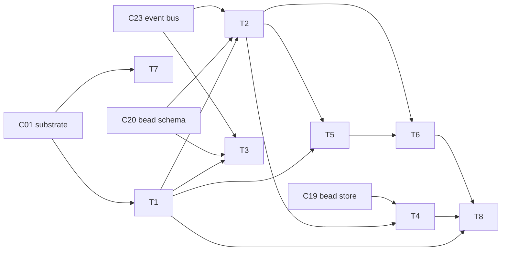

# C41 — Identity / actor model & attribution  (Build Plan, Track A)

> Source / Spec ref: [spec/C41-identity-attribution.md](../spec/C41-identity-attribution.md)

## 1. Work breakdown

| Task | Description | Size | Prerequisites |
|---|---|---|---|
| **T1 Actor model** | Define the closed actor-kind set `{city, rig, agent}` and the **actor-reference** shape (kind, identifier) that `created_by` resolves to. Sweep-1 = named/described; sweep-2 = concrete id grammar. | S | C01 actor schema known; spec §4.1 |
| **T2 Attribution contract** | Specify the universal-attribution invariant: every bead (C20 envelope) + every event (C23 record) carries a `created_by` that is a valid actor reference. Define the contract C19/C20/C23 rely on. | S | T1; C20 envelope; C23 record shape |
| **T3 Actor-reference encoding** | Pin a **single shared encoding** for the actor reference so beads and events use the same shape (OQ-C41-4). Coordinate with C20 + C23. | S | T1; C20; C23 |
| **T4 Audit-trail definition** | Define `audit-trail(actor) ≡ beads(created_by==X) ∪ events(created_by==X)`, keyed by actor, append-only. No new store. | S | T2; C19 history + C23 bus query surfaces |
| **T5 Verification seam (optional, deferred)** | Define *where* a provenance signature attaches and *what* it covers (actor ref + action content) + the verify op (`claimed == signed`). Named only; algorithm/keys are the optional pack's later sweeps. | M | T1–T2; spec §4.3/§6 |
| **T6 Self-asserted caveat surface** | Make "is verification installed?" discoverable to downstream readers (C35/C42/C46/F43) so they do not over-trust attribution. | S | T2, T5 |
| **T7 Substrate-enforcement probe** | Determine whether Gas City *rejects* an unattributed write or merely defaults the field (OQ-C41-3 / G11-class). Feeds the F14 invariant's enforceability. | S | C01 runnable |
| **T8 Acceptance harness** | Encode spec §8 criteria: universal attribution, actor resolvability, audit answerable-by-actor, append-only integrity, optional-seam test (N/A without pack). | M | T1–T6 |

## 2. Dependency graph

- **Critical path:** C01 → T1 → T2 → T4 → T8 (the default, verification-free attribution path). T5/T6
  (optional verification) are **off** the critical path — v4 marks them deferred, so the factory ships
  with self-asserted attribution and the seam unbuilt.
- C41 is itself on the **system** critical path as a cross-cutting load-bearer (inventory): F14/F32/F43
  coverage depends on T2's universal-attribution invariant landing. But its *internal* build is small
  (mostly definitional) because Gas City supplies the mechanism natively.

## 3. Parallelization

- **T1 (actor model)** and **T7 (substrate-enforcement probe)** can start immediately and in parallel
  once C01's actor schema is readable — T7 is investigation, T1 is definition.
- **T5 (verification seam)** is independent of **T4 (audit trail)** once T1/T2 exist — they can be authored
  concurrently by separate workstreams.
- **T3 (encoding)** is the one cross-component coordination point: it must be agreed *jointly* with the C20
  and C23 authors (shared actor-reference shape). Freeze it early (see §4) so C20/C23 and C41 don't drift.
- T8 (acceptance) integrates last.

## 4. Interfaces-first / contract milestones

Freeze these early so dependents (C20, C23, C42, C06) can build against stubs:

1. **M1 — Actor-reference shape (kind, identifier)** [T1+T3]. The single most-depended-on contract:
   C20 (envelope `created_by`), C23 (event `created_by`), and C42 (partition policy keyed by actor) all
   need it. Freeze *first*, jointly with C20/C23.
2. **M2 — Universal-attribution invariant** [T2]. The guarantee F14/F32/F43 coverage rests on; lets the
   F-mode-coverage owner (C57) mark F14 Addressed.
3. **M3 — Audit-trail query definition** [T4]. The "answerable by actor" contract C35/C46/F43 consumers
   read against.
4. **M4 — Verification seam signature** [T5]. The optional pack's attach point; frozen as a *named, stable
   seam* even though the pack is deferred, so adding verification later is additive (no rework).

## 5. Risks & de-risking order

1. **Spike T7 first (substrate enforcement).** The biggest uncertainty is whether Gas City *enforces*
   universal `created_by` or merely defaults it (OQ-C41-3). If it only defaults, the F14 invariant is
   discipline-dependent, which materially affects M2 and bears on the whole G36 security story. Retire
   this before declaring F14 "Addressed."
2. **Resolve G36 ownership early (OQ-C41-1) → review-log.** Whether verification stays optional (Track A)
   or becomes mandatory (likely Track B delta) is the load-bearing decision. Track A holds it optional per
   README:229, but the cross-track reconciler needs T5's seam fully specified to evaluate the delta. Author
   the seam (T5) even though the pack is deferred, precisely so the decision can be made cheaply later.
3. **Operator-as-actor (OQ-C41-2).** Confirm with C42 whether the human operator needs a fourth actor kind
   before freezing M1 — a late addition to the kind set would churn the encoding (M1) everywhere.
4. **Encoding drift (M1).** Freeze the actor-reference shape jointly with C20/C23 up front; a mismatch
   silently breaks the audit-trail union (§4.2 of spec).

## 6. Definition of done

**Per-component (ties to spec §8 acceptance):**
- M1–M4 contracts published and consumed by C20/C23 (M1) and the F-mode owner (M2).
- Universal-attribution invariant verified: no bead/event write path omits a valid `created_by` (T2/T8;
  spec §8.1–8.2).
- Audit trail answerable by actor in both directions (actor→actions, action→actor) over C19+C23 (T4/T8;
  spec §8.3) and append-only integrity holds (spec §8.4).
- Verification seam (M4) specified and *stable*, with the default build NOT requiring verification
  (faithful to README:229); optional-pack test marked N/A absent the pack (spec §8.5).
- Self-asserted-by-default caveat discoverable by downstream readers (T6; spec §8.6).

**Per-task:** each Tn meets its row's described output at sweep-1 altitude (named + described); concrete
id grammar, signature byte-layout, and verify API are explicitly deferred to sweep 2 (and, for the
verification path, to the *optional pack*, not the default build).

**Open questions routed to review-log** (must be carried forward, not silently closed): OQ-C41-1 (G36
mandatory-verification — top), OQ-C41-2 (operator actor kind), OQ-C41-3 (substrate enforcement),
OQ-C41-4 (shared actor-reference encoding).
