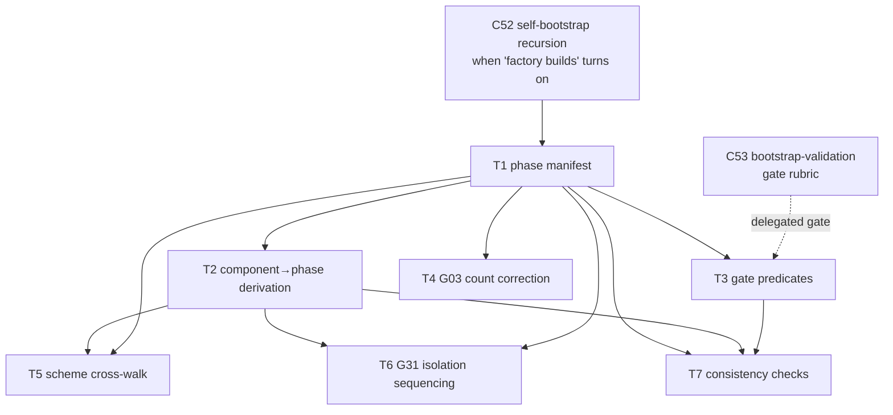

# C54 — Phase delivery plan (`phase-plan`)  (Build Plan, canonical track)

> Source / Spec ref: [`spec/C54-phase-plan.md`](../spec/C54-phase-plan.md)
> Inventory: C54, Bootstrap, pipeline-stage, foundational=no. Depends on: C52. Sweep: 1.

C54 is a **delivery-sequencing artifact**, not a running service: "building C54" is *writing down the ordered phase arc + the gate predicates as a versioned planning document*, and providing the one machine-checkable thing v4 actually asserts (phase-entry preconditions + the bootstrap go/no-go gate position). This plan is therefore thin on code and heavy on getting the *order*, the *gates*, and the *de-confliction* right — which is exactly what makes it load-bearing for the whole build (every other component's batch placement reads against C54's phase arc). **No scheduler, no PM engine, no cost model** (THE BAR, spec §7).

## 1. Work breakdown

| Task | Description | Size | Prereqs |
|---|---|---|---|
| **T1 — Phase manifest** | Write the authoritative `{phase → entry precondition, install/build scope, exit deliverable, exit gate}` table for P0→P1→P2→P3+ and the P3 sub-order P3a→P3d, each scope line citing a README Part 6 source (spec §4.1/§4.2). This *is* the deliverable for a sequencing-kind component. | S | C52 recursion shape known (when "factory builds" turns on) |
| **T2 — Component→phase derivation** | Document the rule "a component's phase = the phase of the principle(s) it realizes" (spec §4.3) and apply it so every C01–C57 has a derived phase home. No second source of truth — derive from inventory principle-mappings, do not re-assign. | S | T1 |
| **T3 — Gate predicates** | For each phase boundary, state the exit gate: P0/P1 = capability checks (session runs; CXDB ingests; formula renders), **P2→P3 = the C53 bootstrap go/no-go** (name it, position it, state pass⇒P3 / fail⇒rework-no-P3), P3a–P3d = per-piece scenarios + design review (spec §5, INV-3). Delegate the bootstrap *rubric* to C53. | M | T1 |
| **T4 — G03 count correction** | State the P0 deliverable as **5 native principles (P1,P2,P4,P9,P10) + P3-basic**, with P3-full at P1 when `[formulas]` turns on — replacing the "6 of 12 at smallest install" headline that double-counts P3 (spec §6 G03 row; AI-CONTEXT:122/135/463). | S | T1 |
| **T5 — Scheme cross-walk (de-confliction)** | Build the Phase ↔ Layer(0–6) ↔ Batch cross-walk table (spec §4.4) showing the three schemes are NOT number-aligned (Phase 2 ↔ Layer 2 ↔ Batch 3). Resolve G01 locally (within C54 "Layer 2" = P2 scenarios+judge) and G02 (rule "Phase 6" a slip for Layer-6/P3d). Carry the scheme-collision guard banner (RC40-01/D-6). | M | T1, T2 |
| **T6 — G31 isolation sequencing** | Name C43's faithful phase (P3c, with twins), make the **P0–P3b lethal-trifecta exposure window explicit** (not "Addressed"), and record the pull-forward recommendation as OQ-3 → **D-18 (provisional, operator-confirm): boundary-typing/blast-radius half → P2 entry precondition; twin-isolation half stays P3c** + a C57 Caution (spec §6.1). This is the security-honesty task. | M | T1, T2 |
| **T7 — Consistency checks** | Encode the sweep-1 acceptance checks (spec §8) as checkable assertions: (a) every principle P1–P12 delivered by exactly one phase; (b) topo-sort of inventory deps vs §4.3 placement does not violate INV-1 (no component placed before a dep); (c) every phase boundary has a stated exit gate; (d) every scope line cites a Part 6 source. | M | T1, T2, T3 |

No source-level Gas City work, no runtime, no scheduler. Every task is documentation + the consistency-check assertions (T7). T1–T6 are the manifest + its de-confliction/sequencing content; T7 is the only "executable" part and it is a static consistency linter over the manifest, not a phase-runner.

## 2. Dependency graph

- **Inbound critical-path gate:** C54 needs only the **C52** recursion shape settled (the point at which "factory builds factory" activates — P2 bootstrap onward), and a *reference* to **C53**'s gate (the rubric itself is C53's deliverable, not a hard authoring dependency — C54 names the gate position, C53 fills its bar). Both are same-subsystem (Bootstrap) coordination, not a blocking wait on running code.
- **Outbound:** C54 is consumed by **humans/orchestrators** deciding build order and by the inventory's Batch scheme as a cross-check; **nothing's interface depends on C54** (foundational=no). It can be authored late (Batch 4) precisely because it describes the whole arc.
- **Critical path inside C54:** T1 → T2 → (T5 ∥ T6) is the longest leverage path; the phase manifest (T1) then the component derivation (T2) gate the two hardest content tasks (scheme de-confliction T5, isolation sequencing T6).

## 3. Parallelization

After **T1** lands (the phase manifest), the work fans out into three mostly-independent workstreams:

- **WS-A (correctness of the count):** T4 (G03 correction) — disjoint, touches only the P0 deliverable line.
- **WS-B (de-confliction):** T2 → T5 (component derivation, then the Phase/Layer/Batch cross-walk resolving G01/G02).
- **WS-C (security sequencing):** T2 → T6 (where C43 lands + the exposure window for G31).

T3 (gate predicates) runs alongside as soon as T1 is fixed. **T7 (consistency checks) is the join point** — it consumes T1+T2+T3 and verifies the manifest is internally coherent (one phase per principle; deps respect order; every boundary gated). WS-A/B/C are disjoint sections of the same document and can be authored concurrently.

## 4. Interfaces-first / contract milestones

Freeze these **first** so dependents (orchestrator + every component's batch placement) build against a stable arc:

1. **M1 — The phase set + order (from T1).** "The phases are exactly {P0, P1, P2, P3+} with P3 sub-phased a→d; the order is strict (INV-1)." Everything else references this; freeze before any reader cites "what phase is X in".
2. **M2 — The bootstrap gate position (from T3).** "P2→P3 is the load-bearing go/no-go; pass⇒P3, fail⇒rework-no-P3; rubric = C53." This is the single most decision-bearing contract; freeze it so C52/C53 and the orchestrator agree on where the make-or-break checkpoint sits.
3. **M3 — The scheme cross-walk (from T5).** "Phase ≠ Layer ≠ Batch by number; the cross-walk table is authoritative; 'Phase 6' = Layer-6/P3d." Freeze so no downstream doc conflates the three schemes (enforces RC40-01/D-6).
4. **M4 — C43's phase + the exposure window (from T6).** "C43 lands at P3c (faithful); P0–P3b runs the lethal-trifecta exposed; pull-forward is OQ-3." Per **D-18 (provisional, operator-confirm)**: C43's boundary-typing/blast-radius half → **P2 entry precondition**; its twin-isolation half stays **P3c**. Freeze so C57's residual register and the integrator's security call have a stable statement.

Milestone order: M1 → (M2 ∥ M3 ∥ M4). M1 is the priority gate; M2 is the priority *decision* gate.

## 5. Risks & de-risking order

Spike in this order to retire the most uncertainty earliest:

1. **R1 — Scheme conflation (spec OQ-1, G01/G02; highest, ties to RC40-01).** The corpus runs three different "N" schemes (Phase, Layer 0–6, Batch) that are NOT number-aligned, and v4 itself slips ("Phase 6"). **De-risk first:** build the cross-walk (T5) and the scheme-collision guard *before* T2's component derivation propagates any placement, so no component is ever filed under the wrong "2". Getting this wrong silently mis-orders the whole build. (→ review-log OQ-1.)
2. **R2 — G31 exposure honesty (spec §6.1, OQ-3; high).** The faithful manifest keeps C43 at P3c, which means P0–P3b runs exposed. Risk is the plan *implying* the lethal-trifecta is "Addressed" (as F-MODE-COVERAGE does) when it is not yet. **De-risk:** T6 makes the exposure window explicit and records the pull-forward recommendation, so the integrator makes the C43-sequencing call with eyes open (aligns with XC-8). Do NOT let the manifest inherit the "Addressed" marking.
3. **R3 — Over-build temptation (THE BAR).** A "phase plan" invites building a scheduler / PM engine / cost model / phase-execution runtime. **De-risk:** T1's deliverable is explicitly a *versioned planning document + a static consistency linter (T7)*, nothing executable beyond the precondition check. Document in M1 that C54 carries no scheduling machinery; reject any task that adds a runtime.
4. **R4 — G03 count drift.** Risk is the manifest copying the "6 of 12" headline and contradicting its own P0 deliverable. **De-risk:** T4 is a small, early, disjoint correction; verify the P0 line says 5-native + P3-basic and that no other section re-asserts 6.
5. **R5 — C52/C53 coupling + inbound G14 hedge (spec OQ-5).** C54's gate references C52's recursion + C53's rubric. Low risk (same Bootstrap subsystem, both same-batch), but confirm with the C52/C53 authors that C54 only *positions* the gate and does not duplicate the rubric (avoids a second source of truth for the go/no-go bar). **Also inbound:** C52:OQ5 + C51:OQ-C51-2 route a **class-level transfusion-failure (G14) hedge** to C54 ("if a whole P3 sub-phase's transfusion bet fails, re-sequence/defer or hand-build?"). G14 is outside C54's assigned-gap set (G01/G02/G03/G31), so C54 does **not** import it as scope — it is recorded as spec **OQ-5 (DEFERRED)** for the orchestrator to home across C51/C52/C54.

## 6. Definition of done

**Per-task DoD** ties to the spec's acceptance criteria (spec §8):

- T1 done ⇒ AC-1 (phase order defined) + AC-2 (each phase independently valuable): the manifest states the strict order, sub-order, and per-phase entry/scope/exit, every scope line Part-6-cited.
- T2 done ⇒ the component→phase derivation rule is stated and applied (no second placement source).
- T3 done ⇒ AC-3 (bootstrap gate explicit + delegated): the P2→P3 gate is named, positioned, pass/fail consequence stated, rubric delegated to C53; P0/P1/P3a–d gates stated.
- T4 done ⇒ AC-4 (G03 corrected): P0 deliverable = 5 native (P1,P2,P4,P9,P10) + P3-basic; P3-full at P1.
- T5 done ⇒ AC-5 (scheme de-confliction): cross-walk present, Phase/Layer/Batch shown non-aligned, "Phase 6"=Layer-6/P3d (G02), "Layer 2" within C54 = P2 (G01); scheme-collision guard carried.
- T6 done ⇒ AC-6 (G31 sequenced + honest): C43 phase named (P3c), P0–P3b exposure window explicit, pull-forward = OQ-3 + C57 Caution.
- T7 done ⇒ AC-7 (no over-build, mechanically) + the consistency checks pass: one phase per principle; deps respect order (no component before a dep); every boundary gated; every scope line sourced.

**Per-component DoD:**
1. All seven acceptance criteria (AC-1…AC-7) hold; the T7 consistency checks pass against the manifest.
2. M1–M4 contracts are frozen and published so the orchestrator, C52/C53, and C57 build/cross-check against them.
3. The four assigned gaps are dispositioned: **G03** corrected (5-native at P0); **G01** resolved locally + deferred corpus-wide (OQ-1); **G02** ruled a slip ("Phase 6"=Layer-6/P3d); **G31** sequenced (C43 at P3c) with the exposure window surfaced + pull-forward flagged (OQ-3, C57 Caution).
4. The spec's [FAITHFUL-FILL] inferences (C54 = versioned plan + precondition check, not a runtime; component-phase = principle-phase derivation; strict-gated order) and [AMBIGUITY] picks (G01 Reading A; G31 Reading A + Caution) are surfaced to the review-log for a later sweep / optimized comparison.
5. **No scheduler, no PM/Gantt engine, no cost model, no phase-execution runtime, no second component-placement source, no auto-advance across the bootstrap gate** (THE BAR, spec §7). C54 stays a plan, kept as a plan.
