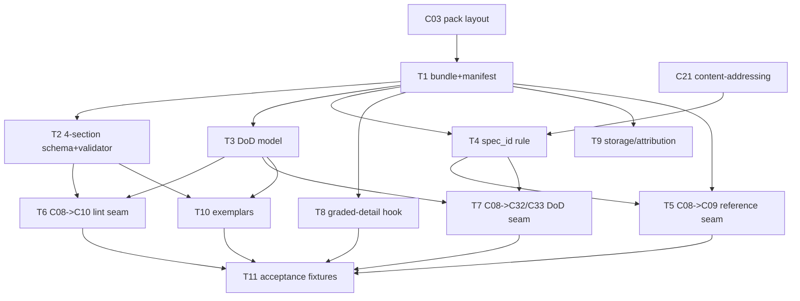

# C08 — Spec artifact & format (`spec-artifact`)  (Build Plan, Track B)

> Source / Spec ref: [`spec-optimized/C08-spec-artifact.md`](../spec-optimized/C08-spec-artifact.md)
> Inventory: C08, Spec Intake, artifact, foundational=yes. Depends on: C03, C21. Track: B (optimized). Sweep: 1.
> Deltas carried from spec: DELTA-01 (spec ≠ prompt.template), DELTA-02 (multi-file bundle), DELTA-03 (machine-checkable DoD), DELTA-04 (content-addressed `spec_id`), DELTA-05 (4-section schema), DELTA-06 (graded detail + clarification).

C08 is an **artifact + format**, not a running service: "building C08" is mostly *deciding, documenting, and validating the bundle format + identity contract* so dependents (C09, C10, C11, C32/C33, C39, C51/C52) build against a frozen shape. The Track-B plan adds, over Track A, the work created by the six deltas: a bundle/manifest format, a DoD criterion model, a content-address rule, a 4-section schema validator, and the graded-detail hook. It stays thin on code and heavy on contract-freezing — high-leverage because C08 is Batch-1 foundational and now also gates the evaluation tier (via the DoD).

## 1. Work breakdown

| Task | Description | Size | Prereqs |
|---|---|---|---|
| **T1 — Bundle + manifest format doc** | Author the authoritative bundle spec: directory layout (`spec.md`, `DoD.md`, `spec.toml`), manifest fields (`spec_id, name, detail_level, references, schema_version`), and INV-1/2/5. (Spec §3.1, §4; DELTA-02.) | M | C03 pack-layout shape |
| **T2 — 4-section schema + validator** | Define the required sections (Goal / Constraints / DoD-ref / Out-of-scope) and a deterministic validator that gates INV-2. This is the surface C10 lints. (Spec §3.2; DELTA-05.) | M | T1 |
| **T3 — Machine-checkable DoD model** | Define `DoD.md` as an enumerated criterion list with stable per-criterion ids + a scoring contract C32/C33 consume; seed the criterion taxonomy (deterministic / scenario-backed / judge-only — OQ2). (Spec §3.3; DELTA-03.) | M | T1 |
| **T4 — Content-address identity rule** | Specify `spec_id` = BLAKE3 over the canonicalized bundle, reusing C21's primitive; define canonicalization (file order, whitespace) so byte-identical bundles hash identically. Decide bundle-vs-per-file granularity (OQ3). (Spec §3.5 INV-3; DELTA-04.) | M | T1, C21 addressing primitive |
| **T5 — C08→C09 reference seam (DELTA-01)** | Freeze the reference contract: prompt template references a spec by `spec_id`; C08 guarantees resolvability + immutability; C09 renders *around* the spec, never *as* it. This is the delta with the biggest blast radius vs. Track A — pin it explicitly. (Spec §3.3; OQ1.) | M | T1, T4 |
| **T6 — C08→C10 lint surface seam** | Freeze the structured-section input contract C10 consumes (the 4 sections + DoD criterion ids). (Spec §3.3.) | S | T2, T3 |
| **T7 — C08→C32/C33 DoD evaluation seam** | Freeze the DoD-criterion → satisfaction contract: each criterion id is independently scoreable; satisfaction = fraction satisfied, pinned to `spec_id`. (Spec §3.3; DELTA-03/04.) | M | T3, T4 |
| **T8 — Graded-detail / clarification hook (DELTA-06)** | Specify `detail_level` semantics + the signal that triggers C09/C11 interactive clarification before build-token spend. (Spec §5; DELTA-06.) | S | T1 |
| **T9 — Storage + attribution convention** | Document pack/git layout: revision = commit (C41 actor identity), content = `spec_id`. No new tooling — convention + verification. (Spec §3.4 INV-4.) | S | T1, T4 |
| **T10 — Exemplars (positive + negative)** | Author one conformant bundle (a real target-system spec, StrongDM/Kilroy-shaped) + negatives: missing-section, unparseable-DoD, inlined-formula (INV-5 violation), unresolvable-manifest. The conformant one is the format model dependents build against. | M | T2, T3 |
| **T11 — Acceptance fixtures** | Encode AC-1…AC-8 (spec §8) as checkable fixtures, including the `spec_id` golden/mutation test and the loop fixture. | M | T5, T6, T7, T8, T10 |

No Go fork, no source-level Gas City work (AI-CONTEXT §3.5, §11.1): bundle files + a validator tool-node (C17-shaped) + documentation + fixtures.

## 2. Dependency graph

- **Inbound gates:** C03 (pack layout) and C21 (content-addressing). Both Batch-1 foundational → same-wave coordination, not blocking waits. Only T4/T5/T7 truly need C21; T1–T3 proceed in parallel with C21.
- **Outbound:** C08 gates **C09** (T5), **C10** (T6), **C11** (T1/T2 schema + T8), **C32/C33** (T7), **C39** (loop, T11), **C51/C52** (T1 bundle shape). Freezing T5 + T7 early unblocks the two biggest dependent clusters (build flow + evaluation tier).
- **Critical path inside C08:** T1 → T4 → {T5, T7} is the longest leverage path (identity must exist before the reference and DoD-evaluation seams can freeze).

## 3. Parallelization

After **T1** lands, four disjoint workstreams fan out:
- **WS-A (structure):** T2 (4-section schema/validator) → feeds T6, T10.
- **WS-B (evaluation):** T3 (DoD model) → feeds T6, T7, T10.
- **WS-C (identity):** T4 (`spec_id`) → feeds T5, T7, T9.
- **WS-D (authoring UX):** T8 (graded-detail) + T9 (storage) — independent.

WS-A/B/C/D write disjoint files and run concurrently. **T11** (acceptance fixtures) and **T10** (exemplars) are the join points. Prioritize **WS-C → T5** (the C09 reference seam, highest dependent-blocking) and **T7** (evaluation-tier seam) — these two unblock the most downstream work.

## 4. Interfaces-first / contract milestones

Freeze these first so dependents build against stubs:
1. **M1 — Bundle/identity (T1+T4).** "A spec is a `{spec.md, DoD.md, spec.toml}` bundle addressed by `spec_id`." Everything references this.
2. **M2 — Reference seam (T5).** The `spec_id` reference contract **C09** binds against; the single most dependent-blocking delta (DELTA-01). Freeze before C09 starts. (OQ1 must be resolved here.)
3. **M3 — DoD evaluation seam (T7).** The criterion-id → satisfaction contract **C32/C33** consume (DELTA-03). Freeze before the evaluation tier (C30–C34) builds.
4. **M4 — Lint surface (T6).** The 4-section + criterion-id contract **C10** consumes.
5. **M5 — Attribution (T9).** "revision = commit; content = `spec_id`" rule **C41/C34/C35** rely on.

Milestone order: M1 → {M2 ∥ M3} → {M4 ∥ M5}. M2 and M3 are the two priority gates (build flow + evaluation tier respectively).

## 5. Risks & de-risking order

1. **R1 — DELTA-01 boundary re-scope (OQ1, highest).** Decoupling spec from `prompt.template.md` re-draws the C08↔C09 line vs. Track A. *De-risk first:* author T5 jointly with the C09 author, settle whether the reference seam is owned by C08 (recommended: identity is a spec property) or C09, before freezing M2. Getting this wrong reshapes C09, C11, and the whole intake pipe.
2. **R2 — DoD determinism (OQ2).** If most DoD criteria need the LLM judge, DELTA-03's rigor gain over F18 is partial. *De-risk:* in T3, prototype the criterion taxonomy (deterministic | scenario-backed | judge-only) on the conformant exemplar (T10) and measure the deterministic fraction before claiming F18 is materially stronger.
3. **R3 — `spec_id` canonicalization (OQ3).** Whole-bundle vs. per-file addressing affects satisfaction-history join semantics. *De-risk:* settle canonicalization with C21 in T4 before T7 pins satisfaction-to-`spec_id`.
4. **R4 — Schema rigidity vs. authoring throughput (DELTA-05 × DELTA-06).** A required-section schema could *worsen* design-starvation (F25) it's meant to help. *De-risk:* validate in T8 that `detail_level: vague` + clarification keeps the 4-section floor cheap to clear (sections may be thin, not absent).
5. **R5 — C11 ↔ 4-section mapping (OQ4).** Confirm the 9-field crucible surjects onto Goal/Constraints/DoD/Out-of-scope with the C11 author before freezing T2.

## 6. Definition of done

**Per-task DoD** ties to spec §8 acceptance criteria:
- T1 ⇒ AC-1 (bundle format defined). T2 ⇒ AC-5 (lintable surface) + half of AC-2 (section gate). T3 ⇒ AC-4 (machine-checkable DoD). T4 ⇒ AC-3 (`spec_id` identity). T5 ⇒ AC-6 (separation) + M2 frozen. T6 ⇒ AC-5 seam. T7 ⇒ AC-4 satisfaction seam + M3 frozen. T8 ⇒ AC-8 (graded-detail). T9 ⇒ INV-4 attribution. T10 ⇒ AC-2 negatives. T11 ⇒ all AC-1…AC-8 are mechanically checkable.

**Per-component DoD:**
1. All eight acceptance criteria (AC-1…AC-8) pass via T11 fixtures.
2. M1–M5 contracts frozen + published so C09/C10/C11/C32/C33/C39/C51-C52 build against them.
3. The six deltas are each backed by either a frozen contract (DELTA-01→M2, -03→M3, -04→M1, -05→M4) or a behavioral fixture (DELTA-02→AC-1, -06→AC-8).
4. OQ1–OQ4 are recorded in [review-log](../_meta/review-log.md); OQ1 (the C08↔C09 re-scope) is resolved with the C09 author before M2 freezes.
5. The G16 disposition is recorded: C08 realizes P1 (stable under G16); the P12-substitution premise is deferred to C57. No delta depends on G16.
6. No Go fork / no source-level Gas City modification — extension is pack-only (validator is a C17 tool-node).
