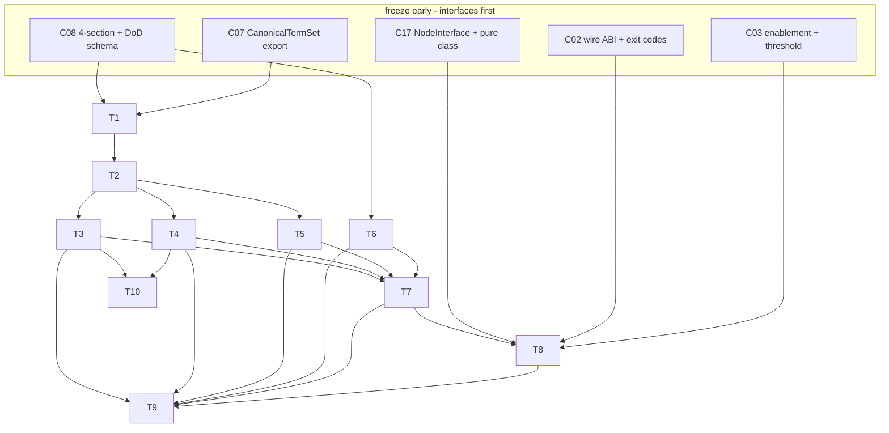

# C10 — Spec linter (EARS / INCOSE)  (`spec-linter-ears`)  (Build Plan, Track B)

> Source / Spec ref: [spec-optimized/C10-spec-linter-ears.md](../spec-optimized/C10-spec-linter-ears.md)

## 1. Work breakdown

| id | description | size | prereqs |
|---|---|---|---|
| T1 | **Freeze the report contracts** — `LintRequest`, `LintReport`, `Finding` schemas + the three `rule_id` family namespaces (`ears:*`, `incose:Rn`, `vocab:*`, `bundle:*`) + the score (0–1) definition (DELTA-01/06). Publish so C18/CI/C46 can stub against it. | S | C08 §3 section schema (contract); C07 `CanonicalTermSet` shape (contract) |
| T2 | **Rule-registry format** — the versioned, content-hashed data file holding `{rule_id, family, predicate-ref, default_severity, enabled_default, provenance, rationale}` (DELTA-05). Config-as-data, not code. | S | T1 |
| T3 | **EARS-form rule pack** — the five-template matcher (ubiquitous/event/state/unwanted/optional) over Constraints + DoD criteria; non-conformant / missing-modal / compound-trigger findings. | M | T1, T2 |
| T4 | **INCOSE R7–R35 triage + deterministic subset** — split the band into {deterministically checkable ⇒ C10 rule} vs {semantic ⇒ defer to judge} (OQ1), then implement each deterministic Rn as a registry rule with INCOSE-clause provenance. | M | T2; OQ1 resolution |
| T5 | **Vocabulary-lint rule pack** — load C07 `CanonicalTermSet` (by content hash); flag undefined / off-canon (rejected-sense) / deprecated-alias usages (DELTA-04, F38). | M | T1, T2; C07 export frozen |
| T6 | **Section/sentence extraction over C08 bundle** — locate labelled sections, enumerate DoD criteria + bullet Constraints, segment requirement sentences (OQ2: lint lists hard, prose soft). | M | C08 bundle format frozen |
| T7 | **Score + graded-gating engine** — aggregate findings → score (DELTA-06); map (`detail_level`, score, severity, C03 threshold) → `gate_result` {pass\|advisory\|block} (DELTA-03). | S | T3, T4, T5 |
| T8 | **C17 `pure` tool-node packaging** — wrap the engine as a `pure` node (C17 DELTA-03); C02 wire ABI conformance; exit-code mapping (lint-fail vs engine-error distinct, §3.2/AC-9); pack manifest + C03 enablement section. | M | T7; C17 NodeInterface + C02 wire ABI frozen |
| T9 | **Fixtures + acceptance tests** — positive/negative per rule family, determinism golden+repeat (AC-1), graded-gating fixture (AC-6), score-ordering (AC-7), pack-absent non-breaking (AC-8), exit-code (AC-9). | M | T3–T8 |
| T10 | **Provenance / license hygiene** — record `transfused_from` + license per transfused EARS-rule (C51 / README:108 "any EARS-rule implementation"). | S | T3, T4 |

## 2. Dependency graph

**Critical path:** C08 section schema + C07 term-set export (contracts) → T1 → T2 → {T4 INCOSE triage, the longest rule work, gated on OQ1} → T7 → T8 → T9. C10 is **not on the system critical path** (component-inventory: not foundational, Batch 2); its inputs are two freezable contracts, so it builds fully in parallel with the rest of Spec Intake once those contracts exist.

## 3. Parallelization

Once T1+T2 land, the **three rule families fan out independently**: T3 (EARS), T4 (INCOSE), T5 (vocabulary) have no inter-dependency — three workstreams. T6 (extraction) runs in parallel with all three (it depends only on C08's bundle format, not on the rules). T10 (provenance) shadows T3/T4. Only T7 (score/gating) and T8 (packaging) serialize, because they consume all rule outputs and the C17/C02 contracts respectively.

Explicit fan-out after T2:
- WS-A: T3 EARS rule pack
- WS-B: T4 INCOSE deterministic subset (longest — start first; gate on OQ1)
- WS-C: T5 vocabulary-lint + C07 wiring
- WS-D: T6 section/sentence extraction
- WS-E: T10 provenance/license (tracks A+B)

## 4. Interfaces-first / contract milestones

Freeze in this order so dependents build against stubs:
1. **`LintReport` / `Finding` schema + `rule_id` namespaces + score definition (T1).** This is C10's *output* contract — C18/CI gate logic, C46 meta-metric ingestion, and the C09 pre-build hook all bind to it. Freeze first; everything downstream of C10 stubs against a sample report.
2. **Consumed contracts C10 binds to (must be frozen by their owners before C10's internals):**
   - C08's 4-section schema + DoD enumeration + `detail_level` (C08 DELTA-05/03/06) — C10's *input surface*.
   - C07's `CanonicalTermSet` export shape + content-hash versioning (C07 DELTA-04) — vocab-lint input.
   - C17 `NodeInterface` + `pure` determinism class; C02 wire ABI + exit-code taxonomy — packaging surface.
3. **Rule-registry format (T2).** The data shape for rules; lets rules be authored as data in parallel and lets C35 (override loop) propose new rules without a code change.

C10 publishes **one** contract (the report) and consumes **four** (C08 sections, C07 term set, C17 node interface, C02 wire ABI). All four are owned by Batch-1/early-Batch-2 components, so C10's dependence is on already-prioritized contracts — no new critical-path pressure.

## 5. Risks & de-risking order

| risk | spike / de-risk first |
|---|---|
| **R1 — INCOSE R7–R35 over-claim (OQ1).** Some INCOSE rules are semantic, not deterministically checkable; implementing them as a "deterministic linter" would either crash or silently mis-flag. | **Spike T4's triage first.** Before writing any INCOSE rule, classify each Rn in the band as deterministic-checkable vs. semantic-defer-to-judge; this defines the real scope and keeps F18's residual honest (INV-5). Highest-uncertainty item — retire it first. |
| **R2 — Sentence segmentation over Markdown prose (OQ2).** Reliable requirement extraction from free prose is error-prone; bad segmentation undermines every EARS/INCOSE rule. | **Prototype T6 against real C08 fixtures.** Decide early: lint enumerated DoD + bullet Constraints *hard*, free-prose *advisory only*. Cross-check with the C08 author whether Constraints should be required-enumerated (would eliminate the segmentation risk wholesale). |
| **R3 — Determinism leak.** A rule that reaches for a clock/network/model breaks C17 `pure` caching + C49 replay. | Enforce purity at rule-registry review (a rule predicate has no I/O); add the determinism golden+repeat test (AC-1) early so any leak fails CI immediately. |
| **R4 — Term-set version skew.** C10 linting against a stale `CanonicalTermSet` mis-flags vocabulary. | Pin `term_set_version` in every report (INV-4) and assert match in tests; coordinate the C07 export content-hash contract before T5. |
| **R5 — Gate annoyance blocks adoption.** README marks C10 "(optional)"; an over-eager gate gets turned off and the F18/F38 value is lost. | Land graded gating (T7/DELTA-03) and the score-threshold (not any-error-blocks) before turning the gate on anywhere; ship `advisory` as the default disposition for `vague`/`moderate` specs. |

De-risking order: **R1 (INCOSE triage) → R2 (segmentation prototype) → R3 (purity test) → R4/R5.** R1 and R2 are the two that can invalidate the rule design; spike both before committing to T3/T4/T5 at scale.

## 6. Definition of done

**Per-component (ties to spec §8 AC):**
- C10 runs as a C17 `pure` node; identical inputs ⇒ byte-identical report; C17 cache-hit on re-run (AC-1).
- All three rule families produce correct findings on positive/negative fixtures (AC-2/3/4), including completeness over C08 sections (AC-5).
- Graded gating works: `vague` ⇒ advisory, `complete` ⇒ block-on-threshold (AC-6); score orders cleaner specs higher and the gate is a score-threshold, not any-error veto (AC-7).
- Optional/non-breaking: a valid build with the pack absent proceeds with no error (AC-8).
- Lint-failure vs. linter-failure exit codes are distinct against C02's taxonomy (AC-9).
- Every transfused EARS rule records `transfused_from` + license (T10; C51 hygiene).

**Per-task DoD:** each Tn ships its fixtures and its slice of the acceptance set; T1's report schema is published and stubbed-against by at least one downstream (C18/CI or C46) before T7 closes.

**Sweep-1 exit:** contracts frozen (report out; C08/C07/C17/C02 in), three rule families enumerated (with INCOSE band triaged per OQ1), graded-gating + score defined, and the acceptance fixtures above green. Concrete R7–R35 predicate table, full JSON schemas, and C02 exit-code numbers are sweep-2 deliverables.
