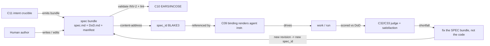

# C08 — Spec artifact & format (`spec-artifact`)  (Spec, Track B)

> Source: README §"Principle 1 — Specs are the source of truth" (lines 100–111); AI-CONTEXT §1 (principle table), §3.1 (coverage map), §3.4 (smallest viable install, `agents/<name>/prompt.template.md`), §13.1 (Phase 0 prompt template); [`one-shot-specs-and-research.md`](../one-shot-specs-and-research.md) Part 1 (StrongDM/Kilroy/Fabro real dark-factory specs) + Part 2 (spec-attribute → success research) + the §"Notes on what was excluded" finding that Gas City ships *formulas/molecules, not standalone target-system specs*; F-MODE-COVERAGE F18, F38, F3, F36; companion faithful spec [`spec-faithful/C08-spec-artifact.md`](../spec-faithful/C08-spec-artifact.md) (esp. OQ-1); _meta gap [G16](../_meta/ambiguities-and-gaps.md).
> Inventory ID: C08   Kind: artifact   Status: sweep-1
> Deltas: DELTA-01 (resolve OQ-1: the spec artifact is a **standalone target-system Markdown** that `prompt.template.md` *references*, NOT the prompt template itself — decouples C08 from C09); DELTA-02 (a spec is a **multi-file bundle** — `spec.md` + `DoD.md` (acceptance) + optional `*.dot` workflow ref — addressed by a manifest, not a single file); DELTA-03 (mandatory **machine-checkable Definition-of-Done** as a first-class part of the artifact — the "satisfied?" anchor for C32/C33, closes the prose-only weakness of F18); DELTA-04 (content-addressed **spec identity** = BLAKE3 over the bundle, so a run, a judgment, and a satisfaction score all pin the exact spec revision they were measured against — git-commit identity is necessary but not sufficient); DELTA-05 (light **required-section schema** — Goal / Constraints / DoD / Out-of-scope — replacing the faithful "free-form Markdown", to give C10/C11 a real surface and attack F3 under-specification); DELTA-06 (explicit **graded-detail / authoring-throughput** stance — the spec format carries a `detail_level` + an interactive-clarification hook, grounded in the Part-2 research, to attack F25/G15 design-starvation).

## 1. Purpose & responsibility

C08 is the **source-of-truth spec artifact and its format** — the human-(or factory-)authored, version-controlled, content-addressed description of *what a target system must do and what counts as done*, from which disposable code is generated (Principle 1: "Code is disposable; specs are the load-bearing artifact… you fix the spec and rebuild, not the output", README:102; AI-CONTEXT §1).

> [DELTA-01] **What v4 said:** README:106 maps the "Spec format" row directly onto Gas City prompt templates (`agents/<name>/prompt.template.md`, Go `text/template` + Markdown), collapsing "the spec" into the agent's prompt file (this is exactly the faithful reading, and the faithful spec's load-bearing OQ-1). **Change:** the spec artifact is a **standalone target-system Markdown bundle** that the prompt template *references*, not the prompt template itself. **Rationale (force: fidelity-to-evidence + simplicity + separation-of-concerns):** every real dark-factory in the v4 corpus separates these — StrongDM is "*no code at all, just three markdown files describing the spec*" (`attractor-spec.md`, distinct from `coding-agent-loop-spec.md`); Kilroy ships `spec.md` + `DoD.md` + a `.dot` workflow as *separate* files; and the corpus explicitly records that Gas City itself "publish[es] no one-shot application specs — their work primitives are *formulas* and *molecules*… not standalone target-system specs" ([one-shot corpus](../one-shot-specs-and-research.md) §"Notes on what was excluded"). Collapsing the spec into the prompt template conflates *what to build* (stable, the source of truth) with *how this agent is told to act* (a render-time concern, C09) and *the methodology DAG* (C12). **Tradeoff accepted:** one more artifact + a reference/binding seam (C08→C09) instead of "the spec *is* the prompt"; mitigated because the seam already exists (C09 is the binding component) and the decoupling is what the field actually does.

C08 owns:
- The **on-disk artifact shape**: a versioned, content-addressed *spec bundle* describing a target system, authored by a human or by the factory (C52).
- The **format contract**: a light required-section schema over Markdown (DELTA-05) plus a machine-checkable Definition-of-Done (DELTA-03) and a manifest binding the bundle's parts (DELTA-02).
- The **identity contract**: a stable content-address (DELTA-04) so every run/judgment/score pins the exact spec it was measured against.
- The **"specs in → satisfying software out, code disposable"** semantics: the spec (incl. its DoD) is the load-bearing source of truth; generated code is a disposable derivative.

**What C08 is NOT:**
- **Not** the render/binding mechanism deciding *which* spec drives *which* work, nor the holder of agent-acting instructions — that is **C09** (which now *references* a C08 spec). (README:109; DELTA-01.)
- **Not** the structural validator — EARS/INCOSE linting is **C10** (C08 *defines the surface* C10 lints, DELTA-05).
- **Not** structured *intake* — the 9-field crucible is **C11** (which now *produces* a C08 bundle, §2).
- **Not** the workflow/methodology DAG — that lives in the **formula** (C12); a spec bundle may *reference* a formula but does not contain methodology (README:128).
- **Not** the config/feature-flag layer — that is **C03**; C08 only depends on C03 for where the bundle sits in the pack/TOML model.
- **Not** the judge or satisfaction metric — C32/C33; C08 supplies the **DoD** they evaluate against (DELTA-03).

## 2. Context & dependencies

| Direction | Component | Relationship |
|---|---|---|
| Upstream (depends on) | **C03** config/feature-flags | The spec bundle lives in a git-versioned pack whose layout/section-gating C03 governs (inventory C08 `Depends on: C03`; AI-CONTEXT §3.4). |
| Upstream (depends on) | **C21** CXDB / content-addressing | C08 reuses the substrate's BLAKE3 content-addressing for `spec_id` (DELTA-04). Soft/build-time dependency: C08 defines the addressing rule; CXDB provides the primitive. |
| Upstream (authored by) | **C11** intent intake (9-field crucible) | C11 is the structured *intake* that **emits a C08 bundle** (its DoD/constraints become the spec's required sections, DELTA-05). |
| Downstream (references + renders) | **C09** prompt-template binding | The prompt template **references a C08 `spec_id`**; C09 renders the agent instruction *around* the spec, not *as* it (DELTA-01). |
| Downstream (validates) | **C10** spec linter (EARS/INCOSE) | Runs deterministic structural rules over the required sections (DELTA-05; F18, F38). |
| Downstream (measures against) | **C32 / C33** judge + satisfaction | Evaluate work against the spec's **machine-checkable DoD** (DELTA-03); satisfaction is "% of DoD criteria met over the trajectory population", pinned to a `spec_id` (DELTA-04). |
| Downstream (re-enters as fix target) | **C39** fix-task loop-closure | A failure routes to a *spec-bundle revision* (new `spec_id`), not an output patch (Principle 1; inventory C39 `Depends on: C08`). |
| Downstream (bootstrap input/output) | **C51 / C52** gene-transfusion / self-bootstrap | The factory authors a C08 bundle *for its own next component* and transfuses from an exemplar bundle (inventory C51/C52 `Depends on: C08`). |

C08 is at the head of **Spec Intake**, Batch-1 foundational: C09, C10, C11, C32/C33, C39, C51/C52 all reference its format and identity.

## 3. Interfaces / contracts

Named-and-described (sweep 1; concrete schema/signatures in sweep 2).

### 3.1 The spec bundle (DELTA-02)
A spec is a **directory bundle**, not one file, with a manifest:
- `spec.md` — the target-system description (required; the StrongDM/Kilroy `spec.md` shape).
- `DoD.md` — the **machine-checkable Definition-of-Done** (required; DELTA-03; the Kilroy `DoD.md` / Fabro `spec-dod` shape): an enumerated, checkable acceptance list that C32/C33 score against.
- `spec.toml` (manifest) — `{ spec_id, spec_lineage_id, name, detail_level, references: { formula?: <C12-ref>, exemplar?: <C51-ref>, dod: DoD.md }, schema_version }`. `spec_lineage_id` is the stable identity of "this spec across revisions" (minted at creation); `spec_id` is the per-revision content-address (DELTA-04). C33 satisfaction / C46 meta-metrics key time-series on `spec_lineage_id` and annotate each point with the `spec_id` it was measured at — so a revision is a visible step-change in one continuous series, not a severed new series.
- *Bundle-hash rule (DELTA-04):* `spec_id` = a Merkle hash over the bundle's files in sorted relative-path order, with the manifest's own `spec_id` field excluded from the hashed bytes (so the manifest can carry the hash of a bundle that includes the manifest). Full canonicalization spec → sweep-2 (with C21).
- optional `*.dot` / formula reference — the methodology DAG lives in C12; the bundle only *points at* it (DELTA-01).

### 3.2 Required-section schema (DELTA-05)
`spec.md` MUST contain four labelled sections: **Goal**, **Constraints** (functional + non-functional, per ArchCode/PRDBench, Part 2), **Definition-of-Done** (pointer to `DoD.md`), **Out-of-scope**. This is the minimum that lets C10 lint *vocabulary + completeness* (not just prose form) and gives the under-specification failure F3 a structural surface.
> [DELTA-05] **v4 said:** body is "arbitrary; whatever the worker's initial prompt should be" (AI-CONTEXT §3.4) — free-form. **Change:** four required sections. **Rationale (force: failure/quality):** Part-2 research (ArchCode arXiv:2408.00994; PRDBench arXiv:2510.24358; "sweet spot with partial docstrings" arXiv:2510.26130) shows that *making functional + non-functional requirements and an explicit DoD present* materially raises pass-rate and is the difference between an anchored and an "unanchored" spec. Free-form prose is precisely F18 ("prose specs lack rigor"). **Tradeoff:** mild authoring rigidity; bounded by keeping it to four sections (not a heavyweight template) and by DELTA-06's graded `detail_level`.

### 3.3 Outbound contracts
- **Reference/identity contract (→ C09).** C09 binds work to a spec by `spec_id` (content-address, DELTA-04), and renders the agent instruction that *embeds or links* the bundle; C08 guarantees the bundle is resolvable and immutable under that id.
- **Lint contract (→ C10).** The four required sections are the structured input surface for EARS/INCOSE rules (DELTA-05).
- **DoD/evaluation contract (→ C32/C33).** `DoD.md` is an enumerated, machine-addressable criterion list; each criterion has a stable id so satisfaction is "fraction of criteria met", scoreable per-criterion (DELTA-03).

### 3.4 Inbound contracts
- **Authoring (human or C11 → bundle).** A human writes the bundle, or C11 emits it from the 9-field crucible; either way the manifest + four sections + DoD must validate.
- **Storage (bundle → git pack).** Committed into a git-versioned pack; revision identity = git commit, **content identity = `spec_id`** (DELTA-04). Attribution rides git + C41.

### 3.5 Invariants
- **INV-1 (source-of-truth).** The bundle — including its DoD — is authoritative; code is a disposable derivative; fixes target the bundle (README:102).
- **INV-2 (well-formed bundle).** The manifest resolves; the four required sections exist; `DoD.md` parses as an enumerated checkable list. A bundle failing this is rejected before any run (replaces the faithful "must parse as a Go template" — renderability is now C09's concern, not C08's, DELTA-01).
- **INV-3 (immutable identity, two-level).** `spec_id` is the content-address of the *revision* (any edit yields a new `spec_id`); `spec_lineage_id` is the stable cross-revision identity. Runs, judgments, and satisfaction scores cite the `spec_id` they measured and roll up under `spec_lineage_id` (DELTA-04). This prevents both *mixing* revisions (a revision is a distinct `spec_id`) and *severing* the satisfaction time-series at every edit (the series is keyed on lineage).
- **INV-4 (versioned + attributable).** Every revision is a git commit carrying actor identity (README:107; C41).
- **INV-5 (separation).** The bundle contains *what to build + done-criteria*, never agent-acting instructions (C09) or methodology DAG (C12). A bundle that embeds a formula inline fails lint (DELTA-01/DELTA-02).

## 4. Data model / state

C08 owns an **artifact**, not a live store.

| Aspect | Optimized spec |
|---|---|
| Physical form | A **directory bundle** (`spec.md`, `DoD.md`, `spec.toml` manifest, optional formula ref) in a git pack (DELTA-02). |
| Identity | `spec_id` = BLAKE3 over the canonicalized bundle (DELTA-04), reusing C21's content-addressing primitive. Git commit = revision/attribution; `spec_id` = content identity. |
| Required structure | Goal / Constraints / DoD / Out-of-scope in `spec.md`; enumerated criterion list in `DoD.md` (DELTA-05/03). |
| `detail_level` | `vague | moderate | complete` field in the manifest (DELTA-06), grounded in the Kilroy graded-detail corpus + arXiv:2311.07599; informs C09/C11 whether to trigger interactive clarification. |
| Lifecycle | Authored (human or C11) → validated (INV-2) → content-addressed → committed → referenced by C09 → drives a run → scored against DoD by C32/C33 → on shortfall, revised → **new `spec_id`** → rebuild. |
| Persistence | Git history (revisions) + content-address (immutable snapshots). Runs/judgments in C19/C21 carry the `spec_id` they were measured against. |
| Consistency | Git commit = consistency boundary for revisions; `spec_id` = immutable snapshot identity. |

## 5. Behavior

Key flows:
- **Spec-as-source-of-truth loop.** A run that fails its DoD routes (via C39 `fix_task`) to a *bundle revision*; the new `spec_id` re-drives the build. The DoD makes "did it work?" mechanically answerable rather than a human eyeball (attacks G23 at the C08 boundary by supplying the criterion list bootstrap-validation needs).
- **Graded-detail / clarification (DELTA-06).** A `detail_level: vague` bundle signals C09/C11 to run an interactive-clarification pass before committing build tokens — directly applying the Part-2 finding that "interactivity boosts performance on underspecified inputs by up to 74%" (Ambig-SWE, arXiv:2502.13069). This is the spec format's structural answer to design-starvation (F25/G15): the spec can be *deliberately* low-detail and still safe, because under-specification is detected and remediated, not silently guessed.

## 6. Failure modes & handling

| F-mode | Applies how | Optimized handling |
|---|---|---|
| **F18** Prose specs lack rigor | Free-form prose is ambiguous. | Required-section schema (DELTA-05) + **machine-checkable DoD** (DELTA-03) move the spec from prose to a checkable contract; C10 lints the sections. Materially stronger than faithful "Partial — prose ambiguity remains": the DoD is the deterministic anchor. |
| **F3** Spec-completeness fallacy | A spec can't enumerate all that shouldn't happen. | **Out-of-scope** required section + DoD criteria + `detail_level`/clarification (DELTA-06) raise the completeness floor; twins (C44) + scenarios (C30) still backstop the residual. Honest: not eliminated, but the structural surface to detect under-specification now exists. |
| **F38** Vocabulary lint debt | Specs use undefined terms. | C10 lints the structured sections against C07's canonical term set; the schema gives lint a real surface (not just prose). |
| **F36** Instruction-following ceiling | One spec can exceed the model's ceiling. | Bundle granularity = **one target-system spec per component** (not "one prompt.template.md per agent"); `detail_level` + chunking guidance. The DoD lets a large spec be *decomposed by criterion* and partially scored. |
| **F25 / G15** Design starvation (operator can't spec fast enough) | Authoring throughput is the bottleneck. | DELTA-06: `detail_level: vague` is a *legitimate, safe* state — the clarification hook + C11 crucible let an operator emit a deliberately thin spec and have the factory drive it to completeness, rather than requiring a complete spec up-front. Mitigation, not elimination (conceded residual). |
| **G16** "Is the 12-principle set right?" | Architecture-premise gap assigned to C08. | C08 *realizes P1* ("specs as source of truth"), which is **not** the principle G16 contests (P12-for-pipeline-sharing substitution). Disposition: P1 is stable under G16; the substitution question is deferred to the architecture owner (C57 / README "first bet"). DELTA-01..06 do not depend on G16's resolution. |

## 7. Cross-cutting

- **Security / secrets.** Bundle is plaintext Markdown/TOML in git; secrets never belong in a spec (credential handling is C03/`city.toml`, G37). The DoD must not encode secrets; lint can flag obvious secret-shaped tokens (sweep-2).
- **Attribution / governance.** Revisions are git commits with actor identity (C41); `spec_id` makes "which exact spec did this run satisfy?" auditable — load-bearing for holdout-integrity (C34) and override audits (C35).
- **Cost / scale.** Bundles are small text; artifact cost negligible. The real scale lever is *authoring throughput* (F25) — addressed structurally by DELTA-06, not by artifact size.
- **Observability.** `spec_id` is the join key that lets C33 satisfaction, C46 meta-metrics, and C49 counterfactual replay all reference *the same* spec revision. Without content-address identity (DELTA-04), satisfaction-over-time silently mixes spec revisions — a measurement-integrity bug the faithful single-file/git-only model doesn't prevent.

## 8. Acceptance criteria & test strategy

1. **AC-1 (bundle format defined).** A documented bundle format exists: `spec.md` (4 required sections) + `DoD.md` (enumerated checkable list) + `spec.toml` manifest, in a git pack (DELTA-02/05). *Tooling: a validator accepts a conformant bundle, rejects a missing-section one.*
2. **AC-2 (well-formed gate, INV-2).** A bundle missing a required section, an unparseable DoD, or an unresolvable manifest is rejected before any run. *Negative fixtures.*
3. **AC-3 (content-address identity, INV-3/DELTA-04).** `spec_id` is stable for byte-identical bundles and changes on any edit; a run record carries the `spec_id` it ran. *Golden + mutation test.*
4. **AC-4 (DoD is machine-checkable, DELTA-03).** Each `DoD.md` criterion has a stable id and a boolean/scored evaluation; C32/C33 can compute "fraction satisfied". *A sample DoD scores deterministically.*
5. **AC-5 (lintable surface, DELTA-05).** C10 consumes the four sections and flags an undefined term + a missing constraint. *Linter fixture.*
6. **AC-6 (separation, INV-5/DELTA-01).** A bundle that inlines agent-acting instructions or a formula DAG fails lint; the prompt template references the bundle by `spec_id` and renders correctly without containing the spec. *Cross-check against C09 stub.*
7. **AC-7 (source-of-truth loop).** A DoD shortfall produces a `fix_task` (C39) targeting a *bundle revision* → new `spec_id` → rebuild. *Loop fixture.*
8. **AC-8 (graded-detail, DELTA-06).** A `detail_level: vague` bundle triggers the clarification hook before build; a `complete` one does not. *Behavioral fixture.*

Sweep-1 strategy: conformant + negative bundle fixtures, a `spec_id` golden/mutation test, a sample machine-checkable DoD, and a loop fixture. Concrete schemas/signatures → sweep 2.

## 9. Open questions

- **OQ1 (→ [review-log](../_meta/review-log.md), top open question).** *Diffability cost of DELTA-01.* Decoupling the spec from `prompt.template.md` is the right engineering call per the corpus, but it re-scopes the C08↔C09 boundary relative to faithful Track A (which collapses them). Does the reference seam belong to C08 (spec exposes a `spec_id` C09 resolves) or to C09 (C09 owns the reference and C08 is "just files")? This determines whether C11→C08→C09 is a clean three-stage pipe or whether C09 absorbs intake. Recommend: seam owned by C08 (identity is a spec property), C09 consumes — but flag for cross-component reconciliation with the C09 author.
- **OQ2 (→ review-log).** *DoD expressiveness vs. determinism (DELTA-03).* How much of a DoD can be *deterministically* checkable (test-pass, lint, scenario) vs. requiring the LLM judge (C32)? If most criteria need the judge, the DoD is "satisfaction prose with ids" and F18's rigor gain is partial. Needs a DoD criterion taxonomy in sweep 2 (deterministic | scenario-backed | judge-only).
- **OQ3 (→ review-log).** *`spec_id` granularity (DELTA-04).* Content-address the whole bundle, or per-file (so a DoD-only edit doesn't invalidate satisfaction history tied to an unchanged `spec.md`)? Per-file is more precise but complicates the join key. Defer to sweep 2 with C21.
- **OQ4 (→ review-log).** *Where does C11's 9-field crucible map onto the 4 required sections (DELTA-05)?* If the crucible's fields don't surject onto Goal/Constraints/DoD/Out-of-scope, either the schema or the crucible needs adjustment. Cross-reference with the C11 author.
