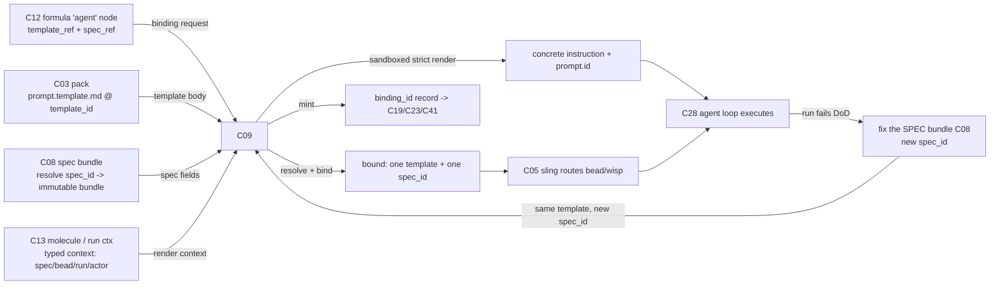

# C09 — Prompt template & spec→execution binding (`prompt-template-binding`)  (Spec, Track B)

> Source: README §"Principle 1 — Specs are the source of truth" (lines 106, 109, 111 — "Spec format" + "Spec → execution binding" rows), README:128 ("methodology lives in the file, not in agent prompts"), README:362/542 (Phase-0 `agents/worker/prompt.template.md`); AI-CONTEXT §3.2 (line 89 "Prompt Templates: Go `text/template` markdown"; line 92 "Dispatch (Sling) routes bead/wisp to agent or pool"), §3.4 (smallest viable install, line 119 `agents/<name>/prompt.template.md`), §4.3 (telemetry correlation keys incl. `prompt.id`); F-MODE-COVERAGE F18, F36, F37, F38. Companion faithful spec [`spec-faithful/C09-prompt-template-binding.md`](../spec-faithful/C09-prompt-template-binding.md) (esp. OQ-1). **Binding-seam partner:** optimized [`spec-optimized/C08-spec-artifact.md`](./C08-spec-artifact.md) DELTA-01 (spec = standalone bundle referenced by `spec_id`) — C09 is the consumer of that seam. Lateral: [`spec-optimized/C12-formula-pipeline-file.md`](./C12-formula-pipeline-file.md) DELTA-03 (`template_ref` / `NodeBinding` / `FormulaParameters`); [`spec-optimized/C28-claude-code-agent-loop.md`](./C28-claude-code-agent-loop.md) (`prompt.id` correlation). _meta gap notes: C09 row has **no assigned Gxx**; C09 touches F18/F36/F37/F38 and the C08↔C09 boundary (G16-adjacent OQ1).
> Inventory ID: C09   Kind: interface   Status: sweep-1
> Deltas: DELTA-01 (adopt C08-B DELTA-01: C09 renders the agent instruction *around* a spec it **references by `spec_id`**, it does not render the spec *as* the template — the inbound contract becomes `template_body + resolved spec bundle + render context`); DELTA-02 (a **typed render context** with a closed, versioned variable namespace — `spec`, `bead`, `run`, `actor` roots — replacing v4's "arbitrary" free-form context, so missing-variable is a deterministic dispatch error not a silent empty prompt); DELTA-03 (**content-addressed binding record** `binding_id` = hash over `{spec_id, template_id, formula_node_id, agent_role}`, persisted as an attributable edge — "which exact spec+template revision drove which work" becomes a join key, not folklore); DELTA-04 (**render is sandboxed + side-effect-free** — no filesystem/exec template funcs — closing a lethal-trifecta hole where a spec author could smuggle execution into the instruction render); DELTA-05 (**strict-missing-key render mode** + a `prompt.id` emission contract so the rendered instruction is correlatable in CXDB/telemetry); DELTA-06 (**spec-embed strategy is explicit and bounded** — `link` vs `inline` vs `summarized` — to attack F36 instruction-following-ceiling at the binding layer, not just upstream).

## 1. Purpose & responsibility

C09 is the **prompt-template + spec→execution binding interface**: the seam that turns a static, content-addressed spec bundle (C08) into a *concrete agent instruction string*, and that records **which spec drives which work**. It owns the **template** (the Go `text/template` Markdown that becomes the agent's instruction) and the **render+bind transform**; the spec it serves is a separate, standalone artifact it *references*.

> [DELTA-01] **What v4 said:** README:106 maps the "Spec format" row onto `agents/<name>/prompt.template.md` and treats the prompt template *as* the spec (the faithful collapse; faithful C09 §1, C08 faithful OQ-1). **Change:** C09 renders the instruction **around a spec bundle it references by `spec_id`** (C08-B DELTA-01), not by rendering the spec-as-template. The template is now a thin, stable *instruction shell* ("you are implementing the spec at `{{ .spec.id }}`; goal: `{{ .spec.goal }}`; …") that pulls fields from the resolved C08 bundle. **Rationale (force: separation-of-concerns + fidelity-to-evidence + parallelizability):** the C08-B corpus evidence (StrongDM/Kilroy ship `spec.md`+`DoD.md` as files *distinct* from the agent-loop spec) makes "what to build" (C08, stable source of truth) separate from "how this agent is told to act" (C09, render-time). Decoupling lets C08 and C09 build in parallel against a frozen `spec_id` contract instead of co-editing one file. **Tradeoff accepted:** C09 gains an inbound *resolve-`spec_id`→bundle* step it did not have under the collapse; mitigated because C08 owns the identity contract (C08-B OQ1 recommendation: seam owned by C08, C09 consumes) so C09 only *reads* a resolvable, immutable bundle.

C09 owns:
- **The template artifact** (`agents/<name>/prompt.template.md`): the Go `text/template` Markdown *instruction shell* for an agent role, version-controlled in a pack (C03). This is the one artifact C09 owns end-to-end.
- **The render transform**: `(template_body, resolved C08 bundle@spec_id, typed render context) → concrete instruction string`, deterministic, sandboxed (DELTA-04), strict on missing keys (DELTA-05).
- **The binding contract**: the resolution of `formula-node → template-name → agent-role → spec_id` at dispatch, and the **content-addressed binding record** (DELTA-03) that makes the binding an attributable, queryable edge.
- **The "rebuild" half of Principle 1**: when a spec revision lands (new `spec_id`), C09 re-renders the same template against the new bundle — "fix the spec and rebuild" (README:102) is mechanically *the same binding, a new `spec_id`, a re-render*.

**What C09 is NOT:**
- **Not** the spec artifact/source-of-truth — that is **C08** (a standalone bundle). C09 references it by `spec_id` and renders an instruction *around* it (DELTA-01; C08-B DELTA-01).
- **Not** the dispatch/routing engine — **C05 sling** routes the bead/wisp to an agent/pool; C09 supplies the template-name→spec binding sling resolves and renders, and emits the binding record. C09 does not own the dispatch loop (README:109; AI-CONTEXT:92).
- **Not** the workflow/methodology DAG — that is the **formula (C12)**; a formula `agent` node carries a `template_ref` (C12-B DELTA-02/03) *into* C09. Methodology must not leak into the rendered instruction (INV-3; README:128).
- **Not** the structural validator (**C10** EARS) nor the intent crucible (**C11**). C09 consumes a validated spec; it neither lints nor authors one.
- **Not** the agent loop (**C28**). C09 produces the instruction string + `prompt.id`; C28 executes the multi-turn reasoning against it and owns telemetry emission.
- **Not** the config/secrets layer (**C03**). Secrets never enter a template (DELTA-04 sandbox + §7).

## 2. Context & dependencies

| Direction | Component | Relationship |
|---|---|---|
| Upstream (references) | **C08** spec artifact (bundle) | C09 resolves a `spec_id` to an immutable bundle and reads its fields (`goal`, `constraints`, `dod_ref`, `out_of_scope`, `detail_level`). **Reference, not render-of** (DELTA-01). Hard inventory dep (`Depends on: C08`). The seam (identity ownership) is C08's (C08-B OQ1). |
| Upstream / lateral (binds via) | **C05** sling/dispatch | Sling routes the work item to an agent with a *specific* template; C09 supplies the `formula-node→template-name→agent-role→spec_id` resolution and renders for the item. Hard inventory dep (`Depends on: C05`). |
| Upstream (names the template + supplies params) | **C12** formula | A formula `agent` node carries `{template_ref (C09), spec_ref, role/rig hint}` (C12-B DELTA-02/03). C12 owns the `template_ref` *reference contract*; C09 owns *resolving and rendering* it. The C12↔C09 reference shape is a shared interface freeze (M1). |
| Lateral (supplies render variables) | **C13** molecule | The live bead-tree run context is the source of the `bead`/`run` render roots (DELTA-02). Soft — variable source, not a hard edge. |
| Downstream (consumes instruction) | **C28** Claude Code agent loop | The rendered instruction is the agent's initial prompt; C28 executes against it and emits telemetry. C09 supplies the `prompt.id` correlation key (DELTA-05; C28 §3 correlation keys). |
| Lateral (attribution + binding record) | **C41** identity/attribution; **C19/C23** work-graph/event-bus | The binding record (DELTA-03) is an attributable edge carrying `created_by` (C41), persisted on the work-graph/event-bus so "which spec+template drove this work" is queryable. |

C09 sits at the head of the **build flow** in **Spec Intake**, is **foundational** (inventory `Foundational? = yes`), and is **Batch-2** (depends on Batch-1 C08 and on C05). It is the connective tissue between the spec (C08), the methodology (C12), the router (C05), and the worker (C28).

## 3. Interfaces / contracts

Sweep-1: interfaces **named + described**; concrete signatures, the full variable schema, and the binding-record schema → sweep 2.

### 3.1 Inbound

- **Template-source interface (C03 pack → C09).** A Go `text/template` Markdown file at `agents/<name>/prompt.template.md` in a pack (README:106; AI-CONTEXT:119). C09 receives the template body + the agent name + a `template_id` (content-address of the template body, by analogy to `spec_id`).
- **Spec-reference interface (C08 → C09).** A `spec_id` (content-address, C08-B DELTA-04) that C09 resolves to an **immutable bundle** (`spec.md` sections + `DoD.md` + manifest). C09 reads typed fields, it does not mutate or re-author. **Precondition:** the `spec_id` resolves and the bundle passed C08 INV-2 (well-formed). An unresolvable `spec_id` is a dispatch error (§6).
  > [DELTA-01] (rationale in §1) — replaces faithful "template body *is* the spec".
- **Render-context interface (C13 run state → C09).** A **typed, versioned context** (DELTA-02) with a closed set of roots:

  | Root | Source | Example fields |
  |---|---|---|
  | `.spec` | resolved C08 bundle | `.spec.id`, `.spec.goal`, `.spec.constraints`, `.spec.dod_ref`, `.spec.out_of_scope`, `.spec.detail_level` |
  | `.bead` | C13 molecule / C19 work-graph | `.bead.id`, `.bead.type`, `.bead.parent`, work params |
  | `.run` | dispatch context (C05) | `.run.id`, `.run.formula_node_id`, `.run.agent_role`, `.run.attempt_no` |
  | `.actor` | C41 identity | `.actor.id`, `.actor.rig` |

  > [DELTA-02] **v4 said:** Phase-0 template content is "arbitrary; whatever the worker's initial prompt should be" — the variable namespace is undefined (AI-CONTEXT:542). **Change:** a closed, versioned namespace (`spec`/`bead`/`run`/`actor`) with a declared `context_schema_version`. **Rationale (force: failure/operability):** an undefined namespace forces every template author to guess field names; a typo silently renders empty (Go default) and the agent gets a malformed instruction — exactly the F37 silent-collapse trap. A typed namespace + strict-missing-key (DELTA-05) makes a bad reference a *loud dispatch error*. **Tradeoff:** the namespace must be versioned and evolved deliberately (a new field is a schema bump); bounded by keeping the roots to four and letting `.bead`/`.run` carry open sub-maps for pack-specific params.

- **Binding-request interface (C12 formula / C05 sling → C09).** A formula `agent` node names a template (`template_ref`) and a spec (`spec_ref`→`spec_id`); at dispatch, sling asks C09 to (a) resolve `template_ref`→template body for the agent role, (b) resolve `spec_ref`→bundle, (c) render, (d) mint the binding record. Mirrors C12-B `NodeBinding`.

### 3.2 Outbound

- **Rendered-instruction contract (C09 → C28).** A concrete instruction string (the rendered shell, embedding/linking the spec per DELTA-06) + a `prompt.id` (DELTA-05). Postcondition: every `{{ }}` action resolved against the typed context; **a missing key, an unresolved `spec_id`, or a sandbox violation is a render failure, never a silently-empty/partial prompt** (DELTA-04/05; §6).
- **Binding-record contract (C09 → C19/C23/C41).** A content-addressed record (DELTA-03):
  `binding_id = hash({spec_id, template_id, formula_node_id, agent_role, context_schema_version})`, with `created_by` (C41) and a pointer to the emitting `run.id`. Persisted as an attributable edge on the work-graph (C19) / event-bus (C23). This is the join key for "which exact spec+template revision drove which work item", consumed by holdout audits (C34), override audits (C35), and meta-metrics (C46).
  > [DELTA-03] **v4 said:** binding is an *implicit naming convention* over the pack layout; "which spec drove which work" rides git + dispatch folklore (faithful C09 §4). **Change:** an explicit content-addressed binding record. **Rationale (force: observability/security):** without a stable `binding_id`, satisfaction (C33) and holdout audits (C34) cannot deterministically answer "what spec+template+revision produced this trajectory" — they'd reconstruct it from logs. The binding record makes it a primary key. **Tradeoff:** one more emitted record per dispatch; negligible (small, append-only, rides existing C23).

### 3.3 Render semantics (DELTA-04/05)

- **Sandboxed, side-effect-free.** The render uses a **restricted Go `text/template` FuncMap**: pure formatting/string/spec-field helpers only — **no** filesystem, exec, network, or env-reading funcs. Templates cannot read secrets or trigger execution at render time.
  > [DELTA-04] **v4 said:** nothing — render is assumed benign. **Change:** explicit sandbox. **Rationale (force: security / lethal-trifecta):** a spec/template author is trusted-but-fallible; an unrestricted FuncMap is a smuggling path for execution or secret-exfiltration into the instruction (the spec is plaintext in git, but the *render* runs in the factory). Restricting the FuncMap closes the hole deterministically — cheaper and more reliable than auditing every template. **Tradeoff:** templates can't do clever render-time computation; acceptable — that logic belongs in a tool-node (C17), not a prompt.
- **Strict missing-key.** Render runs with `missingkey=error` semantics: a reference to an absent context field is a hard error (DELTA-05), surfaced as a dispatch failure with the offending key — not Go's default empty-string substitution.

### 3.4 Invariants

- **INV-1 (render-determinism).** The instruction is a pure function of `(template_body@template_id, resolved bundle@spec_id, render context)`. Same inputs ⇒ byte-identical instruction. This is what makes "rebuild" reproducible (README:102/106). Sandboxing (DELTA-04) guarantees there is no hidden input.
- **INV-2 (binding-uniqueness at dispatch).** For a given work item, exactly one `(template, spec_id)` pair is bound and rendered ("sling routes work to agents with *specific* templates", README:109). A `template_ref`/`spec_ref` resolving to zero or multiple is a dispatch error, not a guess.
- **INV-3 (no-methodology-leak).** The rendered instruction carries the spec/instruction, never the formula's workflow DAG (README:128). The template shell may reference `.spec` fields, never C12 process logic.
- **INV-4 (reference-not-embed of source-of-truth).** The spec bundle remains C08's immutable artifact; C09 never mutates it and never *becomes* the source of truth. The `spec_id` in the binding record pins the exact revision rendered (DELTA-01/03; C08 INV-3).
- **INV-5 (sandbox closure).** No render can read the filesystem, environment, network, or execute a subprocess (DELTA-04). A template using a non-allowlisted func fails to load (pack-build time), not at dispatch.
- **INV-6 (correlatable instruction).** Every rendered instruction carries a `prompt.id` that lands on the trajectory (CXDB C21 via C28 telemetry, DELTA-05), so the instruction is joinable to its `binding_id`, `spec_id`, and the resulting run.

## 4. Data model / state

C09 owns **one artifact** (the template) and **mints one record** (the binding); it is otherwise a transform.

| Aspect | Optimized spec |
|---|---|
| Owned artifact | The **template** `agents/<name>/prompt.template.md` (Go `text/template` Markdown instruction shell) + its `template_id` (content-address of the body). Lives in a C03 pack, git-versioned, attributable (C41). |
| Referenced (not owned) | The **spec bundle** (C08, by `spec_id`). C09 reads, never writes. |
| Binding record | `{binding_id, spec_id, template_id, formula_node_id, agent_role, context_schema_version, run_id, created_by}` (DELTA-03). Append-only on C23/C19. |
| Render context | Transient typed context (DELTA-02); lifetime = one render. |
| Identity | `template_id` = content-address of the template body (same primitive as `spec_id`, C21/C08); `binding_id` = hash over the binding tuple (DELTA-03). |
| Persistence | Template: git pack history. Binding record: event-bus (C23) / work-graph (C19). Render context: not persisted (reconstructable from `spec_id` + `bead`/`run` ids). |
| Consistency | Pack git revision = which template text exists; `spec_id` = which spec revision; `binding_id` = the immutable fact of the pairing at dispatch. |

## 5. Behavior

Core flow: **resolve → bind → render → emit → dispatch**.

Key flow notes:
- **Resolve.** C09 resolves `template_ref`→template body (`template_id`) and `spec_ref`→immutable C08 bundle (`spec_id`). Either unresolved ⇒ dispatch error (INV-2).
- **Bind.** Exactly one `(template, spec_id)` pair for the work item; mint `binding_id` (DELTA-03).
- **Render.** Sandboxed (DELTA-04), strict-missing-key (DELTA-05) Go `text/template` over the typed context (DELTA-02). The shell embeds the spec per its `embed_strategy` (DELTA-06): `link` (instruction references `spec_id`, agent reads the bundle via a tool), `inline` (small specs pasted whole), or `summarized` (Goal/Constraints/DoD inlined, full bundle linked) — chosen by `spec.detail_level` + size budget to stay under the instruction-following ceiling (F36).
- **Emit.** The `prompt.id` (DELTA-05) is attached so C28's telemetry correlates the instruction to the trajectory in CXDB (C21).
- **Dispatch.** The bound+rendered instruction is the agent's initial prompt; sling (C05) routes the bead/wisp; C28 executes.
- **Rebuild loop.** A DoD shortfall (C32/C33) routes a `fix_task` (C39) to a *spec revision* (new `spec_id`, C08); C09 re-renders the **same template** against the new bundle — the "rebuild" half of Principle 1. The new `binding_id` records the revision change as a visible step.

## 6. Failure modes & handling

| F-mode | Applies to C09 how | Optimized handling |
|---|---|---|
| **F18** Prose specs lack rigor | C09 renders spec fields into the instruction; prose ambiguity in `.spec` flows to the agent. | C09 is not the disambiguator — C10 lints the C08 surface upstream and C32/C33 score the *result* against the DoD. **Improvement over faithful:** because C09 references *typed* `.spec` fields (Goal/Constraints/DoD/Out-of-scope, C08-B DELTA-05) rather than rendering free-form prose-as-template, the instruction is *structured*: the shell can foreground the DoD and Out-of-scope, narrowing the prose surface the agent must interpret. Residual prose risk localized to judge-only DoD criteria (C08 OQ2). **Partial→stronger**, not eliminated. |
| **F36** Instruction-following ceiling | A large spec embedded whole can exceed the model's instruction-following ceiling; requirements silently drop. | **DELTA-06 `embed_strategy`** (`link`/`inline`/`summarized`) is C09's binding-layer attack on F36: a large/`complete` spec is `link`ed or `summarized` so the instruction stays bounded and the agent pulls detail on demand; only small specs `inline`. Composes with upstream spec-chunking (C08 §6, one spec per component). Per-step ceiling still inherent; the strategy bounds the *binding-time* contribution. |
| **F37** Silent contradictory/ malformed prompt collapse | A template typo or missing variable renders an empty/garbled instruction the agent silently runs. | **DELTA-05 strict missing-key** + **DELTA-02 typed context** turn a bad reference into a *loud dispatch error* with the offending key, before any tokens are spent. INV-1 determinism makes any genuine contradiction *reproducible* and diagnosable. Stronger than faithful (which leaves F37 to multi-model paraphrase). |
| **F38** Vocabulary lint debt | Undefined terms in the template/spec flow into the instruction. | C10 lints the C08 surface against C07's term set upstream; C09 renders the validated bundle. **Addressed upstream**; C09's contribution is not re-introducing undefined terms in the shell (templates lint against C07 at pack-build, sweep-2). |
| **Render failure** (interface-local) | Unresolvable `spec_id`/`template_ref`, missing context key, or sandbox-violating template func. | **Fail-loud dispatch error** (INV-2/INV-5/DELTA-05): the work item does not run against a malformed/under-resolved instruction. Sandbox violations fail at *pack-build* (INV-5), not dispatch. |
| **Binding ambiguity** (interface-local) | A `template_ref`/`spec_ref` resolves to zero or multiple targets. | INV-2: dispatch error, not a guess. |
| **Render-time injection / lethal-trifecta** (security) | A template smuggles filesystem/exec/secret access into the render. | **DELTA-04 sandbox** (restricted FuncMap) makes this structurally impossible; non-allowlisted funcs fail pack-build. Closes a hole the faithful spec leaves implicit. |

C09 has **no assigned Gxx** in the inventory. Boundary note: the C08↔C09 seam (OQ1, raised by both tracks) is the one cross-component item; it is a *seam-ownership* question (resolved here in favor of C08 owning identity, C09 consuming), not a gap C09 must close alone.

## 7. Cross-cutting (security / cost / scale / observability / ops)

- **Security.** Two postures. (1) **Render sandbox (DELTA-04):** no fs/exec/net/env at render time — secrets (C03/`city.toml`, G37) cannot enter an instruction via a template func, and execution cannot be smuggled into the render. (2) **Trust + attribution:** template authors are trusted but every template revision is a git commit with actor identity (C41), and every binding is an attributable record (DELTA-03). Together these bound the blast radius of a malicious/buggy template far better than the faithful "author is trusted" stance.
- **Cost / scale.** Rendering a sandboxed `text/template` is negligible compute. `embed_strategy: link`/`summarized` (DELTA-06) also *reduces token cost* by not pasting large specs into every dispatch. The throughput ceiling is C05 dispatch + C28 Max rate limits (G34), outside C09.
- **Observability.** The `binding_id` (DELTA-03) + `prompt.id` (DELTA-05) make C09's output a first-class join: `binding_id → {spec_id, template_id}` and `prompt.id → trajectory` (CXDB C21). Satisfaction (C33), holdout audit (C34), override audit (C35), and meta-metrics (C46) all key off the binding record to answer "what exact spec+template produced this outcome" without log reconstruction.
- **Ops.** A template change is a git commit to the pack (new `template_id`); a spec change is a new `spec_id` (C08). Either triggers a re-render on next dispatch (INV-1/INV-4). No separate deploy step; the binding record makes the change auditable as a step in the series.

## 8. Acceptance criteria & test strategy

1. **AC-1 (render around referenced spec, DELTA-01).** Given a template shell + a resolvable `spec_id`, C09 renders an instruction that embeds/links the spec's typed fields, *without* the template *being* the spec. *A template referencing `.spec.goal`/`.spec.dod_ref` renders correctly; the spec bundle is untouched.*
2. **AC-2 (determinism, INV-1).** Same `(template_id, spec_id, context)` ⇒ byte-identical instruction. *Golden test.*
3. **AC-3 (typed-context + strict missing-key, DELTA-02/05).** A reference to a defined root field renders; a reference to an undefined key is a **dispatch error naming the key**, not an empty substitution. *Positive + negative fixtures.*
4. **AC-4 (sandbox, DELTA-04/INV-5).** A template using a non-allowlisted func (fs/exec/env) **fails at pack-build**; the allowlisted FuncMap renders. *Negative pack-build fixture.*
5. **AC-5 (binding-uniqueness, INV-2).** A `template_ref`/`spec_ref` resolving to exactly one target binds+renders; zero/multiple is a dispatch error. *Resolution fixtures.*
6. **AC-6 (binding record, DELTA-03).** A dispatch mints a `binding_id` over `{spec_id, template_id, formula_node_id, agent_role, context_schema_version}` with `created_by`, persisted on C23/C19. *Record assertion; `binding_id` stable for identical tuples, changes on any field change.*
7. **AC-7 (correlatable instruction, DELTA-05/INV-6).** The rendered instruction carries a `prompt.id` that lands on the trajectory and joins to its `binding_id`. *Correlation fixture against a C28/C21 stub.*
8. **AC-8 (no-methodology-leak, INV-3).** The instruction contains spec/instruction, never the formula DAG (README:128). *Cross-check vs a C12 stub.*
9. **AC-9 (rebuild loop).** A new `spec_id` (same template) re-renders to a changed instruction with a new `binding_id` — the "rebuild" half of Principle 1. *Loop fixture (revise C08 → re-render).*
10. **AC-10 (embed-strategy bounds F36, DELTA-06).** A `complete`/large spec selects `link`/`summarized` and the instruction stays under a size budget; a small spec `inline`s. *Strategy-selection fixture.*

Sweep-1 strategy: a minimal template rendered against a resolved-`spec_id` fixture (AC-1); a determinism golden (AC-2); positive/negative typed-context fixtures (AC-3); a sandbox-violation pack-build negative (AC-4); resolution fixtures for one/zero/two targets (AC-5); a binding-record assertion (AC-6); a `prompt.id` correlation stub (AC-7); a methodology-leak cross-check (AC-8); a rebuild fixture (AC-9); an embed-strategy fixture (AC-10). Concrete signatures, the full context schema, and the binding-record schema → sweep 2 (with C08/C12/C28).

## 9. Open questions

- **OQ1 (→ [review-log](../_meta/review-log.md), top open question).** *C08↔C09 seam ownership under DELTA-01 (shared with C08-B OQ1).* C09 adopts C08-B DELTA-01 (spec is a standalone bundle C09 references by `spec_id`) and resolves the ownership in C08's favor: **C08 owns the identity contract** (`spec_id`, bundle resolvability/immutability), **C09 consumes** it (resolve→render-around). This makes `C11 → C08 → C09` a clean three-stage pipe. Needs a one-line integrator ratification that C08 owns `spec_id` resolution and C09 does not re-implement bundle resolution. (Mirrors C08-B OQ1; this spec is the C09-side agreement.)
- **OQ2.** *`template_ref` reference shape (C12↔C09 freeze, M1).* C12-B `NodeBinding` carries `template_ref` into C09. The exact shape (name vs `template_id` content-address vs name+version) must be frozen jointly with C12 so an `agent` node deterministically resolves to one template. Recommend: `template_ref` = `{agent_role, template_name}` resolved against the pack, with `template_id` recorded in the binding for immutability. Cross-reference C12 author.
- **OQ3.** *Render context schema versioning + `.bead`/`.run` open sub-maps (DELTA-02).* The four roots are closed but `.bead`/`.run` carry pack-specific params. How `context_schema_version` evolves (additive-only? deprecation policy?) and whether pack-specific params are namespaced to avoid collision → sweep 2.
- **OQ4.** *`embed_strategy` selection policy + size budget (DELTA-06).* The `link`/`inline`/`summarized` choice is driven by `spec.detail_level` + a size budget, but the concrete budget (tokens) and the `summarized` projection (which DoD criteria to inline) need a policy. Ties to C29 model-floor (the ceiling is model-dependent). Deferred to sweep 2; cross-reference C29/C28.
