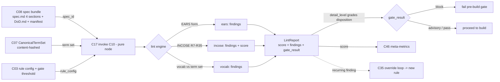

# C10 — Spec linter (EARS / INCOSE)  (`spec-linter-ears`)  (Spec, Track B)

> Source: README §"Principle 1 — Specs are the source of truth" (line 108 "Spec linter (optional) | EARS-style structural rules (INCOSE R7-R35) | Custom Go package (transfusion target: any EARS-rule implementation) | Gas City pack with deterministic tool node"; line 111 "Spec linter is a small custom add when you want EARS-style discipline"); maps A32 ("EARS/INCOSE structural rules over specs"), B69; F-MODE-COVERAGE F18 ("Prose specs lack rigor… EARS-style spec linter (P1 component) — Partial"), F38 ("Vocabulary lint debt… deterministically detectable — Addressed"); component-inventory C10 row (subsystem Spec Intake, kind component, depends C08, Key gaps "—", foundational: no); **C08 spec-optimized** (the spec bundle's 4-section schema `spec.md` {Goal/Constraints/DoD/Out-of-scope} + `DoD.md` enumerated criteria + `detail_level` — C10's lint surface, esp. C08 DELTA-05/03/06 and AC-5); **C07 spec-optimized** (`CanonicalTermSet` export the linter loads for vocabulary-lint, C07 DELTA-04); **C17 spec-optimized** (C10 is invoked as a `pure` deterministic tool node — C17 §2 names C10 a consumer; C17 DELTA-03 determinism class); _meta [review-log](../_meta/review-log.md) D-1.
> Inventory ID: C10   Kind: component   Status: sweep-1
> Deltas: DELTA-01 (C10 is a **`pure` C17 tool node** with a typed report contract + stable rule-id taxonomy + machine-readable findings, not a "small custom Go package" black box — makes it cacheable, composable in a formula, and a real CI gate); DELTA-02 (lint operates on **C08's structured 4-section bundle**, not free prose — three rule families {EARS-form, INCOSE-quality R7–R35, vocabulary} run over *labelled sections*, raising F18 from "form-only" to "form + vocabulary + completeness"); DELTA-03 (every finding has a **severity + advisory/blocking disposition graded by C08 `detail_level`** — a `vague` spec is *reported but not gated*, a `complete` spec is gated — so the linter never blocks deliberately-thin early specs, composing with C08 DELTA-06 against design-starvation F25/G15); DELTA-04 (**vocabulary-lint is wired to C07's `CanonicalTermSet`**, not a hand-rolled word list — this is what actually makes F38 "deterministically detectable" true, per C07 DELTA-04); DELTA-05 (**INCOSE rule set is an explicit, versioned, configurable rule registry** — R7–R35 enumerated as individual togglable rules with per-rule provenance, not an opaque "EARS-style" bundle — so the rule set is auditable, transfusion-traceable per C51, and extensible without a code fork); DELTA-06 (**`incose:quality` rules emit a structural score (0–1) + per-rule findings, not just pass/fail** — the spec's "rigor" becomes a measurable, trendable C46 meta-metric, and the gate is a threshold on the score, guarding against a single noisy rule blocking a good spec).

## 1. Purpose & responsibility

C10 is the **deterministic structural linter over a spec bundle**: it applies EARS sentence-form rules and a configurable subset of the INCOSE *Guide to Writing Requirements* quality rules (R7–R35) plus vocabulary-conformance rules to a C08 spec bundle, and emits a typed, machine-readable findings report. It is the *deterministic* arm of spec-quality assurance — the part of "is this spec good enough to drive a build?" that needs **no model**, complementing the probabilistic satisfaction/judge tier (C32/C33) that handles the irreducibly-prose part (README:108–111; F18). It exists to attack two named failure modes at the cheapest possible point in the pipeline (pre-build, deterministic): **F18** (prose specs lack rigor) and **F38** (vocabulary lint debt).

C10 owns:
- **The rule set**: an enumerated, versioned registry of EARS-form rules, INCOSE R7–R35 quality rules, and vocabulary rules — each a discrete, togglable, provenance-tagged rule (DELTA-05).
- **The lint engine**: a pure function `(spec bundle, CanonicalTermSet, rule config) → LintReport` (DELTA-01), packaged as a `pure` C17 tool node so it is cacheable, replayable, and callable from a formula or CI.
- **The findings contract**: a stable finding schema (`rule_id`, `severity`, location, message, suggestion) and a roll-up **structural score** (DELTA-06) downstream gates and metrics key on.
- **The gating disposition**: which findings *block* vs. *advise*, graded by C08 `detail_level` (DELTA-03), so the linter is a safe gate that never punishes a deliberately-thin early spec.

**What C10 is NOT:**
- **Not** the spec artifact or its format — that is **C08**. C10 *consumes* C08's 4-section schema + DoD; it does not define the bundle shape. (A change to the schema is a C08 decision; C10 lints whatever sections C08 declares.)
- **Not** the vocabulary authority — the canonical term list is **C07**. C10 *loads* `CanonicalTermSet` and flags off-canon usage; it neither defines terms nor pins canonical readings (C07 DELTA-02/04).
- **Not** a semantic/satisfaction judge — it makes **no** claim about whether the spec is *correct* or *achievable*, only whether it is *structurally well-formed and vocabulary-conformant*. "Does the built system satisfy the spec?" is C32/C33; C10 is upstream and deterministic (F51: deterministic boundary typing is the *primary* guard, the LLM judge is secondary).
- **Not** the workflow linter (**C15**, Mammoth 21-rule over the DAG) nor the discipline linter (**C16**, LLM-where-tool). C10 lints *specs*; C15/C16 lint *formulas*. They share the "deterministic tool-node linter" shape (and C07's term set) but have disjoint inputs.
- **Not** the prompt-template renderer (**C09**) — C10 does not evaluate the Go template; it lints the spec the template *references*.
- **Not** the wire ABI or invocation facade — it is *invoked through* **C17** over **C02**; it does not own the subprocess protocol.
- **Not mandatory** to the build path. README:108 explicitly marks the spec linter **"(optional)"** — it is a *discipline* gate the operator turns on (via C03 section-presence, the layered-config idiom). C10 must function as an opt-in pack, and its absence must not break specs-in→software-out.

## 2. Context & dependencies

| Direction | Component | Relationship |
|---|---|---|
| Upstream (lints) | **C08** spec artifact | C10's input. It reads the bundle's `spec.md` (4 required sections: Goal / Constraints / DoD / Out-of-scope), `DoD.md` (enumerated criteria), and `spec.toml` (`detail_level`, `spec_id`). The 4-section schema (C08 DELTA-05) is the structured surface that lets C10 lint *completeness + vocabulary*, not just sentence form (C08 AC-5: "C10 consumes the four sections and flags an undefined term + a missing constraint"). DELTA-02. |
| Upstream (term set) | **C07** vocabulary & glossary | C10 loads the pinned, content-hashed `CanonicalTermSet` (C07 DELTA-04) to drive vocabulary-lint. C07 §3 names C10 as a mechanical consumer. This is the input that makes F38 "deterministically detectable" real. DELTA-04. |
| Upstream (runtime) | **C17** tool-node abstraction | C10 is registered and invoked as a **`pure` tool node** (C17 DELTA-03): output is a function of (bundle bytes, `CanonicalTermSet` hash, rule-config hash) only — so C17 may cache/replay it (C17 DELTA-04). C17 §2 lists C10 among its consumers. DELTA-01. |
| Upstream (packaging) | **C02 / C01** pack & tool-node ABI | C10 ships as a Gas City pack (README:108 "Gas City pack with deterministic tool node"); its binary speaks C02's `ToolNodeRequest`/`ToolNodeResponse` wire ABI. |
| Upstream (gating config) | **C03** config / feature-flags | The linter is enabled by pack presence + a config section (the layered-TOML "section-presence enables a capability" idiom); rule on/off + gate-threshold live here. README:108 "(optional)". |
| Downstream (gate) | **C09** binding / build entry, **C18** reconciler, CI | A formula step or pre-build gate calls C10; a blocking finding (per DELTA-03 disposition) stops the build before tokens are spent. |
| Downstream (metric) | **C46** meta-metrics | The structural score (DELTA-06) is a trendable spec-rigor meta-metric. |
| Downstream (loop) | **C35** override loop, **C39** fix-task | A recurring lint finding can become a new validation rule (C35); a fix re-runs C10 on the revised bundle. |
| Sibling (shared shape) | **C15** workflow-linter, **C16** discipline-linter | Same deterministic-tool-node-linter pattern; both also consume C07's term set. Distinct inputs (formula vs. spec); C10 should share the finding schema + rule-registry shape so reports are uniform across linters (cross-ref OQ3). |
| Transfusion source | **C51** gene-transfusion | README:108 names the transfusion target: "any EARS-rule implementation." Per-rule provenance (DELTA-05) records `transfused_from`. |

C10 sits in **Spec Intake**, second batch (component-inventory Batch 2). It is *not* foundational and *not* on the critical path — but it is the cheapest F18/F38 guard and a clean parallel build (its only hard inputs are C08's section schema and C07's term-set export, both freezable as contracts early).

## 3. Interfaces / contracts

Named-and-described (sweep 1; concrete JSON schemas, the full R7–R35 rule table with per-rule predicates, exit-code mapping, and a Mermaid lint sequence land in sweep 2).

### 3.1 Inbound — the tool-node invocation (DELTA-01)
C10 is a `pure` C17 node. Its typed request (over the C02 wire ABI):
- **`LintRequest`** — `{ spec_bundle_ref (a C08 spec_id or a path to the bundle dir), canonical_term_set_ref (C07 content hash), rule_config_ref (which rules on/off + thresholds, from C03), detail_level_override? }`.
- **Preconditions:** the bundle is well-formed per C08 INV-2 (manifest resolves, sections exist per `detail_level`). C10 *assumes* C08's well-formed gate already ran; if it hasn't, C10 reports a `bundle:malformed` finding rather than crashing (degraded-but-honest). C10 does **not** re-implement C08's structural-existence gate beyond what it needs to locate sections.

### 3.2 Outbound — the findings report (DELTA-01/06)
- **`LintReport`** — `{ spec_id, rule_set_version, term_set_version, score (0–1, DELTA-06), gate_result (pass | advisory | block, per DELTA-03), findings: Finding[], summary: { by_severity, by_family } }`.
- **`Finding`** — `{ rule_id (e.g. `ears:form`, `incose:R12`, `vocab:undefined`), family (ears | incose | vocab | bundle), severity (error | warning | info), section (Goal | Constraints | DoD | Out-of-scope | DoD-criterion-<id> | manifest), location (line/criterion-id), message, suggestion?, falsifiable_basis (the specific text matched) }`.
- **Postconditions:** the report is a *pure deterministic function* of (bundle bytes, term-set hash, rule-config hash) — identical inputs ⇒ byte-identical report (the determinism invariant C17 caches on). The report is JSON; a human-readable render is derived, not authored.
- **Exit-code mapping (→ C02 §3b):** clean run with `gate_result != block` → `exit 0`; `gate_result == block` → a distinct non-zero exit C18/CI reads as "gate failed" (not a crash); engine error (unreadable bundle, missing term set) → an `abort`-class exit distinct from "lint found problems" (DELTA-01: a *failed lint* and a *broken linter* must be distinguishable — sweep-2 pins the codes against C02's taxonomy).

### 3.3 The rule registry (DELTA-05)
Three rule families, each rule a discrete entry `{ rule_id, family, predicate (sweep-2), default_severity, enabled_default, provenance (transfused_from / INCOSE-clause), rationale }`:
- **`ears:*` — EARS sentence form.** Each requirement-bearing sentence (in Constraints + each DoD criterion) must match one of the five EARS templates: *ubiquitous* ("The system shall…"), *event-driven* ("When <trigger>, the system shall…"), *state-driven* ("While <state>, …shall…"), *unwanted-behaviour* ("If <condition>, then …shall…"), *optional-feature* ("Where <feature>, …shall…"). Findings: non-conformant sentence, missing modal ("shall"), compound/ambiguous trigger.
- **`incose:R7..R35` — INCOSE quality rules.** The R7–R35 band of the INCOSE *Guide to Writing Requirements* — the deterministically-checkable rules of that range: e.g. avoid vague/ambiguous terms ("appropriate", "as required", "etc.", "and/or"), avoid superlatives, one requirement per statement (no "and"-conjunctions), use of definite articles, no escape clauses ("if possible"), no passive voice where it hides the actor, units present on quantities, no unverifiable adjectives. Each Rn is a separate registry entry with its INCOSE clause as provenance (DELTA-05); each emits findings *and* contributes to the structural score (DELTA-06). (The exact Rn→predicate table is enumerated in sweep 2; sweep 1 fixes that R7–R35 is the band and that the set is a configurable registry, not a monolith.)
- **`vocab:*` — vocabulary conformance (F38, DELTA-04).** Tokens are checked against C07's `CanonicalTermSet`: flag *undefined* load-bearing terms (a Gas-City/paradigm term used but absent from the registry), *off-canon* usage (a rejected sense of an overloaded term like "layer"/"phase" used bare — C07 DELTA-02), and *deprecated alias past removal version* (C07 DELTA-05).

### 3.4 Invariants
- **INV-1 (pure determinism).** Output is a function of (bundle bytes, term-set hash, rule-config hash) only — no clock, no network, no RNG. This is what licenses C17 caching/replay and what makes C10 a *deterministic boundary guard* (F51). A C10 that consulted a model would violate its own reason to exist.
- **INV-2 (advisory-by-default, gated-by-policy).** A finding never *mutates* a spec; C10 only reports. Whether a report *blocks* is a policy decision (gate-threshold in C03) graded by `detail_level` (DELTA-03), not a property of the finding itself.
- **INV-3 (optional, non-breaking).** With the pack absent or the config section off, the build proceeds unlinted (README:108 "optional"). C10's presence is additive discipline, never a hard dependency of specs-in→software-out.
- **INV-4 (rule-set + term-set versioned).** Every report pins `rule_set_version` + `term_set_version`; a score is only comparable across runs that share both (DELTA-05/06; matters for C46 trending).
- **INV-5 (no semantic claim).** C10 asserts *structural well-formedness + vocabulary conformance*, never correctness/achievability. A spec can pass C10 and still be wrong — that's C32/C33's job. (Guards against treating a green lint as "the spec is good," the F18 over-trust trap.)

## 4. Data model / state

C10 is **stateless** at runtime — a pure function packaged as a node. It owns no live store.

| Aspect | Optimized spec |
|---|---|
| Owned artifact | The **rule registry** (DELTA-05): a versioned, content-hashed data file (EARS templates + R7–R35 predicates + vocab rules), shipped in the pack, edited by maintainers / the override loop (C35). The *only* thing C10 "owns"; it is config-as-data, not code-as-rules. |
| Derived input (not owned) | `CanonicalTermSet` (from C07, by content hash) and the C08 bundle (by `spec_id`). Read-only. |
| Runtime state | None. Each `invoke` is independent; the result cache is C17's (keyed on the pure-node inputs), not C10's. |
| Output | `LintReport` (JSON) per invocation, returned to the caller; optionally attached to the spec's bead/CXDB record by the caller (C10 emits, does not persist). |
| Versioning | `rule_set_version` is the content hash of the rule registry; bumped on any rule add/edit. Provenance (`transfused_from`) per rule for C51 audit. |

## 5. Behavior

Key flows:
- **Pre-build lint gate.** Before C09 binds a spec to work (or in CI on spec commit), the formula calls `invoke(c10, {spec_id, term_set, rule_config})`. EARS + INCOSE + vocab rules run over the labelled sections; the report's `gate_result` (graded by `detail_level`, DELTA-03) decides pass/advisory/block. Catching a malformed requirement *here* is orders of magnitude cheaper than catching it via a failed satisfaction run downstream (the deterministic-first economics, README:154).
- **Graded gating (DELTA-03).** A `detail_level: vague` bundle (legitimate early state per C08 DELTA-06) lints to **advisory** — every finding reported, none blocking — so the operator sees the gaps without being stopped from committing a deliberately-thin spec. A `complete` bundle gates: findings at/above the configured severity block. This is C10's structural answer to design-starvation (F25/G15): discipline that scales *with* the spec's declared maturity rather than punishing immaturity.
- **Vocabulary drift detection (DELTA-04).** Each run pins the current `CanonicalTermSet` hash; a term that was canon yesterday and deprecated today surfaces as a `vocab:deprecated` finding without any code change — the term-set version, not C10, carries the drift.
- **Score-as-metric (DELTA-06).** The structural score over a spec's revisions (keyed by C08 `spec_lineage_id`) is a trend C46 can plot: is the operator's spec-writing getting more rigorous over time? Is a given component's spec structurally weaker than the corpus mean?

## 6. Failure modes & handling

| F-mode | Applies how | Optimized handling |
|---|---|---|
| **F18** Prose specs lack rigor (*primary*) | Free-form prose is ambiguous; v4 marks F18 only **"Partial"** because a form-only linter can't reach semantics. | C10 raises the floor on the *structural* fraction: EARS-form + INCOSE R7–R35 over C08's *labelled* sections (DELTA-02) catches vague terms, compound requirements, missing modals, unverifiable adjectives — deterministically. **Honest scope (preserves F18 "Partial"):** the *irreducible-prose* ambiguity remains C32/C33's job (INV-5); C10 makes the spec *structurally* rigorous, not *semantically* unambiguous. The score (DELTA-06) measures exactly the fraction C10 can reach. |
| **F38** Vocabulary lint debt (*primary*) | Specs use undefined / off-canon terms. v4 marks F38 **"Addressed… deterministically detectable"** — but that's only true *given a canonical term list*. | `vocab:*` rules check tokens against C07's `CanonicalTermSet` (DELTA-04). This is the input that makes "deterministically detectable" actually true (C07's own spec notes that without it F38's "Addressed" is hollow). Undefined, off-canon (rejected-sense), and deprecated-alias usages are all flagged. |
| **Linter false-positive blocks a good spec** | A noisy single rule (e.g. an over-eager "avoid 'appropriate'") could block a sound spec. | DELTA-06: the gate is a **threshold on the aggregate score**, not "any error blocks"; per-rule severity is configurable (C03); rules are individually togglable (DELTA-05). A single noisy rule degrades the score, it doesn't veto. INV-2: findings advise, policy gates. |
| **Linter mistaken for a correctness oracle** | A green lint is read as "the spec is good," suppressing C32/C33 scrutiny. | INV-5 + explicit non-goal (§1): C10 asserts *form*, never *correctness*. The report carries no "spec is good" claim; satisfaction (C32/C33) is the correctness authority. |
| **Stale term set / rule set drift** | C10 runs against an old `CanonicalTermSet` or rule registry, producing misleading findings. | INV-4: every report pins `term_set_version` + `rule_set_version`; scores are only compared across matching versions. C07's term set is content-hashed; a mismatch is visible, not silent. |
| **Optional linter becomes a hidden hard dependency** | A formula assumes C10 is present and breaks when the pack is absent. | INV-3 + README:108 "(optional)": the build path must not require C10. The pack's enablement is a C03 section-presence flag; absence ⇒ unlinted-but-functional. |
| **Determinism violation** | A rule that consulted time/network/model would break C17 caching and replay (C49). | INV-1: C10 is `pure` by construction (C17 DELTA-03). Any non-pure rule is rejected at rule-registry review; C49 replay-divergence would surface a violation as an anomaly (C36). |

(No Gxx gaps are assigned to C10 in the component inventory — Key gaps "—". The two F-modes above are its raison d'être. C10 *materially helps* G06/G01/G02 indirectly by being the enforcement teeth for C07's term set, but those gaps are owned by C07; C10 does not resolve them, it operationalizes the term-set they produce.)

## 7. Cross-cutting

- **Security.** Read-only, deterministic, no capabilities beyond reading the bundle + term set — a `pure` node touches no network/secret/clock (INV-1), so it carries near-zero lethal-trifecta surface (F44). A `vocab`/`incose` rule may also flag secret-shaped tokens in a spec as a hygiene finding (cross-ref C08 §7, sweep-2).
- **Cost / scale.** Deterministic and cacheable (C17 DELTA-04): re-linting an unchanged bundle is a cache hit, zero subprocess spawns; this is the P4 cost lever (README:154). Lint cost is negligible vs. a satisfaction run, which is the whole point of catching defects here.
- **Observability.** Findings + score are structured and join on `spec_id` / `spec_lineage_id` (C08 DELTA-04) — so spec rigor is queryable alongside satisfaction (C33) and meta-metrics (C46). A recurring finding class is a candidate new rule via the override loop (C35).
- **Ops / governance.** The rule registry is config-as-data, versioned and provenance-tagged (DELTA-05) — auditable for C51 transfusion ("which EARS implementation did each rule come from?") and editable without a code fork (extends C02's no-Go-fork stance to the rule set). License of any transfused EARS-rule implementation is recorded per rule (C51 / G30-style license hygiene).

## 8. Acceptance criteria & test strategy

1. **AC-1 (pure deterministic node, DELTA-01/INV-1).** C10 runs as a C17 `pure` node; identical (bundle, term-set hash, rule-config hash) ⇒ byte-identical `LintReport`. *Golden + repeat-run test; verify C17 cache-hit on second invoke.*
2. **AC-2 (EARS-form rules).** A Constraints sentence lacking a modal ("shall") or matching no EARS template produces an `ears:*` finding at the right location; a well-formed EARS sentence produces none. *Positive + negative fixtures across all five templates.*
3. **AC-3 (INCOSE R7–R35, DELTA-05).** A spec with a vague term ("appropriate"), a compound requirement ("X and Y"), and an escape clause ("if possible") produces the corresponding `incose:Rn` findings; each Rn is individually togglable and tagged with its INCOSE clause. *Per-rule fixture; rule-on/off test.*
4. **AC-4 (vocabulary-lint vs C07, DELTA-04/F38).** Given a `CanonicalTermSet`, an undefined load-bearing term, an off-canon bare use of "layer", and a deprecated alias each produce a `vocab:*` finding; an on-canon term produces none. *Term-set fixture (matches C08 AC-5 "flags an undefined term").*
5. **AC-5 (completeness over C08 sections, DELTA-02).** Given a `complete` bundle missing a Constraints entry the DoD references, C10 emits a completeness finding against the labelled section (C08 AC-5 "flags a missing constraint"). *Cross-fixture with a C08 bundle.*
6. **AC-6 (graded gating, DELTA-03).** A `detail_level: vague` bundle yields `gate_result: advisory` (findings present, none blocking); the same bundle at `complete` yields `gate_result: block` when a finding is at/above the configured severity. *Behavioral fixture varying `detail_level`.*
7. **AC-7 (structural score, DELTA-06).** Two bundles, one cleaner, score monotonically (cleaner ⇒ higher); the gate is a threshold on the score, and a single noisy rule lowers but does not veto a high score. *Score-ordering + threshold test.*
8. **AC-8 (optional / non-breaking, INV-3).** With the pack absent (or C03 section off), a build of a valid spec proceeds; C10's absence emits no error on the build path. *Pack-absent integration check.*
9. **AC-9 (lint-failure vs linter-failure distinguishable, §3.2).** A spec with blocking findings exits with the "gate failed" code; an unreadable bundle / missing term set exits with a distinct "engine error" code. *Exit-code fixture against C02 taxonomy.*

Sweep-1 strategy: positive/negative fixtures for each of the three rule families, a determinism golden+repeat test, a `detail_level`-graded gating fixture, a score-ordering test, and a pack-absent non-breaking check. The full R7–R35 predicate table, JSON schemas for `LintRequest`/`LintReport`/`Finding`, and concrete C02 exit codes land in sweep 2.

## 9. Open questions

- **OQ1 (→ [review-log](../_meta/review-log.md), top open question).** *Which INCOSE rules in the R7–R35 band are deterministically checkable vs. require NLP/judgement?* README pins the band "R7–R35," but some INCOSE quality rules (e.g. "use a single verb," "avoid ambiguity") are crisply regex/parse-checkable while others ("requirement is necessary," "is feasible") are *semantic* and belong to C32/C33, not a deterministic linter. Sweep 2 must split R7–R35 into {deterministic ⇒ C10 rule} vs {semantic ⇒ note as out-of-scope, route to judge} so C10 doesn't over-claim. Recommend: include only the deterministically-checkable subset as `incose:*` rules; record the deferred semantic rules explicitly so F18's residual is honest.
- **OQ2 (→ review-log).** *Sentence segmentation over Markdown prose.* EARS/INCOSE rules operate per *requirement sentence*, but C08's sections are Markdown prose + an enumerated DoD list. Reliable sentence/requirement extraction from prose is itself error-prone (a determinism-and-accuracy tension). Should C10 lint only the *enumerated DoD criteria + bullet-form Constraints* (clean, list-structured, reliably segmentable) and treat free-prose paragraphs as advisory-only? Recommend leaning on C08's structure (lint the lists hard, the prose softly) — cross-reference the C08 author on whether Constraints should be required-enumerated.
- **OQ3 (→ review-log).** *Shared finding schema + rule-registry shape across C10/C15/C16.* All three are deterministic tool-node linters consuming C07's term set. A common `Finding`/`LintReport` schema + rule-registry pattern would make reports uniform and tooling reusable, but couples three components' contracts. Recommend a shared `linter-core` convention (schema + registry shape) C10/C15/C16 each instantiate — flag for cross-component reconciliation with the C15/C16 authors.
