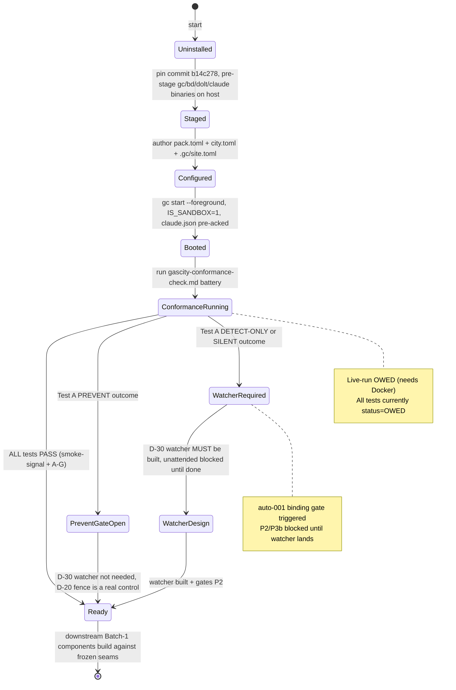

# C01 — Gas City Runtime Substrate  (Spec, canonical track)

> Source: README §Part 4 (Layer/principle placement tables — Pipeline engine line 121, Tool node / reconciler lines 158–160, attribution lines 226–228, memory lines 239–242, event substrate line 252), §Part 6 Phase 0 (lines 353–374) and Phase 1 (lines 376–399); AI-CONTEXT §2 (three-layer + persistence shape, lines 46–54), §3 (Gas City as load-bearing dependency: §3.1 coverage map lines 62–77, §3.2 "nine concepts" lines 79–93, §3.3 vocabulary lines 95–112, §3.4 smallest viable install lines 114–122, §3.5 migration tail lines 124–129, §3.6 extractability lines 131–135), §11 decisions (lines 463–476, 494–502), §13.1 Phase 0 skeleton (lines 522–544), §13.2 Phase 1 additions (lines 546–580), §14 risk register (line 616); component-inventory C01 row (line 13) + critical-path notes; ambiguities-and-gaps G11, G03.
> Inventory ID: C01   Kind: subsystem   Status: sweep-2
> Track: canonical (faithful)
> Binding decisions obeyed: **D-23** (substrate harvest / conformance check as the gate that turns native claims into facts), **D-30** (prevent-gate: unattended/self-modification require the substrate to BLOCK, not merely detect), **D-6** (single canonical track).

> **[D-23 substrate-verified — gascity-prototype@b14c278, 2026-05-25]** Twelve substrate facts (F1–F12) from the Gas City prototype harvest underwrite this spec. The install/pin contract (§3.1) is grounded in PLAN.md primary-source evidence (F-context, PLAN items 1–2, 6–8). The Phase-0 Provider-kind = tmux is F7-verified; the bead-prefix scoping mechanism is F10-verified. **Every native claim in §6 that is not individually marked `harvest-verified` carries `needs-pinned-gc-run (G11)` status per the anchor §4 table** — the D-23 spike resolved some questions and left others explicitly open.

## 1. Purpose & responsibility

C01 is the **load-bearing third-party runtime substrate** of Software Factory v4: an *adopted* (not
authored) install of **Gas City** — a single Go binary `gc` — configured as the factory's foundation.
It is the engine on which everything else runs. Per AI-CONTEXT §2 it occupies the **pipeline-engine tier**
of the convergent "three-layer + persistence" shape (the DOT-graph workflow runner) — the
*three-layer-architecture* sense of "layer" (C07 canonical sense 1, G01), **not** the numbered
"Layer 0–6" principle-tier sense — and it natively *supplies* the persistence + dispatch tiers. The component's job is to provide, from a *minimum
install*, a principled runtime that already satisfies ~5–6 of the 12 principles before any custom code
is written (AI-CONTEXT §3.6: "Gas City provides P1, P2, P3, P4, P9, P10 native").

**Responsibilities (what Gas City natively owns and C01 is the spec-of-record for):**
- **DOT-shaped TOML workflow running** — execute formulas (TOML DAG templates) by instantiating them
  into molecules (live bead-trees) and driving them to completion (AI-CONTEXT §3.2 concept 7; README
  line 121 "DOT-shaped workflow runner … The baseline").
- **Agent dispatch** — the `sling` mechanism routes a bead/wisp to an agent or pool (AI-CONTEXT §3.2
  concept 8). C01 owns the substrate; the dispatch *policy* component is C05.
- **Persistence** — the bead store (durable typed work-graph, file or Dolt) and the event bus
  (append-only JSONL with monotonic seq) (AI-CONTEXT §3.2 concepts 2–3; README lines 239, 252).
- **Reconciler / Health Patrol** — the per-tick desired-state convergence loop with bounded gates
  (AI-CONTEXT §3.2 concept 9; README line 159 "native").
- **Config / feature-flag model** — layered TOML where section presence enables a capability
  (AI-CONTEXT §3.2 concept 4). C01 hosts it; the model itself is specced by C03.
- **Universal attribution** — `created_by` flows automatically through every bead and event with no
  configuration (README lines 227, 231 "Gas City's strongest native match").
- **Pack-based extension surface** — load distributable bundles (TOML + tool-node binaries + prompt
  templates) as the *only* sanctioned extension mechanism (no Go fork). C01 hosts; C02 specs the ABI.
- **Provider-backed sessions** — a stable runtime backed by a Provider (tmux/k8s/subprocess/exec),
  hosting the `claude` agent preset (AI-CONTEXT §3.2 concept 1). C01 hosts; C04 specs the session model.

**Explicitly NOT (boundaries):**
- **NOT authored by the factory.** C01 is *adopted verbatim* from upstream (`github.com/gastownhall/gascity`,
  AI-CONTEXT §15.1, MIT). v4 does **not** fork it and does **not** import it as a Go library
  (AI-CONTEXT §3.5, §11 lines 476/502; README line 334). Our deliverable is the **install + config +
  version-pin + pack-loading contract**, not Gas City's source.
- **NOT the things that merely *sit on* Gas City.** The config model (C03), session/provider model (C04),
  sling policy (C05), messaging (C06), vocabulary (C07), formula format (C12), molecule runtime (C13),
  tool-node abstraction (C17), reconciler-loop *behaviour* (C18), bead store schema (C19/C20), event
  bus seam (C23), identity model (C41), and Orders (C40) each have their own spec. C01 is the **host
  and the boundary** — it states *that* Gas City provides these and *how the substrate is installed and
  pinned*, deferring each concept's detailed contract to its owning component.
- **NOT CXDB.** CXDB (C21) is a *separate* Apache-2.0 store added in Phase 1 via a bridge (README line 122
  "CXDB via bridge"); it is not part of the Gas City substrate.
- **NOT the agent loop.** Claude Code (C28) is the agent/LLM-client layer that Gas City *drives* via the
  `claude` provider preset; it is a distinct dependency, not part of C01.

> [FAITHFUL-FILL] The inventory one-liner says "covers ~5–6 principles natively." v4 names the native set
> precisely as **{P1, P2, P3, P4, P9, P10}** (AI-CONTEXT §3.6, line 135; README Phase 0 "What's delivered",
> lines 367–372). The ~5–6 range is the same ambiguity as G03 (see §6); the minimal faithful reading is
> "6 sections claim native, but at the *smallest* (Phase 0) install one of them (P3) is only latent." This
> is the smallest consistent choice because it reproduces both the headline count and the Phase-0 caveat
> verbatim rather than asserting a single number v4 never commits to.

## 2. Context & dependencies

| Direction | Component | Relationship |
|---|---|---|
| Upstream (depends on) | **C03** Config / feature-flag model | C01 *hosts* the layered-TOML config; C03 defines its semantics (section-presence = flag). C01 cannot be configured without C03's model. (inventory C01 "Depends on: C03, C04") |
| Upstream (depends on) | **C04** Session & provider runtime | C01 *hosts* sessions; C04 defines the provider abstraction (tmux/k8s/subprocess) + cross-session resume that C01's `[[agent]]` preset relies on. |
| External dependency | **Gas City** (`gc` binary, MIT) | The adopted third-party runtime itself. **G11 blocker** lives here (§6). |
| External dependency | **Claude Code CLI** (C28, under Max) | Driven by the `claude` provider preset; the agent/LLM layer C01 dispatches to. |
| Downstream (consumers) | **C02** Pack ABI; **C05** Sling; **C06** Messaging; **C07** Vocabulary; **C08** Spec artifact; **C12** Formula format; **C13** Molecule; **C17** Tool-node; **C18** Reconciler loop; **C19/C20** Bead store/schema; **C21/C23** CXDB bridge / Event bus; **C40** Orders; **C41** Identity; **C42** Rig partitioning | Per inventory, these list C01 (directly or transitively) as a dependency. They consume C01's runtime, persistence, dispatch, and extension surfaces. |

> [AMBIGUITY: C01↔C03 dependency direction] The inventory lists C01 `Depends on: C03, C04`, but the C03,
> C04, C07, C02 rows each list `Depends on: C01`. C01↔C03 is therefore a **cycle** in the canonical
> inventory (the same XC-1 class flagged for C19↔C20). Both rows are cited here verbatim. The faithful
> reading that resolves the cycle is C01-B's: C01 depends on C03's *contract* at **load time** (it calls
> C03's loader), while C03 depends on C01 as the **host** that parses the TOML — a contract dependency, not
> a build-order cycle. C01 records both and **defers** the canonical ruling to the integrator pass.

**Position in the system.** C01 is **Batch-1 foundational** (inventory line 107) and sits at the root of
the dependency forest: it is the "load-bearing third-party dependency. If Gas City fails, the whole plan
reorganizes" (README §11 / AI-CONTEXT, the G11 admission). It is Phase 0 in the delivery plan (C54) and
is the only component that ships with "no custom code" (README line 355).

**[D-31 — A city hosts multiple rigs.]** One `gc` install (one city) hosts **multiple rigs** simultaneously — not one. Per review-log D-31 (Sweep-2, 2026-06-01): "A *city* (one Gas City install / the `gc` substrate, C01) hosts **multiple rigs** (C42) — not one. The `[[rig]]`/`[[rigs]]` array-of-tables declares N rig partitions inside a single city." C01 is the single substrate on which all N co-resident rigs operate; rig partitioning (C42) provides the isolation between them. The Phase-2 config (AI-CONTEXT §13.3) illustrates this: a `scenario_authoring` rig and an `implementer` rig both live in the same city. Do NOT assume one-rig-per-city when reading this spec.

**Cycle resolution note.** Two dependency cycles exist in the inventory: C01↔C03 and C01↔C04. Both are
broken by treating **C01 as the dependency root** and freezing an interface contract at the C01 boundary
that C03/C04 build against — exactly the M1 interface-freeze pattern used for C19↔C20. C01 is adopted
first (T1/T2 below); C03 and C04 elaborate semantics that C01 *hosts*, not the reverse.

## 3. Interfaces / contracts

### 3.0 Interface table (sweep-1, preserved)

| # | Interface | Direction | Description | Owning/detailing component |
|---|---|---|---|---|
| I1 | **`gc` CLI** | inbound (operator/automation) | The single Go binary's command surface — e.g. `gc bd find --type …`, `gc formula export <name> --format dot`, `gc converge resume <bead_id>` (AI-CONTEXT §16 lines 695–699; README line 384). The control plane for the substrate. | C01 (this) |
| I2 | **`city.toml` / `pack.toml` config load** | inbound (config) | Layered TOML the runtime parses at boot; section presence toggles capabilities (`[formulas]`, `[mail]`, `[daemon]`, `[[rig]]/[[rigs]]`, `[[service]]`, `[beads]`). | C03 (semantics), C01 (hosting) |
| I3 | **Pack-load + tool-node ABI** | inbound (extension) | Load a pack (TOML + tool-node binaries + prompt templates); invoke a tool node as a subprocess with a defined input/output protocol. The *sole* extension surface (no Go fork). | **C02** (the ABI itself) |
| I4 | **Provider / session interface** | outbound (to agent) | The `runtime.Provider` interface (~18 methods, AI-CONTEXT §3.6) backing a Session; hosts the `claude` preset to drive Claude Code. | **C04** (session model), C28 (agent) |
| I5 | **Workflow-run interface (formula → molecule)** | internal/inbound | Instantiate a formula (TOML DAG) into a molecule (bead-tree) and run it; sling routes resulting wisps/beads. | C12/C13 (formats), C05 (sling), C01 (execution host) |
| I6 | **Bead store API** (`gc bd …`) | outbound (persistence) | CRUD + query over the durable typed work-graph (file or Dolt), with `created_by` attribution. | **C19/C20** (store/schema) |
| I7 | **Event bus** (append-only JSONL) | outbound (persistence/telemetry) | Monotonic-seq append log recording every action; lowest-impedance CXDB source. | **C23** (event bus), C24 (bridge) |
| I8 | **Reconciler / Health Patrol tick** | internal control loop | Per-tick desired-state convergence with bounded convergence gates. | **C18** (loop behaviour) |

**Invariants C01 must uphold (substrate-level):**
- **INV-1 (pinned version):** the running `gc` is at a single pinned version; the install is reproducible
  from the pin (mitigates AI-CONTEXT §3.5 migration tail).
- **INV-2 (no fork / no Go import):** v4 never imports Gas City `internal/` or `pkg/` paths; all extension
  is via packs (AI-CONTEXT §11 lines 476/502).
- **INV-3 (universal attribution):** every bead written and every event emitted carries `created_by`
  with no per-call configuration (README line 231).
- **INV-4 (feature-gating by section presence):** a capability is OFF iff its config section is absent;
  the Phase-0 install has `[daemon]`, `[mail]`, `[formulas]`, `[rigs]`, Dolt, `[[service]]`, orders all
  absent ⇒ off (AI-CONTEXT §3.4 line 122).

### 3.1 Install / pin contract (sweep-2)

**The pinned identity.** All v4 work targets exactly:

| Artifact | Value | Source |
|---|---|---|
| Prototype repo | `lago-morph/gascity-prototype` | harvest provenance |
| Prototype branch + commit | `claude/great-pascal-RUfkN` @ `b14c278` (PLAN dated 2026-05-25) | PLAN.md §status; config anchor §1 |
| Upstream `gc` SDK commit | `gastownhall/gascity@183897e` (post-v1.0.0, PackV2) | deep-dive §provenance |
| Go toolchain | **Go 1.26.3** — `go.mod` is authoritative (`head -5 go.mod` to confirm; PLAN §build facts; config anchor §1) | config anchor §1; spike protocol §1 |
| Primary `gc` binary | **`gc`** → built via `make install` → `/usr/local/bin/gc` | PLAN.md §file-by-file |
| Companion binary | **`bd`** (beads CLI) — the bead store is driven through it | `pack/pack.toml` header; PLAN item 1 |
| Controller invocation | **`gc start --foreground`** — supervisor (PID 7 in-container; tini as PID 1) | F6; PLAN item 6 |

**What "install" means (harvest-grounded — F4, PLAN items 1–2).** The factory does **NOT** run `gc init`
(it is interactive — F4; zero references to it in any v4 spec). Instead:
1. Author `pack.toml` and `city.toml` **directly** from templates.
2. Pre-stage binaries (`gc`, `bd`, `dolt`, `node`, `claude`) on the host and `COPY` them into the image.
   (The sandbox TLS-inspection proxy blocks in-container downloads — F12 context, PLAN item 1.)
3. Run `gc start --foreground` (or under Docker Compose with `tini`).

**What "install" produces.** A container/process in which:
- `gc` is running as the controller/supervisor.
- The bead store (Dolt SQL server in-container or file-backed) is accessible via `bd` CLI.
- All agents declared in `city.toml` are scheduled; the Phase-0 set is one `[[agent]] provider="claude"` worker.
- `.gc/site.toml` (machine-local, entrypoint-written) binds rig names to filesystem paths (F1).
- Events are streaming to `.gc/events.jsonl`.

**Sandbox-root requirement (F12 / PLAN items 7–8):**
- `claude --dangerously-skip-permissions` refuses root unless `IS_SANDBOX=1` is set in the environment.
- Three onboarding dialogs must be pre-acknowledged in `~/.claude.json` (NOT `~/.claude/settings.json`).

**Reproducibility invariant (INV-1).** A re-install from the pinned commit + Go version + pre-staged
binary checksums is byte-reproducible. A version bump that breaks any conformance AC is detected by
the conformance check (§8).

### 3.2 Concrete `gc` CLI surface relied on by v4 (sweep-2, freeze)

These are the subcommands/flags v4 builds against. Downstream components (C05, C12, C18, C19, C23)
build stubs against this surface (milestone M2).

| Subcommand / invocation | Used by | Source |
|---|---|---|
| `gc start --foreground` | C01 (boot) | F6; PLAN item 6 |
| `gc status` | C01, C18 (health probe) | harvest; conformance check preconditions |
| `gc session list` | C04, C01 (session inspect) | harvest; conformance check Test D |
| `gc events [--follow] [--since=…]` | C23, C01 (audit) | harvest; conformance check Tests A/D/G |
| `gc sling <bead>` | C05 (dispatch) | F5, F8; conformance check smoke-signal |
| `gc bd find --type <T>` | C19/C20 (query) | AI-CONTEXT §16 line 695 |
| `gc bd create / get / ls` (via `bd` CLI) | C19/C20 | F8; conformance check Tests A/C/E/F |
| `gc converge resume <bead_id>` | C52 (self-bootstrap) | AI-CONTEXT §16 line 699 |
| `gc formula export <name> --format dot` | C14 (DOT translator) | README line 384 |

> [FAITHFUL-FILL] Exact flag syntax (e.g., `--since` duration format, `--json` flag on `gc session list`,
> `gc service list` existence) is confirmed by the conformance check live run (§8). Until the live run
> completes, flag spellings carry `[needs-pinned-gc-run (G11)]` status. The subcommand list above is
> grounded in harvest evidence and primary prototype sources.

### 3.3 Config-file layout (sweep-2)

Per the config anchor §2 — three files participate. Getting the right key into the right file is the
#1 drift hazard (PackV2 refuses startup on misplaced keys — F1, F3).

| File | Role | Must NOT contain |
|---|---|---|
| **`pack.toml`** | Root pack manifest: `[pack] name`, `[pack] schema = 2`; `[imports.<name>]` with `source`; pack-shipped `[[tool]]`, prompt templates, formulas | `[defaults.rig.imports.*]` (→ `city.toml` per F3); a direct `[imports.maintenance]` when `gastown` already imports it transitively (duplicate `gastown.dog` agent → startup refusal — F3) |
| **`city.toml`** | Workspace install config: `[workspace]`, `[defaults.rig.imports.<name>]`, capability sections `[daemon]`, `[beads]`, `[orders]`, `[mail]`, `[formulas]`, `[[service]]`; `[[agent]]` worker decls; **`[[rig]]`/`[[rigs]]` partition/role blocks (an ARRAY of N rig entries; spelling needs-pinned-gc-run G11 per D-32)** with `name` + `prefix` (NO `path`) — D-31: one city hosts N rigs declared as this array | A rig `path` field (machine-local, belongs in `.gc/site.toml` — F1); `convergence.max_iterations` (not a real field — F2) |
| **`.gc/site.toml`** | Machine-local, entrypoint-written at container-start: `workspace_name`; `[[rig]]` (singular) blocks with `name` + `path` | Partition/role semantics, prefixes (those are `city.toml`'s job). This file is `.gitignore`d. |

> **city.toml rig-block spelling: `[[rig]]` vs `[[rigs]]` — `needs-pinned-gc-run (G11)`.**
> F1 names `[[rig]]` (singular) as canonical; the prototype `city.toml.example` uses `[[rigs]]` (plural).
> The **invariant that holds in both** is: rig `path` belongs ONLY in `.gc/site.toml`; `city.toml` rig
> blocks carry `prefix`/partition/role and never `path`. Whether `city.toml` uses `[[rig]]` or `[[rigs]]`
> is unresolved — do NOT silently pick one. See config anchor §3 spelling note.

**Phase-0 canonical install (~30 lines TOML + one template, AI-CONTEXT §13.1):**

```toml
# pack.toml
[pack]
name   = "v4-factory"
schema = 2

[imports.core]
source = "github.com/gastownhall/gascity//gastown"
```

```toml
# city.toml
[workspace]
name     = "v4-bootstrap"
provider = "claude"

[[agent]]
name     = "worker"
provider = "claude"

[beads]
provider = "bd"            # Dolt-backed via bd binary (harvest-verified — F9, city.toml.example:32-36)
```

```toml
# .gc/site.toml  (written by entrypoint — F1)
workspace_name = "v4-bootstrap"

[[rig]]
name = "rig1"
path = "/workspace/rigs/rig1"
```

Plus `agents/worker/prompt.template.md`. **Explicitly off at Phase 0:** `[daemon]`, `[mail]`,
`[formulas]`, `[rigs]`, `[[service]]`, orders (AI-CONTEXT §3.4 line 122; README line 364).

**Environment variables (harvest-verified):**

| Variable | Value | Source |
|---|---|---|
| `IS_SANDBOX=1` | Required for `claude --dangerously-skip-permissions` as root | F12; config anchor §3 |
| `DOLT_REF=refs/heads/dolt-data` | Dolt push/clone ref; default `refs/dolt/data` rejected by proxies | F9; config anchor §3 |

## 4. Data model / state

C01 *owns the install and config*; the **schemas** of the stores it hosts are owned downstream (deferred,
faithful to inventory). State C01 is the spec-of-record for:

### 4.1 State table (sweep-2 — with R/W-by column)

| State | Type | Req? | Description | Persistence | R/W-by |
|---|---|---|---|---|---|
| **Install + version pin** | filesystem artifact | R | The `gc` binary at pinned commit, pre-staged companion binaries (`bd`, `dolt`, `node`/`claude`), workspace layout (`packs/*`, `agents/<name>/prompt.template.md`) | Filesystem + version control | C01 writes (bootstrap); all read |
| **`pack.toml`** | TOML file | R | Root pack manifest: `[pack] name`, `schema = 2`, `[imports.*]` | Version-controlled file | C01/C02/C03 write; `gc` reads at boot |
| **`city.toml`** | TOML file | R | Workspace install config: agents, beads provider, optional sections | Version-controlled file | C01/C03 write; `gc` reads at boot |
| **`.gc/site.toml`** | TOML file | R | Machine-local rig path bindings; entrypoint-written at container-start | Container-local (`.gitignore`d) | Entrypoint writes; `gc` reads at boot |
| **Bead store** | Dolt SQL (F9) or file | R | Durable typed work-graph; `provider = "bd"` (Dolt) at Phase 0 | In-container Dolt SQL server; `dolt push` cadence for durability | C19/C20 schema; all agents R/W via `bd` CLI |
| **Event bus log** | Append-only JSONL | R | `.gc/events.jsonl` — monotonic-seq append log recording every action | Filesystem within container | `gc` writes; C23 consumes |
| **Molecule (in-flight)** | bead-tree in bead store | O | A formula instantiated into a live bead-tree; the runtime state of a running workflow | In bead store (molecule = bead-tree) | C13 writes; `gc` drives |
| **`~/.claude.json`** | JSON file | R | Pre-acknowledged onboarding dialogs for `claude --dangerously-skip-permissions` (F12 / PLAN items 7–8) | Filesystem (container home) | Entrypoint/bootstrap writes; `claude` CLI reads |

### 4.2 Native-claim → verification-status (sweep-2, from config anchor §4)

C01's job is to STATE that Gas City provides these capabilities and DEFER their contracts to owning
components. The table below marks each claim's verification status so downstream builders know which
are grounded facts vs unverified.

| Native claim | Owner component | Status | Conformance test |
|---|---|---|---|
| **Beads store** (durable typed work-graph) | C19, C20 | **harvest-verified** (F8, F9): Dolt SQL in-container, `bd` CLI, agents R/W through it | AC-C01-2 (smoke-signal round-trip) |
| **Event bus / stream** | C23 | **needs-pinned-gc-run (G11)**: deep-dive shows `[events] provider` → `.gc/events.jsonl`; prototype README cites "logs lifecycle into the event stream" but the stream was not exercised end-to-end | `gc events --follow` shows agent-lifecycle + bead events (conformance check, Test G) |
| **Attribution (`created_by`)** | C41 | **needs-pinned-gc-run (G11)**: deep-dive shows `gc config explain --provenance` and bead fields `From`/`Assignee`; a literal `created_by` field is `[inferred — needs G11]` | conformance check Test E; inspect bead fields against pinned `gc` |
| **Rig partitioning** | C42 | **harvest-verified** (F10, F11): prefix is the scoping mechanism; `read_partition`/`write_partition` TOML grammar is needs-pinned-gc-run (G11) | conformance check Tests D, F |
| **Durable Orders** | C40 | **needs-pinned-gc-run (G11)**: controller "fires due orders" verified (F6); crash-resume granularity NOT verified | conformance check Tests C1/C2/C3 |
| **Reconciler / health-patrol** | C18, C56 | **harvest-verified** (F6, F11): `gc start` reconciles desired-vs-running, reaps dead sessions; `[daemon]` patrol cadence present | conformance check Test G |
| **Sling / dispatch** | C05 | **harvest-verified** (F5, F8): `gc sling` dispatches a bead; worker pool `min=0` scales 0→1 on dispatch | AC-C01-1 (smoke-signal); conformance check smoke-signal |
| **Sessions / provider runtime** | C04 | **harvest-verified** (F7): Phase-0 Provider-kind = tmux; each agent = one interactive `claude` pane | conformance check Test G; `gc session list` |
| **Formula + molecule** | C12, C13 | **harvest-verified** definitionally (deep-dive: molecule = formula-as-beads, wisp = TTL molecule); `[formulas]` execution NOT enabled in prototype | Phase-1 conformance: enable `[formulas]`; `gc sling --formula <name>` cooks a molecule |
| **Partition ENFORCEMENT (prevent vs detect)** | C34, C43 | **prevent-vs-detect-OPEN** (F10): prefix is the mechanism; enforcement strength UNVERIFIED | conformance check Test A (KEYSTONE — see §8.1) |

## 5. Behavior

**Boot & configure (Phase 0).** Operator installs the pinned `gc`, writes `pack.toml` (`[imports.core]`)
and `city.toml`, and one prompt template. `gc` parses the layered TOML; absent sections ⇒ capabilities
off (INV-4). One `[[agent]]` with `provider = "claude"` makes Claude Code (C28) the worker via the
session Provider (C04). `[beads] provider = "bd"` stands up the Dolt-backed work-graph. Result:
a runnable single-agent factory with attribution + memory, no custom code (README line 355).

**Run a unit of work (single-step at Phase 0; formula-driven from Phase 1).**
1. Work is represented as a bead/wisp in the store.
2. **Sling** (C05) routes it to the `worker` agent/pool by template/role.
3. The agent runs inside a provider-backed **session** (C04, Phase-0 provider-kind = tmux — F7) driving Claude Code.
4. Every action emits an **event** (append-only JSONL) and updates **beads**, all carrying `created_by`.
5. The **Health Patrol** reconciler (C18) ticks toward desired state, applying bounded convergence gates.
6. At Phase 1, multi-step work is a **formula** (TOML DAG, C12) instantiated into a **molecule**
   (bead-tree, C13); the same dispatch/persist/reconcile loop drives each node.

**Phase-1 capability turn-on.** Adding `[formulas]` enables DAG composition; adding `[[service]]` blocks
registers external services (LangFuse, CXDB, OTel collector) and agent `env` wires Claude Code telemetry
(AI-CONTEXT §13.2). The substrate's behaviour is unchanged; latent sections light up (INV-4).

### 5.1 Install → conformance → ready lifecycle (sweep-2 — Mermaid stateDiagram-v2)

The diagram below captures the C01-owned lifecycle: from raw binary obtain, through install and
conformance check, to a substrate declared READY for downstream components to build against. The
conformance check (AC-C01-2, §8) is the gate; the prevent-vs-detect outcome routes to D-30 (see §8.1).



## 6. Failure modes & handling

C01 is where the two foundation-level gaps assigned to it live.

**G11 (blocker) — "Gas City exists, is obtainable, and works as described" is an unverified assumption.**
v4 itself admits "Gas City is the load-bearing third-party dependency. If Gas City fails, the whole plan
reorganizes" (README §11). There is no evidence any author has run `gc`, no version pin, and the repo
URL is asserted not verified. Every "Native" cell in README Part 4 is an unverified claim about a
third-party tool.
> [AMBIGUITY: G11] Two readings. **(a)** *Treat Gas City as proven* — spec the substrate as if all Native
> cells hold (the docs' surface stance). **(b)** *Treat adoption as a risk to retire first* — the install
> + every Native claim is a hypothesis requiring a verification gate before downstream specs rely on it.
> **Chosen: (b)**, as most consistent with the rest of v4: README §552 and AI-CONTEXT §14 *both* name
> this as the single highest structural risk and Phase 0's explicit goal is "validate baseline before
> adding complexity" (AI-CONTEXT §11 line 473). Faithful handling ⇒ C01's acceptance criteria (§8)
> include a **Gas City conformance check** that exercises each claimed-native capability against a *pinned*
> `gc`, and a recorded version pin (INV-1). v4 prescribes no fallback design if the bet fails
> (the API-key/Temporal fallbacks are for other risks), so C01 **defers** "what replaces Gas City" to the
> phase-plan/residual-risk register (C54/C57) — it is out of C01's faithful scope to invent a replacement.

**G03 (major) — the "6 of 12 native" count is internally unsupported.** AI-CONTEXT §11.1 and §3.6 say
"6 of 12 native" listing {P1,P2,P3,P4,P9,P10}; but §3.1 rates P3 only "**Strong when `[formulas]`
enabled**," and Phase 0 turns `[formulas]` **off** (§3.4; README Phase 0 itself: P3 "full when formulas
turn on in Phase 1"). So at the *smallest* install P3 is latent, not delivered ⇒ Phase-0 native count is
**5, not 6**; the headline double-counts P3.
> [AMBIGUITY: G03] Two readings. **(a)** *6 native* — count P3 because the *capability* (formula engine)
> exists in `gc` even when the section is off. **(b)** *5 native at Phase 0, 6 from Phase 1* — count only
> what is *delivered* at the given install. **Chosen: (b)**: it is the only reading consistent with both
> §3.4 ("explicitly off: `[formulas]`") and README Phase 0's own "full when formulas turn on in Phase 1."
> Faithful resolution: C01's spec states the native set as **{P1,P2,P4,P9,P10} at Phase 0 (=5)** and
> **{P1,P2,P3,P4,P9,P10} from Phase 1 (=6)**, and the inventory's "~5–6" is read as exactly this
> phase-dependent range — not a hand-wave. The C57 coverage register is the canonical reconciler of the
> count; C01 defers the corpus-wide headline-count fix to C57.

**Migration tail (AI-CONTEXT §3.5, §14 line 616).** Two CI-enforced upstream migrations are in flight;
expect 1–2 breaking pack-schema/formula-format changes per quarter through 2026. **Mitigation (faithful):**
pin a specific `gc` version (INV-1), track migrations, budget for breakage (AI-CONTEXT §14). Detection:
conformance suite (§8) fails on a version bump that breaks a Native claim.

**Degraded behaviour.** If a non-Phase-0 capability's section is misconfigured, INV-4 means it is simply
*off* (fail-safe to the smaller install) rather than a crash — faithful to "section presence = flag."

> F-mode applicability is owned by C57 (coverage map); C01 surfaces the substrate-level failure classes
> (dependency unavailability G11, version drift) and defers the canonical F1–F61 mapping there.

### 6.1 Error taxonomy (sweep-2)

C01's failure surface spans four categories: install failures, version-pin failures, conformance failures,
and config-misplacement failures. Each row: condition → surfaced-as → caller recovery.

| E-code | Condition | Surfaced-as | Caller recovery |
|---|---|---|---|
| **E-C01-01** | **Binary unavailable** — `gc` or `bd` binary not found at `/usr/local/bin/gc` | `exec: not found` at container boot; `gc start` never reaches Running | Re-run binary staging step (PLAN item 1); confirm host pre-stage succeeded before `docker build` |
| **E-C01-02** | **Go version mismatch** — `go.mod` requires Go 1.26.3 but a different version is on PATH | `go build` error: "requires go 1.26.3 or newer" | Download and stage the exact Go version from `go.mod` (`head -5 go.mod` is authoritative — config anchor §1) |
| **E-C01-03** | **Wrong commit / branch** — built from a commit other than `b14c278` | Behavioural deviation from harvest facts; conformance check failures surface it | Verify `git rev-parse HEAD` == `b14c278` before `docker build` |
| **E-C01-04** | **`IS_SANDBOX=1` missing** — `claude --dangerously-skip-permissions` refuses root | `claude` exits with a permissions error at first agent dispatch | Set `IS_SANDBOX=1` in `.env` / container environment (F12; config anchor §3) |
| **E-C01-05** | **`~/.claude.json` not pre-acked** — three onboarding dialogs block first `claude` invocation | `claude` hangs waiting for interactive input; no agent pane spawns | Pre-populate `~/.claude.json` with the pre-ack record (PLAN items 7–8) in the entrypoint |
| **E-C01-06** | **Misplaced config key** — e.g. `[defaults.rig.imports.*]` in `pack.toml` or a `path=` in a `city.toml` rig block | PackV2 startup refusal — `gc start` exits non-zero with a config-validation error | Move the key to the correct file per §3.3 table; `[[rig]] path` belongs ONLY in `.gc/site.toml` (F1, F3) |
| **E-C01-07** | **Conformance check failure** — one or more AC-C01-* tests fail against the pinned `gc` | Failing test output in the conformance check run log | Diagnose the specific AC; do NOT advance to Batch-2 component builds until all ACs pass (§8 gate) |
| **E-C01-08** | **Version-pin drift** — a `gc` version bump breaks one or more AC-C01-* conformance tests | Regression in the conformance suite on re-run | Pin back to `b14c278`; investigate the breaking change; budget for migration (AI-CONTEXT §3.5 / §14) |
| **E-C01-09** | **Prevent-vs-detect outcome unknown** — conformance check Test A not yet run | All P2/P3b design decisions that depend on enforcement strength are unresolved (prevent-vs-detect-OPEN) | Run Test A (Docker required); do NOT finalize C34/C43 prevent-gate design until outcome is recorded (D-30; §8.1) |
| **E-C01-10** | **`DOLT_REF` mismatch** — default `refs/dolt/data` rejected by TLS-inspection proxy | `dolt push` fails; bead store not persisted between container restarts | Set `DOLT_REF=refs/heads/dolt-data` in `.env` (F9; config anchor §3) |

## 7. Cross-cutting (security / cost / scale / observability / ops)

- **Security.** C01 hosts the substrate; the lethal-trifecta / isolation posture is **NOT** C01's
  (deferred to C43/C42/C44). C01 only guarantees universal attribution (INV-3) as the audit foundation
  (P9). Secret handling for `env`/`[[service]]` endpoints is flagged but unspecced in v4 (G37) ⇒ deferred
  to C37-config/C57; C01 notes the plaintext-TOML exposure but does not resolve it (out of faithful scope).
  **D-30 prevent-gate:** see §8.1 — the conformance check Test A is the gate that determines whether
  unattended operation is safe without a blocking watcher.
  **[D-30 ADOPTED — operator, 2026-06-01]** "unattended operation (P2) and self-modification (P3b)
  require the substrate to BLOCK (prevent at the tool-call/process boundary) — not merely detect —
  out-of-boundary access on the relevant blast-radius face." P2/P3b are human-in-the-loop until Test
  A overall-PREVENT is confirmed or the D-30 watcher is built and gates the fence.
- **Cost.** Phase-0 substrate cost is effectively the `gc` binary (free, MIT) + one Claude Code Max seat
  ($200/mo, AI-CONTEXT §4.1). v4 gives no other substrate cost model (G32, deferred to C46/C57).
- **Scale.** The substrate's throughput ceiling is the single-Max-seat agent limit (G34) — a property of
  C28/C29, not the runner. C01 imposes no additional ceiling at Phase 0 (single agent).
- **Observability.** The event bus (I7) records every action; Phase-1 wires Claude Code OTLP + raw-API
  bodies (AI-CONTEXT §13.2). C01 *hosts* these; C23–C27 own them.
- **Ops.** Install = single Go binary; "single-engineer day to a few days, mostly config" (README line
  374). Version pin + reproducible install are the key ops invariants (INV-1). The conformance check
  procedure at `architectures/v4/_meta/gascity-conformance-check.md` is the operationalized de-risk gate.

## 8. Acceptance criteria & test strategy

### 8.0 High-level criteria (sweep-1, preserved)

1. **AC-1 (Phase-0 install runs):** the ~30-line `pack.toml` + `city.toml` + one template install boots a
   single Claude Code worker with Dolt-backed beads and **no custom code** (README Phase 0; AI-CONTEXT §13.1).
2. **AC-2 (native capabilities verified — resolves G11/G03):** a **Gas City conformance check** exercises
   each Phase-0 Native claim against the *pinned* `gc` and records pass/fail: P1 (templates+config in VC),
   P2 (three-layer: agent+client+engine+beads), P4 (reconciler + tool-node primitives present), P9
   (`created_by` on every bead+event), P10 (bead store task-graph + cross-session resume). **P3 is
   asserted NOT delivered at Phase 0** and becomes an AC only after Phase 1 turns `[formulas]` on.
3. **AC-3 (version pinned & reproducible — INV-1):** the install records a single `gc` version; re-install
   from the pin is byte-reproducible; a version bump that breaks any AC-2 claim is detected by the suite.
4. **AC-4 (no-fork invariant — INV-2):** no v4 artifact imports Gas City `internal/`/`pkg/`; all extension
   is via packs (verifiable by build-graph inspection).
5. **AC-5 (feature-gating — INV-4):** with the Phase-0 config, `[daemon]`, `[mail]`, `[formulas]`,
   `[rigs]`, Dolt, `[[service]]`, orders are all OFF; adding the Phase-1 `[formulas]` section turns DAG
   composition on without altering Phase-0 behaviour (AI-CONTEXT §3.4, §13.2).
6. **AC-6 (attribution end-to-end — INV-3):** a unit of work produces beads and events all carrying a
   resolvable `created_by`, queryable via `gc bd …` and the event log (README line 231).

### 8.1 Concrete acceptance tests (sweep-2)

The **Gas City conformance check** at `architectures/v4/_meta/gascity-conformance-check.md` is the
**first-class acceptance gate** for C01. "Run the conformance check" is AC-C01-2 — the single most
important test in this spec. The procedure operationalizes the D-23 spike protocol and covers Tests
A through G. **Live-run status: OWED (needs Docker).**

The key binding decisions cited verbatim:

> **D-23 (ADOPTED — operator, 2026-06-01):** "do NOT bind holdout-integrity (C34) or the fence (C43)
> to either 'prevent' or 'detect' until a focused Gas City reality-check spike verifies what a real
> `gc` actually enforces at tool-call/config-load time. This spike is the first move of the next pass
> (Sweep-2) and the highest-leverage de-risking action (it underwrites every 'Gas City does X natively'
> claim)."

> **D-30 (ADOPTED — operator, 2026-06-01):** "unattended operation (P2) and self-modification (P3b)
> require the substrate to BLOCK (prevent at the tool-call/process boundary) — not merely detect —
> out-of-boundary access on the relevant blast-radius face."

The conformance check Test A (prevent-vs-detect, KEYSTONE) is the gate that turns the D-23 native
claim into a fact and routes the D-30 prevent-gate outcome. Test A has two sub-tests (A1 = bead/tool
layer; A2 = OS/Bash layer); the D-30 routing uses the **worst-case composite** (see conformance check
Outcome Routing table for the full matrix):
- **Test A overall PREVENT** (A1=PREVENT **AND** A2=PREVENT) → D-30 watcher not needed; D-20 fence is a real control; P2/P3b may proceed.
- **Test A A1=PREVENT + A2=SILENT** → Overall SILENT (NOT overall PREVENT) — D-30 watcher MUST be built at the OS level; `auto-001` binding gate triggered.
- **Test A DETECT-ONLY / SILENT (any layer)** → D-30 watcher MUST be built for the failing layer before P2; `auto-001` binding gate.

**Per-code AC table:**

| AC-code | Given / when / then | Verifies | E-code cross-ref |
|---|---|---|---|
| **AC-C01-1** | Given the pinned install; when `gc start --foreground` completes; then `gc status` shows the controller running and the worker agent pane in `gc session list` | Phase-0 install runs (AC-1); INV-4 Phase-0 feature gating | E-C01-01, E-C01-04, E-C01-05 |
| **AC-C01-2** | Given AC-C01-1 passes; when the full conformance check battery (Tests A–G) runs; then all tests have been run and their outcomes (PASS or FAIL) are recorded in `gascity-conformance-check.md` Results Record; Test A outcome has been routed per the D-30 composite-verdict rule (RC01-S2-02) | Native capabilities verified; G11 de-risked; Test A routes D-30 (FAIL outcomes are valid, expected, and architecturally routed) | E-C01-07, E-C01-09 |
| **AC-C01-3** | Given the pinned commit `b14c278` + Go 1.26.3; when re-building the image from scratch; then the resulting `gc` binary is byte-for-byte identical to the original staged binary | Version pinned + reproducible (INV-1 / AC-3) | E-C01-02, E-C01-03, E-C01-08 |
| **AC-C01-4** | Given the v4 artifact tree; when scanning all Go import paths; then no `github.com/gastownhall/gascity/internal/*` or `…/pkg/*` import is found | No-fork invariant (INV-2 / AC-4) | (none — this is a static check) |
| **AC-C01-5** | Given Phase-0 `city.toml` with no `[formulas]` section; when `gc start` runs; then `gc formula list` returns empty or "formulas disabled"; adding `[formulas]` and restarting enables DAG composition without changing Phase-0 behavior | Feature-gating (INV-4 / AC-5) | E-C01-06 |
| **AC-C01-6** | Given a unit of work dispatched via `gc sling`; when the worker bead is created and the event is emitted; then `bd get <id>` shows a non-null `created_by` field AND `gc events` shows the same field on the event record | Attribution end-to-end (INV-3 / AC-6) | E-C01-07 (conformance Test E) |
| **AC-C01-7** | Given a `city.toml` with a `path=` field inside a `[[rig]]` or `[[rigs]]` block; when `gc start` runs; then it exits non-zero with a config-validation error referencing the misplaced `path` key | Config-misplacement rejection (F1, F3); INV-1 | E-C01-06 |
| **AC-C01-8** | Given the Phase-0 install; when conformance check Test A runs (prevent-vs-detect, KEYSTONE); then the outcome (PREVENT / DETECT-ONLY / SILENT) is recorded in `gascity-conformance-check.md` Results Record and routed to D-30 | Prevent-vs-detect outcome; D-30 routing; C34/C43 design input | E-C01-09 |

**Test strategy.** The `architectures/v4/_meta/gascity-conformance-check.md` procedure is the
authoritative operationalization. Tests A–G are independent assertions runnable in parallel once the
minimal stand-up passes. Tests A (prevent-vs-detect) and C (Orders durability) are the highest-priority
runs because their outcomes reshape C34/C43 and C40 respectively. All tests carry status OWED until
the Docker-capable environment is available.

## 9. Open questions

- **OQ-1 (→ review-log, top):** **G11** — has anyone actually run `gc` end-to-end against the v4 Native
  claims, and what is the pinned version + commit? Until a conformance run exists, every downstream
  "Native" dependency is provisional. *This is the single highest-leverage unknown in v4.*
  **RESOLVED (Sweep-2): pinned = `lago-morph/gascity-prototype@b14c278`, Go 1.26.3, upstream SDK
  `gastownhall/gascity@183897e` (D-23 substrate harvest; config anchor §1). These are the Sweep-2
  ground-truth pins. End-to-end empirical run STILL OWED — the conformance check procedure exists
  (`gascity-conformance-check.md`) but requires Docker and has not been executed. All 11 test
  outcomes are status OWED. The pin is resolved; the empirical end-to-end is not. OQ text preserved.**

- **OQ-2:** Which `gc` version to pin given two in-flight CI-enforced migrations (AI-CONTEXT §3.5)?
  **RESOLVED (Sweep-2): pin = `b14c278` / `@183897e` per the D-23 harvest (§3.1, config anchor §1).
  Upgrade procedure: re-run conformance check against the candidate commit; any AC regression blocks
  the bump. The migration tail risk is documented at §6 and in the conformance check procedure.**

- **OQ-3:** Exact `gc` CLI surface (subcommands/flags) v4 relies on (`gc bd`, `gc formula export`,
  `gc converge resume`) — enumerate and freeze at sweep 2 so C05/C12/C18 can build against it.
  **RESOLVED (Sweep-2): frozen in §3.2. Exact flag syntax (e.g., `--since` duration, `--json`) remains
  `[needs-pinned-gc-run (G11)]` until the conformance check live run confirms them.**

- **OQ-4 (→ C57):** The corpus-wide "6 of 12 native" headline still needs reconciling to the
  phase-dependent 5/6 (G03); C01 fixes its own statement but the global count lives in the coverage map.

---

**[D-23 substrate-verified — gascity-prototype@b14c278, 2026-05-25]**

**F1 — `[[rig]]` path bindings and canonical spelling (NEW-INFO, supports XC-9 resolution):**
Verified against the Gas City prototype (lago-morph/gascity-prototype@b14c278, 2026-05-25):
the canonical spelling is `[[rig]]` (singular). `[[rigs]] path =` is a PackV2 validation error;
path bindings for a rig's working directory live in `.gc/site.toml` as `[[rig]]` entries, written
at container-start time by the entrypoint (which knows the runtime filesystem paths). `city.toml`
carries `[[rig]]` blocks for partition/role semantics only, without a `path` field. This makes the
`[[rig]]` spelling in C01 canonical (consistent with AI-CONTEXT §13.3). Note: whether `city.toml`
uses `[[rig]]` or `[[rigs]]` remains `needs-pinned-gc-run (G11)` per the config anchor §3 spelling
note — F1 names `[[rig]]` canonical while the prototype `city.toml.example` uses `[[rigs]]` plural.
