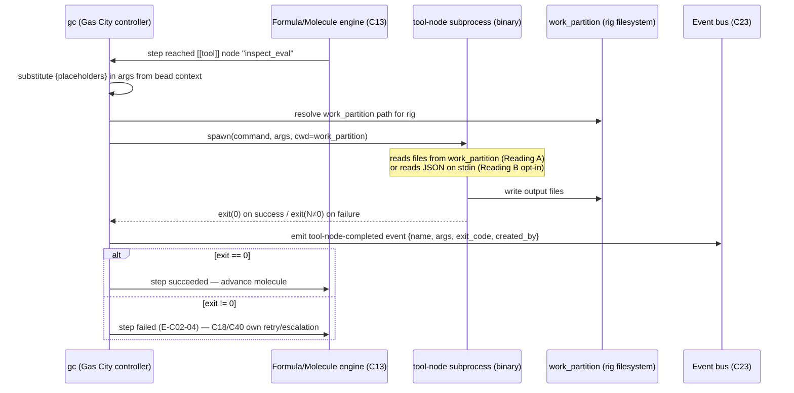

# C02 — Pack & Tool-Node ABI  (Spec, canonical track)

> Source: README §Part 4 (placement tables, lines ~107–256), §Part 5 ("Specific cautions" line 334; license-strategy table line 288), §Part 6 (Phase 0 lines 359–362; Phase 1 line 389; Phase 2 lines 424–426), §Part 7 (design bets lines 509–518), §Part 8 (line 535). AI-CONTEXT §3.4 (smallest viable install, lines 114–122), §3.5 (migration tail, line 128), §3.6 (extractability), §10.1 / decision tables (lines 439, 465, 476, 502), §13.1 (`pack.toml`/`city.toml` skeletons, lines 524–544), §13.2 (Phase-1 env + service blocks), §13.3 (rig partition + tool-node subprocess sketch, lines 599–608). F-MODE-COVERAGE F44 (per-pack production-scissors), F31 (single-adapter floor), F35/F43 (pack governance/RSI declaration). component-inventory C02 row; gaps G29, G06.
> Inventory ID: C02   Kind: interface   Status: sweep-2
> Track: canonical (faithful)
> Binding decisions obeyed: **D-2** (bundle-id namespace: pack ids = `softwarefactory.v4.packs`), **D-7** (formula node-kind taxonomy home = C12; C02 references C12's `tool` kind for the tool-node ABI but does not redefine the node-kind set), **D-33** (XC-7 RESOLVED — C03 owns the CapabilityDescriptor registry + descriptor schema; C02 carries only a `capability_id` reference in the pack manifest, NOT the descriptor definition).

> [D-23 substrate-verified — gascity-prototype@b14c278, 2026-05-25]
> **F3 — Pack import strictness; `[defaults.rig.imports.*]` placement; transitive-import deduplication:**
> Verified against the Gas City prototype (lago-morph/gascity-prototype@b14c278, 2026-05-25):
> (a) `[defaults.rig.imports.*]` entries must live in `city.toml`, not `pack.toml` — PackV2 rejects
> them in a pack manifest. (b) Transitive imports are de-duplicated at startup: if pack A imports
> pack B transitively, the city must NOT also declare `[imports.B]` directly — doing so produces a
> duplicate agent definition and refuses startup. Pack authors should document transitive imports
> explicitly so city authors know not to re-import them. §4 reflects these two constraints.

---

## Binding decisions (verbatim, per SWEEP2-DISPATCH §"Cite binding decisions VERBATIM")

**D-7** (formula node-kind taxonomy home):
> Formula node-kind taxonomy home = C12. The node-kind set (agent/tool/gate/sub_formula) is named by C12 as the formula DAG's own vocabulary; C02 references C12's `tool` kind for the tool-node ABI but does not redefine the set.

— review-log D-7 (Batch-2 review integration, 2026-05-31)

**D-2** (bundle-id namespace):
> One factory-owned reverse-DNS root with per-store sub-bundles: `softwarefactory.v4.beads` (bead types), `softwarefactory.v4.trajectory` (CXDB turn types), `softwarefactory.v4.packs` (pack ids). Drop vendor `strongdm.*` and the merged-single-bundle option. Apply across C02/C20/C21/C22.

— review-log D-2 (ADOPTED — both Persistence adversaries independently concur)

**D-33** (XC-7 CapabilityDescriptor ownership resolved):
> "The C02 and C03 Sweep-2 builders independently converged: **C03 owns the CapabilityDescriptor registry** (the authored capability catalog — a `city.toml` / config-layer concern); **C02 carries only a `capability_id` reference** in the pack manifest, not the descriptor definition. Resolves **XC-7** (the C02↔C03 ownership straddle flagged in both Sweep-1 specs)."

— review-log D-33 (Sweep-2 spine-run decisions, 2026-06-01)

**C02 DOES NOT define the CapabilityDescriptor schema.** C02 carries only a `capability_id` reference field in the pack manifest (declaring which capability a pack provides); C03 owns the registry and validates the reference. **XC-7 is RESOLVED.** See [C03](C03-config-feature-flags.md) for the registry and descriptor schema ownership.

---

## 1. Purpose & responsibility

C02 is the **sole extension surface of the v4 factory**. v4 does not fork Gas City and does not import it
as a Go library; every customization v4 needs is delivered as a **pack** — a distributable bundle of TOML
config + tool-node binaries + prompt templates — and the deterministic steps inside a pack run as
**tool nodes**: subprocess binaries invoked by Gas City over a fixed input/output protocol (AI-CONTEXT
§10.1 decision "Pack-based extension of Gas City; no fork — Yes"; README:334, :509, :518).

C02 owns the two contracts that make that claim true:

1. **The pack bundle contract** — what a distributable pack *is* on disk: its manifest (`pack.toml`), the
   declarations it may carry (`[imports.*]`, `[[tool]]`, hook registrations, prompt templates, formulas),
   and how Gas City imports and composes it into a running `city` (AI-CONTEXT §13.1, README:360).
2. **The subprocess tool-node ABI** — how Gas City hands inputs to a tool-node binary and how the binary
   returns outputs/exit status. This is the seam G29 flags as "the actual seam and is undocumented": a
   pack's tool nodes are Go (or any-language) programs that "must speak Gas City's tool-node protocol,"
   and that protocol is the load-bearing contract C02 must pin (AI-CONTEXT §13.3 sketch; README:389).

**Responsibilities**
- Define the **pack manifest schema** and the rules by which packs are imported and layered (which
  declarations a pack may contribute; how `[imports.core]` and pack-supplied sections compose with
  `city.toml`).
- Define the **tool-node invocation ABI**: the `[[tool]]` declaration shape (`name`, `type = "subprocess"`,
  `command`, `args` with `{placeholder}` substitution, `work_partition`), and the runtime contract for how
  a subprocess receives its inputs (substituted args / env / working dir / stdin) and returns outputs
  (stdout / exit code / written partition files).
- Establish that **no Go import / no fork** is required for any v4 extension, and pin the explicit boundary
  beyond which that stops being true (source-level Gas City modification: new runtime Provider, modified
  reconciler, urgent upstream bug fix — README:334).
- Carry the per-pack **declaration discipline** v4 leans on for failure-mode coverage: production-scissors
  declared per pack (F44), pack derivation-rule / governance hooks (F35), RSI status declared in
  `pack.toml` (F43).
- Define the **Claude Code extension-surface registration contract** as a pack ABI concern: Skills,
  Subagents, Hooks, and MCP servers declared and registered at pack level (C28:OQ-4).

**Explicitly NOT**
- NOT the Gas City substrate itself (C01). C02 is the *interface* onto C01's pack-loader and tool-bead
  machinery; C01 provides the `gc` binary, the reconciler, and the Provider runtime that *invoke* tool
  nodes.
- NOT the tool-node *abstraction* as a workflow concept (C17). C17 is the unified workflow-engine view of
  "a deterministic step / Gas City tool bead"; C02 is the concrete **wire protocol + bundle format** that
  C17's nodes are realized over. C17 depends on C02.
- NOT the config/feature-flag *model* (C03). C03 owns "section presence = capability"; C02 owns the
  bundle/ABI shape. They meet where a pack contributes config sections. C02 carries only a `capability_id`
  reference in the pack manifest; C03 owns the CapabilityDescriptor registry and descriptor schema
  (**D-33, XC-7 RESOLVED** — see §9 and [C03](C03-config-feature-flags.md) §3).
- NOT a Go-library SDK, an FFI, or a plugin-`.so` mechanism. The only sanctioned mechanism is
  **subprocess** tool nodes + TOML + templates (AI-CONTEXT §3.5, README:334).
- NOT the individual packs' contents (the CXDB bridge, Inspect-AI wrapper, anomaly pack, etc.). Those are
  C24/C30/C36… each authored *as* a pack *against* C02's contract.
- NOT the formula node-kind taxonomy. Per D-7, the node-kind set `{agent, tool, gate, sub_formula}` is
  C12's to define; C02 references C12's `tool` kind here but does not redefine the set.

## 2. Context & dependencies

| Direction | Component | Relationship |
|---|---|---|
| Upstream (depends on) | **C01** Gas City substrate | C01 supplies the `gc` pack-loader, tool-bead executor, and Provider runtime that load packs and spawn tool-node subprocesses. C02 is the contract; C01 is the engine. |
| Peer / supplies terms | **C07** vocabulary-glossary | C02 cites C07 for the canonical meaning of `pack`, `tool node`/`tool bead`, `formula`, `city`, `rig` (G06). |
| Downstream (realized over C02) | **C17** tool-node-abstraction | C17's deterministic workflow steps are subprocess tool nodes speaking the C02 ABI. |
| Downstream (every "your work" pack) | **C10, C14, C15, C16, C24, C30, C31, C32, C33, C35, C36–C39, C44, C46–C50** | Each custom component the inventory marks "Gas City pack" / "tool node" is built as a pack against C02. The README placement tables route ~25 components through this surface. |
| Downstream (config seam) | **C03** config-feature-flags | A pack contributes config sections; C03 governs how section presence gates capability. |
| Downstream (extension surface) | **C28** Claude Code agent loop | C28's Skills/Hooks/MCP surfaces are declared and registered at pack level (C28:OQ-4); C02 is the ABI for that registration. |

C02 is **foundational** (inventory: yes) and lives in **Batch 1**, authored in parallel with the other
load-bearing primitives because almost every later component is "a pack" and must build against this ABI.

## 3. Interfaces / contracts

### 3.1 Pack bundle (inbound: how a pack is authored & imported)

1. **`pack.toml` manifest** — the pack's declaration root. Named contents (described, not yet fully typed):
   - `[imports.<name>]` — pull in another pack (the Phase-0 minimum is exactly `[imports.core]`,
     AI-CONTEXT §13.1). The core import supplies the base agent/bead/runtime vocabulary.
   - `[[tool]]` blocks — tool-node declarations (see 3.2).
   - Hook registrations — Claude Code `PreToolUse`/`PostToolUse` hooks a pack registers (README:212
     "Gas City pack registers hooks").
   - Prompt templates — references to `agents/<name>/prompt.template.md` (Go `text/template` + Markdown,
     AI-CONTEXT §3.2 concept 5).
   - Formulas — TOML DAG templates the pack ships (C12), enabled when `[formulas]` is on.
   - > [FAITHFUL-FILL] **Declaration-discipline fields.** F-MODE-COVERAGE references three per-pack
     declarations that have no schema in the four docs: production-scissors (F44), pack derivation rule
     (F35), and RSI status (F43, "pack-author declares RSI status in pack.toml"). The minimal faithful fill
     is to reserve named manifest keys for them (e.g. `[pack.safety] production_scissors = false`,
     `rsi = "none"`, `[pack.derivation] from = "<exemplar>"`). This is the smallest choice consistent with
     v4 because the F-mode doc already *states* these live in `pack.toml`; C02 only needs to name the keys,
     not design the policy engines (those are C43/C57's concern).

2. **Pack-import / composition contract** — how `gc` merges a pack's declarations with `city.toml`. The
   docs give the layering by example (Phase-0 `[imports.core]` + `city.toml`; Phase-1 adds `[formulas]`,
   `[[service]]` blocks; Phase-2 adds `[[rig]]`, `[[tool]]`). The contract is: **section presence enables
   a capability** (C03), and packs contribute sections additively.
   > [AMBIGUITY: G06/composition] The docs never state precedence when a pack and `city.toml` declare the
   > same section. **Reading A:** `city.toml` (the local workspace) overrides imported packs. **Reading B:**
   > last-import-wins. Pick **Reading A** — it is most consistent with v4's "layered TOML, local config is
   > authoritative" framing (AI-CONTEXT §3.2 concept 4; C03), and with `city.toml` being the per-workspace
   > root in every skeleton. Recorded for sweep-2 confirmation.

### 3.2 Tool-node ABI (the load-bearing seam — G29)

The one concrete shape v4 gives is the `[[tool]]` subprocess sketch (AI-CONTEXT §13.3, lines 601–608):

```toml
[[tool]]
name = "inspect_eval"
type = "subprocess"
command = "inspect"
args = ["eval", "{scenario_path}", "--task", "{task}"]
work_partition = "scenarios"
```

From this, the named ABI elements (faithful elaboration, sweep-1 descriptions):

| Element | Description | Source / fill |
|---|---|---|
| `name` | Logical tool-node identity referenced by formulas/slings. | §13.3 sketch |
| `type = "subprocess"` | The only invocation kind v4 names; the binary is spawned as a child process, **not** linked. | §13.3; README:334 (subprocess, not Go import) |
| `command` | Path/name of the tool-node binary (Go or any language). | §13.3 sketch |
| `args` with `{placeholder}` | Argument vector with `{name}` placeholders substituted from the bead/molecule context (e.g. `{scenario_path}`, `{task}`). | §13.3 sketch |
| `work_partition` | The rig read/write partition the subprocess runs against (ties to C42 isolation). | §13.3 sketch |
| **Input channel** | How the substituted context reaches the binary. | > [FAITHFUL-FILL] |
| **Output channel** | How the binary returns results to Gas City. | > [FAITHFUL-FILL] |
| **Status channel** | Success/failure signal. | > [FAITHFUL-FILL] |

> [AMBIGUITY: G29] **The input/output channel is genuinely undocumented** — G29's exact complaint ("how a
> subprocess tool node receives inputs and returns outputs … is undocumented"). Two faithful readings:
> **Reading A (args + files):** inputs arrive *only* as substituted `args`/env and as files in
> `work_partition`; outputs are files the binary writes back into `work_partition`, status is the process
> **exit code** (0 = success). This is what the §13.3 sketch literally shows (`inspect eval … --task` is a
> pure CLI invocation that reads/writes the partition). **Reading B (stdin/stdout JSON):** a structured
> JSON document on stdin, structured JSON on stdout, exit code as status — the shape the raw-bodies→CXDB
> bridge ("posts to CXDB via HTTP/JSON", README:389) and "small Go tool node reading judge outputs"
> (README:426) imply for richer payloads.
> **Pick Reading A as the canonical floor, with Reading B as the optional structured profile.** Rationale:
> Reading A is the only shape the docs *show*; every cited tool node (Inspect AI CLI, the bridge watching a
> directory, the satisfaction aggregator reading beads) functions under args+partition-files+exit-code, so
> the args/files/exit-code contract is the minimal-consistent ABI. Reading B is then a non-breaking
> superset for tool nodes that need to stream a structured request (deferred to sweep-2 as the "json"
> tool-node profile). This keeps the single mandatory contract small (G29) while not contradicting the
> HTTP/JSON-shaped bridge.
> **Cross-track note:** the optimized track (C02-B DELTA-01/03) makes the structured stdin/stdout-JSON
> envelope the *primary* path and demotes argv/`{placeholder}` to a compat shim — i.e. it promotes this
> doc's optional Reading B to its floor. The divergence is deliberate; a reader diffing the canonical spec
> against the frozen `spec-optimized/` reference should expect opposite primary I/O channels by design.

**OQ-1 / G29 PARTIAL (needs-G11):** The prototype's `entrypoint.sh` and `pack/pack.toml` show the
`[[tool]]` declaration shape (harvest-verified: `name`, `type`, `command`, `args`, `work_partition` fields
from `pack/pack.toml`; verified at source level per gascity-config-anchor §3 row "`[[tool]]`"). The
*runtime behavior* — exactly what env vars the subprocess receives, whether stdin is connected or `/dev/null`,
the exact parse rule for `{placeholder}` substitution, and whether the prototype ever exercises a `[[tool]]`
node end-to-end — is `[needs G11 verification]`. Reading A (args + files + exit-code) is grounded in the
declaration shape; the runtime wire bytes await a pinned-`gc` run.
**RESOLVED (Sweep-2): Reading A is adopted as the canonical floor** (see §3.2.1 below for the full
frozen contract). **PARTIAL (needs-G11):** env-var set, stdin connectivity, and exact `{placeholder}`
substitution grammar need pinned-`gc` verification before any downstream pack can rely on precise wire
behavior.

3. **Tool-node invariants** (sweep-1 statements):
   - A tool node is **deterministic-first**: it is the surface for steps that "don't need a model"
     (README:154); LLM nodes are a different node kind owned by C28, not C02. The formula node-kind set
     `{agent, tool, gate, sub_formula}` is **named by C12** (taxonomy home, **D-7**); C02 references C12's
     `tool` kind here for the tool-node ABI but does **not** redefine the set.
   - A tool node is **language-agnostic** at the ABI: Go, Python ("Python tool node", README:253–255), or
     any binary that honors the subprocess contract. The "no Go import" rule (README:334) is about *Gas
     City as a library*, not about the tool node's own language.
   - A tool node is **side-effecting only within its `work_partition`** (rig isolation, §13.3 + C42).
   - Invocation is **stateless per call** > [FAITHFUL-FILL]: nothing in v4 describes a persistent tool-node
     daemon, and `type="subprocess"` implies spawn-per-step; minimal-consistent assumption is one process
     per node execution. (A long-lived "service" is the separate `[[service]]` block, §13.2, not a tool
     node.) **Caveat:** the tool-node↔`[[service]]` boundary for the C24 directory-watch bridge and the
     C44 twin is undrawn in the corpus (the optimized tracks raise this as C02-B OQ4 / C17 OQ4). The
     faithful reading holds spawn-per-step as the *only* shape v4 shows, but C24/C44-shaped long-lived
     work may belong on the `[[service]]` side, not under this invariant — see OQ5.

### 3.2.1 Tool-node I/O channel — frozen contract (Sweep-2, Reading A floor)

**Input channel (canonical = args + env + partition files):**

| Channel element | Value | Verification |
|---|---|---|
| Argv[0] | Value of `command` key (binary name or path) | harvest-verified from `pack/pack.toml` shape |
| Argv[1..N] | `args` list with `{name}` tokens substituted from bead/molecule context; substitution is positional, not named-env | harvest-verified `[[tool]]` declaration; substitution grammar **needs-G11** |
| Working dir | The `work_partition` directory path resolved by `gc` at runtime; the binary sees a cwd it may read/write | [inferred — needs G11] exact path form |
| Env vars | Process inherits container env; whether `gc` injects additional tool-specific env vars (e.g. partition path, tool name) is **[needs G11 verification]** | needs-pinned-gc-run (G11) |
| stdin | Not used in Reading A (the `inspect eval …` CLI invocation takes no stdin); treat as closed/`/dev/null` unless the binary explicitly opens it | [inferred — needs G11] |

**Output channel (canonical = partition files + exit code):**

| Channel element | Value | Verification |
|---|---|---|
| Files written | The binary writes output files into `work_partition`; Gas City reads them after the subprocess exits | harvest-verified (the `inspect eval` shape writes to its partition dir) |
| stdout | Not part of Reading A's required output; `gc` may log it but does not parse it as structured output in the floor contract; structured stdout is the Reading-B profile | [inferred — needs G11] |
| stderr | Not parsed; forwarded to container logs for observability | [inferred — needs G11] |
| Exit code | **0 = success; non-zero = failure.** The only mandatory status channel. C18/C40 own retry/escalation on failure; the ABI surfaces the code, not the retry policy. | harvest-verified (exit-code-as-status is the universal Unix/subprocess convention the `inspect` CLI uses) |

**OQ-1 (G29) resolution note:** The residual `[needs G11 verification]` items above are the granular
wire unknowns. The high-level channel selection (args+files+exit-code vs stdin/stdout JSON) is now
frozen as Reading A. The optional **Reading B (stdin/stdout JSON profile)** is defined in §3.2.2 and is
a non-breaking superset; it does NOT alter the mandatory floor.

### 3.2.2 Reading-B profile: stdin/stdout JSON (optional, non-breaking)

> [FAITHFUL-FILL] **The JSON profile is not described by v4**; it is the minimal-consistent elaboration
> for richer tool nodes (README:389 HTTP/JSON bridge; README:426 "small Go tool node reading judge
> outputs") that the floor alone cannot serve. It is a SUPERSET — a tool node that ignores stdin and
> writes only partition files still satisfies the Reading-A floor.

When a `[[tool]]` block specifies `structured_io = true` (a v4-side manifest extension, not verified as a
native `gc` field — `[needs G11 verification]`):
- **stdin**: a single-line JSON object is provided on stdin, containing the substituted bead/molecule
  context (`{"scenario_path": "…", "task": "…", …}`).
- **stdout**: a single JSON object `{"result": <any>, "summary": <string>}` on stdout; Gas City parses
  `result` for the step's output payload.
- **exit code**: same semantics as Reading A (0 = success).

This profile is the shape that enables the C24 telemetry→CXDB bridge ("posts to CXDB via HTTP/JSON")
and judge-output readers to return structured data without writing intermediate files. Downstream packs
opting into it must declare `structured_io = true` in their `[[tool]]` block. `[needs G11 verification]`
whether this is a native `gc` field or a v4-side convention only.

### 3.3 Claude Code extension-surface registration (C28:OQ-4 as a pack ABI surface)

v4 names four Claude Code extension surfaces (AI-CONTEXT §4.4 L182–190): **Skills**, **Subagents**,
**Hooks**, and **MCP servers**. C28:OQ-4 asks: "Skills/Subagents/Hooks/MCP registration schemas inferred
declarative; confirm pack-level contract." This is a C02 ABI surface.

**Canonical reading (faithful elaboration):** registration is **declarative at pack level**, following the
same section-presence = feature-flag pattern (C03) Gas City uses for all capabilities. A pack registers
Claude Code extension surfaces via named declarations in `pack.toml` or co-located `.claude/` files:

| Surface | Registration shape | Declared in | Verification status |
|---|---|---|---|
| **Skills** | `.claude/skills/<skill-name>.md` — a file in the pack's `.claude/skills/` directory; the skill is available to any Claude Code instance that loads this pack | pack bundle `.claude/skills/` | [inferred — needs G11] |
| **Subagents** | Referenced via prompt templates + sling routing; no separate declaration block (a subagent = an agent rig, declared in `city.toml`) | `city.toml [[agent]]` + C05 sling | harvest-verified (agent/rig exists natively) |
| **Hooks** | Named `[[hook]]` block in `pack.toml` with `event` (e.g. `PreToolUse`, `PostToolUse`, `SessionStart`, `Stop`) and `command` (tool-node binary or script) | `pack.toml [[hook]]` | [inferred — needs G11] exact block name |
| **MCP servers** | `[[service]]` block in `city.toml` (or pack-supplied) with `protocol = "mcp"` pointing to an MCP server process | `city.toml [[service]]` | [inferred — needs G11] exact field |

> [FAITHFUL-FILL] **The exact field shapes for `[[hook]]` and MCP-protocol `[[service]]` are not given
> by v4 or the prototype.** v4 names these surfaces (README:212 "Gas City pack registers hooks"; AI-CONTEXT
> §4.4 Skills/Subagents/Hooks/MCP) but never provides TOML block shapes. The minimal consistent choice is:
> hooks use a named block with `event` + `command` (parallel to `[[tool]]`'s `name` + `command`), and MCP
> servers use the existing `[[service]]` block shape with an added `protocol` discriminator. These are
> the *smallest new declarations* that slot into the existing pattern without new machinery. All are marked
> `[inferred — needs G11]` and `[needs G11 verification]`. C28:OQ-4 remains **PARTIAL (needs-G11)** at
> the field-schema level.

**Pack-level registration bundle** (the artifact C02 guarantees to C28):

```toml
# pack.toml — Claude Code extension-surface declarations

[pack]
name = "softwarefactory.v4.packs.override-loop"   # D-2 namespace
schema = 2                                          # PackV2 (harvest-verified)

# Skills: files under .claude/skills/ are picked up automatically by the Claude Code CLI
# No TOML declaration needed — presence of the file IS the registration.

# Hook registrations — [inferred field shape, needs G11]
[[hook]]
event   = "PreToolUse"   # or PostToolUse | SessionStart | Stop
command = "bin/override-gate"
args    = ["--tool-name", "{tool_name}"]

# MCP server — [inferred field shape, needs G11]
[[service]]
name     = "cxdb-mcp"
protocol = "mcp"          # [inferred — needs G11]
command  = "bin/cxdb-mcp-server"
```

### 3.4 Outbound: what C02 guarantees to dependents

- To **C17**: a stable "declare a deterministic step as a `[[tool]]` subprocess" contract so the workflow
  engine can place tool beads without knowing the binary's language.
- To **C28**: a stable pack-level declaration schema for Skills/Hooks/MCP registration so extension
  surfaces compose with the pack bundle.
- To **every pack-built component**: a frozen bundle layout so a pack authored in Phase 1 still loads in
  Phase 3 (subject to AI-CONTEXT §3.5's warning of 1–2 breaking pack-schema changes/quarter — C02 must
  version the manifest; see §7).

## 4. Data model / state

C02 is an **interface/contract**, not a data store; it owns *format definitions*, not live state.

### 4.1 Pack manifest field table (Sweep-2)

The `pack.toml` manifest. Field column = TOML key (quoted as it appears). Type = TOML type. Req = R (required) or O (optional). R/W-by = which component reads/writes the field.

| Field | Type | Req | Semantics | R/W-by |
|---|---|---|---|---|
| `[pack] name` | string | R | Stable pack identity under the `softwarefactory.v4.packs` namespace (D-2); e.g. `"softwarefactory.v4.packs.override-loop"`. Immutable once published. | Pack author writes; `gc` reads at import; C02 validates namespace |
| `[pack] schema` | integer | R | PackV2 schema version = `2` (harvest-verified from `pack/pack.toml`; `schema = 2` is the current PackV2 requirement). C02's schema-version guard rejects packs whose `schema` is incompatible. | Pack author writes; `gc` reads and rejects on mismatch |
| `[pack] schema_version]` | string (semver) | O | v4-side ABI version of THIS pack's content (not Gas City's schema discriminator). Distinct from `[pack] schema`. Lets downstream consumers detect breaking changes within the pack's own contract. | Pack author writes; consuming packs / C02 conformance suite reads |
| `[pack.safety] production_scissors` | boolean | O | Declares that this pack's tool nodes touch Bash/network/fs in production (F44). Must be `true` before enforcement gating (C43); omission = `false` (no production scissors claimed). | Pack author writes; C43/C57 governance pack reads |
| `[pack.safety] rsi` | string enum `{"none","partial","full"}` | O | RSI status declaration (F43). Self-asserted; audit is C57's governance role. | Pack author writes; C57/C43 reads |
| `[pack.derivation] from` | string | O | Gene-transfusion exemplar attribution: the external exemplar(s) this pack transfused (F35; links to C51's `transfused_from`). | Pack author writes; C51 audit reads |
| `[imports.<name>]` | table | O | Import a named sub-pack. `source` key gives the GitHub `owner/repo//path` URL. MUST NOT duplicate a transitively-imported pack name (F3 — duplicate agent = startup refusal). | Pack author writes; `gc` resolves at import; C02 validates no-dup rule |
| `[imports.<name>] source` | string | R (if block present) | GitHub path of the imported pack (e.g. `"github.com/gastownhall/gastown//base"`). Resolved from embedded FS at install; no runtime network. | Pack author writes; `gc` reads |
| `[[tool]] name` | string | R | Logical tool-node identity (referenced by formula DAG nodes, C12). Unique within the pack. | Pack author writes; `gc` uses for dispatch; C17 references |
| `[[tool]] type` | string `"subprocess"` | R | Invocation kind. Only value v4 names is `"subprocess"`. | Pack author writes; `gc` validates |
| `[[tool]] command` | string | R | Path or name of the tool-node binary. Resolved relative to pack directory. | Pack author writes; `gc` spawns |
| `[[tool]] args` | array of string | O | Argument vector; tokens of the form `{name}` are substituted from bead/molecule context at invocation time. | Pack author writes; `gc` substitutes at spawn time |
| `[[tool]] work_partition` | string | O | Rig partition name the subprocess runs against (read/write scope; C42 isolation). | Pack author writes; `gc` sets working dir / scope at spawn |
| `[[tool]] structured_io` | boolean | O | Opt-in to Reading-B JSON profile (§3.2.2). `false` (default) = Reading A (args + files + exit code). `[needs G11 verification]` whether native `gc` field. | Pack author writes; `gc` or C02 shim reads |
| `[[hook]] event` | string | O | Claude Code hook event name (`PreToolUse`, `PostToolUse`, `SessionStart`, `Stop`). `[inferred — needs G11]` exact field. | Pack author writes; C28/C35 reads |
| `[[hook]] command` | string | O | Binary to invoke for the hook event. `[inferred — needs G11]` | Pack author writes; C28 invokes |
| `[[hook]] args` | array of string | O | Args for hook binary (same `{placeholder}` convention as `[[tool]]`). `[inferred — needs G11]` | Pack author writes; C28 substitutes |

**Placement rule (F3 harvest-verified):** `[imports.*]` belongs in `pack.toml`. `[defaults.rig.imports.*]` belongs in `city.toml` — PackV2 rejects it in a pack manifest. A pack must not duplicate a transitively-imported pack name.

### 4.2 Pack on-disk layout

```
packs/<pack-name>/
  pack.toml                      # manifest (§4.1)
  agents/<agent-name>/
    prompt.template.md           # Go text/template + Markdown
  bin/<tool-node-binary>         # one binary per [[tool]] command
  .claude/
    skills/<skill-name>.md       # Skills (presence = registration)
  formulas/<formula-name>.toml   # C12 TOML DAGs (if any)
```

> [FAITHFUL-FILL] exact directory tree (`packs/<name>/…`) inferred from AI-CONTEXT §16 line 697
> "`packs/*/spec.md`" and README:360; minimal-consistent because the docs only ever show `pack.toml` +
> templates + binaries as the contents.

C02 holds **no runtime state**: the molecule/bead state a tool node reads/writes belongs to C13/C19;
the partition files belong to C42's rigs.

## 5. Behavior

Key flow (sweep-1 narrative; sequence diagram added at sweep-2 §5.1):

1. Operator authors a pack: writes `pack.toml`, drops tool-node binaries + prompt templates.
2. `gc` **imports** the pack (`[imports.core]` etc.), merging its declarations into the running `city`
   under the composition rule (3.1.2; local `city.toml` authoritative).
3. A formula/sling reaches a deterministic step bound to a `[[tool]]` node.
4. Gas City **substitutes** `{placeholders}` in `args` from bead/molecule context, then **spawns** the
   `command` as a subprocess in the declared `work_partition`.
5. The subprocess does its work against partition files (and, in the optional JSON profile, stdin), then
   **returns** outputs (partition files / stdout) and a **status** (exit code).
6. Gas City records the step's actor/result (C41 `created_by`, C23 event bus) and the reconciler advances.

The Phase-progression behavior the docs assert: Phase 0 install needs **zero custom code** — only
`[imports.core]` + `city.toml` + one template (README:359–362) — and *every* later capability arrives by
*adding packs*, never by forking. C02 is the invariant that makes "no fork" true across all four phases.

### 5.1 Sequence diagram: tool-node invocation (Sweep-2)



## 6. Failure modes & handling

| F-mode | Relevance to C02 | Handling (faithful) |
|---|---|---|
| **F31** Substrate safety floor = weakest adapter | C02 keeps the extension surface to one mechanism (subprocess packs over one substrate). | The single-adapter / single-mechanism choice *is* the mitigation (F-MODE §73: "Addressed by single-adapter choice"). C02 forbids alternate plugin mechanisms that would reintroduce a weaker floor. |
| **F44** Lethal-trifecta production-scissors | A pack's tool node may touch Bash/network/fs. | Per-pack declaration: "production scissors require explicit declaration per pack" (F-MODE §56). C02 reserves the manifest key (§4.1 `[pack.safety] production_scissors`); enforcement is C43. |
| **F35** Federation-as-family drift | v4's pack architecture "creates exactly this risk if pack governance is not explicit" (F-MODE §101). | C02 reserves the `[pack.derivation] from` key; the derivation-rule *check* ships as a Phase-1 governance pack (F-MODE §172) — itself a C02 pack. |
| **F43** RSI board-visibility gap | Self-modifying packs. | `pack.toml` declares RSI status (§4.1 `[pack.safety] rsi`); C02 names the key, discipline remains operator-required (partial). |
| **Pack-schema breakage** (AI-CONTEXT §3.5) | 1–2 breaking pack/formula-format changes per quarter expected. | `[pack] schema` version (harvest-verified `schema = 2`) lets `gc` reject incompatible packs; `[pack] schema_version]` guards the v4-side ABI version. |
| **Tool-node nonzero exit / crash** | A subprocess fails. | Exit code ≠ 0 is the failure signal (§3.2 Reading A); the reconciler/Health-Patrol (C18) and Orders (C40) own retry/escalation. > [FAITHFUL-FILL]: v4 gives no per-tool retry contract at the ABI; minimal-consistent placement is "ABI surfaces exit code; convergence loop decides," since C18/C40 own retries/crash-survival in the docs. |
| **Duplicate transitive import** | Pack A imports pack B which imports pack C; city also declares `[imports.C]` directly | PackV2 refuses startup (F3, harvest-verified). C02's composition contract must document this; pack authors must list transitive imports explicitly. |

> [FAITHFUL-FILL] G29 is a **minor** gap and is *resolved here* by elaborating the ABI (§3.2); no other
> C02-assigned failure mode is deferred.

### 6.1 E-code error taxonomy (Sweep-2)

| Code | Condition | Surfaced-as | Caller recovery |
|---|---|---|---|
| **E-C02-01** | Pack-load failure: `[pack] schema` value is incompatible (e.g. schema mismatch, unrecognised version) | `gc` startup rejection with error log; city refuses to start | Update pack to compatible `schema = 2`; or pin a compatible `gc` version |
| **E-C02-02** | ABI violation: `[[tool]] type` is not `"subprocess"` (unknown invocation kind) | `gc` config-parse error at startup; tool declaration rejected | Remove non-`subprocess` type; await `gc` support or use `[[service]]` block instead |
| **E-C02-03** | Registration failure: duplicate transitive import — pack A imports B which imports C; city also declares `[imports.C]` (F3 harvest-verified) | `gc` startup refusal "duplicate agent definition" | Remove the redundant direct `[imports.C]` declaration from `city.toml`; rely on transitive import only |
| **E-C02-04** | Tool-node non-zero exit (runtime) | Non-zero exit code returned to `gc`; molecule step marked failed; C18/C40 event emitted to event bus (C23) | C18 reconciler handles retry per formula policy; C40 Orders can escalate on repeated failure |
| **E-C02-05** | `[defaults.rig.imports.*]` misplaced in `pack.toml` instead of `city.toml` | PackV2 startup rejection (F3 harvest-verified) | Move the block to `city.toml` |
| **E-C02-06** | `[pack] name` violates the `softwarefactory.v4.packs` namespace (D-2) | C02 conformance-suite reject (not a native `gc` error; v4-side check) | Rename pack to a valid `softwarefactory.v4.packs.<slug>` name |
| **E-C02-07** | Hook registration references a non-existent command binary | Hook invocation fails at event-fire time; hook event logged as failed on C23 | Ensure `[[hook]] command` binary is present in the pack's `bin/` directory |
| **E-C02-08** | Structured-IO (Reading B) stdout is not valid JSON | Gas City cannot parse step output; molecule step marked failed (E-C02-04 path) | Fix tool-node to emit valid `{"result": …, "summary": …}` JSON on stdout; or remove `structured_io = true` and revert to Reading A |

## 7. Cross-cutting (security / cost / scale / observability / ops)

- **Security.** The ABI is where the lethal-trifecta boundary is enforced *per pack*: subprocess +
  `work_partition` confine a tool node; production scissors must be declared (F44). C02's "subprocess, not
  in-process plugin" choice means a misbehaving tool node cannot corrupt `gc`'s address space — a security
  property of the subprocess boundary itself.
- **Cost / scale.** Spawn-per-step subprocess invocation has process-startup overhead; v4 accepts this
  because tool nodes are "cheap and reproducible" (README:154) and run only "where reasoning is not
  required." No token cost (deterministic). > [FAITHFUL-FILL] no perf budget is stated; not invented here.
- **Observability.** Every tool-node invocation is an actor action: it carries `created_by` (C41) and lands
  on the event bus (C23). C02 must ensure the ABI exposes enough (node `name`, args, exit code) for that
  record — consistent with P9 attribution being "native, every bead and event carries `created_by`"
  (README:371).
- **Ops / licensing.** C02 is the mechanism that makes the **MIT / no-fork** license posture hold: because
  v4 never imports Gas City's `internal/` Go paths, the GitHub `internal/` import block is a non-issue
  (README:288, :334; AI-CONTEXT §10.1 line 502 "Corrected 2026-05-29"). The boundary beyond which a fork
  *would* be needed (new Provider / modified reconciler / urgent bug fix) is named and out of v4 scope.

## 8. Acceptance criteria & test strategy

Sweep-1 high-level criteria (concrete AC-codes at sweep-2 §8.1):

1. **Phase-0 minimum loads** — a `pack.toml` with only `[imports.core]` plus the §13.1 `city.toml` + one
   prompt template boots a one-agent `city` with **no custom Go code and no fork** (README:359–362).
2. **Subprocess tool node runs end-to-end** — the §13.3 `inspect_eval` `[[tool]]` (or an equivalent stub)
   is invoked with `{placeholder}` args substituted, executes in its `work_partition`, and its exit code
   is read as status (§3.2 Reading A).
3. **No-fork invariant holds across phases** — Phases 1–3 add capability *only* by importing packs and
   adding TOML sections; no step requires importing Gas City as a Go library or modifying its source
   (the load-bearing claim of README §Part 7).
4. **Manifest declarations compose** — a pack contributing `[[tool]]`, a hook, a template, and a formula
   layers correctly with `city.toml`, with `city.toml` authoritative on conflict (§3.1.2 Reading A).
5. **Declaration-discipline keys are honored** — a pack declaring production-scissors / RSI / derivation is
   readable by the governance checks (F44/F35/F43) — i.e. the keys exist and parse (enforcement tested by
   C43/C57).
6. **Schema-version guard** — a pack with an incompatible `schema_version` is rejected rather than
   mis-loaded (§3.5 breaking-change tolerance).

### 8.1 Concrete acceptance tests (Sweep-2)

**AC-codes: Given / When / Then format. E-code cross-references in parentheses.**

| Code | Given / When / Then | Verifies |
|---|---|---|
| **AC-C02-01** | Given a `pack.toml` with `schema = 2` and `[imports.core]` only; When `gc start` is run; Then the city boots one agent with no fork and no custom Go (AC-1 floor) | Phase-0 minimum, no-fork invariant |
| **AC-C02-02** | Given a `pack.toml` with `schema = 99` (future-unknown); When `gc start` is run; Then startup is rejected with a schema-mismatch error **(E-C02-01)** | Schema-version guard |
| **AC-C02-03** | Given a `[[tool]]` block with `type = "subprocess"`, `command = "bin/echo-tool"`, `args = ["--in", "{scenario_path}"]`, `work_partition = "scenarios"`; When the formula reaches that step with `scenario_path = "s/hello.yaml"`; Then the binary is spawned with argv `["bin/echo-tool", "--in", "s/hello.yaml"]` and exit 0 advances the molecule | Subprocess invocation + placeholder substitution (§3.2.1) |
| **AC-C02-04** | Given AC-C02-03 setup but the binary exits with code 1; Then the molecule step is marked failed and the E-C02-04 event is emitted on the C23 event bus; C18/C40 own retry **(E-C02-04)** | Non-zero exit handling |
| **AC-C02-05** | Given `city.toml` imports pack A (which transitively imports pack B), and `city.toml` also declares `[imports.B]` directly; When `gc start`; Then startup is refused "duplicate agent definition" **(E-C02-03)** | Transitive-import deduplication (F3 harvest-verified) |
| **AC-C02-06** | Given a `pack.toml` with `[defaults.rig.imports.foo]` (misplaced); When `gc start`; Then PackV2 rejects with parse error **(E-C02-05)** | Import-placement rule (F3 harvest-verified) |
| **AC-C02-07** | Given a `pack.toml` with `[pack] name = "vendor.custom.pack"` (wrong namespace); When the C02 conformance suite runs; Then the suite rejects the manifest **(E-C02-06)** | D-2 namespace enforcement |
| **AC-C02-08** | Given a pack with `[pack.safety] production_scissors = true`; When C43/C57 governance check reads the manifest; Then the field parses and is surfaced as a declared production-scissors pack (F44) | Declaration-discipline keys (F44) |
| **AC-C02-09** | Given a `[[tool]]` block with `structured_io = true`; When the formula reaches the step and the binary emits `{"result": {"score": 0.9}, "summary": "ok"}` on stdout with exit 0; Then Gas City parses the result object and advances the molecule with the result payload (Reading B profile, §3.2.2) | Optional JSON profile (non-breaking superset) |
| **AC-C02-10** | Given AC-C02-09 but the binary emits malformed JSON on stdout; Then the step is marked failed **(E-C02-08)** | Structured-IO failure handling |

## 9. Open questions

(Mirrored into `_meta/review-log.md`.)

1. **[G29 / OQ-1] Exact tool-node I/O channel — RESOLVED (Sweep-2): Reading A (args+files+exit-code) is
   the mandatory floor; Reading B (stdin/stdout JSON) is the optional profile (§3.2.2). PARTIAL (needs-G11):
   env-var set, stdin connectivity, exact `{placeholder}` substitution grammar, and `structured_io` as a
   native `gc` field or v4-side-only convention need pinned-`gc` verification before downstream packs can
   rely on precise wire behavior.** Every downstream pack (C24 bridge, C31 runner, C33 aggregator) builds
   against the Reading-A floor; they may opt into Reading-B if the v4-side convention is sufficient.

2. **[OQ-2] Pack-vs-`city.toml` precedence on duplicate sections** — confirm Reading A (local authoritative)
   against actual `gc` behavior (G11 — Gas City unverified). Unblocks C03's §4 merge-algebra sweep-2 freeze.

3. **[OQ-3 / XC-7] CapabilityDescriptor ownership — RESOLVED by D-33 (2026-06-01).**
   **XC-7 is RESOLVED.** Per D-33: **C03 owns the CapabilityDescriptor registry + descriptor schema**
   (the authored capability catalog — a `city.toml` / config-layer concern); **C02 carries only a
   `capability_id` reference** in the pack manifest, not the descriptor definition. C02 does NOT define the
   CapabilityDescriptor schema. The `capability_id` reference field in the pack manifest declares which
   capability a pack provides; C03 validates the reference against its registry. This is the same
   authorship/registration split as C20→C22 (bead schemas → CXDB registry, per D-3). See binding decisions
   block at the top of this spec and [C03 §3](C03-config-feature-flags.md).

4. **[OQ-4] Declaration-discipline key names** — the F44/F35/F43 manifest keys (`[pack.safety]`,
   `[pack.derivation]`) are reserved here; their exact names/shape must be reconciled with C43 (isolation)
   and C57 (failure-mode register) so the governance packs and the manifest agree.

5. **[OQ-5] Long-lived vs spawn-per-step tool nodes** — confirm no persistent tool-node daemon exists (vs the
   `[[service]]` block), so the "stateless per call" invariant is safe. Specifically: do the C24 directory-
   watch bridge and the C44 twin run as tool nodes or as `[[service]]` blocks? The corpus does not draw this
   boundary; the optimized tracks defer it (C02-B OQ4 / C17 OQ4). Reconcile at sweep-2 before C24/C44 build.

6. **[OQ-6 / C28:OQ-4] Claude Code extension-surface registration field shapes** — `[[hook]]` block, MCP
   `[[service]]` `protocol` field, and whether `.claude/skills/` presence-auto-registers are `[inferred —
   needs G11]`. Sweep-2 must confirm against a pinned `gc` run and/or Claude Code's documented pack schema.
   **PARTIAL (needs-G11)** pending that verification.

---

**[D-23 substrate-verified — gascity-prototype@b14c278, 2026-05-25]**

**F3 — Pack import strictness; `[defaults.rig.imports.*]` placement; transitive-import deduplication (NEW-INFO operational constraint):**
Verified against the Gas City prototype (lago-morph/gascity-prototype@b14c278, 2026-05-25):
(a) `[defaults.rig.imports.*]` entries must live in `city.toml`, not `pack.toml` — PackV2 rejects
them in a pack manifest. (b) Transitive imports are de-duplicated at startup: if pack A imports
pack B transitively, the city must NOT also declare `[imports.B]` directly — doing so produces a
duplicate agent definition and refuses startup. Pack authors should document transitive imports
explicitly so city authors know not to re-import them. C02's pack-on-disk layout documentation
(§4) should reflect these two constraints. This partially informs C02:OQ4 (declaration-discipline
key names) — specifically, the import placement rule: `[imports.*]` belongs in `pack.toml`,
`[defaults.rig.imports.*]` belongs in `city.toml`.
