# C04 — Session & Provider Runtime  (Spec, canonical track)

> Source: AI-CONTEXT §3.2 concept 1 "Session" (L85), §3.6 extractability findings (L131–135), §6.3 Kilroy multi-mode resume (L268–270), §13.2 config blocks (L569–580), §16 cold-pickup resume (L694–699); README §"Principle 2 — Three-layer architecture" (L113–124), §Phase 0 (L353–374); component-inventory C04 row (Depends on C01; Maps from A27, A20b, B73, B85; Key gap G12).
> Inventory ID: C04   Kind: component   Status: sweep-2
> Binding decisions obeyed: **D-6** (single canonical track). **D-23 harvest (F7)** resolves C04:OQ-4 (Phase-0 Provider-kind = tmux). **D-30** (prevent-gate for unattended, design of watcher deferred).

> [D-23 substrate-verified — gascity-prototype@b14c278, 2026-05-25]

> F7 — Phase-0 Provider-kind = **tmux**. Each agent (coordinator, health-patrol, bootstrap, per-rig observers, worker pool members) runs as a separate interactive `claude` process in its own tmux pane, all within a single tmux server named after the city. The controller (`gc start --foreground`) manages the panes and restarts dead ones. This resolves C04:OQ-4.

> F6 — Controller = `gc start --foreground`; reconciles desired-vs-running, reaps dead sessions, fires due orders. Runs as PID 7 in the prototype container (tini = PID 1 for zombie reaping). This is the concrete realisation of C04's session-provider mechanism.

> F12 — `claude --dangerously-skip-permissions` refuses root unless `IS_SANDBOX=1`. Three onboarding dialogs must be pre-acknowledged in `~/.claude.json` (NOT `~/.claude/settings.json`) and per-working-directory trust entries written by the entrypoint. Production deployment constraints for any containerised Gas City session.

---

## 1. Purpose & responsibility

C04 is the **session & provider runtime**: the stable, named execution context inside which an agent
process (C28) runs, backed by a pluggable **Provider** (`tmux` / `k8s` / `subprocess` / `exec`), with
**cross-session continuity and resume**. It is Gas City's "Session" concept — *"Stable runtime backed by
Provider (tmux/k8s/subprocess/exec)"* (AI-CONTEXT §3.2 concept 1, L85) — adopted wholesale, not rebuilt.

It is responsible for:
- **Owning process lifecycle** for a unit of agent work: start, attach/detach, suspend, resume, stop of
  the backing process, independent of any single client connection (the tmux runtime is the default
  Provider per README L119 "Use Claude Code directly via Gas City tmux runtime", Phase 0 L361 "one
  `[[agent]]` pointing at Claude Code via the tmux provider").
- **Presenting the `runtime.Provider` interface** (~18 methods) as the single stable seam between Gas City
  and the backing execution substrate (AI-CONTEXT §3.6 L133). Swapping `tmux`→`k8s`→`subprocess`→`exec`
  is a Provider swap behind this interface; nothing above it changes.
- **Injecting the session environment** into the backing process: the `[[agent]]` `env = { … }` block
  (OAuth-derived Claude Code auth + `CLAUDE_CODE_ENABLE_TELEMETRY` / `OTEL_*` / `OTEL_LOG_RAW_API_BODIES`,
  AI-CONTEXT §13.2 L572–580) and the working directory / partition for the run.
- **Cross-session continuity** — *"Resume after agent restarts"* via **Gas City session resume + Claude
  Code session-id** (README L240, "Native", MIT). The session survives agent process restarts and sandbox
  death; a later attach resumes the same logical session.
- **Carrying the session-log seam** — `internal/sessionlog` parses the backing process's Claude Code JSONL
  (AI-CONTEXT §5.4 L229, §3.6 L133); C04's session-id is the parent-chain key downstream stores key on.

**What it is explicitly NOT:**
- NOT the **agent loop** (C28). C04 starts/hosts/resumes the process; the multi-turn reason→tool→observe
  loop *inside* it is C28 (C28 spec §1 "C28 *runs inside* a C04 session"; AI-CONTEXT §2 L48–52 separates
  LLM-client/agent-loop from the session that hosts them).
- NOT the **provider/model abstraction in the LLM sense** (which model answers a turn). "Provider" here is
  the **execution-substrate** Provider (tmux/k8s/subprocess), not the LLM provider; model routing is C29.
- NOT the **dispatcher** (C05 Sling). Sling decides *which* agent/pool a bead goes to and asks C04 to host
  it; C04 does not route work (AI-CONTEXT §3.2 concept 8).
- NOT the **work-graph / persistence** (C19/C20 beads, C21 CXDB). C04 emits a session-id and a JSONL
  stream; it does not own the durable trajectory or bead ledger.
- NOT **rig/partition policy** (C42). C42 declares read/write partitions and worktree isolation *per run*;
  C04 binds the working directory/env C42 specifies but does not author the partition policy.
- NOT a **scheduler / autoscaler**. C04 hosts one session per backing process; horizontal scale across
  many seats/sessions is not specified by v4 (see §6, G34 deferral).
- NOT **C28 (agent loop)**. C28 is a later product that depends on C04; C04 names the seam where C28
  plugs in (the running process + stdio) but does not design C28's loop logic.

## 2. Context & dependencies

| Direction | Piece | Relationship |
|---|---|---|
| Upstream (hosts C04) | **C01 Gas City substrate** | C04 *is* a Gas City native concept; the `gc` binary owns the Session/Provider machinery. C04 = the faithful spec of that adopted concept. |
| Upstream (asks C04 to host) | **C05 Sling / C01 dispatch** | Routes a bead/wisp to an agent/pool; C04 starts or resumes the session that runs it. |
| Upstream (configures C04) | **C03 config / C42 rig** | `[[agent]] provider=…` + `env` (C03, AI-CONTEXT §13.2); `read/write_partition` + worktree (C42, §13.3). |
| Downstream (runs inside C04) | **C28 agent loop** | The Claude Code subprocess C04 launches/resumes; C28 consumes the Provider surface and the injected env. **C28 depends on C04** — the execution context the agent loop runs in. |
| Downstream (keys on C04's id) | **C06 messaging, C24 bridge, C21 CXDB** | `session.id` is the attribution + parent-chain key (AI-CONTEXT §5.4 L229); C24 maps it to CXDB parent-turn pointer. |

C04's sole *declared* dependency is **C01** (component-inventory). It is **not foundational** but it is
**C28's sole declared dependency** — the execution context the agent loop runs in.

## 3. Interfaces / contracts (Sweep-2: concrete signatures)

### 3.1 `runtime.Provider` interface

The load-bearing seam (~18 methods). Everything above C04 binds only to this interface (I1). A
`runtimetest/conformance.go` contract suite travels with it (AI-CONTEXT §3.6 L133).

**Method signatures** (Go-style; parameters typed; imports: `context`, `io`, `os`, internal packages):

```go
// --- Lifecycle ---
// Start spawns the backing process for session s in working dir workdir
// with the injected environment env. Returns a populated SessionHandle or error.
Start(ctx context.Context, s SessionSpec, workdir string, env map[string]string) (SessionHandle, error)

// Stop tears down the backing process for session id. Idempotent on already-stopped.
Stop(ctx context.Context, id SessionID) error

// Status returns the current lifecycle state of session id.
Status(ctx context.Context, id SessionID) (SessionState, error)

// --- Attach / Detach ---
// Attach connects a client to a running session. Returns an I/O handle.
// The session MUST outlive client disconnection (I2).
Attach(ctx context.Context, id SessionID) (SessionIO, error)

// Detach disconnects the current client from session id without killing it.
Detach(ctx context.Context, id SessionID) error

// --- Resume ---
// Resume re-binds to an existing session by id after an agent or harness restart.
// The returned SessionHandle carries the SAME session-id as the original (I4).
Resume(ctx context.Context, id SessionID, mode ResumeMode) (SessionHandle, error)

// --- I/O Streaming ---
// Stdout returns a reader for the session's stdout stream (Claude Code JSONL).
Stdout(ctx context.Context, id SessionID) (io.ReadCloser, error)

// SendInput injects a string into the session's stdin.
SendInput(ctx context.Context, id SessionID, input string) error

// --- Environment / Placement ---
// Env returns the injected environment map for an existing session (for audit/debug).
Env(ctx context.Context, id SessionID) (map[string]string, error)

// --- Session-Log Access ---
// SessionLog returns the parsed internal/sessionlog for session id.
SessionLog(ctx context.Context, id SessionID) (SessionLogReader, error)

// SessionID returns the stable session-id for the named session handle.
// Stable across detach/resume (I4).
SessionID(ctx context.Context, id SessionID) (string, error)
```

> [FAITHFUL-FILL] The ~18-method count and six-family grouping are from AI-CONTEXT §3.6. The specific
> method names above are the minimal faithful signatures implied by the six families plus the four named
> imports (`internal/runtime`, `internal/sessionlog`, `internal/shellquote`, `internal/overlay`). No
> method is invented beyond what these imports + the resume + I/O requirements entail.

**Supporting types:**

```go
type SessionID string          // stable, opaque; set at Start; unchanged through Resume (I4)
type SessionState string       // "starting" | "running" | "detached" | "suspended" | "stopped" | "crashed"
type ResumeMode string         // "reattach" | "cold-pickup" | "crash-recover" (see §5 resume-modes)

type SessionSpec struct {
    AgentName  string            // [[agent]] name from city.toml
    Provider   ProviderKind      // "tmux" | "subprocess" | "exec:<script>" | "k8s" (Phase-0 = tmux)
    BeadID     string            // the bead id this session was started for (for linkage)
    RigName    string            // rig binding (C42)
}

type ProviderKind string        // "tmux" | "subprocess" | "exec:<script>" | "k8s" | "" (default = tmux)

type SessionHandle struct {
    ID          SessionID
    AgentName   string
    ProviderKind ProviderKind
    BackingPID  int              // OS pid / pod name / pane id; provider-specific
    WorkDir     string           // working directory injected at Start
    State       SessionState
}

type SessionIO struct {
    Stdin   io.WriteCloser
    Stdout  io.ReadCloser
    Stderr  io.ReadCloser
}

type SessionLogReader interface {
    // Next returns the next parsed Claude Code JSONL event.
    Next() (SessionLogEvent, error)
    // SessionID returns the Claude Code session-id from the log header.
    SessionID() string
}
```

### 3.2 Inbound contracts

- **Host-a-session request (from C05/C01):** given a `SessionSpec` + `env` map, `Start` or `Resume` a
  session; return a `SessionHandle` with stable `SessionID`.
- **Config surface (from C03):**
  - `[session] provider` in `city.toml` selects the ProviderKind (default = `tmux`; Phase-0 value;
    `gascity-config-anchor.md` §3, harvest-verified by F7).
  - `[[agent]] provider = "claude"` in `city.toml` declares the LLM-side preset (harvest-verified;
    `gascity-config-anchor.md` §3).
  - `[[agent]] env = { … }` in `city.toml` is injected verbatim at every Start/Resume (I3);
    exact OTEL key set needs-pinned-gc-run (G11).
  - `IS_SANDBOX=1` in env is required when running as root (F12, harvest-verified).
- **Partition/worktree binding (from C42):** the working dir + read/write partition for the session.

### 3.3 Outbound contracts

- **Provider surface to C28:** the running process + its stdio. C28 runs its loop inside the session C04
  starts; C28 is a later product; the **seam is the `runtime.Provider` interface** — C28 binds to it and
  to the injected stdio, not to any Provider-kind internals.
- **Session-id emission:** a stable `SessionID` keyed on by C06 (messaging), C24 (bridge → CXDB
  parent-turn), C21/C22 (trajectory parent-chain). (AI-CONTEXT §5.4 L229.)
- **Resume handle:** `gc converge resume <bead_id>` is the operator-facing resume entry (AI-CONTEXT §16
  L699); C04's `Resume` method is the programmatic path it invokes.

**Invariants:**
- **I1 (substrate-agnostic seam):** everything above C04 binds only to `runtime.Provider`; the Provider
  kind is swappable without changing C28/C05/C03 (AI-CONTEXT §3.6). The `runtimetest/conformance.go`
  suite is the proof obligation for any Provider.
- **I2 (continuity):** a session outlives any single client connection and survives an agent-process
  restart; resume by id restores the same logical session (README L240).
- **I3 (env injection is total):** C04 injects the OAuth-derived auth + full OTEL env block (§13.2) at
  every session start/resume. No turn runs un-telemetered or unauthenticated.
- **I4 (id stability):** the `SessionID` that downstream stores key on is stable across detach/resume.
- **I5 (auth-seam isolation):** OAuth tokens stay inside the Claude Code process (AI-CONTEXT §4.1 L147);
  C04 injects them as env vars and does NOT expose them to callers above the interface.

## 4. Data model / state (Sweep-2: field table)

### 4.1 Session Record

C04 owns **session-handle state** in the Gas City runtime (not durable work/trajectory state).

| Field | Type | Req | Semantics | R/W-by |
|---|---|---|---|---|
| `id` | `SessionID` (string) | yes | Stable session identifier; set at Start, unchanged through Resume | W: C04 (at Start); R: C05, C06, C24, C21, C28 |
| `agent_name` | string | yes | The `[[agent]]` name from `city.toml` that this session is running | W: C04 (from SessionSpec); R: C05, C01 controller |
| `provider_kind` | `ProviderKind` (string) | yes | Backing execution substrate: `"tmux"` (Phase-0), `"subprocess"`, `"exec:<script>"`, `"k8s"` | W: C03 (config); R: C04 at spawn; R: conformance harness |
| `backing_ref` | string | yes | Provider-specific handle: tmux pane id / OS pid / k8s pod name | W: C04 at spawn; R: C04 lifecycle methods; not exposed above the interface |
| `workdir` | string | yes | Absolute path of the working directory for this session (C42-provided) | W: C04 at Start (from C42 binding); R: C04 at spawn |
| `state` | `SessionState` (string) | yes | Lifecycle state: `"starting"` \| `"running"` \| `"detached"` \| `"suspended"` \| `"stopped"` \| `"crashed"` | W: C04 (on lifecycle transitions); R: C05, C18 (reconciler), C28 |
| `bead_id` | string | no | The bead this session was spawned for (C05 linkage) | W: C05 at dispatch; R: C04, C20 (for resume linkage) |
| `rig_name` | string | no | Rig binding (from C42); used to derive workdir and bead prefix scope | W: C42 via C03; R: C04 at spawn |
| `env` | `map[string]string` | yes | Injected env: OAuth-derived auth + OTEL vars (§13.2); written at Start, replayed at Resume | W: C04 (from C03 config); R: C04 only (I5 — tokens do not leave the interface) |
| `claude_session_id` | string | no | The Claude Code session-id from `internal/sessionlog`; set after first JSONL line parsed | W: C04 (from sessionlog); R: C28, C24 (trajectory parent-chain key) |
| `started_at` | int64 (unix ms) | yes | Epoch ms when session was started | W: C04 at Start; R: C18, ops tooling |
| `last_active_at` | int64 (unix ms) | no | Epoch ms of most recent I/O activity (heartbeat proxy for C18/C36) | W: C04 (on I/O); R: C18 (liveness), C36 (anomaly) |
| `resume_count` | int | no | Number of times this session has been resumed (monotone counter) | W: C04 at Resume; R: ops, C52 (bootstrap) |

### 4.2 Onboarding Prerequisite Record (deployment-time, not runtime)

These are production requirements for every containerised Gas City session (F12, harvest-verified).
C04 must confirm presence before spawning; C03/entrypoint authors them.

| Field | File | Value | Notes |
|---|---|---|---|
| `hasCompletedOnboarding` | `~/.claude.json` | `true` | Pre-ack theme picker dialog |
| `hasSeenWelcome` | `~/.claude.json` | `true` | Pre-ack welcome dialog |
| `theme` | `~/.claude.json` | `"dark"` | Any valid theme value |
| `projects[path].hasTrustDialogAccepted` | `~/.claude.json` | `true` | Per-workdir trust ack; written by entrypoint at runtime |
| `bypassPermissionsModeAccepted` | `~/.claude.json` | `true` | Pre-ack bypass-permissions warning |
| `IS_SANDBOX` | env | `"1"` | Required when running as root; set in container env (F12) |

## 5. Behavior

### 5.1 Start a session (dispatch path)

1. C05/C01 routes a bead to an `[[agent]]`/`[[rig]]`; C04's `Start` is called with a `SessionSpec`.
2. C04 resolves `ProviderKind` from C03 config (`[session] provider`; Phase-0 = `"tmux"`) and the working
   dir + partition from C42.
3. C04 validates deployment prerequisites (§4.2 onboarding fields + `IS_SANDBOX=1` if root) before spawn.
4. C04 starts the backing process (e.g. new tmux pane via `gc start` controller / subprocess / k8s pod)
   with the §13.2 env injected. For `tmux` Provider: the controller (`gc start --foreground`) spawns a new
   pane running `claude --dangerously-skip-permissions` with the injected env (F7, F6, harvest-verified).
5. C04 emits a `SessionHandle` with a stable `SessionID`; C28 begins its loop inside it.
6. C04 sets `state = "running"`.

### 5.2 Suspend / Detach

A client may `Detach`; the backing session persists (`state = "detached"`); idle-burn is avoided (the
suspension lever C28 §6 leans on for the single-seat cost ceiling). For tmux Provider: the pane stays
alive; the client simply disconnects from its output stream. `state = "suspended"` is set when C04
explicitly suspends (e.g. on idle timeout).

### 5.3 Resume modes (OQ-2 resolution)

Three in-scope resume modes, enumerated here per the Sweep-2 depth contract:

| Mode | `ResumeMode` value | Trigger | What C04 does | Session-id change? | Fidelity |
|---|---|---|---|---|---|
| **Reattach** | `"reattach"` | Client reconnects to a `"detached"` session that is still alive | `Attach` to the live pane; no spawn | No (same id, I4) | Full — process state intact |
| **Cold-pickup** | `"cold-pickup"` | Harness restart; session was running, process is alive but no client (`gc converge resume <bead_id>`, AI-CONTEXT §16 L699) | Find the session by id in the registry; `Attach` | No (same id, I4) | Full — process state intact |
| **Crash-recover** | `"crash-recover"` | Backing process has died (`state = "crashed"`); session record + bead linkage survive in the durable store | Re-spawn the backing process with the same env and working dir; restore Claude Code session-id from sessionlog; set `resume_count++` | No (same `SessionID`; the new process restores the same `claude_session_id` from the resumed Claude Code session, I4) | **Partial** — KV-cache / in-flight turn state lost (F16); durable session context (work-graph linkage + Claude Code session-id) restored |

**Resume-failure escalation contract:**

If `Resume` fails (session record missing, bead linkage broken, Claude Code session-id unresolvable):

1. C04 returns `E-C04-04` (resume failure; see §6).
2. The caller (C05 / C01 controller / C52) is responsible for escalation: re-dispatch the bead from the
   work-graph if the bead linkage is intact, or escalate to operator gate if the session record is
   unrecoverable.
3. C04 does NOT re-dispatch or make operator notifications — it returns the error and the escalation path.
4. The escalation contract for crash-recover failure is: **bead-level re-dispatch** (C05 re-dispatches the
   bead; the session is orphaned and garbage-collected) or **operator gate** (if re-dispatch is not
   possible). V4 does not specify the re-dispatch vs operator threshold; that is a C05/C52 policy (OQ-2
   resolution: the escalation responsibility boundary is named here, not owned by C04).

### 5.4 Teardown

`Stop` sends the Provider's termination signal to the backing process, waits for it to exit (with a
`[daemon] shutdown_timeout` from C03/`city.toml`), updates `state = "stopped"`, and removes the session
from the live registry. The durable bead linkage in C19/C20 is NOT removed by C04 — C04 only tears down
the session handle.

### 5.5 tmux Provider specifics (Phase-0 concrete)

The tmux Provider is the **only Phase-0 concrete** (F7, harvest-verified). All other ProviderKinds
(`subprocess`, `exec:<script>`, `k8s`) are future/config-driven and must pass the `runtimetest/
conformance.go` suite when implemented.

**tmux Provider session lifecycle:**
- `Start`: controller (`gc start --foreground`) creates a new tmux pane in the city's tmux server;
  runs `claude --dangerously-skip-permissions` in it with the injected env.
- `Attach`: connects a client to the pane's output stream (equivalent to `tmux attach-session -t <pane>`).
- `Detach`: disconnects the client; pane stays running.
- `Status`: queries `gc session list` or the controller's session registry for pane liveness.
- `Resume` (reattach): re-attach to the live pane.
- `Resume` (crash-recover): controller detects the dead pane, spawns a new one with the same session
  configuration; restores Claude Code session-id from the persisted sessionlog.
- `Stop`: controller sends SIGTERM to the pane's process; removes the pane.

**Auth-swap SEAM (G12, OQ-1):** The tmux Provider runs `claude --dangerously-skip-permissions` which
uses Max OAuth auth natively — no separate API key (AI-CONTEXT §4.1 L144 "No separate API key issued").
If Max revokes subprocess automation, a future Provider/auth swap lands **behind the `runtime.Provider`
interface** — specifically in the `Start` method's process-spawn call and the `env` injection. C04's seam
is the location of the fallback; the **fallback auth path itself is undesigned** in v4 and is C28/C29
auth territory (G12, OQ-1, shared with C28:OQ-1). C04 must NOT invent the API-key auth path; it records
that its interface is where a future Provider/auth swap plugs in. This is an **open risk**, not a
resolution.

> [FAITHFUL-FILL] The auth-swap seam description above is the minimal faithful position: v4 commits the
> Provider interface as the swap point (AI-CONTEXT §3.6); the fallback auth is "named but not designed"
> (AI-CONTEXT §14 risk register); C04 names the seam and defers the design, per G12.

## 6. Failure modes & handling (Sweep-2: E-code taxonomy)

### 6.1 E-code table

| E-code | Condition | Surfaced-as | Caller recovery |
|---|---|---|---|
| **E-C04-01** | Spawn failure — backing process did not start (e.g. tmux server unavailable, `claude` binary missing, `IS_SANDBOX` absent when running as root) | `Start` returns error with this code; `SessionHandle` is nil | Caller (C05) re-queues the bead; operator alert if persistent. Check `IS_SANDBOX=1` (F12) and binary pre-staging. |
| **E-C04-02** | Onboarding-prerequisite failure — `~/.claude.json` missing required fields or per-workdir trust not pre-acked | `Start` returns error with this code before spawn attempt | Entrypoint must write the prerequisites (F12); redeploy or repair `~/.claude.json`. |
| **E-C04-03** | Auth-injection failure — OAuth-derived env not available at Start/Resume time | `Start`/`Resume` returns error; session not created | Auth provisioning upstream (C03/C25) failed; operator gate. |
| **E-C04-04** | Resume failure — session record missing, bead linkage broken, or Claude Code session-id unresolvable after crash | `Resume` returns error; no SessionHandle returned | Bead-level re-dispatch (C05) if bead linkage intact; operator gate if unrecoverable (§5.3 escalation). |
| **E-C04-05** | Teardown timeout — backing process did not exit within `[daemon] shutdown_timeout` | `Stop` returns error after timeout | Force-kill the backing process; log the zombie; controller's tini (PID 1) will reap. |
| **E-C04-06** | Session-log parse failure — Claude Code JSONL from the backing process is malformed | `SessionLog.Next()` returns error | Log the malformed record; continue streaming (best-effort parse); alert C36 anomaly detector. |
| **E-C04-07** | Provider-conformance failure — a non-tmux Provider implementation does not pass `runtimetest/conformance.go` | Conformance suite returns failures at Provider registration time | Block deployment of the non-conformant Provider; fix the implementation or revert to tmux. |
| **E-C04-08** | Status unavailable — `Status` call to backing process or controller registry fails | `Status` returns error | C18 (reconciler) treats the session as `"crashed"` and triggers crash-recover resume. |

### 6.2 F-mode coverage

| F-mode | Applies how | Handling per v4 |
|---|---|---|
| **F31** Substrate safety floor = weakest adapter | C04 *is* the substrate adapter layer; the default Provider is tmux and the only agent is Claude Code, so the floor is single and well-defined | Addressed by the single-adapter / single-Provider choice (F-MODE-COVERAGE L73, L148: "v4 uses only Claude Code via Gas City tmux runtime; floor is well-defined and stable"). |
| **F16** Resume-fidelity decay | C04 owns resume; a process/sandbox death mid-build is recovered by re-binding the session by id, but a *crashed* (vs detached) session is restored from the durable bead + Claude Code session-id, not a live backing process | **Partial** per F-MODE-COVERAGE L33 ("CXDB trajectory replay + Gas City session resume; **Partial — KV cache loss inherent**"). C04 restores the durable session context (work-graph linkage + Claude Code session-id, README L240) so net work is not lost and downstream parent-chaining stays intact (I4); but the in-flight-turn / KV-cache state is **not** guaranteed to survive — resume is faithfully *Partial*, not lossless. |
| **F22** Zombie agents | A run's process can stall/silently die while the session is "in flight"; the *session liveness* C04 hosts is the signal source | **Addressed at the loop level** per F-MODE-COVERAGE L44 ("Anomaly detection on session liveness"). C04 surfaces `last_active_at` + `state` (§4.1); the *detection* is C36's and the *re-dispatch* is C18/C05's. C04 must **not** build heartbeat/zombie machinery; it provides the session-status surface those consumers read. |

### 6.3 D-30 prevent-gate applicability

> **D-30 (ADOPTED — operator, 2026-06-01):**
> "unattended operation (P2) and self-modification (P3b) require the substrate to BLOCK (prevent at the
> tool-call/process boundary) — not merely detect — out-of-boundary access on the relevant blast-radius
> face."
>
> — review-log.md D-30, 2026-06-01

C04 is the **session hosting** layer, not the access-enforcement layer. The D-30 prevent requirement
applies at the **bead-access / tool-call boundary** (C34/C43), not at C04's process-spawn boundary. C04's
contribution to D-30 compliance is: (a) correct env injection so the process runs with the right partition
binding (C42-provided workdir and prefix scope), and (b) surfacing the session-status signal that C18/C34
read to detect/prevent violations. C04 does NOT design the enforcement watcher — that is deferred until
the D-23 spike determines whether Gas City prevents natively.

## 7. Cross-cutting

- **Security:** C04 injects OAuth-derived Claude Code auth + the OTEL env; it must keep OAuth tokens inside
  the Claude Code process (C28 I1: tokens never leave Claude Code/claude.ai, AI-CONTEXT §4.1 L147; I5 above).
  Secrets management for the `env = { … }` block is **unspecified by v4** (G37) — flagged, not owned by C04.
- **Cost:** session **suspend/detach** is v4's lever against idle Max burn (supports C28's single-seat
  ceiling mitigation, C28 §6); no cost model exists in v4 (G32, deferred).
- **Scale (OQ-3 resolution):** C04 hosts **one session per backing process**. Horizontal scale across
  multiple seats/sessions is a cross-component ownership split:
  - **C04** owns: starting and hosting individual sessions; the Provider abstraction.
  - **C05** owns: pool sizing (min/max), dispatch to pool members, selecting which session gets a bead.
  - **C29** owns: model/family routing across providers.
  The G34 scale ceiling (single-Max-seat throughput limit) is not addressed by any of these — it is
  **deferred** (G34, not specified by v4; must not be invented on the canonical track).
- **Observability:** C04 emits the stable `session.id` correlation key and surfaces the Claude Code JSONL
  via `internal/sessionlog` — the input the entire C24→C21 trajectory chain keys on (AI-CONTEXT §5.4).
- **Ops:** declarative config (C03 §13.2) selects Provider kind + env; the `runtimetest/conformance.go`
  suite (AI-CONTEXT §3.6) is the per-Provider acceptance gate. No Go fork (pack-only extension, §3.5).
  `gc init` must NOT be called in automated context (F4, harvest-verified) — config files authored directly.

## 8. Config surface (Sweep-2: concrete keys)

Per `gascity-config-anchor.md` §3 (canonical config source of truth):

```toml
# city.toml

[session]
# Selects the provider kind. Phase-0 value = omit or set "tmux" (harvest-verified F7).
# Other values: "subprocess", "exec:<script>", "k8s" (future, needs-pinned-gc-run G11).
provider = "tmux"   # harvest-verified: Phase-0 kind

[[agent]]
provider = "claude"          # LLM-side preset (harvest-verified; gascity-config-anchor §3)
# env = { … }               # Per-agent env block; exact OTEL key names needs-pinned-gc-run (G11)

[daemon]
shutdown_timeout = "10s"     # duration string (PackV2 strict — bare integer rejected); used in Stop/teardown (E-C04-05 timeout)
# patrol_interval, max_restarts, restart_window — C18's domain; named here for reference
```

```toml
# .gc/site.toml  (entrypoint-written; machine-local)
[[rig]]
name = "rig1"
path = "/workspace/rigs/rig1"   # workdir injected into SessionSpec by C42 binding (F1, harvest-verified)
```

```
# .env / container environment
IS_SANDBOX=1      # required when running as root; passed to every session spawn (F12, harvest-verified)
CLAUDE_CODE_OAUTH_TOKEN=<token>   # [OPEN SEAM: needs-G11 — see note below]
```

> **[OPEN SEAM: needs-G11 — RCM-SEAM-01, env-forwarding for CLAUDE_CODE_OAUTH_TOKEN]**
>
> C04 I3 states: "C04 injects the OAuth-derived auth + full OTEL env block at every session start/resume." The prototype (D-23, `docker-compose.sandbox.yml`) passes `CLAUDE_CODE_OAUTH_TOKEN` via *container env* and the tmux panes inherit it — **Reading B** (inheritance). C04's `env` field (§4.1) says "OAuth-derived auth + OTEL vars" but does not explicitly name `CLAUDE_CODE_OAUTH_TOKEN` in a field-by-field list.
>
> Two readings with an unresolved operational gap:
> - **Reading A:** `CLAUDE_CODE_OAUTH_TOKEN` must be explicitly declared in `[[agent]] env = {…}` (C04's explicit injection path). If `gc`'s `internal/execenv` does NOT relay it from container env, it must be in the TOML block.
> - **Reading B (prototype-verified):** `CLAUDE_CODE_OAUTH_TOKEN` is passed as a container env var; tmux pane subprocesses inherit it without an `[[agent]] env` declaration.
>
> **What is unknown (G11):** (1) Does `gc` forward the full container env into each tmux pane, or only the vars explicitly listed in `[[agent]] env = {…}`? (2) Does `gc`'s `internal/execenv` STRIP vars matching `TOKEN`/`OAUTH` patterns before spawning operator commands (a plausible security measure)? If yes to (2), Reading B fails silently.
>
> **Operational risk:** Auth failure (E-C04-03 / E-C28-03) without a clear error until the first API call. Until G11: supply `CLAUDE_CODE_OAUTH_TOKEN` in BOTH the container env AND attempt to include it in `[[agent]] env = {…}` as a belt-and-suspenders approach. This seam is also noted in C28 §3.3.

> [FAITHFUL-FILL] `[session] provider = "tmux"` is the inferred canonical TOML key for ProviderKind
> selection (gascity-config-anchor §3 row `[session] provider`; deep-dive:311; F7 confirms Phase-0 =
> tmux). The exact on-disk default (omit vs explicit `"tmux"`) is **needs-pinned-gc-run (G11)**.

## 9. Session lifecycle — state diagram

```mermaid
stateDiagram-v2
    [*] --> starting : Start(ctx, spec, workdir, env)
    starting --> running : backing process alive + sessionlog streaming
    starting --> stopped : E-C04-01 spawn failure
    starting --> stopped : E-C04-02 onboarding prerequisites missing
    running --> detached : Detach(ctx, id)
    running --> suspended : idle timeout / explicit Suspend
    running --> crashed : backing process dies unexpectedly
    detached --> running : Attach(ctx, id) — reattach mode (ResumeMode="reattach")
    suspended --> running : Resume(ctx, id, "cold-pickup")
    crashed --> running : Resume(ctx, id, "crash-recover") — re-spawn; Partial fidelity (F16)
    crashed --> stopped : E-C04-04 resume failure → caller escalation
    running --> stopped : Stop(ctx, id)
    detached --> stopped : Stop(ctx, id)
    suspended --> stopped : Stop(ctx, id)
    stopped --> [*]
```



> **State notes:**
> - `detached`: client disconnected; tmux pane / subprocess still alive; session-id stable (I4).
> - `suspended`: C04 explicitly suspended the pane (idle-cost lever); process may be paused.
> - `crashed`: backing process exited unexpectedly; session record and bead linkage survive in durable store.
> - `running` after crash-recover: `session.id` unchanged (I4); `claude_session_id` restored from sessionlog;
>   `resume_count` incremented; KV-cache/in-flight-turn state lost (Partial fidelity, F16).

## 10. Acceptance criteria (Sweep-2: AC-code table)

| AC-code | Given / When / Then | Verifies |
|---|---|---|
| **AC-C04-01** | Given a dispatched bead and a configured `[[agent]] provider="claude"` in `city.toml` with tmux Provider / When `Start` is called / Then a new tmux pane is created running `claude --dangerously-skip-permissions` in the configured workdir, a stable `SessionID` is returned, and `state="running"` | E2E session start; I1 (tmux Provider), I3 (env totality). Exercises happy path of **E-C04-01** (no error). |
| **AC-C04-02** | Given a running session / When `Detach` is called and a new client calls `Attach` / Then the pane is still running, the session-id is unchanged, and `state` returns to `"running"` | Continuity (I2/I4); detach/reattach mode. |
| **AC-C04-03** | Given a `"detached"` or `"suspended"` session / When `gc converge resume <bead_id>` is called (cold-pickup mode) / Then `Resume` re-binds the session with the same `SessionID`, `state = "running"`, and `claude_session_id` is unchanged | Cold-pickup resume (AI-CONTEXT §16 L699); I4. |
| **AC-C04-04** | Given a session whose backing process has been force-killed (simulating crash) / When `Resume` is called with `mode="crash-recover"` / Then a new pane is spawned, the same `SessionID` is returned, `resume_count` is incremented, and the downstream trajectory parent-chain stays intact (C24/C21 verify same id) | Crash-recover resume; Partial fidelity (F16); I4. Asserts **E-C04-04** NOT returned when bead linkage is intact. |
| **AC-C04-05** | Given a session whose bead linkage has been manually destroyed / When `Resume` is called / Then `Resume` returns **E-C04-04** and the caller (C05) receives the escalation signal without C04 re-dispatching | Resume-failure escalation contract (§5.3); **E-C04-04**. |
| **AC-C04-06** | Given a `Start` call without `IS_SANDBOX=1` while running as root, or with missing `~/.claude.json` entries / When spawn is attempted / Then `Start` returns **E-C04-01** or **E-C04-02** before any pane is created | Onboarding prerequisites (F12); **E-C04-01**, **E-C04-02**. |
| **AC-C04-07** | Given a Provider implementation (tmux or stub) / When the `runtimetest/conformance.go` suite is run against it / Then all conformance tests pass | Provider-seam isolation (I1); **E-C04-07** (no conformance failure). |
| **AC-C04-08** | Given a running session / When `Stop` times out past `[daemon] shutdown_timeout` / Then `Stop` returns **E-C04-05** and the orphaned process is left for tini (PID 1) to reap | Teardown timeout; **E-C04-05**. |
| **AC-C04-09** | Given a started session / When any downstream component (C05, C06, C24, C21) reads the `session.id` / Then no component above C04 references `ProviderKind` directly (import/usage audit passes) | Seam isolation (I1); audit gate. |
| **AC-C04-10** | Given every started or resumed session / When a turn begins / Then `SessionLog.Next()` returns events carrying the `claude_session_id` and the full OTEL env was present at process start | Env totality (I3); session-log seam. |

## 11. Open questions (→ review-log)

- **OQ-1 (G12, top — OPEN):** If Max revokes/limits unattended subprocess automation, what concrete
  Provider/auth swap lands behind C04's seam, and does it precede or follow the June-15-2026
  Agent-SDK-Max path? C04 is the *location* of the fallback (the `Start` method's process-spawn call and
  env injection) but v4 leaves the fallback auth **undesigned**. The auth-swap seam is named in §5.5;
  no design is added here (canonical track faithfulness; G12). *Shared with C28:OQ-1.*

- **OQ-2 (resume modes — RESOLVED Sweep-2):** Three in-scope resume modes enumerated in §5.3
  (`reattach`, `cold-pickup`, `crash-recover`). Resume-failure escalation contract stated (§5.3):
  C04 returns E-C04-04; caller (C05/C52) owns bead-level re-dispatch or operator gate. The threshold
  between re-dispatch and operator gate is C05/C52 policy — not designed by C04.
  **RESOLVED (Sweep-2): modes enumerated; escalation responsibility boundary named.**

- **OQ-3 (G34, scale ownership — RESOLVED Sweep-2):** Multi-session/seat horizontal scale ownership
  split: **C04** owns individual session hosting + Provider abstraction; **C05** owns pool sizing and
  dispatch; **C29** owns model/family routing. G34 throughput ceiling is deferred (not specified by v4).
  *Shared with C28:OQ-3.*
  **RESOLVED (Sweep-2): ownership split named; G34 ceiling deferred.**

- **OQ-4 (Provider-kind selection — RESOLVED by D-23 harvest F7, 2026-06-01):** Phase-0 Provider-kind
  is **tmux** — each agent is one interactive `claude` process in its own pane under a single tmux
  server, managed by the `gc start` controller. Non-tmux providers (k8s/subprocess/exec) are
  future/config-driven. Verified against gascity-prototype@b14c278.

  The verbatim resolution from review-log.md, quoted:

  > "**C04:OQ-4 — RESOLVED by D-23 harvest (F7, 2026-06-01):** Phase-0 Provider-kind = **tmux** — each
  > agent is one interactive `claude` process in its own pane under a single tmux server, managed by the
  > `gc start` controller. Verified against gascity-prototype@b14c278. (Was: selection criterion unstated;
  > inferred config-driven.) Non-tmux providers (k8s/subprocess/exec) remain future/config-driven."
  >
  > — review-log.md, Per-component open questions (harvested), Batch-2 + tail review wave

---

**[D-23 substrate-verified — gascity-prototype@b14c278, 2026-05-25]**

**F7 — Each agent = interactive `claude` process in its own tmux pane (RESOLVES OQ4):**
Verified against the Gas City prototype (lago-morph/gascity-prototype@b14c278, 2026-05-25):
the Phase-0 Provider-kind is **tmux**. Each agent (coordinator, health-patrol, bootstrap,
per-rig observers, worker pool members) runs as a separate interactive `claude` process in its own
tmux pane, all within a single tmux server named after the city. The controller manages the panes
and restarts dead ones. This is the concrete realisation of C04's tmux Provider and resolves
C04:OQ4: the Phase-0 selection criterion is tmux, config-driven, as the spec inferred.

**F6 — Controller = `gc start --foreground`; reconciles desired-vs-running, reaps dead sessions, fires due orders (CONFIRMS-CLAIM):**
Verified against the Gas City prototype (lago-morph/gascity-prototype@b14c278, 2026-05-25):
the Gas City controller is the process started by `gc start --foreground`; it runs as PID 7
in the prototype container (with tini as PID 1 for zombie reaping — see F12). Its three
observed duties are: (1) reconcile desired-vs-running agents (bring up missing, restart dead);
(2) reap dead sessions; (3) fire due orders. This is the concrete realisation of C04's session-
provider and durable-orders mechanisms as a single Erlang/OTP-style supervisor process.

**F4 — `gc init` is interactive; production workflow authors config files directly (NEW-INFO operational caveat):**
Verified against the Gas City prototype (lago-morph/gascity-prototype@b14c278, 2026-05-25):
`gc init` is an **interactive command** that prompts for a provider choice and runs
provider-readiness checks; it cannot be run unattended without `--provider <name>
--skip-provider-readiness`. The prototype's production setup path bypasses `gc init` entirely —
`pack.toml` and `city.toml` are authored directly. This is NEW-INFO operational context: no v4
spec references `gc init` as part of an automated setup path; this fact is surfaced here so that
any ops procedure or deployment guide knows not to include `gc init` without these flags in an
automated context.

**F11 — Gastown pack roles ↔ v4 generic role mappings (CONFIRMS-CLAIM):**
Verified against the Gas City prototype (lago-morph/gascity-prototype@b14c278, 2026-05-25):
the bundled `gastown` pack instantiates v4's generic agent-role vocabulary with these concrete
names: `mayor` = coordinator; `deacon` = health-patrol; `boot` = bootstrap agent; `witness` =
per-rig observer; `refinery` = per-rig reviewer (spawned on demand); `polecat` / `crew` = worker
variants; `dog` = pool worker (min=0, spawned on dispatch). All six city-scope named agents were
verified running as real `claude` processes in distinct tmux panes under the controller (2026-05-25
stand-up). The `gastown` pack is the Phase-0 reference implementation of v4's role taxonomy.

**F12 — Deployment constraints: `IS_SANDBOX=1` for root + three onboarding dialogs must be pre-acked (NEW-INFO deployment constraint):**
Verified against the Gas City prototype (lago-morph/gascity-prototype@b14c278, 2026-05-25):
**Deployment constraint — root + permissions flag:** `claude --dangerously-skip-permissions`
refuses to run as root unless `IS_SANDBOX=1` is set in the environment. Container images running
as root must set this variable. **Deployment constraint — onboarding dialogs:** Interactive
`claude` presents three pre-run dialogs (theme picker, folder-trust, bypass-permissions warning)
that hang an agent session indefinitely if not pre-acknowledged. Pre-acknowledgement requires:
(a) `hasCompletedOnboarding: true`, `hasSeenWelcome: true`, `theme: "dark"` in
`~/.claude.json` (not `~/.claude/settings.json`); (b) `projects[path].hasTrustDialogAccepted:
true` and `bypassPermissionsModeAccepted: true` for every working directory an agent uses
(written by the entrypoint because paths are known only at runtime). These are production
requirements for any containerised Gas City deployment, not just sandbox quirks.
