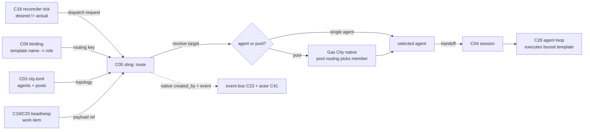

# C05 — Sling / dispatch (`sling-dispatch`)  (Spec, canonical track)

> Source: AI-CONTEXT §3.2 (concept table line 92 — "8 | Dispatch (Sling) | Routes bead/wisp to agent or pool | P2, P3"); §3.3 vocab translation (line 105 `sling → dispatch / route`, line 108 `wisp → unit of dispatchable work`, line 100 `rig → agent worker role`); README §"Principle 1" (line 109 — "Gas City formulas reference templates by name; **sling routes work to agents with specific templates**"); README §"Principle 2" (lines 116–122 — provider abstraction, `claude` provider preset); README §13.1 Phase 0 (lines 361–364 — one `[[agent]]` block, "no multi-rig pool"). Companion: faithful spec [`spec/C09-prompt-template-binding.md`](./C09-prompt-template-binding.md) (the template-name binding C05 consumes at dispatch), [`spec/C01-gas-city-substrate.md`](./C01-gas-city-substrate.md) (sling is native Gas City), [`spec/C28-claude-code-agent-loop.md`](./C28-claude-code-agent-loop.md) (the agent C05 routes work to).
> Inventory ID: C05   Kind: component   Status: sweep-2
> Maps from: A09b, A22h, A22f, A22g, B25. Depends on: C01 (Gas City substrate), C18 (reconciler / Health Patrol loop). Key gaps: — (none assigned).
> Binding decisions obeyed: **D-8** (Convoy → C05; Order → C40), **D-6** (canonical track nomenclature).

> [D-23 substrate-verified — gascity-prototype@b14c278, 2026-05-25]
> **F5 (CONFIRMS-CLAIM):** worker pool min=0; `gc sling <bead>` causes the controller to spawn a new tmux pane with a fresh `claude` process on demand; pool returns to 0 when idle (health-patrol scales it back). The dispatch mechanism is Gas City's native sling; the authored routing policy is the C05 deliverable. C05:OQ-2 (member-selection policy) remains open.
>
> **F11 (CONFIRMS-CLAIM):** `dog` is the pool-worker role (min=0, spawned on `gc sling` dispatch); `polecat`/`crew` are worker variants. All mapped to v4's generic "worker" role. C05 routes to the pool by template/role key; Gas City picks the member.
>
> **F8 (CONFIRMS-CLAIM):** agents coordinate through beads only (write/poll). The coordinator (`mayor`) calls `gc sling r1-abc` to route an open bead to the worker pool. This confirms that C05's authored routing policy executes as a coordinator-side bead-poll + `gc sling` call; the mechanism is the native Gas City sling command.

## Binding decision — D-8 (verbatim, from review-log)

> **D-8 — Convoy → C05; Order → C40.** "Convoy" (atomic multi-bead dispatch) is a Gas City sling concept referenced by C05; "Order" (durable workflow) is owned by C40. C12 references both but defines neither; C07 carries glossary entries.

— [review-log D-8](../_meta/review-log.md), Batch-2 review integration (2026-05-31)

**C05 scoping consequence.** C05 owns the **Convoy** reference (atomic multi-bead dispatch is the sling-level primitive C05 routes through). A Convoy is a Gas City sling concept — dispatching multiple beads atomically as one sling call — and is referenced by C05 as a native mechanism it adopts, not a protocol it defines. **Order** is a durable workflow construct owned entirely by C40; C05 references Order only to name it as the C40 boundary (C05 does not define, create, or manage Orders).

## 1. Purpose & responsibility

C05 is the **sling / dispatch** component: the routing mechanism that takes a unit of dispatchable work — a **bead** (a node in the typed work-graph) or a **wisp** (a unit of dispatchable work, AI-CONTEXT:108) — and **routes it to an agent or pool by template/role**. It is Gas City's native dispatch primitive (AI-CONTEXT §3.2 names it as derived mechanism #8: "Dispatch (Sling) — Routes bead/wisp to agent or pool", AI-CONTEXT:92), serving Principles P2 (runtime separation) and P3 (pipeline-as-process).

C05 owns the **routing decision**: given a work item and a target descriptor (a template name and/or an agent role, AI-CONTEXT:92 + README:109), select **which agent or pool** receives the work and **hand it off** for execution. v4 states the binding side plainly: "sling routes work to agents with **specific templates**" (README:109) — the routing key is the template/role, and the routed-to thing is an agent (a `claude`-provider `[[agent]]` block, README:361; provider preset README:120) or a **pool** (a set of interchangeable agents of a role; "multi-rig pool", README:364).

**The line between mechanism and policy (Sweep-2 precision):** The `gc sling` command is Gas City's **native dispatch mechanism** — it is a substrate primitive adopted as-is (gascity-config-anchor §4, "harvest-verified (F5, F8)"). The **authored routing policy** is the C05 deliverable: the logic that maps a `(work-item, target-descriptor)` pair to a `gc sling` invocation. The mechanism (spawning a tmux pane, selecting a pool member, applying back-pressure) is Gas City's; the policy (which key to extract, how to resolve it, what to sling to) is C05's authored code.

C05's responsibility is exactly the route+handoff seam:

- **Resolve the target.** Map the work item's template/role descriptor to a concrete agent or pool. The template-name half of that descriptor is supplied by C09's binding ("formulas reference templates by name", README:109); the role half is the rig/agent-role (AI-CONTEXT:100 `rig → agent worker role`).
- **Pass a pool target through.** When the target is a pool of interchangeable role-agents rather than a single named agent, C05 routes to the pool; Gas City's native pool routing (sling "routes bead/wisp to agent **or pool**", AI-CONTEXT:92) selects the member. C05 does not custom-build member-selection — that is native sling behaviour (a custom pool-routing/fairness engine was the optimized DELTA-03, dropped — SURVIVOR-PASS C05).
- **Hand off.** Deliver the work item to the selected agent's session (C04) so the agent loop (C28) executes against the bound template (C09).

> [FAITHFUL-FILL] v4 describes sling in exactly two places — one concept-table row (AI-CONTEXT:92) and one half-sentence (README:109) — and never enumerates its interface. The minimal faithful framing is that C05 is the **route-and-handoff seam only**: it consumes a (work item, template/role) pair and produces a (selected agent/pool, handoff). It does not own the work-graph, the template, the session, or the agent loop — those are C19/C20, C09, C04, C28 respectively, each already an inventory component. This is the smallest scope that makes "routes a bead/wisp to an agent or pool by template/role" a self-contained component without absorbing its neighbours.

**What C05 is NOT:**

- It is **not** the work-graph or the bead itself. The bead/wisp is the *payload* C05 routes; the typed work-graph is **C19** and the bead schema is **C20**. C05 reads a work item; it does not define or own bead state (AI-CONTEXT:92 "routes bead/wisp" — routes, not owns).
- It is **not** the template or the spec→execution binding. "Formulas reference templates by name" and the name→template resolution is **C09** (README:109; inventory C09 `Depends on: C05`). C05 *consumes* the template/role key C09 produces; it does not render templates or own the binding relation.
- It is **not** the formula / pipeline DAG. The formula (**C12**) is the workflow that *names which template* a step uses; C05 is invoked *by* the running workflow to route a step's work, it is not the DAG engine (README:128 "the methodology lives in the file, not in agent prompts").
- It is **not** the session / provider runtime. Standing up the agent's runtime (tmux/k8s/subprocess) and resuming it is **C04**; C05 routes *to* a session, it does not create or manage session lifecycle (AI-CONTEXT:86 Session = C04).
- It is **not** the agent loop. The multi-turn reasoning + tool dispatch that runs *after* handoff is **C28**; C05 stops at handoff (README:120 agent loop = Claude Code = C28).
- It is **not** the reconciler / Health Patrol. The per-tick desired-state convergence loop that *decides when* work should be (re)dispatched is **C18** (AI-CONTEXT:93). C05 is the *act* of dispatch the reconciler drives; it does not own the convergence loop or its gates.
- It is **not** messaging (Mail/Nudge, **C06**). C05 hands off work for execution; inter-agent coordination after dispatch is C06.
- It is **not** a durable-workflow engine. **Orders** (durable workflows surviving crashes/retries) are owned entirely by **C40** (D-8). C05 references Orders only as a boundary marker.

## 2. Context & dependencies

| Direction | Component | Relationship (v4 source) |
|---|---|---|
| Upstream (hosts) | **C01** Gas City substrate | Sling is Gas City's native derived mechanism #8 (AI-CONTEXT:92); C05 is a thin spec over Gas City's built-in dispatch, not a new engine. Hard inventory dependency (`Depends on: C01`). |
| Upstream (drives dispatch) | **C18** reconciler / Health Patrol | A "per-tick reconciler … desired-state convergence" exists (AI-CONTEXT:93; README:159). That this convergence loop is *what triggers (re)dispatch* — making C05 the dispatch action it invokes — is a `[FAITHFUL-FILL]` (see note below): v4 names the reconciler and names sling, but never states the trigger relationship between them. Hard inventory dependency (`Depends on: C18`). |
| Upstream (supplies routing key) | **C09** prompt-template binding | C09 resolves "which template/role drives this work" (README:109); C05 consumes that template/role as its routing key. Reciprocal to C09's `Depends on: C05`. See OQ-1 resolution below. |
| Upstream (names the template) | **C12** formula / pipeline file | A formula step "references templates by name" (README:109); the running formula asks sling to route that step's work. Soft — the name flows through C09. |
| Lateral (payload) | **C19 / C20** bead work-graph / schema | The bead/wisp routed is a node in the work-graph (C19) with the bead schema (C20). C05 reads work-item fields; it does not own them. |
| Downstream (routes to) | **C04** session & provider runtime | C05 hands the work item to the selected agent's session (the `[[agent]]`'s runtime). C04 owns session lifecycle; C05 selects which session/agent. Phase-0 provider-kind = tmux (F7). |
| Downstream (executes) | **C28** Claude Code agent loop | After handoff, the agent loop executes the multi-turn reasoning against the bound template. C05 is upstream of every C28 run. |
| Lateral (attribution) | **C41** identity / attribution | The dispatch decision (which work went to which agent under which template) is an attributable action; `created_by`/actor rides the handoff. Soft upstream. |
| Lateral (later coordination) | **C06** messaging (Mail/Nudge) | Post-dispatch agent coordination; out of C05's route+handoff scope. |
| Boundary (not a dep) | **C40** Durable Orders | Orders own durable workflow; C05 routes beads/wisps, not Orders (D-8). C05 references C40 as the hard boundary on its right side. |

> [FAITHFUL-FILL] **Reconciler→dispatch trigger is inferred, not stated.** v4 describes the reconciler only as "Per-tick reconciler; bounded convergence with gates" (AI-CONTEXT:93) doing "Desired-state convergence" (README:159), and describes sling only as "Routes bead/wisp to agent or pool" (AI-CONTEXT:92). It **never states what triggers sling** — the two never co-occur in a causal sentence in either source doc. The minimal faithful reading adopted here is that the desired-vs-actual convergence loop (C18) is the natural and only v4-named mechanism that would notice "work should be running but is not" and issue a dispatch, so C05's inbound trigger is modelled as reconciler-driven. This is a structural inference, not a sourced fact; an integrator could legitimately have dispatch triggered directly by a running formula (C12) step instead of (or in addition to) the reconciler. The inline AI-CONTEXT:93 citations throughout this spec back "a per-tick reconciler exists," not "the reconciler invokes dispatch."

C05 sits in the **Runtime Substrate** subsystem and is **not foundational** (inventory: Foundational? = no): it is a thin routing seam over Gas City's native dispatch, leaning on C01 (host) and C18 (the loop modelled as triggering it, per the fill above). It is a **Batch-2** component (per the inventory's suggested batches: "Session, sling, prompt-binding, … parallel"), depending on Batch-1 C01 and on C18.

## 3. Interfaces / contracts

### 3.1 Inbound

- **Dispatch-request interface (C18 reconciler / C12 formula → C05).** The trigger to route a work item. Faithful model (see the §2 `[FAITHFUL-FILL]`): the per-tick reconciler — which v4 names as doing "desired-state convergence" (AI-CONTEXT:93; README:159) — is the source that, for work that should be running but is not, issues the dispatch request. *v4 names the reconciler and names sling but does not state this trigger edge*; a running formula (C12) step is the alternative trigger an integrator could wire. The request carries the **work item** (a bead/wisp reference, AI-CONTEXT:92) and the **target descriptor** (a template name and/or agent role — the routing key, README:109 + AI-CONTEXT:100/105).
- **Routing-key interface (C09 binding → C05).** The template/role key for the work item. "Formulas reference templates by name" (README:109); C09 resolves that name to the binding, and C05 receives the resolved template-name + agent-role as the key it routes on. See OQ-1 (RESOLVED below) for the authority split.
- **Topology interface (C03 config / `city.toml` → C05).** The set of agents and pools available to route to. v4: agents are declared as `[[agent]]` blocks (README:120, 361) and pools as multi-rig sets (README:364, "no multi-rig pool" at Phase 0 ⇒ pools are a later-phase config surface). C05 reads this topology to know what targets exist.

  > [FAITHFUL-FILL] v4 names `[[agent]]` (README:120) and "multi-rig pool" (README:364) but never gives a `[[pool]]` config schema. The minimal faithful reading: the routable topology is **whatever `city.toml` declares** — at Phase 0 exactly one `[[agent]]` (README:361), so routing is trivially single-target; pools appear when later phases declare multiple role-agents. C05 reads this native config; it does not introduce a new topology store. A concrete pool-config schema is a sweep-2 / C03 concern, not invented here.

### 3.1a Routing policy — concrete signatures (Sweep-2)

The authored routing policy is the C05 deliverable. It is the logic that runs on the coordinator agent (`mayor`) side before issuing `gc sling`. The following signatures represent the policy contract; the underlying `gc sling` call is the adopted mechanism.

```
# Resolve which target to route a work item to.
# Input:  dispatch request (see §3.4 field table)
# Output: resolved target (agent name or pool name from city.toml topology)
# Errors: E-C05-01 (no route), E-C05-02 (key mismatch)
resolve_target(req: DispatchRequest, topology: CityTopology) -> Result<TargetRef, DispatchError>

# Execute the sling dispatch to the resolved target.
# Wraps `gc sling <bead_id>` (the native mechanism — gascity-config-anchor §4 "harvest-verified F5").
# Input:  work item bead_id, resolved target, routing metadata
# Output: dispatch confirmation (native event emitted by gc sling)
# Errors: E-C05-03 (dispatch reject), E-C05-02 (pool empty / no available member)
sling_to(bead_id: BeadId, target: TargetRef, meta: RoutingMeta) -> Result<DispatchConfirmation, DispatchError>

# Top-level routing policy entry point (called by reconciler tick or formula step).
# Composes resolve_target + sling_to.
dispatch(req: DispatchRequest, topology: CityTopology) -> Result<DispatchConfirmation, DispatchError>

# Convoy dispatch: atomic multi-bead sling (D-8 Convoy concept; native Gas City).
# Dispatches N beads to the same target atomically in a single sling call.
# Errors: E-C05-01, E-C05-02, E-C05-03 (same taxonomy; applied to the convoy as a unit)
dispatch_convoy(beads: List<BeadId>, target: TargetRef, meta: RoutingMeta) -> Result<DispatchConfirmation, DispatchError>
```

> [FAITHFUL-FILL] These are the minimal faithful signatures for the authored routing policy. v4 never names these function boundaries; they are inferred from "routes bead/wisp to agent or pool" (AI-CONTEXT:92) as the smallest decomposition that separates the authored-policy steps (resolve → sling) from the native mechanism (`gc sling` CLI). The `dispatch_convoy` signature captures D-8's Convoy primitive as a native pass-through, not an authored construct.

### 3.2 Outbound

- **Handoff contract (C05 → C04 session).** The selected agent/pool-member's session receives the work item bound to its template. Postcondition: exactly one agent (or one selected pool member) is handed each routed work item; the agent loop (C28) then executes against the C09-bound template (README:109 "specific templates").
- **Dispatch logging (native, not a C05 contract).** The fact "work item W was routed to agent/role A under template T at tick N" is observable, but C05 does **not** own a dispatch-record contract. Under the capability-for-principle bar, *who acted* is already carried by Gas City's native `created_by` (C41, P9) and *the action event* is already appended by the native event bus (C23, "records every action", P12) when the dispatch occurs. C05 introduces no record, store, or schema of its own; this line is descriptive of native behaviour, not an interface C05 provides. (A custom dispatch-record schema was the optimized DELTA-06, dropped as defensive audit — SURVIVOR-PASS C05.)

### 3.3 Invariants

- **INV-1 (single-handoff).** Each routed work item is handed off to **exactly one** recipient — a single named agent, or (for a pool target) the one member Gas City's native pool routing selects. "Routes a bead/wisp to an agent or pool" (AI-CONTEXT:92) — routing yields a single recipient, not a fan-out broadcast. (Fan-out across multiple work items is the formula/convoy's job — `convoy → batched workflow`, AI-CONTEXT:104 — not a single sling call.)
- **INV-2 (key-faithful routing).** The recipient matches the routing key: an item keyed for template/role T-R is routed only to an agent that serves T-R. "Sling routes work to agents with *specific* templates" (README:109) — a template/role mismatch is a routing error, not a best-effort placement.
- **INV-3 (resolvable target).** A dispatch request whose target descriptor resolves to **zero** routable agents/pool-members is a dispatch error, not a silent drop; the work item is not lost. (Minimal consistent reading of "routes … to an agent or pool" — if no target exists, routing has failed and must surface, so the reconciler C18 can re-converge.)
- **INV-4 (no payload mutation).** C05 routes the bead/wisp; it does not mutate the work item's typed fields (those belong to C19/C20). C05 contributes **no state of its own** to the work item — the dispatch is observable via native `created_by` (C41) and the native event bus (C23), not via a C05-owned record (see §3.2).
- **INV-5 (no C05 queue).** C05 holds no internal dispatch queue or buffer of its own. Back-pressure is the native Gas City sling mechanism's concern (OQ-3 RESOLVED below) and/or the reconciler retry loop (C18). An explicit C05 queue is out of faithful scope (v4 names none; SURVIVOR-PASS C05 DELTA-02).
- **INV-6 (D-30 pre-dispatch gate).** C05 is the **pre-tool-call boundary** for dispatch decisions: it is the point at which the routing policy executes before any agent session is handed a bead.

  > **D-30 (ADOPTED — operator, 2026-06-01):**
  > "unattended operation (P2) and self-modification (P3b) require the substrate to BLOCK (prevent at the
  > tool-call/process boundary) — not merely detect — out-of-boundary access on the relevant blast-radius
  > face."
  > — review-log.md D-30, 2026-06-01

  For P2 (unattended) and P3b (self-modification) dispatches, C05 MUST NOT hand off to an agent session unless the partition-prevent gate is satisfied (once D-23 spike confirms native prevent or the watcher is in place). Until the spike result is known, C05's dispatch path to P2/P3b agents is human-in-the-loop (detection-only floor; `prevent-vs-detect-OPEN` per gascity-conformance-check Test A). C05 does NOT design the enforcement watcher — that is deferred.

> [FAITHFUL-FILL] INV-1…INV-6 are not stated verbatim in v4 (which gives sling one row + one half-sentence). They are the minimal invariants that make "routes a bead/wisp to an agent or pool by template/role" well-defined: a single recipient (INV-1), keyed correctly (INV-2), that actually exists or fails loudly (INV-3), without corrupting the payload it merely carries (INV-4), with no authored queue (INV-5). Each is the smallest constraint needed for the one-line responsibility to be implementable; none adds scope v4 withholds.

### 3.4 Dispatch-request field table (Sweep-2)

The `DispatchRequest` is the canonical input to the C05 routing policy. Every field below is what C05's authored code reads; the mechanism (`gc sling`) consumes only the `bead_id` and `target_role`.

| Field | Type | Req | Semantics | R/W-by |
|---|---|---|---|---|
| `bead_id` | `bead_id` | R | ID of the bead/wisp to dispatch; referenced by `gc sling <bead_id>` (F5) | C18/C12 writes on request; C05 reads, passes to `gc sling` |
| `target_role` | `string` | R | Agent-role to route to (e.g. `dog`, `polecat`; v4 generic: `worker`); resolved from C09 binding | C09 writes (resolved role); C05 reads for `resolve_target` |
| `template_name` | `string` | R | Template name from the formula node (e.g. `agents/worker/prompt.template.md`); used by C05 to validate role↔template alignment (INV-2) | C09 writes (resolved name); C05 reads |
| `routing_key` | `string` | O | Composite `<template_name>/<target_role>` key; pre-computed by C09 binding for fast topology lookup | C09 writes (optional precomputed); C05 reads or computes |
| `convoy_beads` | `list<bead_id>` | O | Non-empty iff this is a Convoy dispatch (D-8); all beads go to the same target atomically via `gc sling` | C12/C18 writes for convoy; C05 reads, passes all bead_ids in one sling call |
| `created_by` | `string` | R | Dispatcher actor wire value in `"kind:id"` colon-delimited format (D-29 — wire type = string; `ActorRef` is the in-memory parsed form, C41); e.g. `"rig:mayor-1"` | C18/C12 writes; C05 passes to native event attribution |
| `rig_name` | `string` | O (Phase-0) / R (Phase-2) | Target rig name for multi-rig cities (D-31 — MUST NOT assume one-rig-per-city); Phase-0 = omit (single agent; README:361); Phase-2 = required so `resolve_target` can scope to the correct rig's pool | C18/C12 writes when rig-targeted dispatch; C05 reads for topology lookup |
| `tick_id` | `string` | O | Reconciler tick identifier (for idempotence checking / double-dispatch guard with C18) | C18 writes; C05 reads for dedup guard |

> [FAITHFUL-FILL] This field set is the minimal faithful elaboration of "a bead/wisp + target descriptor" (AI-CONTEXT:92 + README:109). v4 never names these fields; they are the smallest set that makes the routing policy concrete: `bead_id` is what gets slung, `target_role`+`template_name` are the routing key, `convoy_beads` captures D-8's Convoy primitive, `created_by` is the universal attribution requirement (P9/C41) in `"kind:id"` wire format (D-29), `rig_name` is the D-31 multi-rig routing field (MUST NOT assume one-rig-per-city — D-31 ADOPTED 2026-06-01), and `tick_id` is the dedup anchor the reconciler (C18) needs for double-dispatch safety.

## 4. Data model / state

C05 is a **routing seam**, not a data store. It owns no durable state of its own; its "state" is the transient routing decision plus the additive dispatch record.

| Aspect | Faithful spec (v4 source) |
|---|---|
| Owned artifact | None of its own. The bead/wisp is C19/C20's; the template/role key is C09's; the agent/pool topology is C03/`city.toml`'s; the session is C04's. |
| Routing input | DispatchRequest (§3.4 field table) per dispatch request (AI-CONTEXT:92; README:109). |
| Routable topology | The `[[agent]]` blocks and pools declared in `city.toml` (README:120, 361, 364). Read-only to C05; owned by C03. At Phase 0: exactly one agent (README:361). The `dog` pool (min=0) is the Phase-0 worker pool (F11). |
| Dispatch trace | Not C05-owned. "W → agent/role A under template T at tick N" is observable through native `created_by` (C41) + the native event-bus append (C23) that fire on the dispatch; C05 declares no record schema (the optimized dispatch-record schema was dropped — SURVIVOR-PASS C05 DELTA-06). |
| Persistence | None owned. Durability of "what was dispatched where" rides the native event bus (C23) + work-graph (C19) + `created_by` (C41). |
| Consistency | The reconciler tick (C18) is the consistency point for *when* desired ≠ actual triggers dispatch; `city.toml` revision is the consistency boundary for *what* targets exist. |

> [FAITHFUL-FILL] v4 specifies no "dispatch table" or routing-state structure for sling. The minimal faithful reading is that C05 holds **no durable routing state**: each dispatch is a pure decision over (request, current `city.toml` topology), and the only persisted trace is the additive dispatch record on the bead. A standalone dispatch store/queue would be an architectural addition v4 does not name (work queueing is implicit in the reconciler's desired-vs-actual loop, C18).

## 5. Behavior

The core flow is **trigger → resolve target → select → handoff**:



Key flow notes:
- **Trigger.** The per-tick reconciler (C18, AI-CONTEXT:93) finds work that *should* be running and is not, and issues a dispatch request to sling.
- **Resolve target.** C05 takes the routing key (template-name + agent-role, from C09 / README:109) and resolves it against the `city.toml` topology (C03) to the target agent or pool.
- **Select.** If the target is a single named agent (Phase 0, one `[[agent]]`, README:361), selection is trivial. If the target is a pool of interchangeable role-agents (README:364), Gas City's native pool routing selects the member; C05 routes to the pool.

  > [FAITHFUL-FILL] v4 names "pool" / "multi-rig pool" (AI-CONTEXT:92; README:364) but specifies no member-selection policy (round-robin, least-loaded, etc.) — and under the capability-for-principle bar, member selection is **Gas City's native sling behaviour**, not C05 custom code (the optimized "pool routing + fairness + anti-starvation" delta was dropped, SURVIVOR-PASS C05 DELTA-03). The minimal faithful elaboration: C05 hands sling a pool target and exactly one recipient results (INV-1); Phase 0 has no pool at all (single agent), so this path is latent. Whatever selection policy Gas City applies is observed, not specified here.
- **Handoff.** The work item, bound to its template (C09), is handed to the selected agent's session (C04); the agent loop (C28) executes.
- **Record (native, passive).** The dispatch (which work → which agent/role under which template) is observable through the native event-bus append (C23) and `created_by` (C41) that fire on it — C05 writes no record of its own.
- **Re-dispatch / loop closure.** If a dispatched agent crashes or stalls, the reconciler (C18) sees desired ≠ actual on the next tick and re-issues dispatch — C05 is invoked again; idempotent re-dispatch is the reconciler's convergence property, with C05 as its hands.

### 5.1 Dispatch sequence diagram (Sweep-2)

```mermaid
sequenceDiagram
    participant C18 as C18 reconciler
    participant C05 as C05 routing policy
    participant C09 as C09 template binding
    participant C03 as C03 city.toml topology
    participant GC as gc sling (mechanism)
    participant C04 as C04 session / worker

    C18->>C05: dispatch(DispatchRequest{bead_id, target_role, template_name, created_by})
    C05->>C09: resolve routing key (template_name → role binding)
    C09-->>C05: RoutingKey{template_name, agent_role}
    C05->>C03: lookup topology(agent_role)
    C03-->>C05: TargetRef (single agent or pool)
    alt target is single agent
        C05->>GC: gc sling <bead_id> --agent <agent_name>
    else target is pool
        C05->>GC: gc sling <bead_id> --pool <pool_name>
        Note over GC: native pool routing selects member (OQ-2 [needs G11 verification])
    end
    GC-->>C04: spawn tmux pane / wake worker (F5: pool 0→1)
    GC-->>C05: DispatchConfirmation (native event emitted)
    Note over C05: no C05-owned record; C41 created_by + C23 event bus carry attribution
    C04->>C04: agent loop (C28) executes bound template
```

## 6. Failure modes & handling

| F-mode | Applies to C05 how | v4 handling (faithful) |
|---|---|---|
| **F22** Zombie agents | A dispatched agent goes silent/stalls; the work item is "in flight" but the agent is dead — a routing dead-end if nothing re-dispatches. | v4 handling is **upstream/lateral**: anomaly detection on session liveness (PyOD on telemetry) + the reconciler (C18) re-converging desired-vs-actual, which (per the §2 `[FAITHFUL-FILL]` — v4 implies but does not state the reconciler→dispatch edge) re-invokes C05 to re-dispatch. **Addressed** (F-MODE F22) at the loop level, not C05-native — C05's contribution is being re-invokable (INV-3: a target must resolve, or fail loudly so C18 can act). |
| **F40** Last-mile drift | Work stalls between dispatch and completion (shipping rate decays). | Healer/loop-level concern (C36–C39 monitor shipping vs. start rate; C18 re-converges) — F-MODE F40, **Partial**. **Not C05-native**: C05 has no F40 role beyond being re-invokable (INV-3 fail-loud so the loop can re-converge); whether the reconciler re-invokes C05 is itself the §2 `[FAITHFUL-FILL]` inference. |
| **No-route** (E-C05-01) | The routing key resolves to zero routable agents/pool-members (e.g., a role with no declared `[[agent]]`). | INV-3: a no-route dispatch is a **loud dispatch error** (E-C05-01), not a silent drop; the work item stays in the work-graph as un-dispatched so the reconciler (C18) can surface/retry. The bead is not lost. |
| **Pool-empty** (E-C05-02) | A pool exists but all members are busy/unavailable, OR the routing key does not match any agent's template/role (key-mismatch variant of the same error). | INV-2+INV-3: mismatch → routing error E-C05-02; pool-empty → treat as no-available-member for this tick (INV-3) so the reconciler retries next tick (C18). C05 holds no queue (INV-5). Gas City native back-pressure may apply (OQ-3, needs-G11). |
| **Dispatch-reject** (E-C05-03) | The `gc sling` call itself is rejected by the substrate (e.g., malformed bead_id, substrate error). | E-C05-03: surface the substrate error as a dispatch error; work item stays un-dispatched (INV-3). Not a C05-policy error — the routing was valid but the mechanism rejected the call. |
| **Double-dispatch** (interface-local) | The reconciler re-issues a dispatch for work already in flight. | INV-1 single-handoff at the routing level; idempotence across ticks is the reconciler's convergence property (C18) — C05 routes once per request, and C18 is responsible for not duplicating a still-live assignment. The `tick_id` field (§3.4) is the dedup anchor. |

> [FAITHFUL-FILL] "No-route", "pool-empty", and "dispatch-reject" are interface-local error conditions not enumerated in F-MODE-COVERAGE (which catalogs system-level F-modes). They are the minimal error taxonomy implied by INV-1…INV-3: routing must hit exactly one correctly-keyed, existing target, or fail loudly so the reconciler (C18) can re-converge — never silently drop or mis-place a work item. v4's only stated guard for dispatch-level failure is the reconciler loop (AI-CONTEXT:93), which presumes C05 fails visibly; fail-loud is therefore the smallest consistent choice.

### 6.1 Error taxonomy (Sweep-2)

| E-code | Condition | Surfaced-as | Caller recovery |
|---|---|---|---|
| **E-C05-01** | No-route: `target_role`/`template_name` resolves to zero routable agents or pools in the current `city.toml` topology | Loud dispatch error returned from `resolve_target`; bead left un-dispatched in the work-graph (C19) | C18 reconciler retries on the next tick; if persistent, C38/C39 anomaly path escalates |
| **E-C05-02** | Pool-empty: target pool exists but has no available member at this tick; OR key-mismatch: no agent serves the requested template/role combination (INV-2 violation) | Loud dispatch error returned from `resolve_target`; bead left un-dispatched | C18 retries next tick; pool-empty is transient (min=0 pool spawns on demand per F5); persistent mismatch is a config error requiring `city.toml` correction |
| **E-C05-03** | Dispatch-reject: the native `gc sling` call is rejected by the Gas City substrate (malformed bead_id, substrate fault, etc.) | Substrate error wrapped and returned from `sling_to`; bead remains un-dispatched | Caller (C18/C12) logs the rejection; C18 retries or escalates to anomaly detection; substrate fault requires ops investigation |

## 7. Cross-cutting (security / cost / scale / observability / ops)

- **Security.** C05's routing decision is attributable (which work went to which agent under which template, riding C41 identity). The routable topology comes from version-controlled `city.toml` (C03), so "who can receive work" is a reviewed, committed surface, not runtime-mutable by the agent. Rig/role partitioning (C42) bounds what a routed-to agent may then touch — C05 routes *to* the partition; it does not define the partition.
- **Cost / scale.** A routing decision is negligible compute. The scale concern is *dispatch throughput* and *pool sizing* (how many role-agents, README:364 "multi-rig pool") plus the Max rate-limit ceiling on the routed-to agents (G34, owned by C28/C29), not C05's own cost. Back-pressure when no member is free is **not** a C05 concern: Gas City's native dispatch may itself impose back-pressure (the optimized "admission-controlled back-pressure" delta was dropped as Gas-City-native — SURVIVOR-PASS C05 DELTA-02), and at the convergence layer the reconciler's tick loop (C18) re-attempts an undispatched item next tick. C05 adds **no internal queue** under either reading (INV-5). Pool min=0 cost-discipline verified (F5).
- **Observability.** "What was routed where, when, under which template" is observable through the **native** event bus (C23, monotonic seq, "records every action") + `created_by` (C41) + the work-graph (C19) — C05 adds no telemetry of its own (a custom dispatch-record was dropped, SURVIVOR-PASS C05 DELTA-06). The downstream run is then observable in the trajectory store (CXDB, C21) via the agent loop.
- **Ops.** Adding/removing an agent or resizing a pool is a `city.toml` (C03) edit + git commit; C05 picks up the new topology on the next dispatch. No separate deploy step for a routing-topology change beyond committing the config. Turning on pools is a later-phase config gate (README:364 "no multi-rig pool" at Phase 0; pools = section presence in `city.toml`, the C03 feature-flag convention). Pool prefix must be explicit (`prefix = "r1"` etc.) to avoid collision (F10; gascity-config-anchor §3).

## 8. Acceptance criteria & test strategy

Sweep-1 acceptance (preserved):
1. **AC-C05-01 (single-target route).** Given a dispatch request with a template/role key and a `city.toml` declaring one matching `[[agent]]`, C05 hands the work item to exactly that agent's session (Phase-0 path; INV-1, README:361).
2. **AC-C05-02 (key-faithful).** A work item keyed for template/role T-R is routed only to an agent serving T-R; an item keyed for a role no agent serves is **not** placed on a mismatched agent (INV-2). Verifies: E-C05-02 is raised on mismatch.
3. **AC-C05-03 (pool selection).** Given a target pool of N interchangeable role-agents, C05 selects exactly one available member and hands off to it (INV-1; selection-policy detail is Gas City's, not C05's — OQ-2 [needs G11 verification]).
4. **AC-C05-04 (no-route is loud, E-C05-01).** A routing key resolving to zero routable targets yields E-C05-01 and leaves the work item un-dispatched in the work-graph (never silently dropped), so the reconciler can retry (INV-3). Cross-refs: E-C05-01.
5. **AC-C05-05 (no payload mutation).** After routing, the bead/wisp's typed fields are unchanged except for the additive dispatch record (INV-4).
6. **AC-C05-06 (re-dispatch under reconciler).** When a dispatched agent is unavailable on a later tick, the reconciler (C18) re-invokes C05 and the work item is re-routed (zombie-agent recovery path; INV-3 + F22).
7. **AC-C05-07 (attributable dispatch, native).** Each routing decision is observable as "W → agent/role A under template T" via the **native** `created_by` (C41) + event-bus append (C23) that fire on the dispatch — verified to be present, *not* produced by a C05-owned record (INV-4, §3.2).

### 8.1 Concrete acceptance tests (Sweep-2)

| AC-code | Given / When / Then | Verifies |
|---|---|---|
| **AC-C05-01** | Given: one `[[agent]]` with role `dog`, template `agents/worker/prompt.template.md` in `city.toml`. When: `dispatch(DispatchRequest{bead_id=r1-abc, target_role="dog", template_name="agents/worker/prompt.template.md", created_by="rig:mayor-1"})`. Then: exactly one `gc sling r1-abc` call is issued; C04 session receives handoff; worker pane spawns (F5 min=0 scale 0→1). | INV-1, INV-2, F5; AC-C05-01 |
| **AC-C05-02** | Given: `city.toml` with role `dog`; request specifies `target_role="refinery"`. When: `dispatch(req)`. Then: `resolve_target` returns E-C05-02; no `gc sling` call issued; bead stays un-dispatched in C19. | INV-2, E-C05-02; AC-C05-02 |
| **AC-C05-03** | Given: pool of 3 `dog` agents in `city.toml`. When: `dispatch(req{target_role="dog"})`. Then: exactly one pool member receives the dispatch (Gas City picks); no custom selection code in C05; INV-1 satisfied. | INV-1; pool path; OQ-2 substrate behavior [needs G11 verification] |
| **AC-C05-04** | Given: `city.toml` with no agent for `target_role="polecat"`. When: `dispatch(req{target_role="polecat"})`. Then: `resolve_target` returns E-C05-01; bead remains open in C19 work-graph; C18 reconciler sees desired≠actual on next tick and retries. | INV-3, E-C05-01; AC-C05-04 |
| **AC-C05-05** | Given: bead r1-abc with typed fields {status:"open", created_by:"rig:mayor-1"}. When: `dispatch(req)` succeeds. Then: bead fields after routing = unchanged except native dispatch event appended by C23; no C05-authored record field added. | INV-4; AC-C05-05 |
| **AC-C05-06** | Given: bead dispatched to agent; agent pane dies. When: C18 next tick detects desired≠actual; re-invokes `dispatch(req)`. Then: C05 issues a new `gc sling` call; new worker pane spawns; bead is re-dispatched. | INV-3, F22 recovery; AC-C05-06 |
| **AC-C05-07** | Given: successful dispatch. When: inspect C23 event bus. Then: event present with `created_by` = coordinator actor in `"kind:id"` wire format (D-29); no separate C05 dispatch record schema in C19 or C23. | INV-4, D-29; AC-C05-07 |
| **AC-C05-08 (E-C05-03)** | Given: `gc sling` is invoked with a malformed bead_id. When: Gas City substrate rejects the call. Then: `sling_to` returns E-C05-03; bead remains un-dispatched; error propagated to C18 for ops escalation. | E-C05-03; dispatch-reject path |
| **AC-C05-09 (Convoy, D-8)** | Given: 3 beads {r1-a, r1-b, r1-c} for the same pool target. When: `dispatch_convoy(beads=[r1-a,r1-b,r1-c], target=pool)`. Then: a single atomic `gc sling` call is issued for all 3; either all succeed or none (atomic); each bead ends up at the same pool member. | D-8 Convoy; INV-1 per bead |

Test strategy: a Phase-0 fixture with one `[[agent]]` and one work item (AC-C05-01, AC-C05-05, AC-C05-07); key-mismatch negative (AC-C05-02); no-route negative (AC-C05-04); pool fixture with N members for single-member selection and pool-empty negative (AC-C05-03, E-C05-02); reconciler-driven re-dispatch fixture simulating a dead pane across two ticks (AC-C05-06); substrate-error injection for E-C05-03 (AC-C05-08); convoy fixture for D-8 (AC-C05-09).

## 9. Open questions

- **OQ-1 (RESOLVED Sweep-2).** *Routing-key authority: C05 vs. C09 vs. C12.*

  RESOLVED (Sweep-2): The authority split is settled by the faithful reading of README:109 + C09's inventory dependency on C05:

  - **C12** names the template (the formula step references a template name by string — C12's authoring domain).
  - **C09** owns **resolution**: it turns the formula's template name into a `(template_name, agent_role)` binding. C09 is the component that knows how `agents/<name>/prompt.template.md` maps to which role. This is C09's `Depends on: C05` — C09 produces the key C05 consumes.
  - **C05** owns **routing**: it takes the resolved `(template_name, agent_role)` pair from C09 and issues `gc sling`. C05 never sees raw formula template-name strings; it receives already-resolved keys.

  **C09 seam:** C09 is the authority for name→template/role resolution. C05's inbound is always a resolved key (`target_role` + `template_name` in the DispatchRequest §3.4), never a raw formula template-name string. If an integrator folds resolution into C05, C05's inbound `target_role` changes from "resolved role" to "raw formula template-name" and C05 absorbs C09's resolution step — the C09 dependency becomes internal. The canonical track keeps resolution in C09 (the binding component) and routing in C05 (the dispatch component). This is the **C09:OQ-1 seam** — both OQs are now jointly resolved.

- **OQ-2 (RESOLVED Sweep-2 — confirmed substrate-owned, marked needs-G11).** *Pool member-selection policy is Gas City's, not C05's.*

  RESOLVED (Sweep-2): Pool member-selection (round-robin, least-loaded, sticky-by-bead, etc.) is **Gas City's native sling behavior**, not a C05-authored policy. This is confirmed by F5 (worker pool min=0, spawns on `gc sling` — the controller picks the pane/member natively) and F11 (`dog` pool behavior is substrate-managed). C05 routes to the pool target; the substrate selects the member. C05 builds no selection engine (SURVIVOR-PASS C05 DELTA-03 dropped as native).

  The concrete selection algorithm (what `gc sling` applies when multiple pool members are available) is **[needs G11 verification]** against a pinned `gc` install — the prototype only confirmed min=0 and on-demand spawn with a single member. OQ-2 is resolved in ownership (Gas City's) but the exact algorithm remains needs-G11.

- **OQ-3 (RESOLVED Sweep-2 — no C05 queue confirmed, back-pressure is substrate-owned, marked needs-G11).** *Back-pressure: Gas City native dispatch vs. reconciler C18 tick — never a C05 queue.*

  RESOLVED (Sweep-2): C05 holds **no internal queue or buffer** (INV-5). This is confirmed by the dropped DELTA-02 (optimized admission-control as Gas-City-native), by F5 (sling scales min=0→1 on demand; back-pressure if pool is fully busy is the substrate's concern), and by the reconciler loop (C18) re-attempting an undispatched item on the next tick. C05's authored policy surfaces E-C05-02 (pool-empty) and leaves the bead un-dispatched; the mechanism's back-pressure behavior is **[needs G11 verification]** (does Gas City queue internally, block, or return an error?). Either way C05 holds no queue.

---

**[D-23 substrate-verified — gascity-prototype@b14c278, 2026-05-25]**

**F5 — Worker pool min=0; scales on demand for cost discipline (CONFIRMS-CLAIM):**
Verified against the Gas City prototype (lago-morph/gascity-prototype@b14c278, 2026-05-25):
worker pools operate with `min=0` — no worker claude processes run at idle. When the coordinator
dispatches a task via `gc sling`, the controller spawns a new tmux pane with a fresh `claude`
process on demand. This is the literal cost-discipline mechanism: pool scales 0→1 on dispatch,
returns to 0 when idle (health-patrol scales it back). C05:OQ-2 (member-selection policy) remains
open; the verified fact is only that min=0 and on-demand spawn is the observed behaviour.

**F11 — Gastown pack roles ↔ v4 generic role mappings (CONFIRMS-CLAIM):**
Verified against the Gas City prototype (lago-morph/gascity-prototype@b14c278, 2026-05-25):
the bundled `gastown` pack instantiates v4's generic agent-role vocabulary with these concrete
names: `mayor` = coordinator; `deacon` = health-patrol; `boot` = bootstrap agent; `witness` =
per-rig observer; `refinery` = per-rig reviewer (spawned on demand); `polecat` / `crew` = worker
variants; `dog` = pool worker (min=0, spawned on dispatch). All six city-scope named agents were
verified running as real `claude` processes in distinct tmux panes under the controller (2026-05-25
stand-up). Pool sizing confirmed: `dog` pool starts at min=0 and spawns on `gc sling` dispatch.
