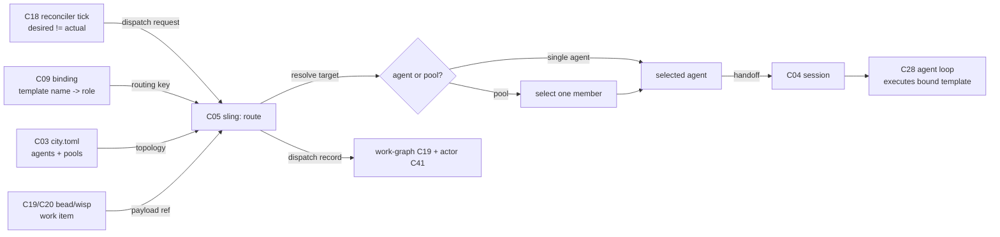

# C05 — Sling / dispatch (`sling-dispatch`)  (Spec, Track A)

> Source: AI-CONTEXT §3.2 (concept table line 92 — "8 | Dispatch (Sling) | Routes bead/wisp to agent or pool | P2, P3"); §3.3 vocab translation (line 105 `sling → dispatch / route`, line 108 `wisp → unit of dispatchable work`, line 102 `rig → agent worker role`); README §"Principle 1" (line 109 — "Gas City formulas reference templates by name; **sling routes work to agents with specific templates**"); README §"Principle 2" (lines 116–120 — provider abstraction, `claude` provider preset, `[[agent]]` blocks); README §13.1 Phase 0 (lines 361–364 — one `[[agent]]`, "no multi-rig pool"). Companion: faithful spec [`spec/C09-prompt-template-binding.md`](./C09-prompt-template-binding.md) (the template-name binding C05 consumes at dispatch), [`spec/C01-gas-city-substrate.md`](./C01-gas-city-substrate.md) (sling is native Gas City), [`spec/C28-claude-code-agent-loop.md`](./C28-claude-code-agent-loop.md) (the agent C05 routes work to).
> Inventory ID: C05   Kind: component   Status: sweep-1
> Maps from: A09b, A22h, A22f, A22g, B25. Depends on: C01 (Gas City substrate), C18 (reconciler / Health Patrol loop). Key gaps: — (none assigned).

## 1. Purpose & responsibility

C05 is the **sling / dispatch** component: the routing mechanism that takes a unit of dispatchable work — a **bead** (a node in the typed work-graph) or a **wisp** (a unit of dispatchable work, AI-CONTEXT:108) — and **routes it to an agent or pool by template/role**. It is Gas City's native dispatch primitive (AI-CONTEXT §3.2 names it as derived mechanism #8: "Dispatch (Sling) — Routes bead/wisp to agent or pool", AI-CONTEXT:92), serving Principles P2 (runtime separation) and P3 (pipeline-as-process).

C05 owns the **routing decision**: given a work item and a target descriptor (a template name and/or an agent role, AI-CONTEXT:92 + README:109), select **which agent or pool** receives the work and **hand it off** for execution. v4 states the binding side plainly: "sling routes work to agents with **specific templates**" (README:109) — the routing key is the template/role, and the routed-to thing is an agent (a `claude`-provider `[[agent]]`, README:120) or a **pool** (a set of interchangeable agents of a role; "multi-rig pool", README:364).

C05's responsibility is exactly the route+handoff seam:

- **Resolve the target.** Map the work item's template/role descriptor to a concrete agent or pool. The template-name half of that descriptor is supplied by C09's binding ("formulas reference templates by name", README:109); the role half is the rig/agent-role (AI-CONTEXT:102 `rig → agent worker role`).
- **Select within a pool.** When the target is a pool of interchangeable role-agents rather than a single named agent, pick a member to receive the work.
- **Hand off.** Deliver the work item to the selected agent's session (C04) so the agent loop (C28) executes against the bound template (C09).

> [FAITHFUL-FILL] v4 describes sling in exactly two places — one concept-table row (AI-CONTEXT:92) and one half-sentence (README:109) — and never enumerates its interface. The minimal faithful framing is that C05 is the **route-and-handoff seam only**: it consumes a (work item, template/role) pair and produces a (selected agent/pool, handoff). It does not own the work-graph, the template, the session, or the agent loop — those are C19/C20, C09, C04, C28 respectively, each already an inventory component. This is the smallest scope that makes "routes a bead/wisp to an agent or pool by template/role" a self-contained component without absorbing its neighbours.

**What C05 is NOT:**

- It is **not** the work-graph or the bead itself. The bead/wisp is the *payload* C05 routes; the typed work-graph is **C19** and the bead schema is **C20**. C05 reads a work item; it does not define or own bead state (AI-CONTEXT:92 "routes bead/wisp" — routes, not owns).
- It is **not** the template or the spec→execution binding. "Formulas reference templates by name" and the name→template resolution is **C09** (README:109; inventory C09 `Depends on: C05`). C05 *consumes* the template/role key C09 produces; it does not render templates or own the binding relation.
- It is **not** the formula / pipeline DAG. The formula (**C12**) is the workflow that *names which template* a step uses; C05 is invoked *by* the running workflow to route a step's work, it is not the DAG engine (README:128 "the methodology lives in the file, not in agent prompts").
- It is **not** the session / provider runtime. Standing up the agent's runtime (tmux/k8s/subprocess) and resuming it is **C04**; C05 routes *to* a session, it does not create or manage session lifecycle (AI-CONTEXT:86 Session = C04).
- It is **not** the agent loop. The multi-turn reasoning + tool dispatch that runs *after* handoff is **C28**; C05 stops at handoff (README:120 agent loop = Claude Code = C28).
- It is **not** the reconciler / Health Patrol. The per-tick desired-state convergence loop that *decides when* work should be (re)dispatched is **C18** (AI-CONTEXT:93). C05 is the *act* of dispatch the reconciler drives; it does not own the convergence loop or its gates.
- It is **not** messaging (Mail/Nudge, **C06**). C05 hands off work for execution; inter-agent coordination after dispatch is C06.

## 2. Context & dependencies

| Direction | Component | Relationship (v4 source) |
|---|---|---|
| Upstream (hosts) | **C01** Gas City substrate | Sling is Gas City's native derived mechanism #8 (AI-CONTEXT:92); C05 is a thin spec over Gas City's built-in dispatch, not a new engine. Hard inventory dependency (`Depends on: C01`). |
| Upstream (drives dispatch) | **C18** reconciler / Health Patrol | "Per-tick reconciler" (AI-CONTEXT:93) decides desired-vs-actual state and triggers (re)dispatch; C05 is the dispatch action it invokes. Hard inventory dependency (`Depends on: C18`). |
| Upstream (supplies routing key) | **C09** prompt-template binding | C09 resolves "which template/role drives this work" (README:109); C05 consumes that template/role as its routing key. Reciprocal to C09's `Depends on: C05`. |
| Upstream (names the template) | **C12** formula / pipeline file | A formula step "references templates by name" (README:109); the running formula asks sling to route that step's work. Soft — the name flows through C09. |
| Lateral (payload) | **C19 / C20** bead work-graph / schema | The bead/wisp routed is a node in the work-graph (C19) with the bead schema (C20). C05 reads work-item fields; it does not own them. |
| Downstream (routes to) | **C04** session & provider runtime | C05 hands the work item to the selected agent's session (the `[[agent]]`'s runtime). C04 owns session lifecycle; C05 selects which session/agent. |
| Downstream (executes) | **C28** Claude Code agent loop | After handoff, the agent loop executes the multi-turn reasoning against the bound template. C05 is upstream of every C28 run. |
| Lateral (attribution) | **C41** identity / attribution | The dispatch decision (which work went to which agent under which template) is an attributable action; `created_by`/actor rides the handoff. Soft upstream. |
| Lateral (later coordination) | **C06** messaging (Mail/Nudge) | Post-dispatch agent coordination; out of C05's route+handoff scope. |

C05 sits in the **Runtime Substrate** subsystem and is **not foundational** (inventory: Foundational? = no): it is a thin routing seam over Gas City's native dispatch, leaning on C01 (host) and C18 (the loop that triggers it). It is a **Batch-2** component (per the inventory's suggested batches: "Session, sling, prompt-binding, … parallel"), depending on Batch-1 C01 and on C18.

## 3. Interfaces / contracts

Sweep-1: interfaces **named + described**. Concrete signatures, the work-item/target schemas, and the pool-selection policy are deferred to sweep 2.

### 3.1 Inbound

- **Dispatch-request interface (C18 reconciler / C12 formula → C05).** The trigger to route a work item. v4: the per-tick reconciler (AI-CONTEXT:93) reconciles desired vs. actual and, for work that should be running but is not, invokes dispatch. The request carries the **work item** (a bead/wisp reference, AI-CONTEXT:92) and the **target descriptor** (a template name and/or agent role — the routing key, README:109 + AI-CONTEXT:102/105).
- **Routing-key interface (C09 binding → C05).** The template/role key for the work item. "Formulas reference templates by name" (README:109); C09 resolves that name to the binding, and C05 receives the resolved template-name + agent-role as the key it routes on.
- **Topology interface (C03 config / `city.toml` → C05).** The set of agents and pools available to route to. v4: agents are declared as `[[agent]]` blocks (README:120, 361) and pools as multi-rig sets (README:364, "no multi-rig pool" at Phase 0 ⇒ pools are a later-phase config surface). C05 reads this topology to know what targets exist.

  > [FAITHFUL-FILL] v4 names `[[agent]]` (README:120) and "multi-rig pool" (README:364) but never gives a `[[pool]]` config schema. The minimal faithful reading: the routable topology is **whatever `city.toml` declares** — at Phase 0 exactly one `[[agent]]` (README:361), so routing is trivially single-target; pools appear when later phases declare multiple role-agents. C05 reads this native config; it does not introduce a new topology store. A concrete pool-config schema is a sweep-2 / C03 concern, not invented here.

### 3.2 Outbound

- **Handoff contract (C05 → C04 session).** The selected agent/pool-member's session receives the work item bound to its template. Postcondition: exactly one agent (or one selected pool member) is handed each routed work item; the agent loop (C28) then executes against the C09-bound template (README:109 "specific templates").
- **Dispatch-record contract (C05 → work-graph / attribution).** The fact "work item W was routed to agent/role A under template T at tick N" is an attributable record. Faithful: this rides the existing bead/work-graph state (C19) + actor identity (C41); C05 introduces no new store.

### 3.3 Invariants

- **INV-1 (single-handoff).** Each routed work item is handed off to **exactly one** agent (or exactly one selected member of a target pool). "Routes a bead/wisp to an agent or pool" (AI-CONTEXT:92) — routing yields a single recipient, not a fan-out broadcast. (Fan-out across multiple work items is the formula/convoy's job — `convoy → batched workflow`, AI-CONTEXT:104 — not a single sling call.)
- **INV-2 (key-faithful routing).** The recipient matches the routing key: an item keyed for template/role T-R is routed only to an agent that serves T-R. "Sling routes work to agents with *specific* templates" (README:109) — a template/role mismatch is a routing error, not a best-effort placement.
- **INV-3 (resolvable target).** A dispatch request whose target descriptor resolves to **zero** routable agents/pool-members is a dispatch error, not a silent drop; the work item is not lost. (Minimal consistent reading of "routes … to an agent or pool" — if no target exists, routing has failed and must surface, so the reconciler C18 can re-converge.)
- **INV-4 (no payload mutation).** C05 routes the bead/wisp; it does not mutate the work item's typed fields (those belong to C19/C20). The only state C05 contributes is the dispatch record (which actor/agent/template/tick), which is additive.

> [FAITHFUL-FILL] INV-1…INV-4 are not stated verbatim in v4 (which gives sling one row + one half-sentence). They are the minimal invariants that make "routes a bead/wisp to an agent or pool by template/role" well-defined: a single recipient (INV-1), keyed correctly (INV-2), that actually exists or fails loudly (INV-3), without corrupting the payload it merely carries (INV-4). Each is the smallest constraint needed for the one-line responsibility to be implementable; none adds scope v4 withholds.

## 4. Data model / state

C05 is a **routing seam**, not a data store. It owns no durable state of its own; its "state" is the transient routing decision plus the additive dispatch record.

| Aspect | Faithful spec (v4 source) |
|---|---|
| Owned artifact | None of its own. The bead/wisp is C19/C20's; the template/role key is C09's; the agent/pool topology is C03/`city.toml`'s; the session is C04's. |
| Routing input | (work item ref, target descriptor = template-name + agent-role) per dispatch request (AI-CONTEXT:92; README:109). |
| Routable topology | The `[[agent]]` blocks and pools declared in `city.toml` (README:120, 361, 364). Read-only to C05; owned by C03. At Phase 0: exactly one agent (README:361). |
| Dispatch record | Additive: "W → agent/role A under template T at tick N", riding the work-graph (C19) + actor (C41). Lifetime = persisted with the bead. |
| Persistence | None owned. Durability of "what was dispatched where" rides the bead/work-graph (C19) and event bus (C23). |
| Consistency | The reconciler tick (C18) is the consistency point for *when* desired ≠ actual triggers dispatch; `city.toml` revision is the consistency boundary for *what* targets exist. |

> [FAITHFUL-FILL] v4 specifies no "dispatch table" or routing-state structure for sling. The minimal faithful reading is that C05 holds **no durable routing state**: each dispatch is a pure decision over (request, current `city.toml` topology), and the only persisted trace is the additive dispatch record on the bead. A standalone dispatch store/queue would be an architectural addition v4 does not name (work queueing is implicit in the reconciler's desired-vs-actual loop, C18).

## 5. Behavior

The core flow is **trigger → resolve target → select → handoff**:

Key flow notes:
- **Trigger.** The per-tick reconciler (C18, AI-CONTEXT:93) finds work that *should* be running and is not, and issues a dispatch request to sling.
- **Resolve target.** C05 takes the routing key (template-name + agent-role, from C09 / README:109) and resolves it against the `city.toml` topology (C03) to the target agent or pool.
- **Select.** If the target is a single named agent (Phase 0, one `[[agent]]`, README:361), selection is trivial. If the target is a pool of interchangeable role-agents (README:364), C05 picks one member.

  > [FAITHFUL-FILL] v4 names "pool" / "multi-rig pool" (AI-CONTEXT:92; README:364) but specifies no member-selection policy (round-robin, least-loaded, etc.). The minimal faithful elaboration: at sweep 1 the policy is **unspecified beyond "pick exactly one available member"** (INV-1); Phase 0 has no pool at all (single agent), so the policy is latent. A concrete selection policy is deferred to sweep 2 (see §9 OQ-2) — choosing one now would add design v4 does not state.
- **Handoff.** The work item, bound to its template (C09), is handed to the selected agent's session (C04); the agent loop (C28) executes.
- **Record.** The dispatch (which work → which agent/role under which template) is recorded additively on the work-graph (C19) with actor attribution (C41).
- **Re-dispatch / loop closure.** If a dispatched agent crashes or stalls, the reconciler (C18) sees desired ≠ actual on the next tick and re-issues dispatch — C05 is invoked again; idempotent re-dispatch is the reconciler's convergence property, with C05 as its hands.

## 6. Failure modes & handling

| F-mode | Applies to C05 how | v4 handling (faithful) |
|---|---|---|
| **F22** Zombie agents | A dispatched agent goes silent/stalls; the work item is "in flight" but the agent is dead — a routing dead-end if nothing re-dispatches. | v4 handling is **upstream/lateral**: anomaly detection on session liveness (PyOD on telemetry) + the reconciler (C18) re-converging desired-vs-actual, which re-invokes C05 to re-dispatch. **Addressed** (F-MODE F22) at the loop level, not C05-native — C05's contribution is being re-invokable (INV-3: a target must resolve, or fail loudly so C18 can act). |
| **F40** Last-mile drift | Work stalls between dispatch and completion (shipping rate decays). | Healer monitors shipping vs. start rate (F-MODE F40, **Partial**). Not C05-native; C05's role is faithful re-dispatch under the reconciler. |
| **No-target** (interface-local) | The routing key resolves to zero routable agents/pool-members (e.g., a role with no declared `[[agent]]`). | INV-3: a no-target dispatch is a **loud dispatch error**, not a silent drop; the work item stays in the work-graph as un-dispatched so the reconciler (C18) can surface/retry. The bead is not lost. |
| **Key-mismatch** (interface-local) | The target descriptor names a template/role no agent serves, or routes to the wrong-keyed agent. | INV-2: route only to an agent serving the requested template/role; a mismatch is a routing error (README:109 "specific templates"), not a best-effort placement. |
| **Pool-exhaustion** (interface-local) | A pool exists but all members are busy/unavailable. | Faithful: no available member ⇒ treat as no-target *for this tick* (INV-3) — the dispatch does not happen and the reconciler retries next tick (back-pressure rides the convergence loop, C18, not a C05 queue). |
| **Double-dispatch** (interface-local) | The reconciler re-issues a dispatch for work already in flight. | INV-1 single-handoff at the routing level; idempotence across ticks is the reconciler's convergence property (C18) — C05 routes once per request, and C18 is responsible for not duplicating a still-live assignment. |

> [FAITHFUL-FILL] "No-target", "key-mismatch", "pool-exhaustion", and "double-dispatch" are interface-local error conditions not enumerated in F-MODE-COVERAGE (which catalogs system-level F-modes). They are the minimal error taxonomy implied by INV-1…INV-3: routing must hit exactly one correctly-keyed, existing target, or fail loudly so the reconciler (C18) can re-converge — never silently drop or mis-place a work item. v4's only stated guard for dispatch-level failure is the reconciler loop (AI-CONTEXT:93), which presumes C05 fails visibly; fail-loud is therefore the smallest consistent choice.

## 7. Cross-cutting (security / cost / scale / observability / ops)

- **Security.** C05's routing decision is attributable (which work went to which agent under which template, riding C41 identity). The routable topology comes from version-controlled `city.toml` (C03), so "who can receive work" is a reviewed, committed surface, not runtime-mutable by the agent. Rig/role partitioning (C42) bounds what a routed-to agent may then touch — C05 routes *to* the partition; it does not define the partition.
- **Cost / scale.** A routing decision is negligible compute. The scale concern is *dispatch throughput* and *pool sizing* (how many role-agents, README:364 "multi-rig pool") plus the Max rate-limit ceiling on the routed-to agents (G34, owned by C28/C29), not C05's own cost. Back-pressure when no member is free rides the reconciler's tick loop (C18), so C05 needs no internal queue at the faithful scope.
- **Observability.** "What was routed where, when, under which template" is the attributable dispatch record — it rides the work-graph (C19), the event bus (C23, monotonic seq), and actor identity (C41). C05 emits a dispatch event per routing decision; the downstream run is then observable in the trajectory store (CXDB, C21) via the agent loop.
- **Ops.** Adding/removing an agent or resizing a pool is a `city.toml` (C03) edit + git commit; C05 picks up the new topology on the next dispatch. No separate deploy step for a routing-topology change beyond committing the config. Turning on pools is a later-phase config gate (README:364 "no multi-rig pool" at Phase 0; pools = section presence in `city.toml`, the C03 feature-flag convention).

## 8. Acceptance criteria & test strategy

Sweep-1 acceptance (high-level):
1. **AC-1 (single-target route).** Given a dispatch request with a template/role key and a `city.toml` declaring one matching `[[agent]]`, C05 hands the work item to exactly that agent's session (Phase-0 path; INV-1, README:361).
2. **AC-2 (key-faithful).** A work item keyed for template/role T-R is routed only to an agent serving T-R; an item keyed for a role no agent serves is **not** placed on a mismatched agent (INV-2).
3. **AC-3 (pool selection).** Given a target pool of N interchangeable role-agents, C05 selects exactly one available member and hands off to it (INV-1; selection-policy detail deferred to sweep 2).
4. **AC-4 (no-target is loud).** A routing key resolving to zero routable targets yields a loud dispatch error and leaves the work item un-dispatched in the work-graph (never silently dropped), so the reconciler can retry (INV-3, §6).
5. **AC-5 (no payload mutation).** After routing, the bead/wisp's typed fields are unchanged except for the additive dispatch record (INV-4).
6. **AC-6 (re-dispatch under reconciler).** When a dispatched agent is unavailable on a later tick, the reconciler (C18) re-invokes C05 and the work item is re-routed (zombie-agent recovery path; INV-3 + F22).
7. **AC-7 (attributable dispatch).** Each routing decision is recorded as "W → agent/role A under template T" with actor identity (C41) on the work-graph (C19) / event bus (C23).

Test strategy (sweep-1): a Phase-0 fixture with one `[[agent]]` and one work item (AC-1, AC-5, AC-7); a key-mismatch negative (AC-2/AC-4); a pool fixture with N members exercising single-member selection (AC-3) and an all-busy/all-absent negative (AC-4 pool-exhaustion); a reconciler-driven re-dispatch fixture simulating an unavailable agent across two ticks (AC-6). Concrete dispatch-request / target-descriptor schemas, the pool-selection policy, and the dispatch-record schema are deferred to sweep 2.

## 9. Open questions

- **OQ-1 (→ [review-log](../_meta/review-log.md), top open question).** *Routing-key authority: C05 vs. C09 vs. C12.* v4 gives one sentence — "formulas reference templates by name; sling routes work to agents with specific templates" (README:109) — that braids three components: the formula (C12) *names* the template, C09 *binds* name→template/role, and C05 *routes* on that key. The faithful split adopted here is C09-owns-resolution, C05-owns-route-and-handoff (consistent with inventory C09 `Depends on: C05` and C05's `Depends on: C01, C18`). But v4 never states where name-resolution ends and routing begins, so an integrator could fold the name→agent resolution into C05 instead. Faithful disposition: keep resolution in C09 (the binding component) and routing in C05 (the dispatch component); flag that **if resolution is folded into C05, C05's inbound key changes from "resolved template/role" to "raw formula template-name"** and it absorbs the §3.1 routing-key step. This is the load-bearing cross-component reconciliation item shared with the C09 author.
- **OQ-2.** *Pool member-selection policy.* v4 names "pool" / "multi-rig pool" (AI-CONTEXT:92; README:364) but specifies no selection policy (round-robin, least-loaded, sticky-by-bead, capability-weighted). Phase 0 has no pool, so the policy is latent. Faithful default for sweep 1: "select exactly one available member" with policy unspecified; the concrete policy (and whether it interacts with model-floor/stylesheet routing C29) is deferred to sweep 2.
- **OQ-3.** *Back-pressure ownership: reconciler tick vs. sling queue.* Faithful reading puts back-pressure (what happens when no target is free) on the reconciler's desired-vs-actual retry loop (C18), with C05 holding no internal queue. Whether a future scale need warrants an explicit dispatch queue/buffer inside C05 (vs. staying purely reconciler-driven) is deferred; v4 names no queue and the reconciler tick is the only stated convergence mechanism (AI-CONTEXT:93).
