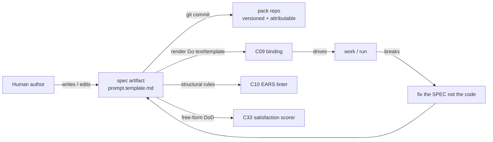
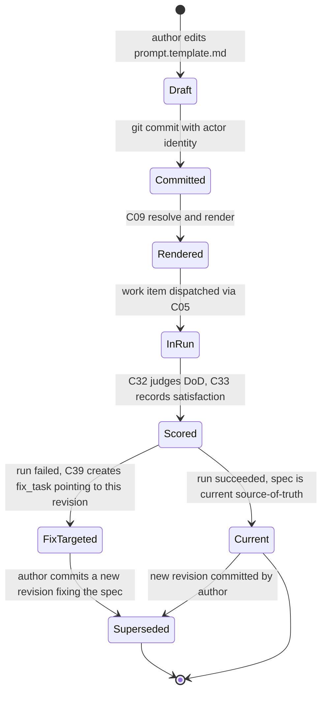
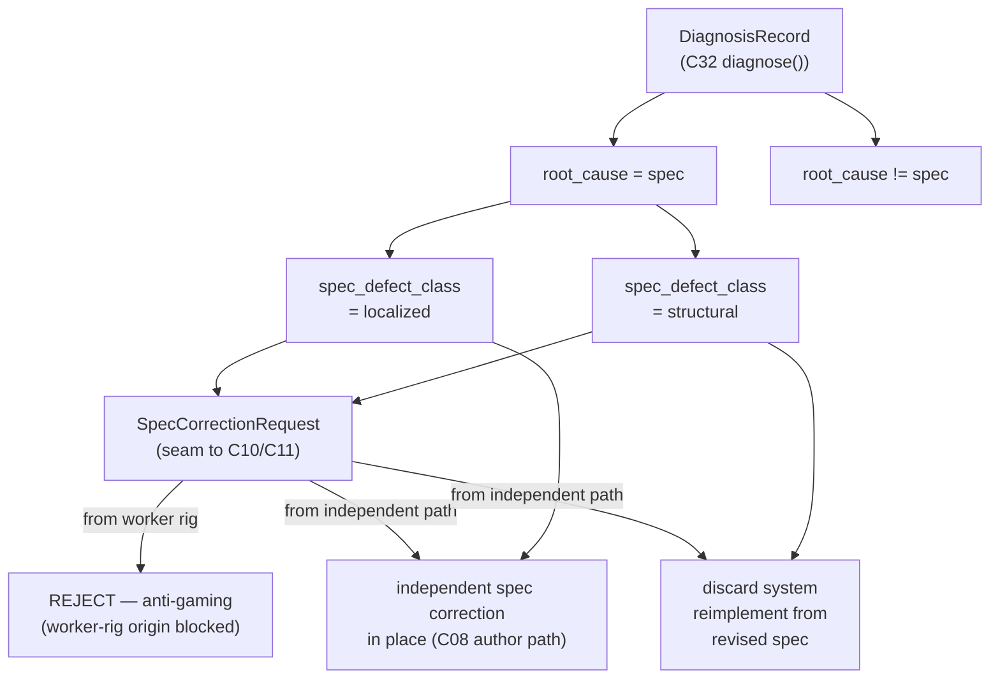

# C08 — Spec artifact & format (`spec-artifact`)  (Spec, canonical track)

> Source: README §"Principle 1 — Specs are the source of truth" (lines 100–111); AI-CONTEXT §1 (principle table, line 31), §3.1 (coverage map, line 66), §3.4 (smallest viable install, lines 114–122), §13.1 (Phase 0 `agents/worker/prompt.template.md`, lines 542–544); one-shot-specs-and-research.md Part 1 (example one-shot specs) + Part 2 (specification-attribute research); F-MODE-COVERAGE F18, F38, F3, F36.
> Inventory ID: C08   Kind: artifact   Status: sweep-2
> Maps from: A30, A14, A95, B26, B82. Depends on: C03 (layered config / feature-flags). Key gap: G16.

## 1. Purpose & responsibility

C08 is the **source-of-truth spec artifact and its format** — the human-authored, version-controlled document that *drives execution*. Principle 1: "Code is disposable; specs are the load-bearing artifact. When something breaks, you fix the spec and rebuild, not the output" (README:102; AI-CONTEXT:31).

In the v4 substrate, the spec format **is** Gas City's prompt-template machinery: Go `text/template` + Markdown, stored at `agents/<name>/prompt.template.md` inside a git-versioned pack (README:106; AI-CONTEXT:119). C08 owns:

- The **on-disk artifact shape**: a Markdown body, authored by a human, that becomes an agent's instruction after template rendering.
- The **format contract**: it is a Go `text/template` over Markdown — what is structurally a spec, where it lives, how it is named, and that it is version-controlled and attributable.
- The **"specs in → satisfying software out, code disposable"** semantics: the spec is load-bearing; generated code is a disposable derivative.
- The **free-form Definition-of-Done (DoD) field** — the human-authored statement of what a successful run must satisfy, which C33 scores via C32's graded judge (D-15; see §4 schema and §4.1).

**What C08 is NOT:**
- It is **not** the rendering/binding mechanism that decides *which* spec drives *which* work — that is **C09** (prompt-template & spec→execution binding) (README:109).
- It is **not** the structural validator — EARS/INCOSE linting is **C10** (README:108).
- It is **not** structured intent capture (the 9-field crucible) — that is **C11** (AI-CONTEXT F41).
- It is **not** the workflow/process description — the DAG/methodology lives in the **formula** (C12), not the spec (README:128 "the methodology lives in the file, not in agent prompts").
- It is **not** the config layer that gates capabilities — that is **C03**; C08 only *depends on* C03 for where the format sits in the layered TOML.
- It is **not** the enumerated per-criterion DoD machinery. Per D-15, FE-5 (enumerated per-criterion DoD inside the spec artifact) is **DEFERRED** — C08's DoD is free-form at Sweep-2.

> [AMBIGUITY: OQ-1] v4 never names this artifact with a single noun (it appears as "spec", "prompt template", `prompt.template.md`), and two readings of "what the spec artifact *is*" both trace to cited v4 sources:
> - **Reading A (collapse — chosen).** The prompt-template file *is* the canonical spec artifact, because README:106 maps the "Spec format" row directly onto "Gas City prompt templates … `agents/<name>/prompt.template.md`". This is the only v4 statement that names a concrete on-disk spec **format + path**.
> - **Reading B (standalone).** The spec is a standalone target-system Markdown document the prompt template merely *references* — the shape the cited `one-shot-specs-and-research.md` Part 1 corpus actually shows in practice (StrongDM's three markdown files; Kilroy `spec.md`+`DoD.md`, distinct from agent prompt templates).
>
> **Faithful pick: Reading A**, because it is the smallest choice that yields a single v4-named artifact with a v4-named path, and v4's substrate section never reconciles the corpus practice with the placement-table equation. Reading B is *better engineering* but adds an artifact and a C08↔C09 reference seam v4 does not name — that is a deferred-enhancement direction (see the frozen optimized DELTA-01 reference). This is the **load-bearing ambiguity for C08**; it is restated as OQ-1 (§9) and is the integrator's call.

**RESOLVED (Sweep-2): OQ-1 — C08↔C09 boundary seam named.**

The canonical-track faithful collapse (Reading A) is adopted. The **C08↔C09 boundary** is defined as follows:

- **C08 owns:** the on-disk file at `agents/<name>/prompt.template.md` — its shape (Markdown body, Go `text/template` syntax), its path convention, its version-control contract, its renderability invariant (INV-2), and the embedded free-form DoD field. C08 is the *artifact and its format*.
- **C09 owns:** the *act* of rendering that file — loading the template body from the pack layout, expanding Go template actions against the run context, and producing the concrete instruction string handed to C28. C09 also owns the *binding*: the named association formula-node → template-name → agent-role that routes a work item to the correct spec. C09 is the *render + bind transform*.
- **The seam:** C09's inbound is the `prompt.template.md` *file body* at the pack layout path. C08 guarantees the file exists, is valid Go `text/template`, is committed to git, and carries the human-authored DoD in its body. C09 reads the file via `pack_root/agents/<name>/prompt.template.md` — no `spec_id` indirection on the canonical track (that indirection is DELTA-01, deferred). C08 does NOT produce a rendered instruction; C09 does NOT own the file-as-artifact.
- **What the boundary is NOT:** if an integrator later adopts the optimized DELTA-01 split (a standalone spec bundle the template references), C09's inbound gains a `spec_id` resolution step — but C08's responsibilities (artifact shape, DoD field, version-control contract) survive unchanged. The canonical track does not adopt that split.

This resolution registers the C08↔C09 seam for the orchestrator ledger: any component that needs "which spec text was used?" reads C08's file at a given git revision; any component that needs "what instruction was given to the agent?" reads C09's rendered output.

## 2. Context & dependencies

| Direction | Component | Relationship (v4 source) |
|---|---|---|
| Upstream (depends on) | **C03** config/feature-flags | The spec artifact lives in a pack whose presence/section gating is governed by layered TOML (inventory C08 `Depends on: C03`; AI-CONTEXT §3.4 names `agents/<name>/prompt.template.md` as part of the smallest install alongside `pack.toml`/`city.toml`). |
| Upstream (authored by) | **C11** intent intake | The 9-field crucible (F41) is the structured intake that *feeds* spec authoring; C08 is the durable artifact it produces toward. |
| Downstream (consumes) | **C09** prompt-template binding | Renders the spec (Go `text/template`) and binds it to work via formulas + sling (README:109). C09's inbound = the `prompt.template.md` file body at the pack layout path; see §1 boundary seam. |
| Downstream (validates) | **C10** spec linter (EARS/INCOSE) | Runs deterministic structural rules over the spec (README:108; F18, F38). |
| Downstream (scores DoD) | **C32** / **C33** judge + satisfaction | C33 computes the satisfaction distribution by C32's graded judge over C08's free-form DoD field. C08 is the artifact C33 reads; C32 is the judge; this is the seam D-15 names (see §4.1 DoD field). |
| Upstream (attribution) | **C41** actor/identity | INV-3/AC-3 (versioned + attributable) rely on actor identity riding git commits via C41 (README:107). Soft upstream. |
| Downstream (re-enters as fix target) | **C39** fix-task loop-closure | When something breaks, the fix is a spec change, not an output patch (Principle 1; inventory C39 `Depends on: …C08`). The `fix_task` bead's `spec_ref` field (C20 §4.5.2) points to the C08 spec that must be revised. |
| Downstream (bootstrap input) | **C51 / C52** gene-transfusion / self-bootstrap | The factory authors a *spec for its own next component* (inventory C51/C52 `Depends on: C08`). |

C08 sits at the head of the **Spec Intake** subsystem and is foundational (inventory: Foundational? = yes): it is in Batch 1 because C09, C10, C11, C39, C51, C52 all reference its format.

## 3. Interfaces / contracts

### 3.1 Inbound (how a spec comes into being)
- **Authoring interface (human → artifact).** A human writes/edits a Markdown file at `agents/<name>/prompt.template.md` within a pack. v4 states the Phase 0 content is "arbitrary; whatever the worker's initial prompt should be" (AI-CONTEXT:542). The body MUST include the free-form DoD (see §4.1); structure beyond that is free-form Markdown within Go-template lexical rules.
- **Storage interface (artifact → version control).** The file is committed to git as part of the pack (README:107 "Spec storage … Git + Gas City pack structure … packs are git-versioned"). Attribution (who authored/changed it) rides on git + the actor model (C41).

### 3.2 Outbound (how the spec is consumed)

- **Render contract (artifact → C09).** The file is a valid Go `text/template`; C09 renders it (substituting template variables from the run context) into the concrete agent instruction (README:106, 109). Seam: C09 reads the file body at `pack_root/agents/<name>/prompt.template.md` — no intermediate `spec_id`. C08's obligation: the file parses as a valid Go `text/template` (INV-2) and is committed at a known git revision (INV-3).
- **Lint contract (artifact → C10).** The Markdown body is the input surface for EARS/INCOSE structural rules (README:108). C10 is a downstream *consumer* of C08's format; C10 may *optionally* require structural conventions, but that is C10's concern, not a C08 format change (OQ-2; D-9).
- **DoD scoring contract (artifact → C32/C33).** The free-form DoD embedded in the spec body is the text C33 passes to C32's graded judge as the satisfaction reference. C08's obligation: the DoD is present and human-authored. C08 does NOT enumerate per-criterion DoD (FE-5/deferred; D-15). The seam: C33 reads the DoD from the spec body at a pinned git revision; the DoD text is the verbatim source — C08 does not pre-process or transform it.
- **Fix-target contract (artifact ← C39).** A `fix_task` bead (C20 §4.5.2) carries a `spec_ref` pointing at the C08 spec that must be revised. When a fix lands, the loop re-renders the *new* git revision of the spec. C08 is the fix target; C39 is the loop-closure owner.

### 3.3 Invariants

- **INV-1 (source-of-truth).** The spec is the authoritative description of intended behavior; generated code is a disposable derivative — fixes target the spec (README:102).
- **INV-2 (renderable).** The artifact MUST parse as a Go `text/template` so C09 can render it (README:106).
- **INV-3 (versioned + attributable).** Every spec revision is a git commit carrying actor identity (README:107; C41).
- **INV-4 (DoD present).** A conformant spec MUST contain a free-form DoD — a human-authored statement of what a successful run must satisfy. C33 requires this field (D-15). Absence of a DoD is a detectable error (E-C08-02).

> [FAITHFUL-FILL] INV-2's "MUST parse as a valid Go template" is not stated as a hard rule in v4; it is the minimal consistent inference from README:106 declaring the format to *be* Go `text/template`. A spec that fails template parsing cannot be rendered by C09, so this is the smallest constraint that keeps the C08→C09 contract coherent.

> [FAITHFUL-FILL] INV-4 (DoD present) is inferred from D-15 ("C33 computes the satisfaction distribution … over C08's existing free-form Definition-of-Done"). If the DoD can be absent, C33 has nothing to score — so "DoD present" is the minimal consistent precondition for the C08→C33 seam to be well-defined. v4 never explicitly names the DoD as a required spec field; it is the faithful inference from D-15 binding.

## 4. Data model / state (Sweep-2 schema)

C08 owns the **artifact**, not a live store. The artifact is a single file with an implicit field structure (the Markdown body carries all fields in free-form prose; no required headings). The schema below names the *logical fields* C08's format must carry so that downstream components (C09, C10, C32/C33, C39) can operate on them.

### 4.1 Spec artifact schema

| Field | Type | Req? | Semantics | R/W-by |
|---|---|---|---|---|
| `spec_id` | `string` — derived: `agents/<name>` where `<name>` is the agent role slug | R | stable identity for this spec within the pack; the path segment used by C09's `resolve()` call (C09 §3.1b). Not a stored field — derived from the pack layout path | C08 defines by placement; C09 resolves; C12 references by name |
| `spec_body` | `string` (Markdown + Go `text/template` syntax) | R | the full Markdown body of the spec. Must parse as a valid Go `text/template` (INV-2). Free-form structure within that lexical constraint. Contains the DoD in prose | Author writes; C09 renders; C10 lints; C32/C33 reads for DoD |
| `dod` | `string` (free-form prose, human-authored) | R | the Definition-of-Done — the statement of what a successful run must satisfy. C33 passes this verbatim to C32's graded judge. **Free-form at Sweep-2; enumerated per-criterion form is FE-5/deferred (D-15)** | Author writes; C33 reads; C32 judges against |
| `git_revision` | `string` (git commit SHA) | R | the commit SHA of the pack at which this spec was authored/last changed. The consistency boundary (INV-3). Derived from the pack git history, not stored in the file itself | C41/git writes on commit; C09 reads (INV-4 binding); C33 pins at eval time |
| `actor` | `string` — `"kind:id"` wire type per D-29 (e.g. `"human:alice"`) | R | the actor identity of the spec author/last committer; rides on git commit metadata + C41 semantics | C41 provides; C08 carries via git; C09/audit reads |
| `work_type` | `string` (optional slug, e.g. `"worker"`, `"judge"`, `"dog"`) | O | the agent role this spec is authored for, inferred from the `agents/<name>/` path segment. Informs C09 binding and C10 linting focus | Derived from path; C09 uses for role binding; C10 uses for lint |
| `pack_ref` | `string` (pack repo URL or local path + git remote) | O | provenance: which pack repo this spec lives in. Needed for C51 gene-transfusion attribution and C39 fix routing | C51/C52 write on transfusion; C39 reads for fix routing |

> [FAITHFUL-FILL] v4 never names internal spec fields. The schema above is the minimal consistent set: `spec_body` + `dod` are the authoring surface; `git_revision` + `actor` are the version-control contract (INV-3); `spec_id` + `work_type` are the binding keys C09 needs; `pack_ref` is the provenance pointer C39/C51 need. No field beyond this set is asserted (adding more would be an architectural addition v4 does not make). The `dod` field is a *logical* field — it is a human-prose section within `spec_body`, not a delimited key-value pair. C32/C33 extract it by convention (prose at the end or under a "Definition of Done" heading — see OQ-2 for whether C10/C11 may require a heading convention).

**D-15 (verbatim citation — load-bearing for the DoD field):**

> "C33 computes the satisfaction distribution by a graded judge (C32) over C08's existing free-form Definition-of-Done — NOT against enumerated per-criterion DoD. FE-5 (enumerated per-criterion DoD inside the spec artifact) stays DEFERRED; it is a coordinated C08+C32+C33 change whose primary beneficiary (C46 per-criterion diagnosis) is built last."
> — review-log D-15 (Batch-3 review integration, 2026-05-31)

Consequence: C08's `dod` field is a **single free-form prose string** at Sweep-2. C32 judges it holistically. Do NOT add per-criterion structure, enumerated checklists, or machine-parseable criterion keys to C08 at this sweep — that is FE-5, which is explicitly deferred.

### 4.2 On-disk format + version-control contract

Physical layout within a gas-city pack:

```
<pack_root>/
  pack.toml                          # C03 config: imports, capability_id
  agents/
    <name>/
      prompt.template.md             # C08 spec artifact (one per agent role)
  ...
```

- **One file per agent role.** The spec for agent role `<name>` lives at `agents/<name>/prompt.template.md` (README:106; AI-CONTEXT:119, 542). No other canonical spec path exists at Sweep-2.
- **Go `text/template` + Markdown body.** The file body is valid Go `text/template` syntax over Markdown. Literal `{{` / `}}` (e.g. inside JSON examples or handlebars snippets) MUST be escaped as `{{"{{"}}` / `{{"}}"}}` per `text/template` rules, or the file will fail C09's `resolve()` with E-C08-01.
- **Version-control contract.** The file is committed in git as part of the pack repository. Each commit that changes the file is a spec revision. The git commit SHA is the `git_revision` for that version. Attribution (author identity) rides the git commit metadata + C41's `created_by` wire type (`"kind:id"` per D-29).
- **Committing.** The pack repo is the git-versioned source of truth. A spec change MUST be a committed git revision; an uncommitted working-tree edit is NOT a valid spec state (INV-3 requires a commit SHA).
- **C03 gating.** The `agents/<name>/prompt.template.md` file is part of the pack referenced by `city.toml`'s `[imports.*]` (C03). Its presence is gated by the pack being imported; if the pack is not imported, the spec is unreachable by C09.

## 5. Behavior

The spec's behavior is its place in the Principle-1 loop:



Key flow: **fix-the-spec-not-the-output.** When a run fails (anomaly → diagnosis, C36–C38), loop-closure (C39) generates a `fix_task` whose target is a spec revision; the rebuild re-renders the *new* spec revision (README:102; inventory C39).

### 5.1 Spec lifecycle — state diagram (Sweep-2)

The diagram below shows the lifecycle states of a **spec revision** from authoring through the Principle-1 fix loop. A "revision" is one committed version of `prompt.template.md`; each state-transition corresponds to an observable event.



Notes:
- `Draft` is NOT a valid spec state per INV-3 (uncommitted edits do not constitute a revision).
- `Committed` is the entry point for all downstream consumers (C09, C10, C33, C39).
- A single committed revision may be `InRun` for multiple concurrent work items (one per agent dispatched against it).
- `FixTargeted` does not invalidate the revision; the `fix_task`'s `spec_ref` points at *this* revision as the one that needs editing.
- `Superseded` is terminal — the old revision remains in git history for audit but is no longer the active source-of-truth.

## 6. Failure modes & handling

| F-mode | Applies to C08 how | v4 handling (faithful) |
|---|---|---|
| **F18** Prose specs lack rigor | The format is free-form Markdown prose; prose is inherently ambiguous. | EARS-style spec linter C10 (P1 component) + satisfaction-not-test-pass (P6); **Partial — fundamental prose ambiguity remains** (F-MODE F18). C08 itself does not eliminate ambiguity; it provides the surface C10 lints. |
| **F38** Vocabulary lint debt | Specs introduce undefined terms. | EARS-style linter detects deterministically (F-MODE F38, "Addressed"). C07 glossary is the canonical-term source. |
| **F3** Spec-completeness fallacy | A spec cannot enumerate everything that should not happen. | Twins (P7) + scenarios (P5) partially compensate; **residual gap** (F-MODE §"Inherent gaps", F3). C08 does not claim completeness. |
| **F36** Instruction-following ceiling | A single spec chunk can exceed the model's instruction-following ceiling. | Mitigated via **spec-chunking** — "small focused specs" (F-MODE F36). The limit persists per chunk; faithful reading: C08 supports authoring many small specs, one per `agents/<name>/`. |

> [FAITHFUL-FILL] "spec-chunking / small focused specs" (F-MODE F36) is named as a P1 mitigation but no chunk-size rule is given. Faithful elaboration: the natural chunk boundary is **one `prompt.template.md` per agent role**, since that is the only spec unit v4 names. No numeric size bound is asserted (none exists in v4). *Contingent on OQ-1:* if the spec resolves to a standalone document (Reading B), the chunk unit is the spec doc rather than the template — the "one unit per role" framing survives either way, only the file it names changes.

### 6.1 Error taxonomy (Sweep-2)

Errors are scoped to C08's three surfaces: **format** (the file itself), **DoD** (the DoD field C33 needs), and **version-control** (the git contract C09/C39 rely on).

| Code | Condition | Surfaced-as | Caller recovery |
|---|---|---|---|
| **E-C08-01** | Malformed spec — `prompt.template.md` fails Go `text/template` parse | C09 `resolve()` returns `BindingError{kind: template-parse-error}` (C09 E-C09-04) | Author must fix `{{` / `}}` escaping or broken template actions and recommit; C09 cannot render until the file parses cleanly |
| **E-C08-02** | Missing DoD — the spec body contains no recognizable Definition-of-Done section | C33 receives an empty `dod` string; C33 fails with a "no DoD" error before invoking C32 | Author must add a DoD section; C10 linting (OQ-2) may flag this as a structural warning if a heading convention is adopted |
| **E-C08-03** | Unresolved template reference — the spec body references a template variable (e.g. `{{.SomeField}}`) that C09's render context does not supply | C09 `render()` returns `BindingError{kind: unbound-variable}` (C09 E-C09-02) | Author must either remove the variable reference, add it to the render context contract (C09 §3.2), or guard with `{{if .SomeField}}` — recommit after fix |
| **E-C08-04** | Uncommitted spec — spec file is in working-tree-only state (not a committed git revision) | C09 cannot resolve a `pack_git_rev` for the file; INV-3 violated | Author must `git commit`; C09 refuses to render an uncommitted spec to preserve the attribution guarantee |
| **E-C08-05** | Missing spec file — `agents/<name>/prompt.template.md` does not exist at the path C09 resolves | C09 `resolve()` returns `BindingError{kind: template-not-found}` (C09 E-C09-01) | Author must create the file at the canonical path and commit; formula referencing a non-existent template is a dispatch failure |
| **E-C08-06** | Secrets in spec — the spec body contains a credential or key literal | Static lint (C10 or pack-import check); not a runtime error but a security violation | Author must move credential to `city.toml` env block (C03/G37); spec must be scrubbed and the offending git revision noted for rotation |

> No `E-C08` code is reserved for enumerated per-criterion DoD errors — that surface does not exist at Sweep-2 (FE-5/deferred, D-15). E-C08-02 is the only DoD-related error.

### 6.2 Spec-quality properties required by the triangle (Sweep-2 addition — D-42/D-43)

The triangle framing (ADR-0069; D-42) identifies three defect classes the judge attributes to the **Spec (S)** corner. C08 must produce specs that satisfy these three quality properties — they are exactly the `spec_defect_class` semantics C32 uses in `DiagnosisRecord` (D-43):

**D-42 (verbatim citation — load-bearing for the triangle framing):**

> "Every build is three representations — **Spec (S)**, hold-out **Scenarios (H)**, **System (I)** — joined by three independently-verified edges: **S↔H** (scenario builder + spec builder make the correspondence correct + complete), **S↔I** (the system's own unit/integration/e2e tests — implementer-written, therefore gameable), **H↔I** (the judge, evaluated independently — the anti-gaming check)."
> — review-log D-42 (Triangle evaluation invariant, 2026-06-02; operator-adopted; ADR-0069)

**D-43 (verbatim citation — load-bearing for `spec_defect_class` semantics):**

> "`spec_defect_class` | `enum{none,localized,structural}` | R | When `root_cause=spec`: `localized` (patch in place) vs `structural` (system faithfully built the wrong target — discard and reimplement); `none` otherwise"
> — review-log D-43 (Triangle diagnosis contract, 2026-06-02; C32 §3.2a field table)

The three spec-quality properties and their tie to the triangle:

| Property | Definition | `spec_defect_class` when violated | Repair mode |
|---|---|---|---|
| **Unambiguous** | The spec permits only one consistent interpretation of the required behavior — the implementing agent and the judge read it the same way | `localized` (ambiguity is patchable in place without discarding the system) | `incremental_fix` via independent spec correction |
| **Complete** | The spec covers all behaviors the scenarios test — no required behavior is left unspecified (F3 residual: completeness cannot be fully guaranteed; the hold-out makes incompleteness visible) | `localized` (a missing clause is addable without discarding the system, unless the missing clause reveals the target was wrong from the start) | `incremental_fix` or `discard_and_reimplement` depending on scope |
| **Non-contradictory** | No two clauses in the spec require mutually exclusive behavior — the system cannot satisfy both | `structural` if contradictions cause the system to faithfully implement an incoherent target; `localized` if resolution is unambiguous and in-place | `incremental_fix` (localized) or `discard_and_reimplement` (structural) |

**The `spec_defect_class` semantics (from D-43) are the triangleside definition of spec quality:**

- `localized` — the spec defect is a **patchable ambiguity, missing clause, or limited contradiction** that can be corrected in place; the system need not be discarded (the existing implementation, once the spec is fixed, is likely still salvageable with targeted changes).
- `structural` — the spec defect caused the system to **faithfully implement the wrong target** (the agent did exactly what the spec said, but the spec described the wrong thing). Patching the system is futile — the correct action is to discard the system entirely, correct the spec via the independent authoring path, and rebuild from scratch.

These two classes are the load-bearing distinction for C52's repair router (D-43: `spec` + `localized` → `incremental_fix` routed to independent spec correction; `spec` + `structural` → `discard_and_reimplement`).

**F-mode mapping:** `localized` spec defects are the triangle-framing of F18 (prose ambiguity) and F3 (incompleteness); `structural` spec defects are a new surface surfaced by the triangle — the case where the spec was internally consistent but targeted the wrong problem.

### 6.3 Independent spec-correction invariant (Sweep-2 addition — D-42/D-43 anti-gaming)

**INVARIANT (INV-5): spec correction MUST run through the independent authoring path, NEVER through the implementing worker.**

**D-43 (verbatim citation — anti-gaming invariant):**

> "every `spec`/`scenario` repair route is executed by the **independent authoring path** (C08 + future C10/C11; C30 scenario builder + spec builder), **never the implementing worker** — without this, 'fix the spec' degenerates into 'weaken the spec until my output passes'"
> — review-log D-43 (Triangle diagnosis contract, 2026-06-02; Anti-gaming invariants)

When C32's `diagnose()` produces a `DiagnosisRecord` with `root_cause = spec`, C52 routes a **`SpecCorrectionRequest`** (§6.4) to the independent spec-authoring path — the same path that originally wrote the spec (a human, C08's authoring interface, optionally assisted by the future non-spine C10 EARS linter and C11 intent crucible). The implementing worker that built the system under evaluation MUST NOT receive the spec-correction request, modify the spec, or propose spec text that is then applied. Without this independence, "fix the spec" becomes "weaken the spec until my output passes" — the system game-optimizes the rubric by which it is judged.

**Why this is structural, not a matter of discipline:** the anti-gaming property derives from *who* performs the correction, not from *what* the correction says. A worker-authored spec correction is gameable by construction even if the correction appears reasonable — the worker's incentive is to pass the hold-out, and relaxing an underspecified clause is indistinguishable from correctly clarifying it when the same agent performs both roles. The independent authoring path breaks this incentive link at the process boundary.

**INV-5 stated as a detectable invariant:** a `SpecCorrectionRequest` that carries a `requested_by` actor in class `rig:worker-*` or `agent:worker-*` MUST be rejected before it reaches the spec-authoring path. This is E-C08-07 (§6.1 extension below). The rejection is the anti-gaming check at the C08 boundary.

### 6.4 SpecCorrectionRequest seam — interface to future C10/C11 (Sweep-2 addition — capability-bar §0★.3)

When C32 attributes `root_cause = spec`, the repair router (C52) issues a **`SpecCorrectionRequest`** to the independent spec-authoring path. This is a **named seam** — C08 defines the interface contract; the future non-spine components C10 (EARS linter) and C11 (intent crucible) are the eventual consumers of this request on the authoring side. This pass does NOT build C10 or C11 — it names the seam and the minimal interface only (per D-43 capability-bar §0★.3; see also [ADR-0043](../../../docs/adr/0043-p-17-intent-crucible-validator.md) as the future home for the intent-crucible substance-check path).

**`SpecCorrectionRequest` schema (C08 seam — read by C52 outbound, consumed by independent authoring path):**

| Field | Type | Req | Semantics | R/W-by |
|---|---|---|---|---|
| `factory_build_ref` | `string` | R | The `factory_build` bead this correction is for (D-40 status bead); keys the `DiagnosisRecord` that triggered this request — the authoritative traceability anchor | C52 writes (from `DiagnosisRecord.factory_build_ref`); C08 authoring path reads |
| `component_id` | `string` | R | The component whose spec is defective; identifies which `agents/<name>/prompt.template.md` needs correction | C52 writes; C08 authoring path reads |
| `spec_git_revision` | `string` (git SHA) | R | The committed revision of `prompt.template.md` that was active when the defect was diagnosed — the exact artifact under correction | C52 writes (from `DiagnosisRecord`'s evaluation inputs); C08 authoring path reads |
| `spec_defect_class` | `enum{localized,structural}` | R | The defect class from `DiagnosisRecord.spec_defect_class`; drives the correction mode (in-place patch vs full rewrite before rebuild) | C32 writes into `DiagnosisRecord`; C52 copies; C08 authoring path keys on |
| `defect_detail` | `string` | R | The judge's `root_cause_rationale` from `DiagnosisRecord` — the human-readable attribution explaining what the defect is; the authoring path reads this to understand what to fix | C32 writes into `DiagnosisRecord.root_cause_rationale`; C52 copies verbatim; C08 author reads |
| `misalignment_refs` | `list<string>` | R | The `DiagnosisRecord.misalignments[*].scenario_id` values that were attributed to `spec`; narrows which behaviors the correction must address | C52 extracts from `DiagnosisRecord.misalignments`; C08 author reads |
| `requested_by` | `string` (`"kind:id"` per D-29) | R | The actor that issued the correction request; MUST be the repair router (C52 rig identity, e.g. `"rig:bootstrap-N"`) — NEVER a worker-rig identity; E-C08-07 fires if a worker-rig actor is the requester | C52 writes its own rig identity; C08 authoring path / C34 validates |
| `repair_mode` | `enum{incremental_fix,discard_and_reimplement}` | R | From `DiagnosisRecord.repair_recommendation`; if `discard_and_reimplement`, the authoring path must fully rewrite the spec and flag the system for discard before rebuild | C52 copies from `DiagnosisRecord.repair_recommendation`; C08 author acts on |
| `requested_at` | `timestamp` | R | UTC timestamp when C52 issued the request | C52 writes |

**`SpecCorrectionRequest` invariants:**

- **`requested_by` MUST NOT be a worker-rig actor** — any request where `requested_by ∈ {rig:worker-*, agent:worker-*}` is rejected with E-C08-07 (anti-gaming; INV-5).
- **`spec_git_revision` MUST match a committed revision** — C08's version-control contract (INV-3) applies; a correction request for an uncommitted revision is rejected with E-C08-04.
- **`factory_build_ref` is the traceability anchor** — every spec correction is traceable back to the `DiagnosisRecord` that triggered it; C34 audits this chain.

**Seam note (capability-bar):** the future non-spine **C10** (EARS linter) receives the `SpecCorrectionRequest` and runs deterministic EARS/INCOSE rules over the defect detail to propose concrete textual fixes. The future non-spine **C11** (intent crucible, [ADR-0043](../../../docs/adr/0043-p-17-intent-crucible-validator.md)) receives it to run the substance-check — verifying that the corrected spec satisfies the original operator intent and does not introduce new structural gaps. Neither C10 nor C11 is built at this sweep. The seam is named so their builders know the inbound interface.

**Spec-correction flow diagram (Mermaid — validated PASS):**



### 6.5 In-system tests vs hold-out: the spec as shared referent (Sweep-2 addition — D-15/D-38/D-42)

C08's free-form DoD is the **shared referent for both kinds of tests** the triangle uses:

**D-15 (verbatim citation — holistic grading is the shared DoD form):**

> "C33 computes the satisfaction distribution by a graded judge (C32) over C08's existing free-form Definition-of-Done — NOT against enumerated per-criterion DoD. FE-5 (enumerated per-criterion DoD inside the spec artifact) stays DEFERRED; it is a coordinated C08+C32+C33 change whose primary beneficiary (C46 per-criterion diagnosis) is built last."
> — review-log D-15 (Batch-3 review integration, 2026-05-31)

The DoD field is judged **holistically** by C32 (D-15). This holistic judgment is the common rubric for two structurally different test kinds:

| Test kind | Edge | Author | Trust property | Relation to the spec |
|---|---|---|---|---|
| **In-system tests** (unit / integration / e2e) | **S↔I** | The **implementing worker** — gameable | NOT the trust boundary; enforces the implementer's own reading of the spec | Written by the implementer as part of the deliverable; green means "the implementer believes the system matches the spec" |
| **Hold-out scenarios** | **H↔I** | The **scenario builder + spec builder** — independent of the implementer | The **anti-gaming check**; the judge evaluates independently (D-38) | Authored against the same spec (S) by a different party; green means "an independent reader's interpretation of the spec is satisfied" |

The spec (C08's artifact) is the **shared referent**: both the implementer (writing S↔I tests) and the scenario builder (authoring H↔I hold-outs) read the same `prompt.template.md` at the same git revision. Divergence between the two test kinds is diagnostic signal — the judge's `misalignments` and `root_cause` attribution (D-43) name which representation is at fault.

**D-38 (verbatim citation — judge independence for the H↔I edge):**

> "the judge runs in a **separate rig** from the worker (worker rig + judge rig, co-resident in the city). The judge MAY read the worker's trajectory log + the held-out scenario partition; the worker MUST NOT read the judge rig or the scenarios (the holdout — C34 enforces+audits, C42 provides the partition); **no shared context window**."
> — review-log D-38 (Evaluation-tier seam decisions, 2026-06-01)

**Consequence for C08:** the spec author is responsible for making the DoD clear enough that BOTH the implementer and the independent scenario builder arrive at consistent interpretations. An ambiguous DoD that causes the two parties to build against different understandings is a `localized` spec defect (the ambiguity is attributable and patchable). A DoD that describes the wrong system is a `structural` spec defect.

### 6.6 Extended error codes (Sweep-2 addition — anti-gaming + correction-seam errors)

The following two E-codes extend §6.1 for the correction-seam surfaces introduced in §6.3 and §6.4:

| Code | Condition | Surfaced-as | Caller recovery |
|---|---|---|---|
| **E-C08-07** | Worker-rig-originated spec-correction request — a `SpecCorrectionRequest` with `requested_by ∈ {rig:worker-*, agent:worker-*}` reaches the C08 authoring path | The authoring path (or its gating component, C34/C52) rejects the request and logs a security violation; no spec change is made | The request must be reissued from the legitimate repair router (C52 rig identity); investigate how a worker-rig actor obtained access to the correction-request path — this is an integrity breach (INV-5 / anti-gaming) |
| **E-C08-08** | Spec still ambiguous after correction — C32's `diagnose()` on the rebuilt system returns `root_cause = spec` with `spec_defect_class = localized` again (same or new ambiguity) after a `SpecCorrectionRequest` was applied | `DiagnosisRecord` emitted with `root_cause = spec`; C52 re-routes to the independent authoring path with the updated defect detail | The spec author must re-examine the DoD for remaining or newly-introduced ambiguity; the `misalignment_refs` in the new `SpecCorrectionRequest` narrow which scenarios still fail; repeated `localized` cycles indicate the DoD requires structural clarification |

**E-code / AC cross-reference table (all codes, including §6.1 + §6.6):**

| E-code | Asserted by AC |
|---|---|
| E-C08-01 | AC-C08-02 |
| E-C08-02 | AC-C08-03, AC-C08-04 |
| E-C08-03 | AC-C08-05 |
| E-C08-04 | AC-C08-06 |
| E-C08-07 | AC-C08-09 |
| E-C08-08 | AC-C08-10 |

> No E-code for E-C08-05 (missing spec file) or E-C08-06 (secrets in spec) is asserted by a specific AC-C08 test — both conditions are observable at the C09 / C10 boundary (E-C08-05 via C09 E-C09-01; E-C08-06 via C10 static lint).

## 7. Cross-cutting (security / cost / scale / observability / ops)

- **Security / secrets.** v4's spec format is plaintext Markdown in a git pack. Secrets do not belong in the spec; credential handling is undefined at the substrate level (G37, scoped to C03/`city.toml`, not C08). Faithful note: C08 carries no secrets-management responsibility. E-C08-06 names the violation; C03 + C41 own the mitigation surface.
- **Attribution / governance.** Spec revisions are git commits carrying actor identity via C41 (README:107 "version-controlled, attributable"). The `actor` field in the schema (§4.1) maps directly to C41's `"kind:id"` wire type (D-29).
- **Cost / scale.** Specs are small text files; cost is negligible. Scale concern is *authoring throughput*, not artifact size — F25 design-starvation (operator can't spec fast enough) is an operator-side residual, conceded not solved (F-MODE F25; G15).
- **Observability.** A spec revision is the unit a satisfaction metric (C33) and meta-metrics (C46) are computed *against* — the spec is the "what should this satisfy" reference, but C08 emits no telemetry itself. The `git_revision` and `actor` fields are the traceability anchors C46 needs to correlate spec versions with satisfaction outcomes.
- **D-30.** C08 is an artifact, not a process boundary — it has no direct prevent-gate surface. The D-30 prevent-gate applies at the tool-call/process level (C43/C34), not at spec authoring. A spec that, when rendered and executed, would trigger an out-of-boundary action is caught at the fence (C43), not by C08's format rules.

## 8. Acceptance criteria & test strategy

Sweep-1 acceptance (high-level, preserved):
1. **AC-1 (format defined).** There exists a documented format: Markdown body authored as a Go `text/template`, located at `agents/<name>/prompt.template.md` in a git pack (README:106).
2. **AC-2 (renderable).** A conformant spec parses as a Go `text/template` and is rendered by C09 without template error (INV-2).
3. **AC-3 (versioned + attributable).** Every spec revision is a git commit with actor identity (README:107; C41).
4. **AC-4 (lintable surface).** The Markdown body is consumable by C10's EARS/INCOSE rules (README:108).
5. **AC-5 (source-of-truth loop).** A failing run results in a *spec* change (a `fix_task` targeting the spec) and a rebuild, demonstrating "fix the spec, not the output" (README:102; C39).

### 8.1 Concrete acceptance tests (Sweep-2)

| Code | Given / When / Then | Verifies |
|---|---|---|
| **AC-C08-01** | Given a file `agents/worker/prompt.template.md` with valid Go-template Markdown body; when C09 calls `resolve("agents/worker/prompt.template.md", "worker", pack_root)`; then `BoundTemplate` is returned with non-empty `template_body` and a `pack_git_rev` (committed SHA) | AC-1, AC-2, INV-2, INV-3; E-C08-05 negative |
| **AC-C08-02** | Given a file with an unescaped `{{` inside a code block (a known authoring hazard); when C09 calls `resolve()`; then `BindingError{kind: template-parse-error}` is returned (NOT a silently-empty output) | **E-C08-01** assertion; INV-2; RC08A-02 mitigation |
| **AC-C08-03** | Given a spec body with a free-form DoD prose section; when C33 extracts the `dod` field and passes it to C32; then C32 receives a non-empty string and produces a holistic satisfaction score; there is NO enumerated criterion breakdown (FE-5 deferred) | AC-C08-01 + D-15; **E-C08-02** negative |
| **AC-C08-04** | Given a spec body with no DoD section; when C33 attempts to extract the `dod` field; then C33 fails with a "no DoD" error before invoking C32 | **E-C08-02** assertion; INV-4 |
| **AC-C08-05** | Given a spec that references `{{.UndefinedVar}}`; when C09 calls `render(bound, ctx)` with a context that does not supply `UndefinedVar`; then `BindingError{kind: unbound-variable}` is returned | **E-C08-03** assertion; C09 INV-1 (no silent empty expansion) |
| **AC-C08-06** | Given a spec file that exists only in the working tree (not committed); when C09 attempts to resolve it and require a `pack_git_rev`; then C09 refuses and surfaces E-C08-04 | **E-C08-04** assertion; INV-3 (uncommitted = not a valid revision) |
| **AC-C08-07** | Given a failing run that produces an `anomaly` bead (C39); when C39 writes a `fix_task` bead (C20 §4.5.2); then `fix_task.spec_ref` points to the committed `prompt.template.md` path of the spec that drove the failing run, and a subsequent spec edit + recommit + re-render produces the rebuild | AC-5; INV-1; the C08→C39→C08 loop (Principle 1 loop) |
| **AC-C08-08** | Given a spec committed with actor identity (git author = `"human:alice"` per C41 D-29 wire type); when the attribution chain is read (C41 + git metadata); then the spec revision resolves to an identified actor | AC-3; INV-3; D-29 wire type |

| **AC-C08-09** | Given a `SpecCorrectionRequest` with `requested_by = "rig:worker-1"` (a worker-rig identity); when the authoring path's gating component (C34/C52 boundary) evaluates the request; then the request is REJECTED before reaching the spec author, E-C08-07 is logged, and no spec change is made | **E-C08-07** assertion; INV-5 (anti-gaming); D-43 anti-gaming invariant; the worker cannot drive spec correction |
| **AC-C08-10** | Given a `SpecCorrectionRequest` was applied (independent authoring path corrected the spec) and the system was rebuilt; when C32's `diagnose()` runs on the rebuilt system and returns `root_cause = spec`, `spec_defect_class = localized` again (ambiguity persists after correction); then a new `SpecCorrectionRequest` is issued with updated `defect_detail` from the new `DiagnosisRecord.root_cause_rationale` | **E-C08-08** assertion; correction-loop closure; D-43 (`spec` + `localized` → `incremental_fix`) |

Each AC that asserts a failure path cross-references its E-code: AC-C08-02 → E-C08-01; AC-C08-03 → E-C08-02; AC-C08-04 → E-C08-02; AC-C08-05 → E-C08-03; AC-C08-06 → E-C08-04; AC-C08-09 → E-C08-07; AC-C08-10 → E-C08-08.

## 9. Open questions

- **OQ-1 (→ review-log). RESOLVED (Sweep-2).** The canonical-track faithful collapse (Reading A: `prompt.template.md` = the spec artifact) is adopted. The C08↔C09 boundary seam is named in §1 (boundary section). The C08↔C09 seam is registered in the orchestrator ledger as a NEW SEAM (see receipt). If a future integrator adopts DELTA-01 (standalone spec bundle), C08's responsibilities survive; C09 gains a `spec_id` resolution step. This OQ is closed on the canonical track.
- **OQ-2 (still open).** No internal section schema is specified; whether downstream (C10, C11) should be allowed to *require* structure (e.g., a mandatory "Definition of Done" heading for the `dod` field extraction) is left open. D-9 says F38 vocab-lint stays in C10 without a C07 registry; this does not resolve whether C10 may require a DoD heading convention. The DoD field (§4.1) is a logical field; its physical location within `spec_body` is free-form at Sweep-2. If C10 later requires a heading, that is a C10 structural rule over C08's surface — not a C08 format change.
- **OQ-3 (new, Sweep-2).** The `SpecCorrectionRequest.requested_by` validation (who enforces E-C08-07?) is assigned here to "the authoring path's gating component (C34/C52 boundary)" — but the exact enforcement point (C52 pre-send check vs C34 audit of the request bead vs a separate authoring-path entry guard) is not settled. C34 already audits `DiagnosisRecord.created_by` for independence; extending that audit to `SpecCorrectionRequest.requested_by` is the natural fit. Needs C52/C34 alignment. Forwarded to the orchestrator ledger as a new seam.

- **G16 (addressed, deferred-with-reason).** C08's assigned gap G16 questions whether the **12-principle set is the right set** (substituting self-optimization P12 for El Kaim's "pipeline files worth sharing"). This is a *whole-architecture* premise, not a property of the spec-artifact format: P1 ("specs as source of truth") — the principle C08 realizes — is **not** the substituted principle and is uncontested by G16. **Faithful disposition:** C08 records that its own grounding principle (P1) is stable under G16, and defers the P12-substitution question to the architecture-level owner (C57 failure-mode coverage / the README "first bet"). No C08 format change follows from G16. (AI-CONTEXT:27; README:98; ambiguities-and-gaps G16.)
