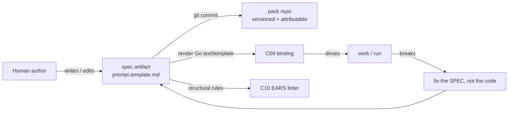

# C08 — Spec artifact & format (`spec-artifact`)  (Spec, canonical track)

> Source: README §"Principle 1 — Specs are the source of truth" (lines 100–111); AI-CONTEXT §1 (principle table, line 31), §3.1 (coverage map, line 66), §3.4 (smallest viable install, lines 114–122), §13.1 (Phase 0 `agents/worker/prompt.template.md`, lines 542–544); one-shot-specs-and-research.md Part 1 (example one-shot specs) + Part 2 (specification-attribute research); F-MODE-COVERAGE F18, F38, F3, F36.
> Inventory ID: C08   Kind: artifact   Status: sweep-1
> Maps from: A30, A14, A95, B26, B82. Depends on: C03 (layered config / feature-flags). Key gap: G16.

## 1. Purpose & responsibility

C08 is the **source-of-truth spec artifact and its format** — the human-authored, version-controlled document that *drives execution*. Principle 1: "Code is disposable; specs are the load-bearing artifact. When something breaks, you fix the spec and rebuild, not the output" (README:102; AI-CONTEXT:31).

In the v4 substrate, the spec format **is** Gas City's prompt-template machinery: Go `text/template` + Markdown, stored at `agents/<name>/prompt.template.md` inside a git-versioned pack (README:106; AI-CONTEXT:119). C08 owns:

- The **on-disk artifact shape**: a Markdown body, authored by a human, that becomes an agent's instruction after template rendering.
- The **format contract**: it is a Go `text/template` over Markdown — what is structurally a spec, where it lives, how it is named, and that it is version-controlled and attributable.
- The **"specs in → satisfying software out, code disposable"** semantics: the spec is load-bearing; generated code is a disposable derivative.

**What C08 is NOT:**
- It is **not** the rendering/binding mechanism that decides *which* spec drives *which* work — that is **C09** (prompt-template & spec→execution binding) (README:109).
- It is **not** the structural validator — EARS/INCOSE linting is **C10** (README:108).
- It is **not** structured intent capture (the 9-field crucible) — that is **C11** (AI-CONTEXT F41).
- It is **not** the workflow/process description — the DAG/methodology lives in the **formula** (C12), not the spec (README:128 "the methodology lives in the file, not in agent prompts").
- It is **not** the config layer that gates capabilities — that is **C03**; C08 only *depends on* C03 for where the format sits in the layered TOML.

> [AMBIGUITY: OQ-1] v4 never names this artifact with a single noun (it appears as "spec", "prompt template", `prompt.template.md`), and two readings of "what the spec artifact *is*" both trace to cited v4 sources:
> - **Reading A (collapse — chosen).** The prompt-template file *is* the canonical spec artifact, because README:106 maps the "Spec format" row directly onto "Gas City prompt templates … `agents/<name>/prompt.template.md`". This is the only v4 statement that names a concrete on-disk spec **format + path**.
> - **Reading B (standalone).** The spec is a standalone target-system Markdown document the prompt template merely *references* — the shape the cited `one-shot-specs-and-research.md` Part 1 corpus actually shows in practice (StrongDM's three markdown files; Kilroy `spec.md`+`DoD.md`, distinct from agent prompt templates).
>
> **Faithful pick: Reading A**, because it is the smallest choice that yields a single v4-named artifact with a v4-named path, and v4's substrate section never reconciles the corpus practice with the placement-table equation. Reading B is *better engineering* but adds an artifact and a C08↔C09 reference seam v4 does not name — that is a deferred-enhancement direction (see the frozen optimized DELTA-01 reference). This is the **load-bearing ambiguity for C08**; it is restated as OQ-1 (§9) and is the integrator's call.

## 2. Context & dependencies

| Direction | Component | Relationship (v4 source) |
|---|---|---|
| Upstream (depends on) | **C03** config/feature-flags | The spec artifact lives in a pack whose presence/section gating is governed by layered TOML (inventory C08 `Depends on: C03`; AI-CONTEXT §3.4 names `agents/<name>/prompt.template.md` as part of the smallest install alongside `pack.toml`/`city.toml`). |
| Upstream (authored by) | **C11** intent intake | The 9-field crucible (F41) is the structured intake that *feeds* spec authoring; C08 is the durable artifact it produces toward. |
| Downstream (consumes) | **C09** prompt-template binding | Renders the spec (Go `text/template`) and binds it to work via formulas + sling (README:109). |
| Downstream (validates) | **C10** spec linter (EARS/INCOSE) | Runs deterministic structural rules over the spec (README:108; F18, F38). |
| Upstream (attribution) | **C41** actor/identity | Not a hard inventory dependency, but INV-3/AC-3 (versioned + attributable) rely on actor identity riding git commits via C41 (README:107). Soft upstream. |
| Downstream (re-enters as fix target) | **C39** fix-task loop-closure | When something breaks, the fix is a spec change, not an output patch (Principle 1; inventory C39 `Depends on: …C08`). |
| Downstream (bootstrap input) | **C51 / C52** gene-transfusion / self-bootstrap | The factory authors a *spec for its own next component* (inventory C51/C52 `Depends on: C08`). |

C08 sits at the head of the **Spec Intake** subsystem and is foundational (inventory: Foundational? = yes): it is in Batch 1 because C09, C10, C11, C39, C51, C52 all reference its format.

## 3. Interfaces / contracts

Sweep-1: interfaces named + described (signatures deferred to sweep 2).

### 3.1 Inbound (how a spec comes into being)
- **Authoring interface (human → artifact).** A human writes/edits a Markdown file at `agents/<name>/prompt.template.md` within a pack. v4 states the Phase 0 content is "arbitrary; whatever the worker's initial prompt should be" (AI-CONTEXT:542).
- **Storage interface (artifact → version control).** The file is committed to git as part of the pack (README:107 "Spec storage … Git + Gas City pack structure … packs are git-versioned"). Attribution (who authored/changed it) rides on git + the actor model (C41).

### 3.2 Outbound (how the spec is consumed)
- **Render contract (artifact → C09).** The file is a valid Go `text/template`; C09 renders it (substituting template variables) into the concrete agent instruction (README:106, 109).
- **Lint contract (artifact → C10).** The Markdown body is the input surface for EARS/INCOSE structural rules (README:108).

### 3.3 Invariants
- **INV-1 (source-of-truth).** The spec is the authoritative description of intended behavior; generated code is a disposable derivative — fixes target the spec (README:102).
- **INV-2 (renderable).** The artifact MUST parse as a Go `text/template` so C09 can render it (README:106).
- **INV-3 (versioned + attributable).** Every spec revision is a git commit carrying actor identity (README:107; C41).

> [FAITHFUL-FILL] INV-2's "MUST parse as a valid Go template" is not stated as a hard rule in v4; it is the minimal consistent inference from README:106 declaring the format to *be* Go `text/template`. A spec that fails template parsing cannot be rendered by C09, so this is the smallest constraint that keeps the C08→C09 contract coherent.

## 4. Data model / state

C08 owns the **artifact**, not a live store. State:

| Aspect | Faithful spec (v4 source) |
|---|---|
| Physical form | Single Markdown file, Go `text/template` syntax, path `agents/<name>/prompt.template.md` (README:106; AI-CONTEXT:119, 542). |
| Container | A git-versioned Gas City pack (README:107). |
| Lifecycle | Authored → committed → rendered (C09) → drives a run → on failure, spec is edited and re-committed → rebuild (Principle 1 loop, README:102). |
| Persistence | Git history is the durable record; the bead work-graph (C19) and CXDB (C21) record *runs* against a spec but C08's persistence is the pack repo. |
| Consistency | Git is the consistency boundary; one committed revision = one authoritative spec state. |

> [FAITHFUL-FILL] v4 gives no internal section schema for the Markdown body (no required headings). Faithful reading: the body is **free-form Markdown** ("arbitrary", AI-CONTEXT:542); structure is *optionally* imposed downstream by the EARS linter (C10), not by C08's format. C08's format contract is therefore "renderable Go-template Markdown in the right path", nothing stronger. Imposing a fixed section schema would be an architectural addition v4 does not make.
>
> Note (consistency with INV-2): "free-form" means free-form *within Go-template lexical rules* — INV-2 still requires the body parse as a Go `text/template`, so literal `{{` / `}}` sequences (e.g. inside a JSON example or a handlebars snippet) must be escaped per `text/template` rules. "Free-form" constrains *structure* (no required headings), not the template lexer.

## 5. Behavior

The spec's behavior is its place in the Principle-1 loop:

Key flow: **fix-the-spec-not-the-output.** When a run fails (anomaly → diagnosis, C36–C38), loop-closure (C39) generates a `fix_task` whose target is a spec revision; the rebuild re-renders the *new* spec revision (README:102; inventory C39).

## 6. Failure modes & handling

| F-mode | Applies to C08 how | v4 handling (faithful) |
|---|---|---|
| **F18** Prose specs lack rigor | The format is free-form Markdown prose; prose is inherently ambiguous. | EARS-style spec linter C10 (P1 component) + satisfaction-not-test-pass (P6); **Partial — fundamental prose ambiguity remains** (F-MODE F18). C08 itself does not eliminate ambiguity; it provides the surface C10 lints. |
| **F38** Vocabulary lint debt | Specs introduce undefined terms. | EARS-style linter detects deterministically (F-MODE F38, "Addressed"). C07 glossary is the canonical-term source. |
| **F3** Spec-completeness fallacy | A spec cannot enumerate everything that should not happen. | Twins (P7) + scenarios (P5) partially compensate; **residual gap** (F-MODE §"Inherent gaps", F3). C08 does not claim completeness. |
| **F36** Instruction-following ceiling | A single spec chunk can exceed the model's instruction-following ceiling. | Mitigated via **spec-chunking** — "small focused specs" (F-MODE F36). The limit persists per chunk; faithful reading: C08 supports authoring many small specs, one per `agents/<name>/`. |

> [FAITHFUL-FILL] "spec-chunking / small focused specs" (F-MODE F36) is named as a P1 mitigation but no chunk-size rule is given. Faithful elaboration: the natural chunk boundary is **one `prompt.template.md` per agent role**, since that is the only spec unit v4 names. No numeric size bound is asserted (none exists in v4). *Contingent on OQ-1:* if the spec resolves to a standalone document (Reading B), the chunk unit is the spec doc rather than the template — the "one unit per role" framing survives either way, only the file it names changes.

## 7. Cross-cutting (security / cost / scale / observability / ops)

- **Security / secrets.** v4's spec format is plaintext Markdown in a git pack. Secrets do not belong in the spec; credential handling is undefined at the substrate level (G37, scoped to C03/`city.toml`, not C08). Faithful note: C08 carries no secrets-management responsibility.
- **Attribution / governance.** Spec revisions are git commits carrying actor identity via C41 (README:107 "version-controlled, attributable").
- **Cost / scale.** Specs are small text files; cost is negligible. Scale concern is *authoring throughput*, not artifact size — F25 design-starvation (operator can't spec fast enough) is an operator-side residual, conceded not solved (F-MODE F25; G15).
- **Observability.** A spec revision is the unit a satisfaction metric (C33) and meta-metrics (C46) are computed *against* — the spec is the "what should this satisfy" reference, but C08 emits no telemetry itself.

## 8. Acceptance criteria & test strategy

Sweep-1 acceptance (high-level):
1. **AC-1 (format defined).** There exists a documented format: Markdown body authored as a Go `text/template`, located at `agents/<name>/prompt.template.md` in a git pack (README:106).
2. **AC-2 (renderable).** A conformant spec parses as a Go `text/template` and is rendered by C09 without template error (INV-2).
3. **AC-3 (versioned + attributable).** Every spec revision is a git commit with actor identity (README:107; C41).
4. **AC-4 (lintable surface).** The Markdown body is consumable by C10's EARS/INCOSE rules (README:108).
5. **AC-5 (source-of-truth loop).** A failing run results in a *spec* change (a `fix_task` targeting the spec) and a rebuild, demonstrating "fix the spec, not the output" (README:102; C39).

Test strategy (sweep-1): conformance examples (a minimal valid `prompt.template.md`), a negative example (un-renderable template fails AC-2), and a loop test that a fix routes to a spec edit. Concrete test cases deferred to sweep 2.

## 9. Open questions

- **OQ-1 (→ review-log).** v4 equates "spec" with `prompt.template.md` but the one-shot-specs corpus (one-shot-specs-and-research.md Part 1) shows real dark-factory specs as *standalone target-system Markdown* (e.g. StrongDM's three spec files, Kilroy demo specs) that are distinct from agent prompt templates. Faithful v4 collapses these into the prompt template; is that collapse intended, or is there an implicit larger "spec document" that the prompt template merely *references*? This is the load-bearing ambiguity for C08.
- **OQ-2.** No internal section schema is specified; whether downstream (C10, C11) should be allowed to *require* structure is left open.
- **G16 (addressed, deferred-with-reason).** C08's assigned gap G16 questions whether the **12-principle set is the right set** (substituting self-optimization P12 for El Kaim's "pipeline files worth sharing"). This is a *whole-architecture* premise, not a property of the spec-artifact format: P1 ("specs as source of truth") — the principle C08 realizes — is **not** the substituted principle and is uncontested by G16. **Faithful disposition:** C08 records that its own grounding principle (P1) is stable under G16, and defers the P12-substitution question to the architecture-level owner (C57 failure-mode coverage / the README "first bet"). No C08 format change follows from G16. (AI-CONTEXT:27; README:98; ambiguities-and-gaps G16.)
